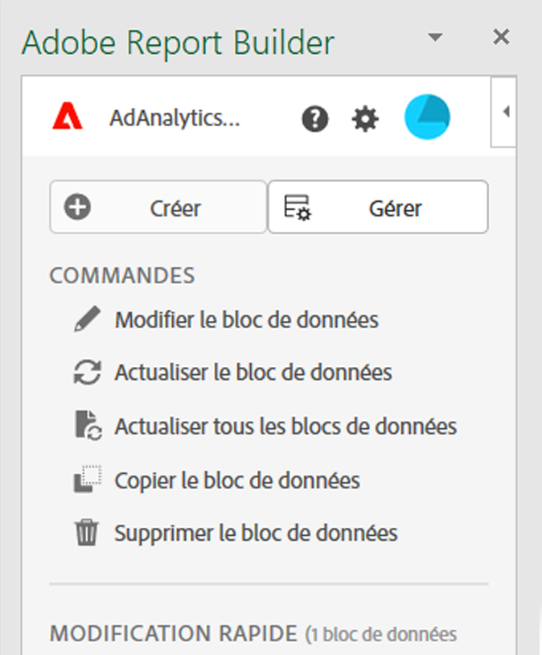
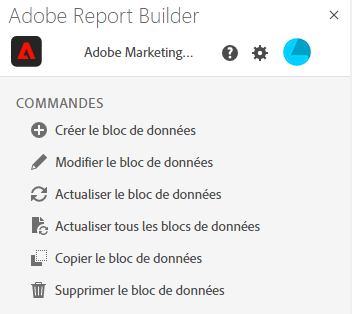
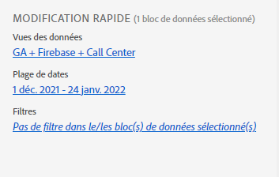
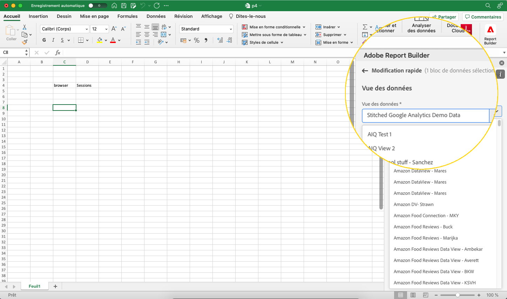

# Centre Report Builder

Utilisez le centre de Report Builder pour créer, mettre à jour, supprimer et gérer des blocs de données.

Le hub de Report Builder contient les boutons Créer et Gérer, la liste COMMANDES et les panneaux d’édition RAPIDE.




## Boutons Créer et gérer

Utilisez les boutons Créer ou Gérer pour créer de nouveaux blocs de données ou gérer des blocs de données existants.

## Panneau COMMANDES

Utilisez le panneau COMMANDES pour accéder aux commandes compatibles avec les cellules sélectionnées ou à une action précédente.



### Commandes

| Commandes affichées | Disponible lorsque… | Rôle |
|------|------------------|--------|
| Créer un bloc de données | Une ou plusieurs cellules sont sélectionnées dans le classeur. | Sert à créer un bloc de données |
| Modifier le bloc de données | La ou les cellules sélectionnées font partie d’un seul bloc de données. | Sert à modifier un bloc de données |
| Actualiser le bloc de données | La sélection contient au moins un bloc de données. La commande actualise uniquement les blocs de données de la sélection. | Sert à actualiser un ou plusieurs blocs de données |
| Actualiser tous les blocs de données | Le classeur contient un ou plusieurs blocs de données. | Sert à actualiser TOUS les blocs de données dans le classeur |
| Copier le bloc de données | La cellule ou la plage de cellules sélectionnée fait partie d’un ou de plusieurs blocs de données. | Sert à copier un bloc de données |
| Supprimer le bloc de données | La ou les cellules sélectionnées font partie d’un seul bloc de données. | Sert à supprimer un bloc de données |

## Panneau ÉDITION RAPIDE

Lorsque vous sélectionnez un ou plusieurs blocs de données dans une feuille de calculs, Report Builder affiche le panneau ÉDITION RAPIDE. Vous pouvez utiliser le panneau ÉDITION RAPIDE pour modifier les paramètres d’un seul ou de plusieurs blocs de données en même temps.



Les modifications effectuées à l’aide des sections Édition rapide s’appliquent à tous les blocs de données sélectionnés.

### Vues des données

Les blocs de données extraient des données d’une vue de données sélectionnée. Si plusieurs blocs de données sont sélectionnés dans une feuille de calculs et qu’ils n’extraient pas les données de la même vue de données, le lien **Vues des données** affiche *Multiples*.

Lorsque vous modifiez la vue de données, tous les blocs de données de la sélection adoptent la nouvelle vue de données. Les composants du bloc de données sont associés à la nouvelle vue de données en fonction de l’identifiant, par exemple la correspondance ```evars```). Si un composant est introuvable dans un bloc de données, un message d’avertissement s’affiche et le composant est supprimé du bloc de données.

Pour modifier la vue de données, sélectionnez une nouvelle vue de données dans le menu déroulant.



### Période

**Période** affiche la période des blocs de données sélectionnés. Si plusieurs blocs de données sont sélectionnés avec plusieurs périodes, le lien **Période** affiche *Multiples*.

### Filtres

Le lien **Filtres** affiche une liste récapitulative des filtres utilisés par les blocs de données sélectionnés. Si plusieurs blocs de données sont sélectionnés avec plusieurs filtres, le lien **Filtres** affiche *Multiples*.
