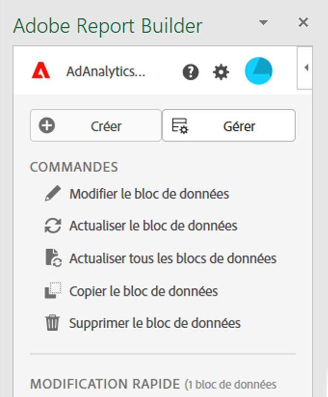

# Hub Report Builder

Le hub Report Builder est le volet de droite qui s’affiche dans votre classeur Excel lorsque vous sélectionnez  **[!UICONTROL Report Builder]** dans la barre de ruban Excel.

Utilisez le centre Report Builder pour créer, mettre à jour, supprimer et gérer des blocs de données.

Le hub Report Builder contient les boutons  **[!UICONTROL Create]**,  **[!UICONTROL Manage]** et Schedule **[!UICONTROL , le panneau]** Commands **[!UICONTROL et le panneau]** Quick edit ****.

{zoomable="yes"}

Sélectionner

*  **[!UICONTROL Create]** pour [créer de nouveaux blocs de données](create-a-data-block.md).
*  **[!UICONTROL Manage]** pour [gérer les blocs de données existants](manage-reportbuilder.md).
*  **[!UICONTROL Planification]** pour [gérer les planifications afin d’envoyer votre classeur par e-mail](schedule-reportbuilder.md).

## Panneau Commandes

Utilisez le panneau **[!UICONTROL Commandes]** pour accéder aux commandes compatibles avec les cellules sélectionnées ou à une action précédente.

| Commandes | Disponible lorsque… | Rôle |
|------|------------------|--------|
|  **[!UICONTROL Modifier le bloc de données]** | La ou les cellules sélectionnées font partie d’un seul bloc de données. | Permet de modifier un bloc de données. |
|  **[!UICONTROL Actualiser le bloc de données]** | La sélection contient au moins un bloc de données. La commande actualise uniquement les blocs de données de la sélection. | Permet d’actualiser un ou plusieurs blocs de données. |
|  **[!UICONTROL Actualiser tous les blocs de données]** | Le classeur contient un ou plusieurs blocs de données. | Permet d’actualiser tous les blocs de données du classeur |
|  **[!UICONTROL Envoyer le classeur]** | Le classeur contient un ou plusieurs blocs de données. | Utilisez pour [envoyer le classeur en tant que fichier par e-mail](schedule-reportbuilder.md). |
|  **[!UICONTROL Copier le bloc de données]** | La cellule ou la plage de cellules sélectionnée fait partie d’un ou de plusieurs blocs de données. | Permet de copier un bloc de données. |
|  **[!UICONTROL Couper le bloc]** | La cellule ou la plage de cellules sélectionnée fait partie d’un ou de plusieurs blocs de données. | Utilisez pour couper un bloc de données. |
|  **[!UICONTROL Supprimer le bloc de données]** | La ou les cellules sélectionnées font partie d’un seul bloc de données. | Utiliser pour supprimer un bloc de données |

## Panneau Modification rapide

Lorsque vous sélectionnez un ou plusieurs blocs de données dans une feuille de calcul, Report Builder affiche le panneau **[!UICONTROL Modification rapide]**. Vous pouvez utiliser le panneau **[!UICONTROL Modification rapide]** pour modifier simultanément des paramètres dans un ou plusieurs blocs de données.

Les modifications que vous apportez lorsque vous utilisez les sections **[!UICONTROL Modification rapide]** s’appliquent à tous les blocs de données sélectionnés.

### Vues des données

Les blocs de données extraient des données d’une vue de données sélectionnée. Si plusieurs blocs de données sont sélectionnés dans une feuille de calcul et qu’ils n’extraient pas les données de la même vue de données, le lien **Vues des données** s’affiche **[!UICONTROL _Multiple_]**.

Lorsque vous modifiez la vue de données, tous les blocs de données de la sélection adoptent la nouvelle vue de données. Les composants du bloc de données sont associés à la nouvelle vue de données en fonction de l’identifiant. Si un composant est introuvable dans un bloc de données, il est supprimé et remplacé par **[!UICONTROL Valeur non valide]** ou un  s’affiche pour le composant spécifique.

Pour modifier la vue de données, sélectionnez une nouvelle vue de données dans le menu déroulant **[!UICONTROL Vue de données]**.

### Période

**Période** affiche la période des blocs de données sélectionnés. Si plusieurs blocs de données sont sélectionnés avec plusieurs périodes, le lien **[!UICONTROL Période]** s’affiche **[!UICONTROL _Multiple_]**.

### Segments

Le lien **Segments** affiche une liste récapitulative des segments utilisés par les blocs de données sélectionnés. Si plusieurs blocs de données sont sélectionnés avec plusieurs segments appliqués, le lien **Segments** s’affiche **[!UICONTROL _Multiple_]**.

>[!MORELIKETHIS]
>
>[Sélectionner une vue de données](select-data-view.md)
>[Sélectionner une période](select-date-range.md)
>[Utiliser des filtres](work-with-filters.md)
>
