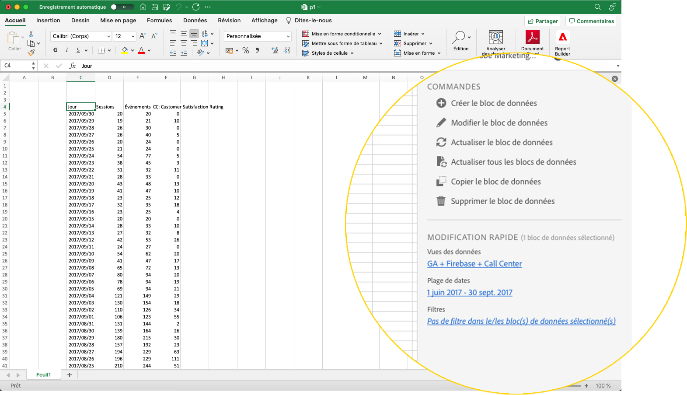

# Report Builder Hub

Utilisez le hub de Report Builder pour créer, mettre à jour ou supprimer des blocs de données.

Le hub de Report Builder contient les panneaux COMMANDES et QUICK EDIT .



## Panneau COMMANDES

Utilisez le panneau COMMANDES pour accéder aux commandes compatibles avec les cellules sélectionnées ou à une action précédente.


### Commandes

| Commandes affichées | Disponible lorsque.. | Rôle |
|------|------------------|--------|
| Créer un bloc de données | Une ou plusieurs cellules sont sélectionnées dans le classeur. | Utilisé pour créer un bloc de données |
| Modifier le bloc de données | La ou les cellules sélectionnées font partie d’un seul bloc de données. | Utilisé pour modifier un bloc de données |
| Actualiser le bloc de données | La sélection contient au moins un bloc de données. La commande actualise uniquement les blocs de données de la sélection. | Utilisé pour actualiser un ou plusieurs blocs de données |
| Actualiser tous les blocs de données | Le classeur contient un ou plusieurs blocs de données. | Utilisé pour actualiser TOUS les blocs de données dans le classeur |
| Copie du bloc de données | La cellule ou la plage de cellules sélectionnée fait partie d’un ou de plusieurs blocs de données. | Utilisé pour copier un bloc de données |
| Supprimer le bloc de données | La ou les cellules sélectionnées font partie d’un seul bloc de données. | Utilisé pour supprimer un bloc de données |

## Panneau MODIFICATION RAPIDE

Lorsque vous sélectionnez un ou plusieurs blocs de données dans une feuille de calcul, Report Builder affiche le panneau MODIFICATION RAPIDE . Vous pouvez utiliser le panneau RAPIDE D’ÉDITION pour modifier les paramètres d’un seul bloc de données ou pour modifier les paramètres de plusieurs blocs en même temps.


Les modifications effectuées à l’aide des sections Modification rapide s’appliquent à tous les blocs de données sélectionnés.

### Vues des données

Les blocs de données extraient des données d’une vue de données sélectionnée. Si plusieurs blocs de données sont sélectionnés dans une feuille de calcul et qu’ils n’extraient pas les données de la même vue de données, le lien **Vues de données** affiche *Multiple*.

Lorsque vous modifiez la vue de données, tous les blocs de données de la sélection adoptent la nouvelle vue de données. Les composants du bloc de données sont associés à la nouvelle vue de données en fonction de l’ID, par exemple en correspondance avec ```evars```. Si un composant est introuvable dans un bloc de données, un message d’avertissement s’affiche et le composant est supprimé du bloc de données.

Pour modifier la vue de données, sélectionnez une nouvelle vue de données dans le menu déroulant.


### Période

**La** plage de dates détermine la plage de dates des blocs de données sélectionnés. Si plusieurs blocs de données sont sélectionnés avec plusieurs plages de dates, le lien **Plage de dates** affiche *Multiple*.

### Filtres

Le lien **Filtres** affiche une liste récapitulative des filtres utilisés par les blocs de données sélectionnés. Si plusieurs blocs de données sont sélectionnés avec plusieurs filtres appliqués, le lien **Filtres** affiche *Multiple*.
