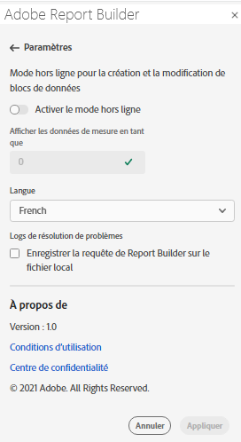

# Paramètres de Report Builder

Utilisez le volet **Paramètres** pour configurer les paramètres au niveau de l’application, tels que la langue affichée par l’interface utilisateur, ou si vous souhaitez travailler ou non en mode hors ligne. Les paramètres sont appliqués immédiatement et ils sont définis pour toutes les sessions suivantes jusqu’à ce qu’ils soient modifiés.

Pour modifier les paramètres du Report Builder

1. Cliquez sur l’icône **Paramètres** .

1. Apportez des modifications au mode hors ligne, sélectionnez une langue ou activez les paramètres du journal de dépannage.

1. Cliquez sur **Appliquer**.

   

## Mode hors ligne

Lors de la création et de la modification d&#39;un bloc de données en mode hors ligne, les données ne sont pas récupérées. Au lieu de cela, les données de la simulation sont utilisées afin que vous puissiez rapidement créer et éditer un bloc de données sans attendre l&#39;exécution de la requête. Lorsque vous êtes de retour en ligne, la commande *Actualiser le bloc de données* ou *Actualiser tous les blocs de données* actualise les blocs de données que vous avez créés avec des données réelles.

Pour activer le mode hors ligne

1. Cliquez sur l’icône **Paramètres** .

1. Sélectionnez **Activer le mode hors ligne**.

1. Saisissez un entier positif dans le champ **Afficher les données de mesure sous la forme**.

1. Cliquez sur **Appliquer**.

## Langue

Vous pouvez choisir la langue de l’interface utilisateur de Report Builder. Toutes les langues Adobe Analytics prises en charge sont disponibles.

Pour sélectionner la langue utilisée dans l’interface utilisateur de Report Builder

1. Cliquez sur Paramètres.

1. Sélectionnez une langue dans le menu déroulant **Langue** .

   

1. Cliquez sur **Appliquer.**

## Résolution des problèmes

Utilisez le paramètre de dépannage pour consigner toutes les données client/serveur dans un fichier local. Utilisez cette option pour résoudre les tickets d’assistance.

Pour activer l’option Dépannage , sélectionnez **Enregistrer la requête du créateur de rapports dans le fichier local**.
