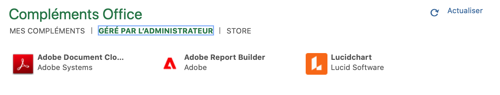
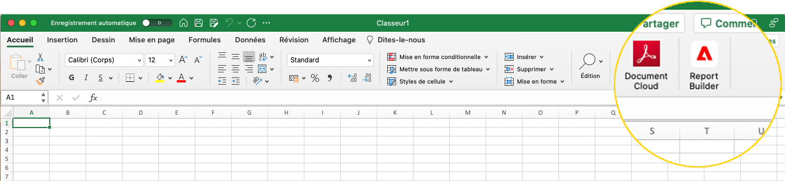
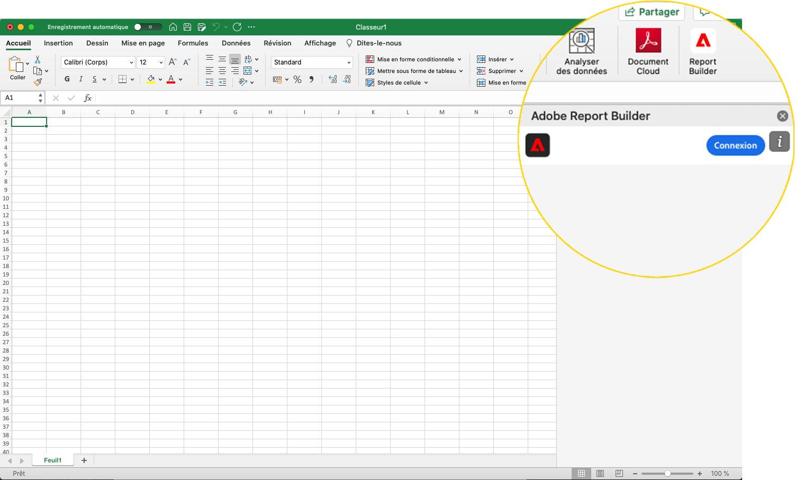
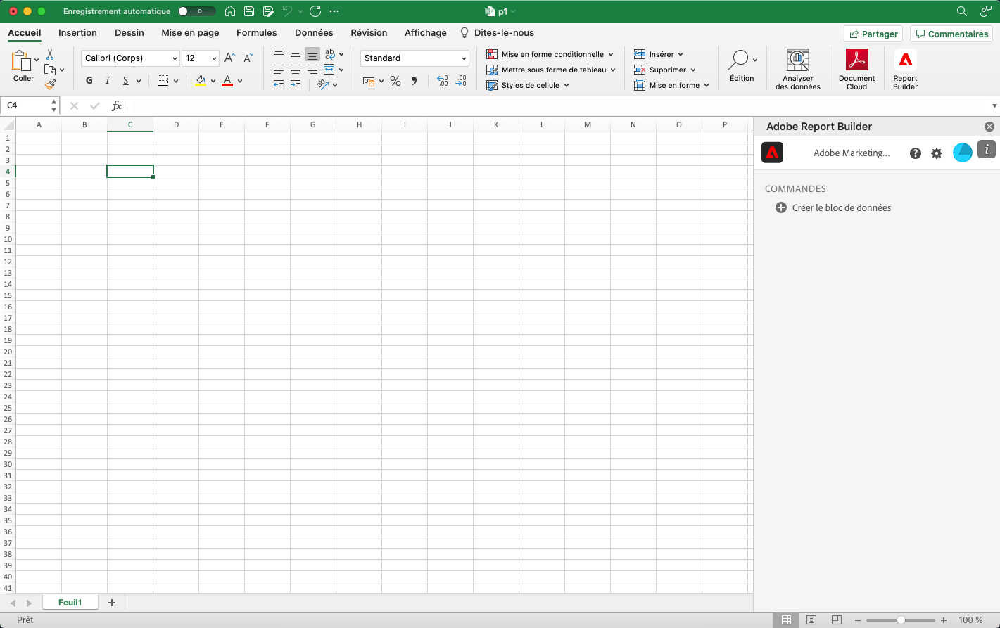
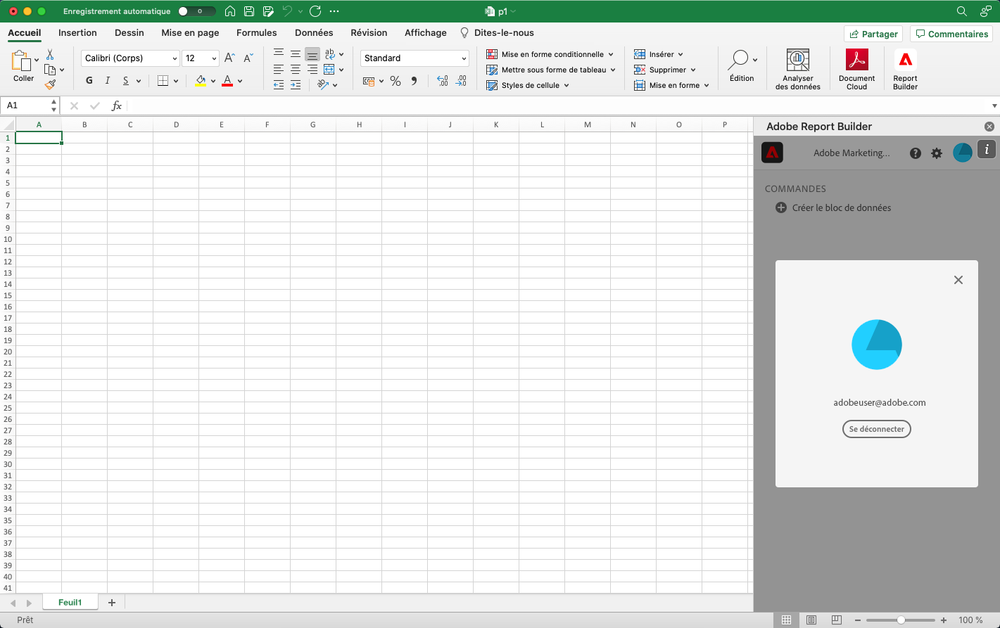

# Configuration de Report Builder

Vous pouvez accéder rapidement au Report Builder à l’aide du menu Complément d’Excel.

## Configuration requise

Report Builder pour Customer Journey Analytics est pris en charge sur les systèmes d’exploitation et navigateurs web suivants.

### macOS

- macOS version 10.x ou ultérieure
- Toutes les versions d’Excel

### Windows

- Windows 10, version 1904 ou ultérieure
- Excel version 2106 ou ultérieure

   Tous les utilisateurs d’Excel pour Windows doivent installer Microsoft Edge Webview2 pour utiliser le module complémentaire. Pour installer le contrôleur :

   1. Accédez à <http://aka.ms/webview2installer>.
   1. Sélectionnez et téléchargez le programme d’installation autonome Evergreen.
   1. Suivez les instructions d’installation.

### Web Office

- Prise en charge de tous les navigateurs et versions

## Module complémentaire Excel Report Builder

Vous devez installer le Report Builder Excel Add-in pour utiliser Report Builder pour Customer Journey Analytics. Une fois le module complémentaire Excel Report Builder installé, vous pouvez accéder au Report Builder à partir d’un classeur Excel ouvert.

### Télécharger et installer le module complémentaire Report Builder

Téléchargement et installation du module complémentaire Report Builder

1. Lancez Excel et ouvrez un nouveau classeur.

1. Choisissez Insertion > Obtenir les modules complémentaires.

1. Dans la boîte de dialogue Compléments Office, sélectionnez l’onglet Magasin .

1. Recherchez &quot;Report Builder&quot; et cliquez sur Ajouter.

1. Dans la boîte de dialogue Conditions de licence et politique de confidentialité, cliquez sur Continuer.

**Si l’onglet Magasin n’est pas affiché**

1. Dans Excel, choisissez Fichier > Compte > Gérer les paramètres.

1. Cochez la case en regard de &quot;Activer les expériences connectées facultatives&quot;.

1. Redémarrez Excel.

**Si votre entreprise bloque l’accès au Microsoft Store**

Contactez votre équipe informatique ou de sécurité pour demander l’approbation du module complémentaire de Report Builder. Une fois l’approbation accordée, dans la boîte de dialogue Compléments Office, sélectionnez l’onglet Administration gérée .

Une fois le module complémentaire de Report Builder installé, l’icône de Report Builder s’affiche dans le ruban Excel sous l’onglet Accueil .

## Connexion au Report Builder

Après avoir installé le module complémentaire Report Builder for Excel pour votre plateforme d’exploitation ou navigateur, procédez comme suit pour vous connecter à Report Builder.

1. Ouvrez un classeur Excel.

1. Cliquez sur l’icône Report Builder pour lancer le Report Builder.

1. Dans la barre d’outils Adobe Report Builder, cliquez sur **Connexion**.

   

1. Renseignez les informations de votre compte Adobe Experience ID. Les informations de votre compte doivent correspondre à vos informations d’identification de Customer Journey Analytics.

   

Une fois connecté, votre icône de connexion et votre organisation s’affichent en haut du panneau.

## Changement d’organisation

Lorsque vous vous connectez pour la première fois, vous êtes connecté à l’organisation par défaut affectée à votre profil.

1. Cliquez sur le nom de l’organisation qui s’affiche lorsque vous vous connectez.

1. Sélectionnez une organisation dans la liste des organisations disponibles. Seules les organisations auxquelles vous avez accès sont répertoriées.

   

## Vous déconnecter ;

Vous pouvez vous déconnecter du Report Builder à partir du profil utilisateur.

1. Enregistrez les modifications dans les classeurs ouverts.

1. Cliquez sur l’icône d’avatar pour afficher votre profil utilisateur.

   

1. Cliquez sur **Se déconnecter**.
