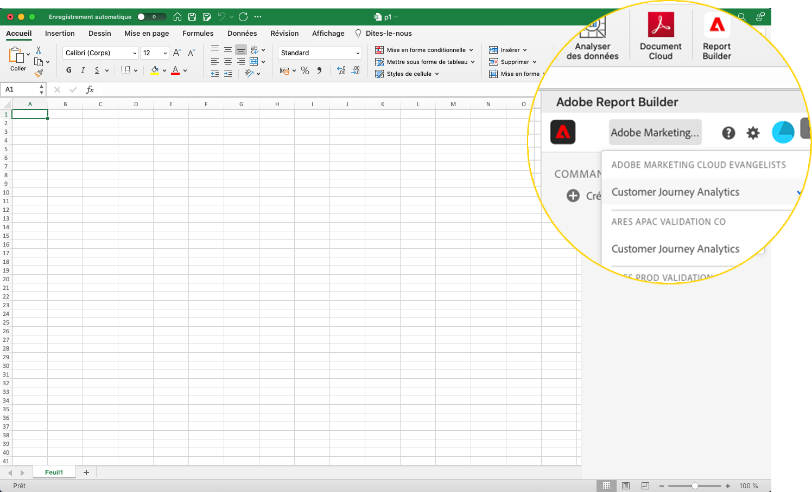

# Configuration de Report Builder

Cet article décrit les conditions requises pour utiliser Report Builder for Customer Journey Analytics dans Microsoft Excel. Découvrez également comment installer et configurer le complément.

## Exigences

Report Builder pour Customer Journey Analytics est pris en charge dans les systèmes d’exploitation et navigateurs web ci-après.

### macOS

- macOS, version 10.x ou ultérieure
- Toutes les versions dʼExcel

### Windows

- Windows 10, version 1904 ou ultérieure
- Excel, version 2106 ou ultérieure

  Tous les utilisateurs Excel sur ordinateurs de bureau Windows doivent installer Microsoft Edge Webview2 afin de pouvoir utiliser le complément. Pour installer :

   1. Accédez à <https://developer.microsoft.com/en-us/microsoft-edge/webview2/>.
   1. Sélectionnez et téléchargez la version appropriée du **[!UICONTROL programme d’installation autonome Evergreen]** pour votre plateforme.
   1. Exécutez le programme d’installation et suivez les invites d’installation.

### Office pour le web

- Prend en charge tous les navigateurs et versions.

## Complément Report Builder Excel

Installez le complément Report Builder Excel pour utiliser Report Builder for Customer Journey Analytics. Une fois que vous avez installé le complément Report Builder Excel, vous pouvez accéder à Report Builder depuis un classeur Excel ouvert.

### Téléchargement et installation du complément Report Builder

Pour télécharger et installer le complément Report Builder

1. Lancez Excel et ouvrez un nouveau classeur.

1. Sélectionnez **[!UICONTROL Insérer]** > **[!UICONTROL Compléments]** > **[!UICONTROL Obtenir les compléments]** dans le menu principal.

1. Dans la boîte de dialogue Compléments Office, sélectionnez l&#39;onglet **[!UICONTROL Store]**.

1. Recherchez `Report Builder` et sélectionnez **[!UICONTROL Ajouter]**.

1. Dans la boîte de dialogue Termes de licence et politique de confidentialité, sélectionnez **[!UICONTROL Continuer]**.

Si l’onglet **[!UICONTROL Store]** n’est pas affiché :

1. Dans Excel, sélectionnez **[!UICONTROL Fichier]** > **[!UICONTROL Compte]** > **[!UICONTROL Gérer les paramètres]** dans le menu principal.

1. Cochez la case en regard de **[!UICONTROL Activer les expériences connectées facultatives]**.

1. Redémarrez Excel.

Si votre entreprise bloque l’accès au magasin Microsoft :

- Contactez votre équipe informatique ou de sécurité pour demander l’approbation du complément Report Builder. Une fois l&#39;approbation accordée, dans la boîte de dialogue Office **[!UICONTROL Compléments]**, sélectionnez l&#39;onglet **[!UICONTROL Administrateur géré]**.

  {zoomable="yes"}

Après l&#39;installation du complément Report Builder, l&#39;icône  **[!UICONTROL Report Builder]** s&#39;affiche dans le ruban Excel sous l&#39;onglet **[!UICONTROL Accueil]**.

{zoomable="yes"}

## Connexion à Report Builder

Après avoir installé le complément Report Builder for Excel pour votre plateforme d’exploitation ou votre navigateur, procédez comme suit pour vous connecter à Report Builder.

1. Ouvrez un classeur Excel.

1. Sélectionnez  **[!UICONTROL Report Builder]** pour lancer Report Builder.

1. Dans la barre d’outils de Adobe Report Builder, sélectionnez **[!UICONTROL Connexion]**.

   {zoomable="yes"}

1. Saisissez les informations relatives à votre compte Adobe. Les informations de votre compte doivent correspondre aux informations dʼidentification de Customer Journey Analytics.

   {zoomable="yes"}

Une fois connecté, votre icône de connexion et votre organisation sʼaffichent en haut du panneau.

## Changement dʼorganisation

Lorsque vous vous connectez pour la première fois, vous êtes connecté à l’organisation par défaut affectée à votre profil ou à l’organisation que vous avez sélectionnée dans le cadre du flux de connexion.

1. Sélectionnez le nom de l’organisation qui s’affiche lorsque vous vous connectez.

1. Sélectionnez une organisation dans la liste des organisations disponibles. Seules les organisations auxquelles vous avez accès sont répertoriées.

   {zoomable="yes"}

## Vous déconnecter ;

Pour vous déconnecter de Report Builder :

1. Enregistrez les modifications dans les classeurs ouverts.

1. Sélectionnez l’icône en forme d’avatar pour afficher votre profil utilisateur.

   {zoomable="yes"}

1. Sélectionnez **[!UICONTROL Se déconnecter]**.
