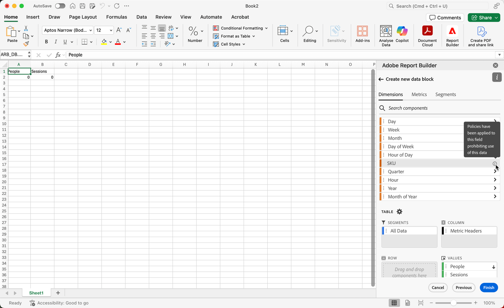
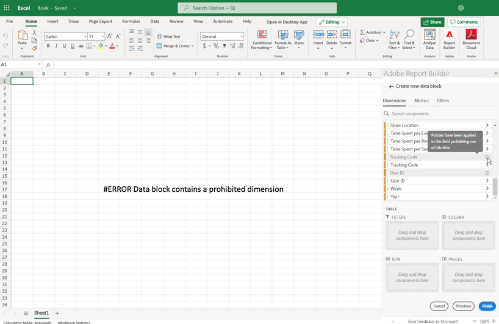

# Libellés restreints dans Report Builder

En règle générale, les paramètres liés à la gouvernance de données dans Customer Journey Analytics sont hérités d’Experience Platform. L’intégration entre la gouvernance des données Customer Journey Analytics et Experience Platform permet l’étiquetage des données Customer Journey Analytics sensibles et l’application des politiques de confidentialité.

Les étiquettes de confidentialité et les politiques créées sur les jeux de données consommés par Experience Platform peuvent être affichées dans le workflow des vues de données Customer Journey Analytics. Ces libellés arrêtent ou avertissent les utilisateurs qui créent des mesures et des dimensions à partir de champs sensibles. Pour plus d’informations sur les jeux de données, consultez la [Présentation des jeux de données](https://experienceleague.adobe.com/fr/docs/experience-platform/catalog/datasets/overview)

En outre, lorsque des données sont exportées à partir de Customer Journey Analytics (par le biais de rapports, d’exports, d’API, etc.), des avertissements ou des libellés sont ajoutés afin d’informer les personnes qu’un rapport contient des informations sensibles qui doivent être traitées d’une manière spécifique.

Cette intégration vous permet de gérer la conformité. Les gestionnaires de données de votre entreprise peuvent définir des politiques pour restreindre l’utilisation. Par conséquent, vos utilisateurs et utilisatrices Customer Journey Analytics peuvent utiliser les données de manière plus sécurisée, tout en sachant qu’elles sont conformes aux politiques définies par les gestionnaires de données.

Pour plus d’informations, voir [Customer Journey Analytics et gouvernance des données](https://experienceleague.adobe.com/fr/docs/analytics-platform/using/cja-privacy/privacy-overview)

## Afficher les données limitées

Deux politiques définies par Adobe sont affichées dans Customer Journey Analytics et affectent la création de rapports, le téléchargement et le partage :

* Politique Application d’Analytics
* Politique Application du téléchargement

Les composants soumis à ces politiques sont grisés et possèdent une icône . Lorsque vous pointez sur l’icône d’informations, une note s’affiche pour indiquer les éléments suivants : **[!UICONTROL Des politiques ont été appliquées à ce champ pour interdire l’utilisation de ces données]**.

Pour plus d’informations, voir [&#x200B; Étiquettes et politiques &#x200B;](https://experienceleague.adobe.com/fr/docs/analytics-platform/using/cja-dataviews/data-governance).

{zoomable="yes"}

## Mettre à jour les rapports contenant des données restreintes

Dans les cas où un utilisateur a créé un rapport Report Builder avec des éléments de données ultérieurement limités, un message d’erreur s’affiche lorsque le rapport est actualisé.

{width="100%" zoomable="yes"}
