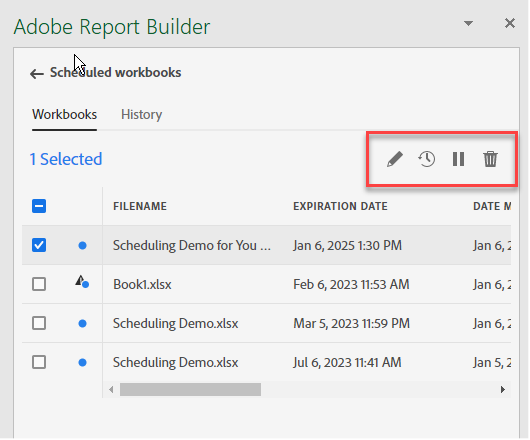

# Planification de classeurs

Une fois le classeur enregistré et l’analyse terminée, vous pouvez facilement le partager avec d’autres membres de votre équipe à l’aide de la fonction de planification. La fonction Planification vous permet de créer une planification qui actualise automatiquement les données du classeur et d’envoyer par courrier électronique le fichier .xlsx du classeur Excel en pièce jointe de votre audience spécifiée à une date et une heure spécifiques. La configuration d’un planning permet aux destinataires de recevoir des mises à jour régulières et automatiquement. Vous pouvez également utiliser la fonction de planification pour envoyer le classeur une fois sans planifier de mises à jour automatiques.

Vous pouvez créer plusieurs plannings pour un seul classeur. Par exemple, vous pouvez envoyer un classeur à votre équipe tous les jours et l’envoyer à votre responsable une fois par semaine en créant deux plannings différents.

La fonction Planification vous permet également de configurer la protection par mot de passe d’un classeur et de modifier les classeurs planifiés précédemment.

>[!VIDEO](https://video.tv.adobe.com/v/3413079/?quality=12&learn=on)

## Planification d’un classeur

Utilisez le bouton Planifier la tâche dans le centre de Report Builder pour créer rapidement une planification afin de pouvoir distribuer automatiquement un fichier Excel de classeur (.xlsx) à un individu ou à un groupe.

1. Cliquez sur le bouton Planifier dans le centre de Report Builder.

   {width="55%"}

1. Cliquez sur Planifier le classeur ou sur le bouton Plus dans le coin supérieur gauche pour créer un classeur planifié.

   {width="55%"}

   Le volet Planification affiche des informations prédéfinies sur le classeur, telles que le nom du classeur et la date de dernière modification.

   {width="55%"}

1. (Facultatif) Saisissez un nom de fichier.

   Par défaut, le nom du fichier de classeur est celui du classeur, mais vous pouvez le modifier si vous le souhaitez. Si vous envoyez le même classeur à plusieurs audiences et que vous souhaitez lui donner un nom un peu plus convivial pour une certaine audience, vous pouvez changer son nom.

1. (Facultatif) Sélectionnez **Ajout d’un horodatage au nom de fichier**.

   Vous pouvez ajouter un horodatage au nom du fichier pour identifier la date à laquelle le classeur a été mis à jour. Cela s’avère utile pour déterminer rapidement la version d’un classeur qui a été envoyée à une date spécifique. Le **Aperçu du nom de fichier** indique comment le nom de fichier du classeur apparaîtra dans le courrier électronique lors de la distribution du classeur. Le format d’horodatage est AAAA-MM-JJ.

1. (Facultatif) Sélectionnez **compression .zip** pour compresser le fichier et configurer la protection par mot de passe sur le fichier.

   Lorsque vous effectuez cette sélection, vous êtes invité à saisir un mot de passe pour ouvrir le fichier. Cela s’avère utile si vous avez des préoccupations concernant la sécurité des données et si vous souhaitez que le mot de passe protège le classeur. Pour protéger le fichier avec un mot de passe, vous devez sélectionner **compression .zip**. Le mot de passe doit comporter au moins 8 caractères et contenir un nombre ainsi qu’un caractère spécial.

   {width="55%"}

1. Entrée **Destinataires**. Vous pouvez saisir le nom d’une personne reconnue dans votre organisation ou saisir l’adresse électronique d’une personne au sein ou en dehors de votre organisation.

1. Saisissez le **Objet** de l&#39;email et une description pour vos destinataires. Par défaut, l’objet correspond au nom du fichier du classeur, mais vous pouvez modifier l’objet si nécessaire. Vous pouvez ajouter des détails dans la section de description.

   {width="55%"}

1. Configurez les options de planification pour définir la date et l’heure auxquelles le classeur doit être envoyé par courrier électronique aux destinataires.

   Sélectionnez les dates et heures de début et de fin. Il peut s’agir de la date d’aujourd’hui ou d’une date ultérieure.

   Choisissez la **Fréquence** dans le menu déroulant. Vous pouvez définir la fréquence sur une fréquence horaire, quotidienne, hebdomadaire, mensuelle ou annuelle pour un jour spécifique. Par exemple, vous pouvez configurer une planification pour envoyer le classeur le premier dimanche soir du mois afin que vos destinataires reçoivent le premier message électronique dans leur boîte de réception le lundi matin.

   {width="55%"}

1. Une fois le planning défini, cliquez sur **Envoyer selon le calendrier**.

   {width="55%"}

   Un toast de confirmation s’affiche au bas du centre de Report Builder et le classeur planifié est répertorié sous l’onglet Classeurs .

   {width="55%"}

## Envoi unique du classeur

Vous pouvez également envoyer le classeur une seule fois.

1. Désélectionner **Afficher les options de planification**

   {width="40%"}

1. Cliquez sur **Envoyer maintenant**.

## Affichage et modification de classeurs planifiés

Vous pouvez afficher et gérer tous les classeurs planifiés à un seul emplacement sous l’onglet Classeurs .

1. Dans la section Planning du hub de Report Builder, cliquez sur l’onglet Classeurs . Utilisez cette vue pour afficher la liste de tous les classeurs planifiés.

1. Sélectionnez un classeur. Plusieurs outils s’affichent pour vous permettre de modifier le classeur, de modifier le planning, de suspendre et de redémarrer le planning, ou de supprimer le planning.

   {width="55%"}

* (Facultatif) Cliquez sur l’icône représentant un crayon pour modifier la planification du classeur.

* (Facultatif) Cliquez sur l’icône de l’horloge pour afficher l’historique de chaque tâche planifiée.

* (Facultatif) Cliquez sur l’icône de pause pour suspendre et redémarrer le planning de distribution. Cela s’avère utile si vous devez modifier le classeur avant l’envoi du classeur. Cliquez de nouveau sur l’icône de pause lorsque vous souhaitez redémarrer la distribution.

* (Facultatif) Cliquez sur la corbeille pour supprimer le planning.

## Vérification de l’état des tâches planifiées

La vue Historique vous permet de consulter l’état de chaque tâche planifiée. Il existe une ligne distincte qui documente le changement d’état pour chaque tâche planifiée. Dans l’exemple ci-dessous, la variable *Nouvelle planification horaire* a été lancée le 5 janvier à 15h04. A 15h05, il a été actualisé et envoyé aux destinataires. le classeur suivant, *classeur incorrect*, une erreur s’est produite lors du processus d’actualisation. Si l’envoi d’un classeur a échoué, l’onglet Historique vous aide à résoudre les problèmes en indiquant l’emplacement de l’erreur dans le processus. Dans ce cas, c’est probablement en raison d’une erreur de bloc de données, peut-être d’un composant manquant, qui a empêché l’actualisation du classeur.

Une coche verte indique que le classeur a bien été envoyé. Un point d’exclamation dans un triangle rouge indique qu’une erreur s’est produite.

Vous pouvez choisir les colonnes à afficher dans l’onglet Historique en cliquant sur l’icône de paramétrage des colonnes située à droite de la barre de recherche.

{width="55%"}

Vous pouvez filtrer l’historique pour n’afficher que celui d’un seul classeur planifié en vous rendant dans l’onglet des classeurs , en le sélectionnant et en cliquant sur l’icône Historique .

Vous pouvez également afficher l’historique d’un classeur spécifique à partir de l’onglet Classeurs . Dans l’onglet Classeurs , sélectionnez le classeur, puis cliquez sur l’icône Historique.

{width="55%"}

Le filtre de classeur s’affiche alors en haut de l’historique. Pour afficher à nouveau l’historique de toutes les tâches planifiées, cliquez sur le x en regard du filtre.

{width="55%"}

