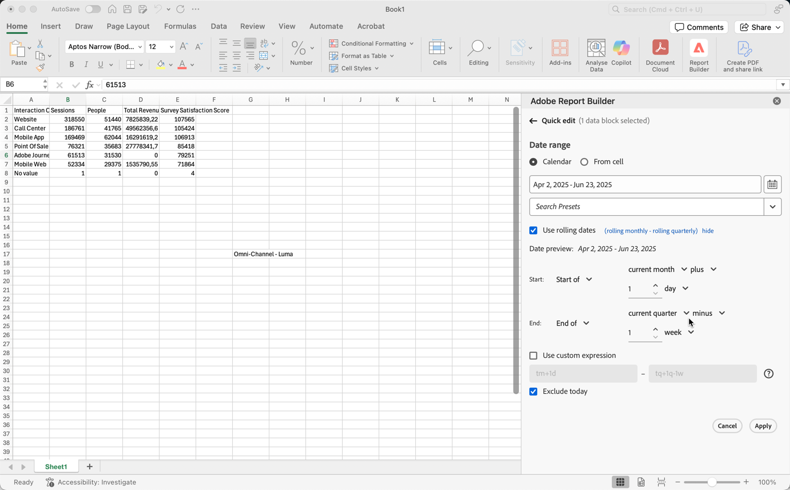

# Sélectionner une période

Pour modifier la période d’un bloc de données existant :

- Sélectionnez **[!UICONTROL Modifier un bloc de données]** ou
- Sélectionnez le lien **[!UICONTROL Période]** dans **[!UICONTROL Modification rapide]**.

Utilisez les options suivantes pour modifier une période dʼun bloc de données.

## Calendrier

L’option **[!UICONTROL Calendrier]** vous permet de créer des dates statiques ou flottantes à l’aide des options suivantes :

### Période

Le champ de période affiche la période en cours pour la requête du bloc de données. Vous pouvez saisir des dates directement ou utiliser  pour spécifier une période.

{zoomable="yes"}

### Paramètres prédéfinis

Utilisez le menu déroulant des paramètres prédéfinis pour sélectionner un paramètre prédéfini. Vous pouvez également saisir du texte pour rechercher des paramètres prédéfinis.

{zoomable="yes"}

Le menu déroulant des paramètres prédéfinis comprend un ensemble standard de périodes et de composants de période prédéfinis pour une vue de données que vous avez enregistrée ou qui a été partagée avec vous.

### Dates roulantes

Pour définir des dates flottantes :

{zoomable="yes"}

1. Sélectionnez **[!UICONTROL Utiliser des dates flottantes]** pour définir la logique d’une définition de date flottante. Vous pouvez sélectionner le texte entre crochets (par exemple, **[!UICONTROL début fixe - roulement quotidien]**) pour étendre le panneau et spécifier des détails pour **[!UICONTROL Début]** et **[!UICONTROL Fin]**.

1. Sélectionnez **[!UICONTROL Début de]**, **[!UICONTROL Fin de]** ou **[!UICONTROL Jour fixe]**.

   - Lorsque vous avez sélectionné **[!UICONTROL Début de]** ou **[!UICONTROL Fin de]**, vous pouvez créer une expression complète. Par exemple : **[!UICONTROL Fin de]** **[!UICONTROL l’année en cours]** **[!UICONTROL plus]** `1` **[!UICONTROL jour]**. Sélectionnez la valeur appropriée pour chaque partie de l’expression.

      - Sélectionnez une valeur pour la période actuelle. Par exemple, **[!UICONTROL année en cours]**.
      - Sélectionnez une valeur pour un calcul supplémentaire facultatif. Par exemple, **[!UICONTROL plus]**.
      - Lorsque vous avez spécifié un calcul supplémentaire, indiquez une valeur. Par exemple : `1`.
      - Lorsque vous avez spécifié un calcul supplémentaire, sélectionnez la période à utiliser pour le calcul. Par exemple, **[!UICONTROL day]**.

   - Lorsque vous avez sélectionné **[!UICONTROL Jour fixe]**, spécifiez un jour fixe ou utilisez le sélecteur pour sélectionner un jour.

1. Sélectionnez **[!UICONTROL masquer]** pour masquer les détails du calcul des dates flottantes.

### Expressions personnalisées

Lʼoption dʼexpression personnalisée vous permet de modifier la période en créant une expression personnalisée ou en saisissant une formule arithmétique.

{zoomable="yes"}

1. Sélectionnez lʼoption **[!UICONTROL Utiliser des dates roulantes]**.

1. Sélectionnez ensuite **[!UICONTROL Utiliser une expression personnalisée]**.

   Lorsque vous sélectionnez **[!UICONTROL Utiliser une expression personnalisée]**, les contrôles standard des périodes flottantes sont désactivés.

1. Saisissez une [expression personnalisée](#create-a-custom-expression).

1. Utilisez l’**[!UICONTROL Aperçu de la date]** pour vérifier la période résultante.

#### Création dʼune expression personnalisée

1. Saisissez une [référence de date](#date-references).

1. Ajoutez un [opérateur de date](#date-operators) facultatif pour déplacer la date vers le passé ou le futur.

Vous pouvez saisir une expression personnalisée qui comprend plusieurs opérateurs, tels que `tm-11m-1d`.

#### Références de date

Le tableau suivant dresse une liste dʼexemples de références de date.

| Référence de date | Type | Description |
|----------------|--------------|----------------------------|
| `1/1/10` | Date statique | Saisie au format de date ISO |
| `td` | Date roulante | Début du jour en cours |
| `tw` | Date roulante | Début de la semaine en cours |
| `tm` | Date roulante | Début du mois en cours |
| `tq` | Date roulante | Début du trimestre en cours |
| `ty` | Date roulante | Début de lʼannée en cours |

#### Opérateurs de date

Le tableau suivant dresse une liste dʼexemples dʼopérateurs de date.

| Opérateur de date | Unité | Description |
|----------------|---------|--------------------|
| `+6d` | Jour | Ajout de 6 jours à la référence de date |
| `+1w` | Semaine | Ajout dʼune semaine complète à la référence de date |
| `-2m` | Mois | Soustraction de 2 mois complets à la référence de date |
| `-4q` | Trimestre | Soustraction de 4 trimestres à la référence de date |
| -`1y` | Année | Soustraction dʼune année à la référence de date |

#### Expressions de date

Le tableau suivant dresse une liste dʼexemples dʼexpressions de date.

| Expression de date | Signification |
|-----------------|--------------------------------------|
| `td` | Today |
| `td-1w` | Premier jour de la semaine dernière |
| `tm-1d` | Dernier jour du mois précédent |
| `td-52w` | Même jour, 52 semaines auparavant |
| `tm-11m-1d` | Dernier jour du même mois il y a un an |
| `"2020-09-06"` | Date précise, 9 septembre 2020 |

## Période à partir dʼune cellule

La période peut être spécifiée dans les cellules des feuilles de calcul. Utilisez l’option **[!UICONTROL Période à partir de la cellule]** pour choisir les dates de début et de fin du bloc de données dans les cellules sélectionnées. Lorsque vous sélectionnez l’option **[!UICONTROL À partir de la cellule]**, le panneau affiche les champs **[!UICONTROL De]** et **[!UICONTROL À]** dans lesquels vous pouvez saisir l’emplacement d’une cellule ou utiliser  pour sélectionner la cellule sélectionnée.

{zoomable="yes"}

## Exclure aujourdʼhui

Sélectionnez **[!UICONTROL Exclure aujourd’hui]** pour exclure aujourd’hui d’une période sélectionnée. Le jour en cours est exclu de tous les modes utilisés pour définir une période : calendrier, dates flottantes ou expressions personnalisées.

## Périodes valides

La liste suivante décrit les formats de période valides.

- Les dates de début et de fin doivent respecter le format suivant : AAAA-MM-JJ.

- La date de début doit être antérieure ou égale à la date de fin. Les deux dates peuvent être définies dans le futur.

- Lors de lʼutilisation de dates roulantes, la date de début doit correspondre au jour en cours ou à une date dans le passé. Le jour de début doit être dans le passé si l’option **[!UICONTROL Exclure aujourd’hui]** est sélectionnée.

- Vous pouvez créer une période fixe définie dans le futur. Par exemple, vous pourriez avoir besoin de définir une date dans le futur à lʼoccasion du lancement dʼune campagne marketing, prévue la semaine suivante. Cette option permet de créer une surveillance préalable des classeurs pour une campagne.

## Modification de la période

Vous pouvez modifier la période d’un bloc de données existant.

1. Sélectionnez une cellule dans votre bloc de données.

- Sélectionnez **[!UICONTROL Modifier le bloc de données]** dans le panneau **[!UICONTROL Commandes]** ou
- Sélectionnez le lien **[!UICONTROL Période]** dans le panneau **[!UICONTROL Modification rapide]**.

1. Modifiez la période à l’aide de l’une des options de sélection de date disponibles.

1. Sélectionnez **[!UICONTROL Appliquer]**.

Report Builder applique la nouvelle période à tous les blocs de données de la sélection.
