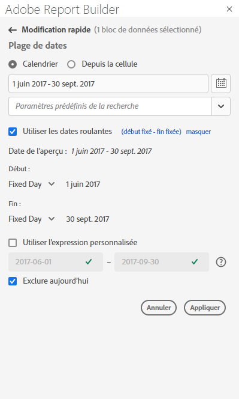
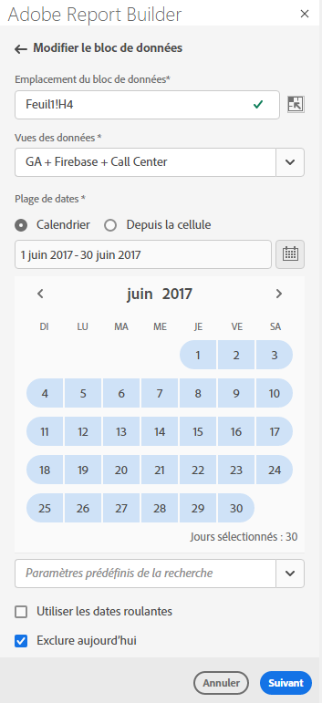
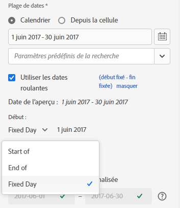
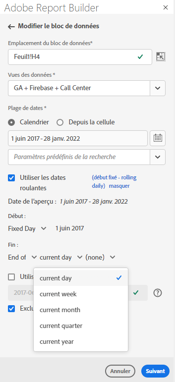
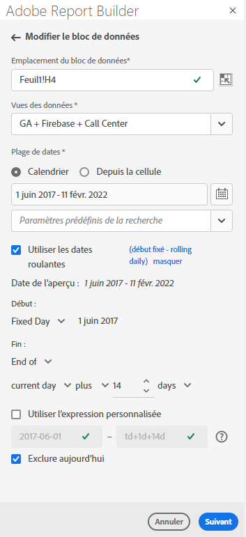
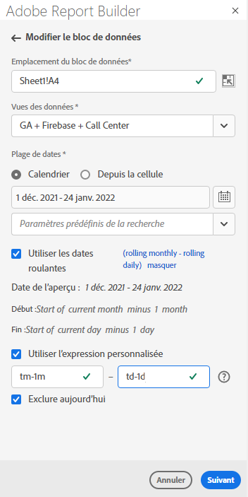
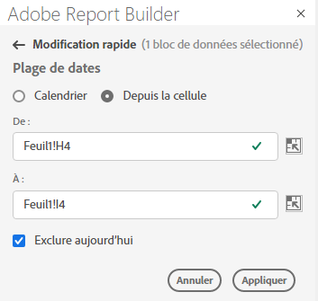

# Sélection d’une plage de dates

Pour modifier la plage de dates d’un bloc de données existant, sélectionnez Modifier un bloc de données ou utilisez le panneau RAPIDE D’ÉDITION.

Utilisez les options suivantes pour modifier une période pour un bloc de données.

**Calendrier**

Le calendrier vous permet de créer des dates statiques ou roulantes à l’aide des options suivantes :

- Champ de plage de dates
- Calendrier
- Menu déroulant Paramètre prédéfini
- Mode Date flottante
- Personnalisation des expressions


**À partir de la cellule**

L’option De cellule vous permet de référencer les dates saisies dans les cellules de la feuille de calcul.

Vous avez la possibilité d’exclure aujourd’hui sur n’importe quelle période sélectionnée.



## Utilisation du calendrier

Lorsque vous utilisez le **calendrier**, le champ de période affiche la période actuelle pour la demande de bloc de données. Vous pouvez saisir des dates directement dans le champ de période ou utiliser une option de sélection de période.

### Champ de plage de dates

Pour saisir des dates directement dans le champ de période

1. Cliquez sur le champ Période en regard de l’icône Calendrier.

1. Entrez les dates de début et de fin pour la période.

### Calendrier

Pour sélectionner des dates à l’aide du calendrier

1. Cliquez sur l’icône Calendrier pour afficher un calendrier mensuel.

1. Cliquez sur une date de début.

1. Cliquez sur une date de fin.

Pour définir une période en sens inverse, cliquez d’abord sur la date de fin, puis sur la date de début.



### Menu déroulant Paramètres prédéfinis

Le menu déroulant des paramètres prédéfinis comprend un ensemble standard de périodes et de composants de période prédéfinis pour une vue de données que vous avez enregistrée ou une vue de données qui a été partagée avec vous.

### Dates roulantes

L’option Dates roulantes vous permet de sélectionner une période à l’aide de dates roulantes.

1. Sélectionnez **Utiliser des dates roulantes**.

1. Sélectionnez une expression variable pour les dates de début et ou de fin.

   

   **Début de**  : permet de sélectionner le début d’un jour, d’une semaine, d’un mois, d’un trimestre ou d’une année.

   **Fin de**  : permet de sélectionner la fin d’un jour, d’une semaine, d’un mois, d’un trimestre ou d’une année.

   **Jour**  fixe : permet de fixer une date de début ou de fin alors que l’autre date est flottante.

1. Sélectionnez jour, semaine, mois, trimestre ou année comme période variable.

   

1. Ajoutez ou soustrayez des jours, semaines, mois, trimestres ou années à partir de la date roulante.

   

1. Cliquez sur Suivant pour définir la plage de données.

   Utilisez l’aperçu de la date pour confirmer que la période obtenue correspond à la période souhaitée.

### Expressions personnalisées

L’option d’expression personnalisée vous permet de modifier la plage de dates en créant une expression personnalisée ou vous pouvez saisir une formule arithmétique.

1. Sélectionnez **Utiliser des dates roulantes**.

1. Sélectionnez **Utiliser l’expression personnalisée**.

   Lorsque vous sélectionnez l’option **Utiliser une expression personnalisée**, les commandes standard de période variable sont désactivées.

   

1. Saisissez une expression personnalisée.

   Pour obtenir un exemple de liste des expressions personnalisées, voir **Expressions de date**.

1. Utilisez l’aperçu de la date pour vérifier que la période obtenue correspond à la période souhaitée.

#### Création d’une expression personnalisée

1. Saisissez une **référence de date**.

1. Ajoutez des **opérateurs de date** pour déplacer la date vers le passé ou le futur.

Vous pouvez saisir une expression de date personnalisée qui inclut plusieurs opérateurs, tels que ```tm-11m-1d```.

#### Références de date

Le tableau suivant répertorie des exemples de référence de date.

| Référence de date | Type | Description |
|----------------|--------------|----------------------------|
| 1/1/10 | Date statique | Entré au format de date ISO |
| td | Date flottante | Début du jour en cours |
| tw | Date flottante | Début de la semaine en cours |
| tm | Date flottante | Début du mois en cours |
| tq | Date flottante | Début du trimestre en cours |
| ty | Date flottante | Début de l’année en cours |

#### Opérateurs de date

Le tableau suivant répertorie des exemples d’opérateurs de date.

| Opérateurs de date | Unité | Description |
|----------------|---------|--------------------|
| +6d | Jour | Ajout de 6 jours à la référence de date |
| +1 w | Semaine | Ajouter une semaine complète à la référence de date |
| -2m | Mois | Soustraire 2 mois complets à la référence de date |
| -4q | Trimestre | Soustraire 4 trimestres à la référence de date |
| -1y | Année | Soustraire une année à la référence de date |

#### Expressions de date

Le tableau suivant répertorie des exemples d’expressions de date.

| Expression de date | Signification |
|-----------------|--------------------------------------|
| td-1w | Premier jour de la semaine dernière |
| tm-1d | Dernier jour du mois précédent |
| td-52w | Le même jour, il y a 52 semaines |
| tm-11m-1d | Dernier jour du même mois l’année dernière |
| &quot;2020-09-06&quot; | 9 septembre 2020 |

## Période à partir d’une cellule

La période peut être spécifiée dans les cellules de la feuille de calcul. Utilisez l’option **Période à partir de la cellule** pour choisir les dates de début et de fin du bloc de données à partir des cellules sélectionnées. Lorsque vous sélectionnez l’option **À partir de la cellule**, le panneau affiche les champs **De** et **À** où vous pouvez saisir un emplacement de cellule.



## Exclure aujourd’hui

Choisissez l’option **Exclure aujourd’hui** pour exclure aujourd’hui d’une période sélectionnée. Choisir d’inclure aujourd’hui peut générer des données incomplètes pour aujourd’hui.

Lorsqu’elle est sélectionnée, l’option **Exclure aujourd’hui** exclut le jour en cours de tous les modes de période, y compris le calendrier, les dates roulantes ou les expressions personnalisées.

## Périodes valides

La liste suivante décrit des formats de période valides.

- Les dates de début et de fin doivent être au format suivant : AAAA-MM-JJ

- La date de début doit être antérieure ou égale à la date de fin. Les deux dates peuvent être définies dans le futur.

- Lors de l’utilisation de dates roulantes, la date de début doit être aujourd’hui ou dans le passé. Elle doit se trouver dans le passé si **Exclure aujourd’hui** est coché.

- Vous pouvez créer une plage de dates statique définie pour le futur. Par exemple, vous devrez peut-être définir une date future pour le lancement d’une campagne marketing la semaine prochaine. Cette option permet de créer une surveillance des classeurs pour une campagne à l’avance.

## Modification de la période

Vous pouvez éditer la période d&#39;un bloc de données existant en sélectionnant Modifier le bloc de données dans le panneau COMMANDES ou en sélectionnant le lien Période dans le panneau RAPIDE D&#39;ÉDITION.

**Modifier le bloc**  de données : permet de modifier plusieurs paramètres de bloc de données, y compris la période, pour un seul bloc de données.

**Modification rapide : Période**  : permet de modifier la période d’un ou de plusieurs blocs de données.

Pour modifier la période dans le panneau MODIFICATION RAPIDE

1. Sélectionnez des cellules dans un ou plusieurs blocs de données d’une feuille de calcul.

1. Cliquez sur le lien **Période** dans le panneau RAPIDE ÉDITION.

1. Sélectionnez la période à l’aide de l’une des options de sélection de date.

1. Cliquez sur **Appliquer**.


Report Builder applique la nouvelle période à tous les blocs de données de la sélection.
