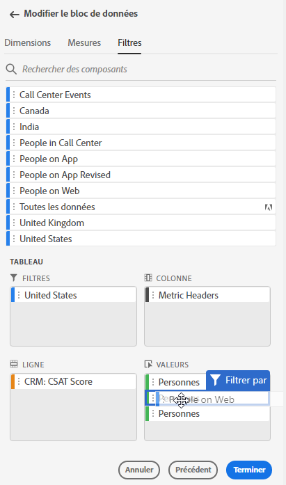
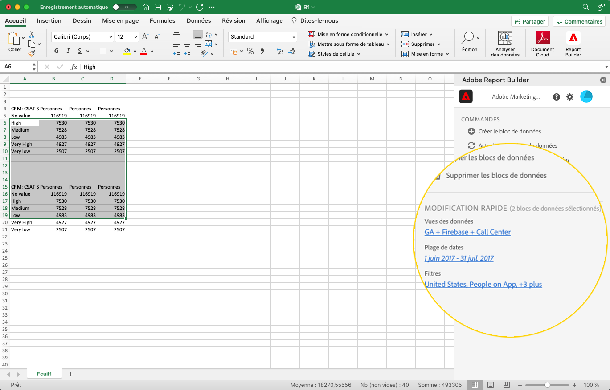
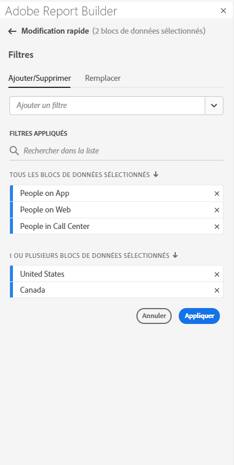
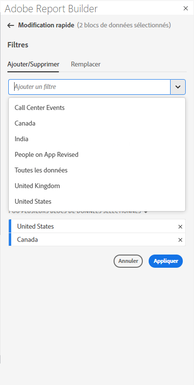
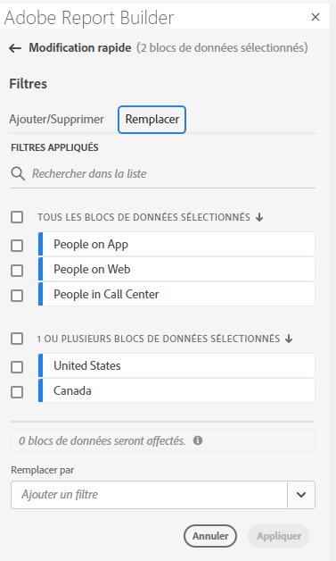
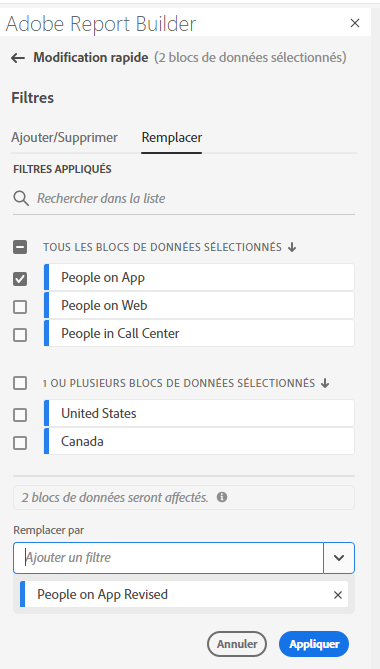

# Utilisation de filtres dans le Report Builder

Vous pouvez appliquer des filtres lorsque vous créez un bloc de données ou lorsque vous sélectionnez l’option **Modifier le bloc de données** dans le panneau COMMANDES .

## Application de filtres à un bloc de données

Pour appliquer un filtre sur l&#39;ensemble du bloc de données, double-cliquez sur un filtre ou effectuez un glisser-déposer de filtres depuis la liste des composants vers la section Filtres du tableau.

## Application de filtres à des mesures individuelles

Pour appliquer des filtres à des mesures individuelles, faites glisser un filtre sur une mesure du tableau. Vous pouvez également cliquer sur le lien **...** icône située à droite d’une mesure dans le volet Tableau , puis sélectionnez **Filtrer la mesure**. Pour afficher les filtres appliqués, survolez ou sélectionnez une mesure dans le volet Tableau . Les mesures avec filtres appliqués affichent une icône de filtre.

<!--  -->

## Filtres de modification rapide

Vous pouvez utiliser le panneau Modification rapide pour ajouter, supprimer ou remplacer des filtres pour les blocs de données existants.

Lorsque vous sélectionnez une plage de cellules dans la feuille de calcul, le lien **Filtres** du panneau Modification rapide affiche une liste récapitulative des filtres utilisés par les blocs de données de cette sélection.

Pour modifier des filtres à l’aide du panneau Modification rapide

1. Sélectionnez une plage de cellules à partir d’un ou de plusieurs blocs de données.

   

1. Cliquez sur le lien Filtres pour lancer le panneau Modification rapide - Filtres .

   

### Ajouter ou supprimer un filtre

Vous pouvez ajouter ou supprimer des filtres à l’aide des options Ajouter/Supprimer .

1. Sélectionnez l’onglet **Ajouter/Supprimer** dans le panneau Quick Edit-filters.

   Tous les filtres appliqués aux blocs de données sélectionnés sont répertoriés dans le panneau Quick Edit-filters. Les filtres appliqués à tous les blocs de données de la sélection sont répertoriés sous l’en-tête **Application à tous les blocs de données sélectionnés**. Les filtres appliqués à certains blocs de données, mais pas tous, sont répertoriés sous l’en-tête **Application à 1 ou plusieurs blocs de données sélectionnés**.

   Lorsque plusieurs filtres sont présents dans les blocs de données sélectionnés, vous pouvez rechercher des filtres spécifiques à l’aide du champ de recherche **Ajouter un filtre** .

   

1. Ajoutez des filtres en sélectionnant des filtres dans le menu déroulant **Ajouter un filtre** .

   La liste des filtres pouvant faire l’objet d’une recherche inclut tous les filtres accessibles aux vues de données présentes dans un ou plusieurs des blocs de données sélectionnés, ainsi que tous les filtres disponibles globalement dans l’organisation.

   L&#39;ajout d&#39;un filtre applique le filtre à tous les blocs de données de la sélection.

1. Pour supprimer des filtres, cliquez sur l’icône de suppression **x** à droite des filtres dans la liste **Filtres appliqués**.

1. Cliquez sur **Appliquer** pour enregistrer les modifications et revenir au panneau hub.

   Report Builder affiche un message pour confirmer les modifications de filtre appliquées.

### Remplacement d’un filtre

Vous pouvez remplacer un filtre existant par un autre filtre afin de modifier la façon dont les données sont filtrées.

1. Sélectionnez l’onglet **Remplacer** dans le panneau Quick Edit-filters.

   

1. Utilisez le champ de recherche **Liste de recherche** pour localiser des filtres spécifiques.

1. Sélectionnez un ou plusieurs filtres à remplacer.

1. Recherchez un ou plusieurs filtres dans le champ Remplacer par .

   La sélection d’un filtre l’ajoute à la liste **Remplacer par**...

   

1. Cliquez sur **Appliquer**.

   Report Builder met à jour la liste des filtres pour refléter le remplacement.
