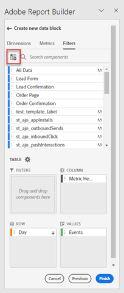

# Utilisation des filtres dans Report Builder

Vous pouvez appliquer des filtres lorsque vous créez un bloc de données ou en sélectionnant lʼoption **Modifier le bloc de données** dans le panneau COMMANDES.

## Application de filtres à un bloc de données

Pour appliquer un filtre à lʼensemble du bloc de données, double-cliquez sur un filtre ou faites glisser, puis déposez les filtres depuis la liste des composants vers la section Filtres du Tableau.

## Application de filtres à des mesures individuelles

Pour appliquer des filtres à des mesures individuelles, faites glisser, puis déposez un filtre sur une mesure du tableau. Alternativement, cliquez sur lʼicône **...** à droite dʼune mesure dans le volet Tableau, puis sélectionnez **Filtrer la mesure**. Pour afficher les filtres appliqués, survolez une mesure avec la souris ou sélectionnez-la dans le volet Tableau. Les mesures avec des filtres appliqués affichent une icône de filtre.

<!--  -->

## Modification rapide des filtres

Vous pouvez utiliser le panneau Modification rapide pour ajouter, supprimer ou remplacer des filtres pour des blocs de données existants.

Lorsque vous sélectionnez une plage de cellules dans la feuille de calcul, le lien **Filtres** dans le panneau Modification rapide affiche une liste reprenant les filtres utilisés par les blocs de données dans la sélection en cours.

Pour modifier des filtres à lʼaide du panneau Modification rapide, procédez comme suit :

1. Sélectionnez une plage de cellules à partir dʼun ou de plusieurs blocs de données.

   

1. Cliquez sur le lien Filtres pour lancer le panneau Modification rapide - Filtres.

   

### Ajout ou suppression d’un filtre

Vous pouvez ajouter ou supprimer des filtres à lʼaide des options Ajouter/Supprimer.

1. Sélectionnez lʼonglet **Ajouter/Supprimer** dans le panneau Modification rapide - Filtres.

   Tous les filtres appliqués aux blocs de données sélectionnés sont répertoriés dans le panneau Modification rapide - Filtres. Les filtres appliqués à tous les blocs de données de la sélection sont répertoriés sous lʼen-tête **Appliqué à tous les blocs de données sélectionnés**. Les filtres appliqués à certains blocs de données, mais pas tous, sont répertoriés sous lʼen-tête **Appliqué à 1 ou plusieurs blocs de données sélectionnés**.

   Lorsque plusieurs filtres sont présents dans les blocs de données sélectionnés, vous pouvez rechercher des filtres spécifiques à lʼaide du champ de recherche **Ajouter un filtre**.

   

1. Ajoutez des filtres en les sélectionnant dans le menu déroulant **Ajouter un filtre**.

   La liste des filtres pouvant faire lʼobjet dʼune recherche inclut tous les filtres accessibles aux vues de données présents dans un ou plusieurs blocs de données précédemment sélectionnés, ainsi que tous les filtres disponibles dans toute lʼorganisation.

   Lʼajout dʼun filtre lʼapplique à tous les blocs de données de la sélection.

1. Pour supprimer des filtres, cliquez sur lʼicône **x** à droite des filtres dans la liste des **Filtres appliqués**.

1. Cliquez sur **Appliquer** pour enregistrer les modifications et revenir au panneau hub.

   Report Builder affiche un message pour confirmer les modifications apportées aux filtres.

### Remplacement dʼun filtre

Vous pouvez remplacer un filtre existant par un autre afin de modifier la manière dont les données sont filtrées.

1. Sélectionnez lʼonglet **Remplacer** dans le panneau Modification rapide - Filtres.

   

1. Utilisez le champ de recherche **Liste de recherche** pour localiser des filtres spécifiques.

1. Sélectionnez ensuite un ou plusieurs filtres à remplacer.

1. Recherchez un ou plusieurs filtres dans le champ Remplacer par.

   La sélection dʼun filtre lʼajoute à la liste **Remplacer par**...

   

1. Cliquez sur **Appliquer**.

   Report Builder met à jour la liste des filtres pour refléter le remplacement effectué.

### Définition des filtres de bloc de données à partir d’une cellule

Les blocs de données peuvent référencer des filtres à partir d’une cellule. Plusieurs blocs de données peuvent référencer la même cellule pour les filtres, ce qui vous permet de changer facilement de filtre pour plusieurs blocs de données à la fois.

Pour appliquer des filtres à partir d’une cellule

1. Accédez à l’étape 2 dans le processus de création ou d’édition du bloc de données. Voir [Création d’un bloc de données](./create-a-data-block.md).
1. Cliquez sur le bouton **Filtres** pour définir des filtres.
1. Cliquez sur **Créer un filtre à partir d’une cellule**.

   

1. Sélectionnez la cellule à partir de laquelle vous souhaitez que les blocs de données fassent référence à un filtre.

1. Ajoutez à la cellule le choix des filtres que vous souhaitez ajouter en double-cliquant sur le filtre ou en le faisant glisser dans la section Filtres inclus .

   Remarque : Un seul choix peut être sélectionné simultanément pour la cellule donnée.

   

1. Cliquez sur **Appliquer** pour créer la cellule de référence.

1. Dans la **Filtres** ajoutez le filtre de cellule de référence nouvellement créé à votre bloc de données.

   

1. Cliquez sur **Terminer**.

   Cette cellule peut maintenant être référencée par d’autres blocs de données dans leurs filtres. Pour appliquer la cellule de référence comme filtre à d&#39;autres blocs de données, ajoutez simplement la référence de cellule à leurs filtres depuis l&#39;onglet Filtres .

#### Utilisation de la cellule de référence pour modifier les filtres de bloc de données

1. Sélectionnez la cellule de référence dans votre feuille de calcul.

1. Cliquez sur le lien sous **Filtres à partir d’une cellule** dans le menu Modification rapide .

   

1. Sélectionnez votre filtre dans le menu déroulant.

   

1. Cliquez sur **Appliquer**.