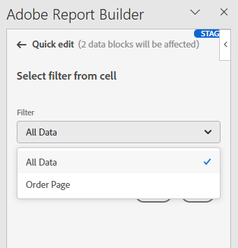

# Utilisation de segments dans Report Builder

Vous pouvez appliquer des segments lorsque vous créez un bloc de données ou lorsque vous sélectionnez l’option **Modifier le bloc de données** dans le panneau COMMANDES.

## Application de segments à un bloc de données

Pour appliquer un segment à l’ensemble du bloc de données, double-cliquez sur un segment ou faites glisser des segments de la liste des composants vers la section des segments du tableau.

## Application de segments à des mesures individuelles

Pour appliquer des segments à des mesures individuelles, faites glisser et déposez un segment sur une mesure du tableau. Vous pouvez également cliquer sur l’icône **...** à droite d’une mesure dans le volet Tableau, puis sélectionner **Mesure du segment**. Pour afficher les segments appliqués, survolez une mesure avec la souris ou sélectionnez-la dans le volet Tableau . Les mesures avec des segments appliqués affichent une icône de segment.

## Modification rapide de segments

Vous pouvez utiliser le panneau Modification rapide pour ajouter, supprimer ou remplacer des segments pour des blocs de données existants.

Lorsque vous sélectionnez une plage de cellules dans la feuille de calcul, le lien **Segments** du panneau Modification rapide affiche une liste récapitulative des segments utilisés par les blocs de données dans cette sélection.

Pour modifier des segments à l’aide du panneau Modification rapide

1. Sélectionnez une plage de cellules à partir dʼun ou de plusieurs blocs de données.

   

1. Cliquez sur le lien Segments pour lancer le panneau Modification rapide - Segments .

   

### Ajout ou suppression d’un segment

Vous pouvez ajouter ou supprimer des segments à l’aide des options Ajouter/Supprimer .

1. Sélectionnez l’onglet **Ajouter/Supprimer** dans le panneau Modification rapide - Segments.

   Tous les segments appliqués aux blocs de données sélectionnés sont répertoriés dans le panneau Modification rapide - Segments . Les segments appliqués à tous les blocs de données de la sélection sont répertoriés sous l’en-tête **Appliqué à tous les blocs de données sélectionnés**. Les segments appliqués à certains blocs de données, mais pas à tous, sont répertoriés sous l’en-tête **Appliqué à un ou plusieurs blocs de données sélectionnés**.

   Lorsque plusieurs segments sont présents dans les blocs de données sélectionnés, vous pouvez rechercher des segments spécifiques à l’aide du champ de recherche **Ajouter un segment**.

   

1. Ajoutez des segments en les sélectionnant dans le menu déroulant **Ajouter un segment**.

   La liste des segments pouvant faire l’objet d’une recherche inclut tous les segments accessibles aux vues de données présentes dans un ou plusieurs des blocs de données sélectionnés, ainsi que tous les segments disponibles globalement dans l’organisation.

   L’ajout d’un segment applique le segment à tous les blocs de données de la sélection.

1. Pour supprimer des segments, cliquez sur l’icône de suppression **x** à droite des segments dans la liste **Segments appliqués**.

1. Cliquez sur **Appliquer** pour enregistrer les modifications et revenir au panneau hub.

   Report Builder affiche un message pour confirmer les modifications apportées au segment.

### Remplacement d’un segment

Vous pouvez remplacer un segment existant par un autre segment pour modifier la manière dont les données sont segmentées.

1. Sélectionnez l’onglet **Remplacer** dans le panneau Modification rapide-segments.

   .

1. Utilisez le champ de recherche **Liste de recherche** pour localiser des segments spécifiques.

1. Sélectionnez un ou plusieurs segments à remplacer.

1. Recherchez un ou plusieurs segments dans le champ Remplacer par .

   Si vous sélectionnez un segment, il est ajouté à la liste **Remplacer par**... .

   

1. Cliquez sur **Appliquer**.

   Report Builder met à jour la liste des segments pour refléter le remplacement.

### Définir des segments de blocs de données depuis la cellule

Les blocs de données peuvent référencer des segments à partir d’une cellule. Plusieurs blocs de données peuvent référencer la même cellule pour des segments, ce qui vous permet de changer facilement de segment pour plusieurs blocs de données à la fois.

Pour appliquer des segments depuis une cellule

1. Accédez à l’étape 2 dans le processus de création ou de modification de bloc de données. Voir [Création d’un bloc de données](./create-a-data-block.md).
1. Cliquez sur l’onglet **Segments** pour définir des segments.
1. Cliquez sur **Créer un segment à partir de la cellule**.

   

1. Sélectionnez la cellule à partir de laquelle vous souhaitez que les blocs de données référencent un segment.

1. Ajoutez le segment que vous souhaitez ajouter à la cellule en double-cliquant sur le segment ou en le faisant glisser et en le déposant dans la section Segments inclus .

   Remarque : Un seul choix peut être sélectionné à la fois pour la cellule donnée.

   

1. Cliquez sur **Appliquer** pour créer la cellule de référence.

1. Dans l’onglet **Segments**, ajoutez le segment de cellule de référence nouvellement créé à votre bloc de données.

   

1. Cliquez sur **Terminer**.

   Désormais, cette cellule peut être référencée par d’autres blocs de données dans leurs segments. Pour appliquer la cellule de référence en tant que segment à d’autres blocs de données, ajoutez simplement la référence de cellule à leurs segments à partir de l’onglet segments .

#### Utiliser la cellule de référence pour modifier les segments de bloc de données

1. Sélectionnez la cellule de référence dans votre feuille de calcul.

1. Cliquez sur le lien situé sous **Segments depuis la cellule** dans le menu Modification rapide.

   

1. Sélectionnez votre segment dans le menu déroulant.

   

1. Cliquez sur **Appliquer**.
