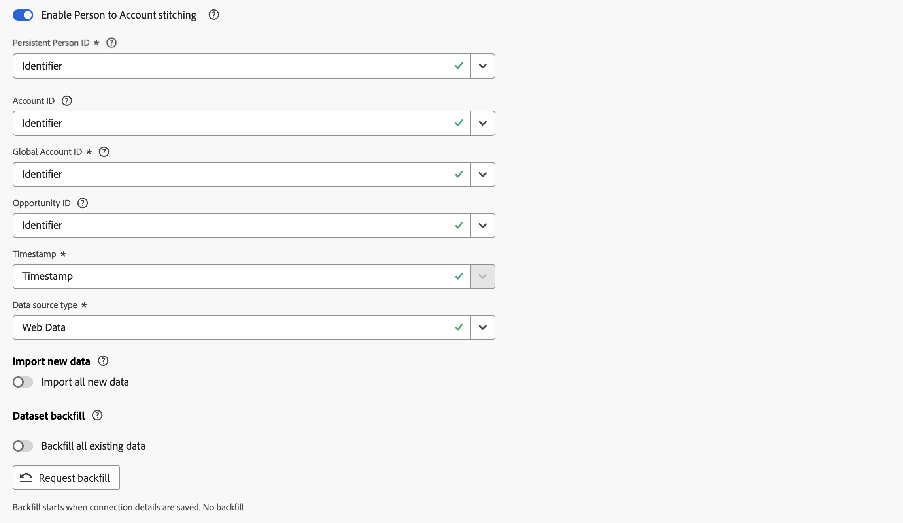
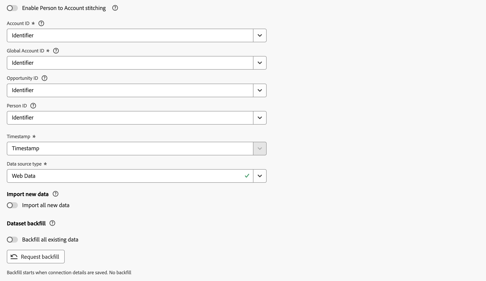

# Assemblage des comptes B2B

L’assemblage de comptes B2B enrichit vos jeux de données d’événements avec des identités de compte et permet une analyse complète sur l’ensemble du parcours client dans Customer Journey Analytics. Lorsque les événements ne disposent pas d’un identifiant de compte, ce que Customer Journey Analytics B2B edition exige pour l’ingestion, l’assemblage de comptes dérive et ajoute automatiquement ces informations à l’aide d’un [ jeu de données de mappage personne-compte ](#prerequisites) que vous fournissez.

Sans assemblage de comptes, tout événement qui ne contient pas d’identifiant de compte est ignoré lors de l’ingestion. L’assemblage des comptes résout cette limitation en recherchant le compte associé à la personne sur chaque événement, en ajoutant l’identifiant de compte à la fois lorsque l’événement est ingéré et de manière rétroactive.

>[!NOTE]
>
>L’assemblage de comptes B2B nécessite que vous ayez droit au [B2B edition Customer Journey Analytics](/help/getting-started/cja-b2b-edition.md) dans votre environnement avant de pouvoir configurer la fonctionnalité.

L’assemblage de comptes effectue les opérations suivantes sur vos jeux de données :

* **Élever l’identité de la personne** : l’ID de personne sur chaque événement est élevé à l’espace de noms d’identité configuré à l’aide du graphique d’identité.
* **Ajouter les identités de compte manquantes** : pour les événements contenant un ID de personne, le [mappage personne à compte](#prerequisites) est utilisé pour dériver et ajouter l’identité du compte. Toute identité de compte sur l’événement lui-même est utilisée comme méthode de secours.

## Fonctionnement de l’assemblage des comptes B2B

Pour illustrer le fonctionnement de l’assemblage de comptes B2B, le jeu de données illustré ci-dessous est utilisé comme point de départ.

### Jeu de données d’événement de base

Dans Customer Journey Analytics B2B edition, les événements sans ID de compte dans cet exemple de jeu de données d’événement non assemblé sont ignorés et ne sont pas ingérés ().

| Action | Date et heure | Identifiant persistant | ID de compte | ID de personne | Type d’événement |
|:---:|--:|--|---|---|---|
|  | 1/3/25 | 1234 | Adobe | matt@adobe.com | Page view |
|  | 1/3/25 | 5678 |  | | |
|  | 3/4/25 | 9012 | Ubiquité | cory@sky.com |  |
|  | 3/7/25 | 4321 | Ciel | emily@sky.com | Centre d’appel |
|  | 5/5/25 | 6106 | | carmen@adobe.com |  |
|  | 6/1/25 | 8989 | Ubiquité | cassidy@ubiquity.com | |
|  | 6/2/25 | 1111 |  | | |

L’assemblage de comptes B2B empêche les événements d’être ignorés et de ne pas être ingérés à l’aide des opérations suivantes :

* [Élever les identités de personne](#elevate-person-identities).
* [Ajouter les identités de compte manquantes](#add-missing-account-identitiers).

### Élever les identités de personne

+++ Détails

Pour prendre en charge l’assemblage de comptes B2B, vous fournissez un jeu de données de mappage personne-compte. Par exemple :

| ID CRM | ID de compte |
|---|---|
| 12hsd123 | Adobe |
| f82jsd32 | Ciel |
| hg2023m2 | Ciel |
| b978bbw9 | Ubiquité |
| fs453ghi | Adobe |

Ce jeu de données de mappage personne à compte est élevé à l’aide d’un groupement basé sur des graphiques. Par exemple, vous indiquez l’adresse e-mail comme espace de noms à utiliser. Le résultat est un jeu de données de mappage personne-compte mis à jour avec des ID de personne élevés.

| ID CRM | ID de personne élevé | ID de compte |
|---|---|---|
| 12hsd123 | matt@adobe.com | Adobe |
| f82jsd32 | emily@sky.com | Ciel |
| hg2023m2 | cory@sky.com | Ciel |
| b978bbw9 | cassidy@ubiquity.com | Ubiquité |
| fs453ghi | carmen@adobe.com | Adobe |

Le groupement basé sur les graphiques est également utilisé pour élever les ID de personne dans le jeu de données d’événement d’expérience. Par exemple, consultez la valeur mise à jour pour ****.

| Date et heure | Identifiant persistant | ID de compte d’origine | ID de personne d’origine | ID de personne élevé |
|--|--|---|---|---|
| 1/3/25 | 1234 | Adobe | matt@adobe.com | matt@adobe.com |
| 1/3/25 | 5678 |  | | **** |
| 3/4/25 | 9012 | Ubiquité | cory@sky.com | cory@sky.com |
| 3/7/25 | 4321 | Ciel | emily@sky.com | emily@sky.com |
| 5/5/25 | 6106 | | carmen@adobe.com | carmen@adobe.com |
| 6/1/25 | 8989 | Ubiquité | cassidy@ubiquity.com | cassidy@ubiquity.com |
| 6/2/25 | 1111 |  | 111 | 111 |

+++

### Ajouter les identifiants de compte manquants

+++ Détails

Le jeu de données personne à compte est une fois de plus utilisé pour élever les identifiants de compte dans le jeu de données d’événement d’expérience. Par exemple, consultez la valeur ajoutée **Sky** pour emily@sky.com et **Adobe** pour carmen@adobe.com. Et la valeur mise à jour **Sky** (d’Ubiquity) pour cory@sky.com.

| Date et heure | Identifiant persistant | ID de compte d’origine | ID de personne d’origine | ID de compte élevé | ID de personne élevé |
|---|---|---|---|---|---|
| 1/3/25 | 1234 | Adobe | matt@adobe.com | Adobe | matt@adobe.com |
| 1/3/25 | 5678 | | | **Ciel** | **** |
| 3/4/25 | 9012 | Ubiquité | cory@sky.com | **Ciel** | cory@sky.com |
| 3/7/25 | 4321 | Ciel | emily@sky.com | Ciel | emily@sky.com |
| 5/5/25 | 6106 | | carmen@adobe.com | **Adobe** | carmen@adobe.com |
| 6/1/25 | 8989 | Ubiquité | cassidy@ubiquity.com | Ubiquité | cassidy@ubiquity.com |
| 6/2/25 | 1111 |  | 1111 |  | 1111 |

+++

### Résultats

Cet exemple montre comment l’assemblage de comptes B2B met à jour vos données d’événement d’expérience avec des identifiants de personne manquants et des identifiants de compte manquants et incorrects, en fonction du jeu de données de mappage de personne à compte que vous avez fourni en entrée.

## Conditions préalables

Avant d’activer l’assemblage de comptes B2B, préparez les jeux de données suivants dans Adobe Experience Platform :

| Jeu de données | Obligatoire | Description |
|---|---|---|
| **jeu de données personne à compte** | Obligatoire | Un jeu de données de recherche (enregistrement, série non temporelle) qui contient au minimum un ID de personne (avec espace de noms) et un ID de compte. Ces identifiants sont utilisés pour dériver le mappage de la relation personne-compte. |

>[!IMPORTANT]
>
>Le champ ID de personne de votre jeu de données **[!UICONTROL personne à compte]** doit être marqué comme une identité dans votre schéma.

## Activer l’assemblage des comptes {#enable-account-stitching}

Vous devez d’abord activer et configurer l’assemblage des comptes B2B au niveau de la connexion. Lorsque l’assemblage de comptes B2B est configuré pour une connexion, vous pouvez ensuite activer l’assemblage de comptes sur des jeux de données d’événement individuels au sein de cette connexion.

### Configurer les paramètres d’assemblage B2B {#configure-b2b-stitching-settings}

>[!CONTEXTUALHELP]
>id="connection_b2b_stitching_open_configuration"
>title="Configurer l’assemblage des comptes B2B"
>abstract="Sélectionnez **[!UICONTROL Ouvrir la configuration d’assemblage B2B]** pour configurer l’assemblage de comptes B2B. Si la connexion n’est pas encore enregistrée, la configuration porte la mention **[!UICONTROL _Modifications non enregistrées_]**."

>[!CONTEXTUALHELP]
>id="connection_b2b_stitching_person_identifier_namespace"
>title="Espace de noms d’identifiants de personnes"
>abstract="Sélectionnez l’espace de noms d’identité de personne le plus pertinent pour vos rapports. Par exemple, E-mail. Tous les jeux de données d’événement avec l’option **[!UICONTROL Combinaison personne-compte]** activée comportent l’ID de personne élevé à cet espace de noms d’identifiant de personne."

>[!CONTEXTUALHELP]
>id="connection_b2b_stitching_person_to_account_dataset"
>title="Jeu de données personne-compte"
>abstract="Sélectionnez le jeu de données de recherche qui mappe les ID de personne aux ID de compte."

>[!CONTEXTUALHELP]
>id="connection_b2b_stitching_person"
>title="ID de personne"
>abstract="Sélectionnez le champ du jeu de données contenant les ID de personne. L’espace de noms de ce champ peut être différent ou identique à l’espace de noms de l’identifiant de personne sélectionné. S’ils sont différents, les deux espaces de noms doivent être liés dans le graphique d’identités."

>[!CONTEXTUALHELP]
>id="connection_b2b_stitching_account"
>title="ID de compte"
>abstract="Sélectionnez le champ du jeu de données qui contient les valeurs d’identifiant de compte uniques. Les informations sur l’ID de compte seront disponibles sur les lignes de tous les jeux de données d’événement avec l’option **[!UICONTROL Combinaison de personne à compte]** activée."

>[!CONTEXTUALHELP]
>id="connection_b2b_stitching_start_time"
>title="Heure de début"
>abstract="Sélectionnez un champ de date et heure qui indique le moment où la relation personne-compte est devenue active."

>[!CONTEXTUALHELP]
>id="connection_b2b_stitching_mapping_creation_time"
>title="Heure de création du mappage"
>abstract="Si vous le souhaitez, sélectionnez le champ qui représente la date et l’heure de création du mappage personne-compte. Utile dans les scénarios où une personne change plusieurs comptes au fil du temps."

1. Dans Customer Journey Analytics, accédez à **[!UICONTROL Connexions]** et [créer une connexion](/help/connections/create-connection.md#create-a-connection) ou [modifier une connexion existante](/help/connections/create-connection.md#edit-a-connection).

1. Dans **[!UICONTROL Paramètres de connexion]**, définissez l’ID de Principal **** sur  **[!UICONTROL Compte]**.

1. Veillez à sélectionner les **[!UICONTROL conteneurs facultatifs]** que vous souhaitez utiliser dans votre connexion B2B. Vous ne pouvez pas modifier la sélection de ces conteneurs une fois que vous avez enregistré une configuration de groupement B2B.

1. Sélectionnez **[!UICONTROL Ouvrir la configuration de groupement B2B]**.

   

   >[!NOTE]
   >
   >Une configuration de groupement B2B précédemment configurée pour une connexion non enregistrée est indiquée par **[!UICONTROL _Modifications non enregistrées_]**. Vous ne pouvez pas modifier les **[!UICONTROL conteneurs facultatifs]** pour une configuration de groupement B2B précédemment configurée.

1. Dans la boîte de dialogue **[!UICONTROL Configuration du groupement B2B]** :

   

   1. Configurez la section **[!UICONTROL Personne]** :

      * Sélectionnez un **[!UICONTROL Espace de noms d’identifiant de personne]** par exemple **[!UICONTROL E-mail]** auquel vous souhaitez que tout ID de personne soit élevé. Ce champ est requis.

   1. Configurez la section **[!UICONTROL Compte]** sous **[!UICONTROL Personne à compte]**.

      | Champ | Obligatoire | Description |
      |---|:---:|---|
      | **[!UICONTROL Jeu de données Personne à compte]** |  | Sélectionnez la recherche (jeu de données d’enregistrement ou de série non temporelle) qui mappe les personnes aux comptes. |
      | **[!UICONTROL ID de personne]** |  | Sélectionnez le champ du jeu de données contenant l’identifiant de la personne. Ce champ doit être marqué comme une identité et ne peut pas être identique au champ **[!UICONTROL ID de compte]** ou **[!UICONTROL Heure de début]**. |
      | **[!UICONTROL ID de compte]** |  | Sélectionnez le champ du jeu de données contenant l’identifiant de compte. Ce champ ne peut pas être identique au champ **[!UICONTROL ID de personne]** ou **[!UICONTROL Heure de début]**. |
      | **Heure de création du mapping** | | Si vous le souhaitez, sélectionnez le champ qui représente la date et l’heure de création du mappage personne-compte. Utile dans les scénarios où une personne change plusieurs comptes au fil du temps.  **Exemple** (lorsque le champ **update_date** est sélectionné) :<table><thead><tr><th>update_date</th><th>Personne</th><th>account</th></tr></thead><tbody><tr><td>20260401</td><td>a@b.com</td><td>Apple</td></tr><tr><td>20260501</td><td>a@b.com</td><td>Adobe</td></tr></tbody></table><ul><li>Pour tous les événements dont la date et l’heure se trouvent dans le champ **[!UICONTROL update_date]** avant le 1er mai 2026 : a@b.com est mappé à Apple.</li><li>Pour tous les événements dont la date et l’heure figurent dans le champ **[!UICONTROL update_date]** à compter du 1er mai 2026 : a@b.com est mappé à Adobe.</li></ul>Lorsqu&#39;aucune heure de mappage n&#39;est spécifiée, le premier compte lexicographique est utilisé. Ce même algorithme est également utilisé lorsque deux noms de compte différents ont exactement la même valeur **[!UICONTROL update_date]** et qu’une heure de création de mappage est spécifiée. |

      >[!NOTE]
      >
      >Si une erreur se produit lors du chargement des options du champ, les menus déroulants s’affichent vides et un indicateur d’erreur s’affiche sous chaque champ affecté. Vérifiez le schéma du jeu de données et réessayez.

   1. Sélectionnez **[!UICONTROL Enregistrer]** pour fermer la boîte de dialogue **[!UICONTROL Configuration du groupement B2B]** et revenir aux paramètres de connexion.

   1. L’indicateur **[!UICONTROL _Modifications non enregistrées_]** s’affiche en regard du bouton **Ouvrir la configuration de groupement B2B** jusqu’à ce que vous [enregistriez](#save) la connexion.

### Activer l’assemblage B2B sur les jeux de données d’événement

>[!CONTEXTUALHELP]
>id="connection_b2b_stitching_enable_person_to_account"
>title="Activer l’assemblage personne-compte"
>abstract="Si activé, ce jeu de données utilise l’assemblage des personnes B2B avec les comptes. Les valeurs **[!UICONTROL ID de personne]** seront élevées vers celles de l’espace de noms **[!UICONTROL Identifiant de personne]** configuré, puis utilisées pour rechercher l’ID de compte en fonction du jeu de données personne-à-compte. Si cette option est désactivée, ce jeu de données n’utilise pas l’assemblage des personnes B2B avec les comptes et vous devez sélectionner un **[!UICONTROL ID de compte]** obligatoire à la place."
>additional-url="https://experienceleague.adobe.com/en/docs/analytics-platform/using/stitching/b2b-account-stitching#configure-b2b-stitching-settings" text="Configurer les paramètres d’assemblage B2B"

Après avoir configuré l’assemblage B2B au niveau de la connexion, vous devez activer l’assemblage de comptes B2B individuellement pour chaque jeu de données d’événement que vous souhaitez assembler.

1. Dans Paramètres de connexion, sélectionnez **[!UICONTROL Ajouter des jeux de données]** ou ouvrez les paramètres d’un jeu de données d’événement existant. Voir [Ajouter des jeux de données](/help/connections/create-connection.md#add-datasets) ou [Modifier un jeu de données](/help/connections/create-connection.md#edit-a-dataset) pour plus d’informations.

1. Pour le jeu de données d’événement spécifique pour lequel vous souhaitez configurer l’assemblage des comptes B2B, activez **[!UICONTROL Activer l’assemblage des personnes en compte]**.

>[!BEGINTABS]

>[!TAB Activé]

Lorsque l’option **[!UICONTROL Activer l’assemblage des personnes en comptes]** est **activée**, vous avez configuré l’assemblage des comptes B2B pour le jeu de données.

* La configuration d’un ID de personne est requise. Cet ID de personne est utilisé pour rechercher l’ID de compte en fonction du [jeu de données personne à compte](#prerequisites).
* La configuration d’un identifiant de compte est facultative.

Assemblage de comptes 

>[!TAB  Désactivé ]

Lorsque l’option **[!UICONTROL Activer l’assemblage des personnes en comptes]** est **désactivée**, vous n’avez *pas* configuré l’assemblage des comptes B2B pour le jeu de données.

* La configuration d’un identifiant de compte est requise.
* La configuration d’un ID de personne est facultative.

Assemblage de comptes 

>[!ENDTABS]

### Enregistrer

Une fois que vous avez configuré la configuration de groupement B2B et que vous avez terminé d’ajouter ou de modifier des jeux de données, sélectionnez **[!UICONTROL Enregistrer]** pour enregistrer la connexion.

>[!IMPORTANT]
>
>Une fois une connexion enregistrée, la configuration de groupement B2B devient immuable. Pour afficher vos paramètres après l’enregistrement, sélectionnez **Ouvrir la configuration de groupement B2B**. Tous les champs sont en lecture seule. En outre, si le jeu de données utilisé pour le mappage [personne à compte](#prerequisites) est supprimé dans Experience Platform, cette connexion est supprimée.

## Planning de mise à jour des données

L’assemblage des comptes dérive la carte des identités de votre [jeu de données personne à compte](#prerequisites) quotidiennement et utilise ces informations pour mettre à jour les jeux de données activés pour l’assemblage à court et à long terme selon le planning suivant :

| Relecture | Fréquence | Fenêtre Données |
|---|---|---|
| Court terme | Hebdomadaire | 7 derniers jours |
| À long terme | Mensuel | 3 derniers mois (package Prime) 6 derniers mois (package Ultimate) |

## Confidentialité et hygiène des données

L’assemblage des comptes respecte les demandes standard de confidentialité et d’hygiène pour les identités de personne, en cohérence avec le comportement d’assemblage B2C. Si un ID de personne est ensuite supprimé par le biais d’une demande d’accès à des informations personnelles ou d’hygiène, le groupement associé effectué à l’aide du graphique d’identité est inversé.

Les entités B2B telles que les comptes, les identifiants de compte et les identifiants de compte globaux ajoutés aux événements par le biais du groupement ne sont pas supprimées lors des demandes d’accès à des informations personnelles ou d’hygiène. Ces valeurs ne contiennent pas d’informations d’identification personnelle, il n’existe donc aucune obligation légale de les supprimer.

>[!MORELIKETHIS]
>
>* [Présentation du groupement](overview.md)
>* [Configurer une connexion pour B2B](../connections/create-connection.md)
>* [Questions fréquentes sur le groupement](faq.md)

