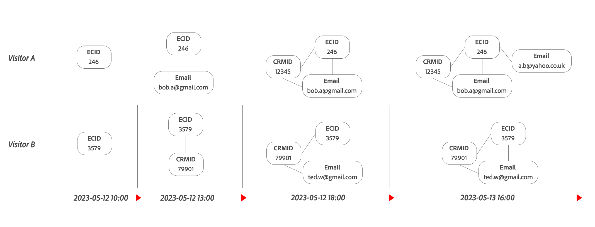

# Rapprochement basé sur les graphiques

Dans le groupement basé sur les graphiques, vous spécifiez un jeu de données d’événement, l’identifiant persistant (cookie) de ce jeu de données et l’espace de noms d’identifiant de personne souhaité à partir du graphique d’identité. Le groupement basé sur les graphiques tente de rendre les informations d’ID de personne disponibles pour l’analyse des données Customer Journey Analytics sur n’importe quel événement. L’ID persistant est utilisé pour interroger le graphique d’identité à partir d’Experience Platform Identity Service afin d’obtenir l’ID de personne à partir de l’espace de noms spécifié.

Si les informations de l’ID de personne ne peuvent pas être récupérées pour un événement, l’ID persistant est utilisé à la place pour cet événement *désassemblé*. Par conséquent, dans une [vue de données](/help/data-views/data-views.md) associée à une [connexion](/help/connections/overview.md) qui contient le jeu de données activé pour le groupement, le composant de vue de données ID de personne contient la valeur de l’ID de personne ou la valeur de l’ID persistant au niveau de l’événement.

## IdentityMap

Le groupement basé sur les graphiques prend en charge l’utilisation du groupe de champs [`identityMap`](https://experienceleague.adobe.com/fr/docs/experience-platform/xdm/schema/composition#identity) dans les scénarios suivants :

- Utilisation de l’identité principale dans les espaces de noms `identityMap` pour définir l’identifiant persistant :
   - Si plusieurs identités principales sont trouvées dans différents espaces de noms, les identités des espaces de noms sont triées par ordre lexicographique et la première identité est sélectionnée.
   - Si plusieurs identités principales sont trouvées dans un seul espace de noms, la première identité principale lexicographique disponible est sélectionnée.

  Dans l’exemple ci-dessous, les espaces de noms et les identités génèrent une liste d’identités principales triées, et en fin de compte l’identité sélectionnée.

  <table style="table-layout:auto">
     <tr>
       <th>Espaces de noms</th>
       <th>Liste des identités</th>
     </tr>
     <tr>
       <td>ECID</td>
       <td><pre lang="json"><code>[ &nbsp;&nbsp;{"id": "ecid-3"}, &nbsp;&nbsp;{"id": "ecid-2", "primary": true}, &nbsp;&nbsp;{"id": "ecid-1", "primary": true} &nbsp;]</code></pre></td>
     </tr>
     <tr>
       <td>CCID</td>
       <td><pre lang="json"><code>[ &nbsp;&nbsp;{"id": "ccid-1"}, &nbsp;&nbsp;{"id": "ccid-2", "primary": true} ]</code></pre></td>
     </tr>
   </table>

  <table style="table-layout:auto">
    <tr>
      <th>Liste des identités triées</th>
      <th>Identité sélectionnée</th>
    </tr>
    <tr>
      <td><pre lang="json"><code>PrimaryIdentities [ &nbsp;&nbsp;{"id": "ccid-2", "namespace": "CCID"}, &nbsp;&nbsp;{"id": "ecid-1", "namespace": "ECID"}, &nbsp;&nbsp;{"id": "ecid-2", "namespace": "ECID"} ] NonPrimaryIdentities [ &nbsp;&nbsp;{"id": "ccid-1", "namespace": "CCID"}, &nbsp;&nbsp;{"id": "ecid-3", "namespace": "ECID"} ]</code></pre></td>
      <td><pre lang="json"><code>"id": "ccid-2", "namespace": "CCID"</code></pre></td>
    </tr>
  </table>

- Utilisation de l’espace de noms `identityMap` pour définir l’identifiant persistant :
   - Si plusieurs valeurs d’identifiant persistant sont trouvées dans un espace de noms `identityMap`, la première identité lexicographique disponible est utilisée.

  Dans l’exemple ci-dessous, vous avez sélectionné ECID comme espace de noms à utiliser. Cette sélection génère une liste d’identités triées, et en fin de compte l’identité sélectionnée.

  <table style="table-layout:auto">
     <tr>
       <th>Espaces de noms</th>
       <th>Liste des identités</th>
     </tr>
     <tr>
       <td>ECID</td>
       <td><pre lang="json"><code>[ &nbsp;&nbsp;{"id": "ecid-3"}, &nbsp;&nbsp;{"id": "ecid-2", "primary": true}, &nbsp;&nbsp;{"id": "ecid-1", "primary": true} ]</code></pre></td>
     </tr>
     <tr>
       <td>CCID</td>
       <td><pre lang="json"><code>[ &nbsp;&nbsp;{"id": "ccid-1"}, &nbsp;&nbsp;{"id": "ccid-2", "primary": true} ]</code></pre></td>
     </tr>
   </table>

  <table style="table-layout:auto">
    <tr>
      <th>Liste des identités triées</th>
      <th>Identité sélectionnée</th>
    </tr>
    <tr>
      <td><pre lang="json"><code>[ &nbsp;&nbsp;"id": "ecid-1", &nbsp;&nbsp;"id": "ecid-2", &nbsp;&nbsp;"id": "ecid-3" ]</code></pre></td>
      <td><pre lang="json"><code>"id": "ecid-1", "namespace": "ECID"</code></pre></td>
    </tr>
  </table>

## Fonctionnement du groupement basé sur les graphiques

Le groupement effectue au moins deux passages sur les données d’un jeu de données spécifique.

- **Groupement en direct** : tente d’assembler chaque accès (événement) au fur et à mesure qu’il arrive, à l’aide de l’identifiant persistant pour rechercher l’identifiant de personne pour l’espace de noms sélectionné en interrogeant le graphique d’identité. Si un identifiant de personne est renvoyé par la recherche, cet identifiant de personne est immédiatement groupé.

- **Relire le groupement** : *relit* les données en fonction des identités mises à jour à partir du graphique d’identité. À cette étape, les accès provenant d’appareils précédemment inconnus (identifiants persistants) sont regroupés, car le graphique d’identité a résolu l’identité d’un espace de noms. Deux paramètres déterminent la relecture : **fréquence** et **intervalle de recherche en amont**. Adobe propose les combinaisons suivantes de ces paramètres :
   - **Recherche en amont quotidienne à une fréquence quotidienne** : les données sont relues chaque jour avec un intervalle de recherche en amont de 24 heures. Cette option présente un avantage car les relectures sont beaucoup plus fréquentes, mais les profils non authentifiés doivent s’authentifier le jour même où ils visitent votre site.
   - **Recherche en amont hebdomadaire à une fréquence hebdomadaire** : les données sont relues chaque semaine avec un intervalle de recherche en amont hebdomadaire (voir [options](overview.md#options)). Cette option présente un avantage qui permet aux sessions non authentifiées de disposer d’un temps d’authentification beaucoup moins strict. Toutefois, les données dégroupées datant de moins d’une semaine ne sont pas retraitées avant la relecture hebdomadaire suivante.
   - **Recherche en amont bihebdomadaire à une fréquence hebdomadaire** : les données sont relues chaque semaine avec un intervalle de recherche en amont bihebdomadaire (voir [options](overview.md#options)). Cette option présente un avantage qui permet aux sessions non authentifiées de disposer d’un temps d’authentification beaucoup moins strict. Toutefois, les données dégroupées datant de moins de deux semaines ne sont pas retraitées avant la relecture hebdomadaire suivante.
   - **Recherche en amont mensuelle à une fréquence hebdomadaire** : les données sont relues chaque semaine avec un intervalle de recherche en amont mensuel (voir [options](overview.md#options)). Cette option présente un avantage qui permet aux sessions non authentifiées de disposer d’un temps d’authentification beaucoup moins strict. Toutefois, les données dégroupées datant de moins d’un mois ne sont pas retraitées avant la relecture hebdomadaire suivante.

- **Confidentialité** : lorsque des demandes liées à la confidentialité sont reçues, en plus de supprimer l’identité demandée du jeu de données source, tout groupement de cette identité sur des événements non authentifiés doit être annulé. En outre, l’identité doit être supprimée du graphique d’identité afin d’éviter tout groupement basé sur les graphiques futur de cette identité spécifique.

  >[!IMPORTANT]
  >
  >Le processus de dégroupement, dans le cadre des demandes d’accès à des informations personnelles , change début 2025. Le processus de dégroupement actuel regroupe les événements à l’aide de la dernière version des identités connues. Cette réaffectation d’événements à une autre identité pourrait avoir des conséquences juridiques indésirables. Pour résoudre ces problèmes, à partir de 2025, le nouveau processus de dégroupement met à jour les événements qui font l’objet de la demande d’accès à des informations personnelles avec l’identifiant persistant.
  > 

Les données au-delà de l’intervalle de recherche en amont ne sont pas relues. Un profil doit être authentifié dans un intervalle de recherche en amont donné pour qu’une visite non authentifiée et une visite authentifiée soient identifiées ensemble. Une fois reconnu, un appareil est groupé en direct à partir de ce moment.

Tenez compte des deux mises à jour du graphique d’identité suivantes au fil du temps pour le visiteur ou la visiteuse A (avec l’identifiant persistant `246`) et le visiteur ou la visiteuse B (avec l’identifiant persistant `3579`), et comment ces mises à jour affectent les étapes du groupement basé sur les graphiques.

Vous pouvez afficher un graphique d’identité au fil du temps pour un profil spécifique à l’aide de la [visionneuse de graphique d’identité](https://experienceleague.adobe.com/fr/docs/experience-platform/identity/features/identity-graph-viewer). Consultez également la [logique de liaison du Service d’identités](https://experienceleague.adobe.com/fr/docs/experience-platform/identity/features/identity-linking-logic) pour mieux comprendre la logique utilisée lors de la liaison d’identités.

### Étape 1 : groupement en direct

Le groupement en direct tente d’assembler chaque événement, au moment de la collecte, à des informations connues à cet instant dans le graphique d’identité.

+++ Détails

| | Heure | Identifiant persistant `ECID` | Espace de noms `Email`  | ID résultant (après assemblage dynamique) |
|--:|---|---|---|---|
| 1 | 2023-05-12 11:00 | `246` | `246`  *non défini* | `246` |
| 2 | 2023-05-12 14:00 | `246` | `246`  `bob.a@gmail.com` | `bob.a@gmail.com` |
| 3 | 2023-05-12 15:00 | `246` | `246`  `bob.a@gmail.com` | `bob.a@gmail.com` |
| 4 | 2023-05-12 17:00 | `3579` | `3579`  *non défini* | `3579` |
| 5 | 2023-05-12 19:00 | `3579` | `3579`  `ted.w@gmail.com` | `ted.w@gmail.com` |
| 6 | 2023-05-13 15:00 | `246` | `246`  `bob.a@gmail.com` | `bob.a@gmail.com` |
| 7 | 2023-05-13 16:30 | `246` | `246`  `a.b@yahoo.co.uk` `246`  `bob.ab@gmail.com` | `a.b@yahoo.co.uk` |

{style="table-layout:auto"}

Vous pouvez voir comment l’identifiant obtenu est résolu pour chaque événement. Selon la durée, l’identifiant persistant et la recherche du graphique d’identité pour l’espace de noms d’ID de personne spécifié.
Lorsque la recherche est résolue sur plusieurs identifiants résultants (comme pour l’événement 7), le premier identifiant lexicographique renvoyé par le graphique d’identité est sélectionné (`a.b@yahoo.co.uk` dans l’exemple).

+++

### Étape 2 : relecture du groupement

À intervalles réguliers (selon l’intervalle de recherche en amont choisi), la relecture du groupement recalcule les données historiques en fonction de la version la plus récente du graphique d’identité au moment de l’intervalle.

+++ Détails

Avec une relecture du groupement avec l’horodatage 2023-05-13 16:30, avec une configuration de l’intervalle de recherche en amont de 24 heures, certains événements de l’exemple sont groupés à nouveau (indiqués par ).

| | Heure | Identifiant persistant `ECID` | Espace de noms `Email`  | ID résultant  (après assemblage dynamique) | ID résultant  (après relecture 24 heures) |
|---|---|---|---|---|---|
| 2 | 2023-05-12 14:00 | `246` | `246`  `bob.a@gmail.com` | `bob.a@gmail.com` | `bob.a@gmail.com` |
| 3 | 2023-05-12 15:00 | `246` | `246`  `bob.a@gmail.com` | `bob.a@gmail.com` | `bob.a@gmail.com` |
|  4 | 2023-05-12 17:00 | `3579` | `3579`  `ted.w@gmail.com` | `3579` | `ted.w@gmail.com` |
|  5 | 2023-05-12 19:00 | `3579` | `3579`  `ted.w@gmail.com` | `ted.w@gmail.com` | `ted.w@gmail.com` |
|  6 | 2023-05-13 15:00 | `246` | `246`  `a.b@yahoo.co.uk` | `bob.a@gmail.com` | `a.b@yahoo.co.uk` |
|  7 | 2023-05-13 16:30 | `246` | `246` `a.b@yahoo.co.uk` `246`  `bob.ab@gmail.com` | `a.b@yahoo.co.uk` | `a.b@yahoo.co.uk` |

{style="table-layout:auto"}

Avec une relecture du groupement avec l’horodatage 2023-05-13 16:30, avec une configuration de l’intervalle de recherche en amont de 7 jours, tous les événements de l’exemple sont groupés à nouveau.

| | Heure | Identifiant persistant `ECID` | Espace de noms `Email`  | ID résultant  (après assemblage dynamique) | ID résultant  (après relecture 7 jours) |
|---|---|---|---|---|---|
|  1 | 2023-05-12 11:00 | `246` | `246`  *non défini* | `246` | `a.b@yahoo.co.uk` |
|  2 | 2023-05-12 14:00 | `246` | `246`  `bob.a@gmail.com` | `bob.a@gmail.com` | `a.b@yahoo.co.uk` |
|  3 | 2023-05-12 15:00 | `246` | `246`  `bob.a@gmail.com` | `bob.a@gmail.com` | `a.b@yahoo.co.uk` |
|  4 | 2023-05-12 17:00 | `3579` | `3579`  `ted.w@gmail.com` | `3579` | `ted.w@gmail.com` |
|  5 | 2023-05-12 19:00 | `3579` | `3579`  `ted.w@gmail.com` | `ted.w@gmail.com` | `ted.w@gmail.com` |
|  6 | 2023-05-13 15:00 | `246` | `246`  `a.b@yahoo.co.uk` | `bob.a@gmail.com` | `a.b@yahoo.co.uk` |
|  7 | 2023-05-13 16:30 | `246` | `246`  `a.b@yahoo.co.uk` `246`  `bob.ab@gmail.com` | `a.b@yahoo.co.uk` | `a.b@yahoo.co.uk` |

{style="table-layout:auto"}

+++

### Étape 3 : demande d’accès à des informations personnelles

Lorsque vous recevez une demande d’accès à des informations personnelles, l’ID obtenu est supprimé dans tous les enregistrements pour l’utilisateur faisant l’objet de la demande d’accès à des informations personnelles.

+++ Détails

Le tableau suivant représente les mêmes données que ci-dessus, mais montre l’effet d’une demande d’accès à des informations personnelles (par exemple, au 2023-05-13 18:00) sur les exemples d’événements.

| | Heure | Identifiant persistant `ECID` | Espace de noms `Email`  | Identifiant obtenu (après demande d’accès à des informations personnelles) |
|--:|---|---|---|---|
|  1 | 2023-05-12 11:00 | `246` | `246`  `a.b@yahoo.co.uk` | `246` |
|  2 | 2023-05-12 14:00 | `246` | `246` `a.b@yahoo.co.uk` | `246` |
|  3 | 2023-05-12 15:00 | `246` | `246`  `a.b@yahoo.co.uk` | `246` |
|  4 | 2023-05-12 17:00 | `3579` | `3579`  `ted.w@gmail.com` | `3579` |
|  5 | 2023-05-12 19:00 | `3579` | `3579`  `ted.w@gmail.com` | `3579` |
|  6 | 2023-05-13 15:00 | `246` | `246`  `a.b@yahoo.co.uk` | `246` |
|  7 | 2023-05-13 16:30 | `246` | `246`  `a.b@yahoo.co.uk` `246`  `bob.ab@gmail.com` | `246` |

{style="table-layout:auto"}

+++

## Conditions préalables

Les conditions préalables suivantes s’appliquent spécifiquement à l’assemblage basé sur un graphique :

- Le jeu de données d’événements dans Adobe Experience Platform auquel vous souhaitez appliquer un assemblage doit comporter une colonne qui identifie un profil sur chaque ligne, l’**identifiant persistant**. Il peut s’agir, par exemple, d’un identifiant visiteur généré par une bibliothèque Adobe Analytics AppMeasurement ou d’un ECID (Experience Cloud ID) généré par le Service d’identités Experience Platform.
- Le graphique d’identités d’Experience Platform Identity Service doit être configuré au niveau de la sandbox, avant d’activer le groupement basé sur les graphiques.
   - Le graphique d’identité doit comporter un espace de noms (par exemple `Email` ou `Phone`) que vous souhaitez utiliser lors du groupement pour résoudre l’ID de personne.
   - Le graphique d’identités doit être renseigné avec des informations d’identités de tous les jeux de données pertinents (de type *événement* ou *profil* et qui contiennent au moins deux espaces de noms utiles avec des valeurs d’identifiant).
   - Tous les jeux de données contenant ces identités pertinentes doivent être [&#x200B; activés pour l’ingestion de données de graphique d’identités](faq.md#enable-a-dataset-for-the-identity-service). Cette activation garantit que les identités entrantes sont ajoutées au graphique au fil du temps à partir de toutes les sources nécessaires.
   - Si vous utilisez déjà le profil de données client en temps réel ou Adobe Journey Optimizer depuis un certain temps, le graphique doit déjà être configuré dans une certaine mesure. Si le renvoi du groupement historique est également requis pour le jeu de données activé avec le groupement basé sur les graphiques, le graphique doit déjà contenir des identités historiques pour l’ensemble de la période, afin d’obtenir les résultats de groupement souhaités.
- Si vous souhaitez utiliser le groupement basé sur des graphiques et que vous prévoyez que le jeu de données d’événement contribuera au graphique d’identité, vous devez [activer le jeu de données pour le service d’identités](/help/stitching/faq.md#enable-a-dataset-for-the-identity-service).
- L’ID persistant et l’ID de personne peuvent être utilisés avec [identityMap](#identitymap). Ou l’identifiant persistant et l’identifiant de personne peuvent être des champs du schéma XDM, auquel cas les champs doivent être [définis comme une identité](https://experienceleague.adobe.com/en/docs/experience-platform/xdm/ui/fields/identity?lang=en) dans le schéma .

>[!NOTE]
>
>Vous n’avez **pas** besoin d’une licence Real-time Customer Data Platform pour l’assemblage basé sur un graphique. Le package **Prime** ou une version ultérieure de Customer Journey Analytics incluent les droits requis pour le Service d’identités Experience Platform.

## Restrictions

Les restrictions suivantes s’appliquent spécifiquement à l’assemblage basé sur un graphique :

- L’horodatage n’est pas pris en compte lors de l’interrogation de l’identifiant de personne à l’aide de l’espace de noms spécifié. Il est donc possible qu’un identifiant persistant soit assemblé avec un identifiant de personne provenant d’un enregistrement dont l’horodatage est plus ancien.
- Dans les scénarios avec des appareils partagés, où l’espace de noms du graphique contient plusieurs identités, la première identité lexicographique est utilisée. Si les limites et priorités d’espace de noms sont configurées dans le cadre de la publication des règles de liaison de graphiques, l’identité de la dernière personne authentifiée est utilisée. Pour plus d’informations, voir [Appareils partagés](/help/use-cases/stitching/shared-devices.md).
- Il existe une limite stricte de trois mois de renvoi d’identités dans le graphique d’identité. Utilisez le renvoi d’identités si vous n’utilisez pas d’application Experience Platform, telle que Real-time Customer Data Platform, pour renseigner le graphique d’identité.
- Les [mécanismes de sécurisation du service d’identités](https://experienceleague.adobe.com/fr/docs/experience-platform/identity/guardrails) s’appliquent. Voir, par exemple, les [limites statiques](https://experienceleague.adobe.com/fr/docs/experience-platform/identity/guardrails#static-limits) suivantes :
   - Nombre d’identités maximum dans un graphique : 50.
   - Nombre de liens maximum vers une identité pour une ingestion par lots unique : 50.
   - Nombre maximum d’identités dans un enregistrement XDM pour l’ingestion de graphiques : 20.
   - Nombre minimum d’identités dans un enregistrement XDM pour l’ingestion de graphiques : 2.
