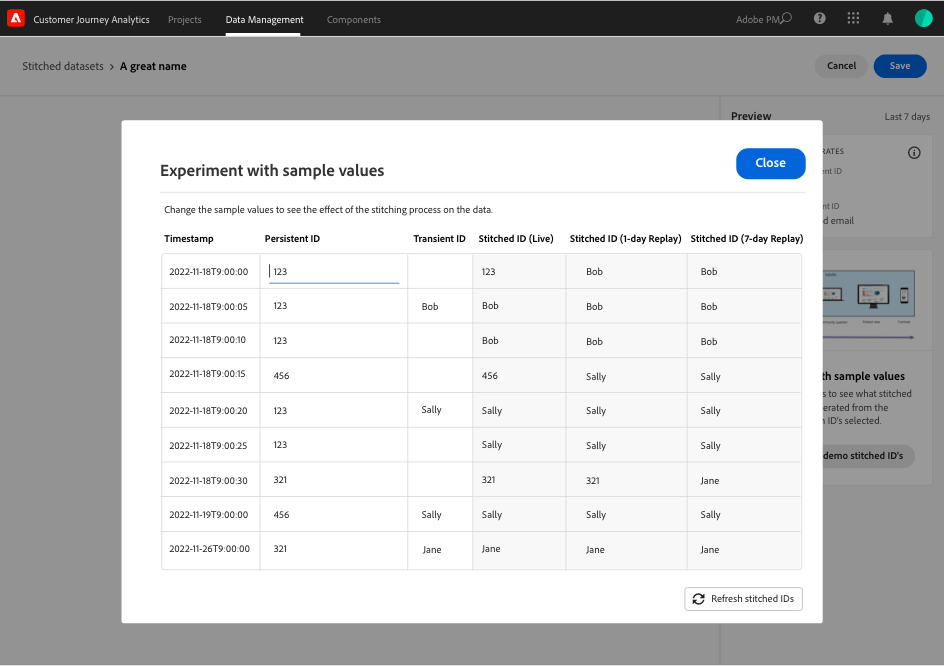

# Créer et gérer de jeux de données groupés

{{select-package}}

L’assemblage permet aux administrateurs de regrouper des identités sur des jeux de données disponibles dans Customer Journey Analytics. L’assemblage de jeux de données augmente la précision de la représentation d’un profil, ce qui se traduit par une meilleure analyse et un meilleur reporting.

Le processus de groupement vous permet de définir un **identifiant persistant** existant dans un jeu de données. Ensuite, associez cet identifiant persistant pour une fenêtre de relecture spécifique (quotidienne, hebdomadaire) avec l’ **identifiant transitoire** (identifiant de personne ou authentifié) le plus précis disponible pour ce jeu de données. Les identifiants de transition peuvent être des adresses électroniques, des numéros de téléphone, des identifiants CRM ou d’autres identités stockées dans le graphique. Voir [Présentation](overview.md) pour plus d’informations sur le groupement.

## Créer

Pour lancer le groupement, vous créez un ou plusieurs jeux de données assemblés. Pour créer un jeu de données assemblé :

1. Sélectionnez **[!UICONTROL ** Assemblage **]** dans **[!UICONTROL ** Data Management **]** sur la barre supérieure.

2. Dans l’écran [!UICONTROL Jeux de données assemblés], sélectionnez **[!UICONTROL ** Créer un jeu de données assemblé&#x200B;**]**.

   Une boîte de dialogue vous explique vos responsabilités.

3. Sélectionnez **[!UICONTROL ** Continuer **]** si vous acceptez ces responsabilités.

   >[!NOTE]
   >
   >    Si vous sélectionnez **[!UICONTROL ** Annuler **]**, vous ne pouvez pas créer de jeu de données assemblé.

4. Dans l’écran [!UICONTROL Jeux de données assemblés > Jeu de données assemblé sans titre] :

   1. Définissez un **[!UICONTROL ** nom du jeu de données **]** et (facultatif) **[!UICONTROL ** Description **]**,

   2. Sélectionnez l’environnement de test dans la liste **[!UICONTROL ** Sandbox **]** où est stocké le jeu de données d’événement.

      

   3. Sélectionnez le bouton **[!UICONTROL ** Sélectionner le jeu de données source **]** .

      Dans la fenêtre contextuelle [!UICONTROL Sélectionner un jeu de données à assembler] :

      

      - Sélectionnez un jeu de données et sélectionnez **[!UICONTROL ** Sélectionner **]** pour continuer.

   4. Sélectionnez un identifiant persistant dans la liste **[!UICONTROL ** ID persistant **]**.

   5. Sélectionnez un identifiant transitoire dans la liste **[!UICONTROL ** ID transitoire **]**.

      Un panneau d’aperçu s’affiche pour calculer les taux de saturation (nombre de fois où il existe une valeur pour chacun des identifiants spécifiés par rapport au nombre d’événements) pendant les sept derniers jours. Une fois le calcul terminé, le panneau se visualise avec des couleurs si les conditions minimales de groupement sont remplies (vert) ou non (rouge).

      

      Les conditions minimales sont les suivantes :

      - saturation de l&#39;identifiant persistant : rate >= 95%

      - saturation de l’identifiant transitoire : rate >= 5%

        Si les conditions minimales sont remplies, vous pouvez tester des valeurs d’exemple.

      - Sélectionnez **[!UICONTROL ** Créer des ID assemblés de démonstration **]**.

        Dans la boîte de dialogue [!UICONTROL Expérience avec des exemples de valeurs], un tableau s’affiche avec un exemple de valeur pour [!UICONTROL timestamp], [!UICONTROL Persistent ID], [!UICONTROL Transient ID], [!UICONTROL Stitched ID (Live)], [!UICONTROL Stitched ID (1-day replay)] et [!UICONTROL  (relecture sur 7 jours)].

             
            
            1.  Saisissez une valeur pour **[!UICONTROL **Persistent ID**]**.
            
            2.  Sélectionnez **[!UICONTROL **Actualiser les identifiants assemblés**]** pour voir l’effet du processus de groupement sur les données du jeu de données.
            
            3.  Sélectionnez **[!UICONTROL **Close**]** lorsque vous avez terminé de tester les valeurs d’exemples.
        

        De retour dans l’écran [!UICONTROL Jeux de données assemblés > _Nom du jeu de données_] :

   6. Sélectionnez une option pour la fréquence et la période de redémarrage des données historiques à partir de la liste **[!UICONTROL ** Fenêtre de relecture **]** .

      Vous pouvez choisir entre la valeur par défaut **[!UICONTROL ** Jour précédent, quotidien **]** ou **[!UICONTROL ** 7 jours précédents, hebdomadaire **]**.

   7. Sélectionnez une valeur dans la liste **[!UICONTROL ** Nombre moyen d&#39;événements quotidiens **]**.

   8. Saisissez une valeur (entre `0` et `12`) dans **[!UICONTROL ** Nombre de mois à renvoyer **]**.

   9. Sélectionnez **[!UICONTROL ** Enregistrer **]** pour enregistrer votre jeu de données assemblé et lancer le groupement.

## Afficher le statut

Vous pouvez afficher l’état du groupement dans la liste [!UICONTROL Jeux de données assemblés] .

- Sélectionnez **[!UICONTROL ** Assemblage **]** dans **[!UICONTROL ** Data Management **]** sur la barre supérieure.

  Vous voyez une liste de jeux de données assemblés, chacun identifié avec [!UICONTROL Sandbox], [!UICONTROL Jeu de données Source], [!UICONTROL Status], [!UICONTROL État de renvoi], [!UICONTROL Propriétaire] et [!UICONTROL Date de création].

  

  Les valeurs possibles pour [!UICONTROL Status] sont les suivantes :

  | Valeur | Explication |
  |-----|-----|
  | **[!UICONTROL ** En file d’attente **]** | La demande est reçue et traitée bientôt. |
  | **[!UICONTROL ** Création **]** en cours | Les ressources et le jeu de données nouvellement assemblé sont en cours de création. |
  | **[!UICONTROL ** Assemblage en cours **]** | Il existe des ressources et un jeu de données assemblé et le groupement est en cours. |
  | **[!UICONTROL ** Erreur **]** | Le groupement pose problème. Peut-être qu’un schéma a changé entre le jeu de données source et le jeu de données assemblé, le volume quotidien est trop important ou... (_**vous avez besoin de plus d’informations ici...**_). |

  >[!INFO]
  >
  >    Chaque fois qu’un état change, une notification est envoyée avec le message **[!UICONTROL ** Jeu de données assemblé _nom du jeu de données_ a changé en état _nom de l’état _**]**.

  L’ [!UICONTROL  état de renvoi ] peut avoir les valeurs suivantes : 0 %, 25 %, 50 %, 75 % ou 100 %.

  Vous pouvez sélectionner l’icône d’information pour afficher une fenêtre contextuelle contenant plus de détails sur le jeu de données assemblé sélectionné.

## Supprimer

>[!NOTE]
>
>Vous ne pouvez supprimer que les jeux de données dont l’état est [!UICONTROL Assemblage en cours], [!UICONTROL Erreur] ou [!UICONTROL En file d’attente].

Pour supprimer un seul jeu de données assemblé :

- Sélectionnez **[!UICONTROL **...**]** pour le jeu de données assemblé et sélectionnez **[!UICONTROL ** Supprimer **]** dans le menu.

  

Pour supprimer plusieurs données regroupées :

- Sélectionnez plusieurs jeux de données assemblés à l’aide de la case à cocher au début de chaque jeu de données répertorié.

- Sélectionnez **[!UICONTROL **...**]** dans l’un des jeux de données assemblés sélectionnés et sélectionnez **[!UICONTROL ** Supprimer **]** dans le menu.
