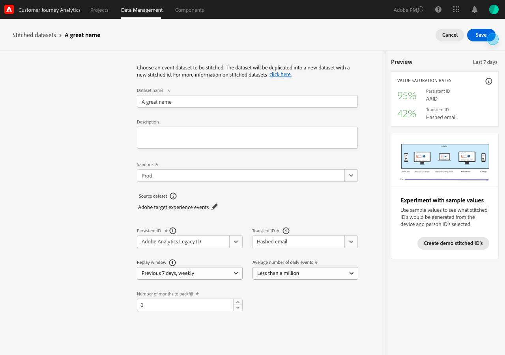

# Créer et gérer des jeux de données groupés

{{select-package}}

L’assemblage permet aux administrateurs d’assembler des identités sur les jeux de données disponibles dans Customer Journey Analytics. L’assemblage de jeux de données augmente la précision de la représentation d’un profil, ce qui se traduit par une meilleure analyse et un meilleur compte rendu des performances.

Le processus d’assemblage vous permet de définir un **identifiant persistant** existant dans un jeu de données. Combinez ensuite cet identifiant persistant pour une fenêtre de relecture spécifiée (quotidienne, hebdomadaire) avec l’**ID de personne** (identifiant de personne ou authentifié) le plus précis disponible pour ce jeu de données. Parmi les exemples d’identifiants de personne, citons notamment l’adresse e-mail, le numéro de téléphone, l’identifiant CRM ou d’autres identités stockées dans le graphique. Voir [Aperçu](overview.md) pour plus d’informations sur le groupement.

## Créer

Pour lancer le groupement, vous créez un ou plusieurs jeux de données groupés. Pour créer un jeu de données groupé :

1. Sélectionnez **[!UICONTROL ** Assemblage **]** dans **[!UICONTROL **&#x200B; Gestion des données &#x200B;**]** dans la barre supérieure.

2. Dans l’écran [!UICONTROL Jeux de données groupés], sélectionnez **[!UICONTROL **&#x200B; Créer un jeu de données groupé&#x200B;**]**.

   Une boîte de dialogue vous expliquant vos responsabilités s’affiche.

3. Sélectionnez **[!UICONTROL **&#x200B; Continuer &#x200B;**]** si vous acceptez ces responsabilités.

   >[!NOTE]
   >
   >    Si vous sélectionnez **[!UICONTROL **&#x200B; Annuler &#x200B;**]**, vous ne pouvez pas créer de jeu de données groupé.

4. À l’écran [!UICONTROL Jeux de données groupés > Jeu de données groupé sans titre] :

   1. Définissez un **[!UICONTROL ** Nom du jeu de données **]** et (facultatif) **[!UICONTROL **&#x200B; Description &#x200B;**]**,

   2. Sélectionnez la sandbox dans la liste **[!UICONTROL **&#x200B; Sandbox &#x200B;**]** où le jeu de données d’événement est stocké.

      

   3. Sélectionnez le bouton **[!UICONTROL **&#x200B; Sélectionner le jeu de données source &#x200B;**]**.

      Dans la fenêtre contextuelle [!UICONTROL Sélectionner un jeu de données à grouper] :

      

      - Sélectionnez un jeu de données, puis sélectionnez **[!UICONTROL **&#x200B; Sélectionner &#x200B;**]** pour continuer.

   4. Sélectionnez un identifiant persistant dans la liste **[!UICONTROL **&#x200B; ID persistant &#x200B;**]**.

   5. Sélectionnez un identifiant de personne dans la liste **[!UICONTROL **&#x200B; ID temporaire &#x200B;**]**.

      Vous remarquerez qu’un panneau d’aperçu s’affiche pour calculer les taux de saturation (nombre de fois qu’il existe une valeur pour chacun des identifiants spécifiés par rapport au nombre d’événements) pour les sept derniers jours. Une fois les calculs terminés, le panneau affiche les couleurs pour déterminer si les conditions minimales de groupement sont remplies (vert) ou non (rouge).

      

      Les conditions minimales sont les suivantes :

      - saturation persistante des identifiants : taux >= 95 %

      - saturation des identifiants de personne : taux >= 5 %

        Si les conditions minimales sont remplies, vous pouvez tester les valeurs d’échantillon.

      - Sélectionnez **[!UICONTROL **&#x200B; Créer des ID de démonstration groupés &#x200B;**]**.

        Dans la boîte de dialogue [!UICONTROL Expérimenter avec des valeurs d’échantillon], un tableau s’affiche avec des valeurs d’exemple pour [!UICONTROL horodatage], [!UICONTROL ID persistant], [!UICONTROL ID temporaire], [!UICONTROL ID groupé (actif)], [!UICONTROL ID groupé (relecture d’un jour)] et [!UICONTROL ID groupé (relecture de sept jours)].

             
            
            1. Saisissez une valeur pour l’ID persistant **[!UICONTROL **]**.
            
            2. Sélectionnez **[!UICONTROL **Actualiser les ID groupés**]** pour voir l’effet du processus de groupement sur les données du jeu de données.3 
            
            .  Sélectionnez **[!UICONTROL **Fermer**]** lorsque vous avez terminé d’expérimenter avec les valeurs d’échantillons.
        

        De retour dans l’écran [!UICONTROL Jeux de données groupés > _Nom du jeu de données_] :

   6. Sélectionnez une option pour la fréquence et la période de retraitement des données historiques dans la liste **[!UICONTROL **&#x200B; Fenêtre de relecture &#x200B;**]**.

      Vous pouvez choisir entre la valeur par défaut **[!UICONTROL ** Jour précédent, quotidien **]** ou **[!UICONTROL **&#x200B; Sept jours précédents, hebdomadaire &#x200B;**]**.

   7. Sélectionnez une valeur dans la liste **[!UICONTROL **&#x200B; Nombre moyen d’événements quotidiens &#x200B;**]**.

   8. Saisissez une valeur (entre `0` et `12`) en **[!UICONTROL **&#x200B; Nombre de mois pour le renvoi &#x200B;**]**.

   9. Sélectionnez **[!UICONTROL **&#x200B; Enregistrer &#x200B;**]** pour enregistrer le jeu de données groupé et lancer le groupement.

## Afficher le statut

Vous pouvez afficher le statut du groupement dans la liste [!UICONTROL Jeux de données groupés].

- Sélectionnez **[!UICONTROL ** Assemblage **]** dans **[!UICONTROL **&#x200B; Gestion des données &#x200B;**]** dans la barre supérieure.

  Une liste de jeux de données groupés, chacun identifié avec [!UICONTROL Sandbox], [!UICONTROL jeu de données Source], [!UICONTROL Statut], [!UICONTROL Statut de renvoi], [!UICONTROL Propriétaire] et [!UICONTROL Date de création], s’affiche.

  

  Les valeurs possibles pour [!UICONTROL Status] sont les suivantes :

  | Valeur | Explication |
  |-----|-----|
  | **[!UICONTROL **&#x200B; En file d’attente &#x200B;**]** | La demande est reçue et traitée bientôt. |
  | **[!UICONTROL **&#x200B; Création &#x200B;**]** en cours | Des ressources et un jeu de données nouvellement groupé sont en cours de création. |
  | **[!UICONTROL **&#x200B; Groupement en cours &#x200B;**]** | Des ressources et un jeu de données groupé existent et le groupement est en cours |
  | **[!UICONTROL **&#x200B; Erreur &#x200B;**] **&#x200B; | Il y a un problème de groupement. Peut-être qu’un schéma a changé entre le jeu de données source et le jeu de données groupé, que le volume quotidien est trop grand, ou... (_**&#x200B;plus d’informations ici...**_) |

  >[!INFO]
  >
  >    Chaque fois qu’un statut est modifié, une notification est envoyée avec le message **[!UICONTROL **&#x200B; Jeu de données groupé _nom du jeu de données_ est remplacé par le statut _nom du statut _**]**.

  Le [!UICONTROL statut de renvoi] peut avoir les valeurs suivantes : 0 %, 25 %, 50 %, 75 % ou 100 %.

  Vous pouvez sélectionner l’icône d’information pour afficher une fenêtre contextuelle contenant plus de détails sur le jeu de données groupé sélectionné.

## Supprimer

>[!NOTE]
>
>Vous pouvez uniquement supprimer les jeux de données dont le statut est [!UICONTROL Groupement en cours], [!UICONTROL Erreur] ou [!UICONTROL En file d’attente].

Pour supprimer un seul jeu de données groupé :

- Sélectionnez **[!UICONTROL **...**]** pour le jeu de données groupé et sélectionnez **[!UICONTROL **&#x200B; Supprimer &#x200B;**]** dans le menu.

  

Pour supprimer plusieurs données groupées :

- Sélectionnez plusieurs jeux de données groupés à l’aide de la case à cocher au début de chaque jeu de données répertorié.

- Sélectionnez **[!UICONTROL **...**]** dans l’un des jeux de données groupés sélectionnés et sélectionnez **[!UICONTROL **&#x200B; Supprimer &#x200B;**]** dans le menu.
