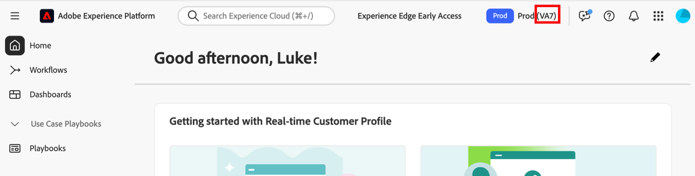

# Emplacements d’hébergement Customer Journey Analytics

Adobe Customer Journey Analytics est hébergé dans des centres de données d’entreprise de fournisseurs de services cloud public d’Amérique du Nord, d’Europe et d’APAC.

Lors de la mise en service, les clients désignent la zone géographique dans laquelle leurs données Adobe Experience Platform seront stockées. Les données ingérées dans Customer Journey Analytics à partir du lac de données Adobe Experience Platform seront stockées dans la même région.

Consultez [Collecte de données régionale](https://experienceleague.adobe.com/en/docs/core-services/interface/data-collection/rdc) dans la documentation Adobe CX Enterprise pour plus d’informations.

## Afficher le centre de données dans lequel vos données sont stockées

>[!NOTE]
>
>Il n’est pas possible de déplacer des données d’un centre de données à un autre.

Pour voir dans quel centre de données vos données sont stockées :

1. Connectez-vous à [Adobe CX Enterprise](https://experience.adobe.com) à l’aide de vos informations d’identification Adobe ID.

1. Sélectionnez **** dans le sélecteur d’applications  en haut à droite de l’interface.

1. Le code de région du centre de données qui vous a été attribué s’affiche dans la partie supérieure droite d’Experience Platform.

   

1. Utilisez le tableau suivant pour comprendre à quelle zone géographique votre indicatif régional est associé :

   | Code région Adobe | Fournisseur de cloud | Région géographique |
   |-------------------|-------|-------------------------------------------|
   | VA7 | Azure | États-Unis (par défaut) |
   | VA6 | AWS | États-Unis (sur demande) |
   | NLD2 | Azure | Pays-Bas, Amsterdam |
   | CAN2 | Azure | Canada Central, Toronto |
   | AUS5 | Azure | Australie, Sydney |
   | GBR9 | Azure | Royaume-Uni, Londres |
   | IND2 | Azure | Inde |
   | CHE2 | Azure | Suisse |

