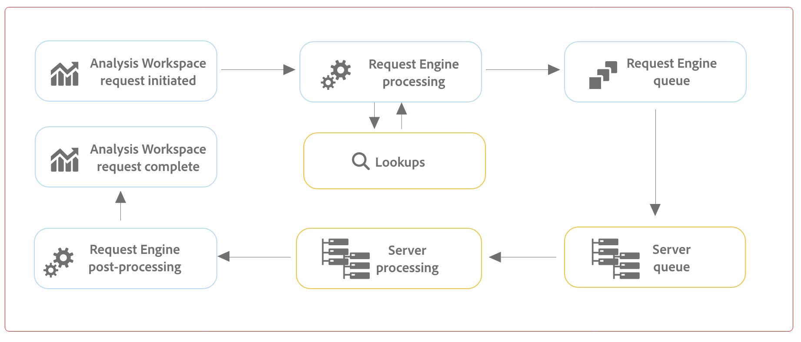

# Optimiser les performances du Customer Journey Analytics et de [!UICONTROL Analysis Workspace]

Divers facteurs peuvent avoir une influence sur les performances globales des Customer Journey Analytics ainsi que sur les performances d’un projet dans Analysis Workspace. Dans Workspace, un message d’erreur indiquant que

`This query is too complex. Please review best practices for building Analysis Workspace queries.`

Ces bonnes pratiques expliquent quels facteurs peuvent être à l’origine de cette erreur et comment simplifier le rapport/projet.

## Facteurs de requête {#query}

Il s’agit des facteurs de requête les plus courants qui influent sur les performances globales du Customer Journey Analytics :

| Facteur | Définition | Influencé par | Optimisation |
| --- | --- | --- | --- |
| **Nombre de lignes et de colonnes à structure libre** | Le nombre total de cellules de tableau à structure libre dans le projet, calculé par lignes * colonnes dans tous les tableaux. Exclut les sources de données masquées. La ligne directrice est de 4000. | | Réduisez le nombre de colonnes dans votre tableau en conservant uniquement les points de données les plus pertinents. Réduisez le nombre de lignes du tableau en ajustant le nombre de lignes affichées au moyen dʼun filtre de tableau. |
| **Composants utilisés** | Le nombre total de composants utilisés dans le projet. La ligne directrice est de 100. | Le nombre de composants utilisés n’influe pas directement sur les performances. Toutefois, la complexité de ces composantes contribuera à la performance du projet. Voir les optimisations dans la section « Facteurs supplémentaires » ci-dessous. |
| **Période la plus longue** | Ce facteur affiche la période la plus longue utilisée pour le projet. La ligne directrice est d’un an. |  | Si possible, n’extrayez que les données dont vous avez besoin. Limitez le calendrier du panneau aux dates appropriées à votre analyse ou utilisez des composants de période (composants violets) dans vos tableaux à structure libre. Les périodes utilisées dans un tableau remplacent les périodes du panneau. Par exemple, vous pouvez ajouter le mois dernier, la semaine dernière et hier aux colonnes du tableau pour demander ces périodes spécifiques. Pour en savoir plus sur l’utilisation des périodes dans Analysis Workspace, [regardez cette vidéo](https://experienceleague.adobe.com/docs/analytics-learn/tutorials/analysis-workspace/calendar-and-date-ranges/date-ranges-and-calendar-in-analysis-workspace.html?lang=fr).   En outre, réduisez le nombre de comparaisons d’une année à l’autre utilisées dans le projet. Lorsqu’une comparaison d’une année à l’autre est calculée, elle examine l’ensemble des données des 13 mois concernés. Cette action a le même impact que de définir la période du panneau sur les 13 derniers mois. |
| **Complexité du filtre** | Des filtres complexes peuvent avoir un impact significatif sur la performance des projets. | Les facteurs qui ajoutent de la complexité à un filtre (dans l’ordre décroissant d’impact) incluent les éléments suivants : <ul><li>Les opérateurs de type « contient », « contient n’importe lequel », « correspond à », « commence par » ou « se termine par ». </li><li>Filtrage séquentiel, en particulier lorsque des restrictions de dimension (Within/After) sont utilisées </li><li>Le nombre d’éléments de dimensions uniques dans les dimensions utilisées dans le filtre (par exemple, Page = « A » lorsque la page comporte 10 éléments uniques est plus rapide que Page = « A » lorsque la page comporte 100 000 éléments uniques). </li><li>Le nombre de dimensions différentes utilisées (par exemple, Page = &#39;Home&#39; et Page = &#39;Search results&#39; seront plus rapides que eVar 1 = &#39;red&#39; et eVar 2 = &#39;blue&#39;)</li><li>Beaucoup d’opérateurs OR (au lieu de AND)</li><li>Conteneurs imbriqués dont la portée varie (par exemple, &quot;Événement&quot; dans &quot;Session&quot; à l’intérieur de &quot;Personne&quot;)</li></ul> | Bien qu’il soit impossible d’éviter certains facteurs de complexité, recherchez les possibilités de réduire la complexité de vos filtres. En général, plus vous pouvez être précis dans vos critères de filtre, mieux c’est. Par exemple :<ul><li>Avec les conteneurs, l’utilisation d’un seul conteneur en haut du filtre est plus rapide qu’une série de conteneurs imbriqués.</li><li>Avec les opérateurs, &quot;equals&quot; est plus rapide que &quot;contains&quot; et &quot;equals any of&quot; est plus rapide que &quot;contains any of&quot;.</li><li>Avec de nombreux critères, les opérateurs ET sont plus rapides qu’une série d’opérateurs OU.</li></ul> Recherchez des occasions de réduire de nombreuses instructions OR en une seule instruction &quot;equals any of&quot;.  |
| **Complexité de la visualisation** (filtres, mesures, filtres) | Le type de visualisation (abandons ou tableau à structure libre, par exemple) ajouté à un projet n’a pas d’incidence importante sur les performances du projet. C’est la complexité de la visualisation qui augmente le temps de traitement. | Voici quelques-uns des facteurs qui rendent une visualisation plus complexe :<ul><li>Plage de données demandée</li><li>Nombre de filtres appliqués ; par exemple, les filtres utilisés comme des lignes d’un tableau à structure libre</li><li>Utilisation de filtres complexes</li><li>Lignes ou colonnes de [postes statiques](/help/analysis-workspace/visualizations/freeform-table/column-row-settings/manual-vs-dynamic-rows.md) dans les tableaux de forme libre</li><li>Filtres appliqués aux lignes des tableaux à structure libre</li><li>Nombre de mesures incluses, en particulier les mesures calculées qui utilisent des filtres</li></ul> |
| **Capacité du centre de données** | Capacité de création de comptes rendus des performances que vous et dʼautres clients partagez au sein dʼun centre de données Adobe. | Cela dépend du nombre de requêtes simultanées effectuées par votre entreprise et dʼautres entreprises au sein de votre centre de données. | Votre entreprise a droit à une capacité déterminée, et, si le système est peu sollicité, Adobe vous transférera une capacité supérieure à celle à laquelle vous avez droit. |
| **Nombre de requêtes simultanées** | Nombre de requêtes qui sont demandées par votre organisation en même temps. Chaque organisation a droit à au moins 5 requêtes simultanées. Si un rapport prend beaucoup de temps, cʼest généralement parce quʼil est dans une file dʼattente avec dʼautres rapports. Cela signifie que votre entreprise tente d’exécuter de nombreuses requêtes simultanées sur une vue de données spécifique. | Les requêtes peuvent provenir de requêtes d’API, d’interfaces utilisateur de création de rapports (Analysis Workspace, Report Builder, etc.), de projets planifiés, d’alertes planifiées et d’utilisateurs simultanés effectuant des requêtes de création de rapports. | Diffusez vos requêtes et plannings pour la vue de données de manière plus uniforme tout au long de la journée. De même, déplacez vos requêtes vers les heures creuses lorsque cela est possible. Le lundi matin, le mardi matin et le premier jour de chaque mois sont les périodes de pointe pour les comptes rendus des performances. |
| **Taille de connexion** | La quantité de données collectées dans votre connexion. |  | Consultez votre équipe de mise en oeuvre ou votre expert Customer Journey Analytics pour déterminer si des améliorations peuvent être apportées à l’implémentation afin d’améliorer l’expérience globale dans Customer Journey Analytics. |
| **Complexité des paramètres de dimension** | Les dimensions très complexes peuvent avoir un impact significatif sur les performances du projet, en particulier les dimensions ou les mesures basées sur des champs personnalisés complexes. | | Réduisez le nombre de champs personnalisés ou créez des dimensions distinctes. |
| **Dimensions avec beaucoup de valeurs uniques** | Également appelées dimensions à cardinalité élevée, ces dimensions peuvent avoir un impact sur les performances de création de rapports. | Voir [dimensions à cardinalité élevée](/help/components/dimensions/high-cardinality.md) | Voir [dimensions à cardinalité élevée](/help/components/dimensions/high-cardinality.md) |

## [!UICONTROL Aide] > [!UICONTROL Performances] dans Analysis Workspace

Différents facteurs peuvent influencer les performances d’un projet dans Analysis Workspace. Il convient de savoir quels sont ces facteurs avant de démarrer un projet, afin de planifier et d’élaborer le projet d’une manière optimale. Cette section comprend une liste des facteurs qui affectent les performances et les optimisations que vous pouvez effectuer pour garantir des performances optimales dans Analysis Workspace.

Sous **Analysis Workspace > [!UICONTROL Aide] > [!UICONTROL Performances]**, vous pouvez voir les facteurs qui affectent les performances de votre projet, notamment les facteurs de réseau, de navigateur et de projet. Pour obtenir des résultats plus précis, laissez le projet à se charger complètement avant d’ouvrir la page Performances.

* La colonne Projet actuel affiche les résultats de votre projet actuel et de votre environnement utilisateur.
* La colonne Ligne directrice affiche le seuil recommandé par Adobe pour chaque facteur.

En outre, vous pouvez **Télécharger au format CSV** le contenu des performances à partager facilement avec l’Assistance clientèle d’Adobe ou vos équipes informatiques internes.

>[!NOTE]
>
>Les informations de la page Performances varient chaque fois que la fenêtre modale est ouverte, car les facteurs peuvent changer. En outre, Adobe continuera d’affiner les lignes directrices fournies au fur et à mesure que davantage de données seront disponibles.

### Facteurs réseau

[!UICONTROL Aide] > [!UICONTROL Performances]. Les facteurs de performances du réseau incluent :

| Facteur | Définition | Influencé par | Optimisation |
| --- | --- | --- | --- |
| **Connexion à l’Adobe** | Adobe envoie 10 appels test lorsque la page de performances est ouverte. Ceci représente le pourcentage de ces appels à Adobe qui réussissent. | Des problèmes de réseau local ou des problèmes Adobe auront une influence sur ce facteur. | Consultez status.adobe.com pour vérifier s’il existe des problèmes de service connus. Ensuite, validez votre connexion réseau locale. |
| **Bande passante Internet** | Disponible pour Google Chrome uniquement. Estimation de la bande passante de votre navigateur à votre emplacement. La limite est de 2 Mo/s. | Votre connexion réseau locale aura un impact sur ce facteur. | Validez votre connexion réseau locale. |
| **Latence Internet** | Adobe envoie 10 appels test lorsque la page de performances est ouverte. Cela représente le temps moyen nécessaire pour que chaque demande soit envoyée à Adobe et renvoyée. En d’autres termes, il s’agit d’une mesure de la vitesse Internet entre votre emplacement et Adobe. La ligne directrice est de &lt; 1 seconde. | Des problèmes de réseau local, un grand nombre d’onglets ouverts sur le navigateur ou des problèmes Adobe auront une influence sur ce facteur. | Consultez status.adobe.com pour vérifier s’il existe des problèmes de service connus. Ensuite, validez votre connexion réseau locale et fermez les onglets inutilisés du navigateur. |

### Facteurs du navigateur

[!UICONTROL Aide] > [!UICONTROL Performances]. Les facteurs de performances du navigateurs incluent :

| Facteur | Définition | Influencé par | Optimisation |
| --- | --- | --- | --- |
| **Vitesse de calcul** | La vitesse à laquelle votre ordinateur effectue un test de traitement. La ligne directrice est de &lt; 750 ms. | Votre matériel ainsi que des programmes ouverts simultanément auront un impact sur ce facteur. | Ouvrez le Gestionnaire de tâches (PC) ou le Moniteur d’activité (Mac) de votre ordinateur pour déterminer si des programmes peuvent être fermés. Fermez ensuite les onglets inutilisés du navigateur ou d’autres programmes.   Si ces actions n’aident pas, discutez des détails matériels avec votre équipe informatique. |
| **Mémoire utilisée** | Disponible pour Google Chrome uniquement. Chaque onglet Workspace d’un navigateur Google Chrome partage 4 Go de mémoire au total. Ceci représente le pourcentage de cette mémoire allouée utilisée par le projet actuel. La ligne directrice est de 3 500 Mo, ce qui est le seuil auquel Workspace commence à afficher les erreurs de mémoire. | L’utilisation de plusieurs onglets ou le téléchargement de 50 000 lignes de données contribuera à une utilisation accrue de la mémoire. | Si vous recevez une erreur de mémoire, fermez les autres onglets Workspace et/ou exécutez 50 000 téléchargements de ligne, un à la fois. |
| **Stockage local utilisé** | Données stockées localement sur votre ordinateur en vue de leur utilisation dans le navigateur. Chaque origine (ex. : experience.adobe.com) a une capacité de 10 Mo. | Analysis Workspace utilise l’enregistrement local pour plusieurs fonctions, notamment pour stocker des projets enregistrés automatiquement (existants), des paramètres utilisateur et des indicateurs de fonctionnalité. | Pour éviter toute perturbation des fonctions Analysis Workspace, effacez l’enregistrement local du domaine experience.adobe.com. |
| **Vitesse de rendu** | FPS signifie Frames per second (Images par seconde), c’est-à-dire le nombre de fois par seconde que le navigateur trace la page sur votre écran. 24 FPS est généralement ce que l’oeil humain peut observer ; si le FPS est inférieur à cela, vous constaterez des problèmes de rendu dans Workspace. | Le FPS est affecté par l’exécution de nombreuses tâches simultanées dans de nombreux projets Workspace et par la taille du projet affiché. D’autres programmes exécutés sur votre ordinateur peuvent avoir un impact, comme la diffusion en continu, les scanneurs en arrière-plan, etc. De plus, votre matériel aura un impact sur ce facteur. | Ouvrez le Gestionnaire de tâches (PC) ou le Moniteur d’activité (Mac) de votre ordinateur pour déterminer si des programmes peuvent être fermés. Fermez ensuite les onglets inutilisés du navigateur ou d’autres programmes.   Si ces actions n’aident pas, discutez des détails matériels avec votre équipe informatique. |

### Facteurs du projet

[!UICONTROL Aide] > [!UICONTROL Performances]. Les facteurs de performances du projet incluent :

| Facteur | Définition | Optimisation |
| --- | --- | --- |
| **Nombre de requêtes** | Nombre total de requêtes (demandes) effectuées à Adobe pour extraire les données affichées dans le projet. Les requêtes comprennent les demandes avec classement de tableaux, de détection des anomalies, de graphiques sparkline, de composants affichés dans le rail de gauche, etc. Exclut les panneaux et les visualisations réduits. La ligne directrice est de 100. | Simplifiez votre projet lorsque cela est possible en divisant les données en plusieurs projets qui répondent à un objectif spécifique ou à un groupe de parties prenantes. Utilisez les balises pour organiser les projets par thèmes et utilisez les [liens directs](https://experienceleague.adobe.com/docs/analytics/analyze/analysis-workspace/curate-share/shareable-links.html?lang=fr) pour créer une table des matières interne afin que les parties prenantes puissent trouver plus facilement ce dont elles ont besoin. |
| **Panneaux développés (sur le total des panneaux)** | Nombre de panneaux développés sur le nombre total de panneaux du projet. La ligne directrice est de 5. | Après avoir pris des mesures pour simplifier votre projet, réduisez les panneaux de votre projet qui n’ont pas besoin d’être affichés au chargement. Lorsque le projet est ouvert, seuls les panneaux développés sont traités. Les panneaux réduits ne sont pas traités tant que l’utilisateur ne les développe pas. |
| **Visualisations étendues (sur le total des visualisations)** | Nombre de tableaux et de visualisations développés par rapport au total du projet, y compris les sources de données masquées. La ligne directrice est de 15. | Après avoir pris des mesures pour simplifier votre projet, réduisez les visualisations de votre projet qui n’ont pas besoin d’être affichées au chargement. Classez par ordre de priorité les éléments visuels qui sont les plus importants pour le consommateur du rapport et décomposez les éléments visuels associés dans un panneau ou projet distinct et plus détaillé, au besoin. |
| **Nombre de cellules à structure libre** | Voir le tableau &quot;facteurs de requête&quot; ci-dessus. | |
| **Composants utilisés** | Voir le tableau &quot;facteurs de requête&quot; ci-dessus. | |
| **Période la plus longue** | Voir le tableau &quot;facteurs de requête&quot; ci-dessus. | |

## Facteurs de requête

[!UICONTROL Aide] > [!UICONTROL Performances] facteurs de requête

Utilisez le diagramme et les termes suivants pour découvrir comment les demandes sont traitées et les différents facteurs qui influencent les temps de traitement :

>[!NOTE]
>
>Les instructions recommandées pour ces facteurs sont basées sur un score de complexité de Medium pour les demandes de création de rapports.

### Diagramme de traitement des requêtes

### Demander des termes de traitement

| Facteur | Définition | Optimisation |
| --- | --- | --- |
| [!UICONTROL **Temps moyen de requête**] | Temps nécessaire entre le moment où la requête est initiée et le moment où elle est terminée. La ligne directrice est de 15 secondes. 
Dans le diagramme [Traitement des requêtes](#request-processing-diagram) ci-dessus, le temps de requête représente le processus complet, de la **requête Analysis Workspace initiée** à la **requête Analysis Workspace terminée**.
 |  |
| [!UICONTROL **Temps de requête le plus long**] | Temps nécessaire entre le moment où la requête est initiée et le moment où elle est terminée. 
Dans le diagramme [Traitement des requêtes](#request-processing-diagram) ci-dessus, le temps de requête représente le processus complet, de la **requête Analysis Workspace initiée** à la **requête Analysis Workspace terminée**.
 |  |
| [!UICONTROL **Durée moyenne de recherche**] | Comme Analysis Workspace stocke uniquement le hachage de toutes les chaînes utilisées dans n’importe quel segment, chaque fois que vous traitez un projet, les **recherches** sont effectuées pour faire correspondre les hachages aux valeurs appropriées. La ligne directrice est inférieure à 2 secondes.
Il peut s’agir d’un processus gourmand en ressources, en fonction du nombre de valeurs susceptibles de correspondre au hachage. 

Dans le diagramme [Traitement des requêtes](#request-processing-diagram) ci-dessus, la durée de recherche est représentée dans la phase **Recherches** (au moment du **traitement du moteur de requête**).
 | Si les requêtes ralentissent ici, c’est probablement dû à un trop grand nombre de segments de chaîne dans votre projet, ou à des chaînes avec des valeurs trop génériques qui ont trop de correspondances potentielles. |
| [!UICONTROL **Durée moyenne de la file d’attente**] | Durée totale en attente dans la file d’attente avant le traitement des demandes. La ligne directrice est de 5 secondes.
Dans le diagramme [Traitement des requêtes](#request-processing-diagram) ci-dessus, l’heure de la file d’attente est représentée dans les phases **File d’attente du moteur de requêtes** et **File d’attente du serveur**.
 | Si les requêtes ralentissent ici, cela peut être dû à un trop grand nombre de requêtes s’exécutant simultanément dans votre organisation. Essayez d’exécuter la requête à une heure creuse. |
| [!UICONTROL **Temps moyen de traitement du serveur**] | Durée moyenne du traitement de la requête.
Dans le diagramme [Traitement des requêtes](#request-processing-diagram) ci-dessus, la durée moyenne de traitement du serveur est représentée dans les phases **File d’attente du serveur** et **Traitement du serveur**. La ligne directrice est de 10 secondes. | Si les requêtes ralentissent ici, il est probable que le projet comporte des périodes trop longues ou des visualisations complexes. Essayez de raccourcir la période de votre projet afin de réduire les temps de traitement. |
| [!UICONTROL **Complexité**] | Toutes les demandes ne nécessitent pas le même temps de traitement. La complexité de la requête peut vous aider à obtenir une idée générale du temps nécessaire au traitement de la requête. La ligne directrice est Medium ou inférieure. 
Valeurs possibles :
 <ul><li>[!UICONTROL **Low**]</li><li>[!UICONTROL **Medium**]</li><li>[!UICONTROL **High**]</li></ul>Cette valeur est influencée par les valeurs des colonnes suivantes :<ul><li>[!UICONTROL **Limites mensuelles**]</li><li>[!UICONTROL **Colonnes**]</li><li>[!UICONTROL **Segments**]</li></ul> |  |
| [!UICONTROL **Limites mensuelles**] | Nombre de mois inclus dans une requête. Plus de limites de mois ajoute à la complexité de la requête. La ligne directrice est de 6 ou moins. | Si les requêtes ralentissent ici, c’est peut-être parce que les limites des mois dans votre projet sont trop importantes. Essayez de réduire le nombre de mois. |
| [!UICONTROL **Colonnes**] | Nombre de mesures et de ventilations dans la requête. Plus de colonnes ajoute à la complexité de la requête. La ligne directrice est de 10 ou moins. | Si les requêtes ralentissent ici, c’est peut-être parce qu’il y a trop de colonnes dans votre projet. Essayez de réduire le nombre de colonnes. |
| [!UICONTROL **Segments**] | Le nombre de segments appliqués à la requête. Plus de segments ajoute à la complexité de la requête. La ligne directrice est de 5 ou moins. | Si les requêtes ralentissent ici, c’est peut-être parce qu’il y a trop de segments dans votre projet. Essayez de réduire le nombre de segments. |
