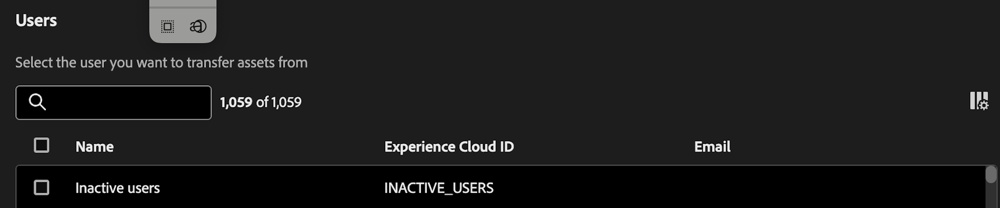

# Transfert de ressources

L’outil de transfert de ressources vous permet de transférer la propriété des ressources à d’autres utilisateurs. Assets peut inclure des composants tels que des projets, des segments, des périodes, des mesures calculées, des annotations, des alertes et des projets planifiés.

Les Assets sont souvent liées à un propriétaire individuel et, dans certains cas, comme les segments et les mesures calculées, ne peuvent pas être modifiées ni partagées, même par les administrateurs et administratrices. Lorsque les utilisateurs quittent l’organisation ou que leur rôle change, il peut s’avérer nécessaire de transférer la propriété de ces ressources à d’autres utilisateurs afin d’assurer la continuité et un accès approprié.

## Autorisations

Le transfert de ressources nécessite l’autorisation d’administrateur de produit pour Customer Journey Analytics.

## Transfert de ressources

1. Dans CJA, accédez à **[!UICONTROL Outils]** > **[!UICONTROL Transfert de ressources]**.

   

1. Dans la boîte de dialogue **[!UICONTROL Utilisateurs]**, recherchez et sélectionnez l’utilisateur à partir duquel vous souhaitez transférer des ressources.

   >[!IMPORTANT]
   >
   >Vous pouvez uniquement effectuer un transfert 1:1 d’un utilisateur à un autre. Les transferts de type « un à plusieurs » ou « plusieurs à un » ne sont pas pris en charge.

1. Une fois que vous avez sélectionné un utilisateur, l’option Transférer les ressources s’affiche en bas de l’écran.

   

1. Cliquez sur **[!UICONTROL Transférer les ressources]**.

1. Sur l’écran **[!UICONTROL Transfert de ressources]**, sélectionnez d’abord le destinataire auquel vous souhaitez transférer des ressources.

1. Passez maintenant en revue chaque dossier de composant dans le volet de navigation de gauche pour sélectionner des composants individuels ou toutes les ressources d’un dossier à transférer.

   >[!NOTE]
   >
   >Le transfert de ressources d’un administrateur vers un non-administrateur ne met pas à niveau le destinataire vers un administrateur.

   >[!NOTE]
   >
   >    Lors du transfert de ressources qui font référence à d’autres composants (par exemple, des projets qui font référence à d’autres segments et mesures calculées), les composants qui ne sont pas détenus par le propriétaire actuel du projet ne seront partagés qu’avec le destinataire. La propriété de tous les autres composants sera transférée au destinataire.

1. Pour sélectionner _toutes_ les ressources d’un dossier, cochez la case en regard de **[!UICONTROL Nom]** dans la partie supérieure du tableau.

   

1. Cliquez sur **[!UICONTROL Transférer]** en haut à droite après avoir effectué toutes vos sélections.

1. Cliquez sur **[!UICONTROL Confirmer]** lorsque le message de confirmation s’affiche.

   >[!IMPORTANT]
   >
   >Ne fermez pas l&#39;écran pendant le transfert pour éviter l&#39;interruption du processus. Cela garantit une expérience de transfert fluide.

## Résultats du transfert

Un transfert peut avoir trois conséquences :

- **Transfert réussi** : « Assets transféré avec succès. »

- **Succès partiel** : « Certaines ressources ont été transférées avec succès. »

- **Échec du transfert** : « Échec du transfert des ressources. Veuillez réessayer. »

### Raisons potentielles de l’échec du transfert d’actifs

- Services dépendants à l’origine des échecs : le transfert de ressources interagit avec un service différent pour chaque type de composant (par exemple, problèmes réseau, problèmes de service en aval), ce qui peut entraîner un échec partiel ou complet, ou des échecs intermittents.

- Composant manquant ou transféré par un autre administrateur : un composant a été supprimé par un autre utilisateur ou transféré par un autre administrateur à une autre personne, alors qu’une tâche de transfert de ressources était toujours en cours.

- Le corps POST de l’API ne se remplit pas correctement : un composant peut ne pas être envoyé dans le corps POST de l’API lorsque plusieurs types de composants sont sélectionnés.

- Utilisateur inexistant : l’utilisateur a été supprimé lors du transfert ou n’est pas valide pour une autre raison. Si l’utilisateur n’est pas valide avant le début du transfert, l’outil l’intercepte et ne traite pas le traitement. Si l’utilisateur a été supprimé en cours de transfert, cela peut entraîner des échecs partiels.

- Échec de connexion/réseau : la connexion meurt lors du transfert intermédiaire. Tous les lots de tâches de transfert déjà transmis au serveur principal sont toujours traités jusqu’à la fin, mais l’utilisateur ne voit pas le message de résultat du transfert avec un résumé de ce qui a réussi et de ce qui a échoué.

- Fermeture de l’onglet du navigateur en cours de transfert : pour les transferts très volumineux, si l’onglet du navigateur est fermé ou si vous quittez la page en cours de transfert, seules les requêtes réseau effectuées avant la fermeture de l’onglet/la navigation dans la page se produisent pour transférer correctement les ressources. Si l’utilisateur revient à la page, il ne reçoit pas le message de statut de la réponse indiquant quelles ressources ont été transférées et lesquelles ne l’ont pas été.

## Transfert de ressources lors de la mise à niveau d’Adobe Analytics vers Customer Journey Analytics

L’un des principaux cas d’utilisation du transfert de ressources concerne la mise à niveau d’Adobe Analytics vers Customer Journey Analytics.

La fonctionnalité [ Migration des composants ](https://experienceleague.adobe.com/en/docs/analytics/admin/admin-tools/component-migration/component-migration) d’Adobe Analytics vous permet de migrer les projets détenus par l’administrateur vers d’autres administrateurs. Tous les composants qui constituent ces projets sont ensuite recréés dans Customer Journey Analytics et l’administrateur ou l’administratrice du destinataire possède tous ces composants, quelle que soit la personne qui les a créés.

Cet outil de transfert de ressources permet par la suite aux administrateurs de réaffecter des composants à leurs propriétaires légitimes, qu’ils soient administrateurs ou non.

>[!IMPORTANT]
>
>Bien que vous puissiez transférer des composants à l’aide de cet outil, vous devez, en tant qu’administrateur, vous assurer que le destinataire a accès aux vues de données requises pour afficher/utiliser ces composants. Vous pouvez afficher et attribuer des autorisations dans [Admin Console](https://helpx.adobe.com/fr/enterprise/using/admin-console.html).

## Exporter dans un fichier CSV

L’option **[!UICONTROL Exporter au format CSV]** permet uniquement aux administrateurs de télécharger une liste d’utilisateurs affichée dans un fichier .csv. Il ne leur permet pas d’exporter une liste des ressources transférées vers un fichier .csv.

## Utilisateurs et utilisatrices inactifs

Tous les utilisateurs précédemment supprimés apparaissent sous une seule entrée « Utilisateurs inactifs », ainsi que tous leurs composants orphelins. Ces composants peuvent être transférés à un nouveau destinataire. Cette fonctionnalité sera disponible en janvier.

