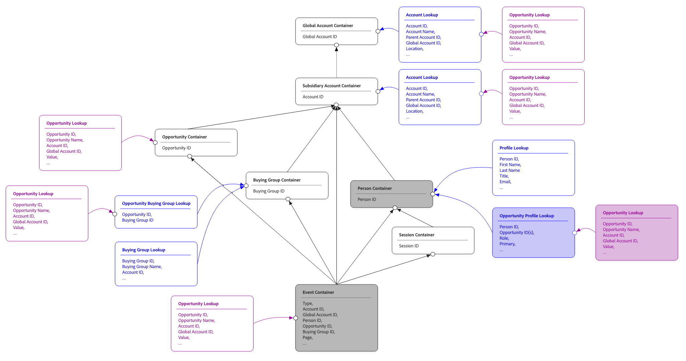

# Recherches partagées

Dans Customer Journey Analytics, un jeu de données de recherche enrichit vos données d’événement avec du contexte supplémentaire. Par exemple, un jeu de données de catalogue de produits qui ajoute des noms de produits, des catégories et des prix à vos événements d’achat. Ou un jeu de données de métadonnées de campagne qui ajoute les détails de la campagne à vos événements marketing.

Les recherches vous permettent de créer des rapports sur les données d’événement à l’aide d’attributs non stockés dans les événements eux-mêmes.
Traditionnellement, un jeu de données de recherche est associé aux événements par le biais d’un seul chemin fixe. Un champ clé du jeu de données d’événement est mis en correspondance avec un champ clé du jeu de données de recherche. Cette recherche fonctionne lorsqu’il n’existe qu’une seule façon de mettre en relation les deux jeux de données, mais ce lien simple se décompose en scénarios courants du monde réel :

* Un catalogue de produits joint à des événements sur le SKU du produit ou l’ID de produit, selon la source de l’événement.
* Une recherche d’attributs utilisateur jointe à des événements sur différents espaces de noms d’identité, en fonction du canal (e-mail pour les événements web, ID de fidélité pour les événements en magasin).
* Un jeu de données de profil joint aux événements directement (par personne) et indirectement (par compte, à des fins de création de rapports B2B)

Les recherches partagées résolvent les jointures à chemin fixe limitées en vous permettant de définir plusieurs chemins de jointure entre un jeu de données de recherche et les événements que les données de recherche enrichissent. Chaque chemin décrit une façon de faire correspondre des lignes de recherche à des lignes d’événement. Les dimensions ou les mesures, basées sur la recherche, peuvent choisir le chemin à utiliser. Le même jeu de données de recherche peut désormais alimenter plusieurs scénarios de création de rapports à partir d’une seule configuration.

Les recherches partagées sont également la base des rapports [population totale](./tpr.md), qui utilisent les recherches partagées pour connecter les jeux de données de profil aux événements.

## Concepts

Les sections suivantes décrivent les principaux concepts de recherches partagées.

### Chemins de jointure

Un chemin de jointure est un chemin unique pour faire correspondre les lignes entre un jeu de données de recherche et les événements. Chaque chemin de jointure possède :

* Un **chemin d’accès**. Libellé lisible par l’utilisateur choisi, utilisé pour identifier le chemin d’accès dans l’interface utilisateur lors de la création de dimensions et de mesures.
* Un **champ clé** du côté des événements. Ce champ est utilisé pour faire correspondre l’événement aux données de recherche.
* Un **champ de clé correspondant** du côté recherche.  Ce champ est celui auquel la clé correspond.
* Un **espace de noms** facultatif. L’espace de noms est requis lorsque le champ clé est un mappage d’identités.

Un seul jeu de données de recherche peut avoir un ou plusieurs chemins de jointure. Les dimensions et les mesures créées sur un champ dans cette recherche peuvent spécifier le chemin d’accès à utiliser. Si aucun chemin n’est spécifié, le chemin par défaut d’un jeu de données est utilisé.

### Correspondance par conteneur

Pour les jeux de données de profil (utilisés avec les rapports sur la population totale), les recherches partagées prennent en charge une correspondance par paramètre de conteneur qui configure automatiquement la jointure en fonction du type de conteneur :

* **Correspondance par conteneur de personnes**. La recherche est jointe aux événements via l’identité de la personne, en utilisant le mappage d’identité du jeu de données d’événement comme clé.
* **Correspondance par conteneur de compte** [!BADGE B2B edition]{type=Informative url="https://experienceleague.adobe.com/fr/docs/analytics-platform/using/cja-overview/cja-b2b/cja-b2b-edition" newtab=true tooltip="Customer Journey Analytics B2B Edition"}. La recherche est jointe via l’identité du compte.
* **Correspondance par conteneur de comptes globaux** ([!BADGE B2B edition]{type=Informative url="https://experienceleague.adobe.com/fr/docs/analytics-platform/using/cja-overview/cja-b2b/cja-b2b-edition" newtab=true tooltip="Customer Journey Analytics B2B Edition"} avec comptes globaux activés). La recherche est jointe via l’identité de compte globale.

Correspondance par conteneur gère les cas courants sans que vous ayez à configurer manuellement les champs clés. Le principal avantage de la correspondance par conteneur est que les dédoublonnements sont automatiquement gérés. Le conteneur stocke les identités uniques (pour la personne, le compte ou le compte global).

Au-delà des rapports sur la population totale, vous pouvez également utiliser la correspondance par conteneur pour définir des chemins de jointure vers d’autres jeux de données de recherche.

### Correspondance par champ

Vous pouvez également faire correspondre des jeux de données de profil par champ. Cette correspondance entraîne des recherches directes pour chaque événement dans les données d’événement, en fonction d’une identité spécifique. Lorsque vous utilisez la correspondance par champ, les résultats peuvent contenir des données dupliquées, ce qui peut entraîner des résultats déroutants, en particulier lorsqu’ils sont utilisés avec des mesures. Voir [Exemple](#example) pour une explication plus détaillée.

### Mappages d’identités en tant que champs clés

Lorsque le champ de clé de chaque côté de la jointure est un mappage d&#39;identités (champ contenant plusieurs identités d&#39;espace de noms), une configuration supplémentaire est nécessaire :

* **clé de Principal** ou **espace de noms**. Vous pouvez effectuer une correspondance à l’aide de la clé primaire du mappage d’identités ou en sélectionnant un espace de noms spécifique. La sélection d’un espace de noms est le choix le plus courant ; la clé primaire n’est pas renseignée dans toutes les sources de données de profil.
* **Espace de noms Secondaire**. Dans les cas où l’espace de noms principal n’est pas renseigné sur une ligne donnée (ce qui est commun aux jeux de données assemblés), vous pouvez spécifier un espace de noms de secours. La jointure utilise l’espace de noms principal lorsqu’il est renseigné et revient au secondaire dans le cas contraire.
* **Cohérence entre les chemins**. Lorsque la même carte des identités est utilisée comme champ de clé dans plusieurs recherches partagées sur une connexion, les sélections d’espace de noms doivent être cohérentes entre ces recherches.

### Recherche sur les chemins de recherche

Un jeu de données de recherche peut lui-même être joint à un autre jeu de données de recherche. Cette recherche crée une chaîne de recherche à deux niveaux : événement → recherche A → recherche B.

Chaque niveau de la chaîne de recherche peut avoir ses propres chemins de jointure. Les dimensions ou les mesures créées sur les champs de la recherche de deuxième niveau parcourent la chaîne en utilisant le chemin d’accès configuré à chaque étape. Les chaînes de recherche de plus de deux niveaux ne sont pas prises en charge.

## Conditions d’utilisation

Utilisez les recherches partagées lorsque l’une des conditions suivantes est vraie :

* Vous devez associer le même jeu de données de recherche aux événements de plusieurs manières.
* Vous utilisez des données d’identité B2C (business to consumer) où différents événements utilisent différents espaces de noms d’identité.
* Vous configurez une connexion B2B (entreprise à entreprise) qui doit mettre en relation des événements avec des personnes et des comptes.
* Vous ajoutez un jeu de données de profil à une connexion pour le compte rendu des performances de la population totale.

Si votre jeu de données de recherche comporte une seule clé de jointure évidente et que vous n’avez besoin que d’une seule façon de mettre en relation les données du jeu de données de recherche avec des événements, vous pouvez configurer un seul chemin d’accès. Les recherches partagées prennent également en charge ce cas simple.

## Exemple

L’exemple complet ci-dessous décrit les recherches partagées en général.

Imaginez que vous ayez, en regard d’un jeu de données d’événement, les jeux de données de profil, profil d’opportunité, compte et recherche d’opportunité suivants configurés dans le cadre de la connexion à Customer Journey Analytics.

Les exemples de données pour chaque jeu de données :

>[!BEGINTABS]

>[!TAB Événements]

| Date et heure | ID de personne | ID de compte | ID de compte global | ID d’opportunité | Page |
|---|---|---|---|---|---|
| 2025-01-29 07:01:57 | P-ABC | A-123 | A-123 | O-432 | Accueil |
| 2025-02-28 05:32:13 | P-ABC | A-123 | A-123 | O-432 | Widget |
| 2025-03-13 08:21:47 | P-ABC | A-123 | A-123 | O-432 | Doohickey |
| 2025-03-17 17:21:45 | P-EFG | A-123 | A-123 | O-543 | Gadget |
| 2025-04-01 05:32:13 | P-LMN | 456 | 789 | 876 O | Accueil |
| 2025-04-01 05:32:13 | P-LMN | 456 | 789 | 876 O | Gadget |

>[!TAB Profil]

| ID de personne | Nom | ID de compte | ID de compte global |
|---|---|---|---|
| P-ABC | John | A-123 | A-123 |
| P-EFG | Kate | A-123 | A-123 |
| P-HIJ | Dave | 789 | 789 |
| P-LMN | Vijay | 456 | 789 |

>[!TAB Compte]

| ID de compte | Nom | ID de compte global | Pays | Valeur de durée de vie |
|---|---|---|---|---:|
| A-123 | Acme | A-123 | US | 122 M$ |
| 456 | BigCo | 789 | JP | 23 M$ |
| 789 | Géant | 789 | UK | 48 M$ |

>[!TAB Profil de l’opportunité]

| ID de personne | ID d’opportunité | ID de compte global |
|---|---|---|
| P-ABC | O-432 | A-123 |
| P-ABC | O-543 | A-123 |
| P-EFG | O-543 | A-123 |
| P-LMN | 876 O | 789 |

>[!TAB  Opportunité ]

| ID d’opportunité | Nom | ID de compte | ID de compte global | Statut | Valeur |
|---|---|---|---|---|---:|
| O-432 | Acme Express | A-123 | A-123 | Ouverte | 2 M$ |
| O-543 | Acme CC | A-123 | A-123 | Fermée | 1 M$ |
| O-765 | Acme DX | A-123 | A-123 | Ouverte | 8 M$ |
| 876 O | BigCo CC | 456 | 789 | Ouverte | 7 M$ |
| 987 O | BigCo DX | 456 | 789 | Ouverte | 16 M$ |
| O-888 | DX géant | 789 | 789 | Ouverte | 13 M$ |

>[!ENDTABS]

Lors de la création de cette connexion, les [conteneurs](/help/getting-started/cja-b2b-concepts-features.md#containers) sont créés automatiquement dans le cadre des principales fonctionnalités de Customer Journey Analytics.

Le diagramme suivant montre les relations d’entité pour cette connexion.

{zoomable="yes"}

Vous pouvez utiliser ces conteneurs dans le cadre du cheminement afin de générer des rapports sur la valeur de l’opportunité pour chaque compte. Selon le conteneur sélectionné, vous pouvez obtenir différents résultats.

| Nom du compte | Valeur de l’opportunité  (conteneur d’opportunités) | Valeur de l’opportunité  (conteneur de compte de filiale) | Valeur de l’opportunité  (conteneur de personnes) |
|---|---:|---:|---:|
| Acme | 3 M$ | 11 M$ | 4 M$ |
| BigCo | 7 M$ | 23 M$ | 7 M$ |

### Correspondance par conteneur d’opportunités

Pour faire correspondre les opportunités avec les comptes, utilisez le conteneur d’opportunités comme chemin d’accès des données de recherche d’événement à d’opportunité, ce qui génère 3 millions de dollars pour Acme et 7 millions de dollars pour BigCo.

{zoomable="yes"}

>[!BEGINTABS]

>[!TAB Données d’événement]

| Date et heure | ID de personne | ID de compte | ID de compte global | ID de l’opportunité  | Page |
|---|---|---|---|---|---|
| 2025-01-29 07:01:57 | P-ABC | A-123 | A-123 | **O-432** | Accueil |
| 2025-02-28 05:32:13 | P-ABC | A-123 | A-123 | **O-432** | Widget |
| 2025-03-13 08:21:47 | P-ABC | A-123 | A-123 | **O-432** | Doohickey |
| 2025-03-17 17:21:45 | P-EFG | A-123 | A-123 | **O-543** | Gadget |
| 2025-04-01 05:32:13 | P-LMN | 456 | 789 | **O-876** | Accueil |
| 2025-04-01 05:32:13 | P-LMN | 456 | 789 | **O-876** | Gadget |

>[!TAB  Opportunité ]

| ID de l’opportunité  | Nom | ID de compte | ID de compte global | Statut | Valeur |
|---|---|---|---|---|---:|
| **O-432** | Acme Express | A-123 | A-123 | Ouverte | **2 M$** |
| **O-543** | Acme CC | A-123 | A-123 | Fermée | **$1M** |
| O-765 | Acme DX | A-123 | A-123 | Ouverte | 8 M$ |
| **O-876** | BigCo CC | 456 | 789 | Ouverte | **$7 M** |
| 987 O | BigCo DX | 456 | 789 | Ouverte | 16 M$ |
| O-888 | DX géant | 789 | 789 | Ouverte | 13 M$ |

>[!ENDTABS]

### Correspondance par conteneur de comptes filiales

Pour faire correspondre les opportunités avec les comptes, utilisez le conteneur de comptes subsidiaires comme chemin d’accès des données de recherche d’événement à opportunité, ce qui donne 11 millions de dollars pour Acme et 23 millions de dollars pour BigCo.

{zoomable="yes"}

>[!BEGINTABS]

>[!TAB Événements]

| Date et heure | ID de personne | Identifiant de compte  | ID de compte global | ID d’opportunité | Page |
|---|---|---|---|---|---|
| 2025-01-29 07:01:57 | P-ABC | **A-123** | A-123 | O-432 | Accueil |
| 2025-02-28 05:32:13 | P-ABC | **A-123** | A-123 | O-432 | Widget |
| 2025-03-13 08:21:47 | P-ABC | **A-123** | A-123 | O-432 | Doohickey |
| 2025-03-17 17:21:45 | P-EFG | **A-123** | A-123 | O-543 | Gadget |
| 2025-04-01 05:32:13 | P-LMN | **A-456** | 789 | 876 O | Accueil |
| 2025-04-01 05:32:13 | P-LMN | **A-456** | 789 | 876 O | Gadget |

>[!TAB  Opportunité ]

| ID d’opportunité | Nom | Identifiant de compte  | ID de compte global | Statut | Valeur |
|---|---|---|---|---|---:|
| O-432 | Acme Express | **A-123** | A-123 | Ouverte | **2 M$** |
| O-543 | Acme CC | **A-123** | A-123 | Fermée | **$1M** |
| O-765 | Acme DX | **A-123** | A-123 | Ouverte | **8 M$** |
| 876 O | BigCo CC | **A-456** | 789 | Ouverte | **$7 M** |
| 987 O | BigCo DX | **A-456** | 789 | Ouverte | **16 M$** |
| O-888 | DX géant | 789 | 789 | Ouverte | 13 M$ |

>[!ENDTABS]

### Correspondance par conteneur de personnes

{zoomable="yes"}

Pour mettre en correspondance les opportunités avec les comptes, utilisez le conteneur de personnes comme chemin d’accès au profil d’opportunité et aux données de recherche, ce qui entraîne 4 millions de dollars pour Acme et 7 millions de dollars pour BigCo.

>[!BEGINTABS]

>[!TAB Événements]

| Date et heure | ID de personne  | ID de compte | ID de compte global | ID d’opportunité | Page |
|---|---|---|---|---|---|
| 2025-01-29 07:01:57 | **P-ABC** | A-123 | A-123 | O-432 | Accueil |
| 2025-02-28 05:32:13 | **P-ABC** | A-123 | A-123 | O-432 | Widget |
| 2025-03-13 08:21:47 | **P-ABC** | A-123 | A-123 | O-432 | Doohickey |
| 2025-03-17 17:21:45 | **P-EFG** | A-123 | A-123 | O-543 | Gadget |
| 2025-04-01 05:32:13 | **P-LMN** | 456 | 789 | 876 O | Accueil |
| 2025-04-01 05:32:13 | **P-LMN** | 456 | 789 | 876 O | Gadget |

>[!TAB Personne/opportunité]

| ID de personne  | ID de l’opportunité  | ID de compte global |
|---|---|---|
| **P-ABC** | **O-432** | A-123 |
| **P-ABC** | **O-543** | A-123 |
| **P-EFG** | **O-543** | A-123 |
| **P-LMN** | **O-876** | 789 |

>[!TAB Recherche d’opportunité]

| ID de l’opportunité  | Nom | ID de compte | ID de compte global | Statut | Valeur |
|---|---|---|---|---|---:|
| **O-432** | Acme Express | A-123 | A-123 | Ouverte | **2 M$** |
| **O-543** (2x) | Acme CC | A-123 | A-123 | Fermée | $1M x 2 = **$2M** |
| O-765 | Acme DX | A-123 | A-123 | Ouverte | 8 M$ |
| **O-876** | BigCo CC | 456 | 789 | Ouverte | **$7 M** |
| 987 O | BigCo DX | 456 | 789 | Ouverte | 16 M$ |
| O-888 | DX géant | 789 | 789 | Ouverte | 13 M$ |

>[!ENDTABS]

### Autres correspondances par conteneurs

Dans cet exemple, il existe d’autres chemins de jointure possibles. Par exemple, via le conteneur de compte global ou le conteneur de groupe d’achats. Chacun des chemins de jointure effectue une recherche via une correspondance par conteneur.

### Correspondance par champ

Au lieu de correspondre par conteneur, vous pouvez également choisir de correspondre par champ. Vous pouvez ensuite faire correspondre directement les ID d’opportunité.

>[!BEGINTABS]

>[!TAB Événements]

| Date et heure | ID de personne | ID de compte | ID de compte global | ID de l’opportunité  | Page |
|---|---|---|---|---|---|
| 2025-01-29 07:01:57 | P-ABC | **A-123** | A-123 | **O-432** | Accueil |
| 2025-02-28 05:32:13 | P-ABC | **A-123** | A-123 | **O-432** | Widget |
| 2025-03-13 08:21:47 | P-ABC | **A-123** | A-123 | **O-432** | Doohickey |
| 2025-03-17 17:21:45 | P-EFG | **A-123** | A-123 | **O-543** | Gadget |
| 2025-04-01 05:32:13 | P-LMN | **A-456** | 789 | **O-876** | Accueil |
| 2025-04-01 05:32:13 | P-LMN | **A-456** | 789 | **O-876** | Gadget |

>[!TAB  Opportunité ]

| ID de l’opportunité  | Nom | ID de compte | ID de compte global | Statut | Valeur |
|---|---|---|---|---|---:|
| **O-432** (3x) | Acme Express | A-123 | A-123 | Ouverte | 2 M$ x 3 = **6 M$** |
| **O-543** | Acme CC | A-123 | A-123 | Fermée | **$1M** |
| O-765 | Acme DX | A-123 | A-123 | Ouverte | 8 M$ |
| **O-876** (2x) | BigCo CC | 456 | 789 | Ouverte | 7 M$ x 2 = **14 M$** |
| 987 O | BigCo DX | 456 | 789 | Ouverte | 16 M$ |
| O-888 | DX géant | 789 | 789 | Ouverte | 13 M$ |

>[!ENDTABS]

### Rapports sur la population totale

{zoomable="yes"}

[Rapports sur la population totale](tpr.md) utilise des recherches partagées mais ne génère pas de rapports sur les événements. Dans cet exemple, vous ne pouvez créer des rapports que sur les mesures de valeur d’opportunité de compte à l’aide du compte ou du conteneur de compte global, car ces conteneurs sont les seules jointures possibles aux données de recherche d’opportunité.

>[!BEGINTABS]

>[!TAB Profil]

| ID de personne | Nom | Identifiant de compte  | ID de compte global |
|---|---|---|---|
| P-ABC | John | **A-123** | A-123 |
| P-EFG | Kate | **A-123** | A-123 |
| P-HIJ | Dave | **A-789** | 789 |
| P-LMN | Vijay | **A-456** | 789 |

>[!TAB  Opportunité ]

| ID d’opportunité | Nom | Identifiant de compte  | ID de compte global | Statut | Valeur |
|---|---|---|---|---|---:|
| O-432 | Acme Express | **A-123** | A-123 | Ouverte | **2 M$** |
| O-543 | Acme CC | **A-123** | A-123 | Fermée | **$1M** |
| O-765 | Acme DX | **A-123** | A-123 | Ouverte | **8 M$** |
| 876 O | BigCo CC | **A-456** | 789 | Ouverte | **$7 M** |
| 987 O | BigCo DX | **A-456** | 789 | Ouverte | **16 M$** |
| O-888 | DX géant | **A-789** | 789 | Ouverte | **13 M$** |

* 3 opportunités pour le compte A-123 (Acme) avec un total de **M$**.
* 2 opportunités pour le compte A-456 (BigCo) avec un total de 23 M$**.**
* 1 opportunité pour le compte A-789 (Giant) avec un total de **$13M**.

>[!ENDTABS]
