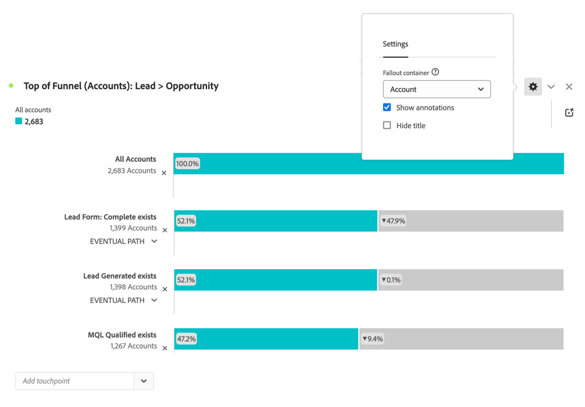
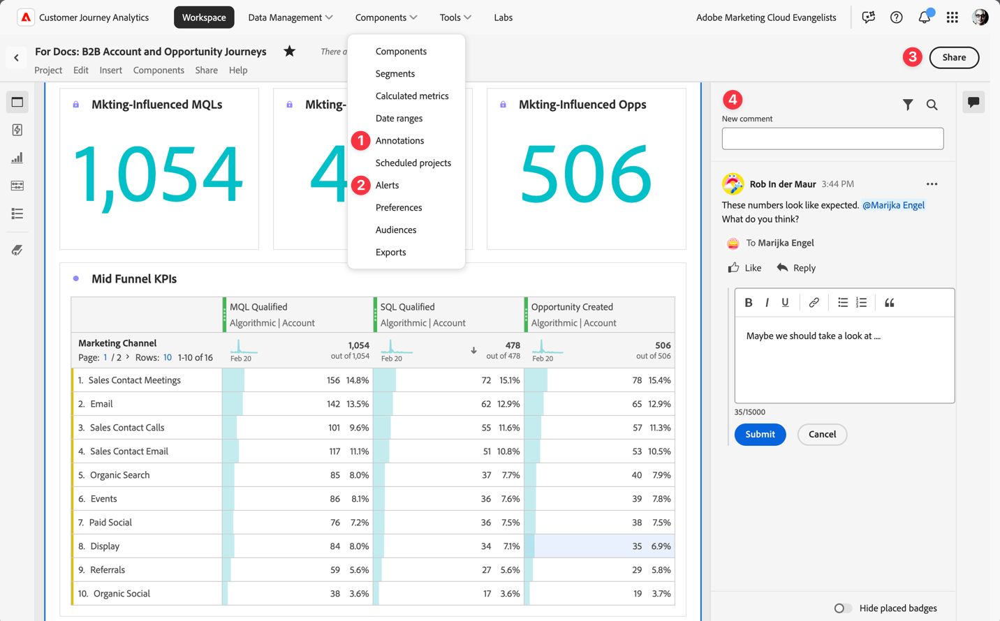

# Développer les comptes clés

La croissance et la conservation des comptes clés est une priorité majeure pour les entreprises B2B. Pour garantir la progression des transactions, vous devez impérativement communiquer au bon moment avec les principales parties prenantes de vos comptes cibles.

Lorsque vous envisagez la manière d’augmenter les comptes clés par le biais de nouvelles motions d’acquisition, de rétention ou de montée en gamme, Customer Journey Analytics B2B edition vous aide (l’équipe commerciale et les analystes commerciaux) à mieux comprendre la progression de l’étape des ventes et la collaboration entre les équipes. Consultez les sections suivantes pour obtenir des exemples.

## Progression de l’étape de vente

Vous souhaitez générer et distribuer des rapports de conversion de leads ad hoc et comprendre comment les comptes progressent via le funnel des ventes.

La visualisation [Abandons](/help/analysis-workspace/visualizations/fallout/fallout-flow.md) vous permet de visualiser les taux de conversion et de déperdition entre des étapes prédéfinies dans un parcours séquentiel.

### Exemple

Vous souhaitez voir les retombées de la partie supérieure du funnel de ventes (du prospect à l’opportunité) pour les comptes.

1. [Création et configuration d’une visualisation Abandons](/help/analysis-workspace/visualizations/fallout/configuring-fallout.md).
1. Sélectionnez  pour sélectionner **[!UICONTROL Compte]** comme **[!UICONTROL Conteneur d’abandons]**.
1. Le premier point de contact doit se lire **[!UICONTROL Tous les comptes]**.
1. Ajoutez un nouveau point de contact : **[!UICONTROL Formulaire de prospect : L’entité complète existe]**.
1. Ajoutez un nouveau point de contact : **[!UICONTROL le lead généré existe]**.
1. Ajoutez un nouveau point de contact : **[!UICONTROL Il existe un certificat qualifié MQL]**.

   

## Collaboration

Vous souhaitez améliorer la communication entre l’équipe des ventes, du marketing et des produits. Les options disponibles pour s’assurer que toutes les parties prenantes disposent d’une histoire de données unifiée sont les alertes, les annotations, les commentaires dans le projet et le partage de rapports et de visualisations.

Vous pouvez utiliser les fonctionnalités Customer Journey Analytics B2B edition suivantes :

Cas d’utilisation 

1. [Annotations](/help/components/annotations/overview.md)
1. [Alertes intelligentes](/help/components/c-intelligent-alerts/intelligent-alerts.md)
1. [Partager avec des utilisateurs de l’espace de travail ou avec tout le monde](/help/analysis-workspace/curate-share/share-projects.md)
1. [Commentaires](/help/analysis-workspace/build-workspace-project/comment-projects.md)
