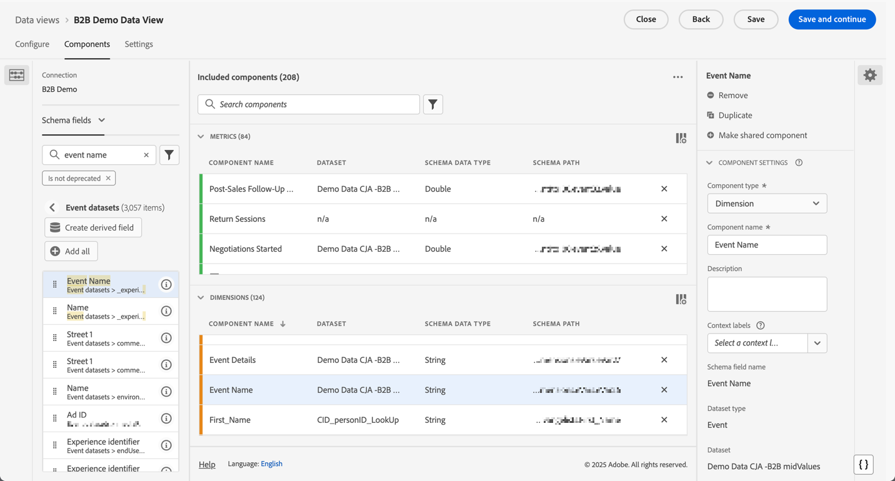

# Configuration pour les cas d’utilisation de B2B edition

{{draft-b2b}}

Cet article décrit une configuration type du B2B edition Customer Journey Analytics pour prendre en charge les cas d’utilisation suivants :

* [Optimisation du marketing de compte](optimize-account-marketing.md)
* [Développer les comptes clés](grow-key-accounts.md)
* [Créer la valeur du produit](build-product-value.md)

>[!NOTE]
>
>Les données de démonstration et les captures d’écran utilisées dans ces cas d’utilisation sont fournies à titre d’illustration uniquement et ne reflètent pas des données du monde réel.

## Référence de conception de solution

Avant de configurer Customer Journey Analytics B2B edition, assurez-vous de disposer d’une référence de conception de solution appropriée qui documente chacun des champs que vous collectez.

Voici un exemple de référence de conception de solution :

+++ Dimensions Événement

| Nom du Dimension |
|---|
| ID de compte |
| Nom de compte |
| ID de groupe d’achat |
| Centre d’appel |
| ID de représentant du centre d’appels |
| ID d’appel |
| Code de suivi de campagne |
| Identifiant de contenu |
| Type de contenu |
| Source de données |
| Type d&#39;appareil |
| Event Details (Détails de l’événement) |
| Nom de l’événement |
| Entonnoir |
| Canal d’interaction |
| ID de lead |
| Canal marketing |
| ID d’événement marketing |
| Type d’événement marketing |
| ID d’opportunité |
| Page |
| Détails de la page |
| Domaine référent |
| ID du représentant commercial |
| Nom de l’étape de vente |
| Numéro de l&#39;étape de vente |
| Section du site |
| SKU |
| ID de compte de filiale |
| ID de l’enquête |
| Score de satisfaction de l’enquête |
| Type d’enquête |
| Identifiant utilisateur |

+++

+++ Mesures d’événement

| Nom de la mesure | Type d’événement |
|---|---|
| Création de compte : terminée | Compteur |
| Création de compte : démarrer | Compteur |
| Coût de l’appel | Devise |
| Durée de l’appel | Compteur |
| Score de satisfaction de l’appel | Numérique |
| Questionnaires d’appel terminés | Compteur |
| Appels | Compteur |
| Fermé-Perdu | Compteur |
| Conclu | Compteur |
| Vues du contenu | Compteur |
| Clics publicitaires sur l’affichage de la devise de la taille de l’affaire | Compteur |
| Afficher les impressions | Compteur |
| E-mail non remis | Compteur |
| E-mail sur lequel l’utilisateur a cliqué | Compteur |
| E-mail diffusé | Compteur |
| E-mail ouvert | Compteur |
| E-mails envoyés | Compteur |
| Assiduité à l’événement | Compteur |
| Enregistrement de l’événement : terminé | Compteur |
| Enregistrement de l’événement : étape 1 | Compteur |
| Enregistrement de l’événement : étape 2 | Compteur |
| Enregistrement de l’événement : étape 3 | Compteur |
| Appel entrant numérique avec score de satisfaction globale | Compteur |
| Formulaire de lead : terminé | Compteur |
| Formulaire de lead : étape 1 | Compteur |
| Formulaire de lead : étape 2 | Compteur |
| Lead généré | Compteur |
| Qualification du lead | Compteur |
| Réunions | Compteur |
| MQL disqualifié | Compteur |
| Qualifié MQL | Compteur |
| Évaluation des besoins | Compteur |
| Négociation | Compteur |
| Gestion des objections | Compteur |
| Opportunités | Compteur |
| Création de l’opportunité | Compteur |
| Commandes | Compteur |
| Appel sortant | Compteur |
| Suivi Après-Vente | Compteur |
| Soumission de la proposition | Compteur |
| Chiffre d’affaires clôturé-perdu | Devise |
| Chiffre d’affaires conclu - Confirmé | Devise |
| Appels de contacts commerciaux | Compteur |
| Étape de vente démarrée | Compteur |
| Clics publicitaires SMS | Compteur |
| SMS envoyé | Compteur |
| Clics sur les réseaux sociaux | Compteur |
| Impressions sociales | Compteur |
| Présentation de la solution | Compteur |
| SQL disqualifié | Compteur |
| Qualifié SQL | Compteur |
| Unités (ne pas exposer) | Compteur |
| Score de satisfaction du sondage VoC | Numérique |
| Enquêtes VoC terminées | Compteur |

+++

+++ Enregistrements de personne

| Nom du champ de la vue de données | Type de champ |
|---|---|
| Âge | Mesure |
| Tranche d&#39;âge | Dimension |
| Niveau d&#39;affinité Catégorie 1 | Dimension |
| Score d’affinité de catégorie 1 | Mesure |
| Niveau d&#39;affinité Catégorie 2 | Dimension |
| Score d’affinité de catégorie 2 | Mesure |
| Niveau d&#39;affinité de catégorie 3 | Dimension |
| Score d’affinité de catégorie 3 | Mesure |
| Niveau d&#39;affinité Catégorie 4 | Dimension |
| Score d’affinité de catégorie 4 | Mesure |
| Niveau d&#39;affinité Catégorie 5 | Dimension |
| Score d’affinité de catégorie 5 | Mesure |
| Advertising de consentement | Dimension |
| Consentement de toutes les communications | Dimension |
| Consentement Direct Mail | Dimension |
| E-mail de consentement | Dimension |
| Consentement Téléphone portable | Dimension |
| Personalization de consentement | Dimension |
| Données de partage de consentement | Dimension |
| SMS de consentement | Dimension |
| Adresse électronique | Dimension |
| Prénom | Dimension |
| Genre | Dimension |
| Ville Individuelle | Dimension |
| Niveau CLTV individuel | Dimension |
| Score CLTV individuel | Mesure |
| Pays Individuel | Dimension |
| Téléphone individuel | Dimension |
| Code Postal Individuel | Dimension |
| Niveau de propension individuelle à l’achat | Dimension |
| Propension individuelle à acheter un score | Mesure |
| Propension individuelle au niveau de résiliation | Dimension |
| Propension individuelle à l’attrition | Mesure |
| Propension individuelle à mettre à niveau le niveau | Dimension |
| Propension individuelle à améliorer le score | Mesure |
| Etat Individuel | Dimension |
| Adresse Postale Individuelle | Dimension |
| Intitulé du traitement | Dimension |
| Nom | Dimension |
| Score Net Du Promoteur | Mesure |
| Statut de promoteur net | Dimension |
| Type de rôle | Dimension |

+++

+++ Enregistrements de compte

| Nom du champ de la vue de données | Type de champ |
|---|---|
| Chiffre d’affaires annuel | Mesure |
| Ville de l’entreprise | Dimension |
| Niveau CLTV de l&#39;entreprise | Dimension |
| Score CLTV de l&#39;entreprise | Mesure |
| Pays de la société | Dimension |
| Nom de la société | Dimension |
| Téléphone de l’entreprise | Dimension |
| Code postal de l’entreprise | Dimension |
| Niveau de propension à l’achat de l’entreprise | Dimension |
| Propension de l’entreprise à acheter son score | Mesure |
| Propension de l’entreprise au niveau de résiliation | Dimension |
| Propension de l’entreprise à résilier le score | Mesure |
| Propension de l’entreprise à mettre à niveau le niveau | Dimension |
| Propension de l’entreprise à améliorer le score | Mesure |
| Taille de l’entreprise | Dimension |
| État de la société | Dimension |
| Adresse de la société | Dimension |
| Secteur industriel | Dimension |
| Nombre d’employés | Mesure |
| Public partenaire - Acheteurs de matériel | Dimension |
| Public de partenaires - Croissance rapide | Dimension |
| Audience du partenaire - Services requis | Dimension |
| Audience du partenaire - Acheteurs de logiciels | Dimension |
| Plage du chiffre d’affaires | Dimension |
| Site web | Dimension |

+++

+++ Enregistrements SKU

| Nom du champ de la vue de données | Type de champ |
|---|---|
| Catégorie de produits matériels | Dimension |
| Nom du produit matériel | Dimension |
| Catégorie de service | Dimension |
| Nom du service | Dimension |
| Catégorie de produits logiciels | Dimension |
| Nom du produit logiciel | Dimension |

+++

## Schémas et jeux de données

Les données qui prennent en charge la référence de conception de solution sont structurées à l’aide des schémas et des jeux de données suivants.

### Données d’événement

Les dimensions et mesures d’événement sont prises en charge par le biais d’un schéma basé sur une série temporelle (événement) et d’un ou plusieurs jeux de données contenant des données d’événement.

<!--For example: the Account ID field is mapped to **[!UICONTROL Account ID]**. See below for a preview of the data typically available in such a dataset.

-->

### Données de personne

Les enregistrements de personne sont pris en charge par le biais d’un schéma basé sur les enregistrements (profil) et d’un ou plusieurs jeux de données contenant des données de personne. Consultez ci-dessous un exemple de données de personne (basé sur l’exemple de référence de conception de solution) généralement disponibles dans un tel jeu de données.

### Données de compte

Les enregistrements de compte sont pris en charge par le biais d’un schéma basé sur les enregistrements (recherche) et d’un ou plusieurs jeux de données contenant des données de compte. Consultez ci-dessous un exemple de données de compte (basé sur l’exemple de référence de conception de solution) généralement disponibles dans un tel jeu de données.

### Données de SKU

Les enregistrements de SKU sont pris en charge par le biais d’un schéma basé sur les enregistrements (recherche) et d’un ou plusieurs jeux de données contenant des données de SKU. Consultez ci-dessous un exemple de données de SKU (basé sur l’exemple de référence de conception de solution) généralement disponibles dans un tel jeu de données.

## Connexion

Définissez une connexion basée sur un compte dans Customer Journey Analytics pour ingérer et joindre des enregistrements des jeux de données d’événement, de compte, de personne et de SKU.

1. [Créez une connexion](/help/connections/create-connection.md) dans Customer Journey Analytics.
1. Saisissez un nom et une description descriptifs pour la connexion.
1. Sélectionnez  **[!UICONTROL Compte]** comme **[!UICONTROL ID de Principal]**.
1. Sélectionnez tous les **[!UICONTROL conteneurs facultatifs]**.
1. Sélectionnez la sandbox de votre choix et estimez le nombre moyen d’événements quotidiens.

   

1. Sélectionnez **[!UICONTROL Ajouter des jeux de données]** et ajoutez les jeux de données B2B qui contiennent les données pour les événements, les comptes, les personnes et les SKU.

   Connexion 

1. Sélectionnez **[!UICONTROL Suivant]** pour configurer les paramètres de chacun des jeux de données sélectionnés.
1. Pour le jeu de données d’événement, veillez à sélectionner les eVars appropriées qui correspondent aux identités pour **[!UICONTROL ID de compte]**, **[!UICONTROL ID de compte global]**, **[!UICONTROL ID d’opportunité]**, **[!UICONTROL ID de groupe d’achats]** et **[!UICONTROL ID de personne]**.

   Connexion .

1. Faites défiler la page vers le bas pour configurer le jeu de données d’enregistrements de compte. Veillez à sélectionner l’identifiant correct (**[!UICONTROL ID_Compte]**) pour correspondre au compte par le conteneur **[!UICONTROL Compte global]**. Sélectionnez l’identifiant correct (**[!UICONTROL Account_ID]**) comme **[!UICONTROL champ Compte global]**.

   Connexion 

1. Faites défiler la page vers le bas pour configurer le jeu de données d’enregistrements de personne. Veillez à sélectionner la clé appropriée (**[!UICONTROL Person_ID]**) pour correspondre à la personne par le conteneur **[!UICONTROL Person]**. Sélectionnez l’identité appropriée (**[!UICONTROL Profile_Account_ID_Individual]**) pour correspondre au champ **[!UICONTROL Compte global]**.

   Connexion 

1. Faites défiler la page vers le bas pour configurer le jeu de données d’enregistrements de SKU. Veillez à sélectionner la clé appropriée (**[!UICONTROL Sku]**). Sélectionnez **[!UICONTROL Correspondance par champ]** car aucun conteneur n’est configuré ou disponible pour ces données. Sélectionnez le champ SKU dans le jeu de données d’événement (**[!UICONTROL SKU (jeux de données d’événement)]**) comme clé correspondante.

   Connexion 

1. Sélectionnez **[!UICONTROL Ajouter des jeux de données]** pour enregistrer les jeux de données et leurs paramètres configurés.

1. Sélectionnez **[!UICONTROL Enregistrer]** pour enregistrer la connexion.

## Vue de données

Une fois les données ingérées dans Customer Journey Analytics, vous souhaitez créer une vue de données qui inclut tous les composants que vous avez définis dans la référence de conception de solution.

### Configurer

1. [Créer une vue de données](/help/data-views/data-views.md) dans Customer Journey Analytics.
1. Sélectionnez la connexion que vous avez créée précédemment (par exemple : **[!UICONTROL Connexion de démonstration B2B (ExL)]**).
1. Attribuez un nom à la vue de données. Par exemple : `B2B Demo Data view (ExL)` et éventuellement une description.
1. Vous pouvez éventuellement renommer les conteneurs. Ou conservez les noms de conteneur par défaut.

   
1. Sélectionnez **[!UICONTROL Enregistrer et continuer]**.

### Composants

Par défaut, tous les [composants standard](/help/data-views/component-reference.md) sont déjà inclus dans votre vue de données. Ces composants standard incluent les mesures spécifiques B2B pour les comptes, les groupes d’achats, les comptes globaux et les opportunités.

1. Ajoutez toutes les dimensions d’événement que vous avez définies dans la [référence de conception de solution](#solution-design-reference) aux composants de dimension dans votre vue de données. Par exemple, le champ **[!UICONTROL Nom de l’événement]**, qui représente la dimension **[!UICONTROL Nom de l’événement]**. Veillez à configurer le composant de dimension via les [ Paramètres des composants ](/help/data-views/component-settings/overview.md).

   

1. Ajoutez toutes les mesures d’événement que vous avez définies dans la [référence de conception de solution](#solution-design-reference) aux composants de mesures de votre vue de données. Par exemple, le champ **[!UICONTROL qualifié SQL]**, qui représente la mesure **[!UICONTROL qualifié SQL]**. Veillez à configurer le composant de dimension via les [ Paramètres des composants ](/help/data-views/component-settings/overview.md).

   

1. Ajoutez toutes les dimensions de compte que vous avez définies dans la [référence de conception de solution](#solution-design-reference) aux composants de dimension dans votre vue de données. Par exemple, le champ **[!UICONTROL Industrie]**, qui représente la dimension **[!UICONTROL Industrie]**. Veillez à configurer le composant de dimension via les [ Paramètres des composants ](/help/data-views/component-settings/overview.md).

   

1. Ajoutez toutes les mesures de compte que vous avez définies dans la [référence de conception de solution](#solution-design-reference) aux composants de mesures dans votre vue de données. Par exemple, le champ **[!UICONTROL Number_of_Employees]**, qui représente la mesure **[!UICONTROL Number_of_Employees]**. Veillez à configurer le composant de dimension via les [ Paramètres des composants ](/help/data-views/component-settings/overview.md).

   

1. Ajoutez toutes les dimensions de personne que vous avez définies dans la [référence de conception de solution](#solution-design-reference) aux composants de dimension dans votre vue de données. Par exemple, le champ **[!UICONTROL Category_1_Affinity_Level]**, qui représente la dimension **[!UICONTROL Category_1_Affinity_Level]**. Veillez à configurer le composant de dimension via les [ Paramètres des composants ](/help/data-views/component-settings/overview.md).

   

1. Ajoutez toutes les mesures de personne que vous avez définies dans la [référence de conception de solution](#solution-design-reference) aux composants de mesure dans votre vue de données. Par exemple, le champ **[!UICONTROL Category_1_Affinity_Score]**, qui représente la mesure **[!UICONTROL Category_1_Affinity_Score]**. Veillez à configurer le composant de dimension via les [ Paramètres des composants ](/help/data-views/component-settings/overview.md).

   

1. Ajoutez toutes les dimensions SKU que vous avez définies dans le [référence de conception de solution](#solution-design-reference) aux composants de dimension dans votre vue de données. Par exemple, le champ **[!UICONTROL Catégorie de services]**, qui représente la dimension **[!UICONTROL Catégorie de services]**. Veillez à configurer le composant de dimension via les [ Paramètres des composants ](/help/data-views/component-settings/overview.md).

   

1. Sélectionnez **[!UICONTROL Enregistrer et continuer]**.

### Paramètres

1. Vous pouvez éventuellement définir des [paramètres](/help/data-views/create-dataview.md#settings-1) spécifiques pour la vue de données :

   * Ajoutez des segments à la vue de données.
   * Utilisez une mesure (calculée) pour définir les paramètres de session.

1. Sélectionnez **[!UICONTROL Enregistrer et continuer]**.

## Segments

Vous pouvez préparer un ou plusieurs segments basés sur des conteneurs spécifiques au B2B que vous pouvez utiliser dans votre projet Workspace.

Par exemple :

* Comptes avec segment d’enregistrement d’événement.

  

* Comptes américains avec groupes d’achat et segment d’opportunités de l’étape 5.

  Cas d’utilisation 

## Autre

Vous pouvez éventuellement définir d’autres composants pour vos cas d’utilisation, tels que [ mesures calculées](/help/components/calc-metrics/calc-metr-overview.md), [ périodes](/help/components/date-ranges/overview.md) ou [ alertes](/help/components/c-intelligent-alerts/intelligent-alerts.md).
