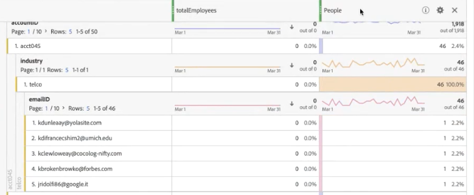

# (B2B) Ajout de données au niveau du compte en tant que jeu de données de recherche

Ce cas d’utilisation B2B vous montre comment spécifier vos données à analyser au niveau du compte plutôt qu’au niveau de la personne. L’analyse au niveau du compte peut répondre à des questions telles que :

* Quel nom de société est associé à ce compte ?
* Combien d’employés sont associés à ce compte/cette société ?
* Quels rôles sont représentés dans ce compte ?
* Par rapport à un autre compte, comment ce compte fonctionne-t-il dans son ensemble vis-à-vis d’une campagne marketing spécifique ?
* Certains rôles (tels que celui de responsable informatique) se comportent-ils différemment d’un compte à l’autre ?

Pour ce faire, vous devez intégrer les informations au niveau du compte sous la forme d’un jeu de données de [recherche](/help/getting-started/cja-glossary.md).

Tout d’abord, vous devez créer un schéma de recherche dans Adobe Experience Platform, puis un jeu de données de table de recherche en ingérant des données de niveau compte au format .csv. Vous créez ensuite une connexion dans Customer Journey Analytics (CJA) qui combine différents jeux de données, y compris celui de recherche que vous avez créé. Puis, vous créez une vue de données. Vous pouvez maintenant utiliser toutes ces données dans Espace de travail.

>[!NOTE]
>
>La taille maximale des tables de recherche est de 1 Go.

## 1. Créer un schéma de recherche (Experience Platform)

La création de votre propre schéma pour la table de [recherche](/help/getting-started/cja-glossary.md) garantit que le jeu de données utilisé sera disponible dans CJA avec la bonne configuration (type d’enregistrement). La bonne pratique consiste à [création d’une classe de schéma personnalisée](https://experienceleague.adobe.com/docs/experience-platform/xdm/tutorials/create-schema-ui.html?lang=fr#create-new-class) appelé &quot;Recherche&quot;, vide de tout élément, qui peut être réutilisé pour toutes les tables de recherche.

## 2. Créer un jeu de données de recherche (Experience Platform)

Une fois le schéma créé, vous devez créer dans Experience Platform un jeu de données de recherche à partir de ce schéma. Ce jeu de données de recherche contient des informations marketing au niveau du compte, telles que : le nom de la société, le nombre total d’employés, le nom de domaine, le secteur d’activité, le chiffre d’affaires annuel, s’ils sont ou non des clients actuels d’Experience Platform, l’étape de vente à laquelle ils se trouvent, l’équipe au sein du compte qui utilise CJA, etc.

>[!IMPORTANT]
>
>CJA ne prend pas en charge les nombres entiers dans les jeux de données de recherche. Si vous ajoutez des champs entiers dans votre schéma XDM pour votre jeu de données de recherche, vous ne pourrez pas utiliser ces nombres entiers comme mesures ou mesures calculées. Par exemple, si les valeurs annualRevenue ou totalEmployees sont définies comme nombres entiers, elles indiqueront &quot;0&quot; dans les rapports CJA. Cependant, si vous les attribuez en tant que chaînes, vous pouvez les utiliser comme informations de recherche.

Par exemple, les valeurs AnnualRevenue ou totalEmployees sont définies comme nombres entiers dans l’exemple suivant - c’est la raison pour laquelle &quot;0&quot; est indiqué dans CJA.

1. Dans Adobe Experience Platform, accédez à **[!UICONTROL Gestion des données > Jeux de données]**.
1. Cliquez sur **[!UICONTROL + Créer un jeu de données]**.
1. Cliquez sur **[!UICONTROL Créer un jeu de données à partir d’un schéma]**.
1. Sélectionnez la classe de schéma de recherche que vous avez créée.
1. Cliquez sur **[!UICONTROL Suivant]**.
1. Nommez le jeu de données (dans notre exemple, B2B Info) et décrivez-le.
1. Cliquez sur **[!UICONTROL Terminer]**.

## 3. Ingérer les données dans Experience Platform

Les instructions sur la manière de [Mapper un fichier CSV à un schéma XDM](https://experienceleague.adobe.com/docs/experience-platform/ingestion/tutorials/map-a-csv-file.html?lang=fr) devraient être utile si vous utilisez un fichier CSV.

[D’autres méthodes](https://experienceleague.adobe.com/docs/experience-platform/ingestion/home.html?lang=fr) sont également disponibles.

L’intégration des données et la création de la table de recherche prennent environ 2 à 4 heures, en fonction de la taille de la table de recherche.

## 4. Combiner des jeux de données dans une connexion (Customer Journey Analytics)

Dans cet exemple, nous combinons trois jeux de données en une connexion CJA :

| Nom du jeu de données | Description | Classe de schéma AEP | Informations sur le jeu de données |
| --- | --- | --- | --- |
| Impression B2B | Contient, au niveau du compte, des données au niveau de l’événement et du parcours de navigation. Par exemple, il contient l’identifiant de l’adresse email et l’identifiant de compte correspondant, ainsi que le nom marketing, pour la diffusion de publicités marketing. Il comprend également les impressions par utilisateur pour ces publicités. | Basé sur la classe de schéma ExperienceEvent de XDM | L’`emailID` est utilisé comme identité principale et se voit attribuer un espace de noms `Customer ID`. Par conséquent, il apparaîtra comme **[!UICONTROL identifiant de personne]** dans Customer Journey Analytics.  |
| Profil B2B | Ce jeu de données de profil vous en apprend davantage sur les utilisateurs d’un compte, comme leur fonction, le compte auquel ils sont associés, leur profil LinkedIn, etc. | Basé sur la classe de schéma Individual Profile d’XDM | Il n’est pas nécessaire de sélectionner `emailID` comme identifiant principal dans ce schéma. Veillez à activer **[!UICONTROL Profil]**. Dans le cas contraire, CJA ne sera pas en mesure de connecter l’`emailID` du profil B2B avec l’`emailID` des données d’impression B2B.  |
| Informations B2B | Consultez « Créer un jeu de données de recherche » ci-dessus. | Compte B2B (classe de schéma de recherche personnalisée) | La relation entre l’`accountID` et le jeu de données d’impressions B2B a été automatiquement créée en connectant le jeu de données d’informations B2B au jeu de données d’impressions B2B dans CJA, comme décrit dans les étapes ci-dessous.  |

Voici comment combiner les jeux de données :

1. Dans Customer Journey Analytics, sélectionnez l’onglet **[!UICONTROL Connexions]**.
1. Sélectionnez les jeux de données que vous souhaitez combiner (dans notre exemple, les trois ci-dessus).
1. Pour le jeu de données Info B2B, sélectionnez la clé `accountID` qui sera utilisée dans votre table de recherche. Sélectionnez ensuite la clé correspondante (dimension correspondante) ainsi que l’`accountID` dans votre jeu de données d’événement.
1. Cliquez sur **[!UICONTROL Suivant]**.
1. Nommez et décrivez la connexion, puis configurez-la en suivant de [ces instructions](/help/connections/create-connection.md).
1. Cliquez sur **[!UICONTROL Enregistrer]**.

## 5. Créer une vue de données à partir de cette connexion

Suivez les instructions de la section [création de vues de données](/help/data-views/create-dataview.md).

* Ajoutez tous les composants des jeux de données (dimensions et mesures) dont vous avez besoin.

## 6. Analyser les données dans Espace de travail

Vous pouvez désormais créer des projets Espace de travail à partir des données des trois jeux de données.

Vous pouvez par exemple trouver des réponses aux questions posées dans l’introduction :

* Ventilez l’identifiant d’email par l’identifiant de compte pour découvrir à quelle société appartient un identifiant d’email donné.
* Combien d’employés sont associés à un identifiant de compte donné ?
* À quel secteur d’activité est associé un identifiant de compte donné ?

