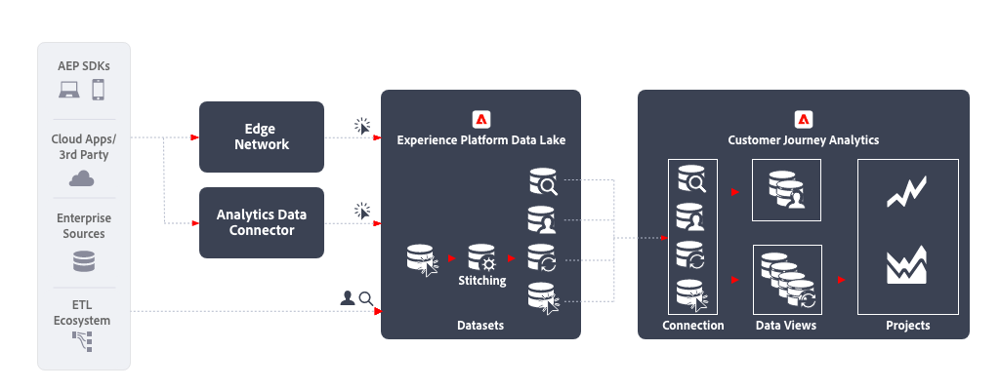

# Analyse cross-canal

L’analyse cross-canal permet une vue consolidée unique du comportement des clients sur différents canaux en unifiant les données de différentes propriétés web, mobiles et hors ligne. Vous pouvez, par exemple, vous servir de cette vue consolidée pour analyser les interactions clients réalisées sur les ordinateurs de bureau et les appareils mobiles. Cela vous permettra de mieux comprendre le comportement des clients et dʼextraire des informations afin dʼoptimiser les expériences numériques des clients. Vous pouvez également analyser les interactions clients sur lʼensemble des canaux, y compris numériques et hors ligne, comme les interactions avec le service dʼassistance et les achats en magasin, afin de mieux comprendre et optimiser le parcours client.

## Procédure de mise en œuvre

1. [Créez des schémas](https://experienceleague.adobe.com/docs/experience-platform/xdm/tutorials/create-schema-ui.html?lang=fr) pour les données à ingérer.
1. [Créez des jeux de données](https://experienceleague.adobe.com/docs/platform-learn/tutorials/data-ingestion/create-datasets-and-ingest-data.html?lang=fr) pour les données à ingérer.
1. [Ingestion de données dans Experience Platform](https://experienceleague.adobe.com/docs/platform-learn/tutorials/data-ingestion/understanding-data-ingestion.html?lang=fr):
   1. Données basées sur un événement  du site web ou de l’application mobile par le biais du connecteur source Edge Network ou Analytics.
   2. Données de profil  (par exemple, à partir d’un système CRM, d’une application de centre d’appel, d’une application de fidélité).
   3. Données de recherche  (par exemple, nom du produit, catégorie d’un système d’informations sur les produits).

1. Utilisez un identifiant d’espace de noms commun à tous les jeux de données. Utilisation [Assemblage](../../stitching/overview.md) pour élever un jeu de données basé sur un événement  en ce qui concerne la fourniture de l’identifiant commun à chaque ligne. Notez que Customer Journey Analytics nʼutilise actuellement pas les services Experience Platform Profile ou Identity pour lʼassemblage.
1. Effectuez toute préparation de données personnalisée nécessaire afin de garantir une clé commune à tous les jeux de données de la série temporelle à ingérer dans Customer Journey Analytics.
1. Assignez un identifiant principal aux données de recherche qui peut être relié à un champ dans les données dʼévénement. Compte comme des lignes dans les licences.
1. Définissez le même identifiant principal pour les données de profil que l’identifiant principal des données d’événement.
1. [Création d’une connexion](../../connections/overview.md) pour ingérer les jeux de données appropriés de l’Experience Platform vers Customer Journey Analytics.
1. [Créez une vue de données](/help/data-views/create-dataview.md) sur la connexion pour sélectionner les dimensions et mesures spécifiques à inclure dans la vue. Les paramètres d’attribution sont également configurés dans la vue de données. Ces paramètres sont calculés au moment du rapport.
1. [Créez un projet pour configurer des tableaux de bord et des rapports dans Analysis Workspace.](/help/analysis-workspace/home.md)

## Considérations

Lors de la création de ce processus, veillez à tenir compte des points suivants.

* L’analyse des données sur l’ensemble des canaux nécessite le même espace de noms d’identifiant pour chaque enregistrement.
* Le processus d’union de jeux de données disparates nécessite une clé personne/entité principale commune dans les jeux de données.
* Les unions basées sur des clés secondaires ne sont actuellement pas prises en charge.
* Le processus d’assemblage permet de recomposer les identités dans les lignes à partir des informations d’ID transitoire (un ID d’authentification, par exemple) provenant d’enregistrements partageant le même ID persistant. Cela permet de résoudre des enregistrements disparates sur un identifiant assemblé unique pour l’analyse au niveau de la personne, plutôt qu’au niveau de l’appareil ou du cookie.
* Les objets et les attributs du même champ XDM fusionnent en une dimension dans Customer Journey Analytics. Pour fusionner plusieurs attributs de différents jeux de données dans la même dimension de Customer Journey Analytics, les jeux de données doivent référencer le même champ ou schéma XDM.

