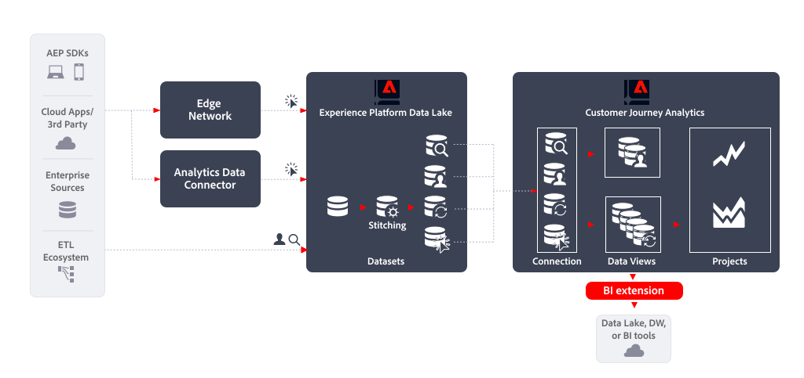

# Extension BI

Cet article décrit comment le [!DNL Customer Journey Analytics BI extension] peut être utilisé pour implémenter le cas d’utilisation d’exportation de données [&#x200B; suivant &#x200B;](overview.md) :

- Lac de données, Data Warehouse ou outils de BI

## Introduction

L’exportation de données à l’aide de l’[!DNL Customer Journey Analytics BI extension] vous permet d’exporter des données de vos vues de données Customer Journey Analytics.

Extension 

## Informations supplémentaires

Le [!DNL Customer Journey Analytics BI extension] permet à SQL d’accéder aux [vues de données](/help/data-views/data-views.md) que vous avez définies dans Customer Journey Analytics. Il se peut que les personnes chargées de votre ingénierie et de votre analyse des données maîtrisent bien Power BI, Tableau ou d’autres outils de Business Intelligence et de visualisation (appelés outils de BI). Elles peuvent désormais créer des rapports et des tableaux de bord en fonction des vues de données des utilisateurs et utilisatrices de Customer Journey Analytics lors de la création de leurs projets Analysis Workspace.

Pour plus d’informations, consultez la documentation détaillée sur l’extension [BI](../../data-views/bi-extension.md).
