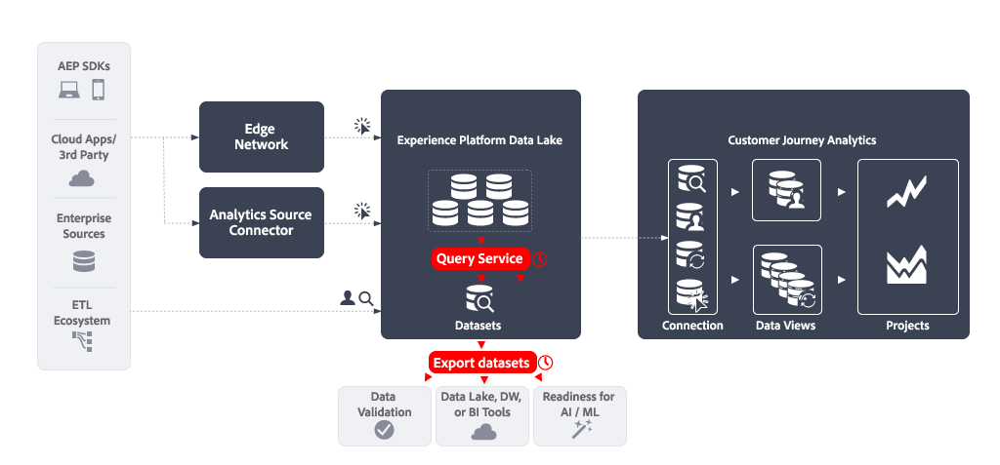

# Query Service (Distiller de données) et exporter des jeux de données

Cet article décrit comment la combinaison d’Experience Platform Query Service (Data Distiller) et de l’exportation de jeux de données peut être utilisée pour implémenter les [cas d’utilisation de l’exportation de données](overview.md) suivants :

- Validation des données
- Lac de données, Data Warehouse pour les outils de BI
- Préparation à l’intelligence artificielle et au machine learning.


Adobe Analytics peut mettre en œuvre ces cas pratiques à l’aide de sa fonctionnalité [Flux de données](https://experienceleague.adobe.com/fr/docs/analytics/export/analytics-data-feed/data-feed-overview). Les flux de données sont un moyen efficace d’exporter des données brutes d’Adobe Analytics. Cet article décrit comment exporter un type similaire de données brutes à partir d’Experience Platform, afin que vous puissiez mettre en œuvre les cas d’utilisation mentionnés ci-dessus. Le cas échéant, les fonctionnalités décrites dans cet article sont comparées aux flux de données d’Adobe Analytics afin de clarifier les différences de données et de processus.

## Introduction

L’exportation de données à l’aide de Query Service (Data Distiller) et de l’exportation de jeux de données comprend :

- la définition d’une **requête planifiée** qui génère les données de votre flux de données en tant que jeu de données de sortie , à l’aide de **Query Service**.
- en définissant une **exportation planifiée de jeu de données** qui exporte le jeu de données de sortie vers une destination d’espace de stockage, à l’aide de **exportation de jeu de données**.




## Conditions préalables

Assurez-vous de répondre à toutes les exigences suivantes avant d’utiliser la fonctionnalité décrite dans ce cas d’utilisation :

- Une implémentation fonctionnelle qui collecte des données dans le lac de données d’Experience Platform.
- Accès au module complémentaire Distiller de données pour vous assurer que vous êtes autorisé à exécuter des requêtes par lots. Les limites des lignes de requête et les délais d’exécution dépendent de vos droits. Voir [Package Query Service](https://experienceleague.adobe.com/fr/docs/experience-platform/query/packaging) pour plus d’informations.
- Accès à la fonctionnalité Exporter les jeux de données , disponible lorsque vous avez acheté le package Real-Time CDP Prime ou Ultimate, Adobe Journey Optimizer ou Customer Journey Analytics. Pour en savoir plus, voir [Exporter des jeux de données vers des destinations d’espace de stockage](https://experienceleague.adobe.com/fr/docs/experience-platform/destinations/ui/activate/export-datasets).
- Une ou plusieurs destinations configurées (par exemple : Amazon S3, Google Cloud Storage) vers lesquelles vous pouvez exporter les données brutes de votre flux de données.


## Service de requête

Experience Platform Query Service vous permet d’interroger et de joindre n’importe quel jeu de données du lac de données d’Experience Platform comme s’il s’agissait d’une table de base de données. Vous pouvez ensuite capturer les résultats sous la forme d’un nouveau jeu de données à utiliser dans les rapports ou à exporter.

Vous pouvez utiliser Query Service [interface utilisateur](https://experienceleague.adobe.com/fr/docs/experience-platform/query/ui/overview), un [client connecté par le biais du protocole PostgresQL](https://experienceleague.adobe.com/fr/docs/experience-platform/query/clients/overview) ou [API RESTful](https://experienceleague.adobe.com/fr/docs/experience-platform/query/api/getting-started) pour créer et planifier des requêtes qui collectent les données de votre flux de données.

### Créer la requête

Vous pouvez utiliser toutes les fonctionnalités du langage SQL ANSI standard pour les instructions SELECT et d’autres commandes limitées afin de créer et d’exécuter des requêtes qui génèrent les données de votre flux de données. Voir [Syntaxe SQL](https://experienceleague.adobe.com/fr/docs/experience-platform/query/sql/syntax) pour plus d’informations. Au-delà de cette syntaxe SQL, Adobe prend en charge :

- des [fonctions prédéfinies par Adobe (ADF)](https://experienceleague.adobe.com/fr/docs/experience-platform/query/sql/adobe-defined-functions) qui aident à effectuer des tâches courantes liées à l’entreprise sur les données d’événement stockées dans le lac de données Experience Platform, y compris des fonctions de [sessionnalisation](https://experienceleague.adobe.com/fr/docs/analytics/components/virtual-report-suites/vrs-mobile-visit-processing) et [attribution](https://experienceleague.adobe.com/fr/docs/analytics/analyze/analysis-workspace/attribution/overview),
- plusieurs fonctions intégrées [Spark SQL](https://experienceleague.adobe.com/fr/docs/experience-platform/query/sql/spark-sql-functions),
- [commandes PostgreSQL de métadonnées](https://experienceleague.adobe.com/fr/docs/experience-platform/query/sql/metadata),
- [instructions préparées](https://experienceleague.adobe.com/fr/docs/experience-platform/query/sql/prepared-statements).

#### Colonnes de flux de données

Les champs XDM disponibles dans votre requête dépendent du schéma du jeu de données. Assurez-vous de comprendre le schéma sous-jacent au jeu de données. Pour plus d’informations[&#128279;](https://experienceleague.adobe.com/fr/docs/experience-platform/catalog/datasets/user-guide) consultez le  Guide de l’interface utilisateur des jeux de données .

Pour vous aider à définir le mappage entre les colonnes des flux de données et les champs XDM, voir [Mappage des champs Analytics](https://experienceleague.adobe.com/fr/docs/experience-platform/sources/connectors/adobe-applications/mapping/analytics). Consultez également la [&#x200B; Présentation de l’interface utilisateur des schémas &#x200B;](https://experienceleague.adobe.com/fr/docs/experience-platform/xdm/ui/overview#defining-xdm-fields) pour plus d’informations sur la gestion des ressources XDM.

Par exemple, si vous souhaitez utiliser *nom de page* dans le cadre de votre flux de données :

- Dans l’interface utilisateur des flux de données d’Adobe Analytics, sélectionnez **[!UICONTROL pagename]** comme colonne à ajouter à votre définition de flux de données.
- Dans Query Service, vous incluez dans votre requête des `web.webPageDetails.name` provenant du jeu de données `sample_event_dataset_for_website_global_v1_1` (basé sur le **Schéma d’événement type pour le site web (global v1.1)** schéma d’événement d’expérience). Pour plus d’informations, consultez le [groupe de champs de schéma Détails web](https://experienceleague.adobe.com/fr/docs/experience-platform/xdm/field-groups/event/web-details) .


#### Identités

Dans Experience Platform, différentes identités sont disponibles. Lors de la création de vos requêtes, assurez-vous d’interroger les identités correctement.


Souvent, vous trouvez des identités dans un groupe de champs distinct. Dans une implémentation d’, ECID (`ecid`) peut être défini comme faisant partie d’un groupe de champs avec un objet `core`, qui fait lui-même partie d’un objet `identification` (par exemple : `_sampleorg.identification.core.ecid`). Les ECID sont organisés différemment dans vos schémas.

Vous pouvez également utiliser `identityMap` pour rechercher des identités. Le `identityMap` est de type `Map` et utilise une [structure de données imbriquée](#nested-data-structure).

Voir [Définir des champs d’identité dans l’interface utilisateur](https://experienceleague.adobe.com/fr/docs/experience-platform/xdm/ui/fields/identity) pour plus d’informations sur la définition de champs d’identité dans Experience Platform.

Reportez-vous à [identifiants de Principal dans les données Analytics](https://experienceleague.adobe.com/fr/docs/experience-platform/sources/connectors/adobe-applications/analytics#primary-identifiers-in-analytics-data) pour comprendre comment les identités Adobe Analytics sont mappées aux identités Experience Platform lors de l&#39;utilisation du connecteur source Analytics. Ce mappage sert de guide pour configurer vos identités, même lorsque vous n’utilisez pas le connecteur source Analytics.


#### Données et identification au niveau des accès

Selon l’implémentation de , les données au niveau de l’accès généralement collectées dans Adobe Analytics sont désormais stockées en tant que données d’événement horodatées dans Experience Platform. Le tableau suivant est extrait du [mappage des champs Analytics](https://experienceleague.adobe.com/fr/docs/experience-platform/sources/connectors/adobe-applications/mapping/analytics#generated-mapping-fields) et montre des exemples de mappage de colonnes de flux de données Adobe Analytics spécifiques au niveau d’accès avec les champs XDM correspondants dans vos requêtes. Le tableau présente également des exemples d’identification des accès, des visites et des visiteurs à l’aide de champs XDM.

| Colonne de flux de données | Champ XDM | Type | Description |
|---|---|---|---|
| `hitid_high` + `hitid_low` | `_id` | string | Identifiant unique permettant d’identifier un hit. |
| `hitid_low` | `_id` | string | Utilisé avec `hitid_high` pour identifier un accès de manière unique. |
| `hitid_high` | `_id` | string | Utilisé avec `hitid_high` pour identifier un accès de manière unique. |
| `hit_time_gmt` | `receivedTimestamp` | string | Date et heure de l’accès, basées sur l’heure UNIX®. |
| `cust_hit_time_gmt` | `timestamp` | string | Cet horodatage n’est utilisé que dans les jeux de données activés pour l’horodatage. Cet horodatage est envoyé avec l’accès, en fonction de l’heure UNIX®. |
| `visid_high` + `visid_low` | `identityMap` | objet | Identifiant unique d’une visite. |
| `visid_high` + `visid_low` | `endUserIDs._experience.aaid.id` | string | Identifiant unique d’une visite. |
| `visid_high` | `endUserIDs._experience.aaid.primary` | booléen | Utilisé avec `visid_low` pour identifier une visite de manière unique. |
| `visid_high` | `endUserIDs._experience.aaid.namespace.code` | string | Utilisé avec `visid_low` pour identifier une visite de manière unique. |
| `visid_low` | `identityMap` | objet | Utilisé avec `visid_high` pour identifier une visite de manière unique. |
| `cust_visid` | `identityMap` | objet | Identifiant visiteur du client. |
| `cust_visid` | `endUserIDs._experience.aacustomid.id` | objet | Identifiant visiteur du client. |
| `cust_visid` | `endUserIDs._experience.aacustomid.primary` | booléen | Code d’espace de noms de l’identifiant visiteur client. |
| `cust_visid` | `endUserIDs._experience.aacustomid.namespace.code` | string | Utilisé avec `visid_low` pour identifier de manière unique l’identifiant visiteur du client. |
| `geo\_*` | `placeContext.geo.* ` | chaîne, nombre | Données de géolocalisation, comme le pays, la région, la ville, etc |
| `event_list` | `commerce.purchases`, `commerce.productViews`, `commerce.productListOpens`, `commerce.checkouts`, `commerce.productListAdds`, `commerce.productListRemovals`, `commerce.productListViews`, `_experience.analytics.event101to200.*`, ..., `_experience.analytics.event901_1000.*` | string | Événements commerciaux et personnalisés standard déclenchés sur l’accès. |
| `page_event` | `web.webInteraction.type` | string | Le type de hit qui est envoyé dans la demande d’image (hit standard, lien de téléchargement, lien de sortie ou lien personnalisé sur lequel le visiteur a cliqué). |
| `page_event` | `web.webInteraction.linkClicks.value` | Nombre | Le type de hit qui est envoyé dans la demande d’image (hit standard, lien de téléchargement, lien de sortie ou lien personnalisé sur lequel le visiteur a cliqué). |
| `page_event_var_1` | `web.webInteraction.URL` | string | Variable utilisée uniquement dans les demandes d’image de suivi de liens. Cette variable contient l’URL du lien de téléchargement, du lien de sortie ou du lien personnalisé sur lequel a cliqué l’utilisateur ou l’utilisatrice. |
| `page_event_var_2` | `web.webInteraction.name` | string | Variable utilisée uniquement dans les demandes d’image de suivi de liens. Répertorie le nom personnalisé du lien, s’il est spécifié. |
| `paid_search` | `search.isPaid` | booléen | Indicateur défini si le hit correspond à la détection des référencements payants. |
| `ref_type` | `web.webReferrertype` | string | Identifiant numérique représentant le type de référence pour le hit. |

#### Colonnes de publication

Les flux de données Adobe Analytics utilisent le concept de colonnes avec un préfixe `post_`, qui sont des colonnes contenant des données après traitement. Pour plus d’informations, consultez la [FAQ sur les flux de données](https://experienceleague.adobe.com/fr/docs/analytics/export/analytics-data-feed/df-faq#post).

Les données collectées dans les jeux de données via Experience Platform Edge Network (Web SDK, Mobile SDK, API du serveur) n’ont aucun concept de champs de `post_`. Par conséquent, `post_` colonnes de flux de données dotées d’un préfixe et *non*-`post_` sont mappées aux mêmes champs XDM. Par exemple, les colonnes de flux de données `page_url` et `post_page_url` correspondent au même champ XDM `web.webPageDetails.URL`.

Voir [Comparer le traitement des données dans Adobe Analytics et Customer Journey Analytics](https://experienceleague.adobe.com/fr/docs/analytics-platform/using/compare-aa-cja/cja-aa-comparison/data-processing-comparisons) pour un aperçu des différences de traitement des données.

Le type de données de colonne de préfixe `post_`, lorsqu’il est collecté dans le lac de données Experience Platform, nécessite toutefois des transformations avancées avant de pouvoir être utilisé avec succès dans un cas d’utilisation de flux de données. L’exécution de ces transformations avancées dans vos requêtes implique l’utilisation de [fonctions définies par &#x200B;](https://experienceleague.adobe.com/fr/docs/experience-platform/query/sql/adobe-defined-functions) pour la transformation en sessions, l’attribution et la déduplication. Voir [Exemples](#examples) pour savoir comment utiliser ces fonctions.

#### Recherches

Pour rechercher des données à partir d’autres jeux de données, vous utilisez la fonctionnalité SQL standard (clause `WHERE`, `INNER JOIN`, `OUTER JOIN`, etc.).

#### Calculs

Pour effectuer des calculs sur des champs (colonnes), utilisez les fonctions SQL standard (par exemple `COUNT(*)`) ou les [opérateurs et fonctions mathématiques et statistiques](https://experienceleague.adobe.com/fr/docs/experience-platform/query/sql/spark-sql-functions#math) faisant partie de Spark SQL. En outre, les [&#x200B; fonctions de fenêtre &#x200B;](https://experienceleague.adobe.com/fr/docs/experience-platform/query/sql/adobe-defined-functions#window-functions) prennent en charge la mise à jour des agrégations et le renvoi d’éléments uniques pour chaque ligne dans un sous-ensemble ordonné. Voir [Exemples](#examples) pour savoir comment utiliser ces fonctions.

#### Structure de données imbriquées

Les schémas sur lesquels sont basés les jeux de données contiennent souvent des types de données complexes, y compris des structures de données imbriquées. Le `identityMap` mentionné précédemment est un exemple de structure de données imbriquée. Consultez ci-dessous un exemple de données `identityMap`.

```json
{
   "identityMap":{
      "FPID":[
         {
            "id":"55613368189701342632255821452918751312",
            "authenticatedState":"ambiguous"
         }
      ],
      "CRM":[
         {
            "id":"2394509340-30453470347",
            "authenticatedState":"authenticated"
         }
      ]
   }
}
```

Vous pouvez utiliser la [`explode()` ou d’autres fonctions de tableau](https://experienceleague.adobe.com/fr/docs/experience-platform/query/sql/spark-sql-functions#arrays) de Spark SQL, pour accéder aux données dans une structure de données imbriquées, par exemple :

```sql
select explode(identityMap) from demosys_cja_ee_v1_website_global_v1_1 limit 15;
```

Vous pouvez également faire référence à des éléments individuels à l’aide de la notation par points. Par exemple :

```sql
select identityMap.ecid from demosys_cja_ee_v1_website_global_v1_1 limit 15;
```

Voir [Utiliser les structures de données imbriquées dans le service de requête](https://experienceleague.adobe.com/fr/docs/experience-platform/query/key-concepts/nested-data-structures) pour plus d’informations.


#### Exemples

Pour les requêtes :

- qui utilisent des données provenant de jeux de données du lac de données d’Experience Platform,
- utiliser les fonctionnalités supplémentaires des fonctions définies par Adobe et/ou de Spark SQL, et
- qui fournit des résultats similaires à ceux d’un flux de données Adobe Analytics équivalent,

voir :

- [navigation abandonnée](https://experienceleague.adobe.com/fr/docs/experience-platform/query/use-cases/abandoned-browse)
- [analyse d’attribution](https://experienceleague.adobe.com/fr/docs/experience-platform/query/use-cases/attribution-analysis)
- [filtrage des robots](https://experienceleague.adobe.com/fr/docs/experience-platform/query/use-cases/bot-filtering)
- et d’autres [cas d’utilisation pris en charge dans le guide de Query Service](https://experienceleague.adobe.com/fr/docs/experience-platform/query/use-cases/overview).

Vous trouverez ci-dessous un exemple d’application correcte de l’attribution entre les sessions qui illustre comment :

- utilisez les 90 derniers jours comme recherche en amont,
- appliquer des fonctions de fenêtre telles que la sessionnalisation et/ou l’attribution ; et
- restreignez la sortie en fonction de la `ingest_time`.

  +++ Détails

  Pour ce faire, vous devez...

  - Utilisez un tableau de statut de traitement, `checkpoint_log`, pour suivre l’heure actuelle par rapport à la dernière heure d’ingestion. Voir [ce guide](https://experienceleague.adobe.com/fr/docs/experience-platform/query/key-concepts/incremental-load) pour plus d’informations.
  - désactivez l’option supprimer les colonnes système pour pouvoir utiliser `_acp_system_metadata.ingestTime`.
  - Utilisez une `SELECT` interne pour saisir les champs que vous souhaitez utiliser et limiter les événements à votre période de recherche en amont pour les calculs de sessionnalisation et/ou d’attribution. Par exemple, 90 jours.
  - Utilisez une `SELECT` de niveau supérieur pour appliquer vos fonctions de fenêtre de sessionnalisation et/ou d’attribution et d’autres calculs.
  - Pour limiter la recherche en amont aux événements qui sont arrivés depuis votre dernière heure de traitement, utilisez `INSERT INTO` dans votre tableau de sortie. Pour ce faire, filtrez sur `_acp_system_metadata.ingestTime ` par rapport à la dernière heure stockée dans votre tableau de statut du traitement.

  **Exemple de fonctions de fenêtre de sessionisation**

  ```sql
  $$ BEGIN
     -- Disable dropping system columns
     set drop_system_columns=false; 
  
     -- Initialize variables
     SET @last_updated_timestamp = SELECT CURRENT_TIMESTAMP;
  
     -- Get the last processed batch ingestion time
     SET @from_batch_ingestion_time = SELECT coalesce(last_batch_ingestion_time, 'HEAD') 
        FROM checkpoint_log a 
        JOIN (
              SELECT MAX(process_timestamp) AS process_timestamp 
              FROM checkpoint_log
              WHERE process_name = 'data_feed' 
              AND process_status = 'SUCCESSFUL'
        ) b
        ON a.process_timestamp = b.process_timestamp;
  
     -- Get the last batch ingestion time
     SET @to_batch_ingestion_time = SELECT MAX(_acp_system_metadata.ingestTime) 
        FROM events_dataset;
  
     -- Sessionize the data and insert into data_feed.
     INSERT INTO data_feed
     SELECT *
     FROM (
        SELECT
              userIdentity,
              timestamp,
              SESS_TIMEOUT(timestamp, 60 * 30) OVER (
                 PARTITION BY userIdentity
                 ORDER BY timestamp
                 ROWS BETWEEN UNBOUNDED PRECEDING AND CURRENT ROW
              ) AS session_data,
              page_name,
              ingest_time
        FROM (
              SELECT
                 userIdentity,
                 timestamp,
                 web.webPageDetails.name AS page_name,
                 _acp_system_metadata.ingestTime AS ingest_time
              FROM events_dataset
              WHERE timestamp >= current_date - 90
        ) AS a
        ORDER BY userIdentity, timestamp ASC
     ) AS b
     WHERE b.ingest_time >= @from_batch_ingestion_time;
  
     -- Update the checkpoint_log table
     INSERT INTO checkpoint_log
     SELECT
        'data_feed' process_name,
        'SUCCESSFUL' process_status,
        cast(@to_batch_ingestion_time AS string) last_batch_ingestion_time,
        cast(@last_updated_timestamp AS TIMESTAMP) process_timestamp
  END
  $$;
  ```

  **Exemple de fonctions de fenêtre d’attribution**

  ```sql
  $$ BEGIN
   SET drop_system_columns=false;
  
  -- Initialize variables
   SET @last_updated_timestamp = SELECT CURRENT_TIMESTAMP;
  
  -- Get the last processed batch ingestion time 1718755872325
   SET @from_batch_ingestion_time =
       SELECT coalesce(last_snapshot_id, 'HEAD')
       FROM checkpoint_log a
       JOIN (
           SELECT MAX(process_timestamp) AS process_timestamp
           FROM checkpoint_log
           WHERE process_name = 'data_feed'
           AND process_status = 'SUCCESSFUL'
       ) b
       ON a.process_timestamp = b.process_timestamp;
  
   -- Get the last batch ingestion time 1718758687865
   SET @to_batch_ingestion_time =
       SELECT MAX(_acp_system_metadata.ingestTime)
       FROM demo_data_trey_mcintyre_midvalues;
  
   -- Sessionize the data and insert into new_sessionized_data
   INSERT INTO new_sessionized_data
   SELECT *
   FROM (
       SELECT
           _id,
           timestamp,
           struct(User_Identity,
           cast(SESS_TIMEOUT(timestamp, 60 * 30) OVER (
               PARTITION BY User_Identity
               ORDER BY timestamp
               ROWS BETWEEN UNBOUNDED PRECEDING AND CURRENT ROW
           ) as string) AS SessionData,
           to_timestamp(from_unixtime(ingest_time/1000, 'yyyy-MM-dd HH:mm:ss')) AS IngestTime,      
           PageName,
           first_url,
           first_channel_type
             ) as _demosystem5
       FROM (
           SELECT
               _id,
               ENDUSERIDS._EXPERIENCE.MCID.ID as User_Identity,
               timestamp,
               web.webPageDetails.name AS PageName,
              attribution_first_touch(timestamp, '', web.webReferrer.url) OVER (PARTITION BY ENDUSERIDS._EXPERIENCE.MCID.ID ORDER BY timestamp ASC ROWS BETWEEN UNBOUNDED PRECEDING AND UNBOUNDED FOLLOWING).value AS first_url,
              attribution_first_touch(timestamp, '',channel.typeAtSource) OVER (PARTITION BY ENDUSERIDS._EXPERIENCE.MCID.ID ORDER BY timestamp ASC ROWS BETWEEN UNBOUNDED PRECEDING AND UNBOUNDED FOLLOWING).value AS first_channel_type,
               _acp_system_metadata.ingestTime AS ingest_time
           FROM demo_data_trey_mcintyre_midvalues
           WHERE timestamp >= current_date - 90
       )
       ORDER BY User_Identity, timestamp ASC    
   )
   WHERE _demosystem5.IngestTime >= to_timestamp(from_unixtime(@from_batch_ingestion_time/1000, 'yyyy-MM-dd HH:mm:ss'));
  
  -- Update the checkpoint_log table
  INSERT INTO checkpoint_log
  SELECT
     'data_feed' as process_name,
     'SUCCESSFUL' as process_status,
     cast(@to_batch_ingestion_time AS string) as last_snapshot_id,
     cast(@last_updated_timestamp AS timestamp) as process_timestamp;
  
  END
  $$;
  ```

  +++


### Planifier la requête

Pour vous assurer que la requête est exécutée et que les résultats sont générés à l’intervalle souhaité, planifiez la requête.

#### Utilisation de Query Editor

Vous pouvez planifier une requête à l’aide du Query Editor. Lors de la planification de la requête, vous définissez un jeu de données de sortie. Voir [Plannings de requête](https://experienceleague.adobe.com/fr/docs/experience-platform/query/ui/query-schedules) pour plus d’informations.


#### Utilisation de l’API Query Service

Vous pouvez également utiliser les API RESTful pour définir une requête et planifier la requête. Pour plus d’informations, consultez le [guide de l’API Query Service](https://experienceleague.adobe.com/fr/docs/experience-platform/query/api/getting-started).
Veillez à définir le jeu de données de sortie dans le cadre de la propriété `ctasParameters` facultative lors de la création de la requête ([Créer une requête](https://developer.adobe.com/experience-platform-apis/references/query-service#operation/createQuery)) ou lors de la création du planning d’une requête [Créer une requête planifiée](https://developer.adobe.com/experience-platform-apis/references/query-service#operation/createSchedule).


## Exporter les jeux de données

Créez et planifiez votre requête, et vérifiez les résultats pour exporter les jeux de données bruts vers des destinations d’espace de stockage. Dans la terminologie des destinations Experience Platform, cette exportation est appelée destinations d’exportation de jeu de données. Pour obtenir une présentation, voir [&#x200B; Exporter des jeux de données vers des destinations d’espace de stockage &#x200B;](https://experienceleague.adobe.com/fr/docs/experience-platform/destinations/ui/activate/export-datasets).

Les destinations suivantes de stockage dans le cloud sont prises en charge :

- [Azure Data Lake Storage Gen2](https://experienceleague.adobe.com/fr/docs/experience-platform/destinations/catalog/cloud-storage/adls-gen2)
- [Zone d’atterrissage des données](https://experienceleague.adobe.com/fr/docs/experience-platform/destinations/catalog/cloud-storage/data-landing-zone)
- [Google Cloud Storage](https://experienceleague.adobe.com/fr/docs/experience-platform/destinations/catalog/cloud-storage/google-cloud-storage)
- [Amazon S3](https://experienceleague.adobe.com/fr/docs/experience-platform/destinations/catalog/cloud-storage/amazon-s3)
- [Azure Blob](https://experienceleague.adobe.com/fr/docs/experience-platform/destinations/catalog/cloud-storage/azure-blob)
- [SFTP](https://experienceleague.adobe.com/fr/docs/experience-platform/destinations/catalog/cloud-storage/sftp)


### Interface utilisateur d’Experience Platform

Vous pouvez exporter et planifier l’exportation de vos jeux de données de sortie via l’interface utilisateur d’Experience Platform. Cette section décrit les étapes à suivre.

#### Sélectionner la destination

Déterminez la destination d’espace de stockage vers laquelle vous souhaitez exporter le jeu de données de sortie. Sélectionnez ensuite [la destination](https://experienceleague.adobe.com/fr/docs/experience-platform/destinations/ui/activate/export-datasets#select-destination). Lorsque vous n’avez pas encore configuré de destination pour votre espace de stockage dans le cloud préféré, vous devez [créer une connexion de destination](https://experienceleague.adobe.com/fr/docs/experience-platform/destinations/ui/connect-destination).

Lors de la configuration d’une destination, vous pouvez :

- définir le type de fichier (JSON ou Parquet) ;
- si le fichier résultant doit être compressé ou non, et
- si un fichier manifeste doit être inclus ou non.


#### Sélectionner le jeu de données

Lorsque vous avez sélectionné la destination, à l’étape suivante **[!UICONTROL Sélectionner des jeux de données]** vous devez sélectionner votre jeu de données de sortie dans la liste des jeux de données. Si vous avez créé plusieurs requêtes planifiées et que vous souhaitez que les jeux de données de sortie soient envoyés à la même destination d’espace de stockage, vous pouvez sélectionner les jeux de données de sortie correspondants. Voir [Sélectionner vos jeux de données](https://experienceleague.adobe.com/fr/docs/experience-platform/destinations/ui/activate/export-datasets#select-datasets) pour plus d’informations.

#### Planifier l’exportation des jeux de données

Enfin, vous souhaitez planifier l’exportation de votre jeu de données dans le cadre de l’étape **[!UICONTROL Planification]**. Au cours de cette étape, définissez le planning et si l’exportation du jeu de données de sortie est incrémentielle. Voir [Planifier l’exportation de jeux de données](https://experienceleague.adobe.com/fr/docs/experience-platform/destinations/ui/activate/export-datasets#scheduling) pour plus d’informations.


#### Dernières étapes

[Vérifiez](https://experienceleague.adobe.com/fr/docs/experience-platform/destinations/ui/activate/export-datasets#review) votre sélection et, une fois qu’elle est correcte, commencez à exporter votre jeu de données de sortie vers la destination d’espace de stockage.

[Vérifier](https://experienceleague.adobe.com/fr/docs/experience-platform/destinations/ui/activate/export-datasets#verify) une exportation de données réussie. Lors de l’exportation de jeux de données, Experience Platform crée un ou plusieurs fichiers `.json` ou `.parquet` à l’emplacement de stockage de la destination. Attendez-vous à ce que de nouveaux fichiers soient déposés dans votre emplacement de stockage en fonction du planning d’exportation que vous avez configuré. Experience Platform crée une structure de dossiers à l’emplacement de stockage que vous avez spécifié dans le cadre de la destination sélectionnée, où il dépose les fichiers exportés. Un nouveau dossier est créé pour chaque heure d’exportation, en suivant le modèle : `folder-name-you-provided/datasetID/exportTime=YYYYMMDDHHMM`. Le nom de fichier par défaut est généré de manière aléatoire pour garantir que les noms de fichier exportés soient uniques.

### API Flow Service

Vous pouvez également exporter et planifier l’exportation des jeux de données de sortie à l’aide d’API . Les étapes impliquées sont documentées dans [Exporter des jeux de données à l’aide de l’API Flow Service](https://experienceleague.adobe.com/fr/docs/experience-platform/destinations/api/export-datasets).

#### Commencer

Pour exporter des jeux de données, vérifiez que vous disposez des [autorisations requises](https://experienceleague.adobe.com/fr/docs/experience-platform/destinations/api/export-datasets#permissions). Vérifiez également que la destination vers laquelle vous souhaitez envoyer votre jeu de données de sortie prend en charge l’exportation de jeux de données. Vous devez ensuite [rassembler les valeurs des en-têtes obligatoires et facultatifs](https://experienceleague.adobe.com/fr/docs/experience-platform/destinations/api/export-datasets#gather-values-headers) que vous utilisez dans les appels API. Vous devez également [identifier la spécification de connexion et les identifiants de spécification de flux de la destination](https://experienceleague.adobe.com/fr/docs/experience-platform/destinations/api/export-datasets#gather-connection-spec-flow-spec) vers lesquels vous envisagez d’exporter des jeux de données.

#### Récupérer des jeux de données éligibles

Vous pouvez [récupérer une liste de jeux de données éligibles](https://experienceleague.adobe.com/fr/docs/experience-platform/destinations/api/export-datasets#retrieve-list-of-available-datasets) pour l’exportation et vérifier si votre jeu de données de sortie fait partie de cette liste à l’aide de l’API [`GET /connectionSpecs/{id}/configs`](https://developer.adobe.com/experience-platform-apis/references/destinations#operation/getDatasets).


#### Créer une connexion source

Ensuite, vous devez [créer une connexion source](https://experienceleague.adobe.com/fr/docs/experience-platform/destinations/api/export-datasets#create-source-connection) pour le jeu de données de sortie, à l’aide de son identifiant unique, que vous souhaitez exporter vers la destination d’espace de stockage. Vous utilisez l’API [`POST /sourceConnections`](https://developer.adobe.com/experience-platform-apis/references/destinations#operation/postSourceConnection).

#### S’authentifier auprès de la destination (créer une connexion de base)

Pour authentifier et stocker en toute sécurité les informations d’identification dans votre destination d’espace de stockage, [créez une connexion de base](https://experienceleague.adobe.com/fr/docs/experience-platform/destinations/api/export-datasets#create-base-connection) à l’aide de l’API [`POST /targetConnection`](https://developer.adobe.com/experience-platform-apis/references/destinations#operation/postTargetConnection).


#### Fournir des paramètres d’exportation

Ensuite, vous devez [créer une connexion cible supplémentaire qui stocke les paramètres d’exportation](https://experienceleague.adobe.com/fr/docs/experience-platform/destinations/api/export-datasets#create-target-connection) pour votre jeu de données de sortie à l’aide, une fois de plus, de l’API [`POST /targetConnection`](https://developer.adobe.com/experience-platform-apis/references/destinations#operation/postTargetConnection). Ces paramètres d’exportation incluent l’emplacement, le format de fichier, la compression, etc.

#### Configurer le flux de données

Pour vous assurer que votre jeu de données de sortie est exporté vers votre destination d’espace de stockage, [configurez le flux de données](https://experienceleague.adobe.com/fr/docs/experience-platform/destinations/api/export-datasets#create-dataflow) à l’aide de l’API [`POST /flows`](https://developer.adobe.com/experience-platform-apis/references/destinations#operation/postFlow). Au cours de cette étape, vous pouvez définir le planning de l’exportation à l’aide du paramètre `scheduleParams` .

#### Valider le flux de données

Pour [vérifier les exécutions réussies de votre flux de données](https://experienceleague.adobe.com/fr/docs/experience-platform/destinations/api/export-datasets#get-dataflow-runs), utilisez l’API [`GET /runs`](https://developer.adobe.com/experience-platform-apis/references/destinations#operation/getFlowRuns) en spécifiant l’identifiant du flux de données comme paramètre de requête. Cet identifiant de flux de données est un identifiant renvoyé lorsque vous configurez le flux de données.

[Vérifier](https://experienceleague.adobe.com/fr/docs/experience-platform/destinations/ui/activate/export-datasets#verify) une exportation de données réussie. Lors de l’exportation de jeux de données, Experience Platform crée un ou plusieurs fichiers `.json` ou `.parquet` à l’emplacement de stockage de la destination. Attendez-vous à ce que de nouveaux fichiers soient déposés dans votre emplacement de stockage en fonction du planning d’exportation que vous avez configuré. Experience Platform crée une structure de dossiers à l’emplacement de stockage que vous avez spécifié dans le cadre de la destination sélectionnée, où il dépose les fichiers exportés. Un nouveau dossier est créé pour chaque heure d’exportation, en suivant le modèle : `folder-name-you-provided/datasetID/exportTime=YYYYMMDDHHMM`. Le nom de fichier par défaut est généré de manière aléatoire afin de garantir l’unicité des noms des fichiers exportés.

## Résumé

Émuler la fonctionnalité Flux de données d’Adobe Analytics implique de configurer des requêtes planifiées à l’aide de Query Service et d’utiliser les résultats de ces requêtes dans des exportations de jeux de données planifiées.

>[!IMPORTANT]
>
>Deux planificateurs sont impliqués dans ce cas d’utilisation. Pour garantir le bon fonctionnement de la fonctionnalité de flux de données émulé, assurez-vous que les plannings configurés dans Query Service et les exportations de données n’interfèrent pas.
