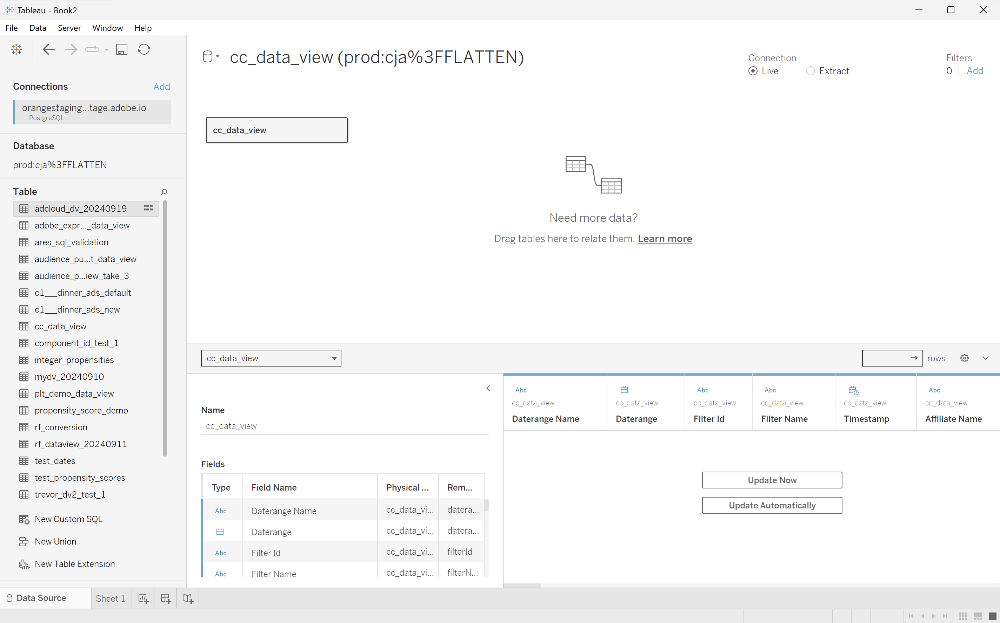
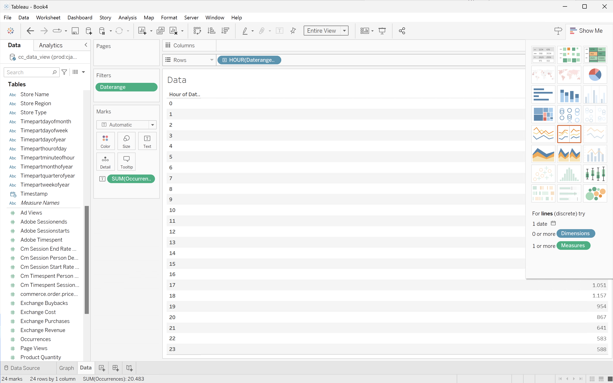
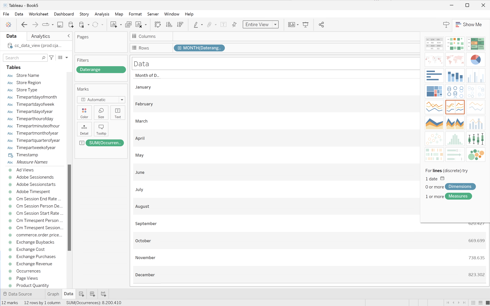
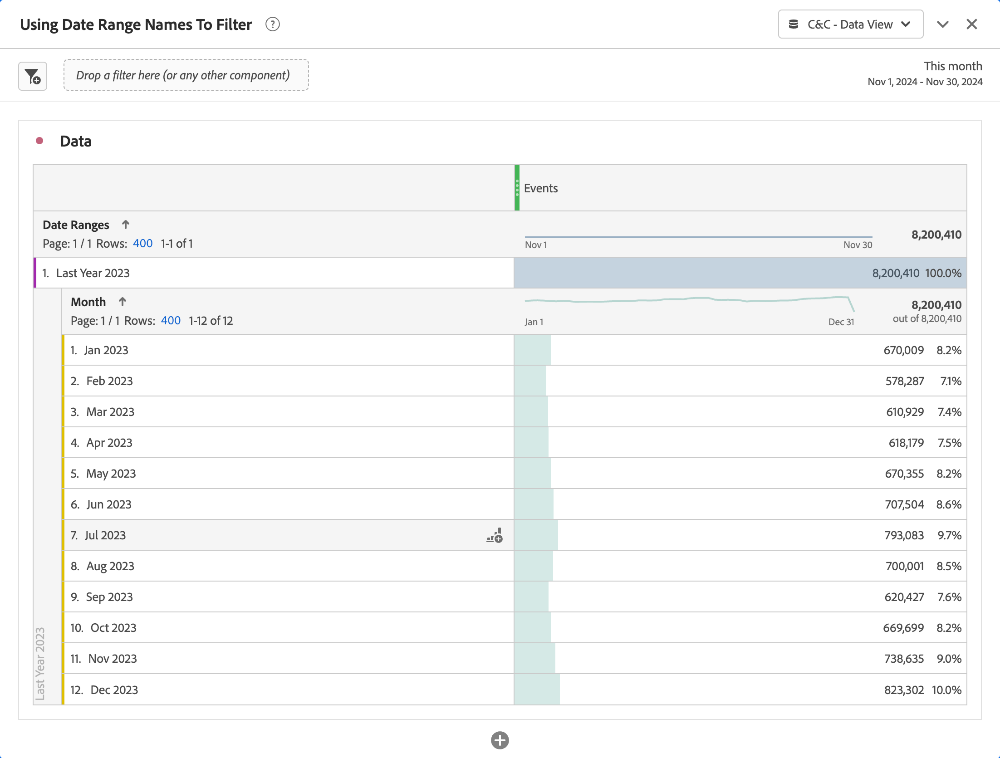

# Cas d’utilisation de l’extension BI

Cet article explique comment réaliser un certain nombre de cas d’utilisation à l’aide de l’extension Customer Journey Analytics BI. Pour chaque cas d’utilisation, explique la fonctionnalité du Customer Journey Analytics, suivie des détails pour chacun des outils de BI pris en charge :

* **Bureau de Power BI**. La version utilisée est la 2.137.1102.0 64 bits (octobre 2024).
* **Tableau Desktop**. La version utilisée est la version 2024.1.5 (20241.24.0705.0334) 64 bits.

Les cas d’utilisation suivants sont documentés :

* [Connexion et énumération des vues de données](#connect-and-validate)
* [Tendance quotidienne](#daily-trend)
* [Tendance horaire](#hourly-trend)
* [Tendance mensuelle](#monthly-trend)
* [Classement d’une seule dimension](#single-dimension-ranked)
* [Classement de plusieurs dimensions](#multiple-dimension-ranked)
* [Compter les valeurs de dimension distinctes](#count-distinct-dimension-values)
* [Utilisation des noms de période pour le filtrage](#use-date-range-names-to-filter)
* [Utiliser les noms de filtre pour filtrer](#use-filter-names-to-filter)
* [Utiliser les valeurs de dimension pour le filtrage](#use-dimension-values-to-filter)
* [Tri](#sort)
* [Limites](#limits)
* [À ALABOUTER ou non](#to-flatten-or-not)
* [Transformations](#transformations)
* [Visualisations](#visualizations)

Le premier cas d’utilisation concerne la manière de connecter les outils de BI à l’aide de l’extension Customer Journey Analytics BI.

Dans les cas d’utilisation 2 à 12, des instructions sont disponibles sur la manière d’accomplir des visualisations de Customer Journey Analytics similaires dans les outils de BI actuellement pris en charge.

Les cas d’utilisation 13 à 15 fournissent des détails supplémentaires sur :

* Différentes manières de se connecter aux outils de BI.
* Transformations qui se produisent lorsque vous utilisez des outils de BI pour générer des rapports et analyser.
* similarités de visualisation et différences entre les outils Customer Journey Analytics et BI.


## Connexion et validation

Ce cas pratique configure la connexion de l’outil de BI à Customer Journey Analytics, répertorie les vues de données disponibles et sélectionne une vue de données à utiliser.

+++ Customer Journey Analytics

Les instructions se rapportent à un exemple d’environnement avec les objets suivants :

* Vue des données : **[!UICONTROL C&amp;C - Vue des données]** ??.
* Dimensions : **[!UICONTROL Nom du produit]** ?? et **[!UICONTROL Catégorie de produit]** ??.
* Mesures : **[!UICONTROL Recettes d’achats]** ?? et **[!UICONTROL Achats]** ??.
* Filtre : **[!UICONTROL Produits de pêche]** ??.


Lorsque vous examinez les cas d’utilisation, remplacez ces exemples d’objets par des objets adaptés à votre environnement spécifique.

+++

+++ Outils BI

>[!BEGINTABS]

>[!TAB Bureau de Power BI]

1. Accédez aux informations d’identification et aux paramètres requis à partir de l’interface utilisateur de Query Service Experience Platform.

   1. Accédez à votre environnement de test Experience Platform.
   1. Sélectionnez  **[!UICONTROL Requêtes]** dans le rail de gauche.
   1. Sélectionnez l&#39;onglet **[!UICONTROL Credentials]** dans l&#39;interface **[!UICONTROL Queries]**.
   1. Sélectionnez `prod:cja` dans le menu déroulant **[!UICONTROL Base de données]**.

      

1. Démarrez Power BI Desktop.
   1. Dans l&#39;interface principale, sélectionnez **[!UICONTROL Obtenir des données d&#39;autres sources]**.
   1. Dans la boîte de dialogue **[!UICONTROL Obtenir des données]** :
      
      1. Recherchez et sélectionnez **[!UICONTROL Base de données PostgreSQL]**.
      1. Sélectionnez **[!UICONTROL Connect]**.
   1. Dans la boîte de dialogue **[!UICONTROL Base de données PostgreSQL]** :
      
      1. Utilisez  pour copier et coller les valeurs **[!UICONTROL Host]** et **[!UICONTROL Port]** du panneau **[!UICONTROL Query]** **[!UICONTROL Expiring Credentials]** Experience Platform, séparées par `:` comme valeur de **[!UICONTROL Server]**. Par exemple : `examplecompany.platform-query.adobe.io:80`.
      1. Utilisez  pour copier et coller la valeur **[!UICONTROL Database]** du panneau **[!UICONTROL Query]** **[!UICONTROL Expiring Credentials]** Experience Platform. Ajoutez `?FLATTEN` à la valeur que vous collez. Par exemple : `prod:cja?FLATTEN`.
      1. Sélectionnez **[!UICONTROL DirectQuery]** comme **[!UICONTROL mode de connectivité des données]**.
      1. Sélectionnez **[!UICONTROL OK]**.
   1. Dans la boîte de dialogue **[!UICONTROL Base de données PostgreSQL]** - **[!UICONTROL Base de données]** :
      
      1. Utilisez  pour copier les valeurs **[!UICONTROL Nom d’utilisateur]** et **[!UICONTROL Mot de passe]** du panneau **[!UICONTROL Requête]** **[!UICONTROL Informations d’identification d’expiration]** de l’Experience Platform dans les champs **[!UICONTROL Nom d’utilisateur]** et **[!UICONTROL Mot de passe]**. Si vous utilisez des [informations d’identification non expirantes](https://experienceleague.adobe.com/en/docs/experience-platform/query/ui/credentials?lang=en#use-credential-to-connect), utilisez le mot de passe de vos informations d’identification non arrivant à expiration.
      1. Assurez-vous que le menu déroulant de **[!UICONTROL Sélectionner le niveau auquel appliquer ces paramètres à]** est défini sur le **[!UICONTROL serveur]** que vous avez défini précédemment.
      1. Sélectionnez **[!UICONTROL Connect]**.
   1. Dans la boîte de dialogue **[!UICONTROL Navigator]**, les vues de données sont récupérées. Cette récupération peut prendre du temps. Une fois récupéré, les éléments suivants s’affichent dans le bureau Power BI.
      
      1. Sélectionnez **[!UICONTROL public.cc_data_view]** dans la liste du panneau de gauche.
      1. Vous disposez de deux options :
         1. Sélectionnez **[!UICONTROL Load]** (Charger Target) pour continuer et terminer la configuration.
         1. Sélectionnez **[!UICONTROL Transform Data]**. Une boîte de dialogue s’affiche, dans laquelle vous pouvez éventuellement appliquer des transformations dans le cadre de la configuration.
            
            * Sélectionnez **[!UICONTROL Fermer et appliquer]**.
   1. Au bout d’un certain temps, **[!UICONTROL public.cc_data_view]** s’affiche dans le volet **[!UICONTROL Data]**. Sélectionnez  pour afficher les dimensions et les mesures.
      


>[!TAB Tableau Desktop]

1. Accédez aux informations d’identification et aux paramètres requis à partir de l’interface utilisateur de Query Service Experience Platform.

   1. Accédez à votre environnement de test Experience Platform.
   1. Sélectionnez  **[!UICONTROL Requêtes]** dans le rail de gauche.
   1. Sélectionnez l&#39;onglet **[!UICONTROL Credentials]** dans l&#39;interface **[!UICONTROL Queries]**.
   1. Sélectionnez `prod:cja` dans le menu déroulant **[!UICONTROL Base de données]**.

      

1. Démarrez Tableau.
   1. Sélectionnez **[!UICONTROL PostgreSQL]** dans le rail de gauche en dessous de **[!UICONTROL Sur un serveur]**. Si ce n&#39;est pas le cas, sélectionnez **[!UICONTROL Plus...]** et **[!UICONTROL PostgreSQL]** dans la liste **[!UICONTROL Connecteurs installés]**.
      
   1. Dans la boîte de dialogue **[!UICONTROL PostgreSQL]**, dans l’onglet **[!UICONTROL Général]** :
      
      1. Utilisez  pour copier et coller l’**[!UICONTROL hôte]** du panneau **[!UICONTROL Requête]** **[!UICONTROL Informations d’identification d’expiration]** de l’Experience Platform sur le **[!UICONTROL serveur]**.
      1. Utilisez  pour copier et coller le **[!UICONTROL port]** du panneau Experience Platform **[!UICONTROL Requête]** **[!UICONTROL Informations d’identification d’expiration]** vers le **[!UICONTROL port]**.
      1. Utilisez  pour copier et coller la **[!UICONTROL base de données]** du panneau **[!UICONTROL Requête]** **[!UICONTROL Informations d’identification d’expiration]** de l’Experience Platform dans la **[!UICONTROL base de données]**. Ajoutez `%3FFLATTEN` à la valeur que vous collez. Par exemple : `prod:cja%3FFLATTEN`.
      1. Sélectionnez **[!UICONTROL Nom d’utilisateur et mot de passe]** dans le menu déroulant **[!UICONTROL Authentification]** .
      1. Utilisez  pour copier et coller le **[!UICONTROL nom d’utilisateur]** du panneau **[!UICONTROL Requête]** **[!UICONTROL Informations d’identification d’expiration]** de l’Experience Platform dans le **[!UICONTROL nom d’utilisateur]**.
      1. Utilisez  pour copier et coller le **[!UICONTROL mot de passe]** du panneau **[!UICONTROL Requête]** **[!UICONTROL Informations d’identification d’expiration]** de l’Experience Platform dans le **[!UICONTROL mot de passe]**. Si vous utilisez des [informations d’identification non expirantes](https://experienceleague.adobe.com/en/docs/experience-platform/query/ui/credentials?lang=en#use-credential-to-connect), utilisez le mot de passe de vos informations d’identification non arrivant à expiration.
      1. Vérifiez que **[!UICONTROL Require SSL]** est coché.
      1. Sélectionnez **[!UICONTROL Se connecter]**.

      Une boîte de dialogue **[!UICONTROL Requête de progression]** s’affiche alors que Tableau Desktop valide la connexion.
   1. Dans la fenêtre principale, la page **[!UICONTROL Source de données]** s’affiche dans le volet de gauche :
      * Nom de la connexion, sous **[!UICONTROL Connexions]**.
      * Nom de la base de données, sous **[!UICONTROL Database]**.
      * Une liste de tables, sous **[!UICONTROL Table]**.
        
      1. Faites glisser l’entrée **[!UICONTROL cc_data_view]** et déposez l’entrée sur la vue principale qui indique **[!UICONTROL Faire glisser les tables]** ici.
   1. La fenêtre principale affiche les détails de la vue de données **[!UICONTROL cc_data_view]**.
      

>[!ENDTABS]

+++


## Tendance quotidienne

Dans ce cas d’utilisation, vous souhaitez afficher un tableau et une visualisation en ligne simple présentant une tendance quotidienne des occurrences (événements) entre le 1er janvier 2023 et le 31 janvier 2023.

+++ Customer Journey Analytics

Exemple de panneau **[!UICONTROL Tendance quotidienne]** pour le cas d’utilisation :


+++

+++ Outils BI

>[!PREREQUISITES]
>
>Vérifiez que vous avez validé une [connexion réussie et que vous pouvez répertorier et utiliser des vues de données](#connect-and-validate) pour l’outil de BI pour lequel vous souhaitez tester ce cas d’utilisation.
>

>[!BEGINTABS]

>[!TAB Bureau de Power BI]

1. Dans le volet **[!UICONTROL Data]** :
   1. Sélectionnez **[!UICONTROL daterangeday]**.
   1. Sélectionnez **[!UICONTROL ∑ occurrences]**.

   Un tableau s’affiche pour les occurrences du mois en cours. Pour une meilleure visibilité, agrandissez la visualisation.

1. Dans le volet **[!UICONTROL Filtres]** :

   1. Sélectionnez **[!UICONTROL daterangeday is (All)]** dans **[!UICONTROL Filtres sur ce visuel]**.
   1. Sélectionnez **[!UICONTROL Filtrage avancé]** comme **[!UICONTROL Type de filtre]**.
   1. Définissez le filtre sur **[!UICONTROL Afficher les éléments lorsque la valeur]** **[!UICONTROL est activée ou après]** `1/1/2023` **** **[!UICONTROL est antérieure à]** `2/1/2023.` Vous pouvez utiliser l’icône de calendrier pour sélectionner des dates.
   1. Sélectionnez **[!UICONTROL Appliquer le filtre]**.

   La table est mise à jour avec le filtre **[!UICONTROL daterangeday]** appliqué.

1. Dans le volet **[!UICONTROL Visualisations]**, sélectionnez la visualisation **[!UICONTROL Graphique en courbes]**.

   Une visualisation en graphique linéaire remplace le tableau tout en utilisant les mêmes données que le tableau. Votre bureau Power BI doit ressembler à ce qui suit.

   

1. Dans la visualisation en graphique en courbes :

   1. Sélectionnez .
   1. Dans le menu contextuel, sélectionnez **[!UICONTROL Afficher en tant que table]**.

   L’affichage principal est mis à jour afin d’afficher à la fois une visualisation par ligne et un tableau. Votre bureau Power BI doit ressembler à ce qui suit.

   

>[!TAB Tableau Desktop]

1. Sélectionnez l’onglet **[!UICONTROL Feuille 1]** en bas pour basculer de la vue **[!UICONTROL Source de données]**. Dans la vue **[!UICONTROL Sheet 1]** :
   1. Faites glisser l’entrée **[!UICONTROL Daterange]** de la liste **[!UICONTROL Tables]** dans le volet **[!UICONTROL Données]** et déposez l’entrée sur le plateau **[!UICONTROL Filtres]**.
   1. Dans la boîte de dialogue **[!UICONTROL Filters Field \[Daterange\]]**, sélectionnez **[!UICONTROL Plage de dates]** et sélectionnez **[!UICONTROL Suivant >]**.
   1. Dans la boîte de dialogue **[!UICONTROL Filtre \[Daterange]]**, sélectionnez **[!UICONTROL Plage de dates]** et spécifiez une période de `01/01/2023` à `01/02/2023`.

      

   1. Faites glisser **[!UICONTROL Daterangeday]** depuis la liste **[!UICONTROL Tables]** du volet **[!UICONTROL Données]** et déposez l’entrée dans le champ en regard de **[!UICONTROL Colonnes]**.
      * Sélectionnez **[!UICONTROL Day]** dans le menu déroulant **[!UICONTROL Daterangeday]**, de sorte que la valeur soit mise à jour vers **[!UICONTROL DAY(Daterangeday)]**.
   1. Faites glisser **[!UICONTROL Occurrences]** depuis la liste **[!UICONTROL Tables (*Mesurer les noms*)]** dans le volet **[!UICONTROL Données]** et déposez l’entrée dans le champ en regard de **[!UICONTROL Lignes]**.
      * Les valeurs sont automatiquement converties en **[!UICONTROL SUM(Occurrences)]**.
   1. Modifiez **[!UICONTROL Standard]** en **[!UICONTROL Vue entière]** à partir du menu déroulant **[IUICONTROL Fit]** de la barre d’outils.

      Votre bureau Tableau doit ressembler à ce qui suit.

      

1. Sélectionnez **[!UICONTROL Dupliquer]** dans le menu contextuel de l’onglet **[!UICONTROL Feuille 1]** pour créer une seconde feuille.
1. Sélectionnez **[!UICONTROL Renommer]** dans le menu contextuel de l’onglet **[!UICONTROL Feuille 1]** pour renommer la feuille en `Graph`.
1. Sélectionnez **[!UICONTROL Renommer]** dans le menu contextuel de l’onglet **[!UICONTROL Feuille 1 (2)]** pour renommer la feuille en `Data`.
1. Assurez-vous que la feuille **[!UICONTROL Data]** est sélectionnée. Dans la vue **[!UICONTROL Data]** :
   1. Sélectionnez **[!UICONTROL Afficher]** en haut à droite et sélectionnez **[!UICONTROL Tableau de texte]** (visualisation en haut à gauche) pour modifier le contenu de la vue de données en tableau.
   1. Sélectionnez **[!UICONTROL Permuter les lignes et les colonnes]** dans la barre d’outils.
   1. Modifiez **[!UICONTROL Standard]** en **[!UICONTROL Vue entière]** à partir du menu déroulant **[IUICONTROL Fit]** de la barre d’outils.

      Votre bureau Tableau doit ressembler à ce qui suit.

      

1. Sélectionnez le bouton de l’onglet **[!UICONTROL Nouveau tableau de bord]** (en bas) pour créer une nouvelle vue **[!UICONTROL Tableau de bord 1]**. Dans la vue **[!UICONTROL Tableau de bord 1]** :
   1. Faites glisser et déposez la feuille **[!UICONTROL Graph]** de l’étagère **[!UICONTROL Sheets]** sur la vue **[!UICONTROL Tableau de bord 1]** qui indique *Déposez les feuilles ici*.
   1. Faites glisser et déposez la feuille **[!UICONTROL Data]** de l’étagère **[!UICONTROL Sheets]** sous la feuille **[!UICONTROL Graph]** sur la vue **[!UICONTROL Tableau de bord 1]**.
   1. Sélectionnez la feuille **[!UICONTROL Data]** dans la vue et modifiez la **[!UICONTROL vue entière]** en **[!UICONTROL largeur du correctif]**.

      Votre bureau Tableau doit ressembler à ce qui suit.

      

>[!ENDTABS]

+++


## Tendance horaire

Dans ce cas d’utilisation, vous souhaitez afficher un tableau et une visualisation en ligne simple présentant une tendance horaire des occurrences (événements) pour le 1er janvier 2023.

+++ Customer Journey Analytics

Exemple de panneau **[!UICONTROL Tendance horaire]** pour le cas d’utilisation :


+++

+++ Outils BI

>[!PREREQUISITES]
>
>Vérifiez que vous avez validé [une connexion réussie, que vous pouvez répertorier les vues de données et utiliser une vue de données](#connect-and-validate) pour l’outil de BI pour lequel vous souhaitez tester ce cas d’utilisation.
>

>[!BEGINTABS]

>[!TAB Bureau de Power BI]

 La Power BI **not** comprend comment gérer les champs de date et heure. Par conséquent, les dimensions telles que **[!UICONTROL daterangehour]** et **[!UICONTROL daterangeminute]** ne sont pas prises en charge.

>[!TAB Tableau Desktop]

1. Sélectionnez l’onglet **[!UICONTROL Feuille 1]** en bas pour basculer de **[!UICONTROL Source de données]**. Dans la vue **[!UICONTROL Sheet 1]** :
   1. Faites glisser l’entrée **[!UICONTROL Daterange]** de la liste **[!UICONTROL Tables]** dans le volet **[!UICONTROL Données]** et déposez l’entrée sur le plateau **[!UICONTROL Filtres]**.
   1. Dans la boîte de dialogue **[!UICONTROL Filters Field \[Daterange\]]**, sélectionnez **[!UICONTROL Plage de dates]** et sélectionnez **[!UICONTROL Suivant >]**.
   1. Dans la boîte de dialogue **[!UICONTROL Filtre \[Daterange]]**, sélectionnez **[!UICONTROL Plage de dates]** et spécifiez une période de `01/01/2023` à `02/01/2023`.

      

   1. Faites glisser **[!UICONTROL Daterangehour]** depuis la liste **[!UICONTROL Tables]** du volet **[!UICONTROL Données]** et déposez l’entrée dans le champ en regard de **[!UICONTROL Colonnes]**.
      * Sélectionnez **[!UICONTROL Plus]** > **[!UICONTROL Heures]** dans le menu déroulant **[!UICONTROL Daterangeday]**, de sorte que la valeur soit mise à jour vers **[!UICONTROL HOUR(Daterangeday)]**.
   1. Faites glisser **[!UICONTROL Occurrences]** depuis la liste **[!UICONTROL Tables (*Mesurer les noms*)]** dans le volet **[!UICONTROL Données]** et déposez l’entrée dans le champ en regard de **[!UICONTROL Lignes]**.
      * Les valeurs sont automatiquement converties en **[!UICONTROL SUM(Occurrences)]**.
   1. Modifiez **[!UICONTROL Standard]** en **[!UICONTROL Vue entière]** à partir du menu déroulant **[IUICONTROL Fit]** de la barre d’outils.

      Votre bureau Tableau doit ressembler à ce qui suit.

      

1. Sélectionnez **[!UICONTROL Dupliquer]** dans le menu contextuel de l’onglet **[!UICONTROL Feuille 1]** pour créer une seconde feuille.
1. Sélectionnez **[!UICONTROL Renommer]** dans le menu contextuel de l’onglet **[!UICONTROL Feuille 1]** pour renommer la feuille en `Graph`.
1. Sélectionnez **[!UICONTROL Renommer]** dans le menu contextuel de l’onglet **[!UICONTROL Feuille 1 (2)]** pour renommer la feuille en `Data`.
1. Assurez-vous que la feuille **[!UICONTROL Data]** est sélectionnée. Dans la vue **[!UICONTROL Data]** :
   1. Sélectionnez **[!UICONTROL Afficher]** en haut à droite et sélectionnez **[!UICONTROL Tableau de texte]** (visualisation en haut à gauche) pour modifier le contenu de la vue de données en tableau.
   1. Faites glisser **[!UICONTROL HOUR(Daterangeday)]** de **[!UICONTROL Colonnes]** vers **[!UICONTROL Lignes]**.
   1. Modifiez **[!UICONTROL Standard]** en **[!UICONTROL Vue entière]** à partir du menu déroulant **[IUICONTROL Fit]** de la barre d’outils.

      Votre bureau Tableau doit ressembler à ce qui suit.

      

1. Sélectionnez le bouton d’onglet **[!UICONTROL Nouveau tableau de bord]** (en bas) pour créer une nouvelle vue **[!UICONTROL Tableau de bord 1]**. Dans la vue **[!UICONTROL Tableau de bord 1]** :
   1. Faites glisser et déposez la feuille **[!UICONTROL Graph]** de l’étagère **[!UICONTROL Sheets]** sur la vue **[!UICONTROL Tableau de bord 1]** qui indique *Déposez les feuilles ici*.
   1. Faites glisser et déposez la feuille **[!UICONTROL Data]** de l’étagère **[!UICONTROL Sheets]** sous la feuille **[!UICONTROL Graph]** sur la vue **[!UICONTROL Tableau de bord 1]**.
   1. Sélectionnez la feuille **[!UICONTROL Data]** dans la vue et modifiez la **[!UICONTROL vue entière]** en **[!UICONTROL largeur du correctif]**.

      Votre vue **[!UICONTROL Tableau de bord 1]** doit ressembler à ce qui suit.

      


>[!ENDTABS]

+++


## Tendance mensuelle

Dans ce cas pratique, vous souhaitez afficher un tableau et une visualisation en ligne simple qui affiche une tendance mensuelle des occurrences (événements) pour 2023.

+++ Customer Journey Analytics

Exemple de panneau **[!UICONTROL Tendance mensuelle]** pour le cas d’utilisation :


+++

+++ Outils BI

>[!PREREQUISITES]
>
>Vérifiez que vous avez validé [une connexion réussie, que vous pouvez répertorier les vues de données et utiliser une vue de données](#connect-and-validate) pour l’outil de BI pour lequel vous souhaitez tester ce cas d’utilisation.
>

>[!BEGINTABS]

>[!TAB Bureau de Power BI]

1. Dans le volet **[!UICONTROL Data]** :
   1. Sélectionnez **[!UICONTROL daterangemonth]**.
   1. Sélectionnez **[!UICONTROL ∑ occurrences]**.

   Un tableau s’affiche pour les occurrences du mois en cours. Pour une meilleure visibilité, agrandissez la visualisation.

1. Dans le volet **[!UICONTROL Filtres]** :

   1. Sélectionnez le **[!UICONTROL daterangemonth is (All)]** de **[!UICONTROL Filtres sur ce visuel]**.
   1. Sélectionnez **[!UICONTROL Filtrage avancé]** comme **[!UICONTROL Type de filtre]**.
   1. Définissez le filtre sur **[!UICONTROL Afficher les éléments lorsque la valeur]** **[!UICONTROL est activée ou après]** `1/1/2023` **** **[!UICONTROL est antérieure à]** `1/1/2024.` Vous pouvez utiliser l’icône de calendrier pour sélectionner des dates.
   1. Sélectionnez **[!UICONTROL Appliquer le filtre]**.

   La table est mise à jour avec le filtre **[!UICONTROL daterangemonth]** appliqué.

1. Dans le volet **[!UICONTROL Visualisations]** :

   1. Sélectionnez la visualisation **[!UICONTROL Graphique en courbes]** .

   Une visualisation en graphique linéaire remplace le tableau tout en utilisant les mêmes données que le tableau. Votre bureau Power BI doit ressembler à ce qui suit.

   

1. Dans la visualisation en graphique en courbes :

   1. Sélectionnez .
   1. Dans le menu contextuel, sélectionnez **[!UICONTROL Afficher en tant que table]**.

   L’affichage principal est mis à jour afin d’afficher à la fois une visualisation par ligne et un tableau. Votre bureau Power BI doit ressembler à ce qui suit.

   

>[!TAB Tableau Desktop]

1. Sélectionnez l’onglet **[!UICONTROL Feuille 1]** en bas pour basculer de **[!UICONTROL Source de données]**. Dans la vue **[!UICONTROL Sheet 1]** :
   1. Faites glisser l’entrée **[!UICONTROL Daterange]** de la liste **[!UICONTROL Tables]** dans le volet **[!UICONTROL Données]** et déposez l’entrée sur le plateau **[!UICONTROL Filtres]**.
   1. Dans la boîte de dialogue **[!UICONTROL Filters Field \[Daterange\]]**, sélectionnez **[!UICONTROL Plage de dates]** et sélectionnez **[!UICONTROL Suivant >]**.
   1. Dans la boîte de dialogue **[!UICONTROL Filtre \[Daterange]]**, sélectionnez **[!UICONTROL Plage de dates]** et spécifiez une période de `01/01/2023` à `01/01/2024`.

      

   1. Faites glisser **[!UICONTROL Daterangeday]** depuis la liste **[!UICONTROL Tables]** du volet **[!UICONTROL Données]** et déposez l’entrée dans le champ en regard de **[!UICONTROL Colonnes]**.
      * Sélectionnez **[!UICONTROL MONTH]** dans le menu déroulant **[!UICONTROL Daterangeday]**, de sorte que la valeur soit mise à jour sur **[!UICONTROL MONTH(Daterangeday)]**.
   1. Faites glisser **[!UICONTROL Occurrences]** depuis la liste **[!UICONTROL Tables (*Mesurer les noms*)]** dans le volet **[!UICONTROL Données]** et déposez l’entrée dans le champ en regard de **[!UICONTROL Lignes]**.
      * Les valeurs sont automatiquement converties en **[!UICONTROL SUM(Occurrences)]**.
   1. Modifiez **[!UICONTROL Standard]** en **[!UICONTROL Vue entière]** à partir du menu déroulant **[IUICONTROL Fit]** de la barre d’outils.

      Votre bureau Tableau doit ressembler à ce qui suit.

      

1. Sélectionnez **[!UICONTROL Dupliquer]** dans le menu contextuel de l’onglet **[!UICONTROL Feuille 1]** pour créer une seconde feuille.
1. Sélectionnez **[!UICONTROL Renommer]** dans le menu contextuel de l’onglet **[!UICONTROL Feuille 1]** pour renommer la feuille en `Graph`.
1. Sélectionnez **[!UICONTROL Renommer]** dans le menu contextuel de l’onglet **[!UICONTROL Feuille 1 (2)]** pour renommer la feuille en `Data`.
1. Assurez-vous que la feuille **[!UICONTROL Data]** est sélectionnée. Dans la vue Data :
   1. Sélectionnez **[!UICONTROL Afficher]** en haut à droite et sélectionnez **[!UICONTROL Tableau de texte]** (visualisation en haut à gauche) pour modifier le contenu de la vue de données en tableau.
   1. Faites glisser **[!UICONTROL MONTH(Daterangeday)]** de **[!UICONTROL Colonnes]** vers **[!UICONTROL Lignes]**.
   1. Modifiez **[!UICONTROL Standard]** en **[!UICONTROL Vue entière]** à partir du menu déroulant **[IUICONTROL Fit]** de la barre d’outils.

      Votre bureau Tableau doit ressembler à ce qui suit.

      

1. Sélectionnez le bouton d’onglet **[!UICONTROL Nouveau tableau de bord]** (en bas) pour créer une nouvelle vue **[!UICONTROL Tableau de bord 1]**. Dans la vue **[!UICONTROL Tableau de bord 1]** :
   1. Faites glisser et déposez la feuille **[!UICONTROL Graph]** de l’étagère **[!UICONTROL Sheets]** sur la vue **[!UICONTROL Tableau de bord 1]** qui indique *Déposez les feuilles ici*.
   1. Faites glisser et déposez la feuille **[!UICONTROL Data]** de l’étagère **[!UICONTROL Sheets]** sous la feuille **[!UICONTROL Graph]** sur la vue **[!UICONTROL Tableau de bord 1]**.
   1. Sélectionnez la feuille **[!UICONTROL Data]** dans la vue et modifiez la **[!UICONTROL vue entière]** en **[!UICONTROL largeur du correctif]**.

      Votre bureau Tableau doit ressembler à ce qui suit.

      

>[!ENDTABS]

+++


## Classement d’une seule dimension

Dans ce cas d’utilisation, vous souhaitez afficher un tableau et une visualisation à barres simple présentant les recettes des achats et des achats pour les noms de produits datant de plus de 2023.

+++ Customer Journey Analytics

Exemple de panneau **[!UICONTROL Classement par Dimension unique]** pour le cas d’utilisation :


+++

+++ Outils BI

>[!PREREQUISITES]
>
>Vérifiez que vous avez validé [une connexion réussie, que vous pouvez répertorier les vues de données et utiliser une vue de données](#connect-and-validate) pour l’outil de BI pour lequel vous souhaitez tester ce cas d’utilisation.
>

>[!BEGINTABS]

>[!TAB Bureau de Power BI]

1. Dans le volet **[!UICONTROL Data]** :
   1. Sélectionnez **[!UICONTROL daterange]**.
   1. Sélectionnez **[!UICONTROL product_name]**.
   1. Sélectionnez **[!UICONTROL ∑ purchase_revenue]**.
   1. Sélectionnez **[!UICONTROL ∑ achats]**.

   Un tableau vide s’affiche uniquement pour les en-têtes de colonne de l’élément sélectionné. Pour une meilleure visibilité, agrandissez la visualisation.

1. Dans le volet **[!UICONTROL Filtres]** :

   1. Sélectionnez **[!UICONTROL daterange is (All)]** dans **[!UICONTROL Filtres sur ce visuel]**.
   1. Sélectionnez **[!UICONTROL Date relative]** comme **[!UICONTROL Type de filtre]**.
   1. Définissez le filtre sur **[!UICONTROL Afficher les éléments lorsque la valeur]** **[!UICONTROL se trouve dans les dernières]** `1` **[!UICONTROL années calendaires]**.
   1. Sélectionnez **[!UICONTROL Appliquer le filtre]**.

   La table est mise à jour avec le filtre **[!UICONTROL daterange]** appliqué.

1. Dans le volet **[!UICONTROL Visualisation]** :

   1. Utilisez  pour supprimer **[!UICONTROL daterange]** de **[!UICONTROL colonnes]**.
   1. Faites glisser **[!UICONTROL Somme des achats_recettes]** sous **[!UICONTROL Somme des achats]** dans **[!UICONTROL Colonnes]**.

1. Dans la visualisation Tableau :

   1. Sélectionnez **[!UICONTROL Somme de purchase_revenue]** pour trier les noms des produits dans un ordre décroissant de recettes d’achat. Votre bureau Power BI doit ressembler à ce qui suit.

   

1. Dans le volet **[!UICONTROL Filtres]** :

   1. Sélectionnez **[!UICONTROL product_name is (All)]**.
   1. Définissez **[!UICONTROL Type de filtre]** sur **[!UICONTROL Top N]**.
   1. Définissez le filtre sur **[!UICONTROL Afficher les éléments]** **[!UICONTROL Top]** `10` **[!UICONTROL Par valeur]**.
   1. Faites glisser **[!UICONTROL purchase_revenue]** et déposez-le dans **[!UICONTROL Par valeur]** **[!UICONTROL Ajoutez des champs de données ici]**.
   1. Sélectionnez **[!UICONTROL Appliquer le filtre]**.

   Le tableau mis à jour avec les valeurs pour les recettes d’achat est synchronisé avec la visualisation de tableau à structure libre dans Analysis Workspace.

1. Dans le volet **[!UICONTROL Visualisations]** :

   1. Sélectionnez la visualisation **[!UICONTROL Graphique en courbes et en colonnes empilées]** .

   Une visualisation en graphique en courbes et en colonnes empilées remplace le tableau tout en utilisant les mêmes données que le tableau.

1. Faites glisser **[!UICONTROL achats]** sur **[!UICONTROL Ligne y-axis]** dans le volet **[!UICONTROL Visualisations]**.

   Le graphique en courbes et en colonnes empilées est mis à jour. Votre bureau Power BI doit ressembler à ce qui suit.

   

1. Dans la visualisation en ligne et en colonnes empilées :

   1. Sélectionnez .
   1. Dans le menu contextuel, sélectionnez **[!UICONTROL Afficher en tant que table]**.

   L’affichage principal est mis à jour afin d’afficher à la fois une visualisation par ligne et un tableau.

   

>[!TAB Tableau Desktop]

1. Sélectionnez l’onglet **[!UICONTROL Feuille 1]** en bas pour basculer de **[!UICONTROL Source de données]**. Dans la vue **[!UICONTROL Sheet 1]** :
   1. Faites glisser l’entrée **[!UICONTROL Daterange]** de la liste **[!UICONTROL Tables]** dans le volet **[!UICONTROL Données]** et déposez l’entrée sur le plateau **[!UICONTROL Filtres]**.
   1. Dans la boîte de dialogue **[!UICONTROL Filters Field \[Daterange\]]**, sélectionnez **[!UICONTROL Plage de dates]** et sélectionnez **[!UICONTROL Suivant >]**.
   1. Dans la boîte de dialogue **[!UICONTROL Filtre \[Daterange]]**, sélectionnez **[!UICONTROL Plage de dates]** et spécifiez une période de `01/01/2023` à `31/12/2024`. Sélectionnez **[!UICONTROL Apply]** et **[!UICONTROL OK]**.

      

   1. Faites glisser **[!UICONTROL Nom du produit]** depuis la liste **[!UICONTROL Tables]** du volet **[!UICONTROL Données]** et déposez l’entrée dans le champ en regard de **[!UICONTROL Lignes]**.
   1. Faites glisser **[!UICONTROL Achats]** depuis la liste **[!UICONTROL Tables (*Mesurer les noms*)]** du volet **[!UICONTROL Données]** et déposez l’entrée dans le champ en regard de **[!UICONTROL Lignes]**.
      * Les valeurs sont automatiquement converties en **[!UICONTROL SUM(Achats)]**.
   1. Faites glisser **[!UICONTROL Recettes des achats]** depuis la liste **[!UICONTROL Tables (*Mesurer les noms*)]** du volet **[!UICONTROL Données]** et déposez l’entrée dans le champ en regard de **[!UICONTROL Colonnes]** et laissez-la de **[!UICONTROL SOMME(Achats)]**.
      * Les valeurs sont automatiquement converties en **[!UICONTROL SUM(Purchase Revenue)]**.
   1. Pour classer les deux graphiques dans un ordre décroissant de recettes d’achat, passez la souris sur le titre **[!UICONTROL Recettes d’achats]** et sélectionnez l’icône de tri.
   1. Pour limiter le nombre d’entrées dans les graphiques, sélectionnez **[!UICONTROL SUM(Purchase Revenue)]** dans **[!UICONTROL Lignes]** et, dans le menu déroulant, sélectionnez **[!UICONTROL Filtre]**.
   1. Dans la boîte de dialogue **[!UICONTROL Filtre \[Recettes des achats\]]**, sélectionnez **[!UICONTROL Plage de valeurs]** et saisissez les valeurs appropriées. Par exemple : `1,000,000` - `2,000,000`. Sélectionnez **[!UICONTROL Apply]** et **[!UICONTROL OK]**.
   1. Pour convertir les deux graphiques à barres en un graphique à combinaison double, sélectionnez **[!UICONTROL SUM(Achats)]** dans **[!UICONTROL Lignes]** et, dans le menu déroulant, sélectionnez **[!UICONTROL Double axe]**. Les graphiques à barres se transforment en graphique de dispersion.
   1. Pour modifier le graphique de dispersion en graphique à barres :
      1. Sélectionnez **[!UICONTROL SUM(Achats)]** dans la zone **[!UICONTROL Marques]** et sélectionnez **[!UICONTROL Ligne]** dans le menu déroulant.
      1. Sélectionnez **[!UICONTROL SUM(Purchase Revenue)]** dans la zone **[!UICONTROL Marks]** et sélectionnez **[!UICONTROL Bar]** dans le menu déroulant.

   Votre bureau Tableau doit ressembler à ce qui suit.

   

1. Sélectionnez **[!UICONTROL Dupliquer]** dans le menu contextuel de l’onglet **[!UICONTROL Feuille 1]** pour créer une seconde feuille.
1. Sélectionnez **[!UICONTROL Renommer]** dans le menu contextuel de l’onglet **[!UICONTROL Feuille 1]** pour renommer la feuille en `Data`.
1. Sélectionnez **[!UICONTROL Renommer]** dans le menu contextuel de l’onglet **[!UICONTROL Feuille 1 (2)]** pour renommer la feuille en `Graph`.
1. Assurez-vous que la feuille **[!UICONTROL Data]** est sélectionnée.
   1. Sélectionnez **[!UICONTROL Afficher]** en haut à droite et sélectionnez **[!UICONTROL Tableau de texte]** (visualisation en haut à gauche) pour modifier le contenu des deux graphiques en tableau.
   1. Pour classer les recettes d’achat dans un ordre décroissant, passez la souris sur **[!UICONTROL Recettes d’achat]** dans le tableau et sélectionnez .
   1. Sélectionnez **[!UICONTROL Vue entière]** dans le menu déroulant **[!UICONTROL Ajuster]**.

   Votre bureau Tableau doit ressembler à ce qui suit.

   

1. Sélectionnez le bouton d’onglet **[!UICONTROL Nouveau tableau de bord]** (en bas) pour créer une nouvelle vue **[!UICONTROL Tableau de bord 1]**. Dans la vue **[!UICONTROL Tableau de bord 1]** :
   1. Faites glisser et déposez la feuille **[!UICONTROL Graph]** de l’étagère **[!UICONTROL Sheets]** sur la vue **[!UICONTROL Tableau de bord 1]** qui indique *Déposez les feuilles ici*.
   1. Faites glisser et déposez la feuille **[!UICONTROL Data]** de l’étagère **[!UICONTROL Sheets]** sous la feuille **[!UICONTROL Graph]** sur la vue **[!UICONTROL Tableau de bord 1]**.
   1. Sélectionnez la feuille **[!UICONTROL Data]** dans la vue et modifiez la **[!UICONTROL vue entière]** en **[!UICONTROL largeur du correctif]**.

   Votre vue **[!UICONTROL Tableau de bord 1]** doit ressembler à ce qui suit.

   

>[!ENDTABS]

+++


## Classement de plusieurs dimensions

Dans ce cas d’utilisation, vous souhaitez afficher un tableau qui répartit les recettes d’achat et les achats pour les noms de produits au sein des catégories de produits sur la période 2023. En plus de cela, vous souhaitez utiliser certaines visualisations pour illustrer à la fois la distribution des catégories de produits et les contributions aux noms de produits dans chaque catégorie de produits.

+++ Customer Journey Analytics

Exemple de panneau **[!UICONTROL Classement de plusieurs Dimensions]** pour le cas d’utilisation :


+++

+++ Outils BI

>[!PREREQUISITES]
>
>Vérifiez que vous avez validé [une connexion réussie, que vous pouvez répertorier les vues de données et utiliser une vue de données](#connect-and-validate) pour l’outil de BI pour lequel vous souhaitez tester ce cas d’utilisation.
>

>[!BEGINTABS]

>[!TAB Bureau de Power BI]

1. Pour vous assurer que la période s’applique à toutes les visualisations, faites glisser **[!UICONTROL daterangeday]** du volet **[!UICONTROL Données]** vers **[!UICONTROL Filtres sur cette page]**.
   1. Sélectionnez **[!UICONTROL daterangeday is (All)]** dans **[!UICONTROL Filtres sur cette page]**.
   1. Sélectionnez **[!UICONTROL Date relative]** comme **[!UICONTROL Type de filtre]**.
   1. Définissez le filtre sur **[!UICONTROL Afficher les éléments lorsque la valeur]** **[!UICONTROL se trouve dans les dernières]** `1` **[!UICONTROL années calendaires]**.
   1. Sélectionnez **[!UICONTROL Appliquer le filtre]**.

1. Dans le volet **[!UICONTROL Data]** :
   1. Sélectionnez **[!UICONTROL datarangeday]**.
   1. Sélectionnez **[!UICONTROL product_category]**.
   1. Sélectionnez **[!UICONTROL product_name]**.
   1. Sélectionnez **[!UICONTROL ∑ purchase_revenue]**
   1. Sélectionnez **[!UICONTROL ∑ achats]**

1. Pour transformer le graphique à barres verticales en tableau, assurez-vous que le tableau est sélectionné et sélectionnez **[!UICONTROL Matrice]** dans le volet **[!UICONTROL Visualisations]**.
   * Faites glisser **[!UICONTROL product_name]** depuis **[!UICONTROL Columns]** et déposez le champ sous **[!UICONTROL product_category]**y dans **[!UICONTROL Lignes]** dans le volet **[!UICONTROL Visualisation]**.

1. Pour limiter le nombre de produits affichés dans le tableau, sélectionnez **[!UICONTROL product_name is (All)]** dans le volet **[!UICONTROL Filtres]**.

   1. Sélectionnez **[!UICONTROL Filtrage avancé]**.
   1. Sélectionnez **[!UICONTROL Type de filtre]** **[!UICONTROL Top N]** **[!UICONTROL Afficher les éléments]** **[!UICONTROL Top]** `15` **[!UICONTROL Par valeur]**.
   1. Faites glisser **[!UICONTROL achats]** du volet **[!UICONTROL Données]** vers les **[!UICONTROL Champs de données à ajouter ici]**.
   1. Sélectionnez **[!UICONTROL Appliquer le filtre]**.

1. Pour améliorer la lisibilité, sélectionnez **[!UICONTROL Affichage]** dans le menu supérieur, puis **[!UICONTROL Page vue]** > **[!UICONTROL Taille réelle]** et redimensionnez la visualisation du tableau.

1. Pour ventiler chaque catégorie du tableau, sélectionnez **[!UICONTROL +]** au niveau de la catégorie de produits. Votre bureau Power BI doit ressembler à ce qui suit.

   

1. Sélectionnez **[!UICONTROL Home]** dans le menu supérieur, puis **[!UICONTROL New Visual]**. Un nouveau visuel est ajouté à votre rapport.

1. Dans le volet **[!UICONTROL Data]** :
   1. Sélectionnez **[!UICONTROL product_category]**.
   1. Sélectionnez **[!UICONTROL product_name]**.
   1. Sélectionnez **[!UICONTROL purchase_revenue]**.

1. Pour modifier le visuel, sélectionnez le graphique à barres, puis **[!UICONTROL Treemap]** dans le volet **[!UICONTROL Visualisations]**.
1. Assurez-vous que **[!UICONTROL product_category]** est répertorié sous **[!UICONTROL Category]** et que **[!UICONTROL product_name]** est répertorié sous **[!UICONTROL Details]** dans le volet **[!UICONTROL Visualisations]**.

   Votre bureau Power BI doit ressembler à ce qui suit.

   

1. Sélectionnez **[!UICONTROL Home]** dans le menu supérieur, puis **[!UICONTROL New Visual]**. Un nouveau visuel est ajouté à votre rapport.

1. Dans le volet **[!UICONTROL Data]** :
   1. Sélectionnez **[!UICONTROL product_category]**.
   1. Sélectionnez **[!UICONTROL purchase_revenue]**.
   1. Sélectionnez **[!UICONTROL purchase]**.

1. Dans le volet **[!UICONTROL Visualisations]** :
   1. Pour modifier la visualisation, sélectionnez **[!UICONTROL Graphique en courbes et en colonnes empilées]**.
   1. Faites glisser **[!UICONTROL sum_of_purchases]** de **[!UICONTROL Column y-axis]** vers **[!UICONTROL Line y-axis]**.

1. Dans le rapport, reconfigurez les visualisations individuelles.

   Votre bureau Power BI doit ressembler à ce qui suit.

   


>[!TAB Tableau Desktop]

1. Sélectionnez l’onglet **[!UICONTROL Feuille 1]** en bas pour basculer de **[!UICONTROL Source de données]**. Dans la vue **[!UICONTROL Sheet 1]** :
   1. Faites glisser l’entrée **[!UICONTROL Daterange]** de la liste **[!UICONTROL Tables]** dans le volet **[!UICONTROL Données]** et déposez l’entrée sur le plateau **[!UICONTROL Filtres]**.
   1. Dans la boîte de dialogue **[!UICONTROL Filters Field \[Daterange\]]**, sélectionnez **[!UICONTROL Plage de dates]** et sélectionnez **[!UICONTROL Suivant >]**.
   1. Dans la boîte de dialogue **[!UICONTROL Filtrer \[Daterange]]**, sélectionnez **[!UICONTROL Dates relatives]**, sélectionnez **[!UICONTROL Années]** et spécifiez **[!UICONTROL Année précédente]**. Sélectionnez **[!UICONTROL Apply]** et **[!UICONTROL OK]**.

      Votre bureau Tableau doit ressembler à ce qui suit.

      

   1. Faites glisser **[!UICONTROL Catégorie de produits]** et déposez-le en regard de **[!UICONTROL Colonnes]**.
   1. Faites glisser **[!UICONTROL Recettes d’achat]** et déposez en regard de **[!UICONTROL Lignes]**. La valeur passe à **[!UICONTROL SUM(Purchase Revenue)]**.
   1. Faites glisser Achats et déposez en regard de **[!UICONTROL Lignes]**. La valeur passe à **[!UICONTROL SUM(Achats)]**.
   1. Sélectionnez **[!UICONTROL SUM(Achats)]** et, dans le menu déroulant, sélectionnez **[!UICONTROL Double axe]**.
   1. Sélectionnez **[!UICONTROL SUM(Achats)]** dans **[!UICONTROL Marques]** et sélectionnez **[!UICONTROL Ligne]** dans le menu déroulant.
   1. Sélectionnez **[!UICONTROL SUM(Purchase Revenue)]** dans **[!UICONTROL Marks]** et sélectionnez **[!UICONTROL Bar]** dans le menu déroulant.
   1. Sélectionnez **[!UICONTROL Vue entière]** dans le menu **[!UICONTROL Ajuster]** .
   1. Sélectionnez le titre **[!UICONTROL Recettes d’achats]** dans le graphique et assurez-vous que les recettes d’achat sont dans l’ordre croissant.

      Votre bureau Tableau doit ressembler à ce qui suit.

      

1. Renommez la feuille **[!UICONTROL Sheet 1]** actuelle en `Category`.
1. Sélectionnez **[!UICONTROL Nouvelle feuille de calcul]** pour créer une feuille et la renommez `Data`.

   1. Faites glisser l’entrée **[!UICONTROL Daterange]** de la liste **[!UICONTROL Tables]** dans le volet **[!UICONTROL Données]** et déposez l’entrée sur le plateau **[!UICONTROL Filtres]**.
   1. Dans la boîte de dialogue **[!UICONTROL Filters Field \[Daterange\]]**, sélectionnez **[!UICONTROL Plage de dates]** et sélectionnez **[!UICONTROL Suivant >]**.
   1. Dans la boîte de dialogue **[!UICONTROL Filtrer \[Daterange]]**, sélectionnez **[!UICONTROL Dates relatives]**, sélectionnez **[!UICONTROL Années]** et spécifiez **[!UICONTROL Année précédente]**. Sélectionnez **[!UICONTROL Apply]** et **[!UICONTROL OK]**.
   1. Faites glisser **[!UICONTROL Recettes des achats]** du volet **[!UICONTROL Données]** vers **[!UICONTROL Colonnes]**. La valeur passe à **[!UICONTROL SUM(Purchase Revenue)]**.
   1. Faites glisser **[!UICONTROL Purchase]** du volet **[!UICONTROL Data]** vers **[!UICONTROL Columns]**, en regard de **[!UICONTROL Purchase Revenue]**. La valeur passe à **[!UICONTROL SUM(Achats)]**.
   1. Faites glisser **[!UICONTROL Catégorie de produits]** du volet **[!UICONTROL Données]** vers **[!UICONTROL Lignes]**.
   1. Faites glisser **[!UICONTROL Nom du produit]** du volet **[!UICONTROL Données]** vers **[!UICONTROL Lignes]**, en regard de **[!UICONTROL Catégorie de produit]**.
   1. Pour transformer les deux barres horizontales en tableau, sélectionnez **[!UICONTROL Tableau de texte]** dans **[!UICONTROL Me montrer]**.
   1. Pour limiter le nombre de produits, sélectionnez **[!UICONTROL Achats]** dans **[!UICONTROL Mesure des valeurs]**. Dans le menu déroulant, sélectionnez **[!UICONTROL Filtre]**.
   1. Dans la boîte de dialogue **[!UICONTROL Filtrer \[Achats\]]**, sélectionnez **[!UICONTROL Au moins]** et saisissez `7000`. Sélectionnez **[!UICONTROL Apply]** et **[!UICONTROL OK]**.
   1. Sélectionnez **[!UICONTROL Ajuster à la largeur]** dans le menu déroulant **[!UICONTROL 3} Ajuster.]**

      Votre bureau Tableau doit ressembler à ce qui suit.

      

1. Sélectionnez **[!UICONTROL Nouvelle feuille de calcul]** pour créer une feuille de calcul et la renommer **[!UICONTROL Treemap]**.
   1. Faites glisser l’entrée **[!UICONTROL Daterange]** de la liste **[!UICONTROL Tables]** dans le volet **[!UICONTROL Données]** et déposez l’entrée sur le plateau **[!UICONTROL Filtres]**.
   1. Dans la boîte de dialogue **[!UICONTROL Filters Field \[Daterange\]]**, sélectionnez **[!UICONTROL Plage de dates]** et sélectionnez **[!UICONTROL Suivant >]**.
   1. Dans la boîte de dialogue **[!UICONTROL Filtrer \[Daterange]]**, sélectionnez **[!UICONTROL Dates relatives]**, sélectionnez **[!UICONTROL Années]** et spécifiez **[!UICONTROL Année précédente]**. Sélectionnez **[!UICONTROL Apply]** et **[!UICONTROL OK]**.
   1. Faites glisser **[!UICONTROL Recettes des achats]** du volet **[!UICONTROL Données]** vers **[!UICONTROL Lignes]**. Les valeurs deviennent **[!UICONTROL SUM(Purchase Revenue)]**.
   1. Faites glisser **[!UICONTROL Purchase]** du volet **[!UICONTROL Data]** vers **[!UICONTROL Rows]**, en regard de **[!UICONTROL Purchase Revenue]**. La valeur passe à **[!UICONTROL SUM(Achats)]**.
   1. Faites glisser **[!UICONTROL Catégorie de produits]** du volet **[!UICONTROL Données]** vers **[!UICONTROL Colonnes]**.
   1. Faites glisser **[!UICONTROL Nom du produit]** du volet **[!UICONTROL Données]** vers **[!UICONTROL Colonnes]**.
   1. Pour remplacer les deux graphiques à barres verticales par un graphique Treemap, sélectionnez **[!UICONTROL Treemap]** dans **[!UICONTROL Afficher moi]**.
   1. Pour limiter le nombre de produits, sélectionnez **[!UICONTROL Achats]** dans **[!UICONTROL Mesure des valeurs]**. Dans le menu déroulant, sélectionnez **[!UICONTROL Filtre]**.
   1. Dans la boîte de dialogue **[!UICONTROL Filtrer \[Achats\]]**, sélectionnez **[!UICONTROL Au moins]** et saisissez `7000`. Sélectionnez **[!UICONTROL Apply]** et **[!UICONTROL OK]**.
   1. Sélectionnez **[!UICONTROL Ajuster à la largeur]** dans le menu déroulant **[!UICONTROL Ajuster]** .

      Votre bureau Tableau doit ressembler à ce qui suit.

      

1. Sélectionnez le bouton d’onglet **[!UICONTROL Nouveau tableau de bord]** (en bas) pour créer une nouvelle vue **[!UICONTROL Tableau de bord 1]**. Dans la vue **[!UICONTROL Tableau de bord 1]** :
   1. Faites glisser et déposez la feuille **[!UICONTROL Category]** de l’étagère **[!UICONTROL Sheets]** sur la vue **[!UICONTROL Dashboard 1]** qui indique *Déposez les feuilles ici*.
   1. Faites glisser et déposez la feuille **[!UICONTROL Treemap]** de l’étagère **[!UICONTROL Sheets]** sous la feuille **[!UICONTROL Category]** sur la vue **[!UICONTROL Dashboard 1]**.
   1. Faites glisser et déposez la feuille **[!UICONTROL Data]** de l’étagère **[!UICONTROL Sheets]** sous la feuille **[!UICONTROL Treemap]** sur la vue **[!UICONTROL Tableau de bord 1]**.
   1. Redimensionnez chacune des feuilles de la vue.

   Votre vue **[!UICONTROL Tableau de bord 1]** doit ressembler à ce qui suit.

   

>[!ENDTABS]

+++


## Compter les valeurs de dimension distinctes

Vous souhaitez obtenir le nombre distinct de noms de produits qui ont été signalés en janvier 2023.

+++ Customer Journey Analytics

Pour créer des rapports sur un nombre distinct de noms de produits, vous configurez une mesure calculée en Customer Journey Analytics, avec **[!UICONTROL Titre]** `Product Name (Count Distinct)` et **[!UICONTROL Id Externe]** `product_name_count_distinct`.


Vous pouvez ensuite utiliser cette mesure dans un exemple de panneau **[!UICONTROL Compter les valeurs de Dimension distinctes]** pour le cas d’utilisation :


+++

+++ Outils BI

>[!PREREQUISITES]
>
>Vérifiez que vous avez validé [une connexion réussie, que vous pouvez répertorier les vues de données et utiliser une vue de données](#connect-and-validate) pour l’outil de BI pour lequel vous souhaitez tester ce cas d’utilisation.
>

>[!BEGINTABS]

>[!TAB Bureau de Power BI]

1. Pour vous assurer que la période s’applique à toutes les visualisations, faites glisser **[!UICONTROL daterangeday]** du volet **[!UICONTROL Données]** vers **[!UICONTROL Filtres]** sur cette page.
   1. Sélectionnez **[!UICONTROL daterangeday is (All)]** dans **[!UICONTROL Filtres sur cette page]**.
   1. Sélectionnez **[!UICONTROL Filtrage avancé]** comme **[!UICONTROL Type de filtre]**.
   1. Définissez le filtre sur **[!UICONTROL Afficher les éléments lorsque la valeur]** **[!UICONTROL est activée ou après]** `1/1/2023` **** **[!UICONTROL est antérieure à]** `2/1/2023`.
   1. Sélectionnez **[!UICONTROL Appliquer le filtre]**.

1. Dans le volet **[!UICONTROL Data]** :
   1. Sélectionnez **[!UICONTROL datarangeday]**.
   1. Sélectionnez **[!UICONTROL ∑ cm_product_name_count_distinct]**, qui est la mesure calculée définie dans Customer Journey Analytics.

1. Pour transformer le graphique à barres verticales en tableau, assurez-vous que le graphique est sélectionné et sélectionnez **[!UICONTROL Tableau]** dans le volet **[!UICONTROL Visualisations]**.

   Votre bureau Power BI doit ressembler à ce qui suit.

   

1. Sélectionnez la visualisation du tableau. Dans le menu contextuel, sélectionnez **[!UICONTROL Copier]** > **[!UICONTROL Copier visuel]**.
1. Collez la visualisation à l’aide de **[!UICONTROL ctrl-v]**. La copie exacte de la visualisation chevauche celle d’origine. Déplacez-le vers la droite de la zone de rapport.
1. Pour modifier la visualisation copiée d’un tableau vers une carte, sélectionnez **[!UICONTROL Carte]** dans les **[!UICONTROL Visualisations]**.

   Votre bureau Power BI doit ressembler à ce qui suit.

   

>[!TAB Tableau Desktop]

1. Sélectionnez l’onglet **[!UICONTROL Feuille 1]** en bas pour basculer de **[!UICONTROL Source de données]**. Dans la vue **[!UICONTROL Sheet 1]** :
   1. Faites glisser l’entrée **[!UICONTROL Daterange]** de la liste **[!UICONTROL Tables]** dans le volet **[!UICONTROL Données]** et déposez l’entrée sur le plateau **[!UICONTROL Filtres]**.
   1. Dans la boîte de dialogue **[!UICONTROL Filtrer le champ \[Daterange\]]**, sélectionnez **[!UICONTROL Plage de dates]** et sélectionnez **[!UICONTROL Suivant >]**.
   1. Dans la boîte de dialogue **[!UICONTROL Filtre \[Daterange]]**, sélectionnez **[!UICONTROL Plage de dates]**, puis sélectionnez `01/01/2023` - `31/1/2023`. Sélectionnez **[!UICONTROL Apply]** et **[!UICONTROL OK]**.
   1. Faites Glisser **[!UICONTROL Cm Product Name Count Distinct]** vers **[!UICONTROL Rows]**. La valeur se transforme en **[!UICONTROL SUM(Cm Product Name Count Distinct)]**. Ce champ est la mesure calculée que vous avez définie dans Customer Journey Analytics.
   1. Faites glisser **[!UICONTROL Daterangeday]** et déposez en regard de **[!UICONTROL Colonnes]**. Sélectionnez **[!UICONTROL Daterangeday]** et dans le menu déroulant, sélectionnez **[!UICONTROL Jour]**.
   1. Pour modifier la visualisation des lignes dans un tableau, sélectionnez **[!UICONTROL Tableau de texte]** dans **[!UICONTROL Me montrer]**.
   1. Sélectionnez **[!UICONTROL Permuter les lignes et les colonnes]** dans la barre d’outils.
   1. Sélectionnez **[!UICONTROL Ajuster à la largeur]** dans le menu déroulant **[!UICONTROL Ajuster]** .

      Votre bureau Tableau doit ressembler à ce qui suit.

      

1. Sélectionnez **[!UICONTROL Dupliquer]** dans le menu contextuel de l’onglet **[!UICONTROL Feuille 1]** pour créer une seconde feuille.
1. Sélectionnez **[!UICONTROL Renommer]** dans le menu contextuel de l’onglet **[!UICONTROL Feuille 1]** pour renommer la feuille en `Data`.
1. Sélectionnez **[!UICONTROL Renommer]** dans le menu contextuel de l’onglet **[!UICONTROL Feuille 1 (2)]** pour renommer la feuille en `Card`.

1. Vérifiez que vous avez sélectionné la vue **[!UICONTROL Carte]**.
1. Sélectionnez **[!UICONTROL DAY(Daterangeday)]** et, dans le menu déroulant, sélectionnez **[!UICONTROL Month]**. La valeur passe à **[!UICONTROL MONTH(Daterangeday)]**.
1. Sélectionnez **[!UICONTROL SUM(Cm Product Name Count Distinct)]** dans **[!UICONTROL Marks]** et, dans le menu déroulant, sélectionnez **[!UICONTROL Format]**.
1. Pour modifier la taille de la police, dans le volet **[!UICONTROL Format SUM(CM Product Name Count Distinct)]**, sélectionnez **[!UICONTROL Font]** dans **[!UICONTROL Default]** et sélectionnez **[!UICONTROL 72]** pour la taille de la police.
1. Pour aligner le nombre, sélectionnez **[!UICONTROL Automatique]** en regard de **[!UICONTROL Alignement]** et définissez **[!UICONTROL Horizontal]** sur centré.
1. Pour utiliser des nombres entiers, sélectionnez **[!UICONTROL 123.456]** en regard de **[!UICONTROL Nombres]** et sélectionnez **[!UICONTROL Nombre (personnalisé)]**. Définissez **[!UICONTROL Nombre de décimales]** sur `0`.

   Votre bureau Tableau doit ressembler à ce qui suit.

   

1. Sélectionnez le bouton d’onglet **[!UICONTROL Nouveau tableau de bord]** (en bas) pour créer une nouvelle vue **[!UICONTROL Tableau de bord 1]**. Dans la vue **[!UICONTROL Tableau de bord 1]** :
   1. Faites glisser et déposez la feuille **[!UICONTROL Card]** de l’étagère **[!UICONTROL Sheets]** sur la vue **[!UICONTROL Dashboard 1]** qui indique *Déposez les feuilles ici*.
   1. Faites glisser et déposez la feuille **[!UICONTROL Data]** de l’étagère **[!UICONTROL Sheets]** sous la feuille **[!UICONTROL Card]** dans la vue **[!UICONTROL Dashboard 1]**.

   Votre vue **[!UICONTROL Tableau de bord 1]** doit ressembler à ce qui suit.

   

>[!ENDTABS]

+++


## Utilisation des noms de période pour le filtrage

Vous souhaitez utiliser une période que vous avez définie dans Customer Journey Analytics pour filtrer et générer des rapports sur les occurrences (événements) de l’année dernière.

+++ Customer Journey Analytics

Pour créer des rapports à l’aide d’une période, vous configurez une période en Customer Journey Analytics, avec le **[!UICONTROL titre]** `Last Year 2023`.


Vous pouvez ensuite utiliser cette période dans un exemple de panneau **[!UICONTROL Utilisation de noms de plage de dates pour filtrer]** pour le cas d’utilisation :



Notez comment la période définie dans la visualisation de tableau à structure libre remplace la période appliquée au panneau.

+++

+++ Outils BI

>[!PREREQUISITES]
>
>Vérifiez que vous avez validé [une connexion réussie, que vous pouvez répertorier les vues de données et utiliser une vue de données](#connect-and-validate) pour l’outil de BI pour lequel vous souhaitez tester ce cas d’utilisation.
>

>[!BEGINTABS]

>[!TAB Bureau de Power BI]

1. Dans le volet **[!UICONTROL Data]** :
   1. Sélectionnez **[!UICONTROL daterangemonth]**.
   1. Sélectionnez **[!UICONTROL daterangeName]**.
   1. Sélectionnez **[!UICONTROL ∑ occurrences]**.

   Une visualisation s’affiche avec **[!UICONTROL Erreur lors de la récupération des données pour ce visuel]**.

1. Dans le volet **[!UICONTROL Filtres]** :

   1. Sélectionnez **[!UICONTROL daterangeName is (All)]** dans **[!UICONTROL Filtres sur ce visuel]**.
   1. Sélectionnez **[!UICONTROL Filtrage de base]** comme **[!UICONTROL Type de filtre]**.
   1. Sous le champ **[!UICONTROL Rechercher]**, sélectionnez **[!UICONTROL L’an dernier 2023]**, qui est le nom de votre période définie dans Customer Journey Analytics.
   1. Sélectionnez  pour supprimer **[!UICONTROL daterangeName]** de **[!UICONTROL Colonnes]**.

   La table est mise à jour avec le filtre **[!UICONTROL daterangeName]** appliqué. Votre bureau Power BI doit ressembler à ce qui suit.

   

>[!TAB Tableau Desktop]

1. Sélectionnez l’onglet **[!UICONTROL Feuille 1]** en bas pour basculer de **[!UICONTROL Source de données]**. Dans la vue **[!UICONTROL Sheet 1]** :
   1. Faites glisser l’entrée **[!UICONTROL Daterange Name]** de la liste **[!UICONTROL Tables]** dans la étagère **[!UICONTROL Filtres]**.
   1. Dans la boîte de dialogue **[!UICONTROL Filtrer \[Nom de domaine\]]**, assurez-vous que l’option **[!UICONTROL Sélectionner dans la liste]** est sélectionnée, puis sélectionnez **[!UICONTROL Année dernière 2023]** dans la liste. Sélectionnez **[!UICONTROL Apply]** et **[!UICONTROL OK]**.
   1. Faites glisser l’entrée **[!UICONTROL Daterangemonth]** de la liste **[!UICONTROL Tables]** vers **[!UICONTROL Lignes]**. Sélectionnez **[!UICONTROL Daterangemonth]** et sélectionnez **[!UICONTROL Month]**. La valeur passe à **[!UICONTROL MONTH(Daterangemmonth)]**.
   1. Faites glisser l’entrée **[!UICONTROL Occurrences]** de la liste **[!UICONTROL Tables]** vers **[!UICONTROL Colonnes]**. La valeur passe à **[!UICONTROL SUM(Occurrences)]**.
   1. Sélectionnez **[!UICONTROL Tableau de texte]** dans **[!UICONTROL Afficher moi]**.
   1. Sélectionnez **[!UICONTROL Permuter les lignes et les colonnes]** dans la barre d’outils.
   1. Sélectionnez **[!UICONTROL Ajuster à la largeur]** dans le menu déroulant **[!UICONTROL Ajuster]** .

      Votre bureau Tableau doit ressembler à ce qui suit.

      

>[!ENDTABS]

+++


## Utiliser les noms de filtre pour filtrer

Vous souhaitez utiliser un filtre existant pour la catégorie de produits de pêche, que vous avez définie en Customer Journey Analytics, afin de filtrer et de générer des rapports sur les noms et occurrences de produits (événements) au cours de janvier 2023.

+++ Customer Journey Analytics

Inspect le filtre que vous souhaitez utiliser dans Customer Journey Analytics.


Vous pouvez ensuite utiliser ce filtre dans un exemple de panneau **[!UICONTROL Utilisation des noms de plage de dates pour filtrer]** pour le cas d’utilisation :


+++

+++ Outils BI

>[!PREREQUISITES]
>
>Vérifiez que vous avez validé [une connexion réussie, que vous pouvez répertorier les vues de données et utiliser une vue de données](#connect-and-validate) pour l’outil de BI pour lequel vous souhaitez tester ce cas d’utilisation.
>

>[!BEGINTABS]

>[!TAB Bureau de Power BI]

1. Dans le volet **[!UICONTROL Data]** :
   1. Sélectionnez **[!UICONTROL daterange]**.
   1. Sélectionnez **[!UICONTROL filterName]**.
   1. Sélectionnez **[!UICONTROL product_name]**.
   1. Sélectionnez **[!UICONTROL ∑ occurrences]**.

Une visualisation s’affiche avec **[!UICONTROL Erreur lors de la récupération des données pour ce visuel]**.

1. Dans le volet **[!UICONTROL Filtres]** :

   1. Sélectionnez **[!UICONTROL filterName is (All)]** dans **[!UICONTROL Filtres sur ce visuel]**.
   1. Sélectionnez **[!UICONTROL Filtrage de base]** comme **[!UICONTROL Type de filtre]**.
   1. Sous le champ **[!UICONTROL Rechercher]**, sélectionnez **[!UICONTROL Produits de pêche]**, qui est le nom du filtre existant défini dans Customer Journey Analytics.
   1. Sélectionnez **[!UICONTROL daterange is (All)]** dans **[!UICONTROL Filtres sur ce visuel]**.
   1. Sélectionnez **[!UICONTROL Filtrage avancé]** comme **[!UICONTROL Type de filtre]**.
   1. Définissez le filtre sur **[!UICONTROL Afficher les éléments lorsque la valeur]** **[!UICONTROL est activée ou après]** `1/1/2023` **** **[!UICONTROL est antérieure à]** `2/1/2023`.
   1. Sélectionnez  pour supprimer **[!UICONTROL filterName]** de **[!UICONTROL Colonnes]**.
   1. Sélectionnez  pour supprimer **[!UICONTROL daterange]** de **[!UICONTROL colonnes]**.

   La table est mise à jour avec le filtre **[!UICONTROL filterName]** appliqué. Votre bureau Power BI doit ressembler à ce qui suit.

   


>[!TAB Tableau Desktop]

1. Sélectionnez l’onglet **[!UICONTROL Feuille 1]** en bas pour basculer de **[!UICONTROL Source de données]**. Dans la vue **[!UICONTROL Sheet 1]** :
   1. Faites glisser l’entrée **[!UICONTROL Nom du filtre]** de la liste **[!UICONTROL Tables]** dans l’étagère **[!UICONTROL Filtres]**.
   1. Dans la boîte de dialogue **[!UICONTROL Filtrer \[Nom du filtre\]]**, assurez-vous que l’option **[!UICONTROL Sélectionner dans la liste]** est sélectionnée, puis sélectionnez **[!UICONTROL Produits de pêche]** dans la liste. Sélectionnez **[!UICONTROL Apply]** et **[!UICONTROL OK]**.
   1. Faites glisser l’entrée **[!UICONTROL Daterange]** de la liste **[!UICONTROL Tables]** dans le rayon **[!UICONTROL Filtres]**.
   1. Dans la boîte de dialogue **[!UICONTROL Filtrer le champ \[Daterange\]]**, sélectionnez **[!UICONTROL Plage de dates]** et sélectionnez **[!UICONTROL Suivant >]**.
   1. Dans la boîte de dialogue **[!UICONTROL Filtre \[Daterange]]**, sélectionnez **[!UICONTROL Plage de dates]**, puis sélectionnez `01/01/2023` - `01/02/2023`. Sélectionnez **[!UICONTROL Apply]** et **[!UICONTROL OK]**.
   1. Faites glisser **[!UICONTROL Nom du produit]** de la liste **[!UICONTROL Tables]** vers **[!UICONTROL Lignes]**.
   1. Faites glisser l’entrée **[!UICONTROL Occurrences]** de la liste **[!UICONTROL Tables]** vers **[!UICONTROL Colonnes]**. La valeur passe à **[!UICONTROL SUM(Occurrences)]**.
   1. Sélectionnez **[!UICONTROL Tableau de texte]** dans **[!UICONTROL Afficher moi]**.
   1. Sélectionnez **[!UICONTROL Ajuster à la largeur]** dans le menu déroulant **[!UICONTROL Ajuster]** .

      Votre bureau Tableau doit ressembler à ce qui suit.

      

>[!ENDTABS]

+++


## Utiliser les valeurs de dimension pour le filtrage

Vous créez un filtre dans Customer Journey Analytics qui filtre les produits de la catégorie de produits de chasse. Vous souhaitez ensuite utiliser le nouveau filtre pour créer des rapports sur les noms et occurrences de produits (événements) pour les produits de la catégorie de chasse pendant janvier 2023.

+++ Customer Journey Analytics

Créez un nouveau filtre avec **[!UICONTROL Title]** `Hunting Products` en Customer Journey Analytics.


Vous pouvez ensuite utiliser ce filtre dans un exemple **[!UICONTROL Utilisation de valeurs de Dimension pour filtrer]** pour le cas d’utilisation :


+++

+++ Outils BI

>[!PREREQUISITES]
>
>Vérifiez que vous avez validé [une connexion réussie, que vous pouvez répertorier les vues de données et utiliser une vue de données](#connect-and-validate) pour l’outil de BI pour lequel vous souhaitez tester ce cas d’utilisation.
>

>[!BEGINTABS]

>[!TAB Bureau de Power BI]

1. Sélectionnez **[!UICONTROL Accueil]** dans le menu, puis **[!UICONTROL Actualiser]** dans la barre d’outils. Vous devez actualiser la connexion pour relever le nouveau filtre que vous venez de définir dans Customer Journey Analytics.

1. Dans le volet **[!UICONTROL Data]** :
   1. Sélectionnez **[!UICONTROL daterange]**.
   1. Sélectionnez **[!UICONTROL filterName]**.
   1. Sélectionnez **[!UICONTROL product_name]**.
   1. Sélectionnez **[!UICONTROL ∑ occurrences]**.

Une visualisation s’affiche avec **[!UICONTROL Erreur lors de la récupération des données pour ce visuel]**.

1. Dans le volet **[!UICONTROL Filtres]** :
   1. Sélectionnez **[!UICONTROL filterName is (All)]** dans **[!UICONTROL Filtres sur ce visuel]**.
   1. Sélectionnez **[!UICONTROL Filtrage de base]** comme **[!UICONTROL Type de filtre]**.
   1. Sous le champ **[!UICONTROL Rechercher]**, sélectionnez **[!UICONTROL Produits de recherche]**, qui est le nom du filtre existant défini dans Customer Journey Analytics.
   1. Sélectionnez **[!UICONTROL daterange is (All)]** dans **[!UICONTROL Filtres sur ce visuel]**.
   1. Sélectionnez **[!UICONTROL Filtrage avancé]** comme **[!UICONTROL Type de filtre]**.
   1. Définissez le filtre sur **[!UICONTROL Afficher les éléments lorsque la valeur]** **[!UICONTROL est activée ou après]** `1/1/2023` **** **[!UICONTROL est antérieure à]** `2/1/2023`.
   1. Sélectionnez  pour supprimer **[!UICONTROL filterName]** de **[!UICONTROL Colonnes]**.
   1. Sélectionnez  pour supprimer **[!UICONTROL daterange]** de **[!UICONTROL colonnes]**.

   La table est mise à jour avec le filtre **[!UICONTROL filterName]** appliqué. Votre bureau Power BI doit ressembler à ce qui suit.

   


>[!TAB Tableau Desktop]

1. Dans la vue **[!UICONTROL Data Source]**, sous **[!UICONTROL Data]**, dans le menu contextuel sur **[!UICONTROL cc_data_view(prod:cja%3FLAdavantage)]**, sélectionnez **[!UICONTROL Actualiser]**. Vous devez actualiser la connexion pour relever le nouveau filtre que vous venez de définir dans Customer Journey Analytics.
1. Sélectionnez l’onglet **[!UICONTROL Feuille 1]** en bas pour basculer de **[!UICONTROL Source de données]**. Dans la vue **[!UICONTROL Sheet 1]** :
   1. Faites glisser l’entrée **[!UICONTROL Nom du filtre]** de la liste **[!UICONTROL Tables]** dans l’étagère **[!UICONTROL Filtres]**.
   1. Dans la boîte de dialogue **[!UICONTROL Filtrer \[Nom du filtre\]]**, assurez-vous que l’option **[!UICONTROL Sélectionner dans la liste]** est sélectionnée, puis sélectionnez **[!UICONTROL Chasser des produits]** dans la liste. Sélectionnez **[!UICONTROL Apply]** et **[!UICONTROL OK]**.
   1. Faites glisser l’entrée **[!UICONTROL Daterange]** de la liste **[!UICONTROL Tables]** dans le rayon **[!UICONTROL Filtres]**.
   1. Dans la boîte de dialogue **[!UICONTROL Filtrer le champ \[Daterange\]]**, sélectionnez **[!UICONTROL Plage de dates]** et sélectionnez **[!UICONTROL Suivant >]**.
   1. Dans la boîte de dialogue **[!UICONTROL Filtre \[Daterange]]**, sélectionnez **[!UICONTROL Plage de dates]**, puis sélectionnez `01/01/2023` - `1/2/2023`. Sélectionnez **[!UICONTROL Apply]** et **[!UICONTROL OK]**.
   1. Faites glisser **[!UICONTROL Nom du produit]** de la liste **[!UICONTROL Tables]** vers **[!UICONTROL Lignes]**.
   1. Faites glisser l’entrée **[!UICONTROL Occurrences]** de la liste **[!UICONTROL Tables]** vers **[!UICONTROL Colonnes]**. La valeur passe à **[!UICONTROL SUM(Occurrences)]**.
   1. Sélectionnez **[!UICONTROL Tableau de texte]** dans **[!UICONTROL Afficher moi]**.
   1. Sélectionnez **[!UICONTROL Ajuster à la largeur]** dans le menu déroulant **[!UICONTROL Ajuster]** .

      Votre bureau Tableau doit ressembler à ce qui suit.

      

>[!ENDTABS]

+++


## Tri

Vous souhaitez générer des rapports sur les recettes d’achat et les achats pour les noms de produits en janvier 2023, triés par ordre décroissant de recettes d’achat.

+++ Customer Journey Analytics

Exemple de panneau **[!UICONTROL Trier]** pour le cas d’utilisation :


+++

+++ Outils BI

>[!PREREQUISITES]
>
>Vérifiez que vous avez validé [une connexion réussie, que vous pouvez répertorier les vues de données et utiliser une vue de données](#connect-and-validate) pour l’outil de BI pour lequel vous souhaitez tester ce cas d’utilisation.
>

>[!BEGINTABS]

>[!TAB Bureau de Power BI]

1. Dans le volet **[!UICONTROL Data]** :
   1. Sélectionnez **[!UICONTROL daterange]**.
   1. Sélectionnez **[!UICONTROL product_name]**.
   1. Sélectionnez **[!UICONTROL ∑ purchase_revenue]**.
   1. Sélectionnez **[!UICONTROL ∑ achats]**.

1. Dans le volet **[!UICONTROL Filtres]** :
   1. Sélectionnez **[!UICONTROL daterange is (All)]** dans **[!UICONTROL Filtres sur ce visuel]**.
   1. Sélectionnez **[!UICONTROL Filtrage avancé]** comme **[!UICONTROL Type de filtre]**.
   1. Définissez le filtre sur **[!UICONTROL Afficher les éléments lorsque la valeur]** **[!UICONTROL est activée ou après]** `1/1/2023` **** **[!UICONTROL est antérieure à]** `2/1/2023`.

1. Dans le volet Visualisations :
   1. Sélectionnez  pour supprimer la plage de données des colonnes.
   1. Faites glisser **[!UICONTROL Somme de purchase_revenue]** vers le bas des éléments **[!UICONTROL Column]**.

1. Dans le rapport, sélectionnez **[!UICONTROL Somme des recettes d’achat]** pour trier le tableau par ordre décroissant des recettes d’achat.

   Votre bureau Power BI doit ressembler à ce qui suit.

   

La requête exécutée par Power BI Desktop à l’aide de l’extension BI n’inclut pas d’instruction `sort`. L’absence d’une instruction `sort` implique que le tri est exécuté côté client.

```sql
select "_"."product_name",
    "_"."a0",
    "_"."a1"
from 
(
    select "rows"."product_name" as "product_name",
        sum("rows"."purchases") as "a0",
        sum("rows"."purchase_revenue") as "a1"
    from 
    (
        select "_"."daterangeName",
            "_"."daterange",
            "_"."filterId",
            "_"."filterName",
            "_"."timestamp",
            "_"."affiliate_name",
            "_"."affiliate_url",
            "_"."commerce.order.priceTotal",
            "_"."customer_city",
            "_"."customer_region",
            "_"."daterangeday",
            "_"."daterangefifteenminute",
            "_"."daterangefiveminute",
            "_"."daterangehour",
            "_"."daterangeminute",
            "_"."daterangemonth",
            "_"."daterangequarter",
            "_"."daterangesecond",
            "_"."daterangethirtyminute",
            "_"."daterangeweek",
            "_"."daterangeyear",
            "_"."hitdatetime",
            "_"."page_name",
            "_"."page_url",
            "_"."product_category",
            "_"."product_name",
            "_"."product_short_review",
            "_"."product_subCategory",
            "_"."referrer_url",
            "_"."search_engine",
            "_"."search_keywords",
            "_"."store_city",
            "_"."store_name",
            "_"."store_region",
            "_"."store_type",
            "_"."timepartdayofmonth",
            "_"."timepartdayofweek",
            "_"."timepartdayofyear",
            "_"."timeparthourofday",
            "_"."timepartminuteofhour",
            "_"."timepartmonthofyear",
            "_"."timepartquarterofyear",
            "_"."timepartweekofyear",
            "_"."cm_session_end_rate_defaultmetric",
            "_"."cm_session_person_defaultmetric",
            "_"."cm_session_start_rate_defaultmetric",
            "_"."cm_timespent_person_defaultmetric",
            "_"."cm_timespent_session_defaultmetric",
            "_"."cm_product_name_count_distinct",
            "_"."ad_views",
            "_"."adobe_sessionends",
            "_"."adobe_sessionstarts",
            "_"."adobe_timespent",
            "_"."exchange_buybacks",
            "_"."exchange_cost",
            "_"."exchange_purchases",
            "_"."exchange_revenue",
            "_"."occurrences",
            "_"."page_views",
            "_"."product_quantity",
            "_"."product_reviews",
            "_"."product_views",
            "_"."purchase_revenue",
            "_"."purchases",
            "_"."visitors",
            "_"."visits"
        from "public"."cc_data_view" "_"
        where "_"."daterange" < date '2023-02-01' and "_"."daterange" >= date '2023-01-01'
    ) "rows"
    group by "product_name"
) "_"
where not "_"."a0" is null or not "_"."a1" is null
limit 1000001
```


>[!TAB Tableau Desktop]

1. Sélectionnez l’onglet **[!UICONTROL Feuille 1]** en bas pour basculer de **[!UICONTROL Source de données]**. Dans la vue **[!UICONTROL Sheet 1]** :
   1. Faites glisser l’entrée **[!UICONTROL Daterange]** de la liste **[!UICONTROL Tables]** dans le rayon **[!UICONTROL Filtres]**.
   1. Dans la boîte de dialogue **[!UICONTROL Filtrer le champ \[Daterange\]]**, sélectionnez **[!UICONTROL Plage de dates]** et sélectionnez **[!UICONTROL Suivant >]**.
   1. Dans la boîte de dialogue **[!UICONTROL Filtre \[Daterange]]**, sélectionnez **[!UICONTROL Plage de dates]**, puis sélectionnez `01/01/2023` - `1/2/2023`. Sélectionnez **[!UICONTROL Apply]** et **[!UICONTROL OK]**.
   1. Faites glisser **[!UICONTROL Nom du produit]** depuis la liste **[!UICONTROL Tables]** et déposez l’entrée dans le champ en regard de **[!UICONTROL Lignes]**.
   1. Faites glisser l’entrée **[!UICONTROL Achats]** de la liste **[!UICONTROL Tables]** vers **[!UICONTROL Colonnes]**. La valeur passe à **[!UICONTROL SUM(Achats)]**.
   1. Faites glisser l’entrée **[!UICONTROL Recettes des achats]** de la liste **[!UICONTROL Tables]** et déposez l’entrée dans le champ en regard de **[!UICONTROL Colonnes]**, en regard de **[!UICONTROL SUM(Achats)]**. La valeur passe à **[!UICONTROL SUM(Purchase Revenue)]**.
   1. Sélectionnez **[!UICONTROL Tableau de texte]** dans **[!UICONTROL Afficher moi]**.
   1. Sélectionnez **[!UICONTROL Ajuster à la largeur]** dans le menu déroulant **[!UICONTROL Ajuster]** .
   1. Sélectionnez l’en-tête de colonne **[!UICONTROL Recettes d’achats]** et triez le tableau sur cette colonne dans l’ordre décroissant.

      Votre bureau Tableau doit ressembler à ce qui suit.

      

La requête exécutée par Tableau Desktop à l’aide de l’extension BI n’inclut pas d’instruction `sort`. L’absence de cette instruction `sort` implique que le tri est exécuté côté client.

```sql
SELECT CAST("cc_data_view"."product_name" AS TEXT) AS "product_name",
  SUM("cc_data_view"."occurrences") AS "sum:occurrences:ok",
  SUM("cc_data_view"."purchase_revenue") AS "sum:purchase_revenue:ok",
  SUM("cc_data_view"."purchases") AS "sum:purchases:ok"
FROM "public"."cc_data_view" "cc_data_view"
WHERE (("cc_data_view"."daterange" >= (DATE '2023-01-01')) AND ("cc_data_view"."daterange" <= (DATE '2023-02-01')))
GROUP BY 1
```

>[!ENDTABS]

+++

## Limites

Vous souhaitez générer des rapports sur les 5 premières occurrences de noms de produits en 2023.

+++ Customer Journey Analytics

Exemple de panneau **[!UICONTROL Limit]** pour le cas d’utilisation :


+++

+++ Outils BI

>[!PREREQUISITES]
>
>Vérifiez que vous avez validé [une connexion réussie, que vous pouvez répertorier les vues de données et utiliser une vue de données](#connect-and-validate) pour l’outil de BI pour lequel vous souhaitez tester ce cas d’utilisation.
>

>[!BEGINTABS]

>[!TAB Bureau de Power BI]

1. Dans le volet **[!UICONTROL Data]** :
   1. Sélectionnez **[!UICONTROL daterange]**.
   1. Sélectionnez **[!UICONTROL product_name]**.
   1. Sélectionnez **[!UICONTROL ∑ occurrences]**.

1. Dans le volet **[!UICONTROL Filtres]** :
   1. Sélectionnez **[!UICONTROL daterange is (All)]** dans **[!UICONTROL Filtres sur ce visuel]**.
   1. Sélectionnez **[!UICONTROL Date relative]** comme **[!UICONTROL Type de filtre]**.
   1. Définissez le filtre sur **[!UICONTROL Afficher les éléments lorsque la valeur]** **[!UICONTROL se trouve dans les dernières]** `1` **[!UICONTROL années calendaires]**.
   1. Sélectionnez **[!UICONTROL Appliquer le filtre]**.
   1. Sélectionnez **[!UICONTROL product_name is (All)]** dans **[!UICONTROL Filtres sur ce visuel]**.
   1. Sélectionnez **[!UICONTROL Top N]** comme **[!UICONTROL Type de filtre]**.
   1. Sélectionnez **[!UICONTROL Afficher les éléments]** **[!UICONTROL Top]** `5` **[!UICONTROL Par valeur]**.
   1. Faites glisser **[!UICONTROL ∑ occurrences]** depuis le volet **[!UICONTROL Données]** et déposez-le sur **[!UICONTROL Ajouter des champs de données ici]**.
   1. Sélectionnez **[!UICONTROL Appliquer le filtre]**.

1. Dans le volet Visualisation :
   * Sélectionnez  pour supprimer la plage de données des colonnes.

   Votre bureau Power BI doit ressembler à ce qui suit.

   

La requête exécutée par Power BI Desktop à l’aide de l’extension BI inclut une instruction `limit`, mais pas celle attendue. La limite des 5 premières occurrences est appliquée par Power BI Desktop à l’aide des résultats de nom de produit explicites.

```sql
select "_"."product_name",
    "_"."a0"
from 
(
    select "rows"."product_name" as "product_name",
        sum("rows"."occurrences") as "a0"
    from 
    (
        select "_"."daterangeName",
            "_"."daterange",
            "_"."filterId",
            "_"."filterName",
            "_"."timestamp",
            "_"."affiliate_name",
            "_"."affiliate_url",
            "_"."commerce.order.priceTotal",
            "_"."customer_city",
            "_"."customer_region",
            "_"."daterangeday",
            "_"."daterangefifteenminute",
            "_"."daterangefiveminute",
            "_"."daterangehour",
            "_"."daterangeminute",
            "_"."daterangemonth",
            "_"."daterangequarter",
            "_"."daterangesecond",
            "_"."daterangethirtyminute",
            "_"."daterangeweek",
            "_"."daterangeyear",
            "_"."hitdatetime",
            "_"."page_name",
            "_"."page_url",
            "_"."product_category",
            "_"."product_name",
            "_"."product_short_review",
            "_"."product_subCategory",
            "_"."referrer_url",
            "_"."search_engine",
            "_"."search_keywords",
            "_"."store_city",
            "_"."store_name",
            "_"."store_region",
            "_"."store_type",
            "_"."timepartdayofmonth",
            "_"."timepartdayofweek",
            "_"."timepartdayofyear",
            "_"."timeparthourofday",
            "_"."timepartminuteofhour",
            "_"."timepartmonthofyear",
            "_"."timepartquarterofyear",
            "_"."timepartweekofyear",
            "_"."cm_session_end_rate_defaultmetric",
            "_"."cm_session_person_defaultmetric",
            "_"."cm_session_start_rate_defaultmetric",
            "_"."cm_timespent_person_defaultmetric",
            "_"."cm_timespent_session_defaultmetric",
            "_"."cm_product_name_count_distinct",
            "_"."ad_views",
            "_"."adobe_sessionends",
            "_"."adobe_sessionstarts",
            "_"."adobe_timespent",
            "_"."exchange_buybacks",
            "_"."exchange_cost",
            "_"."exchange_purchases",
            "_"."exchange_revenue",
            "_"."occurrences",
            "_"."page_views",
            "_"."product_quantity",
            "_"."product_reviews",
            "_"."product_views",
            "_"."purchase_revenue",
            "_"."purchases",
            "_"."visitors",
            "_"."visits"
        from "public"."cc_data_view" "_"
        where (("_"."product_name" in ('Saltwater Monofilament Line', 'Pop-Up Beach Tent', 'Instant Pop-Up Tent', 'Envelop Sleeping Bag', 'Waterproof Tackle Bag')) and "_"."daterange" < date '2024-01-01') and "_"."daterange" >= date '2023-01-01'
    ) "rows"
    group by "product_name"
) "_"
where not "_"."a0" is null
limit 1000001
```

>[!TAB Tableau Desktop]

1. Sélectionnez l’onglet **[!UICONTROL Feuille 1]** en bas pour basculer de **[!UICONTROL Source de données]**. Dans la vue **[!UICONTROL Sheet 1]** :
   1. Faites glisser l’entrée **[!UICONTROL Daterange]** de la liste **[!UICONTROL Tables]** dans le rayon **[!UICONTROL Filtres]**.
   1. Dans la boîte de dialogue **[!UICONTROL Filtrer le champ \[Daterange\]]**, sélectionnez **[!UICONTROL Plage de dates]** et sélectionnez **[!UICONTROL Suivant >]**.
   1. Dans la boîte de dialogue **[!UICONTROL Filtrer \[Daterange]]**, sélectionnez **[!UICONTROL Dates relatives]**, sélectionnez **[!UICONTROL Années]** et **[!UICONTROL Années précédentes]**. Sélectionnez **[!UICONTROL Apply]** et **[!UICONTROL OK]**.
   1. Faites glisser **[!UICONTROL Nom du produit]** de la liste **[!UICONTROL Tables]** vers **[!UICONTROL Lignes]**.
   1. Faites glisser l’entrée **[!UICONTROL Occurrences]** de la liste **[!UICONTROL Tables]** vers **[!UICONTROL Colonnes]**. La valeur passe à **[!UICONTROL SUM(Occurrences)]**.
   1. Sélectionnez **[!UICONTROL Tableau de texte]** dans **[!UICONTROL Afficher moi]**.
   1. Sélectionnez **[!UICONTROL Ajuster à la largeur]** dans le menu déroulant **[!UICONTROL Ajuster]** .
   1. Sélectionnez **[!UICONTROL Nom du produit]** dans **[!UICONTROL Lignes]**. Sélectionnez **[!UICONTROL Filter]** dans le menu déroulant.
      1. Dans la boîte de dialogue **[!UICONTROL Filtrer \[Nom du produit\]]**, sélectionnez l’onglet **[!UICONTROL Haut]**.
      1. Sélectionnez **[!UICONTROL Par champ :]** **[!UICONTROL Top]** `5` **[!UICONTROL by Occurrences]** **[!UICONTROL Sum]**.
      1. Sélectionnez **[!UICONTROL Apply]** et **[!UICONTROL OK]**.

          Vous remarquerez que la table disparaît. La sélection des 5 premiers noms de produits par occurrence ne fonctionne pas correctement avec ce filtre.****
      1. Sélectionnez le **[!UICONTROL Nom du produit]** dans l’étagère **[!UICONTROL Filtre]** et, dans le menu déroulant, sélectionnez **[!UICONTROL Supprimer]**. Le tableau réapparaît.
   1. Sélectionnez **[!UICONTROL SUM(Occurrences)]** dans l’étagère **[!UICONTROL Marks]**. Sélectionnez **[!UICONTROL Filter]** dans le menu déroulant.
      1. Dans la boîte de dialogue **[!UICONTROL Filtrer \[Occurrences\]]**, sélectionnez **[!UICONTROL Au moins]**.
      1. Saisissez `47.799` comme valeur. Cette valeur garantit que seuls les 5 premiers éléments s’affichent dans le tableau. Sélectionnez **[!UICONTROL Apply]** et **[!UICONTROL OK]**.

         Votre bureau Tableau doit ressembler à ce qui suit.

         

Comme illustré ci-dessus, cette requête exécutée par Tableau Desktop, lors de la définition d’un filtre des 5 occurrences principales sur les noms de produits, échoue.

```sql
SELECT CAST("cc_data_view"."product_name" AS TEXT) AS "product_name",
  SUM("cc_data_view"."occurrences") AS "sum:occurrences:ok"
FROM "public"."cc_data_view" "cc_data_view"
  INNER JOIN (
  SELECT CAST("cc_data_view"."product_name" AS TEXT) AS "product_name",
    SUM("cc_data_view"."occurrences") AS "$__alias__0"
  FROM "public"."cc_data_view" "cc_data_view"
  GROUP BY 1
  ORDER BY 2 DESC,
    1 ASC
  LIMIT 5
) "t0" ON (CAST("cc_data_view"."product_name" AS TEXT) = "t0"."product_name")
WHERE (("cc_data_view"."daterange" >= (TIMESTAMP '2023-01-01 00:00:00.000')) AND ("cc_data_view"."daterange" < (TIMESTAMP '2024-01-01 00:00:00.000')))
GROUP BY 1
```

La requête exécutée par Tableau Desktop, lors de la définition d’un filtre Top 5 sur les occurrences, est affichée ci-dessous. La limite n’est pas visible dans la requête et côté client appliqué.

```sql
SELECT CAST("cc_data_view"."product_name" AS TEXT) AS "product_name",
  SUM("cc_data_view"."occurrences") AS "sum:occurrences:ok"
FROM "public"."cc_data_view" "cc_data_view"
WHERE (("cc_data_view"."daterange" >= (TIMESTAMP '2023-01-01 00:00:00.000')) AND ("cc_data_view"."daterange" < (TIMESTAMP '2024-01-01 00:00:00.000')))
GROUP BY 1
```

>[!ENDTABS]

+++


## À ALABOUTER ou non

Vous souhaitez comprendre si vous devez utiliser un paramètre `FLATTEN` supplémentaire pour la base de données lorsque vous vous connectez à Customer Journey Analytics à l’aide de l’extension BI.

+++ Customer Journey Analytics

Customer Journey Analytics fournit des informations sur la connexion à dans l’interface de l’Experience Platform.

1. Accédez à votre environnement de test Experience Platform.
1. Sélectionnez  **[!UICONTROL Requêtes]** dans le rail de gauche.
1. Sélectionnez l&#39;onglet **[!UICONTROL Credentials]** dans l&#39;interface **[!UICONTROL Queries]**.
1. Sélectionnez `prod:cja` dans le menu déroulant **[!UICONTROL Base de données]**.


+++

+++ Outils BI

>[!PREREQUISITES]
>
>Vérifiez que vous avez validé [une connexion réussie, que vous pouvez répertorier les vues de données et utiliser une vue de données](#connect-and-validate) pour l’outil de BI pour lequel vous souhaitez tester ce cas d’utilisation. Consultez la section Outils de BI pour connaître les options de paramètre `FLATTEN` explicites requises pour une connexion correcte.
>

>[!BEGINTABS]

>[!TAB Bureau de Power BI]

Power BI Desktop prend en charge les scénarios suivants pour le paramètre `FLATTEN`.

| Paramètre d’effacement | Exemple | Pris en charge | Remarques |
|---|---|:---:|---|
| Aucun | `prod:cja` |  | |
| `?FLATTEN` | `prod:cja?FLATTEN` |  | |
| `%3FFLATTEN` | `prod:cja%3FFLATTEN` |  | Le bureau Power BI affiche une erreur : **[!UICONTROL Nous n’avons pas pu nous authentifier avec les informations d’identification fournies. Réessayez.]** |

>[!TAB Tableau Desktop]

Tableau Desktop prend en charge les scénarios suivants pour le paramètre `FLATTEN`.

| Paramètre d’effacement | Exemple | Pris en charge | Remarques |
|---|---|:---:|---|
| Aucun | `prod:cja` |  | |
| `?FLATTEN` | `prod:cja?FLATTEN` |  | |
| `%3FFLATTEN` | `prod:cja%3FFLATTEN` |  | |

>[!ENDTABS]

+++


## Transformations

Vous souhaitez comprendre les transformations d’objets de Customer Journey Analytics tels que les dimensions, les mesures, les filtres, les mesures calculées et les plages de dates par les différents outils de BI.

+++ Customer Journey Analytics

Dans Customer Journey Analytics, vous définissez dans une [vue de données](/help/data-views/data-views.md), qui, ainsi que la manière dont les composants de vos jeux de données sont exposés sous la forme [dimensions](/help/components/dimensions/overview.md) et [mesures](/help/components/apply-create-metrics.md). Cette définition de dimension et de mesure est exposée aux outils de BI à l’aide de l’extension BI.
Vous utilisez des composants tels que [Filtres](/help/components/filters/filters-overview.md), [Mesures calculées](/help/components/calc-metrics/calc-metr-overview.md) et [Plages de dates](/help/components/date-ranges/overview.md) dans le cadre de vos projets Workspace. Ces composants sont également exposés aux outils de BI à l’aide de l’extension BI.

+++

+++ Outils BI

>[!PREREQUISITES]
>
>Vérifiez que vous avez validé [une connexion réussie, que vous pouvez répertorier les vues de données et utiliser une vue de données](#connect-and-validate) pour l’outil de BI pour lequel vous souhaitez tester ce cas d’utilisation.
>

>[!BEGINTABS]

>[!TAB Bureau de Power BI]

Les objets de Customer Journey Analytics sont disponibles dans le volet **[!UICONTROL Données]** et sont récupérés dans la table que vous avez sélectionnée dans le bureau Power BI. Par exemple, **[!UICONTROL public.cc_data_view]**. Le nom de la table est le même que l’identifiant externe que vous avez défini pour votre vue de données dans Customer Journey Analytics. Par exemple, vue de données avec **[!UICONTROL Title]** `C&C - Data View` et **[!UICONTROL External ID]** `cc_data_view`.

**Dimensions**
Les Dimensions de Customer Journey Analytics sont identifiées par l’ [!UICONTROL identifiant du composant]. L’ [!UICONTROL identifiant du composant] est défini dans votre vue de données de Customer Journey Analytics. Par exemple, la dimension **[!UICONTROL Nom du produit]** en Customer Journey Analytics a un [!UICONTROL ID de composant] **[!UICONTROL nom_produit]**, qui est le nom de la dimension dans l’appli de bureau Power BI.
Les dimensions de plage de dates du Customer Journey Analytics, telles que **[!UICONTROL Jour]**, **[!UICONTROL Semaine]**, **[!UICONTROL Mois]**, et d’autres sont disponibles sous la forme **[!UICONTROL daterangeday]**, **[!UICONTROL daterangeweek]**, **[!UICONTROL daterangemonth]**, etc.

**Mesures**
Les mesures du Customer Journey Analytics sont identifiées par l’ [!UICONTROL identifiant du composant]. L’ [!UICONTROL identifiant du composant] est défini dans votre vue de données de Customer Journey Analytics. Par exemple, la mesure **[!UICONTROL Chiffre d’affaires des achats]** en Customer Journey Analytics a un [!UICONTROL  identifiant de composant] **[!UICONTROL purchase_revenue]**, qui est le nom de la mesure dans l’appli de bureau Power BI. Un **[!UICONTROL ∑]** indique des mesures. Lorsque vous utilisez une mesure dans une visualisation, elle est renommée **[!UICONTROL Somme de *mesure *]**.

**Filtres**
Les filtres que vous avez définis dans Customer Journey Analytics sont disponibles dans le champ **[!UICONTROL filterName]** . Lorsque vous utilisez un champ **[!UICONTROL filterName]** dans Power BI Desktop, vous pouvez spécifier le filtre à utiliser.

**Mesures calculées**
Les mesures calculées que vous définissez en Customer Journey Analytics sont identifiées par l’[!UICONTROL ID externe] que vous avez défini pour la mesure calculée. Par exemple, la mesure calculée **[!UICONTROL Nom de produit (Comptage distinct)]** a [!UICONTROL ID externe] **[!UICONTROL product_name_count_distinct]** et est affichée sous la forme **[!UICONTROL cm_product_name_count_distinct]**t dans Power BI Desktop.

**Plages de dates**
Les plages de dates que vous avez définies dans Customer Journey Analytics sont disponibles dans le champ **[!UICONTROL daterangeName]** . Lorsque vous utilisez un champ **[!UICONTROL daterangeName]**, vous pouvez spécifier la période à utiliser.


>[!TAB Tableau Desktop]

Les objets de Customer Journey Analytics sont disponibles dans la barre latérale **[!UICONTROL Data]** chaque fois que vous travaillez dans une feuille. Et sont récupérés à partir de la table que vous avez sélectionnée dans le cadre de la page **[!UICONTROL Source de données]** dans Tableau. Par exemple, **[!UICONTROL cc_data_view]**. Le nom de la table est le même que l’identifiant externe que vous avez défini pour votre vue de données dans Customer Journey Analytics. Par exemple, vue de données avec **[!UICONTROL Title]** `C&C - Data View` et **[!UICONTROL External ID]** `cc_data_view`.

**Dimensions**
Les Dimensions de Customer Journey Analytics sont identifiées par le [!UICONTROL nom du composant]. Le [!UICONTROL nom du composant] est défini dans votre vue de données de Customer Journey Analytics. Par exemple, la dimension **[!UICONTROL Nom du produit]** en Customer Journey Analytics a un [!UICONTROL Nom du composant] **[!UICONTROL Nom du produit]**, qui est le nom de la dimension dans Tableau. Toutes les dimensions sont identifiées par **[!UICONTROL Abc]**.
Les dimensions de plage de dates du Customer Journey Analytics, telles que **[!UICONTROL Jour]**, **[!UICONTROL Semaine]**, **[!UICONTROL Mois]**, et d’autres sont disponibles sous la forme **[!UICONTROL Daterangeday]**, **[!UICONTROL Daterangeweek]**, **[!UICONTROL Daterangemonth]**, etc. Lorsque vous utilisez une dimension de période, vous devez sélectionner une définition appropriée de date ou d’heure à appliquer à cette dimension de période dans le menu déroulant. Par exemple, **[!UICONTROL Année]**, **[!UICONTROL Trimestre]**, **[!UICONTROL Mois]**, **[!UICONTROL Jour]**.

**Mesures**
Les mesures du Customer Journey Analytics sont identifiées par le [!UICONTROL nom du composant]. Le [!UICONTROL nom du composant] est défini dans votre vue de données de Customer Journey Analytics. Par exemple, la mesure **[!UICONTROL Chiffre d’affaires des achats]** en Customer Journey Analytics a un [!UICONTROL Nom du composant] **[!UICONTROL Chiffre d’affaires des achats]**, qui est le nom de la mesure dans Tableau. Toutes les mesures sont identifiées par **[!UICONTROL #]**. Lorsque vous utilisez une mesure dans une visualisation, elle est renommée **[!UICONTROL Sum(*metric*)]**.

**Filtres**
Les filtres que vous avez définis dans Customer Journey Analytics sont disponibles dans le champ **[!UICONTROL Nom du filtre]**. Lorsque vous utilisez un champ **[!UICONTROL Nom du filtre]** dans Tableau, vous pouvez spécifier le filtre à utiliser.

**Mesures calculées**
Les mesures calculées que vous avez définies en Customer Journey Analytics sont identifiées par le [!UICONTROL titre] que vous avez défini pour la mesure calculée. Par exemple, la mesure calculée **[!UICONTROL Nom de produit (Comptage distinct)]** a [!UICONTROL Titre] **[!UICONTROL Nom de produit (Comptage distinct)]** et est affichée sous la forme **[!UICONTROL Nom de produit Comptage distinct]** dans Tableau.

**Plages de dates**
Les plages de dates que vous avez définies en Customer Journey Analytics sont disponibles dans le champ **[!UICONTROL Nom du aterange]**. Lorsque vous utilisez un champ **[!UICONTROL Nom de la plage de dates]**, vous pouvez spécifier la plage de dates à utiliser.

>[!ENDTABS]

+++


## Visualisations

Dans ce cas pratique, je veux comprendre comment les visualisations, disponibles dans Customer Journey Analytics, peuvent être créées de la même manière à l’aide des visualisations disponibles dans les outils de BI.

+++ Customer Journey Analytics

Customer Journey Analytics comporte un certain nombre de visualisations. Voir [Visualisations](/help/analysis-workspace/visualizations/freeform-analysis-visualizations.md) pour une présentation et un aperçu de toutes les visualisations possibles.

+++

+++ Outils BI

>[!BEGINTABS]

>[!TAB Bureau de Power BI]

Les visualisations de Customer Journey Analytics suivantes présentent une expérience similaire, disponible dans Power BI Desktop.

| Icône | Visualisation des Customer Journey Analytics | Visualisation de bureau Power BI |
| :---: | --- | ---| 
|  | [Surface](/help/analysis-workspace/visualizations/area.md) | [ Diagramme de surface, diagramme de surface empilé et diagramme de 100 %](https://learn.microsoft.com/en-us/power-bi/visuals/power-bi-visualization-types-for-reports-and-q-and-a#area-charts-basic-layered-and-stacked) |
|  | [Barre](/help/analysis-workspace/visualizations/bar.md) | [Graphique en colonnes organisé en grappe](https://learn.microsoft.com/en-us/power-bi/visuals/power-bi-visualization-types-for-reports-and-q-and-a#bar-and-column-charts) |
|  | [Barre empilée](/help/analysis-workspace/visualizations/bar.md) | [Graphique en colonnes empilé et Graphique en colonnes empilé à 100 %](https://learn.microsoft.com/en-us/power-bi/visuals/power-bi-visualization-types-for-reports-and-q-and-a#bar-and-column-charts) |
| </p> | [Puces](/help/analysis-workspace/visualizations/bullet-graph.md) |  |
|  | [Table de cohorte](/help/analysis-workspace/visualizations/cohort-table/cohort-analysis.md) |  |
|  | [Combo](/help/analysis-workspace/visualizations/combo-charts.md) | [ Diagramme en courbes et en colonnes empilées et Graphique en courbes et en colonnes organisés ](https://learn.microsoft.com/en-us/power-bi/visuals/power-bi-visualization-types-for-reports-and-q-and-a#combo-charts) |
|  | [Anneau](/help/analysis-workspace/visualizations/donut.md) | [Graphique en anneau](https://learn.microsoft.com/en-us/power-bi/visuals/power-bi-visualization-types-for-reports-and-q-and-a#doughnut-charts) |
|  | [Abandon](/help/analysis-workspace/visualizations/fallout/fallout-flow.md) | [Entonnoir](https://learn.microsoft.com/en-us/power-bi/visuals/power-bi-visualization-types-for-reports-and-q-and-a#funnel-charts). |
|  | [Flux](/help/analysis-workspace/visualizations/c-flow/flow.md) | Décomposition de l&#39;arbre ? |
| </p> | [Tableau à structure libre](/help/analysis-workspace/visualizations/freeform-table/freeform-table.md) | [Table](https://learn.microsoft.com/en-us/power-bi/visuals/power-bi-visualization-types-for-reports-and-q-and-a#tables) et [Matrix](https://learn.microsoft.com/en-us/power-bi/visuals/power-bi-visualization-types-for-reports-and-q-and-a#matrix) |
|  | [Histogramme](/help/analysis-workspace/visualizations/histogram.md) |  |
|  | [Barre horizontale](/help/analysis-workspace/visualizations/horizontal-bar.md) | [Graphique à barres en grappe](https://learn.microsoft.com/en-us/power-bi/visuals/power-bi-visualization-types-for-reports-and-q-and-a#bar-and-column-charts) |
|  | [Barre horizontale empilée](/help/analysis-workspace/visualizations/horizontal-bar.md) | [Graphique à barres empilées et Graphique à barres empilées à 100 %](https://learn.microsoft.com/en-us/power-bi/visuals/power-bi-visualization-types-for-reports-and-q-and-a#bar-and-column-charts) |
|  | [Canevas de Parcours](/help/analysis-workspace/visualizations/journey-canvas/journey-canvas.md) | [Arborescence de décomposition](https://learn.microsoft.com/en-us/power-bi/visuals/power-bi-visualization-types-for-reports-and-q-and-a#decomposition-tree) |
|  | [Synthèse des mesures clés](/help/analysis-workspace/visualizations/key-metric.md) |  |
|  | [Ligne](/help/analysis-workspace/visualizations/line.md) | [Graphique en courbes](https://learn.microsoft.com/en-us/power-bi/visuals/power-bi-visualization-types-for-reports-and-q-and-a#line-charts) |
|  | [Dispersion](/help/analysis-workspace/visualizations/scatterplot.md) | [Graphique de dispersion](https://learn.microsoft.com/en-us/power-bi/visuals/power-bi-visualization-types-for-reports-and-q-and-a#scatter) |
|  | [En-tête de section](/help/analysis-workspace/visualizations/section-header.md) | [Zone de texte](https://learn.microsoft.com/en-us/power-bi/paginated-reports/report-design/textbox/add-move-or-delete-a-text-box-report-builder-and-service) |
|  | [Résumé des changements](/help/analysis-workspace/visualizations/summary-number-change.md) | [Carte](https://learn.microsoft.com/en-us/power-bi/visuals/power-bi-visualization-types-for-reports-and-q-and-a#cards) |
| </p> | [Numéro de résumé](/help/analysis-workspace/visualizations/summary-number-change.md) | [Carte](https://learn.microsoft.com/en-us/power-bi/visuals/power-bi-visualization-types-for-reports-and-q-and-a#cards) |
|  | [Texte](/help/analysis-workspace/visualizations/text.md) | [Zone de texte](https://learn.microsoft.com/en-us/power-bi/paginated-reports/report-design/textbox/add-move-or-delete-a-text-box-report-builder-and-service) |
|  | [Plan en arborescence](/help/analysis-workspace/visualizations/treemap.md)<p> | [Plan en arborescence](https://learn.microsoft.com/en-us/power-bi/visuals/power-bi-visualization-types-for-reports-and-q-and-a#treemaps) |
|  | [Venn](/help/analysis-workspace/visualizations/venn.md) | |


>[!TAB Tableau Desktop]


Les visualisations de Customer Journey Analytics suivantes font partie d’une expérience similaire disponible dans Tableau.

| Icône | Visualisation des Customer Journey Analytics | Visualisation de bureau Power BI |
| :---: | --- | ---| 
|  | [Surface](/help/analysis-workspace/visualizations/area.md) | [Graphique à aires](https://help.tableau.com/current/pro/desktop/en-us/qs_area_charts.htm) |
|  | [Barre](/help/analysis-workspace/visualizations/bar.md) | [Graphique à barres](https://help.tableau.com/current/pro/desktop/en-us/buildexamples_bar.htm) |
|  | [Barre empilée](/help/analysis-workspace/visualizations/bar.md) |  |
| </p> | [Puces](/help/analysis-workspace/visualizations/bullet-graph.md) | [Graphique à puces](https://help.tableau.com/current/pro/desktop/en-us/qs_bullet_graphs.htm) |
|  | [Table de cohorte](/help/analysis-workspace/visualizations/cohort-table/cohort-analysis.md) |  |
|  | [Combo](/help/analysis-workspace/visualizations/combo-charts.md) | [Graphiques combinés](https://help.tableau.com/current/pro/desktop/en-us/qs_combo_charts.htm) |
|  | [Anneau](/help/analysis-workspace/visualizations/donut.md) | |
|  | [Abandon](/help/analysis-workspace/visualizations/fallout/fallout-flow.md) | |
|  | [Flux](/help/analysis-workspace/visualizations/c-flow/flow.md) |  |
| </p> | [Tableau à structure libre](/help/analysis-workspace/visualizations/freeform-table/freeform-table.md) | [Tableau de texte](https://help.tableau.com/current/pro/desktop/en-us/buildexamples_text.htm) |
|  | [Histogramme](/help/analysis-workspace/visualizations/histogram.md) | [Histogramme](https://help.tableau.com/current/pro/desktop/en-us/buildexamples_histogram.htm) |
|  | [Barre horizontale](/help/analysis-workspace/visualizations/horizontal-bar.md) | [Graphique à barres](https://help.tableau.com/current/pro/desktop/en-us/buildexamples_bar.htm) |
|  | [Barre horizontale empilée](/help/analysis-workspace/visualizations/horizontal-bar.md) | [Graphique à barres](https://help.tableau.com/current/pro/desktop/en-us/buildexamples_bar.htm) |
|  | [Canevas de Parcours](/help/analysis-workspace/visualizations/journey-canvas/journey-canvas.md) | |
|  | [Synthèse des mesures clés](/help/analysis-workspace/visualizations/key-metric.md) |  |
|  | [Ligne](/help/analysis-workspace/visualizations/line.md) | [Graphique en courbes](https://help.tableau.com/current/pro/desktop/en-us/buildexamples_line.htm) |
|  | [Dispersion](/help/analysis-workspace/visualizations/scatterplot.md) | [Graphique de dispersion](https://help.tableau.com/current/pro/desktop/en-us/buildexamples_scatter.htm) |
|  | [En-tête de section](/help/analysis-workspace/visualizations/section-header.md) |  |
|  | [Résumé des changements](/help/analysis-workspace/visualizations/summary-number-change.md) | |
| </p> | [Numéro de résumé](/help/analysis-workspace/visualizations/summary-number-change.md) | |
|  | [Texte](/help/analysis-workspace/visualizations/text.md) | |
|  | [Plan en arborescence](/help/analysis-workspace/visualizations/treemap.md)<p> | [Plan en arborescence](https://help.tableau.com/current/pro/desktop/en-us/buildexamples_treemap.htm) |
|  | [Venn](/help/analysis-workspace/visualizations/venn.md) | |

>[!ENDTABS]

+++
