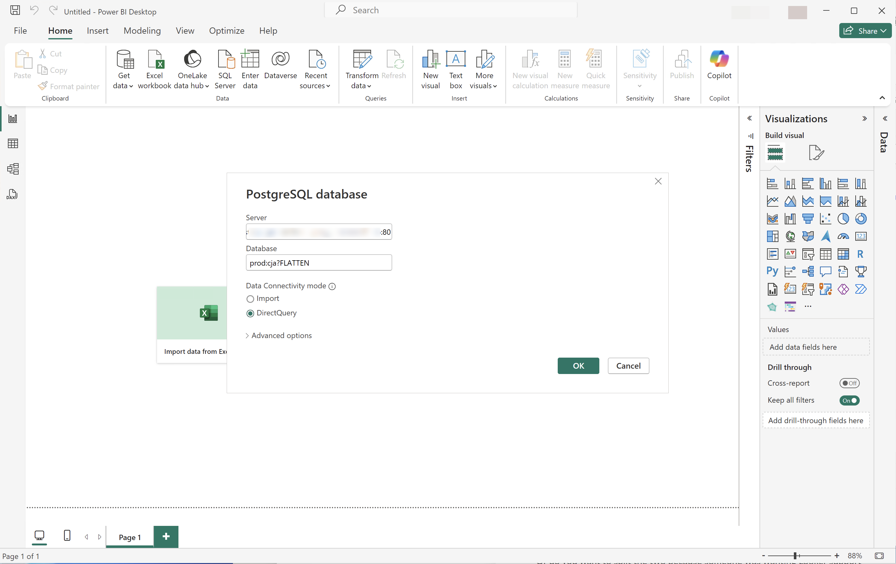
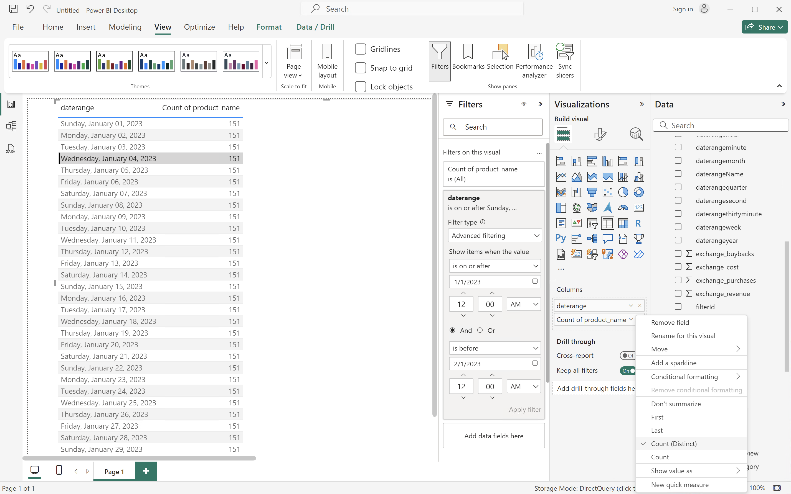
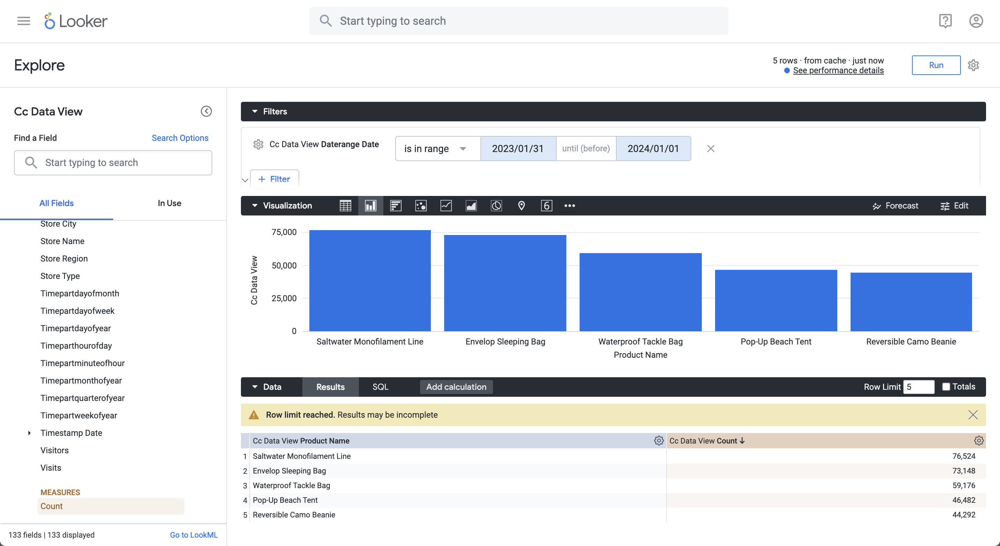
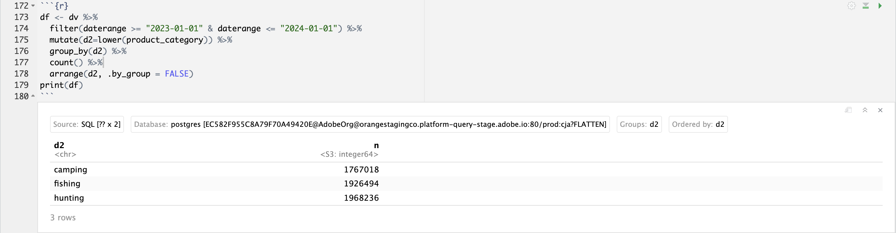
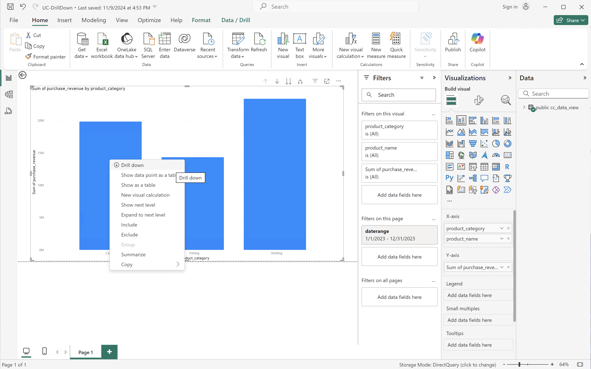

# Cas d’utilisation de l’extension BI

Cet article explique comment accomplir un certain nombre de cas d’utilisation à l’aide de l’extension Customer Journey Analytics BI. Chaque cas d’utilisation décrit la fonctionnalité de Customer Journey Analytics, suivi de détails pour chacun des outils de BI pris en charge :

* **Bureau Power BI**. La version utilisée est 2.137.1102.0 64 bits (octobre 2024).
* **Tableau Desktop**. La version utilisée est la version 2024.1.5 (20241.24.0705.0334) 64 bits.
* **Looker**. Version en ligne 25.0.23, disponible via [looker.com](https://looker.com){target="_blank"}
* **Notebook Jupyter**. La version utilisée est la version 7.3.2.
* **RStudio** La version utilisée est 2024.12.0, build 467.

Les cas d’utilisation suivants sont documentés :

* **Connexion**
   * [Connecter et répertorier les vues de données](#connect-and-validate)

* **Rapport et analyse**
   * [Tendance quotidienne](#daily-trend)
   * [Tendance horaire](#hourly-trend)
   * [Tendance mensuelle](#monthly-trend)
   * [Classement sur une seule dimension](#single-dimension-ranked)
   * [Classement de plusieurs dimensions](#multiple-dimension-ranked)
   * [Compter les valeurs de dimension distinctes](#count-distinct-dimension-values)
   * [Utilisation de noms de périodes pour le filtrage](#use-date-range-names-to-filter)
   * [Utiliser les noms de filtre pour le filtrage](#use-filter-names-to-filter)
   * [Utilisation des valeurs de dimension pour le filtrage](#use-dimension-values-to-filter)
   * [Tri](#sort)
   * [Limites](#limits)

* **Comprendre**

   * [Transformations](#transformations)
   * [Visualisations](#visualizations)
   * [Avertissements](#caveats)

Le cas d’utilisation **connect** se concentre sur la connexion des outils BI à l’aide de l’extension Customer Journey Analytics BI.

Les cas d’utilisation **rapport et analyse** expliquent comment réaliser des visualisations Customer Journey Analytics similaires dans les outils de BI actuellement pris en charge.

Les cas d’utilisation **comprendre** fournissent plus de détails sur les éléments suivants :

* Transformations qui se produisent lorsque vous utilisez des outils BI pour créer des rapports et des analyses.
* Similitudes et différences de visualisation entre les outils Customer Journey Analytics et BI.
* Avertissements relatifs à chacun des outils de BI dont vous devez tenir compte.


## Connexion et validation

Ce cas d’utilisation configure la connexion de l’outil BI à Customer Journey Analytics, répertorie les vues de données disponibles et sélectionne une vue de données à utiliser.

+++ Customer Journey Analytics

Les instructions se rapportent à un exemple d’environnement avec les objets suivants :

* Vue de données : **[!UICONTROL C&amp;C - Vue de données]** ??.
* Dimensions : **[!UICONTROL Nom du produit]** ?? et **[!UICONTROL Catégorie de produit]** ??.
* Mesures : **[!UICONTROL Chiffre d’affaires d’achat]** ?? et **[!UICONTROL Achats]** ??.
* Filtre : **[!UICONTROL Produits de la pêche]** ??.

{zoomable="yes"}

Lorsque vous parcourez les cas d’utilisation, remplacez ces exemples d’objets par des objets appropriés à votre environnement spécifique.

+++

+++ Outils BI

>[!BEGINTABS]

>[!TAB Bureau Power BI]

1. Accédez aux informations d’identification et aux paramètres requis à partir de l’interface utilisateur d’Experience Platform Query Service.

   1. Accédez à votre sandbox Experience Platform.
   1. Sélectionnez  **[!UICONTROL Requêtes]** dans le rail de gauche.
   1. Sélectionnez l’onglet **[!UICONTROL Informations d’identification]** dans l’interface **[!UICONTROL Requêtes]**.
   1. Sélectionnez `prod:cja` dans le menu déroulant **[!UICONTROL Base de données]**.

      {zoomable="yes"}

1. Démarrez Power BI Desktop.
   1. Dans l’interface principale, sélectionnez **[!UICONTROL Obtenir des données à partir d’autres sources]**.
   1. Dans la boîte de dialogue **[!UICONTROL Obtenir des données]** :
      {zoomable="yes"}
      1. Recherchez et sélectionnez **[!UICONTROL Base de données PostgreSQL]**.
      1. Sélectionnez **[!UICONTROL Connexion]**.
   1. Dans la boîte de dialogue **[!UICONTROL Base de données PostgreSQL]** :
      {zoomable="yes"}
      1. Utilisez  pour copier et coller les valeurs **[!UICONTROL Hôte]** et **[!UICONTROL Port]** à partir du panneau Experience Platform **[!UICONTROL Requête]** **[!UICONTROL Informations d’identification arrivant à expiration]**, séparées par `:` comme valeur de **[!UICONTROL Server]**. Par exemple : `examplecompany.platform-query.adobe.io:80`.
      1. Utilisez  pour copier et coller la valeur **[!UICONTROL Base de données]** à partir du panneau Experience Platform **[!UICONTROL Requête]** **[!UICONTROL Informations d’identification arrivant à expiration]**. Ajoutez `?FLATTEN` à la valeur que vous collez. Par exemple : `prod:cja?FLATTEN`.
      1. Sélectionnez **[!UICONTROL DirectQuery]** comme **[!UICONTROL mode de connectivité des données]**.
      1. Sélectionnez **[!UICONTROL OK]**.
   1. Dans la boîte de dialogue **[!UICONTROL Base de données PostgreSQL]** - **[!UICONTROL Base de données]** :
      {zoomable="yes"}
      1. Utilisez  pour copier les valeurs **[!UICONTROL Nom d’utilisateur]** et **[!UICONTROL Mot de passe]** à partir du panneau Experience Platform **[!UICONTROL Requête]** **[!UICONTROL Informations d’identification arrivant à expiration]** dans les champs **[!UICONTROL Nom d’utilisateur]** et **[!UICONTROL Mot de passe]**. Si vous utilisez des informations d’identification [ non expirantes](https://experienceleague.adobe.com/en/docs/experience-platform/query/ui/credentials?lang=en#use-credential-to-connect), utilisez le mot de passe correspondant.
      1. Assurez-vous que le menu déroulant **[!UICONTROL Sélectionner le niveau auquel appliquer ces paramètres]** est défini sur le **[!UICONTROL Serveur]** que vous avez défini précédemment.
      1. Sélectionnez **[!UICONTROL Connexion]**.
   1. Dans la boîte de dialogue **[!UICONTROL Navigateur]**, les vues de données sont récupérées. Cette récupération peut prendre un certain temps. Une fois la récupération effectuée, les éléments suivants s’affichent dans Power BI Desktop.
      {zoomable="yes"}
      1. Sélectionnez **[!UICONTROL public.cc_data_view]** dans la liste du panneau de gauche.
      1. Vous disposez de deux options :
         1. Sélectionnez **[!UICONTROL Charger]** pour continuer et terminer la configuration.
         1. Sélectionnez **[!UICONTROL Transformer les données]**. Une boîte de dialogue s’affiche, dans laquelle vous pouvez éventuellement appliquer des transformations dans le cadre de la configuration.
            {zoomable="yes"}
            * Sélectionnez **[!UICONTROL Fermer et appliquer]**.
   1. Au bout d’un certain temps, **[!UICONTROL public.cc_data_view]** s’affiche dans le volet **[!UICONTROL Data]**. Sélectionnez  pour afficher les dimensions et les mesures.
      {zoomable="yes"}


### A APLATIR ou non

Power BI Desktop prend en charge les scénarios suivants pour le paramètre `FLATTEN`. Voir [Aplatir les données imbriquées](https://experienceleague.adobe.com/en/docs/experience-platform/query/key-concepts/flatten-nested-data) pour plus d’informations.

| Paramètre FLATTEN | Exemple | Pris en charge | Remarques |
|---|---|:---:|---|
| Aucun | `prod:cja` |  | |
| `?FLATTEN` | `prod:cja?FLATTEN` |  | **Option recommandée à utiliser !** |
| `%3FFLATTEN` | `prod:cja%3FFLATTEN` |  | Le Bureau Power BI affiche l’erreur suivante : **[!UICONTROL Nous n’avons pas pu nous authentifier à l’aide des informations d’identification fournies. Veuillez réessayer.]** |

### Informations supplémentaires

* [Conditions préalables](/help/data-views/bi-extension.md#prerequisites)
* [Guide d’identification](https://experienceleague.adobe.com/en/docs/experience-platform/query/ui/credentials)
* [Connexion de Power BI à Query Service](https://experienceleague.adobe.com/en/docs/experience-platform/query/clients/power-bi).


>[!TAB  Tableau Desktop ]

1. Accédez aux informations d’identification et aux paramètres requis à partir de l’interface utilisateur d’Experience Platform Query Service.

   1. Accédez à votre sandbox Experience Platform.
   1. Sélectionnez  **[!UICONTROL Requêtes]** dans le rail de gauche.
   1. Sélectionnez l’onglet **[!UICONTROL Informations d’identification]** dans l’interface **[!UICONTROL Requêtes]**.
   1. Sélectionnez `prod:cja` dans le menu déroulant **[!UICONTROL Base de données]**.

      {zoomable="yes"}

1. Démarrez Tableau.
   1. Sélectionnez **[!UICONTROL PostgreSQL]** dans le rail de gauche sous **[!UICONTROL Vers un serveur]**. Si elle n’est pas disponible, sélectionnez **[!UICONTROL Plus...]** et sélectionnez **[!UICONTROL PostgreSQL]** dans la **[!UICONTROL Connecteurs installés]**.
      {zoomable="yes"}
   1. Dans la boîte de dialogue **[!UICONTROL PostgreSQL]**, dans l’onglet **[!UICONTROL Général]** :
      {zoomable="yes"}
      1. Utilisez  pour copier et coller le **[!UICONTROL Hôte]** du panneau **[!UICONTROL Requête]** **[!UICONTROL Informations d’identification arrivant à expiration]** d’Experience Platform vers le **[!UICONTROL Serveur]**.
      1. Utilisez  pour copier et coller le **[!UICONTROL Port]** depuis le panneau Experience Platform **[!UICONTROL Requête]** **[!UICONTROL Informations d’identification arrivant à expiration]** vers le **[!UICONTROL Port]**.
      1. Utilisez  pour copier et coller la **[!UICONTROL Base de données]** du panneau **[!UICONTROL Requête]** **[!UICONTROL Informations d’identification arrivant à expiration]** d’Experience Platform vers la **[!UICONTROL Base de données]**. Ajoutez `%3FFLATTEN` à la valeur que vous collez. Par exemple : `prod:cja%3FFLATTEN`.
      1. Sélectionnez **[!UICONTROL Nom d’utilisateur et mot de passe]** dans le menu déroulant **[!UICONTROL Authentification]**.
      1. Utilisez  pour copier et coller le **[!UICONTROL Nom d’utilisateur]** du panneau **[!UICONTROL Requête]** **[!UICONTROL Informations d’identification arrivant à expiration]** d’Experience Platform dans le **[!UICONTROL Nom d’utilisateur]**.
      1. Utilisez  pour copier et coller le **[!UICONTROL Mot de passe]** du panneau Experience Platform **[!UICONTROL Requête]** **[!UICONTROL Informations d’identification arrivant à expiration]** dans le **[!UICONTROL Mot de passe]**. Si vous utilisez des informations d’identification [ non expirantes](https://experienceleague.adobe.com/en/docs/experience-platform/query/ui/credentials?lang=en#use-credential-to-connect), utilisez le mot de passe correspondant.
      1. Assurez-vous que la case **[!UICONTROL Exiger SSL]** est cochée.
      1. Sélectionnez **[!UICONTROL Se connecter]**.

      Une boîte de dialogue **[!UICONTROL Progression de la demande]** s&#39;affiche alors que Tableau Desktop valide la connexion.
   1. Dans la fenêtre principale, comme dans la page **[!UICONTROL Source de données]**, dans le volet de gauche :
      * Nom de la connexion, sous **[!UICONTROL Connexions]**.
      * Nom de la base de données, sous **[!UICONTROL Base de données]**.
      * Liste des tableaux, sous **[!UICONTROL Tableau]**.
        {zoomable="yes"}
      1. Faites glisser l’entrée **[!UICONTROL cc_data_view]** et déposez-la sur la vue principale qui indique **[!UICONTROL Faire glisser des tableaux]** ici.
   1. La fenêtre principale affiche les détails de la vue de données **[!UICONTROL cc_data_view]**.
      {zoomable="yes"}

### A APLATIR ou non

Tableau Desktop prend en charge les scénarios suivants pour le paramètre `FLATTEN`. Voir [Aplatir les données imbriquées](https://experienceleague.adobe.com/en/docs/experience-platform/query/key-concepts/flatten-nested-data) pour plus d’informations.

| Paramètre FLATTEN | Exemple | Pris en charge | Remarques |
|---|---|:---:|---|
| Aucun | `prod:cja` |  | |
| `?FLATTEN` | `prod:cja?FLATTEN` |  | |
| `%3FFLATTEN` | `prod:cja%3FFLATTEN` |  | **Option recommandée**. Notez que `%3FFLATTEN` est la version codée URL de `?FLATTEN`. |

### Informations supplémentaires

* [Conditions préalables](/help/data-views/bi-extension.md#prerequisites)
* [Guide d’identification](https://experienceleague.adobe.com/en/docs/experience-platform/query/ui/credentials)
* [Connexion de Tableau Desktop à Query Service](https://experienceleague.adobe.com/en/docs/experience-platform/query/clients/tableau).


>[!TAB Looker]

1. Accédez aux informations d’identification et aux paramètres requis à partir de l’interface utilisateur d’Experience Platform Query Service.

   1. Accédez à votre sandbox Experience Platform.
   1. Sélectionnez  **[!UICONTROL Requêtes]** dans le rail de gauche.
   1. Sélectionnez l’onglet **[!UICONTROL Informations d’identification]** dans l’interface **[!UICONTROL Requêtes]**.
   1. Sélectionnez `prod:cja` dans le menu déroulant **[!UICONTROL Base de données]**.

      {zoomable="yes"}

1. Connexion à Looker

   1. Sélectionnez **[!UICONTROL Admin]** dans le rail de gauche.
   1. Sélectionnez **[!UICONTROL Connexions]**.
   1. Sélectionnez **[!UICONTROL Ajouter une connexion]**.
   1. Dans l’écran **[!UICONTROL Connexion de la base de données à l’outil de recherche]**.

      {zoomable="yes"}

      1. Saisissez un **[!UICONTROL Nom]** pour votre connexion, par exemple `Example Looker Connection`.
      1. Assurez-vous que **[!UICONTROL Tous les projets]** est sélectionné comme **[!UICONTROL Portée de la connexion]**.
      1. Sélectionnez **[!UICONTROL PostgreSQL 9.5+]** comme dialecte.
      1. Utilisez  pour copier et coller la valeur **[!UICONTROL Hôte]** du panneau Experience Platform **[!UICONTROL Requête]** **[!UICONTROL Informations d’identification arrivant à expiration]** en tant que valeur de **[!UICONTROL Hôte]**. Par exemple : `examplecompany.platform-query.adobe.io`.
      1. Utilisez  pour copier et coller la valeur **[!UICONTROL Port]** du panneau Experience Platform **[!UICONTROL Requête]** **[!UICONTROL Informations d’identification arrivant à expiration]** en tant que valeur de **[!UICONTROL Port]**. Par exemple : `80`.
      1. Utilisez  pour copier et coller la valeur **[!UICONTROL Base de données]** du panneau **[!UICONTROL Requête]** **[!UICONTROL Informations d’identification arrivant à expiration]** d’Experience Platform en tant que valeur de **[!UICONTROL Base de données]**. Ajoutez `%3FFLATTEN` à la valeur que vous collez. Par exemple : `prod:cja%3FFLATTEN`.
      1. Utilisez  pour copier et coller la valeur **[!UICONTROL Nom d’utilisateur]** du panneau Experience Platform **[!UICONTROL Requête]** **[!UICONTROL Informations d’identification arrivant à expiration]** en tant que valeur de **[!UICONTROL Nom d’utilisateur]**.
      1. Utilisez  pour copier et coller la valeur **[!UICONTROL Mot de passe]** du panneau Experience Platform **[!UICONTROL Requête]** **[!UICONTROL Informations d’identification arrivant à expiration]** en tant que valeur de **[!UICONTROL Mot de passe]**.
      1. Sélectionnez **[!UICONTROL Développer tout]** dans **[!UICONTROL Paramètres facultatifs]**.
      1. Définissez **[!UICONTROL Connexions max]** par nœud sur `5`.
      1. Assurez-vous que **[!UICONTROL SSL]** est activé.
      1. Sélectionnez **[!UICONTROL Tester]** pour tester la connexion. Une bannière devrait s’afficher en haut de l’écran avec un message comme **[!UICONTROL Succès, peut connecter JDBC ...]**.
      1. Sélectionnez **[!UICONTROL Connexion]** pour établir et enregistrer la connexion.
   1. La nouvelle connexion s’affiche dans l’interface **[!UICONTROL Connexions]**.
   1. Sélectionnez **←** dans **[!UICONTROL Admin]** pour accéder à la navigation principale dans le rail de gauche.
   1. Sélectionnez **[!UICONTROL Développer]**.
   1. Sélectionnez **[!UICONTROL Projets]**.
   1. Sélectionnez **[!UICONTROL Nouveau modèle]** dans les projets LookML.
   1. Pour vous assurer que vous n’affectez pas d’autres utilisateurs. Sélectionnez Activer le mode de développement lorsque vous y êtes invité.
   1. Dans l’expérience **[!UICONTROL Créer un modèle]** :
      1. Dans **[!UICONTROL ➊ Sélectionnez Connexion À La Base De Données]** :
         1. Sélectionnez votre connexion à la base de données dans **[!UICONTROL Sélectionner la connexion à la base de données]**. Par exemple : **[!UICONTROL exemple_recherche_connexion]**.
         1. Nommez votre projet dans **[!UICONTROL Créez un projet LookML pour ce modèle]**. Par `example: example_looker_project`.
         1. Sélectionnez **[!UICONTROL Suivant]**.
      1. Dans **[!UICONTROL ➋ Sélectionnez Tables]** :
         1. Sélectionnez **[!UICONTROL public]** puis assurez-vous que la vue de données Customer Journey Analytics est sélectionnée. Par exemple :  **[!UICONTROL cc_data_view]**.
         1. Sélectionnez **[!UICONTROL Suivant]**.
      1. Dans **[!UICONTROL ➌ Sélectionnez Clés de Principal]** :
         1. Sélectionnez **[!UICONTROL Suivant]**.
      1. Dans **[!UICONTROL ➍ sélectionnez Explorations à créer]** :
         1. Veillez à sélectionner votre vue. Par exemple : **[!UICONTROL cc_data_view.view]**.
         1. Sélectionnez **[!UICONTROL Suivant]**.
      1. Dans **[!UICONTROL ➎ Saisissez Le Nom Du Modèle]** :
         1. Nommez votre modèle. Par exemple : `example_looker_model`.
      1. Sélectionnez **[!UICONTROL Terminer et Explorer les données]**.

   Vous êtes redirigé vers l’interface **[!UICONTROL Explorer]** de l’outil de recherche, prête à explorer les données.


### A APLATIR ou non

Looker prend en charge les scénarios suivants pour le paramètre `FLATTEN`. Voir [Aplatir les données imbriquées](https://experienceleague.adobe.com/en/docs/experience-platform/query/key-concepts/flatten-nested-data) pour plus d’informations.

| Paramètre FLATTEN | Exemple | Pris en charge | Remarques |
|---|---|:---:|---|
| Aucun | `prod:cja` |  | |
| `?FLATTEN` | `prod:cja?FLATTEN` |  | |
| `%3FFLATTEN` | `prod:cja%3FFLATTEN` |  | **Option recommandée**. Notez que `%3FFLATTEN` est la version codée URL de `?FLATTEN`. |

### Informations supplémentaires

* [Conditions préalables](/help/data-views/bi-extension.md#prerequisites)
* [Guide d’identification](https://experienceleague.adobe.com/en/docs/experience-platform/query/ui/credentials)


>[!TAB Notebook Jupyter]

1. Accédez aux informations d’identification et aux paramètres requis à partir de l’interface utilisateur d’Experience Platform Query Service.

   1. Accédez à votre sandbox Experience Platform.
   1. Sélectionnez  **[!UICONTROL Requêtes]** dans le rail de gauche.
   1. Sélectionnez l’onglet **[!UICONTROL Informations d’identification]** dans l’interface **[!UICONTROL Requêtes]**.
   1. Sélectionnez `prod:cja` dans le menu déroulant **[!UICONTROL Base de données]**.

      {zoomable="yes"}

1. Assurez-vous d’avoir configuré un environnement virtuel Python dédié pour exécuter votre environnement Jupyter Notebook.
1. Vérifiez que vous avez installé les bibliothèques requises dans votre environnement virtuel :
   * ipython-sql : `pip install ipython-sql`.
   * psycopg2-binary : `pip install psycopg-binary`.
   * sqlalchemy : pip `install sqlalchemy`.

1. Démarrez Jupyter Notebook à partir de votre environnement virtuel : `jupyter notebook`.
1. Créez un nouveau notebook ou téléchargez [cet exemple de notebook](assets/BI-Extension.ipynb.zip).
1. Dans la première cellule, saisissez et exécutez :

   ```
   %config SqlMagic.style = '_DEPRECATED_DEFAULT'
   ```

1. Dans une nouvelle cellule, saisissez les paramètres de configuration de votre connexion. Utilisez  pour copier et coller les valeurs du panneau Experience Platform **[!UICONTROL Requête]** **[!UICONTROL Informations d’identification arrivant à expiration]** dans les valeurs requises pour les paramètres de configuration. Par exemple :

   ```
   import ipywidgets as widgets
   from IPython.display import display
   
   config_host = widgets.Text(description='Host:', value='example.platform-query-stage.adobe.io',
                           layout=widgets.Layout(width="600px"))
   display(config_host)
   config_port = widgets.IntText(description='Port:', value=80,
                              layout=widgets.Layout(width="200px"))
   display(config_port)
   config_db = widgets.Text(description='Database:', value='prod:cja',
                         layout=widgets.Layout(width="300px"))
   display(config_db)
   config_username = widgets.Text(description='Username:', value='EC582F955C8A79F70A49420E@AdobeOrg',
                               layout=widgets.Layout(width="600px"))
   display(config_username)
   config_password = widgets.Password(description='Password:', value='***',
                                   layout=widgets.Layout(width="600px"))
   display(config_password)
   ```

1. Exécutez la cellule.
1. Utilisez  pour copier et coller le mot de passe du panneau Experience Platform **[!UICONTROL Requête]** **[!UICONTROL Informations d’identification arrivant à expiration]** dans le champ **[!UICONTROL Mot de passe]** du notebook Jupyter.

   

1. Dans une nouvelle cellule, saisissez les instructions pour charger l’extension SQL, la bibliothèque requise et vous connecter à Customer Journey Analytics.

   ```python
   %load_ext sql
   from sqlalchemy import create_engine
   %sql postgresql://{config_username.value}:{config_password.value}@{config_host.value}:{config_port.value}/{config_db.value}?sslmode=require
   ```

   Exécutez le shell. Vous ne devriez pas voir de sortie mais la cellule devrait s&#39;exécuter sans avertissement.

   

1. Dans un nouvel appel, saisissez les instructions pour obtenir une liste des vues de données disponibles en fonction de la connexion.

   ```python
   %%sql
   SELECT n.nspname as "Schema",
      c.relname as "Name",
      CASE c.relkind WHEN 'r' THEN 'table' WHEN 'v' THEN 'view' WHEN 'm' THEN 'materialized view' WHEN 'i' THEN 'index' WHEN 'S' THEN 'sequence' WHEN 's' THEN 'special' WHEN 't' THEN 'TOAST table' WHEN 'f' THEN 'foreign table' WHEN 'p' THEN 'partitioned table' WHEN 'I' THEN 'partitioned index' END as "Type",
      pg_catalog.pg_get_userbyid(c.relowner) as "Owner"
   FROM pg_catalog.pg_class c
   LEFT JOIN pg_catalog.pg_namespace n ON n.oid = c.relnamespace
   WHERE c.relkind IN ('v','')
      AND n.nspname <> 'pg_catalog'
      AND n.nspname !~ '^pg_toast'
      AND n.nspname <> 'information_schema'
      AND pg_catalog.pg_table_is_visible(c.oid)
      AND c.relname NOT LIKE '%test%'
      AND c.relname NOT LIKE '%ajo%'
   ORDER BY 1,2;
   ```

   Exécutez le shell. Vous devriez voir une sortie similaire à la capture d’écran ci-dessous.

   

   Vous devriez voir la **[!UICONTROL cc_data_view]** dans la liste des vues de données.

### A APLATIR ou non

Le notebook Jupyter prend en charge les scénarios suivants pour le paramètre `FLATTEN`. Voir [Aplatir les données imbriquées](https://experienceleague.adobe.com/en/docs/experience-platform/query/key-concepts/flatten-nested-data) pour plus d’informations.

| Paramètre FLATTEN | Exemple | Pris en charge | Remarques |
|---|---|:---:|---|
| Aucun | `prod:cja` |  | |
| `?FLATTEN` | `prod:cja?FLATTEN` |  | |
| `%3FFLATTEN` | `prod:cja%3FFLATTEN` |  | **Option recommandée**. Notez que `%3FFLATTEN` est la version codée URL de `?FLATTEN`. |

### Informations supplémentaires

* [Conditions préalables](/help/data-views/bi-extension.md#prerequisites)
* [Guide d’identification](https://experienceleague.adobe.com/en/docs/experience-platform/query/ui/credentials)

>[!TAB RStudio]

1. Accédez aux informations d’identification et aux paramètres requis à partir de l’interface utilisateur d’Experience Platform Query Service.

   1. Accédez à votre sandbox Experience Platform.
   1. Sélectionnez  **[!UICONTROL Requêtes]** dans le rail de gauche.
   1. Sélectionnez l’onglet **[!UICONTROL Informations d’identification]** dans l’interface **[!UICONTROL Requêtes]**.
   1. Sélectionnez `prod:cja` dans le menu déroulant **[!UICONTROL Base de données]**.

      {zoomable="yes"}

1. Démarrez RStudio.
1. Créez un nouveau fichier R Markdown ou téléchargez [cet exemple de fichier R Markdown](assets/BI-Extension.Rmd.zip).
1. Dans votre premier bloc, saisissez les instructions suivantes entre ` ```{r} ` et ` ``` `. Utilisez  pour copier et coller des valeurs du panneau Experience Platform **[!UICONTROL Requête]** **[!UICONTROL Informations d’identification arrivant à expiration]** dans les valeurs requises pour les différents paramètres, tels que `host`, `dbname` et `user`. Par exemple :

   ```R
   library(rstudioapi)
   library(DBI)
   library(dplyr)
   library(tidyr)
   library(RPostgres)
   library(ggplot2)
   
   host <- rstudioapi::showPrompt(title = "Host", message = "Host", default = "orangestagingco.platform-query-stage.adobe.io")
   dbname <- rstudioapi::showPrompt(title = "Database", message = "Database", default = "prod:cja?FLATTEN")
   user <- rstudioapi::showPrompt(title = "Username", message = "Username", default = "EC582F955C8A79F70A49420E@AdobeOrg")
   password <- rstudioapi::askForPassword(prompt = "Password")
   ```

1. Exécutez le bloc. Vous êtes invité à indiquer **[!UICONTROL Hôte]**, **[!UICONTROL Base de données]** et **[!UICONTROL Utilisateur]**. Il vous suffit d’accepter les valeurs que vous avez fournies dans le cadre de l’étape précédente.
1. Utilisez  pour copier et coller le mot de passe du panneau Experience Platform **[!UICONTROL Requête]** **[!UICONTROL Informations d’identification arrivant à expiration]** dans l’invite de dialogue **[!UICONTROL Mot de passe]** de RStudio.

   

1. Créez un bloc et saisissez les instructions suivantes entre ` ``` {r} ` et ` ``` `.

   ```R
   con <- dbConnect(
      RPostgres::Postgres(),
      host = host,
      port = 80,
      dbname = dbname,
      user = user,
      password = password,
      sslmode = 'require'
   )
   ```

1. Exécutez le bloc. Vous ne devriez voir aucune sortie si la connexion est réussie.


1. Créez un bloc et saisissez les instructions suivantes entre ` ``` {r} ` et ` ``` `.

   ```R
   views <- dbListTables(con)
   print(views)
   ```

1. Exécutez le bloc. Vous devriez voir `character(0)` comme seule sortie.


1. Créez un bloc et saisissez les instructions suivantes entre ` ``` {r} ` et ` ``` `.

   ```R
   glimpse(dv)
   ```

1. Exécutez le bloc. Vous devriez voir une sortie similaire à la capture d’écran ci-dessous.

   

### A APLATIR ou non

RStudio prend en charge les scénarios suivants pour le paramètre `FLATTEN`. Voir [Aplatir les données imbriquées](https://experienceleague.adobe.com/en/docs/experience-platform/query/key-concepts/flatten-nested-data) pour plus d’informations.

| Paramètre FLATTEN | Exemple | Pris en charge | Remarques |
|---|---|:---:|---|
| Aucun | `prod:cja` |  | |
| `?FLATTEN` | `prod:cja?FLATTEN` |  | **Option recommandée**. |
| `%3FFLATTEN` | `prod:cja%3FFLATTEN` |  | |

### Informations supplémentaires

* [Conditions préalables](/help/data-views/bi-extension.md#prerequisites)
* [Guide d’identification](https://experienceleague.adobe.com/en/docs/experience-platform/query/ui/credentials)

>[!ENDTABS]

+++


## Tendance quotidienne

Dans ce cas d’utilisation, vous souhaitez afficher un tableau et une visualisation en ligne simple qui affiche une tendance quotidienne d’occurrences (événements) du 1er janvier 2023 au 31 janvier 2023.

+++ Customer Journey Analytics

Exemple de panneau **[!UICONTROL Tendance quotidienne]** pour le cas d’utilisation :

{zoomable="yes"}

+++

+++ Outils BI

>[!PREREQUISITES]
>
>Vérifiez que vous avez validé une [connexion réussie et que vous pouvez répertorier et utiliser les vues de données](#connect-and-validate) pour l’outil BI pour lequel vous souhaitez tester ce cas d’utilisation.
>

>[!BEGINTABS]

>[!TAB Bureau Power BI]

1. Dans le volet **[!UICONTROL Données]** :
   1. Sélectionnez **[!UICONTROL daterangeday]**.
   1. Sélectionnez **[!UICONTROL ∑ occurrences]**.

   Un tableau affiche les occurrences du mois en cours. Pour une meilleure visibilité, agrandissez la visualisation.

1. Dans le volet **[!UICONTROL Filtres]** :

   1. Sélectionnez le **[!UICONTROL daterangeday is (All)]** dans **[!UICONTROL Filtres sur ce visuel]**.
   1. Sélectionnez **[!UICONTROL Filtrage avancé]** comme **[!UICONTROL Type de filtre]**.
   1. Définissez le filtre pour **[!UICONTROL Afficher les éléments lorsque la valeur]** **[!UICONTROL est égale ou postérieure]** `1/1/2023` **[!UICONTROL Et]** **[!UICONTROL est antérieure]** `2/1/2023.` Vous pouvez utiliser l’icône de calendrier pour sélectionner des dates.
   1. Sélectionnez **[!UICONTROL Appliquer le filtre]**.

   Le tableau est mis à jour avec le filtre **[!UICONTROL daterangeday]** appliqué.

1. Dans le volet **[!UICONTROL Visualisations]**, sélectionnez la visualisation **[!UICONTROL Graphique en courbes]**.

   Un graphique en courbes remplace le tableau tout en utilisant les mêmes données que le tableau. Votre bureau Power BI doit se présenter comme suit :

   {zoomable="yes"}

1. Dans la visualisation sous forme de graphique en courbes :

   1. Sélectionnez .
   1. Dans le menu contextuel, sélectionnez **[!UICONTROL Afficher sous forme de tableau]**.

   La vue principale est mise à jour pour afficher à la fois une visualisation en ligne et un tableau. Votre bureau Power BI doit se présenter comme suit :

   {zoomable="yes"}

>[!TAB  Tableau Desktop ]

1. Sélectionnez l&#39;onglet **[!UICONTROL Feuille 1]** en bas pour passer de la vue **[!UICONTROL Source de données]**. Dans la vue **[!UICONTROL Feuille 1]** :
   1. Faites glisser l’entrée **[!UICONTROL Période]** de la liste **[!UICONTROL Tableaux]** dans le volet **[!UICONTROL Données]** et déposez-la sur l’étagère **[!UICONTROL Filtres]**.
   1. Dans la boîte de dialogue **[!UICONTROL Champ de filtre \[Période\]]**, sélectionnez **[!UICONTROL Période]** et sélectionnez **[!UICONTROL Suivant >]**.
   1. Dans la boîte de dialogue **[!UICONTROL Filtrer \[Période]]**, sélectionnez **[!UICONTROL Période]** et spécifiez une période de `01/01/2023` - `01/02/2023`.

      {zoomable="yes"}

   1. Effectuez un glisser-déposer de **[!UICONTROL Daterangeday]** depuis la liste **[!UICONTROL Tables]** dans le volet **[!UICONTROL Données]** et déposez l&#39;entrée dans le champ en regard de **[!UICONTROL Colonnes]**.
      * Sélectionnez **[!UICONTROL Jour]** dans le menu déroulant **[!UICONTROL Daterangeday]** afin que la valeur soit mise à jour sur **[!UICONTROL JOUR(Daterangeday)]**.
   1. Effectuez un glisser-déposer **[!UICONTROL Occurrences]** depuis la liste **[!UICONTROL Tableaux (*Noms des mesures*)]** dans le volet **[!UICONTROL Données]** et déposez l’entrée dans le champ en regard de **[!UICONTROL Lignes]**. La valeur est automatiquement convertie en **[!UICONTROL SUM(Occurrences)]**.
   1. Modifiez **[!UICONTROL Standard]** en **[!UICONTROL Vue entière]** dans le menu déroulant **[!UICONTROL Ajuster]** de la barre d’outils.

      Votre Tableau Desktop devrait ressembler à ce qui suit.

      {zoomable="yes"}

1. Sélectionnez **[!UICONTROL Dupliquer]** dans le menu contextuel de l’onglet **[!UICONTROL Feuille 1]** pour créer une deuxième feuille.
1. Sélectionnez **[!UICONTROL Renommer]** dans le menu contextuel de l’onglet **[!UICONTROL Feuille 1]** pour renommer la feuille en `Graph`.
1. Sélectionnez **[!UICONTROL Renommer]** dans le menu contextuel de l&#39;onglet **[!UICONTROL Feuille 1 (2)]** pour renommer la feuille en `Data`.
1. Assurez-vous que la feuille **[!UICONTROL Data]** est sélectionnée. Dans la vue **[!UICONTROL Data]** :
   1. Sélectionnez **[!UICONTROL Afficher]** en haut à droite, puis sélectionnez **[!UICONTROL Tableau de texte]** (visualisation en haut à gauche) pour modifier le contenu de la vue de données en tableau.
   1. Sélectionnez **[!UICONTROL Permuter les lignes et les colonnes]** dans la barre d’outils.
   1. Modifiez **[!UICONTROL Standard]** en **[!UICONTROL Vue entière]** dans le menu déroulant **[!UICONTROL Ajuster]** de la barre d’outils.

      Votre Tableau Desktop devrait ressembler à ce qui suit.

      {zoomable="yes"}

1. Sélectionnez le bouton d’onglet **[!UICONTROL Nouveau tableau de bord]** (en bas) pour créer une vue **[!UICONTROL Tableau de bord 1]**. Dans la vue **[!UICONTROL Tableau de bord 1]** :
   1. Faites glisser et déposez la feuille **[!UICONTROL Graph]** de l’étagère **[!UICONTROL Feuilles]** sur la vue **[!UICONTROL Tableau de bord 1]** qui indique *Déposez les feuilles ici*.
   1. Faites glisser et déposez la feuille **[!UICONTROL Données]** de l’étagère **[!UICONTROL Feuilles]** sous la feuille **[!UICONTROL Graphique]** vers la vue **[!UICONTROL Tableau de bord 1]**.
   1. Sélectionnez la feuille **[!UICONTROL Données]** dans la vue et modifiez **[!UICONTROL Vue entière]** en **[!UICONTROL Fixe largeur]**.

      Votre Tableau Desktop devrait ressembler à ce qui suit.

      {zoomable="yes"}


>[!TAB Looker]

1. Dans l’interface **[!UICONTROL Explorer]** de Looker, assurez-vous que vous disposez d’une configuration propre. Sinon, sélectionnez  **[!UICONTROL Supprimer les champs et les filtres]**.
1. Sélectionnez **[!UICONTROL + filtre]** sous **[!UICONTROL filtres]**.
1. Dans la boîte de dialogue **[!UICONTROL Ajouter un filtre]** :
   1. Sélectionnez **[!UICONTROL ‣ Cc Vue De Données]**
   1. Dans la liste des champs, sélectionnez **[!UICONTROL Date de période]** puis **[!UICONTROL Date de période]**.
      {zoomable="yes"}
1. Spécifiez le filtre **[!UICONTROL Date de plage de dates de la vue de données Cc]** tel que **[!UICONTROL est dans la plage]** **[!UICONTROL 2023/01/01]** **[!UICONTROL jusqu’au (avant)]** **[!UICONTROL 2023/02/01]**.
1. Dans la section **[!UICONTROL Vue de données Cc]** du rail de gauche,
   1. Sélectionnez **[!UICONTROL ‣ Daterange Date]**, puis **[!UICONTROL Date]** dans la liste des **[!UICONTROL DIMENSIONS]**.
   1. Sélectionnez **[!UICONTROL Nombre]** sous **[!UICONTROL MESURES]** dans le rail de gauche (en bas).
1. Sélectionnez **[!UICONTROL Exécuter]**.
1. Sélectionnez **[!UICONTROL ‣ Visualisation]** pour afficher la visualisation Ligne.

Vous devriez voir une visualisation et un tableau similaires à ceux présentés ci-dessous.

{zoomable="yes"}


>[!TAB Notebook Jupyter]

1. Saisissez les instructions suivantes dans une nouvelle cellule.

   ```python
   import seaborn as sns
   import matplotlib.pyplot as plt
   data = %sql SELECT daterangeday AS Date, COUNT(*) AS Events \
             FROM cc_data_view \
             WHERE daterange BETWEEN '2023-01-01' AND '2023-02-01' \
             GROUP BY 1 \
             ORDER BY Date ASC
   df = data.DataFrame()
   df = df.groupby('Date', as_index=False).sum()
   plt.figure(figsize=(15, 3))
   sns.lineplot(x='Date', y='Events', data=df)
   plt.show()
   display(data)
   ```

1. Exécutez la cellule. Vous devriez voir une sortie similaire à la capture d’écran ci-dessous.

   


>[!TAB RStudio]

1. Saisissez les instructions suivantes entre ` ```{r} ` et ` ``` ` dans un nouveau bloc.

   ```R
   ## Daily Events
   df <- dv %>%
      filter(daterange >= "2023-01-01" & daterange < "2023-02-01") %>%
      group_by(daterangeday) %>%
      count() %>%
      arrange(daterangeday, .by_group = FALSE)
   ggplot(df, aes(x = daterangeday, y = n)) +
      geom_line(color = "#69b3a2") +
      ylab("Events") +
      xlab("Date")
   print(df)
   ```

1. Exécutez le bloc. Vous devriez voir une sortie similaire à la capture d’écran ci-dessous.

   

>[!ENDTABS]

+++


## Tendance horaire

Dans ce cas d’utilisation, vous souhaitez afficher un tableau et une visualisation en ligne simple qui affiche une tendance horaire des occurrences (événements) pour le 1er janvier 2023.

+++ Customer Journey Analytics

Exemple de panneau **[!UICONTROL Tendance horaire]** pour le cas d’utilisation :

{zoomable="yes"}

+++

+++ Outils BI

>[!PREREQUISITES]
>
>Vérifiez que vous avez validé [une connexion réussie, que vous pouvez répertorier les vues de données et utiliser une vue de données](#connect-and-validate) pour l’outil BI pour lequel vous souhaitez tester ce cas d’utilisation.
>

>[!BEGINTABS]

>[!TAB Bureau Power BI]

 Power BI ne comprend **pas** comment gérer les champs date-heure. Par conséquent, les dimensions telles que **[!UICONTROL daterangehour]** et **[!UICONTROL daterangeminute]** ne sont pas prises en charge.

>[!TAB  Tableau Desktop ]

1. Sélectionnez l’onglet **[!UICONTROL Feuille 1]** en bas pour basculer depuis **[!UICONTROL Source de données]**. Dans la vue **[!UICONTROL Feuille 1]** :
   1. Faites glisser l’entrée **[!UICONTROL Période]** de la liste **[!UICONTROL Tableaux]** dans le volet **[!UICONTROL Données]** et déposez-la sur l’étagère **[!UICONTROL Filtres]**.
   1. Dans la boîte de dialogue **[!UICONTROL Champ de filtre \[Période\]]**, sélectionnez **[!UICONTROL Période]** et sélectionnez **[!UICONTROL Suivant >]**.
   1. Dans la boîte de dialogue **[!UICONTROL Filtrer \[Période]]**, sélectionnez **[!UICONTROL Période]** et spécifiez une période de `01/01/2023` - `02/01/2023`.

      {zoomable="yes"}

   1. Effectuez un glisser-déposer de **[!UICONTROL Daterangehour]** depuis la liste **[!UICONTROL Tableaux]** dans le volet **[!UICONTROL Données]** et déposez l’entrée dans le champ en regard de **[!UICONTROL Colonnes]**.
      * Sélectionnez **[!UICONTROL Plus]** > **[!UICONTROL Heures]** dans le menu déroulant **[!UICONTROL Daterangeday]** afin que la valeur soit mise à jour sur **[!UICONTROL HEURE(Daterangeday)]**.
   1. Effectuez un glisser-déposer **[!UICONTROL Occurrences]** depuis la liste **[!UICONTROL Tableaux (*Noms des mesures*)]** dans le volet **[!UICONTROL Données]** et déposez l’entrée dans le champ en regard de **[!UICONTROL Lignes]**. La valeur est automatiquement convertie en **[!UICONTROL SUM(Occurrences)]**.
   1. Modifiez **[!UICONTROL Standard]** en **[!UICONTROL Vue entière]** dans le menu déroulant **[!UICONTROL Ajuster]** de la barre d’outils.

      Votre Tableau Desktop devrait ressembler à ce qui suit.

      {zoomable="yes"}

1. Sélectionnez **[!UICONTROL Dupliquer]** dans le menu contextuel de l’onglet **[!UICONTROL Feuille 1]** pour créer une deuxième feuille.
1. Sélectionnez **[!UICONTROL Renommer]** dans le menu contextuel de l’onglet **[!UICONTROL Feuille 1]** pour renommer la feuille en `Graph`.
1. Sélectionnez **[!UICONTROL Renommer]** dans le menu contextuel de l&#39;onglet **[!UICONTROL Feuille 1 (2)]** pour renommer la feuille en `Data`.
1. Assurez-vous que la feuille **[!UICONTROL Data]** est sélectionnée. Dans la vue **[!UICONTROL Data]** :
   1. Sélectionnez **[!UICONTROL Afficher]** en haut à droite, puis sélectionnez **[!UICONTROL Tableau de texte]** (visualisation en haut à gauche) pour modifier le contenu de la vue de données en tableau.
   1. Faites glisser **[!UICONTROL HOUR(Daterangeday)]** de **[!UICONTROL Columns]** vers **[!UICONTROL Rows]**.
   1. Modifiez **[!UICONTROL Standard]** en **[!UICONTROL Vue entière]** dans le menu déroulant **[!UICONTROL Ajuster]** de la barre d’outils.

      Votre Tableau Desktop devrait ressembler à ce qui suit.

      {zoomable="yes"}

1. Sélectionnez le bouton d’onglet **[!UICONTROL Nouveau tableau de bord]** (en bas) pour créer une vue **[!UICONTROL Tableau de bord 1]**. Dans la vue **[!UICONTROL Tableau de bord 1]** :
   1. Faites glisser et déposez la feuille **[!UICONTROL Graph]** de l’étagère **[!UICONTROL Feuilles]** sur la vue **[!UICONTROL Tableau de bord 1]** qui indique *Déposez les feuilles ici*.
   1. Faites glisser et déposez la feuille **[!UICONTROL Données]** de l’étagère **[!UICONTROL Feuilles]** sous la feuille **[!UICONTROL Graphique]** vers la vue **[!UICONTROL Tableau de bord 1]**.
   1. Sélectionnez la feuille **[!UICONTROL Données]** dans la vue et modifiez **[!UICONTROL Vue entière]** en **[!UICONTROL Fixe largeur]**.

      La vue de votre **[!UICONTROL Tableau de bord 1]** doit se présenter comme suit :

      {zoomable="yes"}


>[!TAB Looker]


1. Dans l’interface **[!UICONTROL Explorer]** de Looker, assurez-vous que vous disposez d’une configuration propre. Sinon, sélectionnez  **[!UICONTROL Supprimer les champs et les filtres]**.
1. Sélectionnez **[!UICONTROL + filtre]** sous **[!UICONTROL filtres]**.
1. Dans la boîte de dialogue **[!UICONTROL Ajouter un filtre]** :
   1. Sélectionnez **[!UICONTROL ‣ Cc Vue De Données]**
   1. Dans la liste des champs, sélectionnez **[!UICONTROL Date de période]** puis **[!UICONTROL Date de période]**.
      {zoomable="yes"}
1. Spécifiez le filtre **[!UICONTROL Date de plage de dates de la vue de données Cc]** tel que **[!UICONTROL est dans la plage]** **[!UICONTROL 2023/01/01]** **[!UICONTROL jusqu’au (avant)]** **[!UICONTROL 2023/01/02]**.
1. Dans la section **[!UICONTROL Vue de données Cc]** du rail de gauche,
   1. Sélectionnez **[!UICONTROL ‣ Date de l’heure du tableau de bord]** puis **[!UICONTROL Heure]** dans la liste des **[!UICONTROL DIMENSIONS]**.
   1. Sélectionnez **[!UICONTROL Nombre]** sous **[!UICONTROL MESURES]** dans le rail de gauche (en bas).
1. Sélectionnez **[!UICONTROL Exécuter]**.
1. Sélectionnez **[!UICONTROL ‣ Visualisation]** pour afficher la visualisation Ligne.

Vous devriez voir une visualisation et un tableau similaires à ceux présentés ci-dessous.

{zoomable="yes"}


>[!TAB Notebook Jupyter]

1. Saisissez les instructions suivantes dans une nouvelle cellule.

   ```python
   import seaborn as sns
   import matplotlib.pyplot as plt
   data = %sql SELECT daterangehour AS Hour, COUNT(*) AS Events \
               FROM cc_data_view \
               WHERE daterange BETWEEN '2023-01-01' AND '2023-01-02' \
               GROUP BY 1 \
                ORDER BY Hour ASC
   df = data.DataFrame()
   df = df.groupby('Hour', as_index=False).sum()
   plt.figure(figsize=(15, 3))
   sns.lineplot(x='Hour', y='Events', data=df)
   plt.show()
   display(data)
   ```

1. Exécutez la cellule. Vous devriez voir une sortie similaire à la capture d’écran ci-dessous.

   


>[!TAB RStudio]

1. Saisissez les instructions suivantes entre ` ```{r} ` et ` ``` ` dans un nouveau bloc.

   ```R
   ## Hourly Events
   df <- dv %>%
      filter(daterange >= "2023-01-01" & daterange < "2023-01-02") %>%
      group_by(daterangehour) %>%
      count() %>%
      arrange(daterangehour, .by_group = FALSE)
   ggplot(df, aes(x = daterangehour, y = n)) +
      geom_line(color = "#69b3a2") +
      ylab("Events") +
      xlab("Hour")
   print(df)
   ```

1. Exécutez le bloc. Vous devriez voir une sortie similaire à la capture d’écran ci-dessous.

   

>[!ENDTABS]

+++


## Tendance mensuelle

Dans ce cas d’utilisation, vous souhaitez afficher un tableau et une visualisation en ligne simple qui montre une tendance mensuelle d’occurrence (événements) pour 2023.

+++ Customer Journey Analytics

Exemple de panneau **[!UICONTROL Tendance mensuelle]** pour le cas d’utilisation :

{zoomable="yes"}

+++

+++ Outils BI

>[!PREREQUISITES]
>
>Vérifiez que vous avez validé [une connexion réussie, que vous pouvez répertorier les vues de données et utiliser une vue de données](#connect-and-validate) pour l’outil BI pour lequel vous souhaitez tester ce cas d’utilisation.
>

>[!BEGINTABS]

>[!TAB Bureau Power BI]

1. Dans le volet **[!UICONTROL Données]** :
   1. Sélectionnez **[!UICONTROL daterangemonth]**.
   1. Sélectionnez **[!UICONTROL ∑ occurrences]**.

   Un tableau affiche les occurrences du mois en cours. Pour une meilleure visibilité, agrandissez la visualisation.

1. Dans le volet **[!UICONTROL Filtres]** :

   1. Sélectionnez le **[!UICONTROL daterangemonth is (All)]** dans **[!UICONTROL Filtres sur ce visuel]**.
   1. Sélectionnez **[!UICONTROL Filtrage avancé]** comme **[!UICONTROL Type de filtre]**.
   1. Définissez le filtre pour **[!UICONTROL Afficher les éléments lorsque la valeur]** **[!UICONTROL est égale ou postérieure]** `1/1/2023` **[!UICONTROL Et]** **[!UICONTROL est antérieure]** `1/1/2024.` Vous pouvez utiliser l’icône de calendrier pour sélectionner des dates.
   1. Sélectionnez **[!UICONTROL Appliquer le filtre]**.

   Le tableau est mis à jour avec le filtre **[!UICONTROL daterangemonth]** appliqué.

1. Dans le volet **[!UICONTROL Visualisations]** :

   1. Sélectionnez la visualisation **[!UICONTROL Graphique en courbes]**.

   Un graphique en courbes remplace le tableau tout en utilisant les mêmes données que le tableau. Votre bureau Power BI doit se présenter comme suit :

   {zoomable="yes"}

1. Dans la visualisation sous forme de graphique en courbes :

   1. Sélectionnez .
   1. Dans le menu contextuel, sélectionnez **[!UICONTROL Afficher sous forme de tableau]**.

   La vue principale est mise à jour pour afficher à la fois une visualisation en ligne et un tableau. Votre bureau Power BI doit se présenter comme suit :

   {zoomable="yes"}

>[!TAB  Tableau Desktop ]

1. Sélectionnez l’onglet **[!UICONTROL Feuille 1]** en bas pour basculer depuis **[!UICONTROL Source de données]**. Dans la vue **[!UICONTROL Feuille 1]** :
   1. Faites glisser l’entrée **[!UICONTROL Période]** de la liste **[!UICONTROL Tableaux]** dans le volet **[!UICONTROL Données]** et déposez-la sur l’étagère **[!UICONTROL Filtres]**.
   1. Dans la boîte de dialogue **[!UICONTROL Champ de filtre \[Période\]]**, sélectionnez **[!UICONTROL Période]** et sélectionnez **[!UICONTROL Suivant >]**.
   1. Dans la boîte de dialogue **[!UICONTROL Filtrer \[Période]]**, sélectionnez **[!UICONTROL Période]** et spécifiez une période de `01/01/2023` - `01/01/2024`.

      {zoomable="yes"}

   1. Effectuez un glisser-déposer de **[!UICONTROL Daterangeday]** depuis la liste **[!UICONTROL Tables]** dans le volet **[!UICONTROL Données]** et déposez l&#39;entrée dans le champ en regard de **[!UICONTROL Colonnes]**.
      * Sélectionnez **[!UICONTROL MONTH]** dans le menu déroulant **[!UICONTROL Daterangeday]** afin que la valeur soit mise à jour sur **[!UICONTROL MONTH(Daterangeday)]**.
   1. Effectuez un glisser-déposer **[!UICONTROL Occurrences]** depuis la liste **[!UICONTROL Tableaux (*Noms des mesures*)]** dans le volet **[!UICONTROL Données]** et déposez l’entrée dans le champ en regard de **[!UICONTROL Lignes]**. La valeur est automatiquement convertie en **[!UICONTROL SUM(Occurrences)]**.
   1. Modifiez **[!UICONTROL Standard]** en **[!UICONTROL Vue entière]** dans le menu déroulant **[!UICONTROL Ajuster]** de la barre d’outils.

      Votre Tableau Desktop devrait ressembler à ce qui suit.

      {zoomable="yes"}

1. Sélectionnez **[!UICONTROL Dupliquer]** dans le menu contextuel de l’onglet **[!UICONTROL Feuille 1]** pour créer une deuxième feuille.
1. Sélectionnez **[!UICONTROL Renommer]** dans le menu contextuel de l’onglet **[!UICONTROL Feuille 1]** pour renommer la feuille en `Graph`.
1. Sélectionnez **[!UICONTROL Renommer]** dans le menu contextuel de l&#39;onglet **[!UICONTROL Feuille 1 (2)]** pour renommer la feuille en `Data`.
1. Assurez-vous que la feuille **[!UICONTROL Data]** est sélectionnée. Dans la vue de données :
   1. Sélectionnez **[!UICONTROL Afficher]** en haut à droite, puis sélectionnez **[!UICONTROL Tableau de texte]** (visualisation en haut à gauche) pour modifier le contenu de la vue de données en tableau.
   1. Faites glisser **[!UICONTROL MONTH(Daterangeday)]** de **[!UICONTROL Columns]** vers **[!UICONTROL Rows]**.
   1. Modifiez **[!UICONTROL Standard]** en **[!UICONTROL Vue entière]** dans le menu déroulant **[!UICONTROL Ajuster]** de la barre d’outils.

      Votre Tableau Desktop devrait ressembler à ce qui suit.

      {zoomable="yes"}

1. Sélectionnez le bouton d’onglet **[!UICONTROL Nouveau tableau de bord]** (en bas) pour créer une vue **[!UICONTROL Tableau de bord 1]**. Dans la vue **[!UICONTROL Tableau de bord 1]** :
   1. Faites glisser et déposez la feuille **[!UICONTROL Graph]** de l’étagère **[!UICONTROL Feuilles]** sur la vue **[!UICONTROL Tableau de bord 1]** qui indique *Déposez les feuilles ici*.
   1. Faites glisser et déposez la feuille **[!UICONTROL Données]** de l’étagère **[!UICONTROL Feuilles]** sous la feuille **[!UICONTROL Graphique]** vers la vue **[!UICONTROL Tableau de bord 1]**.
   1. Sélectionnez la feuille **[!UICONTROL Données]** dans la vue et modifiez **[!UICONTROL Vue entière]** en **[!UICONTROL Fixe largeur]**.

      Votre Tableau Desktop devrait ressembler à ce qui suit.

      {zoomable="yes"}


>[!TAB Looker]

1. Dans l’interface **[!UICONTROL Explorer]** de Looker, assurez-vous que vous disposez d’une configuration propre. Sinon, sélectionnez  **[!UICONTROL Supprimer les champs et les filtres]**.
1. Sélectionnez **[!UICONTROL + filtre]** sous **[!UICONTROL filtres]**.
1. Dans la boîte de dialogue **[!UICONTROL Ajouter un filtre]** :
   1. Sélectionnez **[!UICONTROL ‣ Cc Vue De Données]**
   1. Dans la liste des champs, sélectionnez **[!UICONTROL Date de période]** puis **[!UICONTROL Date de période]**.
      {zoomable="yes"}
1. Spécifiez le filtre **[!UICONTROL Date de plage de dates de la vue de données Cc]** tel que **[!UICONTROL est dans la plage]** **[!UICONTROL 2023/01/01]** **[!UICONTROL jusqu’au (avant)]** **[!UICONTROL 2024/01/01]**.
1. Sur le rail de gauche **[!UICONTROL Cc Data View]**,
   1. Sélectionnez **[!UICONTROL ‣ Date du mois de la date]** puis **[!UICONTROL Mois]** dans la liste **[!UICONTROL DIMENSIONS]**.
   1. Sélectionnez **[!UICONTROL Nombre]** sous **[!UICONTROL MESURES]** dans le rail de gauche (en bas).
1. Sélectionnez **[!UICONTROL Exécuter]**.
1. Sélectionnez **[!UICONTROL ‣ Visualisation]** pour afficher la visualisation Ligne.

Vous devriez voir une visualisation et un tableau similaires à ceux présentés ci-dessous.

{zoomable="yes"}


>[!TAB Notebook Jupyter]

1. Saisissez les instructions suivantes dans une nouvelle cellule.

   ```python
   import seaborn as sns
   import matplotlib.pyplot as plt
   data = %sql SELECT daterangemonth AS Month, COUNT(*) AS Events \
               FROM cc_data_view \
               WHERE daterange BETWEEN '2023-01-01' AND '2024-01-01' \
               GROUP BY 1 \
               ORDER BY Month ASC
   df = data.DataFrame()
   df = df.groupby('Month', as_index=False).sum()
   plt.figure(figsize=(15, 3))
   sns.lineplot(x='Month', y='Events', data=df)
   plt.show()
   display(data)
   ```

1. Exécutez la cellule. Vous devriez voir une sortie similaire à la capture d’écran ci-dessous.

   


>[!TAB RStudio]

1. Saisissez les instructions suivantes entre ` ```{r} ` et ` ``` ` dans un nouveau bloc.

   ```R
   ## Hourly Events
   df <- dv %>%
      filter(daterange >= "2023-01-01" & daterange < "2023-01-02") %>%
      group_by(daterangehour) %>%
      count() %>%
      arrange(daterangehour, .by_group = FALSE)
   ggplot(df, aes(x = daterangehour, y = n)) +
      geom_line(color = "#69b3a2") +
      ylab("Events") +
      xlab("Hour")
   print(df)
   ```

1. Exécutez le bloc. Vous devriez voir une sortie similaire à la capture d’écran ci-dessous.

   

>[!ENDTABS]

+++


## Classement sur une seule dimension

Dans ce cas d’utilisation, vous souhaitez afficher un tableau et une visualisation simple à barres qui montre les achats et le chiffre d’affaires des achats pour les noms de produits sur 2023.

+++ Customer Journey Analytics

Exemple de panneau **[!UICONTROL Classement sur un seul Dimension]** pour le cas d’utilisation :

{zoomable="yes"}
+++

+++ Outils BI

>[!PREREQUISITES]
>
>Vérifiez que vous avez validé [une connexion réussie, que vous pouvez répertorier les vues de données et utiliser une vue de données](#connect-and-validate) pour l’outil BI pour lequel vous souhaitez tester ce cas d’utilisation.
>

>[!BEGINTABS]

>[!TAB Bureau Power BI]

1. Dans le volet **[!UICONTROL Données]** :
   1. Sélectionnez **[!UICONTROL daterange]**.
   1. Sélectionnez **[!UICONTROL product_name]**.
   1. Sélectionnez **[!UICONTROL ∑ purchase_revenue]**.
   1. Sélectionnez **[!UICONTROL ∑ achats]**.

   Un tableau vide n’affiche que les en-têtes de colonne pour l’élément sélectionné. Pour une meilleure visibilité, agrandissez la visualisation.

1. Dans le volet **[!UICONTROL Filtres]** :

   1. Sélectionnez l’**[!UICONTROL daterange is (All)]** dans **[!UICONTROL Filtres sur ce visuel]**.
   1. Sélectionnez **[!UICONTROL Date relative]** comme **[!UICONTROL Type de filtre]**.
   1. Définissez le filtre pour **[!UICONTROL Afficher les éléments lorsque la valeur]** **[!UICONTROL se trouve dans les dernières]** `1` **[!UICONTROL années civiles]**.
   1. Sélectionnez **[!UICONTROL Appliquer le filtre]**.

   Le tableau est mis à jour avec le filtre **[!UICONTROL daterange]** appliqué.

1. Dans le volet **[!UICONTROL Visualisation]** :

   1. Utilisez  pour supprimer **[!UICONTROL daterange]** de **[!UICONTROL Columns]**.
   1. Effectuez un glisser-déposer **[!UICONTROL Somme des achats_revenus]** sous **[!UICONTROL Somme des achats]** dans **[!UICONTROL Colonnes]**.

1. Dans la visualisation Tableau :

   1. Sélectionnez **[!UICONTROL Somme des revenus_d’achat]** pour trier les noms de produit dans l’ordre de revenus d’achat décroissant. Votre bureau Power BI doit se présenter comme suit :

   {zoomable="yes"}

1. Dans le volet **[!UICONTROL Filtres]** :

   1. Sélectionnez **[!UICONTROL product_name is (All)]**.
   1. Définissez **[!UICONTROL Type de filtre]** sur **[!UICONTROL N en haut]**.
   1. Définissez le filtre sur **[!UICONTROL Afficher les éléments]** **[!UICONTROL En haut]** `10` **[!UICONTROL Par valeur]**.
   1. Effectuez un glisser-déposer de **[!UICONTROL purchase_revenue]** dans **[!UICONTROL Par valeur]** **[!UICONTROL Ajoutez des champs de données ici]**.
   1. Sélectionnez **[!UICONTROL Appliquer le filtre]**.

   Le tableau est mis à jour avec les valeurs des recettes d’achat en synchronisation avec la visualisation du tableau à structure libre dans Analysis Workspace.

1. Dans le volet **[!UICONTROL Visualisations]** :

   1. Sélectionnez la visualisation **[!UICONTROL Graphique en courbes et histogramme empilé]**.

   Une visualisation sous forme de graphiques en courbes et en colonnes empilées remplace le tableau tout en utilisant les mêmes données que le tableau.

1. Effectuez un glisser-déposer **[!UICONTROL achats]** sur **[!UICONTROL Axe Y de la ligne]** dans le volet **[!UICONTROL Visualisations]**.

   Le graphique en courbes et en colonnes empilées est mis à jour. Votre bureau Power BI doit se présenter comme suit :

   {zoomable="yes"}

1. Dans la visualisation sous forme de graphique en courbes et histogramme empilé :

   1. Sélectionnez .
   1. Dans le menu contextuel, sélectionnez **[!UICONTROL Afficher sous forme de tableau]**.

   La vue principale est mise à jour pour afficher à la fois une visualisation en ligne et un tableau.

   {zoomable="yes"}

>[!TAB  Tableau Desktop ]

1. Sélectionnez l’onglet **[!UICONTROL Feuille 1]** en bas pour basculer depuis **[!UICONTROL Source de données]**. Dans la vue **[!UICONTROL Feuille 1]** :
   1. Faites glisser l’entrée **[!UICONTROL Période]** de la liste **[!UICONTROL Tableaux]** dans le volet **[!UICONTROL Données]** et déposez-la sur l’étagère **[!UICONTROL Filtres]**.
   1. Dans la boîte de dialogue **[!UICONTROL Champ de filtre \[Période\]]**, sélectionnez **[!UICONTROL Période]** et sélectionnez **[!UICONTROL Suivant >]**.
   1. Dans la boîte de dialogue **[!UICONTROL Filtrer \[Période]]**, sélectionnez **[!UICONTROL Période]** et spécifiez une période de `01/01/2023` - `31/12/2023`. Sélectionnez **[!UICONTROL Appliquer]** et **[!UICONTROL OK]**.

      {zoomable="yes"}

   1. Effectuez un glisser-déposer de **[!UICONTROL Nom du produit]** depuis la liste **[!UICONTROL Tableaux]** dans le volet **[!UICONTROL Données]** et déposez l’entrée dans le champ en regard de **[!UICONTROL Lignes]**.
   1. Effectuez un glisser-déposer **[!UICONTROL Achats]** depuis la liste **[!UICONTROL Tableaux (*Noms des mesures*)]** dans le volet **[!UICONTROL Données]** et déposez l’entrée dans le champ en regard de **[!UICONTROL Lignes]**. La valeur est automatiquement convertie en **[!UICONTROL SUM(Purchases)]**.
   1. Effectuez un glisser-déposer **[!UICONTROL Chiffre d’affaires d’achat]** depuis la liste **[!UICONTROL Tableaux (*Noms de mesures*)]** dans le volet **[!UICONTROL Données]** et déposez l’entrée dans le champ à côté de **[!UICONTROL Colonnes]** et à gauche de **[!UICONTROL SUM(Achats)]**. La valeur est automatiquement convertie en **[!UICONTROL SOMME(chiffre d’affaires d’achat)]**.
   1. Pour classer les deux graphiques dans l’ordre décroissant des recettes d’achat, placez le curseur sur le titre **[!UICONTROL Recettes d’achat]** et sélectionnez l’icône de tri.
   1. Pour limiter le nombre d’entrées dans les graphiques, sélectionnez **[!UICONTROL SOMME(Chiffre d’affaires d’achat)]** dans **[!UICONTROL Lignes]**, puis dans le menu déroulant, sélectionnez **[!UICONTROL Filtrer]**.
   1. Dans la boîte de dialogue **[!UICONTROL Filtrer \[Chiffre d’affaires d’achat\]]**, sélectionnez **[!UICONTROL Plage de valeurs]** et saisissez les valeurs appropriées. Par exemple : `1,000,000` - `2,000,000`. Sélectionnez **[!UICONTROL Appliquer]** et **[!UICONTROL OK]**.
   1. Pour convertir les deux graphiques à barres en graphique à double combinaison, sélectionnez **[!UICONTROL SOMME(Achats)]** dans **[!UICONTROL Lignes]** et dans le menu déroulant, sélectionnez **[!UICONTROL Axe double]**. Les graphiques à barres se transforment en graphique de dispersion.
   1. Pour modifier le graphique de dispersion en graphique à barres :
      1. Sélectionnez **[!UICONTROL SUM(Purchases)]** dans la zone **[!UICONTROL Marques]** et sélectionnez **[!UICONTROL Line]** dans le menu déroulant.
      1. Sélectionnez **[!UICONTROL SOMME(Chiffre d’affaires d’achat)]** dans la zone **[!UICONTROL Marques]** et sélectionnez **[!UICONTROL Barre]** dans le menu déroulant.

   Votre Tableau Desktop devrait ressembler à ce qui suit.

   {zoomable="yes"}

1. Sélectionnez **[!UICONTROL Dupliquer]** dans le menu contextuel de l’onglet **[!UICONTROL Feuille 1]** pour créer une deuxième feuille.
1. Sélectionnez **[!UICONTROL Renommer]** dans le menu contextuel de l’onglet **[!UICONTROL Feuille 1]** pour renommer la feuille en `Data`.
1. Sélectionnez **[!UICONTROL Renommer]** dans le menu contextuel de l&#39;onglet **[!UICONTROL Feuille 1 (2)]** pour renommer la feuille en `Graph`.
1. Assurez-vous que la feuille **[!UICONTROL Data]** est sélectionnée.
   1. Sélectionnez **[!UICONTROL Afficher]** en haut à droite, puis sélectionnez **[!UICONTROL Tableau de texte]** (visualisation en haut à gauche) pour modifier le contenu des deux graphiques en tableau.
   1. Pour commander les recettes d’achat par ordre décroissant, passez la souris sur **[!UICONTROL Recettes d’achat]** dans le tableau, puis sélectionnez .
   1. Sélectionnez **[!UICONTROL Vue entière]** dans le menu déroulant **[!UICONTROL Ajuster]**.

   Votre Tableau Desktop devrait ressembler à ce qui suit.

   {zoomable="yes"}

1. Sélectionnez le bouton d’onglet **[!UICONTROL Nouveau tableau de bord]** (en bas) pour créer une vue **[!UICONTROL Tableau de bord 1]**. Dans la vue **[!UICONTROL Tableau de bord 1]** :
   1. Faites glisser et déposez la feuille **[!UICONTROL Graph]** de l’étagère **[!UICONTROL Feuilles]** sur la vue **[!UICONTROL Tableau de bord 1]** qui indique *Déposez les feuilles ici*.
   1. Faites glisser et déposez la feuille **[!UICONTROL Données]** de l’étagère **[!UICONTROL Feuilles]** sous la feuille **[!UICONTROL Graphique]** vers la vue **[!UICONTROL Tableau de bord 1]**.
   1. Sélectionnez la feuille **[!UICONTROL Données]** dans la vue et modifiez **[!UICONTROL Vue entière]** en **[!UICONTROL Fixe largeur]**.

   La vue de votre **[!UICONTROL Tableau de bord 1]** doit se présenter comme suit :

   {zoomable="yes"}


>[!TAB Looker]

1. Dans l’interface **[!UICONTROL Explorer]** de Looker, assurez-vous que vous disposez d’une configuration propre. Sinon, sélectionnez  **[!UICONTROL Supprimer les champs et les filtres]**.
1. Sélectionnez **[!UICONTROL + filtre]** sous **[!UICONTROL filtres]**.
1. Dans la boîte de dialogue **[!UICONTROL Ajouter un filtre]** :
   1. Sélectionnez **[!UICONTROL ‣ Cc Vue De Données]**
   1. Dans la liste des champs, sélectionnez **[!UICONTROL Date de période]** puis **[!UICONTROL Date de période]**.
      {zoomable="yes"}
1. Spécifiez le filtre **[!UICONTROL Date de plage de dates de la vue de données Cc]** tel que **[!UICONTROL est dans la plage]** **[!UICONTROL 2023/01/01]** **[!UICONTROL jusqu’au (avant)]** **[!UICONTROL 2024/01/01]**.
1. Dans la section **[!UICONTROL Cc Vue des données]** du rail de gauche, sélectionnez **[!UICONTROL Nom du produit]**.
1. Dans la section **[!UICONTROL Champs personnalisés]** dans le rail de gauche :
   1. Sélectionnez **[!UICONTROL Mesure personnalisée]** dans le menu déroulant **[!UICONTROL + Ajouter]**.
   1. Dans la boîte de dialogue **[!UICONTROL Créer une mesure personnalisée]** :
      1. Sélectionnez **[!UICONTROL Chiffre d’affaires d’achat]** dans le menu déroulant **[!UICONTROL Champ à mesurer]**.
      1. Sélectionnez **[!UICONTROL Somme]** dans le menu déroulant **[!UICONTROL Type de mesure]**.
      1. Saisissez un nom de champ personnalisé pour **[!UICONTROL Nom]**. Par exemple : `Purchase Revenue`.
      1. Sélectionnez l’onglet **[!UICONTROL Détails du champ]**.
      1. Sélectionnez **[!UICONTROL Décimales]** dans le menu déroulant **[!UICONTROL Format]** et assurez-vous que `0` est saisi dans **[!UICONTROL Décimales]**.
         {zoomable="yes"}
      1. Sélectionnez **[!UICONTROL Enregistrer]**.
   1. Sélectionnez **[!UICONTROL Mesure personnalisée]** une fois de plus dans le menu déroulant **[!UICONTROL + Ajouter]**. Dans la boîte de dialogue **[!UICONTROL Créer une mesure personnalisée]** :
      1. Sélectionnez **[!UICONTROL Achats]** dans le menu déroulant **[!UICONTROL Champ à mesurer]**.
      1. Sélectionnez **[!UICONTROL Somme]** dans le menu déroulant **[!UICONTROL Type de mesure]**.
      1. Saisissez un nom de champ personnalisé pour **[!UICONTROL Nom]**. Par exemple : `Sum of Purchases`.
      1. Sélectionnez l’onglet **[!UICONTROL Détails du champ]**.
      1. Sélectionnez **[!UICONTROL Décimales]** dans le menu déroulant **[!UICONTROL Format]** et assurez-vous que `0` est saisi dans **[!UICONTROL Décimales]**.
      1. Sélectionnez **[!UICONTROL Enregistrer]**.
   1. Les deux champs sont automatiquement ajoutés à la vue de données.
1. Sélectionnez **[!UICONTROL + Filtre]** pour ajouter un autre **[!UICONTROL Filtres]** et pour limiter les données.
1. Dans la boîte de dialogue **[!UICONTROL Ajouter un filtre]**, sélectionnez **[!UICONTROL Champs personnalisés]**, puis **[!UICONTROL Chiffre d’affaires d’achat]**.
1. Effectuez les sélections appropriées et saisissez les valeurs proposées afin que le filtre lise **[!UICONTROL est compris entre inclusifs]** `1000000` **[!UICONTROL ET]** `2000000`.
1. Sélectionnez **[!UICONTROL Exécuter]**.
1. Sélectionnez **[!UICONTROL ‣ Visualisation]** pour afficher la visualisation Ligne.
1. Sélectionnez **[!UICONTROL Modifier]** dans **[!UICONTROL Visualisation]** pour mettre à jour la visualisation. Dans la boîte de dialogue contextuelle :
   1. Sélectionnez l’onglet **[!UICONTROL Série]**.
   1. Faites défiler la page vers le bas pour afficher **[!UICONTROL Achats]** et remplacez **[!UICONTROL Type]** par **[!UICONTROL Ligne]**.
   1. Sélectionnez l’onglet **[!UICONTROL Y]**.
   1. Faites glisser **[!UICONTROL Achats]** du conteneur **[!UICONTROL Gauche 1]** jusqu’à l’emplacement où il est indiqué **[!UICONTROL *Faites glisser la série ici pour créer un nouvel axe gauche *]**. Cette action crée un conteneur**[!UICONTROL  Left 2 ]**.
      {zoomable="yes"}
   1. Sélectionnez  en regard de **[!UICONTROL Modifier]** pour masquer la boîte de dialogue contextuelle

Vous devriez voir une visualisation et un tableau similaires à ceux présentés ci-dessous.

{zoomable="yes"}


>[!TAB Notebook Jupyter]

1. Saisissez les instructions suivantes dans une nouvelle cellule.

   ```python
   import seaborn as sns
   import matplotlib.pyplot as plt
   data = %sql SELECT product_name AS `Product Name`, SUM(purchase_revenue) AS `Purchase Revenue`, SUM(purchases) AS `Purchases` \
               FROM cc_data_view \
               WHERE daterange BETWEEN '2023-01-01' AND '2024-01-01' \
               GROUP BY 1 \
               LIMIT 10;
   df = data.DataFrame()
   df = df.groupby('Product Name', as_index=False).sum()
   plt.figure(figsize=(15, 3))
   sns.barplot(x='Purchase Revenue', y='Product Name', data=df)
   plt.show()
   display(data)
   ```

1. Exécutez la cellule. Vous devriez voir une sortie similaire à la capture d’écran ci-dessous.

   


>[!TAB RStudio]

1. Saisissez les instructions suivantes entre ` ```{r} ` et ` ``` ` dans un nouveau bloc.

   ```R
   library(tidyr)
   
   ## Single dimension ranked
   df <- dv %>%
      filter(daterange >= "2023-01-01" & daterange < "2024-01-01") %>%
      group_by(product_name) %>%
      summarise(purchase_revenue = sum(purchase_revenue), purchases = sum(purchases)) %>%
      arrange(product_name, .by_group = FALSE)
   dfV <- df %>%
      head(5)
   ggplot(dfV, aes(x = purchase_revenue, y = product_name)) +
      geom_col(position = "dodge") +
      geom_text(aes(label = purchase_revenue), vjust = -0.5)
   print(df)
   ```

1. Exécutez le bloc. Vous devriez voir une sortie similaire à la capture d’écran ci-dessous.

   

>[!ENDTABS]

+++


## Classement de plusieurs dimensions

Dans ce cas d’utilisation, vous souhaitez afficher un tableau qui répartit le chiffre d’affaires et les achats pour les noms de produits au sein des catégories de produits sur 2023. En outre, vous souhaitez utiliser des visualisations pour illustrer les contributions de la distribution par catégorie de produits et de nom de produit au sein de chaque catégorie de produits.

+++ Customer Journey Analytics

Exemple de panneau **[!UICONTROL Classement multiple par Dimension]** pour le cas d’utilisation :

{zoomable="yes"}

+++

+++ Outils BI

>[!PREREQUISITES]
>
>Vérifiez que vous avez validé [une connexion réussie, que vous pouvez répertorier les vues de données et utiliser une vue de données](#connect-and-validate) pour l’outil BI pour lequel vous souhaitez tester ce cas d’utilisation.
>

>[!BEGINTABS]

>[!TAB Bureau Power BI]

1. Pour vous assurer que la période s’applique à toutes les visualisations, effectuez un glisser-déposer de **[!UICONTROL daterangeday]** du volet **[!UICONTROL Données]** vers **[!UICONTROL Filtres sur cette page]**.
   1. Sélectionnez le **[!UICONTROL daterangeday is (All)]** dans **[!UICONTROL Filtres sur cette page]**.
   1. Sélectionnez **[!UICONTROL Date relative]** comme **[!UICONTROL Type de filtre]**.
   1. Définissez le filtre pour **[!UICONTROL Afficher les éléments lorsque la valeur]** **[!UICONTROL se trouve dans les dernières]** `1` **[!UICONTROL années civiles]**.
   1. Sélectionnez **[!UICONTROL Appliquer le filtre]**.

1. Dans le volet **[!UICONTROL Données]** :
   1. Sélectionnez **[!UICONTROL datarangeday]**.
   1. Sélectionnez **[!UICONTROL product_category]**.
   1. Sélectionnez **[!UICONTROL product_name]**.
   1. Sélectionnez **[!UICONTROL ∑ purchase_revenue]**.
   1. Sélectionnez **[!UICONTROL ∑ achats]**

1. Pour modifier le graphique à barres verticales en tableau, assurez-vous que le tableau est sélectionné et sélectionnez **[!UICONTROL Matrice]** dans le volet **[!UICONTROL Visualisations]**.
   * Faites glisser **[!UICONTROL product_name]** depuis **[!UICONTROL Columns]** et déposez le champ sous **[!UICONTROL product_category]**y dans **[!UICONTROL Rows]** dans le volet **[!UICONTROL Visualisation]**.

1. Pour limiter le nombre de produits affichés dans le tableau, sélectionnez **[!UICONTROL product_name is (All)]** dans le volet **[!UICONTROL Filtres]**.

   1. Sélectionnez **[!UICONTROL Filtrage avancé]**.
   1. Sélectionnez **[!UICONTROL Type de filtre]** **[!UICONTROL Top N]** **[!UICONTROL Afficher les éléments]** **[!UICONTROL Top]** `15` **[!UICONTROL Par valeur]**.
   1. Faites glisser **[!UICONTROL purchases]** du volet **[!UICONTROL Données]** sur le **[!UICONTROL Ajouter des champs de données ici]**.
   1. Sélectionnez **[!UICONTROL Appliquer le filtre]**.

1. Pour améliorer la lisibilité, sélectionnez **[!UICONTROL Affichage]** dans le menu supérieur, puis sélectionnez **[!UICONTROL Page vue]** > **[!UICONTROL Taille réelle]** et redimensionnez la visualisation du tableau.

1. Pour ventiler chaque catégorie dans le tableau, sélectionnez **[!UICONTROL +]** au niveau de la catégorie de produits. Votre bureau Power BI doit se présenter comme suit :

   {zoomable="yes"}

1. Sélectionnez **[!UICONTROL Accueil]** dans le menu supérieur, puis sélectionnez **[!UICONTROL Nouveau visuel]**. Un nouvel élément visuel est ajouté à votre rapport.

1. Dans le volet **[!UICONTROL Données]** :
   1. Sélectionnez **[!UICONTROL product_category]**.
   1. Sélectionnez **[!UICONTROL product_name]**.
   1. Sélectionnez **[!UICONTROL chiffre_d’affaires_achat]**.

1. Pour modifier le visuel, sélectionnez le graphique à barres et sélectionnez **[!UICONTROL Treemap]** dans le volet **[!UICONTROL Visualisations]**.
1. Assurez-vous que **[!UICONTROL product_category]** est répertorié sous **[!UICONTROL Category]** et **[!UICONTROL product_name]** est répertorié sous **[!UICONTROL Details]** dans le volet **[!UICONTROL Visualisations]**.

   Votre bureau Power BI doit se présenter comme suit :

   {zoomable="yes"}

1. Sélectionnez **[!UICONTROL Accueil]** dans le menu supérieur, puis sélectionnez **[!UICONTROL Nouveau visuel]**. Un nouvel élément visuel est ajouté à votre rapport.

1. Dans le volet **[!UICONTROL Données]** :
   1. Sélectionnez **[!UICONTROL product_category]**.
   1. Sélectionnez **[!UICONTROL chiffre_d’affaires_achat]**.
   1. Sélectionnez **[!UICONTROL achat]**.

1. Dans le volet **[!UICONTROL Visualisations]** :
   1. Pour modifier la visualisation, sélectionnez **[!UICONTROL Graphique linéaire et histogramme empilé]**.
   1. Faites glisser **[!UICONTROL sum_of_purchases]** de **[!UICONTROL axe Y de colonne]** vers **[!UICONTROL axe Y de ligne]**.

1. Dans le rapport, redistribuer les visualisations individuelles.

   Votre bureau Power BI doit se présenter comme suit :

   {zoomable="yes"}


>[!TAB  Tableau Desktop ]

1. Sélectionnez l’onglet **[!UICONTROL Feuille 1]** en bas pour basculer depuis **[!UICONTROL Source de données]**. Dans la vue **[!UICONTROL Feuille 1]** :
   1. Faites glisser l’entrée **[!UICONTROL Période]** de la liste **[!UICONTROL Tableaux]** dans le volet **[!UICONTROL Données]** et déposez-la sur l’étagère **[!UICONTROL Filtres]**.
   1. Dans la boîte de dialogue **[!UICONTROL Champ de filtre \[Période\]]**, sélectionnez **[!UICONTROL Période]** et sélectionnez **[!UICONTROL Suivant >]**.
   1. Dans la boîte de dialogue **[!UICONTROL Filtrer \[Période]]**, sélectionnez **[!UICONTROL Dates relatives]**, **[!UICONTROL Années]**, puis spécifiez **[!UICONTROL Année précédente]**. Sélectionnez **[!UICONTROL Appliquer]** et **[!UICONTROL OK]**.

      Votre Tableau Desktop devrait ressembler à ce qui suit.

      {zoomable="yes"}

   1. Faites glisser **[!UICONTROL Catégorie de produits]** et déposez-la en regard de **[!UICONTROL Colonnes]**.
   1. Faites glisser **[!UICONTROL Chiffre d’affaires d’achat]** et déposez-le en regard de **[!UICONTROL Lignes]**. La valeur devient **[!UICONTROL SOMME(Chiffre d’affaires d’achat)]**.
   1. Faites glisser Achats et déposez-les en regard de **[!UICONTROL Lignes]**. La valeur devient **[!UICONTROL SUM(Purchases)]**.
   1. Sélectionnez **[!UICONTROL SOMME(Achats)]** puis, dans le menu déroulant, sélectionnez **[!UICONTROL Axe double]**.
   1. Sélectionnez **[!UICONTROL SUM(Purchases)]** dans **[!UICONTROL Marks]** et sélectionnez **[!UICONTROL Line]** dans le menu déroulant.
   1. Sélectionnez **[!UICONTROL SOMME(Chiffre d’affaires d’achat)]** dans **[!UICONTROL Marques]** et sélectionnez **[!UICONTROL Barre]** dans le menu déroulant.
   1. Sélectionnez **[!UICONTROL Vue entière]** dans le menu **[!UICONTROL Ajuster]**.
   1. Sélectionnez le titre **[!UICONTROL Chiffre d’affaires d’achat]** dans le graphique et assurez-vous que le chiffre d’affaires d’achat est dans l’ordre croissant.

      Votre Tableau Desktop devrait ressembler à ce qui suit.

      {zoomable="yes"}

1. Renommez la feuille **[!UICONTROL Feuille 1]** actuelle en `Category`.
1. Sélectionnez **[!UICONTROL Nouvelle feuille de calcul]** pour créer une feuille et la renommer en `Data`.

   1. Faites glisser l’entrée **[!UICONTROL Période]** de la liste **[!UICONTROL Tableaux]** dans le volet **[!UICONTROL Données]** et déposez-la sur l’étagère **[!UICONTROL Filtres]**.
   1. Dans la boîte de dialogue **[!UICONTROL Champ de filtre \[Période\]]**, sélectionnez **[!UICONTROL Période]** et sélectionnez **[!UICONTROL Suivant >]**.
   1. Dans la boîte de dialogue **[!UICONTROL Filtrer \[Période]]**, sélectionnez **[!UICONTROL Dates relatives]**, **[!UICONTROL Années]**, puis spécifiez **[!UICONTROL Année précédente]**. Sélectionnez **[!UICONTROL Appliquer]** et **[!UICONTROL OK]**.
   1. Faites glisser **[!UICONTROL Chiffre d’affaires d’achat]** du volet **[!UICONTROL Données]** vers **[!UICONTROL Colonnes]**. La valeur devient **[!UICONTROL SOMME(Chiffre d’affaires d’achat)]**.
   1. Faites glisser **[!UICONTROL Achat]** du volet **[!UICONTROL Données]** vers **[!UICONTROL Colonnes]**, en regard de **[!UICONTROL Chiffre d’affaires d’achat]**. La valeur devient **[!UICONTROL SUM(Purchases)]**.
   1. Faites glisser **[!UICONTROL Catégorie de produits]** du volet **[!UICONTROL Données]** vers **[!UICONTROL Lignes]**.
   1. Faites glisser **[!UICONTROL Nom du produit]** du volet **[!UICONTROL Données]** vers **[!UICONTROL Lignes]**, en regard de **[!UICONTROL Catégorie de produits]**.
   1. Pour transformer les deux barres horizontales en tableau, sélectionnez **[!UICONTROL Tableau de texte]** dans **[!UICONTROL Afficher]**.
   1. Pour limiter le nombre de produits, sélectionnez **[!UICONTROL Achats]** dans **[!UICONTROL Valeurs de mesure]**. Dans le menu déroulant, sélectionnez **[!UICONTROL Filtrer]**.
   1. Dans la boîte de dialogue **[!UICONTROL Filtrer \[Achats\]]**, sélectionnez **[!UICONTROL Au moins]** et saisissez `7000`. Sélectionnez **[!UICONTROL Appliquer]** et **[!UICONTROL OK]**.
   1. Sélectionnez **[!UICONTROL Ajuster la largeur]** dans le menu déroulant **[!UICONTROL Ajuster]**.

      Votre Tableau Desktop devrait ressembler à ce qui suit.

      {zoomable="yes"}

1. Sélectionnez **[!UICONTROL Nouvelle feuille de calcul]** pour créer une feuille et la renommer en **[!UICONTROL Treemap]**.
   1. Faites glisser l’entrée **[!UICONTROL Période]** de la liste **[!UICONTROL Tableaux]** dans le volet **[!UICONTROL Données]** et déposez-la sur l’étagère **[!UICONTROL Filtres]**.
   1. Dans la boîte de dialogue **[!UICONTROL Champ de filtre \[Période\]]**, sélectionnez **[!UICONTROL Période]** et sélectionnez **[!UICONTROL Suivant >]**.
   1. Dans la boîte de dialogue **[!UICONTROL Filtrer \[Période]]**, sélectionnez **[!UICONTROL Dates relatives]**, **[!UICONTROL Années]**, puis spécifiez **[!UICONTROL Année précédente]**. Sélectionnez **[!UICONTROL Appliquer]** et **[!UICONTROL OK]**.
   1. Faites glisser **[!UICONTROL Chiffre d’affaires d’achat]** du volet **[!UICONTROL Données]** vers **[!UICONTROL Lignes]**. Les valeurs sont remplacées par **[!UICONTROL SOMME(Chiffre d’affaires d’achat)]**.
   1. Faites glisser **[!UICONTROL Achat]** du volet **[!UICONTROL Données]** vers **[!UICONTROL Lignes]**, en regard de **[!UICONTROL Chiffre d’affaires d’achat]**. La valeur devient **[!UICONTROL SUM(Purchases)]**.
   1. Faites glisser **[!UICONTROL Catégorie de produits]** du volet **[!UICONTROL Données]** vers **[!UICONTROL Colonnes]**.
   1. Faites glisser **[!UICONTROL Nom du produit]** du volet **[!UICONTROL Données]** vers **[!UICONTROL Colonnes]**.
   1. Pour remplacer les deux graphiques à barres verticales par un Treemap, sélectionnez **[!UICONTROL Treemap]** dans **[!UICONTROL Afficher]**.
   1. Pour limiter le nombre de produits, sélectionnez **[!UICONTROL Achats]** dans **[!UICONTROL Valeurs de mesure]**. Dans le menu déroulant, sélectionnez **[!UICONTROL Filtrer]**.
   1. Dans la boîte de dialogue **[!UICONTROL Filtrer \[Achats\]]**, sélectionnez **[!UICONTROL Au moins]** et saisissez `7000`. Sélectionnez **[!UICONTROL Appliquer]** et **[!UICONTROL OK]**.
   1. Sélectionnez **[!UICONTROL Ajuster la largeur]** dans le menu déroulant **[!UICONTROL Ajuster]**.

      Votre Tableau Desktop devrait ressembler à ce qui suit.

      {zoomable="yes"}

1. Sélectionnez le bouton d’onglet **[!UICONTROL Nouveau tableau de bord]** (en bas) pour créer une vue **[!UICONTROL Tableau de bord 1]**. Dans la vue **[!UICONTROL Tableau de bord 1]** :
   1. Faites glisser et déposez la feuille **[!UICONTROL Catégorie]** de l&#39;étagère **[!UICONTROL Feuilles]** vers la vue **[!UICONTROL Tableau de bord 1]** qui indique *Déposez les feuilles ici*.
   1. Faites glisser et déposez la feuille **[!UICONTROL Treemap]** de l’étagère **[!UICONTROL Feuilles]** sous la feuille **[!UICONTROL Catégorie]** dans la vue **[!UICONTROL Tableau de bord 1]**.
   1. Faites glisser et déposez la feuille **[!UICONTROL Data]** de l’étagère **[!UICONTROL Sheets]** sous la feuille **[!UICONTROL Treemap]** dans la vue **[!UICONTROL Tableau de bord 1]**.
   1. Redimensionnez chacune des feuilles de la vue.

   La vue de votre **[!UICONTROL Tableau de bord 1]** doit se présenter comme suit :

   {zoomable="yes"}


>[!TAB Looker]

1. Dans l’interface **[!UICONTROL Explorer]** de Looker, assurez-vous que vous disposez d’une configuration propre. Sinon, sélectionnez  **[!UICONTROL Supprimer les champs et les filtres]**.
1. Sélectionnez **[!UICONTROL + filtre]** sous **[!UICONTROL filtres]**.
1. Dans la boîte de dialogue **[!UICONTROL Ajouter un filtre]** :
   1. Sélectionnez **[!UICONTROL ‣ Cc Vue De Données]**
   1. Dans la liste des champs, sélectionnez **[!UICONTROL Date de période]** puis **[!UICONTROL Date de période]**.
      {zoomable="yes"}
1. Spécifiez le filtre **[!UICONTROL Date de plage de dates de la vue de données Cc]** tel que **[!UICONTROL est dans la plage]** **[!UICONTROL 2023/01/01]** **[!UICONTROL jusqu’au (avant)]** **[!UICONTROL 2024/01/01]**.
1. Dans la section **[!UICONTROL ‣ Cr Vue des données]** rail de gauche :
   1. Sélectionnez **[!UICONTROL Catégorie de produits]**.
   1. Sélectionnez **[!UICONTROL Nom du produit]**.
1. Dans la section **[!UICONTROL Champs personnalisés]** dans le rail de gauche :
   1. Sélectionnez **[!UICONTROL Mesure personnalisée]** dans le menu déroulant **[!UICONTROL + Ajouter]**.
   1. Dans la boîte de dialogue **[!UICONTROL Créer une mesure personnalisée]** :
      1. Sélectionnez **[!UICONTROL Chiffre d’affaires d’achat]** dans le menu déroulant **[!UICONTROL Champ à mesurer]**.
      1. Sélectionnez **[!UICONTROL Somme]** dans le menu déroulant **[!UICONTROL Type de mesure]**.
      1. Saisissez un nom de champ personnalisé pour **[!UICONTROL Nom]**. Par exemple : `Sum of Purchase Revenue`.
      1. Sélectionnez l’onglet **[!UICONTROL Détails du champ]**.
      1. Sélectionnez **[!UICONTROL Décimales]** dans le menu déroulant **[!UICONTROL Format]** et assurez-vous que `0` est saisi dans **[!UICONTROL Décimales]**.
         {zoomable="yes"}
      1. Sélectionnez **[!UICONTROL Enregistrer]**.
   1. Sélectionnez **[!UICONTROL Mesure personnalisée]** une fois de plus dans le menu déroulant **[!UICONTROL + Ajouter]**. Dans la boîte de dialogue **[!UICONTROL Créer une mesure personnalisée]** :
      1. Sélectionnez **[!UICONTROL Achats]** dans le menu déroulant **[!UICONTROL Champ à mesurer]**.
      1. Sélectionnez **[!UICONTROL Somme]** dans le menu déroulant **[!UICONTROL Type de mesure]**.
      1. Saisissez un nom de champ personnalisé pour **[!UICONTROL Nom]**. Par exemple : `Sum of Purchases`.
      1. Sélectionnez l’onglet **[!UICONTROL Détails du champ]**.
      1. Sélectionnez **[!UICONTROL Décimales]** dans le menu déroulant **[!UICONTROL Format]** et assurez-vous que `0` est saisi dans **[!UICONTROL Décimales]**.
      1. Sélectionnez **[!UICONTROL Enregistrer]**.
   1. Les deux champs sont automatiquement ajoutés à la vue de données.
1. Dans la section **[!UICONTROL Filtres]**, sélectionnez **[!UICONTROL + Filtre]**. Dans la boîte de dialogue **[!UICONTROL Ajouter un filtre]**. Sélectionnez **[!UICONTROL Champs personnalisés]** puis **[!UICONTROL Chiffre d’affaires d’achat]**.
1. Sélectionnez **[!UICONTROL est >]** et saisissez `800000` pour limiter les résultats.
1. Sélectionnez **[!UICONTROL Exécuter]**.
1. Sélectionnez **[!UICONTROL ‣ Visualisation]** pour afficher la visualisation Ligne.
1. Sélectionnez **[!UICONTROL Modifier]** dans **[!UICONTROL Visualisation]** pour mettre à jour la visualisation. Dans la boîte de dialogue contextuelle :
   1. Sélectionnez l’onglet **[!UICONTROL Tracer]**.
   1. Faites défiler vers le bas et sélectionnez **[!UICONTROL Modifier la configuration du graphique]**.
   1. Modifiez le fichier JSON dans **[!UICONTROL Configuration du graphique (remplacement)]** comme dans la capture d’écran ci-dessous, puis sélectionnez **[!UICONTROL Aperçu]**.

      {zoomable="yes"}

   1. Sélectionnez **[!UICONTROL Appliquer]**.
   1. Sélectionnez  en regard de **[!UICONTROL Modifier]** pour masquer la boîte de dialogue contextuelle

Vous devriez voir une visualisation et un tableau similaires à ceux présentés ci-dessous.

{zoomable="yes"}


>[!TAB Notebook Jupyter]

1. Saisissez les instructions suivantes dans une nouvelle cellule.

   ```python
   import seaborn as sns
   import matplotlib.pyplot as plt
   data = %sql SELECT product_category AS `Product Category`, product_name AS `Product Name`, SUM(purchase_revenue) AS `Purchase Revenue`, SUM(purchases) AS `Purchases` \
               FROM cc_data_view \
               WHERE daterange BETWEEN '2023-01-01' AND '2024-01-01' \
               GROUP BY 1, 2 \
               ORDER BY `Purchase Revenue` DESC \
               LIMIT 10;
   df = data.DataFrame()
   df = df.groupby(['Product Category', 'Product Name'], as_index=False).sum()
   plt.figure(figsize=(8, 8))
   sns.scatterplot(x='Product Category', y='Product Name', size='Purchase Revenue', sizes=(10, 200), hue='Purchases', palette='husl', data=df)
   plt.show()
   display(data)
   ```

1. Exécutez la cellule. Vous devriez voir une sortie similaire à la capture d’écran ci-dessous.

   


>[!TAB RStudio]

1. Saisissez les instructions suivantes entre ` ```{r} ` et ` ``` ` dans un nouveau bloc.

   ```R
   ## Multiple dimensions ranked
   df <- dv %>%
      filter(daterange >= "2023-01-01" & daterange < "2024-01-01") %>%
      group_by(product_category, product_name) %>%
      summarise(purchase_revenue = sum(purchase_revenue), purchases = sum(purchases), .groups = "keep") %>%
      arrange(desc(purchase_revenue), .by_group = FALSE)
   print(df)
   ```

1. Exécutez le bloc. Vous devriez voir une sortie similaire à la capture d’écran ci-dessous.

   


>[!ENDTABS]

+++


## Compter les valeurs de dimension distinctes

Dans ce cas d’utilisation, vous souhaitez obtenir le nombre distinct de noms de produits qui ont fait l’objet de rapports en janvier 2023.

+++ Customer Journey Analytics

Pour générer des rapports sur un nombre distinct de noms de produit, configurez une mesure calculée dans Customer Journey Analytics, avec les `product_name_count_distinct` **[!UICONTROL Titre]** `Product Name (Count Distinct)` et **[!UICONTROL Id externe]**.

{zoomable="yes"}

Vous pouvez ensuite utiliser cette mesure dans un exemple de panneau **[!UICONTROL Compter les valeurs Dimension distinctes]** pour le cas d’utilisation :

{zoomable="yes"}

+++

+++ Outils BI

>[!PREREQUISITES]
>
>Vérifiez que vous avez validé [une connexion réussie, que vous pouvez répertorier les vues de données et utiliser une vue de données](#connect-and-validate) pour l’outil BI pour lequel vous souhaitez tester ce cas d’utilisation.
>

>[!BEGINTABS]

>[!TAB Bureau Power BI]

1. Pour vous assurer que la période s’applique à toutes les visualisations, effectuez un glisser-déposer de **[!UICONTROL daterangeday]** du volet **[!UICONTROL Données]** vers **[!UICONTROL Filtres]** sur cette page.
   1. Sélectionnez le **[!UICONTROL daterangeday is (All)]** dans **[!UICONTROL Filtres sur cette page]**.
   1. Sélectionnez **[!UICONTROL Filtrage avancé]** comme **[!UICONTROL Type de filtre]**.
   1. Définissez le filtre pour **[!UICONTROL Afficher les éléments lorsque la valeur]** **[!UICONTROL est activée ou ultérieure]** `1/1/2023` **[!UICONTROL Et]** **[!UICONTROL est antérieure]** `2/1/2023`.
   1. Sélectionnez **[!UICONTROL Appliquer le filtre]**.

1. Dans le volet **[!UICONTROL Données]** :
   1. Sélectionnez **[!UICONTROL datarangeday]**.
   1. Sélectionnez **[!UICONTROL ∑ cm_product_name_count_distinct]**, qui est la mesure calculée définie dans Customer Journey Analytics.

1. Pour modifier le graphique à barres verticales en tableau, assurez-vous que le graphique est sélectionné et sélectionnez **[!UICONTROL Tableau]** dans le volet **[!UICONTROL Visualisations]**.

   Votre bureau Power BI doit se présenter comme suit :

   {zoomable="yes"}

1. Sélectionnez la visualisation du tableau. Dans le menu contextuel, sélectionnez **[!UICONTROL Copier]** > **[!UICONTROL Copier visuel]**.
1. Collez la visualisation à l’aide de **[!UICONTROL ctrl+v]**. La copie exacte de la visualisation chevauche la visualisation originale. Déplacez-le vers la droite dans la zone du rapport.
1. Pour modifier la visualisation copiée d’un tableau en carte, sélectionnez **[!UICONTROL Carte]** dans **[!UICONTROL Visualisations]**.

   Votre bureau Power BI doit se présenter comme suit :

   {zoomable="yes"}

Vous pouvez également utiliser la fonctionnalité Comptage distinct de Power BI.

1. Sélectionnez la dimension **[!UICONTROL product_name]**.
1. Appliquez la fonction **[!UICONTROL Count (Distinct)]** sur la dimension **[!UICONTROL product_name]** dans **[!UICONTROL Columns]**.

   {zoomable="yes"}


>[!TAB  Tableau Desktop ]

1. Sélectionnez l’onglet **[!UICONTROL Feuille 1]** en bas pour basculer depuis **[!UICONTROL Source de données]**. Dans la vue **[!UICONTROL Feuille 1]** :
   1. Faites glisser l’entrée **[!UICONTROL Période]** de la liste **[!UICONTROL Tableaux]** dans le volet **[!UICONTROL Données]** et déposez-la sur l’étagère **[!UICONTROL Filtres]**.
   1. Dans la boîte de dialogue **[!UICONTROL Champ de filtre \[Période\]]**, sélectionnez **[!UICONTROL Période]** et sélectionnez **[!UICONTROL Suivant >]**.
   1. Dans la boîte de dialogue **[!UICONTROL Filtrer \[Période]]**, sélectionnez **[!UICONTROL Période]**, puis `01/01/2023` - `31/1/2023`. Sélectionnez **[!UICONTROL Appliquer]** et **[!UICONTROL OK]**.
   1. Faites glisser **[!UICONTROL Cm Product Name Count Distinct]** vers **[!UICONTROL Rows]**. La valeur devient **[!UICONTROL SUM(Cm Product Name Count Distinct)]**. Ce champ correspond à la mesure calculée que vous avez définie dans Customer Journey Analytics.
   1. Faites glisser **[!UICONTROL Daterangeday]** et déposez-le en regard de **[!UICONTROL Columns]**. Sélectionnez **[!UICONTROL Daterangeday]** et dans le menu déroulant, sélectionnez **[!UICONTROL Day]**.
   1. Pour modifier la visualisation des lignes en tableau, sélectionnez **[!UICONTROL Tableau de texte]** dans **[!UICONTROL Me montrer]**.
   1. Sélectionnez **[!UICONTROL Permuter les lignes et les colonnes]** dans la barre d’outils.
   1. Sélectionnez **[!UICONTROL Ajuster la largeur]** dans le menu déroulant **[!UICONTROL Ajuster]**.

      Votre Tableau Desktop devrait ressembler à ce qui suit.

      {zoomable="yes"}

1. Sélectionnez **[!UICONTROL Dupliquer]** dans le menu contextuel de l’onglet **[!UICONTROL Feuille 1]** pour créer une deuxième feuille.
1. Sélectionnez **[!UICONTROL Renommer]** dans le menu contextuel de l’onglet **[!UICONTROL Feuille 1]** pour renommer la feuille en `Data`.
1. Sélectionnez **[!UICONTROL Renommer]** dans le menu contextuel de l&#39;onglet **[!UICONTROL Feuille 1 (2)]** pour renommer la feuille en `Card`.

1. Vérifiez que vous avez sélectionné la vue **[!UICONTROL Carte]**.
1. Sélectionnez **[!UICONTROL DAY(Daterangeday)]** puis, dans le menu déroulant, sélectionnez **[!UICONTROL Month]**. La valeur devient **[!UICONTROL MONTH(Daterangeday)]**.
1. Sélectionnez **[!UICONTROL SOMME(Nombre de noms de produits Cm distincts)]** dans **[!UICONTROL Marques]** et dans le menu déroulant, sélectionnez **[!UICONTROL Format]**.
1. Pour modifier la taille de la police, dans le volet **[!UICONTROL Format SUM(CM Product Name Count Distinct)]**, sélectionnez **[!UICONTROL Font]** dans **[!UICONTROL Default]** et sélectionnez **[!UICONTROL 72]**.
1. Pour aligner le nombre, sélectionnez **[!UICONTROL Automatique]** en regard de **[!UICONTROL Alignement]** et définissez **[!UICONTROL Horizontal]** sur centré.
1. Pour utiliser des nombres entiers, sélectionnez **[!UICONTROL 123.456]** en regard de **[!UICONTROL Nombres]** et sélectionnez **[!UICONTROL Nombre (Personnalisé)]**. Définissez **[!UICONTROL Nombre de décimales]** sur `0`.

   Votre Tableau Desktop devrait ressembler à ce qui suit.

   {zoomable="yes"}

1. Sélectionnez le bouton d’onglet **[!UICONTROL Nouveau tableau de bord]** (en bas) pour créer une vue **[!UICONTROL Tableau de bord 1]**. Dans la vue **[!UICONTROL Tableau de bord 1]** :
   1. Faites glisser et déposez la feuille **[!UICONTROL Carte]** de l’étagère **[!UICONTROL Feuilles]** sur la vue **[!UICONTROL Tableau de bord 1]** qui indique *Déposez les feuilles ici*.
   1. Faites glisser et déposez la feuille **[!UICONTROL Data]** de l’étagère **[!UICONTROL Sheets]** sous la feuille **[!UICONTROL Card]** dans la vue **[!UICONTROL Dashboard 1]**.

   La vue de votre **[!UICONTROL Tableau de bord 1]** doit se présenter comme suit :

   {zoomable="yes"}


Vous pouvez également utiliser la fonctionnalité Comptage distinct de Tableau Desktop.

1. Utilisez **[!UICONTROL Nom du produit]** au lieu de **[!UICONTROL Nombre de noms de produit Cm distincts]**.
1. Appliquez **[!UICONTROL Mesure]** > **[!UICONTROL Nombre (distinct)]** sur **[!UICONTROL Nom du produit]** en **[!UICONTROL Marques]**.

   {zoomable="yes"}


>[!TAB Looker]

1. Dans l’interface **[!UICONTROL Explorer]** de Looker, assurez-vous que vous disposez d’une configuration propre. Sinon, sélectionnez  **[!UICONTROL Supprimer les champs et les filtres]**.
1. Sélectionnez **[!UICONTROL + filtre]** sous **[!UICONTROL filtres]**.
1. Dans la boîte de dialogue **[!UICONTROL Ajouter un filtre]** :
   1. Sélectionnez **[!UICONTROL ‣ Cc Vue De Données]**
   1. Dans la liste des champs, sélectionnez **[!UICONTROL Date de période]** puis **[!UICONTROL Date de période]**.
      {zoomable="yes"}
1. Spécifiez le filtre **[!UICONTROL Date de plage de dates de la vue de données Cc]** tel que **[!UICONTROL est dans la plage]** **[!UICONTROL 2023/01/01]** **[!UICONTROL jusqu’au (avant)]** **[!UICONTROL 2023/02/01]**.
1. Dans la section **[!UICONTROL ‣ Cr Vue des données]** rail de gauche :
   1. Sélectionnez **[!UICONTROL Date de plage]**, puis **[!UICONTROL Date]**.
   1. Sélectionnez **[!UICONTROL Agréger ‣ Comptage distinct]** dans le menu contextuel **⋮ Plus** sur **[!UICONTROL Nom du produit]**.
      {zoomable="yes"}
1. Sélectionnez **[!UICONTROL Exécuter]**.
1. Sélectionnez **[!UICONTROL ‣ Visualisation]** puis sélectionnez 6︎⃣ dans la barre d’outils pour afficher une visualisation à une seule valeur.

Vous devriez voir une visualisation et un tableau similaires à ceux présentés ci-dessous.

{zoomable="yes"}


>[!TAB Notebook Jupyter]

1. Saisissez les instructions suivantes dans une nouvelle cellule.

   ```python
   data = %sql SELECT COUNT(DISTINCT(product_name)) AS `Product Name` \
      FROM cc_data_view \
      WHERE daterange BETWEEN '2023-01-01' AND '2023-02-01';
   display(data)
   ```

1. Exécutez la cellule. Vous devriez voir une sortie similaire à la capture d’écran ci-dessous.

   


>[!TAB RStudio]

1. Saisissez les instructions suivantes entre ` ```{r} ` et ` ``` ` dans un nouveau bloc.

   ```R
   ## Count Distinct
   df <- dv %>%
      filter(daterange >= "2023-01-01" & daterange < "2023-02-01") %>%
      summarise(product_name_count_distinct = n_distinct(product_name))
   print(df)
   ```

1. Exécutez le bloc. Vous devriez voir une sortie similaire à la capture d’écran ci-dessous.

   


>[!ENDTABS]

+++


## Utilisation de noms de périodes pour le filtrage

Dans ce cas d’utilisation, vous souhaitez utiliser une période que vous avez définie dans Customer Journey Analytics pour filtrer et générer des rapports sur les occurrences (événements) de l’année dernière.

+++ Customer Journey Analytics

Pour générer des rapports à l’aide d’une période, configurez une période dans Customer Journey Analytics, avec l’`Last Year 2023` **[!UICONTROL Titre]**.

{zoomable="yes"}

Vous pouvez ensuite utiliser cette période dans un exemple **[!UICONTROL Utilisation des noms de période pour le filtrage]** panneau pour le cas d’utilisation :

{zoomable="yes"}

Notez que la période définie dans la visualisation de tableau à structure libre prévaut sur la période appliquée au panneau.

+++

+++ Outils BI

>[!PREREQUISITES]
>
>Vérifiez que vous avez validé [une connexion réussie, que vous pouvez répertorier les vues de données et utiliser une vue de données](#connect-and-validate) pour l’outil BI pour lequel vous souhaitez tester ce cas d’utilisation.
>

>[!BEGINTABS]

>[!TAB Bureau Power BI]

1. Dans le volet **[!UICONTROL Données]** :
   1. Sélectionnez **[!UICONTROL daterangemonth]**.
   1. Sélectionnez **[!UICONTROL daterangeName]**.
   1. Sélectionnez **[!UICONTROL ∑ occurrences]**.

   Une visualisation s’affiche **[!UICONTROL Erreur de récupération des données pour ce visuel]**.

1. Dans le volet **[!UICONTROL Filtres]** :

   1. Sélectionnez le **[!UICONTROL daterangeName is (All)]** dans **[!UICONTROL Filtres sur ce visuel]**.
   1. Sélectionnez **[!UICONTROL Filtrage de base]** comme **[!UICONTROL type de filtre]**.
   1. Sous le champ **[!UICONTROL Rechercher]**, sélectionnez **[!UICONTROL Année dernière 2023]**, qui est le nom de votre période définie dans Customer Journey Analytics.
   1. Sélectionnez  pour supprimer **[!UICONTROL daterangeName]** de **[!UICONTROL Columns]**.

   Le tableau est mis à jour avec le filtre **[!UICONTROL daterangeName]** appliqué. Votre bureau Power BI doit se présenter comme suit :

   {zoomable="yes"}

>[!TAB  Tableau Desktop ]

1. Sélectionnez l’onglet **[!UICONTROL Feuille 1]** en bas pour basculer depuis **[!UICONTROL Source de données]**. Dans la vue **[!UICONTROL Feuille 1]** :
   1. Faites glisser l’entrée **[!UICONTROL Nom de la plage de dates]** de la liste **[!UICONTROL Tables]** vers le plateau **[!UICONTROL Filtres]**.
   1. Dans la boîte de dialogue **[!UICONTROL Filtrer \[Nom de la plage de données\]]**, assurez-vous que **[!UICONTROL Sélectionner dans la liste]** est sélectionné, puis sélectionnez **[!UICONTROL Dernière année 2023]** dans la liste. Sélectionnez **[!UICONTROL Appliquer]** et **[!UICONTROL OK]**.
   1. Faites glisser l’entrée **[!UICONTROL Daterangemonth]** de la liste **[!UICONTROL Tables]** et déposez-la dans le champ en regard de **[!UICONTROL Lignes]**. Sélectionnez **[!UICONTROL Daterangemonth]** puis **[!UICONTROL Month]**. La valeur devient **[!UICONTROL MONTH(Daterangemonth)]**.
   1. Faites glisser l’entrée **[!UICONTROL Occurrences]** de la liste **[!UICONTROL Tableaux]** et déposez-la dans le champ en regard de **[!UICONTROL Colonnes]**. La valeur devient **[!UICONTROL SUM(Occurrences)]**.
   1. Sélectionnez **[!UICONTROL Tableau de texte]** dans **[!UICONTROL Afficher]**.
   1. Sélectionnez **[!UICONTROL Permuter les lignes et les colonnes]** dans la barre d’outils.
   1. Sélectionnez **[!UICONTROL Ajuster la largeur]** dans le menu déroulant **[!UICONTROL Ajuster]**.

      Votre Tableau Desktop devrait ressembler à ce qui suit.

      {zoomable="yes"}

>[!TAB Looker]

1. Dans l’interface **[!UICONTROL Explorer]** de Looker, assurez-vous que vous disposez d’une configuration propre. Sinon, sélectionnez  **[!UICONTROL Supprimer les champs et les filtres]**.
1. Sélectionnez **[!UICONTROL + filtre]** sous **[!UICONTROL filtres]**.
1. Dans la boîte de dialogue **[!UICONTROL Ajouter un filtre]** :
   1. Sélectionnez **[!UICONTROL ‣ Cc Vue De Données]**
   1. Dans la liste des champs, sélectionnez **[!UICONTROL ‣ Daterange Name]**.
1. Spécifiez le filtre **[!UICONTROL Nom de plage de dates de la vue de données Cc]** tel quel **** et sélectionnez **[!UICONTROL Année dernière 2023]** dans la liste de valeurs.
1. Dans la section **[!UICONTROL ‣ Cr Vue des données]** rail de gauche :
   1. Sélectionnez **[!UICONTROL Mois de la période]**, puis **[!UICONTROL Mois]**.
   1. Sélectionnez **[!UICONTROL Nombre]** sous **[!UICONTROL MESURES]** dans le rail de gauche (en bas).
1. Sélectionnez **[!UICONTROL Exécuter]**.
1. Sélectionnez **[!UICONTROL ‣ Visualisation]**.

Vous devriez voir une visualisation et un tableau similaires à ceux présentés ci-dessous.

{zoomable="yes"}


>[!TAB Notebook Jupyter]

1. Saisissez les instructions suivantes dans une nouvelle cellule.

   ```python
   data = %sql SELECT daterangeName FROM cc_data_view;
   style = {'description_width': 'initial'}
   daterange_name = widgets.Dropdown(
      options=[d for d, in data],
      description='Date Range Name:',
      style=style
   )
   display(daterange_name)
   ```

1. Exécutez la cellule. Vous devriez voir une sortie similaire à la capture d’écran ci-dessous.

   

1. Sélectionnez **[!UICONTROL Produits de la pêche]** dans le menu déroulant.

1. Saisissez les instructions suivantes dans une nouvelle cellule.

   ```python
   import seaborn as sns
   import matplotlib.pyplot as plt
   data = %sql SELECT daterangemonth AS Month, COUNT(*) AS Events \
               FROM cc_data_view \
               WHERE daterangeName = '{daterange_name.value}' \
               GROUP BY 1 \
               ORDER BY Month ASC
   df = data.DataFrame()
   df = df.groupby('Month', as_index=False).sum()
   plt.figure(figsize=(15, 3))
   sns.lineplot(x='Month', y='Events', data=df)
   plt.show()
   display(data)
   ```

1. Exécutez la cellule. Vous devriez voir une sortie similaire à la capture d’écran ci-dessous.

   


>[!TAB RStudio]

1. Saisissez les instructions suivantes entre ` ```{r} ` et ` ``` ` dans un nouveau bloc. Veillez à utiliser le nom de période approprié. Par exemple : `Last Year 2023`.

   ```R
   ## Monthly Events for Last Year
   df <- dv %>%
      filter(daterangeName == "Last Year 2023") %>%
      group_by(daterangemonth) %>%
      count() %>%
      arrange(daterangemonth, .by_group = FALSE)
   ggplot(df, aes(x = daterangemonth, y = n)) +
      geom_line(color = "#69b3a2") +
      ylab("Events") +
      xlab("Hour")
   print(df)
   ```

1. Exécutez le bloc. Vous devriez voir une sortie similaire à la capture d’écran ci-dessous.

   

>[!ENDTABS]

+++


## Utiliser les noms de filtre pour le filtrage

Dans ce cas pratique, vous souhaitez utiliser un filtre existant pour la catégorie de produits de pêche, que vous avez définie dans Customer Journey Analytics. Pour filtrer et générer des rapports sur les noms de produit et les occurrences (événements) au cours du mois de janvier 2023.

+++ Customer Journey Analytics

Examinez le filtre que vous souhaitez utiliser dans Customer Journey Analytics.

{zoomable="yes"}

Vous pouvez ensuite utiliser ce filtre dans un exemple **[!UICONTROL Utilisation des noms de plage de dates pour le filtre]** panneau pour le cas d’utilisation :

{zoomable="yes"}

+++

+++ Outils BI

>[!PREREQUISITES]
>
>Vérifiez que vous avez validé [une connexion réussie, que vous pouvez répertorier les vues de données et utiliser une vue de données](#connect-and-validate) pour l’outil BI pour lequel vous souhaitez tester ce cas d’utilisation.
>

>[!BEGINTABS]

>[!TAB Bureau Power BI]

1. Dans le volet **[!UICONTROL Données]** :
   1. Sélectionnez **[!UICONTROL daterange]**.
   1. Sélectionnez **[!UICONTROL filterName]**.
   1. Sélectionnez **[!UICONTROL product_name]**.
   1. Sélectionnez **[!UICONTROL ∑ occurrences]**.

Une visualisation s’affiche **[!UICONTROL Erreur de récupération des données pour ce visuel]**.

1. Dans le volet **[!UICONTROL Filtres]** :

   1. Sélectionnez **[!UICONTROL filterName is (All)]** dans **[!UICONTROL Filtres sur ce visuel]**.
   1. Sélectionnez **[!UICONTROL Filtrage de base]** comme **[!UICONTROL type de filtre]**.
   1. Sous le champ **[!UICONTROL Rechercher]**, sélectionnez **[!UICONTROL Produits de la pêche]**, qui est le nom du filtre existant défini dans Customer Journey Analytics.
   1. Sélectionnez **[!UICONTROL daterange est (tout)]** dans **[!UICONTROL Filtres sur ce visuel]**.
   1. Sélectionnez **[!UICONTROL Filtrage avancé]** comme **[!UICONTROL Type de filtre]**.
   1. Définissez le filtre pour **[!UICONTROL Afficher les éléments lorsque la valeur]** **[!UICONTROL est activée ou ultérieure]** `1/1/2023` **[!UICONTROL Et]** **[!UICONTROL est antérieure]** `2/1/2023`.
   1. Sélectionnez  pour supprimer **[!UICONTROL filterName]** de **[!UICONTROL Columns]**.
   1. Sélectionnez  pour supprimer **[!UICONTROL daterange]** de **[!UICONTROL Columns]**.

   Le tableau est mis à jour avec le filtre **[!UICONTROL filterName]** appliqué. Votre bureau Power BI doit se présenter comme suit :

   {zoomable="yes"}


>[!TAB  Tableau Desktop ]

1. Sélectionnez l’onglet **[!UICONTROL Feuille 1]** en bas pour basculer depuis **[!UICONTROL Source de données]**. Dans la vue **[!UICONTROL Feuille 1]** :
   1. Faites glisser l’entrée **[!UICONTROL Nom du filtre]** de la liste **[!UICONTROL Tableaux]** dans le plateau **[!UICONTROL Filtres]**.
   1. Dans la boîte de dialogue **[!UICONTROL Filtrer \[Nom du filtre\]]**, assurez-vous que **[!UICONTROL Sélectionner dans la liste]** est sélectionné, puis sélectionnez **[!UICONTROL Produits de pêche]** dans la liste. Sélectionnez **[!UICONTROL Appliquer]** et **[!UICONTROL OK]**.
   1. Faites glisser l’entrée **[!UICONTROL Période]** de la liste **[!UICONTROL Tableaux]** vers le plateau **[!UICONTROL Filtres]**.
   1. Dans la boîte de dialogue **[!UICONTROL Champ de filtre \[Période\]]**, sélectionnez **[!UICONTROL Période]** et sélectionnez **[!UICONTROL Suivant >]**.
   1. Dans la boîte de dialogue **[!UICONTROL Filtrer \[Période]]**, sélectionnez **[!UICONTROL Période]**, puis `01/01/2023` - `01/02/2023`. Sélectionnez **[!UICONTROL Appliquer]** et **[!UICONTROL OK]**.
   1. Faites glisser **[!UICONTROL Product Name]** de la liste **[!UICONTROL Tables]** vers **[!UICONTROL Rows]**.
   1. Faites glisser l’entrée **[!UICONTROL Occurrences]** de la liste **[!UICONTROL Tableaux]** et déposez-la dans le champ en regard de **[!UICONTROL Colonnes]**. La valeur devient **[!UICONTROL SUM(Occurrences)]**.
   1. Sélectionnez **[!UICONTROL Tableau de texte]** dans **[!UICONTROL Afficher]**.
   1. Sélectionnez **[!UICONTROL Ajuster la largeur]** dans le menu déroulant **[!UICONTROL Ajuster]**.

      Votre Tableau Desktop devrait ressembler à ce qui suit.

      {zoomable="yes"}

>[!TAB Looker]

1. Dans l’interface **[!UICONTROL Explorer]** de Looker, assurez-vous que vous disposez d’une configuration propre. Sinon, sélectionnez  **[!UICONTROL Supprimer les champs et les filtres]**.
1. Sélectionnez **[!UICONTROL + filtre]** sous **[!UICONTROL filtres]**.
1. Dans la boîte de dialogue **[!UICONTROL Ajouter un filtre]** :
   1. Sélectionnez **[!UICONTROL ‣ Cc Vue De Données]**
   1. Dans la liste des champs, sélectionnez **[!UICONTROL Date de période]** puis **[!UICONTROL Date de période]**.
      {zoomable="yes"}
1. Spécifiez le filtre **[!UICONTROL Date de plage de dates de la vue de données Cc]** tel que **[!UICONTROL est dans la plage]** **[!UICONTROL 2023/01/01]** **[!UICONTROL jusqu’au (avant)]** **[!UICONTROL 2023/02/01]**.
1. Sélectionnez **[!UICONTROL + filtre]** sous **[!UICONTROL Filtres]** pour ajouter un autre filtre.
1. Dans la boîte de dialogue **[!UICONTROL Ajouter un filtre]** :
   1. Sélectionnez **[!UICONTROL ‣ Cc Vue De Données]**
   1. Dans la liste des champs, sélectionnez **[!UICONTROL nom du filtre]**.
1. Assurez-vous que **[!UICONTROL est]** la sélection pour le filtre.
1. Sélectionnez **[!UICONTROL Produits de la pêche]** dans la liste des valeurs possibles.
1. Dans la section **[!UICONTROL ‣ Cr Vue des données]** rail de gauche :
   1. Sélectionnez **[!UICONTROL Nom du produit]**.
   1. Sélectionnez **[!UICONTROL Nombre]** sous **[!UICONTROL MESURES]** dans le rail de gauche (en bas).
1. Sélectionnez **[!UICONTROL Exécuter]**.
1. Sélectionnez **[!UICONTROL ‣ Visualisation]**.

Vous devriez voir une visualisation et un tableau similaires à ceux présentés ci-dessous.

{zoomable="yes"}


>[!TAB Notebook Jupyter]

1. Saisissez les instructions suivantes dans une nouvelle cellule.

   ```python
   data = %sql SELECT filterName FROM cc_data_view;
   style = {'description_width': 'initial'}
   filter_name = widgets.Dropdown(
      options=[d for d, in data],
      description='Filter Name:',
      style=style
   )
   display(filter_name)
   ```

1. Exécutez la cellule. Vous devriez voir une sortie similaire à la capture d’écran ci-dessous.

   

1. Sélectionnez **[!UICONTROL Produits de la pêche]** dans le menu déroulant.

1. Saisissez les instructions suivantes dans une nouvelle cellule.

   ```python
   import seaborn as sns
   import matplotlib.pyplot as plt
   data = %sql SELECT product_name AS `Product Name`, COUNT(*) AS Events \
               FROM cc_data_view \
               WHERE daterange BETWEEN '2023-01-01' AND '2023-02-01' \
                  AND filterName = '{filter_name.value}' \
               GROUP BY 1 \
               LIMIT 10;
   df = data.DataFrame()
   df = df.groupby('Product Name', as_index=False).sum()
   plt.figure(figsize=(15, 3))
   sns.barplot(x='Events', y='Product Name', data=df)
   plt.show()
   display(data)
   ```

1. Exécutez la cellule. Vous devriez voir une sortie similaire à la capture d’écran ci-dessous.

   


>[!TAB RStudio]

1. Saisissez les instructions suivantes entre ` ```{r} ` et ` ``` ` dans un nouveau bloc. Veillez à utiliser le nom de filtre approprié. Par exemple : `Fishing Products`.

   ```R
   ## Dimension filtered by name
   df <- dv %>%
      filter(daterange >= "2023-01-01" & daterange < "2023-02-01" & filterName == "Fishing Products") %>%
      group_by(product_name) %>%
      count() %>%
      arrange(desc(n), .by_group = FALSE)
   print(df)
   ```

1. Exécutez le bloc. Vous devriez voir une sortie similaire à la capture d’écran ci-dessous.

   


>[!ENDTABS]

+++


## Utilisation des valeurs de dimension pour le filtrage

Utilisez la valeur dynamique **[!UICONTROL Chasse]** pour **[!UICONTROL Catégorie de produits]** pour filtrer les produits de la catégorie de chasse. Pour les outils de BI qui ne prennent pas en charge la récupération dynamique des valeurs de catégorie de produits, vous pouvez également créer un filtre dans Customer Journey Analytics qui filtre les produits de la catégorie de produits de chasse.
Ensuite, vous souhaitez utiliser le nouveau filtre pour générer des rapports sur les noms de produits et les occurrences (événements) pour les produits de la catégorie chasse en janvier 2023.

+++ Customer Journey Analytics

Créez un nouveau filtre avec la `Hunting Products` **[!UICONTROL Titre]** dans Customer Journey Analytics.

{zoomable="yes"}

Vous pouvez ensuite utiliser ce filtre dans un exemple de panneau **[!UICONTROL Utilisation des valeurs Dimension à filtrer]** pour le cas d’utilisation :

{zoomable="yes"}

+++

+++ Outils BI

>[!PREREQUISITES]
>
>Vérifiez que vous avez validé [une connexion réussie, que vous pouvez répertorier les vues de données et utiliser une vue de données](#connect-and-validate) pour l’outil BI pour lequel vous souhaitez tester ce cas d’utilisation.
>

>[!BEGINTABS]

>[!TAB Bureau Power BI]

1. Sélectionnez **[!UICONTROL Accueil]** dans le menu, puis sélectionnez **[!UICONTROL Actualiser]** dans la barre d’outils. Vous devez actualiser la connexion pour sélectionner le nouveau filtre que vous venez de définir dans Customer Journey Analytics.

1. Dans le volet **[!UICONTROL Données]** :
   1. Sélectionnez **[!UICONTROL daterange]**.
   1. Sélectionnez **[!UICONTROL product_category]**.
   1. Sélectionnez **[!UICONTROL product_name]**.
   1. Sélectionnez **[!UICONTROL ∑ occurrences]**.

Une visualisation s’affiche **[!UICONTROL Erreur de récupération des données pour ce visuel]**.

1. Dans le volet **[!UICONTROL Filtres]** :
   1. Sélectionnez **[!UICONTROL filterName is (All)]** dans **[!UICONTROL Filtres sur ce visuel]**.
   1. Sélectionnez **[!UICONTROL Filtrage de base]** comme **[!UICONTROL type de filtre]**.
   1. Sélectionnez **[!UICONTROL daterange est (tout)]** dans **[!UICONTROL Filtres sur ce visuel]**.
   1. Sélectionnez **[!UICONTROL Filtrage avancé]** comme **[!UICONTROL Type de filtre]**.
   1. Définissez le filtre pour **[!UICONTROL Afficher les éléments lorsque la valeur]** **[!UICONTROL est activée ou ultérieure]** `1/1/2023` **[!UICONTROL Et]** **[!UICONTROL est antérieure]** `2/1/2023`.
   1. Sélectionnez **[!UICONTROL Filtre de base]** comme **[!UICONTROL Type de filtre]** pour **[!UICONTROL product_category]**, puis sélectionnez **[!UICONTROL Chasse]** dans la liste des valeurs possibles.
   1. Sélectionnez  pour supprimer **[!UICONTROL filterName]** de **[!UICONTROL Columns]**.
   1. Sélectionnez  pour supprimer **[!UICONTROL daterange]** de **[!UICONTROL Columns]**.

   Le tableau est mis à jour avec le filtre **[!UICONTROL product_category]** appliqué. Votre bureau Power BI doit se présenter comme suit :

   {zoomable="yes"}


>[!TAB  Tableau Desktop ]

 Tableau Desktop ne prend pas en charge la récupération de la liste dynamique des catégories de produits depuis Customer Journey Analytics. À la place, ce cas d’utilisation utilise le filtre nouvellement créé pour **[!UICONTROL Produits de chasse]** et utilise les critères de nom du filtre.

1. Dans la vue **[!UICONTROL Source de données]**, sous **[!UICONTROL Données]**, dans le menu contextuel de **[!UICONTROL cc_data_view(prod:cja%3FFLATTEN)]**, sélectionnez **[!UICONTROL Actualiser]**. Vous devez actualiser la connexion pour sélectionner le nouveau filtre que vous venez de définir dans Customer Journey Analytics.
1. Sélectionnez l’onglet **[!UICONTROL Feuille 1]** en bas pour basculer depuis **[!UICONTROL Source de données]**. Dans la vue **[!UICONTROL Feuille 1]** :
   1. Faites glisser l’entrée **[!UICONTROL Nom du filtre]** de la liste **[!UICONTROL Tableaux]** dans le plateau **[!UICONTROL Filtres]**.
   1. Dans la boîte de dialogue **[!UICONTROL Filtrer \[Nom du filtre\]]**, assurez-vous que **[!UICONTROL Sélectionner dans la liste]** est sélectionné, puis sélectionnez **[!UICONTROL Produits de chasse]** dans la liste. Sélectionnez **[!UICONTROL Appliquer]** et **[!UICONTROL OK]**.
   1. Faites glisser l’entrée **[!UICONTROL Période]** de la liste **[!UICONTROL Tableaux]** vers le plateau **[!UICONTROL Filtres]**.
   1. Dans la boîte de dialogue **[!UICONTROL Champ de filtre \[Période\]]**, sélectionnez **[!UICONTROL Période]** et sélectionnez **[!UICONTROL Suivant >]**.
   1. Dans la boîte de dialogue **[!UICONTROL Filtrer \[Période]]**, sélectionnez **[!UICONTROL Période]**, puis `01/01/2023` - `1/2/2023`. Sélectionnez **[!UICONTROL Appliquer]** et **[!UICONTROL OK]**.
   1. Faites glisser **[!UICONTROL Product Name]** de la liste **[!UICONTROL Tables]** vers **[!UICONTROL Rows]**.
   1. Faites glisser l’entrée **[!UICONTROL Occurrences]** de la liste **[!UICONTROL Tableaux]** et déposez-la dans le champ en regard de **[!UICONTROL Colonnes]**. La valeur devient **[!UICONTROL SUM(Occurrences)]**.
   1. Sélectionnez **[!UICONTROL Tableau de texte]** dans **[!UICONTROL Afficher]**.
   1. Sélectionnez **[!UICONTROL Ajuster la largeur]** dans le menu déroulant **[!UICONTROL Ajuster]**.

      Votre Tableau Desktop devrait ressembler à ce qui suit.

      {zoomable="yes"}

>[!TAB Looker]

1. Dans le 1. Dans l’interface **[!UICONTROL Explorer]** de la recherche, actualisez votre connexion. Sélectionnez  **[!UICONTROL Effacer le cache et actualiser]**.
1. Dans l’interface **[!UICONTROL Explorer]** de Looker, assurez-vous que vous disposez d’une configuration propre. Sinon, sélectionnez  **[!UICONTROL Supprimer les champs et les filtres]**.
1. Sélectionnez **[!UICONTROL + filtre]** sous **[!UICONTROL filtres]**.
1. Dans la boîte de dialogue **[!UICONTROL Ajouter un filtre]** :
   1. Sélectionnez **[!UICONTROL ‣ Cc Vue De Données]**
   1. Dans la liste des champs, sélectionnez **[!UICONTROL Date de période]** puis **[!UICONTROL Date de période]**.
      {zoomable="yes"}
1. Spécifiez le filtre **[!UICONTROL Date de plage de dates de la vue de données Cc]** tel que **[!UICONTROL est dans la plage]** **[!UICONTROL 2023/01/01]** **[!UICONTROL jusqu’au (avant)]** **[!UICONTROL 2023/02/01]**.
1. Sélectionnez **[!UICONTROL + filtre]** sous **[!UICONTROL Filtres]** pour ajouter un autre filtre.
1. Dans la boîte de dialogue **[!UICONTROL Ajouter un filtre]** :
   1. Sélectionnez **[!UICONTROL ‣ Cc Vue De Données]**
   1. Dans la liste des champs, sélectionnez **[!UICONTROL Catégorie de produits]**.
1. Assurez-vous que **[!UICONTROL est]** est sélectionné pour le filtre.

 Recherche n&#39;affiche pas la liste des valeurs possibles pour **[!UICONTROL Catégorie de produits]**.

{zoomable="yes"}


>[!TAB Notebook Jupyter]

1. Saisissez les instructions suivantes dans une nouvelle cellule.

   ```python
   data = %sql SELECT DISTINCT product_category FROM cc_data_view WHERE daterange BETWEEN '2023-01-01' AND '2024-01-01';
   style = {'description_width': 'initial'}
   category_filter = widgets.Dropdown(
      options=[d for d, in data],
      description='Product Category:',
      style=style
   )
   display(category_filter)
   ```

1. Exécutez la cellule. Vous devriez voir une sortie similaire à la capture d’écran ci-dessous.

   

1. Sélectionnez **[!UICONTROL Chasse]** dans le menu déroulant.

1. Saisissez les instructions suivantes dans une nouvelle cellule.

   ```python
   import seaborn as sns
   import matplotlib.pyplot as plt
   data = %sql SELECT product_name AS `Product Name`, COUNT(*) AS Events \
               FROM cc_data_view \
               WHERE daterange BETWEEN '2023-01-01' AND '2023-02-01' \
               AND product_category = '{category_filter.value}' \
               GROUP BY 1 \
               ORDER BY Events DESC \
               LIMIT 10;
   df = data.DataFrame()
   df = df.groupby('Product Name', as_index=False).sum()
   plt.figure(figsize=(15, 3))
   sns.barplot(x='Events', y='Product Name', data=df)
   plt.show()
   display(data)
   ```

1. Exécutez la cellule. Vous devriez voir une sortie similaire à la capture d’écran ci-dessous.

   


>[!TAB RStudio]

1. Saisissez les instructions suivantes entre ` ```{r} ` et ` ``` ` dans un nouveau bloc. Veillez à utiliser une catégorie appropriée. Par exemple, `Hunting`.

   ```R
   ## Dimension 1 Filtered by Dimension 2 value
   df <- dv %>%
      filter(daterange >= "2023-01-01" & daterange < "2023-02-01" & product_category == "Hunting") %>%
      group_by(product_name) %>%
      count() %>%
      arrange(desc(n), .by_group = FALSE)
   print(df)
   ```

1. Exécutez le bloc. Vous devriez voir une sortie similaire à la capture d’écran ci-dessous.

   

>[!ENDTABS]

+++


## Tri

Dans ce cas d’utilisation, vous souhaitez générer des rapports sur le chiffre d’affaires des achats et les achats pour les noms de produit au cours du mois de janvier 2023, triés par ordre de chiffre d’affaires d’achat décroissant.

+++ Customer Journey Analytics

Exemple de panneau **[!UICONTROL Tri]** pour le cas d’utilisation :

Panneau de tri de Customer Journey Analytics {zoomable="yes"}

+++

+++ Outils BI

>[!PREREQUISITES]
>
>Vérifiez que vous avez validé [une connexion réussie, que vous pouvez répertorier les vues de données et utiliser une vue de données](#connect-and-validate) pour l’outil BI pour lequel vous souhaitez tester ce cas d’utilisation.
>

>[!BEGINTABS]

>[!TAB Bureau Power BI]

1. Dans le volet **[!UICONTROL Données]** :
   1. Sélectionnez **[!UICONTROL daterange]**.
   1. Sélectionnez **[!UICONTROL product_name]**.
   1. Sélectionnez **[!UICONTROL ∑ purchase_revenue]**.
   1. Sélectionnez **[!UICONTROL ∑ achats]**.

1. Dans le volet **[!UICONTROL Filtres]** :
   1. Sélectionnez **[!UICONTROL daterange est (tout)]** dans **[!UICONTROL Filtres sur ce visuel]**.
   1. Sélectionnez **[!UICONTROL Filtrage avancé]** comme **[!UICONTROL Type de filtre]**.
   1. Définissez le filtre pour **[!UICONTROL Afficher les éléments lorsque la valeur]** **[!UICONTROL est activée ou ultérieure]** `1/1/2023` **[!UICONTROL Et]** **[!UICONTROL est antérieure]** `2/1/2023`.

1. Dans le volet Visualisations :
   1. Sélectionnez  pour supprimer daterange des colonnes.
   1. Faites glisser **[!UICONTROL Somme des revenus_achat]** au bas des éléments **[!UICONTROL Colonne]**.

1. Dans le rapport, sélectionnez **[!UICONTROL Somme des revenus_d’achat]** pour trier le tableau par ordre décroissant de revenus d’achat.

   Votre bureau Power BI doit se présenter comme suit :

   {zoomable="yes"}

La requête exécutée par Power BI Desktop à l’aide de l’extension BI n’inclut pas d’instruction `sort`. L’absence d’instruction `sort` implique que le tri est exécuté côté client.

```sql
select "_"."product_name",
    "_"."a0",
    "_"."a1"
from 
(
    select "rows"."product_name" as "product_name",
        sum("rows"."purchases") as "a0",
        sum("rows"."purchase_revenue") as "a1"
    from 
    (
        select "_"."daterangeName",
            "_"."daterange",
            "_"."filterId",
            "_"."filterName",
            "_"."timestamp",
            "_"."affiliate_name",
            "_"."affiliate_url",
            "_"."commerce.order.priceTotal",
            "_"."customer_city",
            "_"."customer_region",
            "_"."daterangeday",
            "_"."daterangefifteenminute",
            "_"."daterangefiveminute",
            "_"."daterangehour",
            "_"."daterangeminute",
            "_"."daterangemonth",
            "_"."daterangequarter",
            "_"."daterangesecond",
            "_"."daterangethirtyminute",
            "_"."daterangeweek",
            "_"."daterangeyear",
            "_"."hitdatetime",
            "_"."page_name",
            "_"."page_url",
            "_"."product_category",
            "_"."product_name",
            "_"."product_short_review",
            "_"."product_subCategory",
            "_"."referrer_url",
            "_"."search_engine",
            "_"."search_keywords",
            "_"."store_city",
            "_"."store_name",
            "_"."store_region",
            "_"."store_type",
            "_"."timepartdayofmonth",
            "_"."timepartdayofweek",
            "_"."timepartdayofyear",
            "_"."timeparthourofday",
            "_"."timepartminuteofhour",
            "_"."timepartmonthofyear",
            "_"."timepartquarterofyear",
            "_"."timepartweekofyear",
            "_"."cm_session_end_rate_defaultmetric",
            "_"."cm_session_person_defaultmetric",
            "_"."cm_session_start_rate_defaultmetric",
            "_"."cm_timespent_person_defaultmetric",
            "_"."cm_timespent_session_defaultmetric",
            "_"."cm_product_name_count_distinct",
            "_"."ad_views",
            "_"."adobe_sessionends",
            "_"."adobe_sessionstarts",
            "_"."adobe_timespent",
            "_"."exchange_buybacks",
            "_"."exchange_cost",
            "_"."exchange_purchases",
            "_"."exchange_revenue",
            "_"."occurrences",
            "_"."page_views",
            "_"."product_quantity",
            "_"."product_reviews",
            "_"."product_views",
            "_"."purchase_revenue",
            "_"."purchases",
            "_"."visitors",
            "_"."visits"
        from "public"."cc_data_view" "_"
        where "_"."daterange" < date '2023-02-01' and "_"."daterange" >= date '2023-01-01'
    ) "rows"
    group by "product_name"
) "_"
where not "_"."a0" is null or not "_"."a1" is null
limit 1000001
```


>[!TAB  Tableau Desktop ]

1. Sélectionnez l’onglet **[!UICONTROL Feuille 1]** en bas pour basculer depuis **[!UICONTROL Source de données]**. Dans la vue **[!UICONTROL Feuille 1]** :
   1. Faites glisser l’entrée **[!UICONTROL Période]** de la liste **[!UICONTROL Tableaux]** vers le plateau **[!UICONTROL Filtres]**.
   1. Dans la boîte de dialogue **[!UICONTROL Champ de filtre \[Période\]]**, sélectionnez **[!UICONTROL Période]** et sélectionnez **[!UICONTROL Suivant >]**.
   1. Dans la boîte de dialogue **[!UICONTROL Filtrer \[Période]]**, sélectionnez **[!UICONTROL Période]**, puis `01/01/2023` - `1/2/2023`. Sélectionnez **[!UICONTROL Appliquer]** et **[!UICONTROL OK]**.
   1. Faites glisser **[!UICONTROL Nom du produit]** de la liste **[!UICONTROL Tableaux]** et déposez l’entrée dans le champ en regard de **[!UICONTROL Lignes]**.
   1. Faites glisser l’entrée **[!UICONTROL Achats]** de la liste **[!UICONTROL Tableaux]** et déposez-la dans le champ en regard de **[!UICONTROL Colonnes]**. La valeur devient **[!UICONTROL SUM(Purchases)]**.
   1. Faites glisser l’entrée **[!UICONTROL Chiffre d’affaires d’achat]** de la liste **[!UICONTROL Tableaux]** et déposez-la dans le champ en regard de **[!UICONTROL Colonnes]**, en regard de **[!UICONTROL SOMME(Achats)]**. La valeur devient **[!UICONTROL SOMME(Chiffre d’affaires d’achat)]**.
   1. Sélectionnez **[!UICONTROL Tableau de texte]** dans **[!UICONTROL Afficher]**.
   1. Sélectionnez **[!UICONTROL Ajuster la largeur]** dans le menu déroulant **[!UICONTROL Ajuster]**.
   1. Sélectionnez l’en-tête de colonne **[!UICONTROL Chiffre d’affaires d’achat]** et triez le tableau de cette colonne par ordre décroissant.

      Votre Tableau Desktop devrait ressembler à ce qui suit.

      {zoomable="yes"}

La requête exécutée par Tableau Desktop à l&#39;aide de l&#39;extension BI n&#39;inclut pas d&#39;instruction `sort`. L’absence de cette instruction `sort` implique que le tri est exécuté côté client.

```sql
SELECT CAST("cc_data_view"."product_name" AS TEXT) AS "product_name",
  SUM("cc_data_view"."occurrences") AS "sum:occurrences:ok",
  SUM("cc_data_view"."purchase_revenue") AS "sum:purchase_revenue:ok",
  SUM("cc_data_view"."purchases") AS "sum:purchases:ok"
FROM "public"."cc_data_view" "cc_data_view"
WHERE (("cc_data_view"."daterange" >= (DATE '2023-01-01')) AND ("cc_data_view"."daterange" <= (DATE '2023-02-01')))
GROUP BY 1
```

>[!TAB Looker]

1. Dans l’interface **[!UICONTROL Explorer]** de la recherche, actualisez votre connexion. Sélectionnez  **[!UICONTROL Effacer le cache et actualiser]**.
1. Dans l’interface **[!UICONTROL Explorer]** de Looker, assurez-vous que vous disposez d’une configuration propre. Sinon, sélectionnez  **[!UICONTROL Supprimer les champs et les filtres]**.
1. Sélectionnez **[!UICONTROL + filtre]** sous **[!UICONTROL filtres]**.
1. Dans la boîte de dialogue **[!UICONTROL Ajouter un filtre]** :
   1. Sélectionnez **[!UICONTROL ‣ Cc Vue De Données]**
   1. Dans la liste des champs, sélectionnez **[!UICONTROL Date de période]** puis **[!UICONTROL Date de période]**.
      {zoomable="yes"}
1. Spécifiez le filtre **[!UICONTROL Date de plage de dates de la vue de données Cc]** tel que **[!UICONTROL est dans la plage]** **[!UICONTROL 2023/01/01]** **[!UICONTROL jusqu’au (avant)]** **[!UICONTROL 2023/02/01]**.
1. Dans la section **[!UICONTROL Cc Vue des données]** du rail de gauche, sélectionnez **[!UICONTROL Nom du produit]**.
1. Dans la section **[!UICONTROL Champs personnalisés]** dans le rail de gauche :
   1. Sélectionnez **[!UICONTROL Mesure personnalisée]** dans le menu déroulant **[!UICONTROL + Ajouter]**.
   1. Dans la boîte de dialogue **[!UICONTROL Créer une mesure personnalisée]** :
      1. Sélectionnez **[!UICONTROL Chiffre d’affaires d’achat]** dans le menu déroulant **[!UICONTROL Champ à mesurer]**.
      1. Sélectionnez **[!UICONTROL Somme]** dans le menu déroulant **[!UICONTROL Type de mesure]**.
      1. Saisissez un nom de champ personnalisé pour **[!UICONTROL Nom]**. Par exemple : `Sum of Purchase Revenue`.
      1. Sélectionnez l’onglet **[!UICONTROL Détails du champ]**.
      1. Sélectionnez **[!UICONTROL Décimales]** dans le menu déroulant **[!UICONTROL Format]** et assurez-vous que `0` est saisi dans **[!UICONTROL Décimales]**.
         {zoomable="yes"}
      1. Sélectionnez **[!UICONTROL Enregistrer]**.
1. Veillez à sélectionner **[!UICONTROL ↓]** (**[!UICONTROL Décroissant, Ordre de tri : 1]**) dans la colonne **[!UICONTROL Chiffre d’affaires d’achat]**.
1. Sélectionnez **[!UICONTROL Exécuter]**.
1. Sélectionnez **[!UICONTROL ‣ Visualisation]**.

Vous devriez voir une visualisation et un tableau similaires à ceux présentés ci-dessous.

{zoomable="yes"}


La requête générée par Looker à l’aide de l’extension BI inclut `ORDER BY`, ce qui implique que le tri est exécuté via Looker et l’extension BI.

```sql
-- Looker Query Context '{"user_id":6,"history_slug":"fc83573987b999306eaf6e1a3f2cde70","instance_slug":"71d4667f0b76c0011463658f45c3f7a3"}' 
SELECT
    cc_data_view."product_name"  AS "cc_data_view.product_name",
    COALESCE(SUM(CAST(( cc_data_view."purchase_revenue"  ) AS DOUBLE PRECISION)), 0) AS "purchase_revenue"
FROM
    "public"."cc_data_view" AS "cc_data_view"
WHERE ((( cc_data_view."daterange"  ) >= (DATE_TRUNC('day', DATE '2024-01-31')) AND ( cc_data_view."daterange"  ) < (DATE_TRUNC('day', DATE '2023-02-01'))))
GROUP BY
    1
ORDER BY
    2 DESC
FETCH NEXT 500 ROWS ONLY
```


>[!TAB Notebook Jupyter]

1. Saisissez les instructions suivantes dans une nouvelle cellule.

   ```python
   data = %sql SELECT product_name AS `Product Name`, SUM(purchase_revenue) AS `Purchase Revenue`, SUM(purchases) AS `Purchases` \
               FROM cc_data_view \
               WHERE daterange BETWEEN '2023-01-01' AND '2023-02-01' \
               GROUP BY 1 \
               ORDER BY `Purchase Revenue` DESC \
               LIMIT 5;
   display(data)
   ```

1. Exécutez la cellule. Vous devriez voir une sortie similaire à la capture d’écran ci-dessous.

   

La requête est exécutée par l’extension BI, comme défini dans le notebook Jupyter.


>[!TAB RStudio]

1. Saisissez les instructions suivantes entre ` ```{r} ` et ` ``` ` dans un nouveau bloc.

   ```R
   ## Dimension 1 Sorted
   df <- dv %>%
      filter(daterange >= "2023-01-01" & daterange < "2023-02-01") %>%
      group_by(product_name) %>%
      summarise(purchase_revenue = sum(purchase_revenue), purchases = sum(purchases), .groups = "keep") %>%
      arrange(desc(purchase_revenue), .by_group = FALSE)
   print(df)
   ```

1. Exécutez le bloc. Vous devriez voir une sortie similaire à la capture d’écran ci-dessous.

   

La requête générée par RStudio à l’aide de l’extension BI inclut `ORDER BY`, ce qui implique que la commande est appliquée via RStudio et l’extension BI.

```sql
SELECT
  "product_name",
  SUM("purchase_revenue") AS "purchase_revenue",
  SUM("purchases") AS "purchases"
FROM (
  SELECT "cc_data_view".*
  FROM "cc_data_view"
  WHERE ("daterange" >= '2023-01-01' AND "daterange" < '2023-02-01')
) AS "q01"
GROUP BY "product_name"
ORDER BY "purchase_revenue" DESC
LIMIT 1000
```

>[!ENDTABS]

+++

## Limites

Dans ce cas d’utilisation, vous souhaitez créer un rapport sur les 5 occurrences les plus fréquentes des noms de produit en 2023.

+++ Customer Journey Analytics

Exemple de panneau **[!UICONTROL Limite]** pour le cas d’utilisation :

Panneau Limite de {zoomable="yes"}

+++

+++ Outils BI

>[!PREREQUISITES]
>
>Vérifiez que vous avez validé [une connexion réussie, que vous pouvez répertorier les vues de données et utiliser une vue de données](#connect-and-validate) pour l’outil BI pour lequel vous souhaitez tester ce cas d’utilisation.
>

>[!BEGINTABS]

>[!TAB Bureau Power BI]

1. Dans le volet **[!UICONTROL Données]** :
   1. Sélectionnez **[!UICONTROL daterange]**.
   1. Sélectionnez **[!UICONTROL product_name]**.
   1. Sélectionnez **[!UICONTROL ∑ occurrences]**.

1. Dans le volet **[!UICONTROL Filtres]** :
   1. Sélectionnez **[!UICONTROL daterange est (tout)]** dans **[!UICONTROL Filtres sur ce visuel]**.
   1. Sélectionnez **[!UICONTROL Date relative]** comme **[!UICONTROL Type de filtre]**.
   1. Définissez le filtre pour **[!UICONTROL Afficher les éléments lorsque la valeur]** **[!UICONTROL se trouve dans les dernières]** `1` **[!UICONTROL années civiles]**.
   1. Sélectionnez **[!UICONTROL Appliquer le filtre]**.
   1. Sélectionnez **[!UICONTROL product_name is (All)]** dans **[!UICONTROL Filtres sur ce visuel]**.
   1. Sélectionnez **[!UICONTROL N premiers]** comme **[!UICONTROL type de filtre]**.
   1. Sélectionnez **[!UICONTROL Afficher les éléments]** **[!UICONTROL En haut]** `5` **[!UICONTROL Par valeur]**.
   1. Effectuez un glisser-déposer des **[!UICONTROL ∑ occurrences]** depuis le volet **[!UICONTROL Données]** et déposez-les sur **[!UICONTROL Ajouter des champs de données ici]**.
   1. Sélectionnez **[!UICONTROL Appliquer le filtre]**.

1. Dans le volet Visualisation :
   * Sélectionnez  pour supprimer daterange des colonnes.

   Votre bureau Power BI doit se présenter comme suit :

   {zoomable="yes"}

La requête exécutée par Power BI Desktop à l’aide de l’extension BI inclut une instruction `limit`, mais pas celle attendue. Power BI Desktop applique la limite des 5 principales occurrences à l’aide des résultats de nom de produit explicites.

```sql
select "_"."product_name",
    "_"."a0"
from 
(
    select "rows"."product_name" as "product_name",
        sum("rows"."occurrences") as "a0"
    from 
    (
        select "_"."daterangeName",
            "_"."daterange",
            "_"."filterId",
            "_"."filterName",
            "_"."timestamp",
            "_"."affiliate_name",
            "_"."affiliate_url",
            "_"."commerce.order.priceTotal",
            "_"."customer_city",
            "_"."customer_region",
            "_"."daterangeday",
            "_"."daterangefifteenminute",
            "_"."daterangefiveminute",
            "_"."daterangehour",
            "_"."daterangeminute",
            "_"."daterangemonth",
            "_"."daterangequarter",
            "_"."daterangesecond",
            "_"."daterangethirtyminute",
            "_"."daterangeweek",
            "_"."daterangeyear",
            "_"."hitdatetime",
            "_"."page_name",
            "_"."page_url",
            "_"."product_category",
            "_"."product_name",
            "_"."product_short_review",
            "_"."product_subCategory",
            "_"."referrer_url",
            "_"."search_engine",
            "_"."search_keywords",
            "_"."store_city",
            "_"."store_name",
            "_"."store_region",
            "_"."store_type",
            "_"."timepartdayofmonth",
            "_"."timepartdayofweek",
            "_"."timepartdayofyear",
            "_"."timeparthourofday",
            "_"."timepartminuteofhour",
            "_"."timepartmonthofyear",
            "_"."timepartquarterofyear",
            "_"."timepartweekofyear",
            "_"."cm_session_end_rate_defaultmetric",
            "_"."cm_session_person_defaultmetric",
            "_"."cm_session_start_rate_defaultmetric",
            "_"."cm_timespent_person_defaultmetric",
            "_"."cm_timespent_session_defaultmetric",
            "_"."cm_product_name_count_distinct",
            "_"."ad_views",
            "_"."adobe_sessionends",
            "_"."adobe_sessionstarts",
            "_"."adobe_timespent",
            "_"."exchange_buybacks",
            "_"."exchange_cost",
            "_"."exchange_purchases",
            "_"."exchange_revenue",
            "_"."occurrences",
            "_"."page_views",
            "_"."product_quantity",
            "_"."product_reviews",
            "_"."product_views",
            "_"."purchase_revenue",
            "_"."purchases",
            "_"."visitors",
            "_"."visits"
        from "public"."cc_data_view" "_"
        where (("_"."product_name" in ('Saltwater Monofilament Line', 'Pop-Up Beach Tent', 'Instant Pop-Up Tent', 'Envelop Sleeping Bag', 'Waterproof Tackle Bag')) and "_"."daterange" < date '2024-01-01') and "_"."daterange" >= date '2023-01-01'
    ) "rows"
    group by "product_name"
) "_"
where not "_"."a0" is null
limit 1000001
```

>[!TAB  Tableau Desktop ]

1. Sélectionnez l’onglet **[!UICONTROL Feuille 1]** en bas pour basculer depuis **[!UICONTROL Source de données]**. Dans la vue **[!UICONTROL Feuille 1]** :
   1. Faites glisser l’entrée **[!UICONTROL Période]** de la liste **[!UICONTROL Tableaux]** vers le plateau **[!UICONTROL Filtres]**.
   1. Dans la boîte de dialogue **[!UICONTROL Champ de filtre \[Période\]]**, sélectionnez **[!UICONTROL Période]** et sélectionnez **[!UICONTROL Suivant >]**.
   1. Dans la boîte de dialogue **[!UICONTROL Filtrer \[Période]]**, sélectionnez **[!UICONTROL Dates relatives]**, **[!UICONTROL Années]**, puis **[!UICONTROL Années précédentes]**. Sélectionnez **[!UICONTROL Appliquer]** et **[!UICONTROL OK]**.
   1. Faites glisser **[!UICONTROL Product Name]** de la liste **[!UICONTROL Tables]** vers **[!UICONTROL Rows]**.
   1. Faites glisser l’entrée **[!UICONTROL Occurrences]** de la liste **[!UICONTROL Tableaux]** et déposez-la dans le champ en regard de **[!UICONTROL Colonnes]**. La valeur devient **[!UICONTROL SUM(Occurrences)]**.
   1. Sélectionnez **[!UICONTROL Tableau de texte]** dans **[!UICONTROL Afficher]**.
   1. Sélectionnez **[!UICONTROL Ajuster la largeur]** dans le menu déroulant **[!UICONTROL Ajuster]**.
   1. Sélectionnez **[!UICONTROL Nom du produit]** dans **[!UICONTROL Lignes]**. Sélectionnez **[!UICONTROL Filtrer]** dans le menu déroulant.
      1. Dans la boîte de dialogue **[!UICONTROL Filtrer \[Nom du produit\]]**, sélectionnez l’onglet **[!UICONTROL Haut]**.
      1. Sélectionnez **[!UICONTROL Par champ :]** **[!UICONTROL Haut]** `5` **[!UICONTROL Par occurrences]** **[!UICONTROL Somme]**.
      1. Sélectionnez **[!UICONTROL Appliquer]** et **[!UICONTROL OK]**.

          vous remarquerez que le tableau disparaît. La sélection des 5 premiers noms de produit par occurrences ne fonctionne **pas** correctement avec ce filtre.
      1. Sélectionnez le **[!UICONTROL Nom du produit]** dans l’étagère **[!UICONTROL Filtrer]**, puis dans le menu déroulant, sélectionnez **[!UICONTROL Supprimer]**. Le tableau réapparaît.
   1. Sélectionnez **[!UICONTROL SUM(Occurrences)]** dans le rayon **[!UICONTROL Marques]**. Sélectionnez **[!UICONTROL Filtrer]** dans le menu déroulant.
      1. Dans la boîte de dialogue **[!UICONTROL Filtrer \[Occurrences\]]**, sélectionnez **[!UICONTROL Au moins]**.
      1. Saisissez `47.799` comme valeur. Cette valeur permet de s’assurer que seuls les 5 premiers éléments sont affichés dans le tableau. Sélectionnez **[!UICONTROL Appliquer]** et **[!UICONTROL OK]**.

         Votre Tableau Desktop devrait ressembler à ce qui suit.

         {zoomable="yes"}

Comme indiqué ci-dessus, cette requête exécutée par Tableau Desktop lors de la définition d&#39;un filtre des 5 principales occurrences sur les noms de produits échoue.

```sql
SELECT CAST("cc_data_view"."product_name" AS TEXT) AS "product_name",
  SUM("cc_data_view"."occurrences") AS "sum:occurrences:ok"
FROM "public"."cc_data_view" "cc_data_view"
  INNER JOIN (
  SELECT CAST("cc_data_view"."product_name" AS TEXT) AS "product_name",
    SUM("cc_data_view"."occurrences") AS "$__alias__0"
  FROM "public"."cc_data_view" "cc_data_view"
  GROUP BY 1
  ORDER BY 2 DESC,
    1 ASC
  LIMIT 5
) "t0" ON (CAST("cc_data_view"."product_name" AS TEXT) = "t0"."product_name")
WHERE (("cc_data_view"."daterange" >= (TIMESTAMP '2023-01-01 00:00:00.000')) AND ("cc_data_view"."daterange" < (TIMESTAMP '2024-01-01 00:00:00.000')))
GROUP BY 1
```

La requête exécutée par Tableau Desktop lors de la définition d&#39;un filtre Top 5 sur les occurrences est présentée ci-dessous. La limite n’est pas visible dans la requête et appliquée côté client.

```sql
SELECT CAST("cc_data_view"."product_name" AS TEXT) AS "product_name",
  SUM("cc_data_view"."occurrences") AS "sum:occurrences:ok"
FROM "public"."cc_data_view" "cc_data_view"
WHERE (("cc_data_view"."daterange" >= (TIMESTAMP '2023-01-01 00:00:00.000')) AND ("cc_data_view"."daterange" < (TIMESTAMP '2024-01-01 00:00:00.000')))
GROUP BY 1
```

>[!TAB Looker]

1. Dans l’interface **[!UICONTROL Explorer]** de la recherche, actualisez votre connexion. Sélectionnez  **[!UICONTROL Effacer le cache et actualiser]**.
1. Dans l’interface **[!UICONTROL Explorer]** de Looker, assurez-vous que vous disposez d’une configuration propre. Sinon, sélectionnez  **[!UICONTROL Supprimer les champs et les filtres]**.
1. Sélectionnez **[!UICONTROL + filtre]** sous **[!UICONTROL filtres]**.
1. Dans la boîte de dialogue **[!UICONTROL Ajouter un filtre]** :
   1. Sélectionnez **[!UICONTROL ‣ Cc Vue De Données]**
   1. Dans la liste des champs, sélectionnez **[!UICONTROL Date de période]** puis **[!UICONTROL Date de période]**.
      {zoomable="yes"}
1. Spécifiez le filtre **[!UICONTROL Date de plage de dates de la vue de données Cc]** tel que **[!UICONTROL est dans la plage]** **[!UICONTROL 2023/01/01]** **[!UICONTROL jusqu’au (avant)]** **[!UICONTROL 2024/01/01]**.
1. Dans la section **[!UICONTROL ‣ Cr Vue des données]** rail de gauche :
   1. Sélectionnez **[!UICONTROL Nom du produit]**.
   1. Sélectionnez **[!UICONTROL Nombre]** sous **[!UICONTROL MESURES]** dans le rail de gauche (en bas).
1. Veillez à sélectionner **[!UICONTROL ↓]** (**[!UICONTROL Décroissant, Ordre de tri : 1]**) dans la colonne **[!UICONTROL Chiffre d’affaires d’achat]**.
1. Veillez à sélectionner **[!UICONTROL ↓]** (**[!UICONTROL Décroissant, Ordre de tri : 1]**) dans la colonne **[!UICONTROL Chiffre d’affaires d’achat]**.
1. Sélectionnez **[!UICONTROL Exécuter]**.
1. Sélectionnez **[!UICONTROL ‣ Visualisation]**.

Vous devriez voir une visualisation et un tableau similaires à ceux présentés ci-dessous.

{zoomable="yes"}

La requête générée par Looker à l’aide de l’extension BI inclut `FETCH NEXT 5 ROWS ONLY`, ce qui implique que la limite est exécutée via Looker et l’extension BI.

```sql
-- Looker Query Context '{"user_id":6,"history_slug":"a8f3b1ebd5712413ca1ae695090f70db","instance_slug":"71d4667f0b76c0011463658f45c3f7a3"}' 
SELECT
    cc_data_view."product_name"  AS "cc_data_view.product_name",
    COUNT(*) AS "cc_data_view.count"
FROM
    "public"."cc_data_view" AS "cc_data_view"
WHERE ((( cc_data_view."daterange"  ) >= (DATE_TRUNC('day', DATE '2023-01-31')) AND ( cc_data_view."daterange"  ) < (DATE_TRUNC('day', DATE '2024-01-01'))))
GROUP BY
    1
ORDER BY
    2 DESC
FETCH NEXT 5 ROWS ONLY
```


>[!TAB Notebook Jupyter]

1. Saisissez les instructions suivantes dans une nouvelle cellule.

   ```python
   data = %sql SELECT product_name AS `Product Name`, COUNT(*) AS Events \
               FROM cc_data_view \
               WHERE daterange BETWEEN '2023-01-01' AND '2023-02-01' \
               GROUP BY 1 \
               ORDER BY `Events` DESC \
               LIMIT 5;
   display(data)
   ```

1. Exécutez la cellule. Vous devriez voir une sortie similaire à la capture d’écran ci-dessous.

   

La requête est exécutée par l’extension BI, comme défini dans le notebook Jupyter.

>[!TAB RStudio]

1. Saisissez les instructions suivantes entre ` ```{r} ` et ` ``` ` dans un nouveau bloc.

   ```R
   ## Dimension 1 Limited
   df <- dv %>%
      filter(daterange >= "2023-01-01" & daterange < "2024-01-01") %>%
      group_by(product_name) %>%
      count() %>%
      arrange(desc(n), .by_group = FALSE) %>%
      head(5)
   print(df)
   ```

1. Exécutez le bloc. Vous devriez voir une sortie similaire à la capture d’écran ci-dessous.

   

La requête générée par RStudio à l’aide de l’extension BI inclut `LIMIT 5`, ce qui implique que la limite est appliquée via RStudio et l’extension BI.

```sql
SELECT "product_name", COUNT(*) AS "n"
FROM (
  SELECT "cc_data_view".*
  FROM "cc_data_view"
  WHERE ("daterange" >= '2023-01-01' AND "daterange" < '2024-01-01')
) AS "q01"
GROUP BY "product_name"
ORDER BY "n" DESC
LIMIT 5
```

>[!ENDTABS]

+++

## Transformations

Vous souhaitez comprendre les transformations des objets Customer Journey Analytics tels que les dimensions, les mesures, les filtres, les mesures calculées et les périodes par les différents outils de BI.

+++ Customer Journey Analytics

Dans Customer Journey Analytics, vous définissez dans une [vue de données](/help/data-views/data-views.md) les composants de vos jeux de données qui sont exposés en tant que [dimensions](/help/components/dimensions/overview.md) et [mesures](/help/components/apply-create-metrics.md), ainsi que la manière dont ils le sont. Cette définition de dimension et de mesures est exposée aux outils BI à l’aide de l’extension BI.
Vous utilisez des composants tels que [Filtres](/help/components/filters/filters-overview.md), [Mesures calculées](/help/components/calc-metrics/calc-metr-overview.md) et [Périodes](/help/components/date-ranges/overview.md) dans le cadre de vos projets Workspace. Ces composants sont également exposés aux outils de BI à l’aide de l’extension BI.

+++

+++ Outils BI

>[!PREREQUISITES]
>
>Vérifiez que vous avez validé [une connexion réussie, que vous pouvez répertorier les vues de données et utiliser une vue de données](#connect-and-validate) pour l’outil BI pour lequel vous souhaitez tester ce cas d’utilisation.
>

>[!BEGINTABS]

>[!TAB Bureau Power BI]

Les objets Customer Journey Analytics sont disponibles dans le volet **[!UICONTROL Données]** et sont récupérés à partir du tableau que vous avez sélectionné dans Power BI Desktop. Par exemple, **[!UICONTROL public.cc_data_view]**. Le nom de la table est identique à l’ID externe que vous avez défini pour votre vue de données dans Customer Journey Analytics. Par exemple, la vue de données avec les `cc_data_view` **[!UICONTROL Titre]** `C&C - Data View` et **[!UICONTROL ID externe]**.

**Dimensions**
Les dimensions Customer Journey Analytics sont identifiées par l’[!UICONTROL ID de composant]. L’[!UICONTROL ID de composant] est défini dans votre vue de données Customer Journey Analytics. Par exemple, la dimension **[!UICONTROL Nom du produit]** dans Customer Journey Analytics comporte un [!UICONTROL ID de composant] **[!UICONTROL nom_produit]**, qui est le nom de la dimension dans Power BI Desktop.
Les dimensions de période de Customer Journey Analytics, telles que **[!UICONTROL Jour]**, **[!UICONTROL Semaine]**, **[!UICONTROL Mois]**, etc. sont disponibles sous la forme **[!UICONTROL daterangeday]**, **[!UICONTROL daterangeweek]**, **[!UICONTROL daterangemonth]**, etc.

**Mesures**
Les mesures Customer Journey Analytics sont identifiées par l’[!UICONTROL ID de composant]. L’[!UICONTROL ID de composant] est défini dans votre vue de données Customer Journey Analytics. Par exemple, la mesure **[!UICONTROL Chiffre d’affaires d’achat]** dans Customer Journey Analytics comporte un [!UICONTROL ID de composant] **[!UICONTROL purchase_revenue]**, qui est le nom de la mesure dans Power BI Desktop. Un **[!UICONTROL ∑]** indique les mesures. Lorsque vous utilisez une mesure dans n’importe quelle visualisation, la mesure est renommée **[!UICONTROL Somme de *mesure *]**.

**Filtres**
Les filtres que vous définissez dans Customer Journey Analytics sont disponibles dans le champ **[!UICONTROL filterName]**. Lorsque vous utilisez un champ **[!UICONTROL filterName]** dans Power BI Desktop, vous pouvez spécifier le filtre à utiliser.

**Mesures calculées**
Les mesures calculées que vous définissez dans Customer Journey Analytics sont identifiées par l’[!UICONTROL ID externe] que vous avez défini pour la mesure calculée. Par exemple, la mesure calculée **[!UICONTROL Nom du produit (nombre distinct)]** comporte [!UICONTROL ID externe] **[!UICONTROL nom_produit_nombre_distinct]** et s’affiche sous la forme **[!UICONTROL cm_nom_produit_nombre_distinct]**t dans Power BI Desktop.

**périodes**
Les périodes que vous définissez dans Customer Journey Analytics sont disponibles dans le champ **[!UICONTROL daterangeName]**. Lorsque vous utilisez un champ **[!UICONTROL daterangeName]**, vous pouvez spécifier la période à utiliser.

**Transformations personnalisées**
Power BI Desktop fournit une fonctionnalité de transformation personnalisée à l’aide de [Data Analysis Expressions (DAX)](https://learn.microsoft.com/en-us/dax/dax-overview). Par exemple, vous souhaitez exécuter le cas d’utilisation [Classement sur une seule dimension](#single-dimension-ranked) avec les noms de produits en minuscules.

1. Dans la vue Rapport, sélectionnez la visualisation sous forme de barre.
1. Sélectionnez **[!UICONTROL product_name]** dans le volet Données.
1. Sélectionnez **[!UICONTROL Nouvelle colonne]** dans la barre d’outils.
1. Dans l’éditeur de formules, définissez une nouvelle colonne nommée `product_name_lower`, comme `product_name_lower = LOWER('public.cc_data_view[product_name])`.
   {zoomable="yes"}
1. Veillez à sélectionner la nouvelle colonne **[!UICONTROL product_name_lower]** dans le volet **[!UICONTROL Données]** au lieu de la colonne **[!UICONTROL product_name]**.
1. Sélectionnez **[!UICONTROL Rapport sous forme de tableau]** dans  dans la visualisation du tableau.

   Votre bureau Power BI doit se présenter comme suit :
   {zoomable="yes"}

La transformation personnalisée entraîne une mise à jour des requêtes SQL. Consultez l’utilisation de la fonction `lower` dans l’exemple SQL ci-dessous :

```sql
select "_"."product_name_lower",
    "_"."a0",
    "_"."a1"
from 
(
    select "rows"."product_name_lower" as "product_name_lower",
        sum("rows"."purchases") as "a0",
        sum("rows"."purchase_revenue") as "a1"
    from 
    (
        select "_"."daterange" as "daterange",
            "_"."product_name" as "product_name",
            "_"."purchase_revenue" as "purchase_revenue",
            "_"."purchases" as "purchases",
            lower("_"."product_name") as "product_name_lower"
        from 
        (
            select "_"."daterange",
                "_"."product_name",
                "_"."purchase_revenue",
                "_"."purchases"
            from 
            (
                select "daterange",
                    "product_name",
                    "purchase_revenue",
                    "purchases"
                from "public"."cc_data_view" "$Table"
            ) "_"
            where ("_"."daterange" < date '2024-01-01' and "_"."daterange" >= date '2023-01-01') and ("_"."product_name" in ('4G Cellular Trail Camera', '4K Wildlife Trail Camera', 'Wireless Trail Camera', '8-Person Cabin Tent', '20MP No-Glow Trail Camera', 'HD Wildlife Camera', '4-Season Mountaineering Tent', 'Trail Camera', '16MP Trail Camera with Solar Panel', '10-Person Family Tent'))
        ) "_"
    ) "rows"
    group by "product_name_lower"
) "_"
where not "_"."a0" is null or not "_"."a1" is null
limit 1000001
```

>[!TAB  Tableau Desktop ]

Les objets Customer Journey Analytics sont disponibles dans la barre latérale **[!UICONTROL Données]** lorsque vous travaillez dans une feuille. et sont récupérés à partir du tableau que vous avez sélectionné dans le cadre de la page **[!UICONTROL Source de données]** de Tableau. Par exemple, **[!UICONTROL cc_data_view]**. Le nom de la table est identique à l’ID externe que vous avez défini pour votre vue de données dans Customer Journey Analytics. Par exemple, la vue de données avec les `cc_data_view` **[!UICONTROL Titre]** `C&C - Data View` et **[!UICONTROL ID externe]**.

**Dimensions**
Les dimensions de Customer Journey Analytics sont identifiées par le [!UICONTROL nom du composant]. Le [!UICONTROL nom du composant] est défini dans votre vue de données Customer Journey Analytics. Par exemple, la dimension **[!UICONTROL Nom du produit]** dans Customer Journey Analytics comporte un [!UICONTROL Nom du composant] **[!UICONTROL Nom du produit]**, qui est le nom de la dimension dans Tableau. Toutes les dimensions sont identifiées par **[!UICONTROL Abc]**.
Les dimensions de période de Customer Journey Analytics, telles que **[!UICONTROL Jour]**, **[!UICONTROL Semaine]**, **[!UICONTROL Mois]**, etc. sont disponibles sous la forme **[!UICONTROL JourCatalogue]**, **[!UICONTROL SemaineCatalogue]**, **[!UICONTROL MoisCatalogue]**, etc. Lorsque vous utilisez une dimension de période, vous devez sélectionner une définition de date ou d’heure appropriée à appliquer à cette dimension de période dans le menu déroulant. Par exemple, **[!UICONTROL Année]**, **[!UICONTROL Trimestre]**, **[!UICONTROL Mois]**, **[!UICONTROL Jour]**.

**Mesures**
Les mesures Customer Journey Analytics sont identifiées par le [!UICONTROL nom du composant]. Le [!UICONTROL nom du composant] est défini dans votre vue de données Customer Journey Analytics. Par exemple, la mesure **[!UICONTROL Chiffre d’affaires d’achat]** dans Customer Journey Analytics comporte un [!UICONTROL Nom du composant] **[!UICONTROL Chiffre d’affaires d’achat]**, qui est le nom de la mesure dans Tableau. Toutes les mesures sont identifiées par **[!UICONTROL #]**. Lorsque vous utilisez une mesure dans n’importe quelle visualisation, la mesure est renommée **[!UICONTROL Somme(*mesure*)]**.

**Filtres**
Les filtres que vous définissez dans Customer Journey Analytics sont disponibles dans le champ **[!UICONTROL Nom du filtre]**. Lorsque vous utilisez un champ **[!UICONTROL Nom du filtre]** dans Tableau, vous pouvez spécifier le filtre à utiliser.

**Mesures calculées**
Les mesures calculées que vous définissez dans Customer Journey Analytics sont identifiées par le [!UICONTROL Titre] que vous avez défini pour la mesure calculée. Par exemple, la mesure calculée **[!UICONTROL Nom du produit (Nombre distinct)]** comporte [!UICONTROL Titre] **[!UICONTROL Nom du produit (Nombre distinct)]** et s’affiche sous la forme **[!UICONTROL Cm Nom du produit Nombre distinct]** dans le tableau.

**périodes**
Les périodes que vous définissez dans Customer Journey Analytics sont disponibles dans le champ **[!UICONTROL Nom de la période]**. Lorsque vous utilisez un champ **[!UICONTROL Nom de la période]**, vous pouvez spécifier la période à utiliser.

**Transformations personnalisées**
Tableau Desktop fournit une fonctionnalité de transformation personnalisée à l&#39;aide de [Champs calculés](https://help.tableau.com/current/pro/desktop/en-us/calculations_calculatedfields_create.htm). Par exemple, vous souhaitez exécuter le cas d’utilisation [Classement sur une seule dimension](#single-dimension-ranked) avec les noms de produits en minuscules.

1. Sélectionnez **[!UICONTROL Analyse]** > **[!UICONTROL Créer un champ calculé]** dans le menu principal.
   1. Définissez **[!UICONTROL Nom du produit en minuscules]** à l’aide de la fonction `LOWER([Product Name])`.
      {zoomable="yes"}
   1. Sélectionnez **[!UICONTROL OK]**.
1. Sélectionnez la feuille **[!UICONTROL Données]**.
   1. Faites glisser **[!UICONTROL Nom du produit en minuscules]** depuis **[!UICONTROL Tableaux]** et déposez l’entrée dans le champ en regard de **[!UICONTROL Lignes]**.
   1. Supprimez **[!UICONTROL Nom du produit]** de **[!UICONTROL Lignes]**.
1. Sélectionnez la vue **[!UICONTROL Tableau de bord 1]**.

Votre Tableau Desktop devrait ressembler à ce qui suit.

{zoomable="yes"}

La transformation personnalisée entraîne une mise à jour des requêtes SQL. Consultez l’utilisation de la fonction `LOWER` dans l’exemple SQL ci-dessous :

```sql
SELECT LOWER(CAST(CAST("cc_data_view"."product_name" AS TEXT) AS TEXT)) AS "Calculation_1562467608097775616",
  SUM("cc_data_view"."purchase_revenue") AS "sum:purchase_revenue:ok",
  SUM("cc_data_view"."purchases") AS "sum:purchases:ok"
FROM "public"."cc_data_view" "cc_data_view"
WHERE (("cc_data_view"."daterange" >= (DATE '2023-01-01')) AND ("cc_data_view"."daterange" <= (DATE '2023-12-31')))
GROUP BY 1
HAVING ((SUM("cc_data_view"."purchase_revenue") >= 999999.99999998999) AND (SUM("cc_data_view"."purchase_revenue") <= 2000000.00000002))
```

>[!TAB Looker]

Les objets Customer Journey Analytics sont disponibles dans l’interface **[!UICONTROL Explorer]**. Les et sont récupérés dans le cadre de la configuration de votre connexion, projet et modèle dans Looker. Par exemple, **[!UICONTROL cc_data_view]**. Le nom de la vue est identique à l’ID externe que vous avez défini pour votre vue de données dans Customer Journey Analytics. Par exemple, la vue de données avec les `cc_data_view` **[!UICONTROL Titre]** `C&C - Data View` et **[!UICONTROL ID externe]**.

**Dimensions**
Les dimensions de Customer Journey Analytics sont répertoriées sous la forme **[!UICONTROL DIMENSION]** dans le rail de gauche **[!UICONTROL Vue de données Cc]**. La dimension est définie dans la vue de données Customer Journey Analytics. Par exemple, la dimension **[!UICONTROL Nom du produit]** dans Customer Journey Analytics comporte un **[!UICONTROL DIMENSION]** **[!UICONTROL Nom du produit]**, qui est le nom de la dimension dans l’outil de recherche.
Les dimensions de période de Customer Journey Analytics, telles que **[!UICONTROL Jour]**, **[!UICONTROL Semaine]**, **[!UICONTROL Mois]**, etc. sont disponibles sous la forme **[!UICONTROL Date du jour de date]**, **[!UICONTROL Date de la semaine de date]**, **[!UICONTROL Date du mois de date]**, etc.  Lorsque vous utilisez une dimension de période, vous devez sélectionner une définition de date ou d’heure appropriée. Par exemple, **[!UICONTROL Année]**, **[!UICONTROL Trimestre]**, **[!UICONTROL Mois]**, **[!UICONTROL Date]**.

**Mesures**
Les mesures provenant de Customer Journey Analytics sont répertoriées sous la forme **[!UICONTROL DIMENSION]** dans le rail de gauche **[!UICONTROL Vue de données Cc]**. Par exemple, la mesure **[!UICONTROL Chiffre d’affaires d’achat]** dans Customer Journey Analytics comporte un **[!UICONTROL DIMENSION]** **[!UICONTROL Chiffre d’affaires d’achat]**. Pour utiliser réellement comme mesure, créez un champ de mesure personnalisé comme illustré dans les exemples ci-dessus ou utilisez le raccourci sur une dimension. Par exemple, **[!UICONTROL ⋮]**, sélectionnez **[!UICONTROL Agrégat]**, puis **[!UICONTROL Somme]**..

**Filtres**
Les filtres que vous définissez dans Customer Journey Analytics sont disponibles dans le champ **[!UICONTROL Nom du filtre]**. Lorsque vous utilisez un champ **[!UICONTROL Nom du filtre]** dans le Looker, vous pouvez spécifier le filtre à utiliser.

**Mesures calculées**
Les mesures calculées que vous définissez dans Customer Journey Analytics sont identifiées par le [!UICONTROL Titre] que vous avez défini pour la mesure calculée. Par exemple, la mesure calculée **[!UICONTROL Nom du produit (Nombre distinct)]** comporte [!UICONTROL Titre] **[!UICONTROL Nom du produit (Nombre distinct)]** et s’affiche sous la forme **[!UICONTROL Cm Nom du produit Nombre distinct]** dans l’outil de recherche.

**périodes**
Les périodes que vous définissez dans Customer Journey Analytics sont disponibles dans le champ **[!UICONTROL Nom de la période]**. Lorsque vous utilisez un champ **[!UICONTROL Nom de la période]**, vous pouvez spécifier la période à utiliser.

**Transformations personnalisées**
Looker fournit une fonctionnalité de transformation personnalisée à l’aide de créateurs de champs personnalisés, comme illustré ci-dessus. Par exemple, vous souhaitez exécuter le cas d’utilisation [Classement sur une seule dimension](#single-dimension-ranked) avec les noms de produits en minuscules.

1. Dans la section **[!UICONTROL Champs personnalisés]** dans le rail de gauche :
   1. Sélectionnez **[!UICONTROL Custom Dimension]** dans le menu déroulant **[!UICONTROL + Ajouter]**.
   1. Saisissez `lower(${cc_data_view.product_name})` dans la zone de texte **[!UICONTROL Expression]**. La syntaxe correcte vous est fournie lorsque vous commencez à saisir `Product Name`.
      {zoomable="yes"}
   1. Saisissez `product name` comme **[!UICONTROL Nom]**.
   1. Sélectionnez **[!UICONTROL Enregistrer]**.

Vous devriez voir un tableau similaire comme illustré ci-dessous.

{zoomable="yes"}


La transformation personnalisée entraîne une mise à jour des requêtes SQL. Consultez l’utilisation de la fonction `LOWER` dans l’exemple SQL ci-dessous :

```sql
SELECT
    LOWER((cc_data_view."product_name")) AS "product_name",
    COALESCE(SUM(CAST(( cc_data_view."purchase_revenue"  ) AS DOUBLE PRECISION)), 0) AS "sum_of_purchase_revenue",
    COALESCE(SUM(CAST(( cc_data_view."purchases"  ) AS DOUBLE PRECISION)), 0) AS "sum_of_purchases"
FROM public.cc_data_view  AS cc_data_view
WHERE ((( cc_data_view."daterange"  ) >= (DATE_TRUNC('day', DATE '2023-01-01')) AND ( cc_data_view."daterange"  ) < (DATE_TRUNC('day', DATE '2024-01-01'))))
GROUP BY
    1
ORDER BY
    2 DESC
FETCH NEXT 500 ROWS ONLY
```

>[!TAB Notebook Jupyter]

Les objets Customer Journey Analytics (dimensions, mesures, filtres, mesures calculées et périodes) sont disponibles dans le cadre des requêtes Embedded SQL que vous créez. Voir les exemples précédents.

**Transformations personnalisées**

1. Saisissez les instructions suivantes dans une nouvelle cellule.

   ```python
   data = %sql SELECT LOWER(product_category) AS `Product Category`, COUNT(*) AS EVENTS \
               FROM cc_data_view \
               WHERE daterange BETWEEN '2023-01-01' AND '2024-01-01' \
               GROUP BY 1 \
               ORDER BY `Events` DESC \
               LIMIT 5;
   display(data)
   ```

1. Exécutez la cellule. Vous devriez voir une sortie similaire à la capture d’écran ci-dessous.

   

La requête est exécutée par l’extension BI, comme défini dans le notebook Jupyter.

>[!TAB RStudio]

Les composants Customer Journey Analytics (dimensions, mesures, filtres, mesures calculées et périodes) sont disponibles sous la forme d’objets nommés similaires dans la langue R. Reportez-vous aux composants qui utilisent le composant. Voir les exemples précédents.

**Transformations personnalisées**

1. Saisissez les instructions suivantes entre ` ```{r} ` et ` ``` ` dans un nouveau bloc.

   ```R
   df <- dv %>%
      filter(daterange >= "2023-01-01" & daterange <= "2024-01-01") %>%
      mutate(d2=lower(product_category)) %>%
      group_by(d2) %>%
      count() %>%
      arrange(d2, .by_group = FALSE)
   print(df)
   ```

1. Exécutez le bloc. Vous devriez voir une sortie similaire à la capture d’écran ci-dessous.

   

La requête générée par RStudio à l’aide de l’extension BI inclut `lower`, ce qui implique que la transformation personnalisée est exécutée par RStudio et l’extension BI.

```sql
SELECT "d2", COUNT(*) AS "n"
FROM (
  SELECT "cc_data_view".*, lower("product_category") AS "d2"
  FROM "cc_data_view"
  WHERE ("daterange" >= '2023-01-01' AND "daterange" <= '2024-01-01')
) AS "q01"
GROUP BY "d2"
ORDER BY "d2"
LIMIT 1000
```

>[!ENDTABS]

+++


## Visualisations

Vous souhaitez comprendre comment les visualisations, disponibles dans Customer Journey Analytics, peuvent être créées de manière similaire à l’aide des visualisations disponibles dans les outils de BI.

+++ Customer Journey Analytics

Customer Journey Analytics comporte plusieurs visualisations. Consultez [Visualisations](/help/analysis-workspace/visualizations/freeform-analysis-visualizations.md) pour une introduction et un aperçu de toutes les visualisations possibles.

+++

+++ Outils BI

>[!BEGINTABS]

>[!TAB Bureau Power BI]

### Comparaison

Pour la plupart des visualisations Customer Journey Analytics, Power BI Desktop offre des expériences équivalentes. Voir le tableau ci-dessous.

| Icône | Visualisation Customer Journey Analytics | Visualisation de Power BI Desktop |
| :---: | --- | ---| 
|  | [Surface](/help/analysis-workspace/visualizations/area.md) | [Graphique en aires, Graphique en aires empilées et Graphique en aires 100 %](https://learn.microsoft.com/en-us/power-bi/visuals/power-bi-visualization-types-for-reports-and-q-and-a#area-charts-basic-layered-and-stacked) |
|  | [Barre](/help/analysis-workspace/visualizations/bar.md) | [Graphique à colonnes groupées](https://learn.microsoft.com/en-us/power-bi/visuals/power-bi-visualization-types-for-reports-and-q-and-a#bar-and-column-charts) |
|  | [Barres empilées](/help/analysis-workspace/visualizations/bar.md) | [Graphique à colonnes empilées et Graphique à colonnes 100 %empilées](https://learn.microsoft.com/en-us/power-bi/visuals/power-bi-visualization-types-for-reports-and-q-and-a#bar-and-column-charts) |
| </p> | [Puces](/help/analysis-workspace/visualizations/bullet-graph.md) |  |
|  | [Table de cohorte](/help/analysis-workspace/visualizations/cohort-table/cohort-analysis.md) |  |
|  | [Combo](/help/analysis-workspace/visualizations/combo-charts.md) | [Graphique en courbes et histogrammes empilés, et Graphique en courbes et histogramme organisé en grappes](https://learn.microsoft.com/en-us/power-bi/visuals/power-bi-visualization-types-for-reports-and-q-and-a#combo-charts) |
|  | [Anneau](/help/analysis-workspace/visualizations/donut.md) | [Graphique en anneau](https://learn.microsoft.com/en-us/power-bi/visuals/power-bi-visualization-types-for-reports-and-q-and-a#doughnut-charts) |
|  | [Abandon](/help/analysis-workspace/visualizations/fallout/fallout-flow.md) | [Entonnoir](https://learn.microsoft.com/en-us/power-bi/visuals/power-bi-visualization-types-for-reports-and-q-and-a#funnel-charts). |
|  | [Flux](/help/analysis-workspace/visualizations/c-flow/flow.md) | Arborescence de décomposition ? |
| </p> | [Tableau à structure libre](/help/analysis-workspace/visualizations/freeform-table/freeform-table.md) | [Tableau](https://learn.microsoft.com/en-us/power-bi/visuals/power-bi-visualization-types-for-reports-and-q-and-a#tables) et [Matrice](https://learn.microsoft.com/en-us/power-bi/visuals/power-bi-visualization-types-for-reports-and-q-and-a#matrix) |
|  | [Histogramme](/help/analysis-workspace/visualizations/histogram.md) |  |
|  | [Barre horizontale](/help/analysis-workspace/visualizations/horizontal-bar.md) | [Graphique à barres groupées](https://learn.microsoft.com/en-us/power-bi/visuals/power-bi-visualization-types-for-reports-and-q-and-a#bar-and-column-charts) |
|  | [Barres empilées horizontales](/help/analysis-workspace/visualizations/horizontal-bar.md) | [Graphique à barres empilées et Graphique à barres empilées 100 %](https://learn.microsoft.com/en-us/power-bi/visuals/power-bi-visualization-types-for-reports-and-q-and-a#bar-and-column-charts) |
|  | [Zone de travail de Parcours ](/help/analysis-workspace/visualizations/journey-canvas/journey-canvas.md) | [ Arborescence de décomposition ](https://learn.microsoft.com/en-us/power-bi/visuals/power-bi-visualization-types-for-reports-and-q-and-a#decomposition-tree) |
|  | [Résumé des mesures clés ](/help/analysis-workspace/visualizations/key-metric.md) |  |
|  | [Ligne](/help/analysis-workspace/visualizations/line.md) | [Graphique linéaire](https://learn.microsoft.com/en-us/power-bi/visuals/power-bi-visualization-types-for-reports-and-q-and-a#line-charts) |
|  | [Dispersion](/help/analysis-workspace/visualizations/scatterplot.md) | [Graphique de dispersion](https://learn.microsoft.com/en-us/power-bi/visuals/power-bi-visualization-types-for-reports-and-q-and-a#scatter) |
|  | [En-tête de section](/help/analysis-workspace/visualizations/section-header.md) | [Zone de texte](https://learn.microsoft.com/en-us/power-bi/paginated-reports/report-design/textbox/add-move-or-delete-a-text-box-report-builder-and-service) |
|  | [Résumé des changements](/help/analysis-workspace/visualizations/summary-number-change.md) | [Carte](https://learn.microsoft.com/en-us/power-bi/visuals/power-bi-visualization-types-for-reports-and-q-and-a#cards) |
| </p> | [Numéro de résumé](/help/analysis-workspace/visualizations/summary-number-change.md) | [Carte](https://learn.microsoft.com/en-us/power-bi/visuals/power-bi-visualization-types-for-reports-and-q-and-a#cards) |
|  | [Texte](/help/analysis-workspace/visualizations/text.md) | [Zone de texte](https://learn.microsoft.com/en-us/power-bi/paginated-reports/report-design/textbox/add-move-or-delete-a-text-box-report-builder-and-service) |
|  | [Plan en arborescence](/help/analysis-workspace/visualizations/treemap.md)<p> | [Plan en arborescence](https://learn.microsoft.com/en-us/power-bi/visuals/power-bi-visualization-types-for-reports-and-q-and-a#treemaps) |
|  | [Venn](/help/analysis-workspace/visualizations/venn.md) | |


### Accéder en profondeur

Power BI prend en charge un [mode d’exploration](https://learn.microsoft.com/en-us/power-bi/consumer/end-user-drill) pour explorer les détails détaillés de certaines visualisations. Dans l’exemple ci-dessous, vous analysez le chiffre d’affaires des achats pour les catégories de produits. Dans le menu contextuel d’une barre représentant une catégorie de produits, vous pouvez sélectionner **[!UICONTROL Analyser en profondeur]**.

{zoomable="yes"}

L’analyse en profondeur met à jour la visualisation avec le chiffre d’affaires des achats des produits de la catégorie de produits sélectionnée.

{zoomable="yes"}

L’analyse aboutit à la requête SQL suivante qui utilise une clause `WHERE` :

```sql
select "_"."product_category" as "c25",
    "_"."product_name" as "c26",
    "_"."a0" as "a0"
from 
(
    select "_"."product_category",
        "_"."product_name",
        "_"."a0"
    from 
    (
        select "_"."product_category",
            "_"."product_name",
            "_"."a0"
        from 
        (
            select "rows"."product_category" as "product_category",
                "rows"."product_name" as "product_name",
                sum("rows"."purchase_revenue") as "a0"
            from 
            (
                select "_"."product_category",
                    "_"."product_name",
                    "_"."purchase_revenue"
                from "public"."cc_data_view" "_"
                where ("_"."daterange" >= date '2023-01-01' and "_"."product_category" = 'Fishing') and "_"."daterange" < date '2024-01-01'
            ) "rows"
            group by "product_category",
                "product_name"
        ) "_"
        where not "_"."a0" is null
    ) "_"
) "_"
order by "_"."product_category",
        "_"."product_name"
limit 1001
```

>[!TAB  Tableau Desktop ]

### Comparaison

Pour la plupart des visualisations Customer Journey Analytics, Tableau Desktop offre des expériences équivalentes. Voir le tableau ci-dessous.

| Icône | Visualisation Customer Journey Analytics | Visualisation de Power BI Desktop |
| :---: | --- | ---| 
|  | [Surface](/help/analysis-workspace/visualizations/area.md) | [Graphique en aires](https://help.tableau.com/current/pro/desktop/en-us/qs_area_charts.htm) |
|  | [Barre](/help/analysis-workspace/visualizations/bar.md) | [Graphique à barres](https://help.tableau.com/current/pro/desktop/en-us/buildexamples_bar.htm) |
|  | [Barres empilées](/help/analysis-workspace/visualizations/bar.md) |  |
| </p> | [Puces](/help/analysis-workspace/visualizations/bullet-graph.md) | [Graphique à puces](https://help.tableau.com/current/pro/desktop/en-us/qs_bullet_graphs.htm) |
|  | [Table de cohorte](/help/analysis-workspace/visualizations/cohort-table/cohort-analysis.md) |  |
|  | [Combo](/help/analysis-workspace/visualizations/combo-charts.md) | [Graphiques combinés](https://help.tableau.com/current/pro/desktop/en-us/qs_combo_charts.htm) |
|  | [Anneau](/help/analysis-workspace/visualizations/donut.md) | |
|  | [Abandon](/help/analysis-workspace/visualizations/fallout/fallout-flow.md) | |
|  | [Flux](/help/analysis-workspace/visualizations/c-flow/flow.md) |  |
| </p> | [Tableau à structure libre](/help/analysis-workspace/visualizations/freeform-table/freeform-table.md) | [Tableau de texte](https://help.tableau.com/current/pro/desktop/en-us/buildexamples_text.htm) |
|  | [Histogramme](/help/analysis-workspace/visualizations/histogram.md) | [Histogramme](https://help.tableau.com/current/pro/desktop/en-us/buildexamples_histogram.htm) |
|  | [Barre horizontale](/help/analysis-workspace/visualizations/horizontal-bar.md) | [Graphique à barres](https://help.tableau.com/current/pro/desktop/en-us/buildexamples_bar.htm) |
|  | [Barres empilées horizontales](/help/analysis-workspace/visualizations/horizontal-bar.md) | [Graphique à barres](https://help.tableau.com/current/pro/desktop/en-us/buildexamples_bar.htm) |
|  | [Zone de travail de Parcours ](/help/analysis-workspace/visualizations/journey-canvas/journey-canvas.md) | |
|  | [Résumé des mesures clés ](/help/analysis-workspace/visualizations/key-metric.md) |  |
|  | [Ligne](/help/analysis-workspace/visualizations/line.md) | [Graphique linéaire](https://help.tableau.com/current/pro/desktop/en-us/buildexamples_line.htm) |
|  | [Dispersion](/help/analysis-workspace/visualizations/scatterplot.md) | [Graphique de dispersion](https://help.tableau.com/current/pro/desktop/en-us/buildexamples_scatter.htm) |
|  | [En-tête de section](/help/analysis-workspace/visualizations/section-header.md) |  |
|  | [Résumé des changements](/help/analysis-workspace/visualizations/summary-number-change.md) | |
| </p> | [Numéro de résumé](/help/analysis-workspace/visualizations/summary-number-change.md) | |
|  | [Texte](/help/analysis-workspace/visualizations/text.md) | |
|  | [Plan en arborescence](/help/analysis-workspace/visualizations/treemap.md)<p> | [Plan en arborescence](https://help.tableau.com/current/pro/desktop/en-us/buildexamples_treemap.htm) |
|  | [Venn](/help/analysis-workspace/visualizations/venn.md) | |


### Accéder en profondeur

Tableau prend en charge [mode de hiérarchisation](https://learn.microsoft.com/en-us/power-bi/consumer/end-user-drill) via [hiérarchies](https://help.tableau.com/current/pro/desktop/en-us/qs_hierarchies.htm). Dans l’exemple ci-dessous, vous créez une hiérarchie lorsque vous sélectionnez le champ **[!UICONTROL Nom du produit]** dans **[!UICONTROL Tableaux]** et que vous le faites glisser en haut de **[!UICONTROL Catégorie de produits]**. Ensuite, dans le menu contextuel d’une barre représentant une catégorie de produits, vous pouvez sélectionner **[!UICONTROL + Analyser en profondeur]**.

{zoomable="yes"}

L’analyse en profondeur met à jour la visualisation avec le chiffre d’affaires des achats des produits de la catégorie de produits sélectionnée.

{zoomable="yes"}

L’analyse aboutit à la requête SQL suivante qui utilise une clause GROUP BY :

```sql
SELECT CAST("cc_data_view"."product_category" AS TEXT) AS "product_category",
  CAST("cc_data_view"."product_name" AS TEXT) AS "product_name",
  SUM("cc_data_view"."purchase_revenue") AS "sum:purchase_revenue:ok"
FROM "public"."cc_data_view" "cc_data_view"
WHERE (("cc_data_view"."daterange" >= (TIMESTAMP '2023-01-01 00:00:00.000')) AND ("cc_data_view"."daterange" < (TIMESTAMP '2024-01-01 00:00:00.000')))
GROUP BY 1,
  2
```

La requête ne limite **pas** les résultats à la catégorie de produits sélectionnée ; seule la visualisation affiche la catégorie de produits sélectionnée.

{zoomable="yes"}

Vous pouvez également créer un tableau de bord d’exploration en profondeur dans lequel un élément visuel est le résultat de la sélection dans un autre élément visuel. Dans l’exemple ci-dessous, la visualisation **[!UICONTROL Catégories de produits]** est utilisée comme filtre pour mettre à jour le tableau **[!UICONTROL Noms de produits]**. Ce filtre de visualisation est destiné aux clients uniquement et n’entraîne pas de requête SQL supplémentaire.

{zoomable="yes"}


>[!TAB Looker]

### Comparaison

Pour la plupart des visualisations Customer Journey Analytics, Looker offre des expériences équivalentes. Voir le tableau ci-dessous.

| Icône | Visualisation Customer Journey Analytics | Visualisation de Power BI Desktop |
| :---: | --- | ---| 
|  | [Surface](/help/analysis-workspace/visualizations/area.md) | [Graphique en aires](https://cloud.google.com/looker/docs/area-options) |
|  | [Barre](/help/analysis-workspace/visualizations/bar.md) | [Graphique à barres](https://cloud.google.com/looker/docs/bar-options) |
|  | [Barres empilées](/help/analysis-workspace/visualizations/bar.md) | [Graphique à barres](https://cloud.google.com/looker/docs/bar-options) |
| </p> | [Puces](/help/analysis-workspace/visualizations/bullet-graph.md) | [Graphique à puces](https://cloud.google.com/looker/docs/bullet-chart) |
|  | [Table de cohorte](/help/analysis-workspace/visualizations/cohort-table/cohort-analysis.md) |  |
|  | [Combo](/help/analysis-workspace/visualizations/combo-charts.md) | [Personnalisation des visualisations](https://cloud.google.com/looker/docs/creating-visualizations#customizing_visualizations_with_chart_settings) |
|  | [Anneau](/help/analysis-workspace/visualizations/donut.md) | [Anneau](https://cloud.google.com/looker/docs/donut-multiples-options) |
|  | [Abandon](/help/analysis-workspace/visualizations/fallout/fallout-flow.md) | [Entonnoir](https://cloud.google.com/looker/docs/funnel-options) |
|  | [Flux](/help/analysis-workspace/visualizations/c-flow/flow.md) | [ Sankey ](https://cloud.google.com/looker/docs/sankey) |
| </p> | [Tableau à structure libre](/help/analysis-workspace/visualizations/freeform-table/freeform-table.md) | [Tableau](https://cloud.google.com/looker/docs/table-options) |
|  | [Histogramme](/help/analysis-workspace/visualizations/histogram.md) | |
|  | [Barre horizontale](/help/analysis-workspace/visualizations/horizontal-bar.md) | [Graphique à barres](https://cloud.google.com/looker/docs/bar-options) |
|  | [Barres empilées horizontales](/help/analysis-workspace/visualizations/horizontal-bar.md) | [Graphique à barres](https://cloud.google.com/looker/docs/bar-options) |
|  | [Zone de travail de Parcours ](/help/analysis-workspace/visualizations/journey-canvas/journey-canvas.md) |  |
|  | [Résumé des mesures clés ](/help/analysis-workspace/visualizations/key-metric.md) |  |
|  | [Ligne](/help/analysis-workspace/visualizations/line.md) | [Graphique linéaire](https://cloud.google.com/looker/docs/line-options) |
|  | [Dispersion](/help/analysis-workspace/visualizations/scatterplot.md) | [Graphique de dispersion](https://cloud.google.com/looker/docs/scatter-options) |
|  | [En-tête de section](/help/analysis-workspace/visualizations/section-header.md) |  |
|  | [Résumé des changements](/help/analysis-workspace/visualizations/summary-number-change.md) | [Valeur unique](https://cloud.google.com/looker/docs/single-value-options) |
| </p> | [Numéro de résumé](/help/analysis-workspace/visualizations/summary-number-change.md) | [Valeur unique](https://cloud.google.com/looker/docs/single-value-options) |
|  | [Texte](/help/analysis-workspace/visualizations/text.md) | [Valeur unique](https://cloud.google.com/looker/docs/single-value-options) |
|  | [Plan en arborescence](/help/analysis-workspace/visualizations/treemap.md) | [Plan en arborescence](https://cloud.google.com/looker/docs/treemap) |
|  | [ Diagramme de Venn ](/help/analysis-workspace/visualizations/venn.md) | [ Diagramme de Venn ](https://cloud.google.com/looker/docs/venn) |

>[!TAB Notebook Jupyter]

La comparaison des fonctionnalités de visualisation de **matplotlib.pyplot**, l’interface basée sur l’état de matplotlib, va au-delà de l’objectif de cet article. Consultez les exemples ci-dessus pour trouver de l’inspiration et la documentation [matplotlib.pyplot](https://matplotlib.org/3.5.3/api/_as_gen/matplotlib.pyplot.html).


>[!TAB RStudio]

La comparaison des fonctionnalités de visualisation de **ggplot2**, le package de visualisation de données en R, va au-delà de l’objectif de cet article. Consultez les exemples ci-dessus pour trouver de l’inspiration et la documentation [ggplot2](https://ggplot2.tidyverse.org/articles/ggplot2.html).

>[!ENDTABS]


+++


## Avertissements

Chacun des outils de BI pris en charge comporte certains avertissements concernant l’utilisation de l’extension Customer Journey Analytics BI.

+++ Outils BI

>[!BEGINTABS]

>[!TAB Bureau Power BI]

* Le filtrage des périodes avancé de Power BI Desktop est exclusif.  Pour votre date de fin, vous devez sélectionner une date postérieure à la journée pour laquelle vous souhaitez créer un rapport. Par exemple, **[!UICONTROL est le ou après]** `1/1/2023` **[!UICONTROL et avant]** `1/2/2023`.
* Power BI Desktop est défini par défaut sur **[!UICONTROL Importer]** lorsque vous créez une connexion. Veillez à utiliser **[!UICONTROL Requête directe]**.
* Power BI Desktop expose les transformations de données via Power Query.  Power Query fonctionne principalement avec des connexions de type Import de sorte que de nombreuses transformations que vous appliquez comme des fonctions de date ou de chaîne génèrent une erreur indiquant que vous devez passer à une connexion de type Import.  Si vous devez transformer les données au moment de la requête, vous devez utiliser des dimensions et des mesures dérivées afin que Power BI n’ait pas besoin d’effectuer les transformations lui-même.
* Power BI Desktop ne comprend pas comment gérer les colonnes de type date et heure. Les dimensions **[!UICONTROL daterange *X *]**telles que**[!UICONTROL daterangehour ]**et**[!UICONTROL daterangeminute ]**ne sont donc pas prises en charge.
* Par défaut, Power BI Desktop tente d’établir plusieurs connexions à l’aide d’un plus grand nombre de sessions Query Service.  Accédez aux paramètres Power BI de votre projet et désactivez les requêtes parallèles.
* Power BI Desktop effectue tout le tri et la limitation côté client. Power BI Desktop propose également une sémantique différente pour le filtrage top *X* qui inclut les valeurs liées. Vous ne pouvez donc pas créer le même tri et la même limitation que dans Analysis Workspace.
* Les versions antérieures de Power BI Desktop d’octobre 2024 interrompent les sources de données PostgreSQL. Veillez à utiliser la version mentionnée dans cet article.

>[!TAB  Tableau Desktop ]

* Le filtrage de la plage de dates de Tableau Desktop est exclusif. Pour votre date de fin, vous devez sélectionner une date postérieure à la journée pour laquelle vous souhaitez créer un rapport.
* Par défaut, lorsque vous ajoutez une dimension date ou date-heure telle que **[!UICONTROL Daterangemonth]** aux lignes d&#39;une feuille, Tableau Desktop enveloppe le champ dans une fonction **[!UICONTROL YEAR()]**.  Pour obtenir ce que vous souhaitez, vous devez sélectionner cette dimension et, dans le menu déroulant, sélectionner la fonction de date à utiliser.  Par exemple, redéfinissez **[!UICONTROL Année]** sur **[!UICONTROL Mois]** lorsque vous essayez d’utiliser **[!UICONTROL Mois du suivi]**.
* Limiter les résultats au *X* supérieur n&#39;est pas évident dans Tableau Desktop. Vous pouvez limiter les résultats de manière explicite ou à l’aide d’un champ calculé et de la fonction **[!UICONTROL INDEX()]**.  L’ajout d’un filtre Top *X* à une dimension génère un SQL complexe à l’aide d’une jointure interne qui n’est pas prise en charge.

>[!TAB Looker]

* Le sélecteur de possède un nombre maximal de connexions par paramètre de nœud qui doit être compris entre 5 et 100.  Vous ne pouvez pas définir cette valeur sur 1.  Ce paramètre implique qu’une connexion de recherche utilise toujours au moins 5 des sessions Query Service disponibles.
* L’outil de recherche vous permet de créer un projet avec une vue basée sur une vue de données Customer Journey Analytics. Looker crée ensuite un modèle basé sur les dimensions et les mesures, disponibles dans la vue Données, à l’aide de LookerML.  Cette vue de projet n&#39;est pas automatiquement mise à jour pour correspondre à la source.  Si vous apportez des modifications ou des ajouts aux dimensions, mesures, mesures calculées ou filtres de la vue de données CJA, ces modifications ne s’affichent pas automatiquement dans l’outil de recherche.  Vous devez mettre à jour manuellement la vue du projet ou créer un nouveau projet.
* L’expérience utilisateur de la recherche sur les champs de date ou d’heure tels que **[!UICONTROL Date de plage]** ou **[!UICONTROL Date de plage]** est déroutante.
* La période de l’observateur n’est pas inclusive, mais exclusive.  Le **[!UICONTROL jusqu’au (avant)]** est en gris, vous pouvez donc passer à côté de cet aspect.  Pour votre jour de fin, vous devez sélectionner une heure et demie le jour pour lequel vous souhaitez créer un rapport.
* Looker ne traite pas automatiquement vos mesures comme des mesures .  Lorsque vous sélectionnez une mesure, par défaut, Looker tente de la traiter comme une dimension dans la requête.  Pour traiter une mesure comme une mesure, vous devez créer un champ personnalisé, comme illustré ci-dessus. Comme raccourci, vous pouvez sélectionner **[!UICONTROL ⋮]**, **[!UICONTROL Agréger]**, puis sélectionner **[!UICONTROL Somme]**.

>[!TAB Notebook Jupyter]

* L’avertissement principal pour Jupyter Notebook est que l’outil n’est pas une interface utilisateur par glisser-déposer comme les autres outils de BI. Vous pouvez créer de bons visuels, mais vous devez écrire du code pour y parvenir.

>[!TAB RStudio]

* R dplyr fonctionne avec un schéma aplati. L’option **[!UICONTROL FLATTEN]** est donc requise.
* L’avertissement principal pour RStudio est que l’outil n’est pas une interface utilisateur par glisser-déposer comme les autres outils de BI. Vous pouvez créer de bons visuels, mais vous devez écrire du code pour y parvenir.

>[!ENDTABS]

+++
