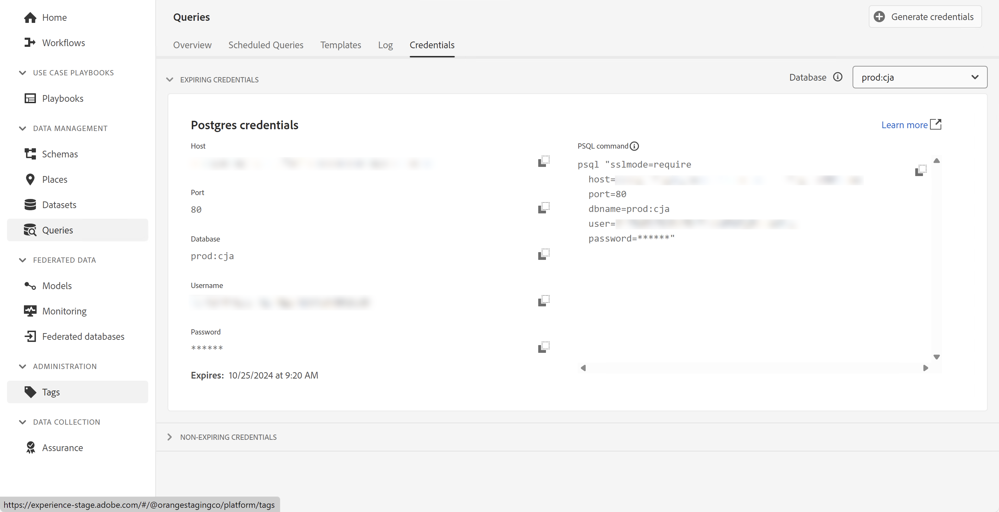
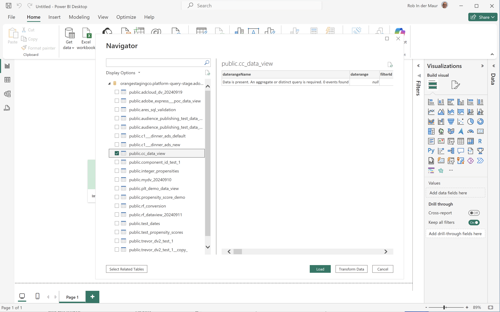
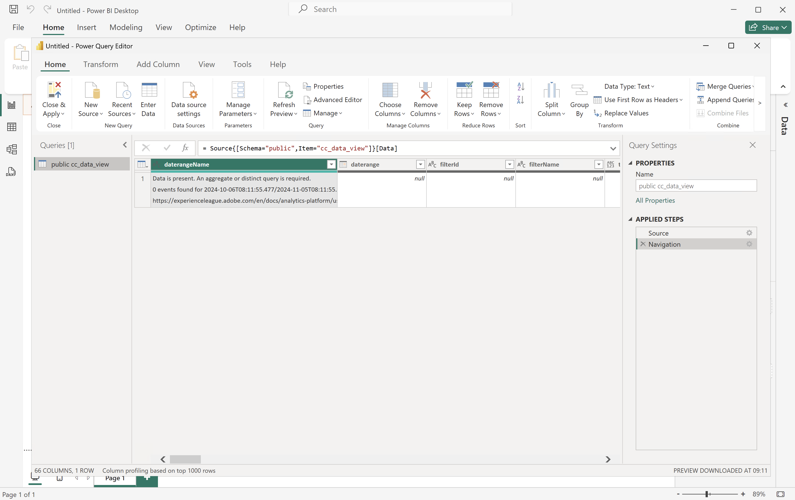
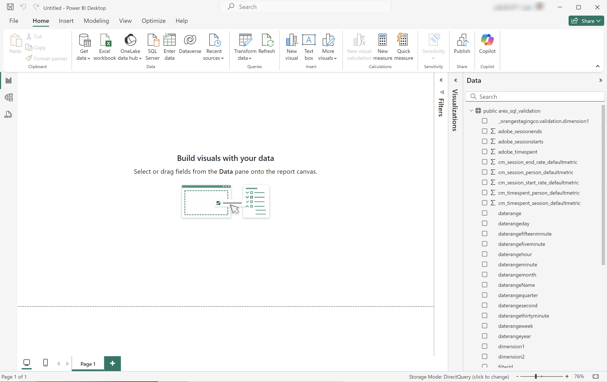
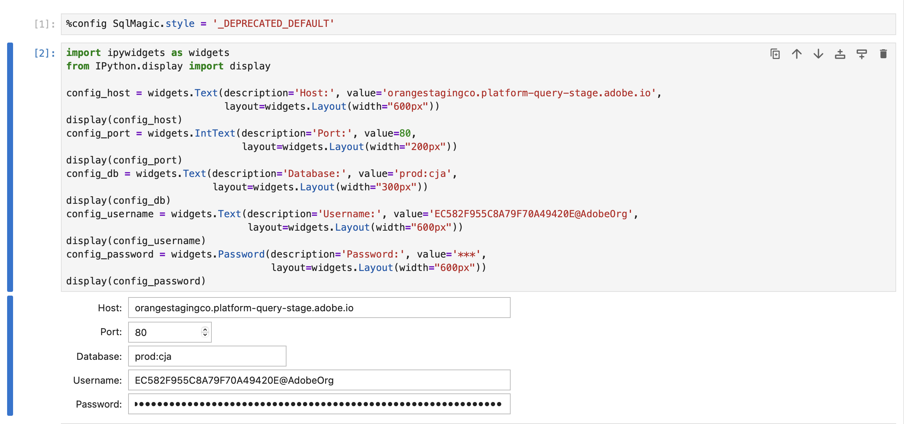

# Connexion et validation


Ce cas d’utilisation configure la connexion de l’outil BI à Customer Journey Analytics, répertorie les vues de données disponibles et sélectionne une vue de données à utiliser.

+++ Customer Journey Analytics

Les instructions se rapportent à un exemple d’environnement avec les objets suivants :

* Vue de données : **[!UICONTROL C&amp;C - Vue de données]** 🅐.
* Dimensions : **[!UICONTROL Nom du produit]** 🅑 et **[!UICONTROL Catégorie de produit]** 🅒.
* Mesures : **[!UICONTROL Chiffre d’affaires d’achat]** 🅓 et **[!UICONTROL Achats]** 🅔.
* Filtre : **[!UICONTROL Produits de la pêche]** 🅕.


Lorsque vous parcourez les cas d’utilisation, remplacez ces exemples d’objets par des objets appropriés à votre environnement spécifique.

+++

+++ Outils de BI

>[!BEGINTABS]

>[!TAB Bureau ]

1. Accédez aux informations d’identification et aux paramètres requis à partir de l’interface utilisateur d’Experience Platform Query Service.

   1. Accédez à votre sandbox Experience Platform.
   1. Sélectionnez  **[!UICONTROL Requêtes]** dans le rail de gauche.
   1. Sélectionnez l’onglet **[!UICONTROL Informations d’identification]** dans l’interface **[!UICONTROL Requêtes]**.
   1. Sélectionnez `prod:cja` dans le menu déroulant **[!UICONTROL Base de données]**.

      

1. Démarrez Power BI Desktop.
   1. Dans l’interface principale, sélectionnez **[!UICONTROL Obtenir des données à partir d’autres sources]**.
   1. Dans la boîte de dialogue **[!UICONTROL Obtenir des données]** :
      
      1. Recherchez et sélectionnez **[!UICONTROL Base de données PostgreSQL]**.
      1. Sélectionnez **[!UICONTROL Connexion]**.
   1. Dans la boîte de dialogue **[!UICONTROL Base de données PostgreSQL]** :
      
      1. Utilisez  pour copier et coller les valeurs **[!UICONTROL Hôte]** et **[!UICONTROL Port]** à partir du panneau Experience Platform **[!UICONTROL Requête]** **[!UICONTROL Informations d’identification arrivant à expiration]**, séparées par `:` comme valeur de **[!UICONTROL Server]**. Par exemple : `examplecompany.platform-query.adobe.io:80`.
      1. Utilisez  pour copier et coller la valeur **[!UICONTROL Base de données]** à partir du panneau Experience Platform **[!UICONTROL Requête]** **[!UICONTROL Informations d’identification arrivant à expiration]**. Ajoutez `?FLATTEN` à la valeur que vous collez. Par exemple : `prod:cja?FLATTEN`.
      1. Sélectionnez **[!UICONTROL DirectQuery]** comme **[!UICONTROL mode de connectivité des données]**.
      1. Sélectionnez **[!UICONTROL OK]**.
   1. Dans la boîte de dialogue **[!UICONTROL Base de données PostgreSQL]** - **[!UICONTROL Base de données]** :
      
      1. Utilisez  pour copier les valeurs **[!UICONTROL Nom d’utilisateur]** et **[!UICONTROL Mot de passe]** à partir du panneau Experience Platform **[!UICONTROL Requête]** **[!UICONTROL Informations d’identification arrivant à expiration]** dans les champs **[!UICONTROL Nom d’utilisateur]** et **[!UICONTROL Mot de passe]**. Si vous utilisez des informations d’identification [&#x200B; non expirantes](https://experienceleague.adobe.com/en/docs/experience-platform/query/ui/credentials?lang=en#use-credential-to-connect), utilisez le mot de passe correspondant.
      1. Assurez-vous que le menu déroulant **[!UICONTROL Sélectionner le niveau auquel appliquer ces paramètres]** est défini sur le **[!UICONTROL Serveur]** que vous avez défini précédemment.
      1. Sélectionnez **[!UICONTROL Connexion]**.
   1. Dans la boîte de dialogue **[!UICONTROL Navigateur]**, les vues de données sont récupérées. Cette récupération peut prendre un certain temps. Une fois la récupération effectuée, les éléments suivants s’affichent dans Power BI Desktop.
      
      1. Sélectionnez **[!UICONTROL public.cc_data_view]** dans la liste du panneau de gauche.
      1. Vous disposez de deux options :
         1. Sélectionnez **[!UICONTROL Charger]** pour continuer et terminer la configuration.
         1. Sélectionnez **[!UICONTROL Transformer les données]**. Une boîte de dialogue s’affiche, dans laquelle vous pouvez éventuellement appliquer des transformations dans le cadre de la configuration.
            
            * Sélectionnez **[!UICONTROL Fermer et appliquer]**.
   1. Au bout d’un certain temps, **[!UICONTROL public.cc_data_view]** s’affiche dans le volet **[!UICONTROL Data]**. Sélectionnez  pour afficher les dimensions et les mesures.
      


## A APLATIR ou non

Power BI Desktop prend en charge les scénarios suivants pour le paramètre `FLATTEN`. Voir [Aplatir les données imbriquées](https://experienceleague.adobe.com/fr/docs/experience-platform/query/key-concepts/flatten-nested-data) pour plus d’informations.

| Paramètre FLATTEN | Exemple | Pris en charge | Remarques |
|---|---|:---:|---|
| Aucun | `prod:cja` |  | |
| `?FLATTEN` | `prod:cja?FLATTEN` |  | **Option recommandée à utiliser !** |
| `%3FFLATTEN` | `prod:cja%3FFLATTEN` |  | Le Bureau Power BI affiche l’erreur suivante : **[!UICONTROL Nous n’avons pas pu nous authentifier à l’aide des informations d’identification fournies. Veuillez réessayer.]** |

### Informations supplémentaires

* [Conditions préalables](/help/data-views/bi-extension.md#prerequisites)
* [Guide sur les informations d’identification](https://experienceleague.adobe.com/fr/docs/experience-platform/query/ui/credentials)
* [Connexion de Power BI à Query Service](https://experienceleague.adobe.com/fr/docs/experience-platform/query/clients/power-bi).


>[!TAB  Tableau Desktop ]

1. Accédez aux informations d’identification et aux paramètres requis à partir de l’interface utilisateur d’Experience Platform Query Service.

   1. Accédez à votre sandbox Experience Platform.
   1. Sélectionnez  **[!UICONTROL Requêtes]** dans le rail de gauche.
   1. Sélectionnez l’onglet **[!UICONTROL Informations d’identification]** dans l’interface **[!UICONTROL Requêtes]**.
   1. Sélectionnez `prod:cja` dans le menu déroulant **[!UICONTROL Base de données]**.

      

1. Démarrez Tableau.
   1. Sélectionnez **[!UICONTROL PostgreSQL]** dans le rail de gauche sous **[!UICONTROL Vers un serveur]**. Si elle n’est pas disponible, sélectionnez **[!UICONTROL Plus...]** et sélectionnez **[!UICONTROL PostgreSQL]** dans la **[!UICONTROL Connecteurs installés]**.
      
   1. Dans la boîte de dialogue **[!UICONTROL PostgreSQL]**, dans l’onglet **[!UICONTROL Général]** :
      
      1. Utilisez  pour copier et coller le **[!UICONTROL Hôte]** du panneau **[!UICONTROL Requête]** **[!UICONTROL Informations d’identification arrivant à expiration]** d’Experience Platform vers le **[!UICONTROL Serveur]**.
      1. Utilisez  pour copier et coller le **[!UICONTROL Port]** depuis le panneau Experience Platform **[!UICONTROL Requête]** **[!UICONTROL Informations d’identification arrivant à expiration]** vers le **[!UICONTROL Port]**.
      1. Utilisez  pour copier et coller la **[!UICONTROL Base de données]** du panneau **[!UICONTROL Requête]** **[!UICONTROL Informations d’identification arrivant à expiration]** d’Experience Platform vers la **[!UICONTROL Base de données]**. Ajoutez `%3FFLATTEN` à la valeur que vous collez. Par exemple : `prod:cja%3FFLATTEN`.
      1. Sélectionnez **[!UICONTROL Nom d’utilisateur et mot de passe]** dans le menu déroulant **[!UICONTROL Authentification]**.
      1. Utilisez  pour copier et coller le **[!UICONTROL Nom d’utilisateur]** du panneau **[!UICONTROL Requête]** **[!UICONTROL Informations d’identification arrivant à expiration]** d’Experience Platform dans le **[!UICONTROL Nom d’utilisateur]**.
      1. Utilisez  pour copier et coller le **[!UICONTROL Mot de passe]** du panneau Experience Platform **[!UICONTROL Requête]** **[!UICONTROL Informations d’identification arrivant à expiration]** dans le **[!UICONTROL Mot de passe]**. Si vous utilisez des informations d’identification [&#x200B; non expirantes](https://experienceleague.adobe.com/en/docs/experience-platform/query/ui/credentials?lang=en#use-credential-to-connect), utilisez le mot de passe correspondant.
      1. Assurez-vous que la case **[!UICONTROL Exiger SSL]** est cochée.
      1. Sélectionnez **[!UICONTROL Se connecter]**.

      Une boîte de dialogue **[!UICONTROL Progression de la demande]** s&#39;affiche alors que Tableau Desktop valide la connexion.
   1. Dans la fenêtre principale, comme dans la page Source de données **, dans le volet de gauche :**
      * Nom de la connexion, sous **[!UICONTROL Connexions]**.
      * Nom de la base de données, sous **[!UICONTROL Base de données]**.
      * Liste des tableaux, sous **[!UICONTROL Tableau]**.
        
      1. Faites glisser l’entrée **[!UICONTROL cc_data_view]** et déposez-la sur la vue principale qui indique **[!UICONTROL Faire glisser des tableaux]** ici.
   1. La fenêtre principale affiche les détails de la vue de données **[!UICONTROL cc_data_view]**.
      

## A APLATIR ou non

Tableau Desktop prend en charge les scénarios suivants pour le paramètre `FLATTEN`. Voir [Aplatir les données imbriquées](https://experienceleague.adobe.com/fr/docs/experience-platform/query/key-concepts/flatten-nested-data) pour plus d’informations.

| Paramètre FLATTEN | Exemple | Pris en charge | Remarques |
|---|---|:---:|---|
| Aucun | `prod:cja` |  | |
| `?FLATTEN` | `prod:cja?FLATTEN` |  | |
| `%3FFLATTEN` | `prod:cja%3FFLATTEN` |  | **Option recommandée**. Notez que `%3FFLATTEN` est la version codée URL de `?FLATTEN`. |

## Informations supplémentaires

* [Conditions préalables](/help/data-views/bi-extension.md#prerequisites)
* [Guide sur les informations d’identification](https://experienceleague.adobe.com/fr/docs/experience-platform/query/ui/credentials)
* [Connexion de Tableau Desktop à Query Service](https://experienceleague.adobe.com/fr/docs/experience-platform/query/clients/tableau).


>[!TAB Looker]

1. Accédez aux informations d’identification et aux paramètres requis à partir de l’interface utilisateur d’Experience Platform Query Service.

   1. Accédez à votre sandbox Experience Platform.
   1. Sélectionnez  **[!UICONTROL Requêtes]** dans le rail de gauche.
   1. Sélectionnez l’onglet **[!UICONTROL Informations d’identification]** dans l’interface **[!UICONTROL Requêtes]**.
   1. Sélectionnez `prod:cja` dans le menu déroulant **[!UICONTROL Base de données]**.

      

1. Connexion à Looker

   1. Sélectionnez **[!UICONTROL Admin]** dans le rail de gauche.
   1. Sélectionnez **[!UICONTROL Connexions]**.
   1. Sélectionnez **[!UICONTROL Ajouter une connexion]**.
   1. Dans l’écran **[!UICONTROL Connexion de la base de données à l’outil de recherche]**.

      

      1. Saisissez un **[!UICONTROL Nom]** pour votre connexion, par exemple `Example Looker Connection`.
      1. Assurez-vous que **[!UICONTROL Tous les projets]** est sélectionné comme **[!UICONTROL Portée de la connexion]**.
      1. Sélectionnez **[!UICONTROL PostgreSQL 9.5+]** comme dialecte.
      1. Utilisez  pour copier et coller la valeur **[!UICONTROL Hôte]** du panneau Experience Platform **[!UICONTROL Requête]** **[!UICONTROL Informations d’identification arrivant à expiration]** en tant que valeur de **[!UICONTROL Hôte]**. Par exemple : `examplecompany.platform-query.adobe.io`.
      1. Utilisez  pour copier et coller la valeur **[!UICONTROL Port]** du panneau Experience Platform **[!UICONTROL Requête]** **[!UICONTROL Informations d’identification arrivant à expiration]** en tant que valeur de **[!UICONTROL Port]**. Par exemple : `80`.
      1. Utilisez  pour copier et coller la valeur **[!UICONTROL Base de données]** du panneau **[!UICONTROL Requête]** **[!UICONTROL Informations d’identification arrivant à expiration]** d’Experience Platform en tant que valeur de **[!UICONTROL Base de données]**. Ajoutez `%3FFLATTEN` à la valeur que vous collez. Par exemple : `prod:cja%3FFLATTEN`.
      1. Utilisez  pour copier et coller la valeur **[!UICONTROL Nom d’utilisateur]** du panneau Experience Platform **[!UICONTROL Requête]** **[!UICONTROL Informations d’identification arrivant à expiration]** en tant que valeur de **[!UICONTROL Nom d’utilisateur]**.
      1. Utilisez  pour copier et coller la valeur **[!UICONTROL Mot de passe]** du panneau Experience Platform **[!UICONTROL Requête]** **[!UICONTROL Informations d’identification arrivant à expiration]** en tant que valeur de **[!UICONTROL Mot de passe]**.
      1. Sélectionnez **[!UICONTROL Développer tout]** dans **[!UICONTROL Paramètres facultatifs]**.
      1. Définissez **[!UICONTROL Connexions max]** par nœud sur `5`.
      1. Assurez-vous que **[!UICONTROL SSL]** est activé.
      1. Sélectionnez **[!UICONTROL Tester]** pour tester la connexion. Une bannière devrait s’afficher en haut de l’écran avec un message comme **[!UICONTROL Succès, peut connecter JDBC ...]**.
      1. Sélectionnez **[!UICONTROL Connexion]** pour établir et enregistrer la connexion.
   1. La nouvelle connexion s’affiche dans l’interface **[!UICONTROL Connexions]**.
   1. Sélectionnez ←**dans**&#x200B;[!UICONTROL &#x200B; Admin &#x200B;]&#x200B;**pour accéder à la navigation principale dans le rail de gauche.**
   1. Sélectionnez **[!UICONTROL Développer]**.
   1. Sélectionnez **[!UICONTROL Projets]**.
   1. Sélectionnez **[!UICONTROL Nouveau modèle]** dans les projets LookML.
   1. Pour vous assurer que vous n’affectez pas d’autres utilisateurs. Sélectionnez Activer le mode de développement lorsque vous y êtes invité.
   1. Dans l’expérience **[!UICONTROL Créer un modèle]** :
      1. Dans **[!UICONTROL ➊, Sélectionnez Connexion À La Base De Données]** :
         1. Sélectionnez votre connexion à la base de données dans **[!UICONTROL Sélectionner la connexion à la base de données]**. Par exemple : **[!UICONTROL exemple_recherche_connexion]**.
         1. Nommez votre projet dans **[!UICONTROL Créez un projet LookML pour ce modèle]**. Par `example: example_looker_project`.
         1. Sélectionnez **[!UICONTROL Suivant]**.
      1. Dans **[!UICONTROL ➋Sélectionner Des Tables]** :
         1. Sélectionnez **[!UICONTROL public]** puis assurez-vous que la vue de données Customer Journey Analytics est sélectionnée. Par exemple :  **[!UICONTROL cc_data_view]**.
         1. Sélectionnez **[!UICONTROL Suivant]**.
      1. Dans **[!UICONTROL ➌, sélectionnez Clés de Principal]** :
         1. Sélectionnez **[!UICONTROL Suivant]**.
      1. Dans **[!UICONTROL ➍, sélectionnez Explorations à créer]** :
         1. Veillez à sélectionner votre vue. Par exemple : **[!UICONTROL cc_data_view.view]**.
         1. Sélectionnez **[!UICONTROL Suivant]**.
      1. Dans **[!UICONTROL ➎, Saisissez Le Nom Du Modèle]** :
         1. Nommez votre modèle. Par exemple : `example_looker_model`.
      1. Sélectionnez **[!UICONTROL Terminer et Explorer les données]**.

   Vous êtes redirigé vers l’interface **[!UICONTROL Explorer]** de l’outil de recherche, prête à explorer les données.


## A APLATIR ou non

Looker prend en charge les scénarios suivants pour le paramètre `FLATTEN`. Voir [Aplatir les données imbriquées](https://experienceleague.adobe.com/fr/docs/experience-platform/query/key-concepts/flatten-nested-data) pour plus d’informations.

| Paramètre FLATTEN | Exemple | Pris en charge | Remarques |
|---|---|:---:|---|
| Aucun | `prod:cja` |  | |
| `?FLATTEN` | `prod:cja?FLATTEN` |  | |
| `%3FFLATTEN` | `prod:cja%3FFLATTEN` |  | **Option recommandée**. Notez que `%3FFLATTEN` est la version codée URL de `?FLATTEN`. |

## Informations supplémentaires

* [Conditions préalables](/help/data-views/bi-extension.md#prerequisites)
* [Guide sur les informations d’identification](https://experienceleague.adobe.com/fr/docs/experience-platform/query/ui/credentials)


>[!TAB Notebook Jupyter]

1. Accédez aux informations d’identification et aux paramètres requis à partir de l’interface utilisateur d’Experience Platform Query Service.

   1. Accédez à votre sandbox Experience Platform.
   1. Sélectionnez  **[!UICONTROL Requêtes]** dans le rail de gauche.
   1. Sélectionnez l’onglet **[!UICONTROL Informations d’identification]** dans l’interface **[!UICONTROL Requêtes]**.
   1. Sélectionnez `prod:cja` dans le menu déroulant **[!UICONTROL Base de données]**.

      

1. Assurez-vous d’avoir configuré un environnement virtuel Python dédié pour exécuter votre environnement Jupyter Notebook.
1. Vérifiez que vous avez installé les bibliothèques requises dans votre environnement virtuel :
   * ipython-sql : `pip install ipython-sql`.
   * psycopg2-binary : `pip install psycopg-binary`.
   * sqlalchemy : pip `install sqlalchemy`.

1. Démarrez Jupyter Notebook à partir de votre environnement virtuel : `jupyter notebook`.
1. Créez un nouveau notebook ou téléchargez [cet exemple de notebook](../assets/BI-Extension.ipynb.zip).
1. Dans la première cellule, saisissez et exécutez :

   ```
   %config SqlMagic.style = '_DEPRECATED_DEFAULT'
   ```

1. Dans une nouvelle cellule, saisissez les paramètres de configuration de votre connexion. Utilisez  pour copier et coller les valeurs du panneau Experience Platform **[!UICONTROL Requête]** **[!UICONTROL Informations d’identification arrivant à expiration]** dans les valeurs requises pour les paramètres de configuration. Par exemple :

   ```
   import ipywidgets as widgets
   from IPython.display import display
   
   config_host = widgets.Text(description='Host:', value='example.platform-query-stage.adobe.io',
                           layout=widgets.Layout(width="600px"))
   display(config_host)
   config_port = widgets.IntText(description='Port:', value=80,
                              layout=widgets.Layout(width="200px"))
   display(config_port)
   config_db = widgets.Text(description='Database:', value='prod:cja',
                         layout=widgets.Layout(width="300px"))
   display(config_db)
   config_username = widgets.Text(description='Username:', value='EC582F955C8A79F70A49420E@AdobeOrg',
                               layout=widgets.Layout(width="600px"))
   display(config_username)
   config_password = widgets.Password(description='Password:', value='***',
                                   layout=widgets.Layout(width="600px"))
   display(config_password)
   ```

1. Exécutez la cellule.
1. Utilisez  pour copier et coller le mot de passe du panneau Experience Platform **[!UICONTROL Requête]** **[!UICONTROL Informations d’identification arrivant à expiration]** dans le champ **[!UICONTROL Mot de passe]** du notebook Jupyter.

   

1. Dans une nouvelle cellule, saisissez les instructions pour charger l’extension SQL, la bibliothèque requise et vous connecter à Customer Journey Analytics.

   ```python
   %load_ext sql
   from sqlalchemy import create_engine
   %sql postgresql://{config_username.value}:{config_password.value}@{config_host.value}:{config_port.value}/{config_db.value}?sslmode=require
   ```

   Exécutez le shell. Vous ne devriez pas voir de sortie mais la cellule devrait s&#39;exécuter sans avertissement.

   

1. Dans un nouvel appel, saisissez les instructions pour obtenir une liste des vues de données disponibles en fonction de la connexion.

   ```python
   %%sql
   SELECT n.nspname as "Schema",
      c.relname as "Name",
      CASE c.relkind WHEN 'r' THEN 'table' WHEN 'v' THEN 'view' WHEN 'm' THEN 'materialized view' WHEN 'i' THEN 'index' WHEN 'S' THEN 'sequence' WHEN 's' THEN 'special' WHEN 't' THEN 'TOAST table' WHEN 'f' THEN 'foreign table' WHEN 'p' THEN 'partitioned table' WHEN 'I' THEN 'partitioned index' END as "Type",
      pg_catalog.pg_get_userbyid(c.relowner) as "Owner"
   FROM pg_catalog.pg_class c
   LEFT JOIN pg_catalog.pg_namespace n ON n.oid = c.relnamespace
   WHERE c.relkind IN ('v','')
      AND n.nspname <> 'pg_catalog'
      AND n.nspname !~ '^pg_toast'
      AND n.nspname <> 'information_schema'
      AND pg_catalog.pg_table_is_visible(c.oid)
      AND c.relname NOT LIKE '%test%'
      AND c.relname NOT LIKE '%ajo%'
   ORDER BY 1,2;
   ```

   Exécutez le shell. Vous devriez voir une sortie similaire à la capture d’écran ci-dessous.

   

   Vous devriez voir la **[!UICONTROL cc_data_view]** dans la liste des vues de données.

## A APLATIR ou non

Le notebook Jupyter prend en charge les scénarios suivants pour le paramètre `FLATTEN`. Voir [Aplatir les données imbriquées](https://experienceleague.adobe.com/fr/docs/experience-platform/query/key-concepts/flatten-nested-data) pour plus d’informations.

| Paramètre FLATTEN | Exemple | Pris en charge | Remarques |
|---|---|:---:|---|
| Aucun | `prod:cja` |  | |
| `?FLATTEN` | `prod:cja?FLATTEN` |  | |
| `%3FFLATTEN` | `prod:cja%3FFLATTEN` |  | **Option recommandée**. Notez que `%3FFLATTEN` est la version codée URL de `?FLATTEN`. |

## Informations supplémentaires

* [Conditions préalables](/help/data-views/bi-extension.md#prerequisites)
* [Guide sur les informations d’identification](https://experienceleague.adobe.com/fr/docs/experience-platform/query/ui/credentials)

>[!TAB RStudio]

1. Accédez aux informations d’identification et aux paramètres requis à partir de l’interface utilisateur d’Experience Platform Query Service.

   1. Accédez à votre sandbox Experience Platform.
   1. Sélectionnez  **[!UICONTROL Requêtes]** dans le rail de gauche.
   1. Sélectionnez l’onglet **[!UICONTROL Informations d’identification]** dans l’interface **[!UICONTROL Requêtes]**.
   1. Sélectionnez `prod:cja` dans le menu déroulant **[!UICONTROL Base de données]**.

      

1. Démarrez RStudio.
1. Créez un nouveau fichier R Markdown ou téléchargez [cet exemple de fichier R Markdown](../assets/BI-Extension.Rmd.zip).
1. Dans votre premier bloc, saisissez les instructions suivantes. Utilisez  pour copier et coller des valeurs du panneau Experience Platform **[!UICONTROL Requête]** **[!UICONTROL Informations d’identification arrivant à expiration]** dans les valeurs requises pour les différents paramètres, tels que `host`, `dbname` et `user`. Par exemple :

   ```R
   library(rstudioapi)
   library(DBI)
   library(dplyr)
   library(tidyr)
   library(RPostgres)
   library(ggplot2)
   
   host <- rstudioapi::showPrompt(title = "Host", message = "Host", default = "orangestagingco.platform-query-stage.adobe.io")
   dbname <- rstudioapi::showPrompt(title = "Database", message = "Database", default = "prod:cja?FLATTEN")
   user <- rstudioapi::showPrompt(title = "Username", message = "Username", default = "EC582F955C8A79F70A49420E@AdobeOrg")
   password <- rstudioapi::askForPassword(prompt = "Password")
   ```

1. Exécutez le bloc. Vous êtes invité à indiquer **[!UICONTROL Hôte]**, **[!UICONTROL Base de données]** et **[!UICONTROL Utilisateur]**. Il vous suffit d’accepter les valeurs que vous avez fournies dans le cadre de l’étape précédente.
1. Utilisez  pour copier et coller le mot de passe du panneau Experience Platform **[!UICONTROL Requête]** **[!UICONTROL Informations d’identification arrivant à expiration]** dans l’invite de dialogue **[!UICONTROL Mot de passe]** de RStudio.

   

1. Créez un bloc et saisissez les instructions suivantes.

   ```R
   con <- dbConnect(
      RPostgres::Postgres(),
      host = host,
      port = 80,
      dbname = dbname,
      user = user,
      password = password,
      sslmode = 'require'
   )
   ```

1. Exécutez le bloc. Vous ne devriez voir aucune sortie si la connexion est réussie.


1. Créez un bloc et saisissez les instructions suivantes.

   ```R
   views <- dbListTables(con)
   print(views)
   ```

1. Exécutez le bloc. Vous devriez voir `character(0)` comme seule sortie.


1. Créez un bloc et saisissez les instructions suivantes.

   ```R
   glimpse(dv)
   ```

1. Exécutez le bloc. Vous devriez voir une sortie similaire à la capture d’écran ci-dessous.

   

## A APLATIR ou non

RStudio prend en charge les scénarios suivants pour le paramètre `FLATTEN`. Voir [Aplatir les données imbriquées](https://experienceleague.adobe.com/fr/docs/experience-platform/query/key-concepts/flatten-nested-data) pour plus d’informations.

| Paramètre FLATTEN | Exemple | Pris en charge | Remarques |
|---|---|:---:|---|
| Aucun | `prod:cja` |  | |
| `?FLATTEN` | `prod:cja?FLATTEN` |  | **Option recommandée**. |
| `%3FFLATTEN` | `prod:cja%3FFLATTEN` |  | |

## Informations supplémentaires

* [Conditions préalables](/help/data-views/bi-extension.md#prerequisites)
* [Guide sur les informations d’identification](https://experienceleague.adobe.com/fr/docs/experience-platform/query/ui/credentials)

>[!ENDTABS]

+++
