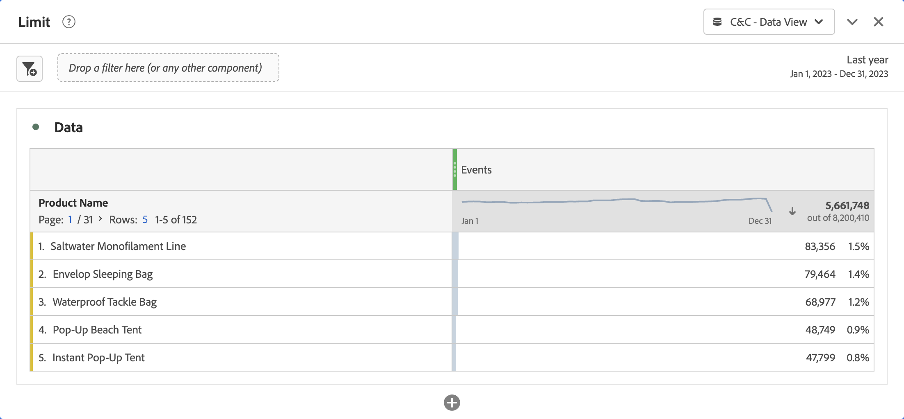
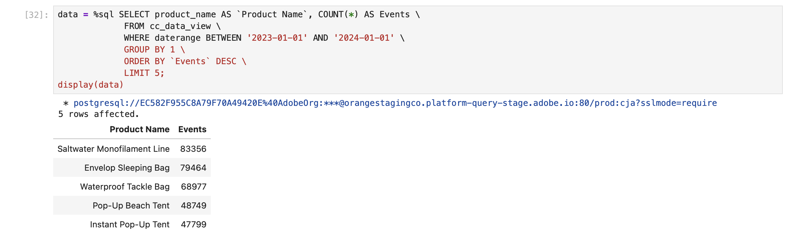

# Limites


Dans ce cas d’utilisation, vous souhaitez créer un rapport sur les 5 occurrences les plus fréquentes des noms de produit en 2023.

+++ Customer Journey Analytics

Exemple de panneau **[!UICONTROL Limite]** pour le cas d’utilisation :

Panneau Limite de 

+++

+++ Outils de BI

>[!PREREQUISITES]
>
>Vérifiez que vous avez validé [une connexion réussie, que vous pouvez répertorier les vues de données et utiliser une vue de données](connect-and-validate.md) pour l’outil BI pour lequel vous souhaitez tester ce cas d’utilisation.
>

>[!BEGINTABS]

>[!TAB Bureau Power BI]

1. Dans le volet **[!UICONTROL Données]** :
   1. Sélectionnez **[!UICONTROL daterange]**.
   1. Sélectionnez **[!UICONTROL product_name]**.
   1. Sélectionnez **[!UICONTROL somme des occurrences]**.

1. Dans le volet **[!UICONTROL Filtres]** :
   1. Sélectionnez **[!UICONTROL daterange est (tout)]** dans **[!UICONTROL Filtres sur ce visuel]**.
   1. Sélectionnez **[!UICONTROL Date relative]** comme **[!UICONTROL Type de filtre]**.
   1. Définissez le filtre pour **[!UICONTROL Afficher les éléments lorsque la valeur]** **[!UICONTROL se trouve dans les dernières]** `1` **[!UICONTROL années civiles]**.
   1. Sélectionnez **[!UICONTROL Appliquer le filtre]**.
   1. Sélectionnez **[!UICONTROL product_name is (All)]** dans **[!UICONTROL Filtres sur ce visuel]**.
   1. Sélectionnez **[!UICONTROL N premiers]** comme **[!UICONTROL type de filtre]**.
   1. Sélectionnez **[!UICONTROL Afficher les éléments]** **[!UICONTROL En haut]** `5` **[!UICONTROL Par valeur]**.
   1. Effectuez un glisser-déposer **[!UICONTROL occurrences de somme]** depuis le volet **[!UICONTROL Données]** et déposez-le sur **[!UICONTROL Ajouter des champs de données ici]**.
   1. Sélectionnez **[!UICONTROL Appliquer le filtre]**.

1. Dans le volet Visualisation :
   * Sélectionnez  pour supprimer daterange des colonnes.

   Votre bureau Power BI doit se présenter comme suit :

   

La requête exécutée par Power BI Desktop à l’aide de l’extension BI inclut une instruction `limit`, mais pas celle attendue. Power BI Desktop applique la limite des 5 principales occurrences à l’aide des résultats de nom de produit explicites.

```sql
select "_"."product_name",
    "_"."a0"
from 
(
    select "rows"."product_name" as "product_name",
        sum("rows"."occurrences") as "a0"
    from 
    (
        select "_"."daterangeName",
            "_"."daterange",
            "_"."filterId",
            "_"."filterName",
            "_"."timestamp",
            "_"."affiliate_name",
            "_"."affiliate_url",
            "_"."commerce.order.priceTotal",
            "_"."customer_city",
            "_"."customer_region",
            "_"."daterangeday",
            "_"."daterangefifteenminute",
            "_"."daterangefiveminute",
            "_"."daterangehour",
            "_"."daterangeminute",
            "_"."daterangemonth",
            "_"."daterangequarter",
            "_"."daterangesecond",
            "_"."daterangethirtyminute",
            "_"."daterangeweek",
            "_"."daterangeyear",
            "_"."hitdatetime",
            "_"."page_name",
            "_"."page_url",
            "_"."product_category",
            "_"."product_name",
            "_"."product_short_review",
            "_"."product_subCategory",
            "_"."referrer_url",
            "_"."search_engine",
            "_"."search_keywords",
            "_"."store_city",
            "_"."store_name",
            "_"."store_region",
            "_"."store_type",
            "_"."timepartdayofmonth",
            "_"."timepartdayofweek",
            "_"."timepartdayofyear",
            "_"."timeparthourofday",
            "_"."timepartminuteofhour",
            "_"."timepartmonthofyear",
            "_"."timepartquarterofyear",
            "_"."timepartweekofyear",
            "_"."cm_session_end_rate_defaultmetric",
            "_"."cm_session_person_defaultmetric",
            "_"."cm_session_start_rate_defaultmetric",
            "_"."cm_timespent_person_defaultmetric",
            "_"."cm_timespent_session_defaultmetric",
            "_"."cm_product_name_count_distinct",
            "_"."ad_views",
            "_"."adobe_sessionends",
            "_"."adobe_sessionstarts",
            "_"."adobe_timespent",
            "_"."exchange_buybacks",
            "_"."exchange_cost",
            "_"."exchange_purchases",
            "_"."exchange_revenue",
            "_"."occurrences",
            "_"."page_views",
            "_"."product_quantity",
            "_"."product_reviews",
            "_"."product_views",
            "_"."purchase_revenue",
            "_"."purchases",
            "_"."visitors",
            "_"."visits"
        from "public"."cc_data_view" "_"
        where (("_"."product_name" in ('Saltwater Monofilament Line', 'Pop-Up Beach Tent', 'Instant Pop-Up Tent', 'Envelop Sleeping Bag', 'Waterproof Tackle Bag')) and "_"."daterange" < date '2024-01-01') and "_"."daterange" >= date '2023-01-01'
    ) "rows"
    group by "product_name"
) "_"
where not "_"."a0" is null
limit 1000001
```

>[!TAB  Tableau Desktop ]

1. Sélectionnez l’onglet **[!UICONTROL Feuille 1]** en bas pour basculer depuis **[!UICONTROL Source de données]**. Dans la vue **[!UICONTROL Feuille 1]** :
   1. Faites glisser l’entrée **[!UICONTROL Période]** de la liste **[!UICONTROL Tableaux]** vers le plateau **[!UICONTROL Filtres]**.
   1. Dans la boîte de dialogue **[!UICONTROL Champ de filtre \[Période\]]**, sélectionnez **[!UICONTROL Période]** et sélectionnez **[!UICONTROL Suivant >]**.
   1. Dans la boîte de dialogue **[!UICONTROL Filtrer \[Période\]]**, sélectionnez **[!UICONTROL Dates relatives]**, **[!UICONTROL Années]**, puis **[!UICONTROL Années précédentes]**. Sélectionnez **[!UICONTROL Appliquer]** et **[!UICONTROL OK]**.
   1. Faites glisser **[!UICONTROL Product Name]** de la liste **[!UICONTROL Tables]** vers **[!UICONTROL Rows]**.
   1. Faites glisser l’entrée **[!UICONTROL Occurrences]** de la liste **[!UICONTROL Tableaux]** et déposez-la dans le champ en regard de **[!UICONTROL Colonnes]**. La valeur devient **[!UICONTROL SUM(Occurrences)]**.
   1. Sélectionnez **[!UICONTROL Tableau de texte]** dans **[!UICONTROL Afficher]**.
   1. Sélectionnez **[!UICONTROL Ajuster la largeur]** dans le menu déroulant **[!UICONTROL Ajuster]**.
   1. Sélectionnez **[!UICONTROL Nom du produit]** dans **[!UICONTROL Lignes]**. Sélectionnez **[!UICONTROL Filtrer]** dans le menu déroulant.
      1. Dans la boîte de dialogue **[!UICONTROL Filtrer \[Nom du produit\]]**, sélectionnez l’onglet **[!UICONTROL Haut]**.
      1. Sélectionnez **[!UICONTROL Par champ :]** **[!UICONTROL Haut]** `5` **[!UICONTROL Par occurrences]** **[!UICONTROL Somme]**.
      1. Sélectionnez **[!UICONTROL Appliquer]** et **[!UICONTROL OK]**.

          vous remarquerez que le tableau disparaît. La sélection des 5 premiers noms de produit par occurrences ne fonctionne **pas** correctement avec ce filtre.
      1. Sélectionnez le **[!UICONTROL Nom du produit]** dans l’étagère **[!UICONTROL Filtrer]**, puis dans le menu déroulant, sélectionnez **[!UICONTROL Supprimer]**. Le tableau réapparaît.
   1. Sélectionnez **[!UICONTROL SUM(Occurrences)]** dans le rayon **[!UICONTROL Marques]**. Sélectionnez **[!UICONTROL Filtrer]** dans le menu déroulant.
      1. Dans la boîte de dialogue **[!UICONTROL Filtrer \[Occurrences\]]**, sélectionnez **[!UICONTROL Au moins]**.
      1. Saisissez `47.799` comme valeur. Cette valeur permet de s’assurer que seuls les 5 premiers éléments sont affichés dans le tableau. Sélectionnez **[!UICONTROL Appliquer]** et **[!UICONTROL OK]**.

         Votre Tableau Desktop devrait ressembler à ce qui suit.

         

Comme indiqué ci-dessus, cette requête exécutée par Tableau Desktop lors de la définition d&#39;un filtre des 5 principales occurrences sur les noms de produits échoue.

```sql
SELECT CAST("cc_data_view"."product_name" AS TEXT) AS "product_name",
  SUM("cc_data_view"."occurrences") AS "sum:occurrences:ok"
FROM "public"."cc_data_view" "cc_data_view"
  INNER JOIN (
  SELECT CAST("cc_data_view"."product_name" AS TEXT) AS "product_name",
    SUM("cc_data_view"."occurrences") AS "$__alias__0"
  FROM "public"."cc_data_view" "cc_data_view"
  GROUP BY 1
  ORDER BY 2 DESC,
    1 ASC
  LIMIT 5
) "t0" ON (CAST("cc_data_view"."product_name" AS TEXT) = "t0"."product_name")
WHERE (("cc_data_view"."daterange" >= (TIMESTAMP '2023-01-01 00:00:00.000')) AND ("cc_data_view"."daterange" < (TIMESTAMP '2024-01-01 00:00:00.000')))
GROUP BY 1
```

La requête exécutée par Tableau Desktop lors de la définition d&#39;un filtre Top 5 sur les occurrences est présentée ci-dessous. La limite n’est pas visible dans la requête et appliquée côté client.

```sql
SELECT CAST("cc_data_view"."product_name" AS TEXT) AS "product_name",
  SUM("cc_data_view"."occurrences") AS "sum:occurrences:ok"
FROM "public"."cc_data_view" "cc_data_view"
WHERE (("cc_data_view"."daterange" >= (TIMESTAMP '2023-01-01 00:00:00.000')) AND ("cc_data_view"."daterange" < (TIMESTAMP '2024-01-01 00:00:00.000')))
GROUP BY 1
```

>[!TAB Looker]

1. Dans l’interface **[!UICONTROL Explorer]** de la recherche, actualisez votre connexion. Sélectionnez  **[!UICONTROL Effacer le cache et actualiser]**.
1. Dans l’interface **[!UICONTROL Explorer]** de Looker, assurez-vous que vous disposez d’une configuration propre. Sinon, sélectionnez  **[!UICONTROL Supprimer les champs et les filtres]**.
1. Sélectionnez **[!UICONTROL + filtre]** sous **[!UICONTROL filtres]**.
1. Dans la boîte de dialogue **[!UICONTROL Ajouter un filtre]** :
   1. Sélectionnez **[!UICONTROL ‣ Cc Vue De Données]**
   1. Dans la liste des champs, sélectionnez **[!UICONTROL Date de période]** puis **[!UICONTROL Date de période]**.
      
1. Spécifiez le filtre **[!UICONTROL Date de plage de dates de la vue de données Cc]** tel que **[!UICONTROL est dans la plage]** **[!UICONTROL 2023/01/01]** **[!UICONTROL jusqu’au (avant)]** **[!UICONTROL 2024/01/01]**.
1. Dans la section **[!UICONTROL ‣ Cr Vue des données]** rail de gauche :
   1. Sélectionnez **[!UICONTROL Nom du produit]**.
   1. Sélectionnez **[!UICONTROL Nombre]** sous **[!UICONTROL MESURES]** dans le rail de gauche (en bas).
1. Veillez à sélectionner **[!UICONTROL ↓]** (**[!UICONTROL Décroissant, Ordre de tri : 1]**) dans la colonne **[!UICONTROL Chiffre d’affaires d’achat]**.
1. Veillez à sélectionner **[!UICONTROL ↓]** (**[!UICONTROL Décroissant, Ordre de tri : 1]**) dans la colonne **[!UICONTROL Chiffre d’affaires d’achat]**.
1. Sélectionnez **[!UICONTROL Exécuter]**.
1. Sélectionnez **[!UICONTROL ‣ Visualisation]**.

Vous devriez voir une visualisation et un tableau similaires à ceux présentés ci-dessous.


La requête générée par Looker à l’aide de l’extension BI inclut `FETCH NEXT 5 ROWS ONLY`, ce qui implique que la limite est exécutée via Looker et l’extension BI.

```sql
-- Looker Query Context '{"user_id":6,"history_slug":"a8f3b1ebd5712413ca1ae695090f70db","instance_slug":"71d4667f0b76c0011463658f45c3f7a3"}' 
SELECT
    cc_data_view."product_name"  AS "cc_data_view.product_name",
    COUNT(*) AS "cc_data_view.count"
FROM
    "public"."cc_data_view" AS "cc_data_view"
WHERE ((( cc_data_view."daterange"  ) >= (DATE_TRUNC('day', DATE '2023-01-31')) AND ( cc_data_view."daterange"  ) < (DATE_TRUNC('day', DATE '2024-01-01'))))
GROUP BY
    1
ORDER BY
    2 DESC
FETCH NEXT 5 ROWS ONLY
```


>[!TAB Notebook Jupyter]

1. Saisissez les instructions suivantes dans une nouvelle cellule.

   ```python
   data = %sql SELECT product_name AS `Product Name`, COUNT(*) AS Events \
               FROM cc_data_view \
               WHERE daterange BETWEEN '2023-01-01' AND '2023-02-01' \
               GROUP BY 1 \
               ORDER BY `Events` DESC \
               LIMIT 5;
   display(data)
   ```

1. Exécutez la cellule. Vous devriez voir une sortie similaire à la capture d’écran ci-dessous.

   

La requête est exécutée par l’extension BI, comme défini dans le notebook Jupyter.

>[!TAB RStudio]

1. Saisissez les instructions suivantes entre ` ```{r} ` et ` ``` ` dans un nouveau bloc.

   ```R
   ## Dimension 1 Limited
   df <- dv %>%
      filter(daterange >= "2023-01-01" & daterange < "2024-01-01") %>%
      group_by(product_name) %>%
      count() %>%
      arrange(desc(n), .by_group = FALSE) %>%
      head(5)
   print(df)
   ```

1. Exécutez le bloc. Vous devriez voir une sortie similaire à la capture d’écran ci-dessous.

   

La requête générée par RStudio à l’aide de l’extension BI inclut `LIMIT 5`, ce qui implique que la limite est appliquée via RStudio et l’extension BI.

```sql
SELECT "product_name", COUNT(*) AS "n"
FROM (
  SELECT "cc_data_view".*
  FROM "cc_data_view"
  WHERE ("daterange" >= '2023-01-01' AND "daterange" < '2024-01-01')
) AS "q01"
GROUP BY "product_name"
ORDER BY "n" DESC
LIMIT 5
```

>[!ENDTABS]

+++
