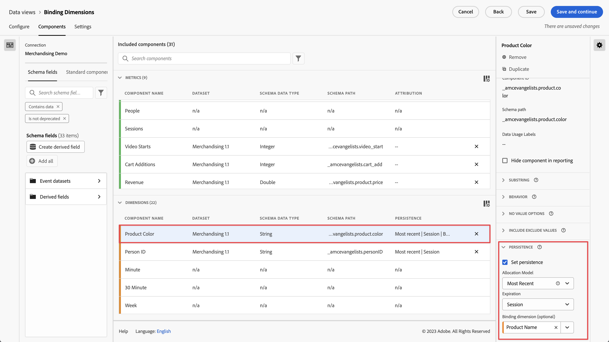

# Utiliser des dimensions et des mesures de liaison dans CJA

Customer Journey Analytics offre plusieurs façons de conserver les valeurs de dimension au-delà de lʼaccès sur lequel elles sont définies. Adobe offre plusieurs méthodes de persistance, dont la méthode Liaison. Dans les versions précédentes dʼAdobe Analytics, ce concept était connu sous le nom de marchandisage.

Bien que vous puissiez utiliser les dimensions de liaison avec les données dʼévénement de premier niveau, ce concept se prête mieux à une utilisation avec les [Tableaux dʼobjets](/help/use-cases/object-arrays.md). Vous pouvez attribuer une dimension à une partie dʼun tableau dʼobjets, sans lʼappliquer à tous les attributs dʼun événement donné. Par exemple, vous pouvez attribuer un terme de recherche à un produit de votre tableau dʼobjets de panier sans lier ce terme de recherche à lʼévénement entier.

## Exemple 1 : utilisation des dimensions de liaison pour affecter des attributs de produit supplémentaires à un achat

Vous pouvez lier les éléments de dimension d’un tableau d’objets à une autre dimension. Lorsque l’élément de dimension lié apparaît, CJA rappelle la dimension liée et l’inclut dans l’événement pour vous. Prenons lʼexemple de parcours client suivant :

1. Un visiteur se rend sur la page produit dʼun lave-linge.

   ```json
   {
       "PersonID": "1",
       "product": [
           {
               "name": "Washing Machine 2000",
               "color": "white",
               "type": "front loader",
           },
       ],
       "timestamp": 1534219229
   }
   ```

1. Il consulte ensuite une autre page produit, qui porte sur un sèche-linge.

   ```json
   {
       "PersonID": "1",
       "product": [
           {
               "name": "Dryer 2000",
               "color": "neon orange",
           },
       ],
       "timestamp": 1534219502
   }
   ```

1. Il se laisse tenter et effectue un achat. La couleur de chaque produit n’a pas été incluse dans l’événement d’achat.

   ```json
   {
       "PersonID": "1",
       "orders": 1,
       "product": [
           {
               "name": "Washing Machine 2000",
               "price": 1600,
           },
           {
               "name": "Dryer 2000",
               "price": 499
           }
       ],
       "timestamp": 1534219768
   }
   ```

Si vous souhaitez calculer le chiffre dʼaffaires selon la couleur sans dimension de liaison, la dimension `product.color` persiste et attribue incorrectement le crédit à la couleur du sèche-linge :

| product.color | chiffre d’affaires |
| --- | --- |
| orange fluo | 2099 |

Vous pouvez accéder au gestionnaire de vues de données et lier la couleur du produit au nom du produit :



Lorsque vous définissez ce modèle de persistance, CJA prend en compte le nom du produit chaque fois que la couleur du produit est définie. Lorsqu’il reconnaît le même nom de produit dans un événement ultérieur pour cette personne, la couleur du produit est également ajoutée. Lorsque vous liez la couleur du produit à son nom, les mêmes données ressembleraient à ce qui suit :

| product.color | chiffre d’affaires |
| --- | --- |
| blanc | 1600 |
| orange fluo | 499 |

## Exemple 2 : utilisation de mesures de liaison pour lier le terme de recherche à lʼachat dʼun produit

Lʼune des méthodes de marchandisage les plus courantes dans Adobe Analytics consiste à lier un terme de recherche à un produit, afin que chaque terme de recherche soit crédité pour le produit approprié. Prenons lʼexemple de parcours client suivant :

1. Un visiteur arrive sur votre site et recherche des « gants de boxe ». La mesure Recherches est incrémentée de un et les trois premiers résultats de la recherche s’affichent.

   ```json
   {
       "PersonID": "1",
       "page_name": "Search results",
       "search": "1",
       "search_term": "boxing gloves",
       "product": [
           {
               "name": "Beginner gloves",
           },
           {
               "name": "Tier 3 gloves",
           },
           {
               "name": "Professional gloves",
           }
       ]
   }
   ```

2. Il trouve une paire de gants à son goût et lʼajoute au panier.

   ```json
   {
       "PersonID": "1",
       "page_name": "Shopping cart",
       "cart_add": "1",
       "product": [
           {
               "name": "Tier 3 gloves",
           }
       ]
   }
   ```

3. Le visiteur recherche ensuite une « raquette de tennis ». La mesure Recherches est incrémentée de un et les trois premiers résultats de la recherche s’affichent.

   ```json
   {
       "PersonID": "1",
       "page_name": "Search results",
       "search": "1",
       "search_term": "tennis racket",
       "product": [
           {
               "name": "Shock absorb racket",
           },
           {
               "name": "Women's open racket",
           },
           {
               "name": "Extreme racket",
           }
       ]
   }
   ```

4. Il trouve une raquette qui lui plaît et lʼajoute au panier.

   ```json
   {
       "PersonID": "1",
       "page_name": "Shopping cart",
       "cart_add": "1",
       "product": [
           {
               "name": "Tier 3 gloves",
           },
           {
               "name": "Shock absorb racket",
           }
       ]
   }
   ```

5. Le visiteur effectue une troisième recherche, qui porte cette fois sur des « chaussures ». La mesure Recherches est incrémentée de un et les trois premiers résultats de la recherche s’affichent.

   ```json
   {
       "PersonID": "1",
       "page_name": "Search results",
       "search": "1",
       "search_term": "shoes",
       "product": [
           {
               "name": "Men's walking shoes",
           },
           {
               "name": "Tennis shoes",
           },
           {
               "name": "Skate shoes",
           }
       ]
   }
   ```

6. Il trouve la paire de chaussures de ses rêves et lʼajoute au panier.

   ```json
   {
       "PersonID": "1",
       "page_name": "Shopping cart",
       "cart_add": "1",
       "product": [
           {
               "name": "Tier 3 gloves",
           },
           {
               "name": "Shock absorb racket",
           },
           {
               "name": "Skate shoes",
           }
       ]
   }
   ```

7. Le visiteur suit le processus de passage en caisse et effectue lʼachat de ces trois articles.

   ```json
   {
       "PersonID": "1",
       "page_name": "Thank you for your purchase",
       "purchase": "1",
       "product": [
           {
               "name": "Tier 3 gloves",
               "price": "89.99"
           },
           {
               "name": "Shock absorb racket",
               "price": "34.99"
           },
           {
               "name": "Skate shoes",
               "price": "79.99"
           }
       ]
   }
   ```

Si vous utilisez un modèle d’attribution qui n’inclut pas de dimension de liaison avec le terme de recherche, les trois produits attribuent un chiffre dʼaffaires à un seul terme de recherche. Par exemple, si vous avez utilisé [!UICONTROL Original] l’attribution avec la dimension du terme de recherche :

| search_term | chiffre d’affaires |
| --- | --- |
| gants de boxe | 204,97 USD |

Si vous avez utilisé [!UICONTROL Le plus récent] avec la dimension du terme de recherche, les trois produits attribuent toujours des recettes à un seul terme de recherche :

| search_term | chiffre d’affaires |
| --- | --- |
| chaussures | 204,97 USD |

Bien que cet exemple ne concerne qu’une seule personne, de nombreuses personnes qui recherchent des éléments différents peuvent attribuer des termes de recherche à différents produits, ce qui rend difficile de déterminer les meilleurs résultats de recherche.

Vous pouvez lier les termes de recherche au nom du produit lorsque la mesure Recherches est présente et ainsi attribuer correctement le terme de recherche au chiffre dʼaffaires.


Dans Analysis Workspace, le rapport obtenu ressemble à ce qui suit :

| search_term | chiffre d’affaires |
| --- | --- |
| gants de boxe | 89,99 USD |
| raquette de tennis | 34,99 USD |
| chaussures | 79,99 USD |

CJA détecte automatiquement la relation entre la dimension sélectionnée et la dimension de liaison. Si la dimension de liaison se trouve dans un tableau d’objets alors que la dimension sélectionnée se trouve à un niveau supérieur, une mesure de liaison est requise. Une mesure de liaison agit comme un déclencheur pour une dimension de liaison, de sorte quʼelle ne se lie que sur les événements où la mesure de liaison est présente. Dans lʼexemple ci-dessus, la page de résultats de recherche comprend toujours une dimension Terme de recherche et une mesure Recherches.

La définition de la dimension Terme de recherche sur ce modèle de persistance exécute la logique suivante :

* Lorsque la dimension Terme de recherche est définie, vérifiez la présence du nom du produit.
* Si le nom du produit nʼest pas présent, ne faites rien.
* Dans le cas contraire, vérifiez la présence de la mesure Recherches.
* Si la mesure Recherches nʼest pas présente, ne faites rien.
* Dans le cas contraire, liez le terme de recherche à tous les noms de produits dans cet événement. Il se copie lui-même au même niveau que le nom du produit pour cet événement. Dans cet exemple, il est traité comme product.search_term.
* Si le même nom de produit est détecté dans un événement ultérieur, le terme de recherche lié est également reporté à cet événement.

## Exemple 3 : liaison du terme de recherche vidéo au profil utilisateur

Vous pouvez lier un terme de recherche à un profil utilisateur afin que la persistance entre les profils reste complètement séparée. Prenons lʼexemple dʼun service de diffusion en continu géré par votre organisation, au sein duquel un compte principal peut avoir plusieurs profils. Le visiteur a un profil enfant et un profil adulte.

1. Le compte se connecte sous le profil enfant et recherche une émission de télévision pour enfant. Remarquez que lʼ`"ProfileID"` est `2` pour représenter le profil enfant.

   ```json
   {
       "PersonID": "7078",
       "ProfileID": "2",
       "Searches": "1",
       "search_term": "kids show"
   }
   ```

1. Les parents (le compte) trouvent lʼémission « Orangey » et la diffusent pour que leur enfant puisse la regarder.

   ```json
   {
       "PersonID": "7078",
       "ProfileID": "2",
       "ShowName": "Orangey",
       "VideoStarts": "1"
   }
   ```

1. Plus tard dans la soirée, ils changent de profil et recherchent du contenu pour adultes à regarder. Remarquez que lʼ`"ProfileID"` est `1` pour représenter le profil adulte. Les deux profils appartiennent au même compte, représenté par le même `"PersonID"`.

   ```json
   {
       "PersonID": "7078",
       "ProfileID": "1",
       "Searches": "1",
       "search_term": "grownup movie"
   }
   ```

1. Pour leur plus grand bonheur, ils trouvent lʼémission « Analytics After Hours » pour pimenter leur soirée.

   ```json
   {
       "PersonID": "7078",
       "ProfileID": "1",
       "ShowName": "Analytics After Hours",
       "VideoStarts": "1"
   }
   ```

1. Le lendemain, ils reprennent la lecture de lʼémission « Orangey » pour leur enfant. Ils nʼont pas besoin de rechercher lʼémission, car ils la connaissent déjà.

   ```json
   {
       "PersonID": "7078",
       "ProfileID": "2",
       "ShowName": "Orangey",
       "VideoStarts": "1"
   }
   ```

Si vous utilisez l’attribution la plus récente avec l’expiration de la personne, le terme de recherche `"grownup movie"` est attribué à la dernière visualisation de lʼémission de lʼenfant.

| Terme de recherche | Lancements de vidéo |
| --- | --- |
| film pour adultes | 2 |
| émission pour enfants | 1 |

Cependant, si vous avez lié `search_term` à `ProfileID`, les recherches de chaque profil sont enregistrées au sein de leur propre profil et attribuées aux émissions recherchées.


Analysis Workspace attribue correctement le deuxième épisode d’Orangey au terme de recherche `"kids show"`, sans prendre en compte les recherches provenant dʼautres profils.

| Terme de recherche | Lancements de vidéo |
| --- | --- |
| émission pour enfants | 2 |
| film pour adultes | 1 |

## Exemple 4 : évaluation du comportement de navigation par rapport au comportement de recherche dans un environnement de vente au détail

Vous pouvez lier des valeurs à des dimensions définies sur des événements précédents. Lorsque vous définissez une variable avec une dimension de liaison, CJA prend en compte la valeur persistante. Si ce comportement n’est pas souhaité, vous pouvez ajuster les paramètres de persistance de la dimension de liaison. Prenons l’exemple suivant où `product_finding_method` est défini sur un événement, puis lié à la mesure Ajouts au panier sur l’événement suivant.

1. Un visiteur recherche un `"camera"`. Remarquez qu’aucun produit n’est défini sur cette page.

   ```json
   {
       "search_term": "camera",
       "product_finding_method": "search"
   }
   ```

1. Il trouve un appareil photo qui lui plaît et lʼajoute au panier.

   ```json
   {
       "Product": [
           {
               "name": "DSLR Camera"
           }
       ],
       "CartAdd": "1"
   }
   ```

1. Le visiteur consulte ensuite la catégorie des ceintures pour homme sans effectuer de recherche. Remarquez qu’aucun produit n’est défini sur cette page.

   ```json
   {
       "category": "Men's belts",
       "product_finding_method": "browse"
   }
   ```

1. Il trouve une ceinture à sa taille et lʼajoute au panier.

   ```json
   {
       "Product": [
           {
               "name": "Ratchet belt"
           }
       ],
       "CartAdd": "1"
   }
   ```

1. Il passe ensuite par le processus de passage en caisse et achète ces deux articles.

   ```json
   {
       "Product": [
           {
               "name": "DSLR Camera",
               "price": "399.99"
           },
           {
               "name": "Ratchet belt",
               "price": "19.99"
           }
       ],
       "Purchase": "1"
   }
   ```

Si la persistance est définie sur l’affectation la plus récente sans dimension de liaison, la totalité des 419,98 $ du chiffre dʼaffaires est attribuée à la méthode de recherche `browse`.

| Méthode de recherche de produits | Chiffre dʼaffaires |
| --- | --- |
| navigation | 419,98 |

Si la persistance est définie à l’aide de l’affectation originale sans dimension de liaison, la totalité des 419,98 $ du chiffre dʼaffaires est attribuée à la méthode de recherche `search`.

| Méthode de recherche de produits | Chiffre dʼaffaires |
| --- | --- |
| recherche | 419,98 |

Cependant, si vous liez `product_finding_method` à la mesure Ajouts au panier, le rapport associé attribue chaque produit à la méthode de recherche correcte.

| Méthode de recherche de produits | Chiffre dʼaffaires |
| --- | --- |
| recherche | 399,99 |
| navigation | 19,99 |
