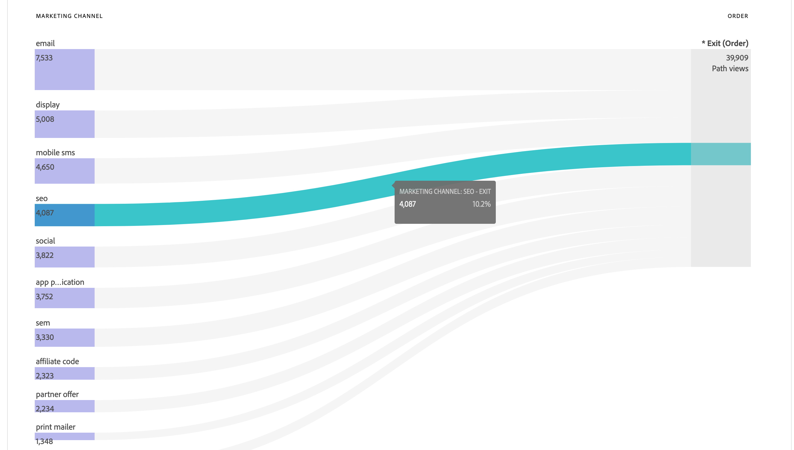

# Cas dʼutilisation des vues de données

Ces cas pratiques illustrent la flexibilité et la puissance des vues de données dans Customer Journey Analytics.

## Utiliser des mesures de dimensions de liaison

Voir le cas d’utilisation [ Utiliser des mesures de dimensions de liaison ](binding-dimensions-metrics.md) pour plus d’informations.

## Utiliser des données de résumé

Voir le cas d’utilisation [Utilisation des données de résumé](summary-data.md) pour plus d’informations.

## Cas d’utilisation de l’extension BI

Consultez les cas d’utilisation de l’extension [BI](bi-extension-usecases.md) sur la manière d’accomplir un certain nombre de cas d’utilisation à l’aide de l’extension Customer Journey Analytics BI.

## Création d’une mesure à partir d’un champ de schéma de chaîne {#string}

Par exemple, lors de la création d’une vue de données, vous pouvez créer une mesure [!UICONTROL Commandes] à partir d’un champ de schéma [!UICONTROL Titre de la page] qui est une chaîne.

1. Dans l’onglet **[!UICONTROL Composants]**, faites glisser le **[!UICONTROL Titre de la page]** dans la section **[!UICONTROL Mesures]** sous [!UICONTROL Composants inclus].
1. Mettez en surbrillance la mesure que vous venez de faire glisser et renommez-la en `Orders` dans les **[!UICONTROL Paramètres des composants]** sur .
1. Ouvrez la section **[!UICONTROL Inclure/exclure des valeurs]** et spécifiez ce qui suit :
   1. Activez **[!UICONTROL Définir les valeurs d’inclusion et d’exclusion]**.
   1. Sélectionnez **[!UICONTROL Si tous les critères sont satisfaits]** dans **[!UICONTROL Correspondre]**.
   1. Spécifiez `confirmation`. Ce texte pour page_title indique que cette page est liée au passage d’une commande. Une fois que vous avez examiné tous les titres de page répondant à ces critères, un `1` est comptabilisé pour chaque instance. Le résultat est une nouvelle mesure (qui n’est pas une mesure calculée). Une mesure qui a inclus/exclu des valeurs peut être utilisée partout où une autre mesure peut être utilisée. Il fonctionne avec Attribution IQ, les segments et partout ailleurs où vous pouvez utiliser des mesures standard.

   {width=100%}
1. Vous pouvez également définir un modèle dʼattribution pour cette mesure, tel que [!UICONTROL Dernière touche], avec un [!UICONTROL intervalle de recherche en amont] de [!UICONTROL Session].
Vous pouvez également créer une autre mesure [!UICONTROL Commandes] à partir du même champ et spécifier un autre modèle d’attribution. Par exemple, [!UICONTROL Première touche] et un autre [!UICONTROL Intervalle de recherche en amont], tel que [!UICONTROL 30 jours].

Un autre exemple consisterait à utiliser l’ID de personne, une dimension, comme mesure pour déterminer le nombre d’ID de personne dont dispose votre entreprise.

## Utilisation de nombres entiers en tant que dimensions {#integers}

Auparavant, les entiers étaient automatiquement traités comme des mesures dans Customer Journey Analytics. Désormais, les données numériques (y compris les événements personnalisés dʼAdobe Analytics) peuvent être traités comme des dimensions. Voici un exemple :

1. Faites glisser l’entier **[!UICONTROL Duration]** dans la section **[!UICONTROL Dimensions]** sous [!UICONTROL Composants inclus] :
1. Vous pouvez maintenant ajouter lʼoption **[!UICONTROL Regroupement des valeurs]** afin de présenter cette dimension de manière regroupée dans le compte rendu des performances. Sans regroupement, chaque instance de cette dimension s’afficherait en tant qu’élément de ligne dans les rapports Workspace.
   {width=100%}

## Utiliser des dimensions numériques en tant que mesures dans les diagrammes de flux {#numeric}

Vous pouvez utiliser une dimension numérique pour obtenir des mesures dans votre visualisation Flux de .

1. Sous lʼonglet [Composants](https://experienceleague.adobe.com/fr/docs/analytics-platform/using/cja-dataviews/create-dataview) dans les Vues de données, faites glisser le champ de schéma [!UICONTROL Canaux marketing] dans la zone [!UICONTROL Mesures] sous [!UICONTROL Composants inclus].
2. Dans le compte rendu des performances Espace de travail, ce flux affiche les [!UICONTROL Canaux marketing] qui convergent vers les [!UICONTROL Commandes] :

## Filtrage des sous-événements {#sub-event}

Cette fonctionnalité s’applique spécifiquement aux champs basés sur des tableaux. La fonctionnalité d’inclusion/exclusion vous permet de filtrer au niveau des sous-événements, tandis que les filtres (segments) créés dans le créateur de filtres vous donnent uniquement un filtrage au niveau des événements. Vous pouvez donc filtrer les sous-événements à l’aide de l’option Inclure/exclure dans les vues de données , puis référencer cette nouvelle mesure/dimension dans un filtre au niveau de l’événement.

Par exemple, utilisez la fonctionnalité d’inclusion/exclusion dans les vues de données pour vous concentrer uniquement sur les produits qui ont généré des ventes de plus de 50 $. Ainsi, si vous avez une commande qui comprend un achat de produit à 50 $ et un achat de produit à 25 $, la fonctionnalité d’inclusion/exclusion supprime l’achat du produit à 25 $, et non la commande entière.

1. Sous lʼonglet [Composants](https://experienceleague.adobe.com/fr/docs/analytics-platform/using/cja-dataviews/create-dataview) dans les Vues de données, faites glisser le champ de schéma **[!UICONTROL Chiffre dʼaffaires]** dans la zone **[!UICONTROL Mesures]** sous [!UICONTROL Composants inclus].
1. Sélectionnez la mesure et configurez les éléments suivants sur le côté droit :
a. Sous **[!UICONTROL Format]**, sélectionnez **[!UICONTROL Devise]**.
b. Sous **[!UICONTROL Devise]**, sélectionnez **[!UICONTROL USD]**.
c. Sous **[!UICONTROL Inclure/Exclure des valeurs]**, cochez la case en regard de **[!UICONTROL Définir des valeurs dʼinclusion/exclusion]**.
d. Sous **[!UICONTROL Correspond à]**, sélectionnez **[!UICONTROL Si tous les critères sont remplis]**.
e. Sous **[!UICONTROL Critères]**, sélectionnez **[!UICONTROL Est supérieur ou égal à]**.
f. Spécifiez `50` comme valeur.

Ces nouveaux paramètres vous permettent dʼafficher uniquement les chiffres dʼaffaires de grande valeur et de filtrer ceux inférieurs à 50 $.

## Utiliser le paramètre [!UICONTROL Aucune option de valeur] {#no-value}

Votre entreprise a peut-être passé du temps à former vos utilisateurs pour qu’ils s’attendent à des dimensions « Non spécifiées » dans les rapports. La valeur par défaut pour les dimensions dans les vues de données est « Aucune valeur ». Cependant, vous pouvez spécifier comment Aucune valeur ne doit être signalée pour chaque dimension. Consultez les options Aucune valeur pour un composant de dimension.

{width=100%}

## Création de plusieurs mesures avec différents paramètres d’attribution {#attribution}

À l’aide de la fonction **[!UICONTROL Dupliquer]** en haut à droite, pour créer un certain nombre de mesures Chiffre d’affaires total avec différents paramètres d’attribution tels que **[!UICONTROL Première touche]**, **[!UICONTROL Dernière touche]** et **[!UICONTROL Algorithmique]**.

N’oubliez pas de renommer chaque mesure pour tenir compte des différences, par exemple `Total Revenue (Algorithmic)`

{width=100%}

Pour plus dʼinformations sur les autres paramètres de vues de données, voir [Création de vues de données](/help/data-views/create-dataview.md).
Pour un aperçu conceptuel des vues de données, voir [Présentation des vues de données](/help/data-views/data-views.md).

## Rapports sur les nouvelles sessions et les sessions récurrentes {#new-repeat}

Vous pouvez déterminer si une session est bien la toute première session d’un utilisateur ou une session récurrente. En fonction de l’intervalle de création de rapports que vous avez défini pour cette vue de données et d’un intervalle de recherche en amont de 13 mois. Ces rapports permettent, entre autres, de répondre aux questions suivantes :

* Quel pourcentage de vos commandes provient de nouvelles sessions ou de sessions récurrentes ?

* Pour un canal marketing ou une campagne spécifique, ciblez-vous les nouveaux utilisateurs ou les utilisateurs récurrents ? Comment ce choix influence-t-il les taux de conversion ?

Une dimension et deux mesures facilitent cette création de rapports :

* [Type de session](https://experienceleague.adobe.com/en/docs/analytics-platform/using/cja-dataviews/component-reference) - Cette dimension possède deux valeurs : [!UICONTROL Nouveau] et [!UICONTROL Récurrent]. L’élément de ligne [!UICONTROL Nouveau] comprend tout le comportement (c’est-à-dire les mesures par rapport à cette dimension) d’une session déterminée comme étant la première session définie d’une personne. Tous les autres éléments sont inclus dans l’élément de ligne [!UICONTROL Récurrent] (en supposant que tous ceux-ci appartiennent à une session). Les mesures qui ne font partie d’aucune session se retrouvent dans le compartiment « Non applicable » pour cette dimension.

* [Premières sessions](https://experienceleague.adobe.com/en/docs/analytics-platform/using/cja-dataviews/component-reference) La mesure Premières sessions est définie comme la première session d’une personne dans la fenêtre de création de rapports.

* [Sessions récurrentes](https://experienceleague.adobe.com/en/docs/analytics-platform/using/cja-dataviews/component-reference) la mesure Sessions récurrentes correspond au nombre de sessions qui n’ont pas été la première session d’une personne.—>

Pour accéder aux composants :

1. Accédez à l’Éditeur de vue de données.
1. Sélectionnez l’onglet **[!UICONTROL Composants]** puis sélectionnez **[!UICONTROL Composants standard]** dans le rail de gauche.
1. Faites glisser les composants **[!UICONTROL Type de session]**, **[!UICONTROL Premières sessions]** et **[!UICONTROL Sessions récurrentes]** dans votre vue de données.

Les nouvelles sessions sont presque toujours rapportées avec précision. Ces exceptions sont les suivantes :

* Lorsqu’une première session s’est produite avant l’intervalle de recherche en amont de 13 mois.  Cette session est ignorée.

* Lorsqu’une session s’étend à la fois sur l’intervalle de recherche en amont et le créneau de rapport.  Par exemple, vous exécutez un rapport du 1er au 15 juin 2022. L’intervalle de recherche en amont s’étend du 1er mai 2021 au 31 mai 2022. Si une session commence le 30 mai 2022 et se termine le 1er juin 2022, elle est incluse dans l’intervalle de recherche en amont. Et toutes les sessions dans la fenêtre de rapport sont comptabilisées comme des sessions récurrentes.

## Utiliser la fonctionnalité Date et Date et heure {#date}

Les schémas d’Adobe Experience Platform contiennent des champs [!UICONTROL Date] et [!UICONTROL Date et heure]. Les vues de données Customer Journey Analytics prennent désormais en charge ces champs. Lorsque vous faites glisser ces champs dans une vue de données en tant que dimension, vous pouvez spécifier leur [format](/help/data-views/component-settings/format.md). Ce paramètre de format détermine l’affichage des champs dans les rapports. Par exemple :

* Pour le format de date, si vous sélectionnez **[!UICONTROL Jour]** dans le format **[!UICONTROL Jour, mois, année]**, la date s’affiche de la manière suivante dans les rapports : 23 août 2022.

* Pour le format de date et heure, si vous sélectionnez **[!UICONTROL Minute de la journée]** dans le format **[!UICONTROL Heure:minute]**, l’heure s’affiche de la manière suivante : 20:20.

Les dates postérieures au 1er janvier 1900 (à l’exception du 1er janvier 1970) et les valeurs de date et d’heure postérieures au 1er janvier 2000 00:00:00 sont prises en charge.

### Cas d’utilisation de date et date-heure

* Date : une agence de voyages collecte la date de départ des voyages dans un champ de leurs données. L’entreprise souhaite disposer d’un rapport comparant le [!UICONTROL  Jour de la semaine ] pour toutes les dates de départ collectées afin de déterminer laquelle est la plus populaire. Et la société aimerait faire de même pour le [!UICONTROL Mois de l’année].

* Date et heure : une société de vente au détail collecte l’heure de chacun de ses achats dans les points de vente (POS). Sur un mois donné, l’entreprise souhaite déterminer les périodes de plus forte affluence en [!UICONTROL Heure de la journée].

>[!MORELIKETHIS]
>
>[ Date et Date et heure dans le paramètre du composant Format ](/help/data-views/component-settings/format.md)
>

