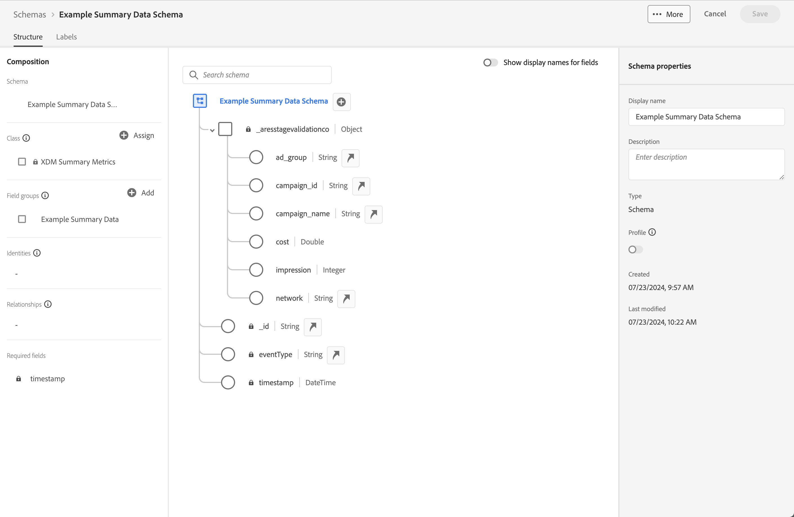

# Utiliser des données de résumé

Ce cas pratique a pour but de vous aider à comprendre comment utiliser les données de synthèse dans vos rapports et analyses. Le cas d’utilisation détaille toutes les étapes requises pour utiliser les données de résumé dans Customer Journey Analytics :

- [Ingérer](#ingest) données de résumé et autres sources de données dans Experience Platform.
- Configurez votre [Connexion](#connection) pour les données de résumé et d’autres sources de données.
- Configurez votre [vue de données](#data-view) pour combiner vos sources de données.
- Effectuez un rapport et une analyse dans [Workspace](#workspace) sur vos données combinées.

Le cas d’utilisation fournit des exemples de données pour les données de résumé, les données d’événement et les données de recherche. Toutes les données contiennent des valeurs aléatoires.

## Ingestion

Vous utilisez les exemples de données de résumé suivants pour ce cas d’utilisation, qui montrent les données de résumé pour l’exécution de campagnes sur Facebook.

+++Données de résumé

| _id | nom_campagne | coût | impression | campaign_id | network | ad_group | timestamp |
|---|---|---:|---:|---|---|---|---|
| 1 | Campagne 123 | 100 | 5 000 | abc123 | facebook | abc-adgroup | 2024-07-18T18:20:39.000Z |
| 2 | Campagne 123 | 50 | 4 000 | def123 | facebook | def-adgroup | 2024-07-18T18:20:39.000Z |
| 3 | Campagne 123 | 125 | 6000 | ghi123 | facebook | ghi-adgroup | 2024-07-18T18:20:39.000Z |
| 4 | Campagne 456 | 25 | 2500 | abc456 | facebook | abc-adgroup | 2024-07-18T18:20:39.000Z |
| 5 | Campagne 456 | 10 | 1 000 | def456 | facebook | def-adgroup | 2024-07-18T18:20:39.000Z |
| 6 | Campagne 456 | 115 | 5500 | ghi456 | facebook | ghi-adgroup | 2024-07-18T18:20:39.000Z |
| 7 | Campagne 789 | 200 | 9000 | abc789 | facebook | abc-adgroup | 2024-07-18T18:20:39.000Z |
| 8 | Campagne 789 | 20 | 2 000 | def789 | facebook | def-adgroup | 2024-07-18T18:20:39.000Z |
| 9 | Campagne 789 | 225 | 12000 | ghi789 | facebook | ghi-adgroup | 2024-07-18T18:20:39.000Z |
| 10 | Campagne 987 | 125 | 10000 | abc987 | facebook | abc-adgroup | 2024-07-18T18:20:39.000Z |
| 11 | Campagne 987 | 120 | 15000 | def987 | facebook | def-adgroup | 2024-07-18T18:20:39.000Z |
| 12 | Campagne 987 | 315 | 22500 | ghi987 | facebook | ghi-adgroup | 2024-07-18T18:20:39.000Z |
| 13 | Campagne 654 | 325 | 20000 | abc654 | facebook | abc-adgroup | 2024-07-18T18:20:39.000Z |
| 14 | Campagne 654 | 320 | 25000 | def654 | facebook | def-adgroup | 2024-07-18T18:20:39.000Z |
| 15 | Campagne 654 | 315 | 22500 | ghi654 | facebook | ghi-adgroup | 2024-07-18T18:20:39.000Z |
| 16 | Campagne 321 | 25 | 2 000 | abc321 | facebook | abc-adgroup | 2024-07-18T18:20:39.000Z |
| 17 | Campagne 321 | 20 | 2500 | def321 | facebook | def-adgroup | 2024-07-18T18:20:39.000Z |
| 18 | Campagne 321 | 15 | 2250 | ghi321 | facebook | ghi-adgroup | 2024-07-18T18:20:39.000Z |

+++

Pour utiliser les données de synthèse dans Customer Journey Analytics, dans un rapport ou dans le cadre de l&#39;analyse des données dans Workspace, vous avez besoin des éléments suivants :

- un schéma de synthèse dans Experience Platform,
- un jeu de données de résumé dans Experience Platform,
- une connexion dans Customer Journey Analytics configurée pour utiliser le jeu de données de résumé,
- une vue de données dans Customer Journey Analytics correctement configurée avec des mesures et des dimensions pour les données de résumé.

Vous utilisez ces données de résumé avec un jeu de données pour les données d’événement et un jeu de données pour les données de recherche.

+++Données d’événement

Les données d’événement sont disponibles dans l’exemple de jeu de données d’événement. Les exemples de données se présentent comme suit :

| timestamp | _id | page_name | person_id | tracking_code | commandes | revenue_amount |
|---|---:|---|---|---|---:|---:|
| 2024-07-18T19:15:39+00:00 | 1 | Page d’accueil | person-1abc123 | abc123 |  |  |
| 2024-07-18T19:15:39+00:00 | 2 | page de confirmation | person-1abc123 |  | 1 | 174,25 |
| 2024-07-18T19:15:39+00:00 | 3 | Page d’accueil | person-2def123 | def123 |  |  |
| 2024-07-18T19:15:39+00:00 | 4 | Page d’accueil | person-3ghi123 | ghi123 |  |  |
| 2024-07-18T19:15:39+00:00 | 5 | page de confirmation | person-3ghi123 |  | 1 | 149,25 |
| 2024-07-18T19:15:39+00:00 | 6 | Page d’accueil | person-4abc456 | abc456 |  |  |
| 2024-07-18T19:15:39+00:00 | 7 | Page d’accueil | person-5def456 | def456 |  |  |
| 2024-07-18T19:15:39+00:00 | 8 | Page d’accueil | person-6ghi456 | ghi456 |  |  |
| 2024-07-18T19:15:39+00:00 | 9 | page de confirmation | person-6ghi456 |  | 1 | 159,25 |
| 2024-07-18T19:15:39+00:00 | 10 | Page d’accueil | person-7abc789 | abc789 |  |  |
| 2024-07-18T19:15:39+00:00 | 11 | Page d’accueil | person-8def789 | def789 |  |  |
| 2024-07-18T19:15:39+00:00 | 12 | Page d’accueil | person-9ghi789 | ghi789 |  |  |
| 2024-07-18T19:15:39+00:00 | 13 | page de confirmation | person-9ghi789 |  | 1 | 124,25 |
| 2024-07-18T19:15:39+00:00 | 14 | Page d’accueil | person-10abc987 | abc987 |  |  |
| 2024-07-18T19:15:39+00:00 | 15 | Page d’accueil | person-11def987 | def987 |  |  |
| 2024-07-18T19:15:39+00:00 | 16 | Page d’accueil | person-12ghi987 | ghi987 |  |  |
| 2024-07-18T19:15:39+00:00 | 17 | Page d’accueil | person-13abc654 | abc654 |  |  |
| 2024-07-18T19:15:39+00:00 | 18 | Page d’accueil | person-14def654 | def654 |  |  |
| 2024-07-18T19:15:39+00:00 | 19 | Page d’accueil | person-15ghi654 | ghi654 |  |  |
| 2024-07-18T19:15:39+00:00 | 20 | page de confirmation | person-15ghi654 |  | 1 | 174,25 |
| 2024-07-18T19:15:39+00:00 | 21 | Page d’accueil | person-16abc321 | abc321 |  |  |
| 2024-07-18T19:15:39+00:00 | 22 | Page d’accueil | person-17def321 | def321 |  |  |
| 2024-07-18T19:15:39+00:00 | 23 | Page d’accueil | person-18ghi321 | ghi321 |  |  |
| 2024-07-18T19:15:39+00:00 | 24 | Page d’accueil | person-19abc123 | abc123 |  |  |
| 2024-07-18T19:15:39+00:00 | 25 | Page d’accueil | person-20def123 | def123 |  |  |
| 2024-07-18T19:15:39+00:00 | 26 | Page d’accueil | person-21ghi123 | ghi123 |  |  |
| 2024-07-18T19:15:39+00:00 | 27 | page de confirmation | person-21ghi123 |  | 1 | 149,25 |
| 2024-07-18T19:15:39+00:00 | 28 | Page d’accueil | person-22abc456 | abc456 |  |  |
| 2024-07-18T19:15:39+00:00 | 29 | Page d’accueil | person-23def456 | def456 |  |  |
| 2024-07-18T19:15:39+00:00 | 30 | Page d’accueil | person-24ghi456 | ghi456 |  |  |
| 2024-07-18T19:15:39+00:00 | 31 | Page d’accueil | person-25abc789 | abc789 |  |  |
| 2024-07-18T19:15:39+00:00 | 32 | page de confirmation | person-25abc789 |  | 1 | 139,25 |
| 2024-07-18T19:15:39+00:00 | 33 | Page d’accueil | person-26abc987 | abc987 |  |  |
| 2024-07-18T19:15:39+00:00 | 34 | Page d’accueil | person-27def987 | def987 |  |  |
| 2024-07-18T19:15:39+00:00 | 35 | Page d’accueil | person-28ghi987 | ghi987 |  |  |
| 2024-07-18T19:15:39+00:00 | 36 | Page d’accueil | person-29abc654 | abc654 |  |  |
| 2024-07-18T19:15:39+00:00 | 37 | page de confirmation | person-29abc654 |  | 1 | 124,25 |
| 2024-07-18T19:15:39+00:00 | 38 | Page d’accueil | person-30def654 | def654 |  |  |
| 2024-07-18T19:15:39+00:00 | 39 | Page d’accueil | person-31ghi654 | ghi654 |  |  |
| 2024-07-18T19:15:39+00:00 | 40 | Page d’accueil | person-32abc321 | abc321 |  |  |
| 2024-07-18T19:15:39+00:00 | 41 | Page d’accueil | person-33ghi456 | ghi456 |  |  |
| 2024-07-18T19:15:39+00:00 | 42 | page de confirmation | person-33ghi456 |  | 1 | 174,25 |
| 2024-07-18T19:15:39+00:00 | 43 | Page d’accueil | person-34abc789 | abc789 |  |  |
| 2024-07-18T19:15:39+00:00 | 44 | Page d’accueil | person-35def789 | def789 |  |  |
| 2024-07-18T19:15:39+00:00 | 45 | Page d’accueil | person-36ghi789 | ghi789 |  |  |
| 2024-07-18T19:15:39+00:00 | 46 | page de confirmation | person-36ghi789 |  | 1 | 149,25 |
| 2024-07-18T19:15:39+00:00 | 47 | Page d’accueil | person-37abc987 | abc987 |  |  |
| 2024-07-18T19:15:39+00:00 | 48 | Page d’accueil | person-38def987 | def987 |  |  |
| 2024-07-18T19:15:39+00:00 | 49 | Page d’accueil | person-39ghi987 | ghi987 |  |  |
| 2024-07-18T19:15:39+00:00 | 50 | Page d’accueil | person-40abc654 | abc654 |  |  |
| 2024-07-18T19:15:39+00:00 | 51 | page de confirmation | person-40abc654 |  | 1 | 124,25 |
| 2024-07-18T19:15:39+00:00 | 52 | Page d’accueil | person-41def654 | def654 |  |  |
| 2024-07-18T19:15:39+00:00 | 53 | Page d’accueil | person-42ghi654 | ghi654 |  |  |
| 2024-07-18T19:15:39+00:00 | 54 | Page d’accueil | person-43abc321 | abc321 |  |  |
| 2024-07-18T19:15:39+00:00 | 55 | Page d’accueil | person-44def321 | def321 |  |  |
| 2024-07-18T19:15:39+00:00 | 56 | Page d’accueil | person-45ghi321 | ghi321 |  |  |
| 2024-07-18T19:15:39+00:00 | 57 | Page d’accueil | person-46abc123 | abc123 |  |  |
| 2024-07-18T19:15:39+00:00 | 58 | page de confirmation | person-46abc123 |  | 1 | 174,25 |
| 2024-07-18T19:15:39+00:00 | 59 | Page d’accueil | person-47def123 | def123 |  |  |
| 2024-07-18T19:15:39+00:00 | 60 | Page d’accueil | person-48ghi123 | ghi123 |  |  |
| 2024-07-18T19:15:39+00:00 | 61 | Page d’accueil | person-49abc456 | abc456 |  |  |
| 2024-07-18T19:15:39+00:00 | 62 | Page d’accueil | person-50def456 | def456 |  |  |
| 2024-07-18T19:15:39+00:00 | 63 | Page d’accueil | person-51ghi456 | ghi456 |  |  |
| 2024-07-18T19:15:39+00:00 | 64 | Page d’accueil | person-52abc789 | abc789 |  |  |
| 2024-07-18T19:15:39+00:00 | 65 | page de confirmation | person-52abc789 |  | 1 | 149,25 |
| 2024-07-18T19:15:39+00:00 | 66 | Page d’accueil | person-53abc987 | abc987 |  |  |
| 2024-07-18T19:15:39+00:00 | 67 | Page d’accueil | person-54def987 | def987 |  |  |
| 2024-07-18T19:15:39+00:00 | 68 | Page d’accueil | person-55ghi987 | ghi987 |  |  |
| 2024-07-18T19:15:39+00:00 | 69 | page de confirmation | person-55ghi987 |  | 1 | 124,25 |
| 2024-07-18T19:15:39+00:00 | 70 | Page d’accueil | person-56abc123 | abc123 |  |  |
| 2024-07-18T19:15:39+00:00 | 71 | Page d’accueil | person-57def123 | def123 |  |  |
| 2024-07-18T19:15:39+00:00 | 72 | page de confirmation | person-57def123 |  | 1 | 174,25 |
| 2024-07-18T19:15:39+00:00 | 73 | Page d’accueil | person-58ghi123 | ghi123 |  |  |
| 2024-07-18T19:15:39+00:00 | 74 | Page d’accueil | person-59abc456 | abc456 |  |  |
| 2024-07-18T19:15:39+00:00 | 75 | page de confirmation | person-59abc456 |  | 1 | 149,25 |
| 2024-07-18T19:15:39+00:00 | 76 | Page d’accueil | person-60def456 | def456 |  |  |
| 2024-07-18T19:15:39+00:00 | 77 | Page d’accueil | person-61ghi456 | ghi456 |  |  |
| 2024-07-18T19:15:39+00:00 | 78 | Page d’accueil | person-62abc789 | abc789 |  |  |
| 2024-07-18T19:15:39+00:00 | 79 | page de confirmation | person-62abc789 |  | 1 | 159,25 |
| 2024-07-18T19:15:39+00:00 | 80 | Page d’accueil | person-63def789 | def789 |  |  |
| 2024-07-18T19:15:39+00:00 | 81 | Page d’accueil | person-64ghi789 | ghi789 |  |  |
| 2024-07-18T19:15:39+00:00 | 82 | Page d’accueil | person-65abc987 | abc987 |  |  |
| 2024-07-18T19:15:39+00:00 | 83 | page de confirmation | person-65abc987 |  | 1 | 124,25 |
| 2024-07-18T19:15:39+00:00 | 84 | Page d’accueil | person-66def987 | def987 |  |  |
| 2024-07-18T19:15:39+00:00 | 85 | Page d’accueil | person-67ghi987 | ghi987 |  |  |
| 2024-07-18T19:15:39+00:00 | 86 | Page d’accueil | person-68abc654 | abc654 |  |  |
| 2024-07-18T19:15:39+00:00 | 87 | Page d’accueil | person-69def654 | def654 |  |  |
| 2024-07-18T19:15:39+00:00 | 88 | Page d’accueil | person-70ghi654 | ghi654 |  |  |
| 2024-07-18T19:15:39+00:00 | 89 | Page d’accueil | person-71abc321 | abc321 |  |  |
| 2024-07-18T19:15:39+00:00 | 90 | page de confirmation | person-71abc321 |  | 1 | 174,25 |
| 2024-07-18T19:15:39+00:00 | 91 | Page d’accueil | person-72def321 | def321 |  |  |
| 2024-07-18T19:15:39+00:00 | 92 | Page d’accueil | person-73ghi321 | ghi321 |  |  |
| 2024-07-18T19:15:39+00:00 | 93 | Page d’accueil | person-74abc123 | abc123 |  |  |
| 2024-07-18T19:15:39+00:00 | 94 | Page d’accueil | person-75def123 | def123 |  |  |
| 2024-07-18T19:15:39+00:00 | 95 | Page d’accueil | person-76ghi123 | ghi123 |  |  |
| 2024-07-18T19:15:39+00:00 | 96 | Page d’accueil | person-77abc456 | abc456 |  |  |
| 2024-07-18T19:15:39+00:00 | 97 | page de confirmation | person-77abc456 |  | 1 | 149,25 |
| 2024-07-18T19:15:39+00:00 | 98 | Page d’accueil | person-78def456 | def456 |  |  |
| 2024-07-18T19:15:39+00:00 | 99 | Page d’accueil | person-79ghi456 | ghi456 |  |  |
| 2024-07-18T19:15:39+00:00 | 100 | Page d’accueil | person-80abc789 | abc789 |  |  |
| 2024-07-18T19:15:39+00:00 | 101 | Page d’accueil | person-81abc987 | abc987 |  |  |
| 2024-07-18T19:15:39+00:00 | 102 | page de confirmation | person-81abc987 |  | 1 | 139,25 |
| 2024-07-18T19:15:39+00:00 | 103 | Page d’accueil | person-82def987 | def987 |  |  |
| 2024-07-18T19:15:39+00:00 | 104 | Page d’accueil | person-83ghi987 | ghi987 |  |  |
| 2024-07-18T19:15:39+00:00 | 105 | Page d’accueil | person-84abc654 | abc654 |  |  |
| 2024-07-18T19:15:39+00:00 | 106 | Page d’accueil | person-85def654 | def654 |  |  |
| 2024-07-18T19:15:39+00:00 | 107 | page de confirmation | person-85def654 |  | 1 | 124,25 |
| 2024-07-18T19:15:39+00:00 | 108 | Page d’accueil | person-86ghi654 | ghi654 |  |  |
| 2024-07-18T19:15:39+00:00 | 109 | Page d’accueil | person-87abc321 | abc321 |  |  |
| 2024-07-18T19:15:39+00:00 | 110 | Page d’accueil | person-88ghi456 | ghi456 |  |  |
| 2024-07-18T19:15:39+00:00 | 111 | Page d’accueil | person-89abc789 | abc789 |  |  |
| 2024-07-18T19:15:39+00:00 | 112 | page de confirmation | person-89abc789 |  | 1 | 174,25 |
| 2024-07-18T19:15:39+00:00 | 113 | Page d’accueil | person-90def789 | def789 |  |  |
| 2024-07-18T19:15:39+00:00 | 114 | Page d’accueil | person-91ghi789 | ghi789 |  |  |
| 2024-07-18T19:15:39+00:00 | 115 | Page d’accueil | person-92abc987 | abc987 |  |  |
| 2024-07-18T19:15:39+00:00 | 116 | page de confirmation | person-92abc987 |  | 1 | 149,25 |
| 2024-07-18T19:15:39+00:00 | 117 | Page d’accueil | person-93def987 | def987 |  |  |
| 2024-07-18T19:15:39+00:00 | 118 | Page d’accueil | person-94ghi987 | ghi987 |  |  |
| 2024-07-18T19:15:39+00:00 | 119 | Page d’accueil | person-95abc654 | abc654 |  |  |
| 2024-07-18T19:15:39+00:00 | 120 | Page d’accueil | person-96def654 | def654 |  |  |
| 2024-07-18T19:15:39+00:00 | 121 | page de confirmation | person-96def654 |  | 1 | 124,25 |
| 2024-07-18T19:15:39+00:00 | 122 | Page d’accueil | person-97ghi654 | ghi654 |  |  |
| 2024-07-18T19:15:39+00:00 | 123 | Page d’accueil | person-98abc321 | abc321 |  |  |
| 2024-07-18T19:15:39+00:00 | 124 | Page d’accueil | person-99def321 | def321 |  |  |
| 2024-07-18T19:15:39+00:00 | 125 | Page d’accueil | person-100ghi321 | ghi321 |  |  |
| 2024-07-18T19:15:39+00:00 | 126 | Page d’accueil | person-101abc123 | abc123 |  |  |
| 2024-07-18T19:15:39+00:00 | 127 | Page d’accueil | person-102def123 | def123 |  |  |
| 2024-07-18T19:15:39+00:00 | 128 | page de confirmation | person-102def123 |  | 1 | 174,25 |
| 2024-07-18T19:15:39+00:00 | 129 | Page d’accueil | person-103ghi123 | ghi123 |  |  |
| 2024-07-18T19:15:39+00:00 | 130 | Page d’accueil | person-104abc456 | abc456 |  |  |
| 2024-07-18T19:15:39+00:00 | 131 | Page d’accueil | person-105def456 | def456 |  |  |
| 2024-07-18T19:15:39+00:00 | 132 | Page d’accueil | person-106ghi456 | ghi456 |  |  |
| 2024-07-18T19:15:39+00:00 | 133 | Page d’accueil | person-107abc789 | abc789 |  |  |
| 2024-07-18T19:15:39+00:00 | 134 | Page d’accueil | person-108abc987 | abc987 |  |  |
| 2024-07-18T19:15:39+00:00 | 135 | page de confirmation | person-108abc987 |  | 1 | 149,25 |
| 2024-07-18T19:15:39+00:00 | 136 | Page d’accueil | person-109def987 | def987 |  |  |
| 2024-07-18T19:15:39+00:00 | 137 | Page d’accueil | person-110ghi987 | ghi987 |  |  |
| 2024-07-18T19:15:39+00:00 | 138 | page de confirmation | person-110ghi987 |  |  |  |
| 2024-07-18T19:15:39+00:00 | 139 | Page d’accueil | person-111def987 | def987 |  |  |
| 2024-07-18T19:15:39+00:00 | 140 | Page d’accueil | person-112def987 |  | 1 | 124,25 |
| 2024-07-18T19:15:39+00:00 | 141 | page de confirmation | person-112def987 |  | 1 | 149,25 |
| 2024-07-18T19:15:39+00:00 | 142 | Page d’accueil | person-113ghi987 | ghi987 |  |  |
| 2024-07-18T19:15:39+00:00 | 143 | Page d’accueil | person-114abc654 | abc654 |  |  |
| 2024-07-18T19:15:39+00:00 | 144 | Page d’accueil | person-115def654 | def654 |  |  |
| 2024-07-18T19:15:39+00:00 | 145 | page de confirmation | person-115def654 |  | 1 | 159,25 |
| 2024-07-18T19:15:39+00:00 | 146 | Page d’accueil | person-116ghi654 | ghi654 |  |  |
| 2024-07-18T19:15:39+00:00 | 147 | Page d’accueil | person-117abc321 | abc321 |  |  |
| 2024-07-18T19:15:39+00:00 | 148 | Page d’accueil | person-118def321 | def321 |  |  |
| 2024-07-18T19:15:39+00:00 | 149 | page de confirmation | person-118def321 |  | 1 | 124,25 |
| 2024-07-18T19:15:39+00:00 | 150 | Page d’accueil | person-119ghi321 | ghi321 |  |  |
| 2024-07-18T19:15:39+00:00 | 151 | Page d’accueil | person-120abc123 | abc123 |  |  |
| 2024-07-18T19:15:39+00:00 | 152 | Page d’accueil | person-121def123 | def123 |  |  |
| 2024-07-18T19:15:39+00:00 | 153 | Page d’accueil | person-122ghi123 | ghi123 |  |  |
| 2024-07-18T19:15:39+00:00 | 154 | Page d’accueil | person-123abc456 | abc456 |  |  |
| 2024-07-18T19:15:39+00:00 | 155 | Page d’accueil | person-124def456 | def456 |  |  |
| 2024-07-18T19:15:39+00:00 | 156 | page de confirmation | person-124def456 |  | 1 | 174,25 |
| 2024-07-18T19:15:39+00:00 | 157 | Page d’accueil | person-125ghi456 | ghi456 |  |  |
| 2024-07-18T19:15:39+00:00 | 158 | Page d’accueil | person-126abc789 | abc789 |  |  |
| 2024-07-18T19:15:39+00:00 | 159 | Page d’accueil | person-127abc987 | abc987 |  |  |
| 2024-07-18T19:15:39+00:00 | 160 | Page d’accueil | person-128def987 | def987 |  |  |
| 2024-07-18T19:15:39+00:00 | 161 | Page d’accueil | person-129ghi987 | ghi987 |  |  |
| 2024-07-18T19:15:39+00:00 | 162 | Page d’accueil | person-130abc654 | abc654 |  |  |
| 2024-07-18T19:15:39+00:00 | 163 | page de confirmation | person-130abc654 |  | 1 | 149,25 |
| 2024-07-18T19:15:39+00:00 | 164 | Page d’accueil | person-131def654 | def654 |  |  |
| 2024-07-18T19:15:39+00:00 | 165 | Page d’accueil | person-132ghi654 | ghi654 |  |  |
| 2024-07-18T19:15:39+00:00 | 166 | Page d’accueil | person-133abc321 | abc321 |  |  |
| 2024-07-18T19:15:39+00:00 | 167 | Page d’accueil | person-134ghi456 | ghi456 |  |  |
| 2024-07-18T19:15:39+00:00 | 168 | page de confirmation | person-134ghi456 |  | 1 | 139,25 |
| 2024-07-18T19:15:39+00:00 | 169 | Page d’accueil | person-135abc789 | abc789 |  |  |
| 2024-07-18T19:15:39+00:00 | 170 | Page d’accueil | person-136def789 | def789 |  |  |
| 2024-07-18T19:15:39+00:00 | 171 | Page d’accueil | person-137ghi789 | ghi789 |  |  |
| 2024-07-18T19:15:39+00:00 | 172 | Page d’accueil | person-138abc987 | abc987 |  |  |
| 2024-07-18T19:15:39+00:00 | 173 | page de confirmation | person-138abc987 |  | 1 | 124,25 |
| 2024-07-18T19:15:39+00:00 | 174 | Page d’accueil | person-139def987 | def987 |  |  |
| 2024-07-18T19:15:39+00:00 | 175 | Page d’accueil | person-140ghi987 | ghi987 |  |  |
| 2024-07-18T19:15:39+00:00 | 176 | Page d’accueil | person-141abc654 | abc654 |  |  |
| 2024-07-18T19:15:39+00:00 | 177 | Page d’accueil | person-142def654 | def654 |  |  |
| 2024-07-18T19:15:39+00:00 | 178 | page de confirmation | person-142def654 |  | 1 | 174,25 |
| 2024-07-18T19:15:39+00:00 | 179 | Page d’accueil | person-143ghi654 | ghi654 |  |  |

+++

+++ Données de recherche

Les données de recherche sont disponibles dans l’exemple de jeu de données de recherche. Les exemples de données se présentent comme suit :

| _id | tracking_code | ad_group | nom_campagne |
|---|---|---|---|
| 1 | abc123 | abc-adgroup | Campagne 123 |
| 2 | def123 | def-adgroup | Campagne 123 |
| 3 | ghi123 | ghi-adgroup | Campagne 123 |
| 4 | abc456 | abc-adgroup | Campagne 456 |
| 5 | def456 | def-adgroup | Campagne 456 |
| 6 | ghi456 | ghi-adgroup | Campagne 456 |
| 7 | abc789 | abc-adgroup | Campagne 789 |
| 8 | def789 | def-adgroup | Campagne 789 |
| 9 | ghi789 | ghi-adgroup | Campagne 789 |
| 10 | abc987 | abc-adgroup | Campagne 987 |
| 11 | def987 | def-adgroup | Campagne 987 |
| 12 | ghi987 | ghi-adgroup | Campagne 987 |
| 13 | abc654 | abc-adgroup | Campagne 654 |
| 14 | def654 | def-adgroup | Campagne 654 |
| 15 | ghi654 | ghi-adgroup | Campagne 654 |
| 16 | abc321 | abc-adgroup | Campagne 321 |
| 17 | def321 | def-adgroup | Campagne 321 |
| 18 | ghi321 | ghi-adgroup | Campagne 321 |

+++

>[!INFO]
>
>Des détails supplémentaires sur la configuration des schémas et des jeux de données pour les données d’événement et de recherche ne sont pas fournis. Cette configuration est supposée être de notoriété publique et suit les mêmes étapes que pour les données de recherche.
>

### Schéma récapitulatif

Un schéma récapitulatif des données est nécessaire dans Experience Platform. Un schéma récapitulatif est un schéma qui utilise les mesures récapitulatives XDM comme classe de base.

Pour créer un schéma de synthèse dans Experience Platform :

1. Sélectionnez **[!UICONTROL Experience Platform]** dans le champ      sélecteur d’applications.
1. Sélectionnez **[!UICONTROL Schémas]** dans le rail de gauche.
1. Sélectionnez  **[!UICONTROL Create schema]**.
1. Sélectionnez **[!UICONTROL Manuel]** dans la boîte de dialogue **[!UICONTROL Créer un schéma]**. Utilisez ensuite **[!UICONTROL Sélectionner]** pour continuer.
1. À l’étape **[!UICONTROL Sélectionner une classe]** de l’assistant **[!UICONTROL Schémas]** > **[!UICONTROL Créer un schéma]**, sélectionnez **[!UICONTROL Autre]** dans les options **[!UICONTROL Sélectionner une classe de base pour ce schéma]**.
1. Dans la liste, sélectionnez **[!UICONTROL Mesures récapitulatives XDM]** (ou utilisez le champ  pour rechercher) et sélectionnez **[!UICONTROL Suivant]**.
1. À l’étape **[!UICONTROL Nom et révision]** de l’assistant **[!UICONTROL Schémas]** > **[!UICONTROL Créer un schéma]**, saisissez un nom d’affichage **[!UICONTROL Schéma]**, par exemple `Example Summary Data Schema` et une description facultative. Sélectionnez **[!UICONTROL Terminer]** pour terminer cette étape.

La structure de votre schéma de résumé de base s’affiche, prête à être complétée par les champs de vos données de résumé. Vous ajoutez des champs à un schéma à l’aide de groupes de champs.

Pour ajouter un groupe de champs contenant les champs de vos données d’exemple :

1. Sélectionnez  **[!UICONTROL Add]** dans **[!UICONTROL Groupes de champs]**.
1. Dans la boîte de dialogue **[!UICONTROL Ajouter des groupes de champs]**, sélectionnez **[!UICONTROL Créer un groupe de champs]**.
1. Saisissez un **[!UICONTROL Nom d’affichage]** pour le groupe de champs, par exemple `Example Summary Data`. Fournissez éventuellement une description.
1. Sélectionnez **[!UICONTROL Ajouter des groupes de champs]**.
1. Vous êtes de retour dans l’interface utilisateur de la structure du schéma. Sélectionnez le nouveau **[!UICONTROL Exemple de données récapitulatives]** dans **[!UICONTROL Groupes de champs]**.
1. Sélectionnez le  en regard du nom du schéma **[!UICONTROL Exemple de schéma de données de résumé]**. Un panneau **[!UICONTROL Propriétés du champ]** s’ouvre, vous permettant d’ajouter des détails pour un champ.
   1. Saisissez un **[!UICONTROL Nom du champ]** : `campaign_id`
   1. Saisissez un **[!UICONTROL Nom d’affichage]** : `campaign_id`
   1. Sélectionnez un **[!UICONTROL Type]** dans le menu déroulant **[!UICONTROL Sélectionner le type de données]** : **[!UICONTROL Chaîne]**
   1. Assurez-vous que **[!UICONTROL Affecter à]** **[!UICONTROL Groupe de champs]** est sélectionné, puis sélectionnez **[!UICONTROL Exemple de données de résumé]** dans le menu déroulant.
   1. Faites défiler jusqu’en bas, puis sélectionnez **[!UICONTROL Appliquer]**.
1. Répétez l&#39;étape précédente pour les autres champs des données récapitulatives. Consultez le tableau ci-dessous pour connaître les valeurs correctes.

   | Nom du champ | Nom d’affichage | Type | Groupe de champs |
   |---|---|---|---|
   | `ad_group` | `ad_group` | Chaîne | Exemple de données récapitulatives |
   | `campaign_name` | `campaign_name` | Chaîne | Exemple de données récapitulatives |
   | `cost` | `cost` | Double | Exemple de données récapitulatives |
   | `impression` | `impression` | Nombre entier | Exemple de données récapitulatives |
   | `network` | `network` | Chaîne | Exemple de données récapitulatives |

1. Pour enregistrer votre groupe de champs **[!UICONTROL Exemple de données récapitulatives]** dans le cadre de votre schéma, sélectionnez **[!UICONTROL Enregistrer]**. Une confirmation s’affiche lorsque votre schéma est correctement enregistré.

Vous avez maintenant défini un schéma qui détaille le modèle de vos données récapitulatives. Similaire à celui ci-dessous.

### Jeu de données de résumé

Pour stocker vos données de résumé dans Experience Platform, vous devez d’abord créer un jeu de données, puis charger vos données de résumé dans le jeu de données.

Pour créer un jeu de données, procédez comme suit :

1. Sélectionnez **[!UICONTROL Experience Platform]** dans le champ      sélecteur d’applications.
1. Sélectionnez **[!UICONTROL Jeux de données]** dans le rail de gauche.
1. Sélectionnez  **[!UICONTROL Créer un jeu de données]**.
1. Dans l’écran **[!UICONTROL Jeux de données]** > **[!UICONTROL Créer des jeux de données]**, sélectionnez **[!UICONTROL Créer un jeu de données à partir d’un schéma]**.
1. À l’étape **[!UICONTROL Sélectionner un schéma]** de l’assistant **[!UICONTROL Workflows]** > **[!UICONTROL Créer un jeu de données à partir d’un schéma]**,  recherchez et sélectionnez votre **[!UICONTROL Exemple de schéma de données de résumé]**.
1. Sélectionnez **[!UICONTROL Suivant]**.
1. À l’étape **[!UICONTROL Configurer le jeu de données]** de l’assistant **[!UICONTROL Workflows]** > **[!UICONTROL Créer un jeu de données à partir d’un schéma]** :
   1. Saisissez un **[!UICONTROL Nom]** pour le jeu de données, par exemple : `Example Summary Data Dataset`. Fournissez éventuellement une description.
   1. Sélectionnez **[!UICONTROL Terminer]**.

Un écran affiche les détails de votre nouveau jeu de données.

Pour charger vos données d’exemple dans ce jeu de données :

1. Sélectionnez **[!UICONTROL Experience Platform]** dans le champ      sélecteur d’applications.
1. Sélectionnez **[!UICONTROL Workflows]** dans le rail de gauche.
   1. Sélectionnez **[!UICONTROL Mapper CSV à un schéma XDM]** dans les options **[!UICONTROL Ingestion des données]** de l’écran **[!UICONTROL Workflows]**.
   1. Sélectionnez **[!UICONTROL Launch]** dans le panneau **[!UICONTROL Mapper CSV à un schéma XDM]**.
1. À l’étape **[!UICONTROL Détails du flux de données]** de l’assistant **[!UICONTROL Workflows]** > **[!UICONTROL Mapper CSV à un schéma XDM]** :
   1. Sélectionnez **[!UICONTROL Jeu de données existant]** pour **[!UICONTROL Jeu de données cible]**.
   1. Sélectionnez **[!UICONTROL Exemple de jeu de données de résumé]** dans le menu déroulant.
   1. Sélectionnez **[!UICONTROL Suivant]**.
1. À l’étape **[!UICONTROL Sélectionner des données]** de l’assistant **[!UICONTROL Workflows]** > **[!UICONTROL Mapper CSV à un schéma XDM]** :
   1. Effectuez un glisser-déposer de votre fichier avec des données récapitulatives au format CSV dans **[!UICONTROL Glisser-déposer des fichiers]**. Vous pouvez également utiliser **[!UICONTROL Choisir les fichiers]** pour sélectionner votre fichier.
   1. Assurez-vous que le **[!UICONTROL Format des données]** et le **[!UICONTROL Délimiteur]** disposent des valeurs correctes pour vos données d’exemple. Par exemple, **[!UICONTROL Délimité]** comme **[!UICONTROL Format de données]** et **[!UICONTROL ,]** comme **[!UICONTROL Délimiteur]**.
   1. Un exemple (10 enregistrements) de vos données récapitulatives s’affiche dans **[!UICONTROL Données d’exemple]**.
   1. Sélectionnez **[!UICONTROL Suivant]**.
1. À l’étape **[!UICONTROL Mappage]** de l’assistant **[!UICONTROL Workflows]** > **[!UICONTROL Mapper CSV à un schéma XDM]** :
   
   1. Vérifiez que tous les champs de données de vos **[!UICONTROL Données Source]** sont correctement mappés aux **[!UICONTROL Champs cibles]** correspondants dans votre schéma. Pour les données d’exemple, aucune erreur n’est signalée, car vous avez nommé explicitement les champs de votre schéma de la même manière que les noms des champs de vos données d’exemple. Sinon, vous pouvez utiliser cet écran pour corriger le mappage.
   1. Vous pouvez éventuellement sélectionner  **[!UICONTROL Valider]** pour valider (une fois de plus) les données.
   1. Vous pouvez éventuellement sélectionner  **[!UICONTROL Prévisualiser les données]** pour ouvrir une boîte de dialogue avec un aperçu des données une fois chargées dans le jeu de données.
   1. Sélectionnez **[!UICONTROL Terminer]**.

Dans **[!UICONTROL Sources]** > **[!UICONTROL Flux de données - XX/XX/XXXX, XX:XX XX]**, le statut de votre chargement s’affiche. Actualisez pour voir les mises à jour du chargement. En cas de réussite, vos exemples de données sont chargés dans Experience Platform.

## Connexion

Pour utiliser vos données d’exemple dans Customer Journey Analytics, vous devez créer une connexion qui inclut l’Exemple de jeu de données de résumé à partir d’Experience Platform.

1. Sélectionnez **[!UICONTROL Customer Journey Analytics]** dans le champ      sélecteur d’applications.
1. Sélectionnez **[!UICONTROL Connexions]**, éventuellement à partir de **[!UICONTROL Gestion des données]**, dans le menu supérieur.
1. Sélectionnez **[!UICONTROL Créer une connexion]**.
1. Dans **[!UICONTROL Connexions]** > **[!UICONTROL Connexion sans titre]** :
   1. Saisissez un **[!UICONTROL Nom de la connexion]** par exemple `Example Connection Using Summary Data`.
   1. Sélectionnez le sandbox qui contient le jeu de données que vous avez créé et les autres jeux de données que vous souhaitez inclure dans le menu déroulant Sandbox .
   1. Sélectionnez **[!UICONTROL moins de 1 million]** dans le menu déroulant **[!UICONTROL Nombre moyen d’événements quotidiens]**.
   1. Sélectionnez **[!UICONTROL Ajouter des jeux de données]**.
   1. À l’étape **[!UICONTROL Sélectionner des jeux de données]** de l’assistant **[!UICONTROL Ajouter des jeux de données]** :
      1. Recherchez  et sélectionnez **[!UICONTROL Exemple de jeu de données de résumé]**, **[!UICONTROL Exemple de jeu de données d’événement]** et **[!UICONTROL Exemple de jeu de données de recherche]**.
      1. Sélectionnez **[!UICONTROL Suivant]**.
   1. À l’étape **[!UICONTROL Paramètres des jeux de données]** de l’assistant **[!UICONTROL Ajouter des jeux de données]** :

      1. Pour le **[!UICONTROL Exemple de jeu de données de données d’événement]** :

         1. Vérifiez que les sélections **[!UICONTROL ID de personne]** (`person_id`) et **[!UICONTROL Horodatage]** sont correctes.
         1. Sélectionnez **[!UICONTROL Données web]** dans le champ **[!UICONTROL Type de source de données]**.
         1. Activez **[!UICONTROL Importer toutes les nouvelles données]**.
         1. Activez **[!UICONTROL Renvoyer toutes les données existantes]**.

      1. Pour le **[!UICONTROL Exemple de jeu de données de recherche]** :

         1. Sélectionnez **[!UICONTROL tracking_code]** comme clé **[!UICONTROL Key]** et **[!UICONTROL tracking_code (jeux de données d’événement)]** comme clé **[!UICONTROL Correspondance]**.
         1. Sélectionnez **[!UICONTROL Données web]** dans le champ **[!UICONTROL Type de source de données]**.
         1. Activez **[!UICONTROL Importer toutes les nouvelles données]**.
         1. Activez **[!UICONTROL Renvoyer toutes les données existantes]**.

      1. Pour le **[!UICONTROL Exemple de jeu de données de résumé]** :

         1. Vérifiez que les sélections **[!UICONTROL Horodatage]** et **[!UICONTROL Fuseau horaire]** sont correctes.
         1. Activez **[!UICONTROL Importer toutes les nouvelles données]**.
         1. Activez **[!UICONTROL Renvoyer toutes les données existantes]**.

      1. Sélectionnez **[!UICONTROL Ajouter des jeux de données]**.

1. Dans l’écran de connexion **[!UICONTROL Connexions]** > **[!UICONTROL Exemple de connexion à l’aide de données récapitulatives]**, sélectionnez **[!UICONTROL Enregistrer]** pour enregistrer la connexion.

Les données des jeux de données sont ajoutées à Customer Journey Analytics, ce qui peut prendre quelques heures. Alors, s&#39;il vous plaît, soyez patient avant de continuer.

Au bout d’un certain temps, vérifiez que les données de vos jeux de données sont correctement chargées dans Customer Journey Analytics.

1. Sélectionnez **[!UICONTROL Customer Journey Analytics]** dans le champ      sélecteur d’applications.
1. Sélectionnez **[!UICONTROL Connexions]**, éventuellement à partir de **[!UICONTROL Gestion des données]**, dans le menu supérieur.
1. Sélectionnez votre connexion, par exemple **[!UICONTROL Exemple de connexion à l’aide de données récapitulatives]**.
1. Sélectionnez une période appropriée dans les détails **[!UICONTROL Connexion]** > **[!UICONTROL Exemple de connexion à l’aide de données de résumé]**.
   1. Sélectionnez  puis **[!UICONTROL 7 derniers jours]**.
   1. Sélectionnez **[!UICONTROL Appliquer]**.

Dans la liste des **[!UICONTROL Jeux de données]**, les valeurs de la colonne **[!UICONTROL Enregistrements ajoutés]** doivent confirmer que les données de vos jeux de données font désormais partie de Customer Journey Analytics.

## Vue de données

Pour que vous puissiez générer des rapports sur les données correctes dans Workspace, vous devez créer une vue de données contenant les mesures et dimensions pertinentes.

1. Sélectionnez **[!UICONTROL Customer Journey Analytics]** dans le champ      sélecteur d’applications.
1. Sélectionnez **[!UICONTROL Vues de données]**, éventuellement à partir de **[!UICONTROL Gestion des données]**, dans le menu supérieur.
1. Sélectionnez **[!UICONTROL Créer une vue de données]**.
1. Dans **[!UICONTROL Vues de données]**, parcourez les écrans de l’assistant pour configurer votre vue de données.
   1. À l’étape **[!UICONTROL Configurer]** de **[!UICONTROL Vues de données]** :
      1. Sélectionnez votre connexion dans **[!UICONTROL Paramètres]** | **[!UICONTROL Connexion]**. Par exemple, **[!UICONTROL Exemple de connexion à l’aide de données récapitulatives]**.
      1. Saisissez un **[!UICONTROL Nom]** pour votre vue de données, par exemple `Example Data View Using Summary Data`.
      1. Laissez tous les autres paramètres.
      1. Sélectionnez **[!UICONTROL Enregistrer et continuer]**.
   1. À l’étape **[!UICONTROL Composants]** de **[!UICONTROL Vues de données]** > **[!UICONTROL Exemple de vue de données à l’aide de données de résumé]** :
      1. Ajoutez les composants suivants à la liste Dimensions et mesures . Pour plus de clarté, notez que les noms des composants sont modifiés à partir de leur nom par défaut, en utilisant **[!UICONTROL Nom du composant]** dans **[!UICONTROL Paramètres des composants]** dans le panneau des composants (à droite).

         **Mesures**

         | Nom du composant | Jeu de données | Type de données de schéma | Chemin du schéma |
         |---|---|---|---|
         | Coût | Exemple de jeu de données de résumé | Double | *_tenant*.cost |
         | Impressions | Exemple de jeu de données de résumé | Nombre entier | *_tenant*.impression |
         | Commandes | Exemple de jeu de données de données d’événement | Nombre entier | *_tenant*.orders |
         | Chiffre dʼaffaires | Exemple de jeu de données de données d’événement | Double | *_tenant*.revenue_amount |

         **Dimensions**

         | Nom du composant | Jeu de données | Type de données de schéma | Chemin du schéma |
         |---|---|---|---|
         | Groupe publicitaire (recherche) | Exemple de jeu de données de recherche | Chaîne | *_tenant*.ad_group |
         | Groupe publicitaire (résumé) | Exemple de jeu de données de résumé | Chaîne | *_tenant*.ad_group |
         | Identifiant De La Campagne | Exemple de jeu de données de résumé | Chaîne | *_tenant*.campaign_id |
         | Nom De La Campagne (Recherche) | Exemple de jeu de données de recherche | Chaîne | *_tenant*.campaign_name |
         | Nom De La Campagne (Résumé) | Exemple de jeu de données de résumé | Chaîne | *_tenant*.campaign_name |
         | Réseau | Exemple de jeu de données de résumé | Chaîne | *_tenant*.network |
         | Nom de la page | Exemple de jeu de données de données d’événement | Chaîne | *_tenant*.page_name |
         | ID de personne | Exemple de jeu de données de données d’événement | Chaîne | *_tenant*.person_id |
         | Code De Suivi (Événement) | Exemple de jeu de données de données d’événement | Chaîne | *_tenant*.tracking_code |
         | Code de suivi (recherche) | Exemple de jeu de données de recherche | Chaîne | *_tenant*.tracking_code |

      1. Sélectionnez la dimension **[!UICONTROL Code de suivi (événement)]** dans la liste **[!UICONTROL Dimensions]**. Dans le panneau des composants :

         
         1. Développez  **[!UICONTROL Summary Data Group]**.
         1. Activez **[!UICONTROL Créer un regroupement]**.
         1. Sélectionnez **[!UICONTROL Identifiant de campagne]** dans le menu déroulant **[!UICONTROL Dimension]**. Cette étape permet de s’assurer que les données d’événement et les données récapitulatives sont correctement combinées pour le compte rendu des performances.
         1. Vous pouvez éventuellement activer l’option **[!UICONTROL Masquer dans les rapports]**. Le paramètre [!UICONTROL Masquer dans les rapports] permet de s’assurer que la dimension sélectionnée ([!UICONTROL ID de campagne]) est masquée dans Analysis Workspace et d’autres outils de création de rapports Customer Journey Analytics. Si vous avez activé cette option, vous pouvez la vérifier :
            1. Sélectionnez la dimension **[!UICONTROL Identifiant de campagne]** dans la liste **[!UICONTROL Dimensions]**.
            1. Notez que la fonction **[!UICONTROL Masquer le composant dans les rapports]** dans **[!UICONTROL Paramètres des composants]** est désormais automatiquement activée.

      1. Créez un champ dérivé, par exemple `Campaign Name (Lookup Derived Field)`, pour vous assurer que vous pouvez créer des rapports dans Workspace à l’aide de la dimension Nom de la campagne (Recherche) du jeu de données Exemple de données de recherche .

         

         1. Sélectionnez **[!UICONTROL campaign_id]** pour **[!UICONTROL Value]**.
         1. Sélectionnez **[!UICONTROL Exemple de jeu de données de recherche]** dans le menu déroulant **[!UICONTROL Jeu de données de recherche]**.
         1. Sélectionnez **[!UICONTROL tracking_code]** dans le menu déroulant **[!UICONTROL Clé correspondante]**.
         1. Sélectionnez **[!UICONTROL nom_campagne]** dans le menu déroulant **[!UICONTROL Valeurs à renvoyer]**.
         1. Sélectionnez **[!UICONTROL Enregistrer]**.

      1. Ajoutez le champ dérivé nouvellement créé, **[!UICONTROL Nom de campagne (champ dérivé de recherche)]** à la liste de composants **[!UICONTROL Dimensions]**.

      1. Sélectionnez la dimension **[!UICONTROL Nom de la campagne (recherche)]** dans la liste **[!UICONTROL Dimensions]**. Dans le panneau des composants :

         

         1. Développez  **[!UICONTROL Summary Data Group]**.
         1. Activez **[!UICONTROL Créer un regroupement]**.
         1. Sélectionnez **[!UICONTROL Nom de la campagne (champ dérivé de la recherche)]** dans le menu déroulant **[!UICONTROL Dimension]**. Cette étape permet de s’assurer que le nom de la campagne (recherche) de l’exemple de jeu de données de recherche peut être utilisé en toute sécurité dans les rapports (voir [Workspace](#workspace)).

      1. Sélectionnez la mesure **[!UICONTROL Recettes]** dans la liste **[!UICONTROL Mesures]**. Dans le panneau des composants :

         
         1. Développez  **[!UICONTROL Attribution]**.
            1. Sélectionnez  **[!UICONTROL Dernière touche]** dans le menu déroulant **[!UICONTROL Modèle d’attribution]**.
            1. Sélectionnez **[!UICONTROL 30 jours]** dans le menu déroulant **[!UICONTROL Intervalle de recherche en amont]**.
         1. Développez  **Format**.
            1. Sélectionnez **[!UICONTROL Devise]** dans le menu déroulant **[!UICONTROL Format]**.
            1. Sélectionnez **[!UICONTROL 2]** dans le menu déroulant **[!UICONTROL Nombre de décimales]**.

      1. Sélectionnez la mesure **[!UICONTROL Commandes]** dans la liste **[!UICONTROL Mesures]**. Dans le panneau des composants :

         
         1. Développez  **[!UICONTROL Attribution]**.
            1. Sélectionnez  **[!UICONTROL Dernière touche]** dans le menu déroulant **[!UICONTROL Modèle d’attribution]**.
            1. Sélectionnez **[!UICONTROL 30 jours]** dans le menu déroulant **[!UICONTROL Intervalle de recherche en amont]**.
         1. Développez  **[!UICONTROL Format]**.
            1. Sélectionnez **[!UICONTROL Décimal]** dans le menu déroulant **[!UICONTROL Format]**.
            1. Sélectionnez **[!UICONTROL ▲bon (vert)]** dans le menu déroulant **[!UICONTROL Afficher la tendance à la hausse sous forme de]**.

      1. Sélectionnez **[!UICONTROL Enregistrer et continuer]**.

   1. À l’étape **[!UICONTROL Paramètres]** de **[!UICONTROL Vues de données]** :
      1. Conservez tous les paramètres par défaut.
      1. Sélectionnez **[!UICONTROL Enregistrer et terminer.]**

Vous avez maintenant configuré votre vue de données pour créer des rapports appropriés sur les données récapitulatives.

## Workspace

Pour créer des rapports sur vos données de synthèse, créez un projet dans Analysis Workspace.

1. Sélectionnez **[!UICONTROL Customer Journey Analytics]** dans le champ      sélecteur d’applications.
1. Sélectionnez **[!UICONTROL Workspace]** dans le menu supérieur.
1. Sélectionnez **[!UICONTROL Créer un projet]**.
1. Sélectionnez **[!UICONTROL Projet Workspace vierge]** dans la boîte de dialogue avec les options de création d’un projet Workspace vierge.
1. Sélectionnez **[!UICONTROL Créer]**.

Une zone de travail vide s’affiche avec un panneau [!UICONTROL à structure libre] composé d’un [!UICONTROL tableau à structure libre] vide.

1. Assurez-vous que la vue de données, sélectionnée pour le panneau, fait référence à la vue de données contenant la configuration des données de résumé. Par exemple, **[!UICONTROL Exemple de vue de données utilisant des données récapitulatives.]**
1. Assurez-vous que la période est valide pour les données sur lesquelles vous souhaitez créer des rapports. Par exemple : **[!UICONTROL 2 derniers mois complets]**.
1. Faites glisser **[!UICONTROL Code de suivi (événement)]** depuis **[!UICONTROL Dimensions]** et déposez la dimension sur le tableau à structure libre vide.
1. Faites glisser **[!UICONTROL Commandes]** depuis **[!UICONTROL Mesures]** et déposez la mesure sur la colonne **[!UICONTROL Événements]** pour remplacer cette colonne dans le tableau à structure libre.
1. Faites glisser **[!UICONTROL Revenu]** depuis **[!UICONTROL Mesures]** et déposez la mesure à ajouter en tant que colonne supplémentaire dans le tableau à structure libre.
1. Faites glisser **[!UICONTROL Impressions (Résumé)]** depuis **[!UICONTROL Mesures]** et déposez la mesure à ajouter en tant que colonne supplémentaire au tableau à structure libre.
1. Faites glisser **[!UICONTROL Coût (Résumé)]** depuis **[!UICONTROL Mesures]** et déposez la mesure à ajouter en tant que colonne supplémentaire dans le tableau à structure libre.
1. Pour enregistrer votre projet, sélectionnez **[!UICONTROL Projet]** > **[!UICONTROL Enregistrer]**, puis attribuez un nom à votre projet. Par exemple : `Example Project Using Summary Data`.

Vous souhaitez utiliser la puissance de création de rapports sur les données de synthèse et de création de rapports sur le coût par impression et le retour sur dépenses publicitaires (ROAS). Pour générer des rapports sur ces mesures, vous devez créer deux mesures calculées.

1. Sélectionnez **[!UICONTROL Composants]** > **[!UICONTROL Mesures calculées]**.
1. Sélectionnez  **[!UICONTROL Ajouter]** pour ajouter une nouvelle mesure calculée.
   1. Spécifiez `Cost per Impression` pour le **[!UICONTROL Nom]**.
   1. Sélectionnez **[!UICONTROL Devise]** pour **[!UICONTROL Format]**.
   1. Spécifiez des `4` pour **[!UICONTROL Nombre de décimales]**.
   1. Utilisez  **[!UICONTROL Coût (Résumé)]** **[!UICONTROL ÷]** **[!UICONTROL Impressions (Résumé)]** comme **[!UICONTROL Définition]**.
   1. Sélectionnez **[!UICONTROL Enregistrer]**.
1. Sélectionnez  **[!UICONTROL Ajouter]** pour ajouter une autre mesure calculée.
   1. Spécifiez `Return on Ad Spend` pour le **[!UICONTROL Nom]**.
   1. Sélectionnez **[!UICONTROL Devise]** pour **[!UICONTROL Format]**.
   1. Sélectionnez `2` pour **[!UICONTROL Nombre de décimales]**.
   1. Utiliser  **[!UICONTROL Chiffre D’Affaires (Dernière Touche | 30 jours)]** **[!UICONTROL −]**  **[!UICONTROL Coût (Résumé)]** comme **[!UICONTROL Définition]**.
   1. Sélectionnez **[!UICONTROL Enregistrer]**.

Ajoutez vos mesures calculées à votre rapport.

1. Faites glisser **[!UICONTROL Coût par impression]**  depuis **[!UICONTROL Mesures]** et déposez la mesure à ajouter en tant que colonne supplémentaire dans le tableau à structure libre.
   1. Sélectionnez  Paramètres de colonne.
      1. Désactivez **[!UICONTROL Pourcentage]**.
1. Faites glisser **[!UICONTROL Retour sur dépenses publicitaires]**  depuis **[!UICONTROL Mesures]** et déposez la mesure à ajouter en tant que colonne supplémentaire dans le tableau à structure libre.
   1. Sélectionnez  Paramètres de colonne.
      1. Désactivez **[!UICONTROL Pourcentage]**.
      1. Activez la **[!UICONTROL mise en forme conditionnelle]**.
         1. Sélectionnez **[!UICONTROL Généré automatiquement]**.
         1. Sélectionnez une **[!UICONTROL palette de mise en forme conditionnelle]** préférée.
   1. Sélectionnez **[!UICONTROL Enregistrer]** pour enregistrer votre projet.

Pour générer des rapports sur le nom de campagne plutôt que sur le code de suivi (événement), procédez comme suit :

1. Dupliquez la visualisation **[!UICONTROL Rapport de synthèse des données]** Tableau à structure libre.
1. Renommez la visualisation dupliquée en `Summary Data Report (using Campaign Name)`.
1. Remplacez  la dimension **[!UICONTROL Code de suivi (événement)]** par la dimension **[!UICONTROL Nom de la campagne (recherche)]**.

Vous pouvez créer des rapports corrects sur le Nom de la campagne (recherche) en raison du champ dérivé que vous avez créé et de la configuration du composant de groupe de données de synthèse pour le Nom de la campagne (recherche). Voir [Vue de données](#data-view).

Votre projet final doit ressembler à celui illustré ci-dessous.

>[!MORELIKETHIS]
>
>[Données de résumé](/help/data-views/summary-data.md)
>&#x200B;>[Résumé des paramètres des composants de groupe de données](/help/data-views/component-settings/summary-data-group.md)
