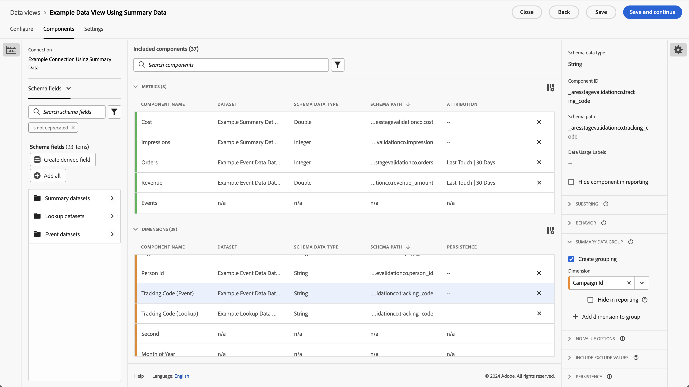
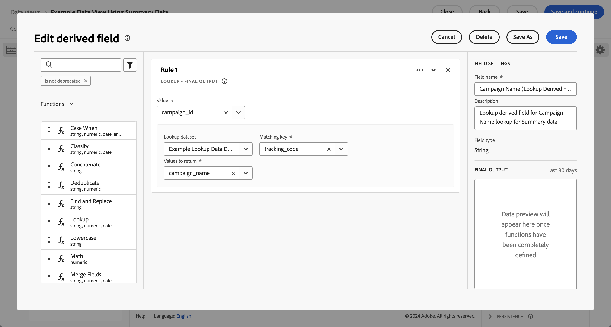

# Utiliser des données de résumé

Ce cas pratique vous aide à comprendre comment utiliser des données récapitulatives dans vos rapports et analyses. Le cas d’utilisation décrit toutes les étapes requises pour utiliser des données récapitulatives dans Customer Journey Analytics :

- [Ingérer](#ingest) des données récapitulatives et d’autres sources de données dans Experience Platform.
- Configurez votre [connexion](#connection) pour les données récapitulatives et d’autres sources de données.
- Configurez votre [vue de données](#data-view) pour combiner vos sources de données.
- Signalez et analysez dans [Workspace](#workspace) vos données combinées.

Le cas d’utilisation fournit des données d’exemple pour les données de résumé, les données d’événement et les données de recherche. Toutes les données contiennent des valeurs aléatoires.

## Ingestion

Vous utilisez l’exemple de données récapitulatives suivant pour ce cas d’utilisation, avec des données récapitulatives pour l’exécution des campagnes sur Facebook.

+++Données récapitulatives

| _id | campaign_name | coût | impression | campaign_id | network | ad_group | timestamp |
|---|---|---:|---:|---|---|---|---|
| 1 | Campagne 123 | 100 | 5000 | abc123 | facebook | abc-adgroup | 2024-07-18T18:20:39.000Z |
| 2 | Campagne 123 | 50 | 4 000 | def123 | facebook | def-adgroup | 2024-07-18T18:20:39.000Z |
| 3 | Campagne 123 | 125 | 6000 | ghi123 | facebook | ghi-adgroup | 2024-07-18T18:20:39.000Z |
| 4 | Campagne 456 | 25 | 2500 | abc456 | facebook | abc-adgroup | 2024-07-18T18:20:39.000Z |
| 5 | Campagne 456 | 10 | 1000 | def456 | facebook | def-adgroup | 2024-07-18T18:20:39.000Z |
| 6 | Campagne 456 | 115 | 5500 | ghi456 | facebook | ghi-adgroup | 2024-07-18T18:20:39.000Z |
| 7 | Campagne 789 | 200 | 9000 | abc789 | facebook | abc-adgroup | 2024-07-18T18:20:39.000Z |
| 8 | Campagne 789 | 20 | 2 000 | def789 | facebook | def-adgroup | 2024-07-18T18:20:39.000Z |
| 9 | Campagne 789 | 225 | 12000 | ghi789 | facebook | ghi-adgroup | 2024-07-18T18:20:39.000Z |
| 10 | Campagne 987 | 125 | 10000 | abc987 | facebook | abc-adgroup | 2024-07-18T18:20:39.000Z |
| 11 | Campagne 987 | 120 | 15000 | def987 | facebook | def-adgroup | 2024-07-18T18:20:39.000Z |
| 12 | Campagne 987 | 315 | 22500 | ghi987 | facebook | ghi-adgroup | 2024-07-18T18:20:39.000Z |
| 13 | Campagne 654 | 325 | 20000 | abc654 | facebook | abc-adgroup | 2024-07-18T18:20:39.000Z |
| 14 | Campagne 654 | 320 | 25000 | def654 | facebook | def-adgroup | 2024-07-18T18:20:39.000Z |
| 15 | Campagne 654 | 315 | 22500 | ghi654 | facebook | ghi-adgroup | 2024-07-18T18:20:39.000Z |
| 16 | Campagne 321 | 25 | 2 000 | abc321 | facebook | abc-adgroup | 2024-07-18T18:20:39.000Z |
| 17 | Campagne 321 | 20 | 2500 | def321 | facebook | def-adgroup | 2024-07-18T18:20:39.000Z |
| 18 | Campagne 321 | 15 | 2250 | ghi321 | facebook | ghi-adgroup | 2024-07-18T18:20:39.000Z |

+++

Pour utiliser les données récapitulatives dans Customer Journey Analytics, dans un rapport ou dans le cadre de l’analyse des données dans Workspace, vous devez

- un schéma de résumé en Experience Platform,
- un jeu de données de résumé dans Experience Platform,
- une connexion en Customer Journey Analytics configurée pour utiliser le jeu de données de résumé,
- une vue de données dans Customer Journey Analytics, correctement configurée avec des mesures et des dimensions pour les données de résumé.

Vous utilisez ces données récapitulatives avec un jeu de données pour les données d’événement et un jeu de données pour les données de recherche.

+++Données d’événement

Les données d’événement sont disponibles dans l’ exemple de jeu de données de données d’événement . Les exemples de données se présentent comme suit :

| timestamp | _id | page_name | person_id | tracking_code | commandes | revenue_amount |
|---|---:|---|---|---|---:|---:|
| 2024-07-18T19:15:39+00:00 | 1 | page d&#39;accueil | person-1abc123 | abc123 |  |  |
| 2024-07-18T19:15:39+00:00 | 2 | page de confirmation | person-1abc123 |  | 1 | 174,25 |
| 2024-07-18T19:15:39+00:00 | 3 | page d&#39;accueil | person-2def123 | def123 |  |  |
| 2024-07-18T19:15:39+00:00 | 4 | page d&#39;accueil | person-3ghi123 | ghi123 |  |  |
| 2024-07-18T19:15:39+00:00 | 5 | page de confirmation | person-3ghi123 |  | 1 | 149,25 |
| 2024-07-18T19:15:39+00:00 | 6 | page d&#39;accueil | person-4abc456 | abc456 |  |  |
| 2024-07-18T19:15:39+00:00 | 7 | page d&#39;accueil | person-5def456 | def456 |  |  |
| 2024-07-18T19:15:39+00:00 | 8 | page d&#39;accueil | person-6ghi456 | ghi456 |  |  |
| 2024-07-18T19:15:39+00:00 | 9 | page de confirmation | person-6ghi456 |  | 1 | 159,25 |
| 2024-07-18T19:15:39+00:00 | 10 | page d&#39;accueil | person-7abc789 | abc789 |  |  |
| 2024-07-18T19:15:39+00:00 | 11 | page d&#39;accueil | person-8def789 | def789 |  |  |
| 2024-07-18T19:15:39+00:00 | 12 | page d&#39;accueil | person-9ghi789 | ghi789 |  |  |
| 2024-07-18T19:15:39+00:00 | 13 | page de confirmation | person-9ghi789 |  | 1 | 124,25 |
| 2024-07-18T19:15:39+00:00 | 14 | page d&#39;accueil | person-10abc987 | abc987 |  |  |
| 2024-07-18T19:15:39+00:00 | 15 | page d&#39;accueil | person-11def987 | def987 |  |  |
| 2024-07-18T19:15:39+00:00 | 16 | page d&#39;accueil | person-12ghi987 | ghi987 |  |  |
| 2024-07-18T19:15:39+00:00 | 17 | page d&#39;accueil | person-13abc654 | abc654 |  |  |
| 2024-07-18T19:15:39+00:00 | 18 | page d&#39;accueil | person-14def654 | def654 |  |  |
| 2024-07-18T19:15:39+00:00 | 19 | page d&#39;accueil | person-15ghi654 | ghi654 |  |  |
| 2024-07-18T19:15:39+00:00 | 20 | page de confirmation | person-15ghi654 |  | 1 | 174,25 |
| 2024-07-18T19:15:39+00:00 | 21 | page d&#39;accueil | person-16abc321 | abc321 |  |  |
| 2024-07-18T19:15:39+00:00 | 22 | page d&#39;accueil | person-17def321 | def321 |  |  |
| 2024-07-18T19:15:39+00:00 | 23 | page d&#39;accueil | person-18ghi321 | ghi321 |  |  |
| 2024-07-18T19:15:39+00:00 | 24 | page d&#39;accueil | person-19abc123 | abc123 |  |  |
| 2024-07-18T19:15:39+00:00 | 25 | page d&#39;accueil | person-20def123 | def123 |  |  |
| 2024-07-18T19:15:39+00:00 | 26 | page d&#39;accueil | person-21ghi123 | ghi123 |  |  |
| 2024-07-18T19:15:39+00:00 | 27 | page de confirmation | person-21ghi123 |  | 1 | 149,25 |
| 2024-07-18T19:15:39+00:00 | 28 | page d&#39;accueil | person-22abc456 | abc456 |  |  |
| 2024-07-18T19:15:39+00:00 | 29 | page d&#39;accueil | person-23def456 | def456 |  |  |
| 2024-07-18T19:15:39+00:00 | 30 | page d&#39;accueil | person-24ghi456 | ghi456 |  |  |
| 2024-07-18T19:15:39+00:00 | 31 | page d&#39;accueil | person-25abc789 | abc789 |  |  |
| 2024-07-18T19:15:39+00:00 | 32 | page de confirmation | person-25abc789 |  | 1 | 139,25 |
| 2024-07-18T19:15:39+00:00 | 33 | page d&#39;accueil | person-26abc987 | abc987 |  |  |
| 2024-07-18T19:15:39+00:00 | 34 | page d&#39;accueil | person-27def987 | def987 |  |  |
| 2024-07-18T19:15:39+00:00 | 35 | page d&#39;accueil | person-28ghi987 | ghi987 |  |  |
| 2024-07-18T19:15:39+00:00 | 36 | page d&#39;accueil | person-29abc654 | abc654 |  |  |
| 2024-07-18T19:15:39+00:00 | 37 | page de confirmation | person-29abc654 |  | 1 | 124,25 |
| 2024-07-18T19:15:39+00:00 | 38 | page d&#39;accueil | person-30def654 | def654 |  |  |
| 2024-07-18T19:15:39+00:00 | 39 | page d&#39;accueil | person-31ghi654 | ghi654 |  |  |
| 2024-07-18T19:15:39+00:00 | 40 | page d&#39;accueil | person-32abc321 | abc321 |  |  |
| 2024-07-18T19:15:39+00:00 | 41 | page d&#39;accueil | person-33ghi456 | ghi456 |  |  |
| 2024-07-18T19:15:39+00:00 | 42 | page de confirmation | person-33ghi456 |  | 1 | 174,25 |
| 2024-07-18T19:15:39+00:00 | 43 | page d&#39;accueil | person-34abc789 | abc789 |  |  |
| 2024-07-18T19:15:39+00:00 | 44 | page d&#39;accueil | person-35def789 | def789 |  |  |
| 2024-07-18T19:15:39+00:00 | 45 | page d&#39;accueil | person-36ghi789 | ghi789 |  |  |
| 2024-07-18T19:15:39+00:00 | 46 | page de confirmation | person-36ghi789 |  | 1 | 149,25 |
| 2024-07-18T19:15:39+00:00 | 47 | page d&#39;accueil | person-37abc987 | abc987 |  |  |
| 2024-07-18T19:15:39+00:00 | 48 | page d&#39;accueil | person-38def987 | def987 |  |  |
| 2024-07-18T19:15:39+00:00 | 49 | page d&#39;accueil | person-39ghi987 | ghi987 |  |  |
| 2024-07-18T19:15:39+00:00 | 50 | page d&#39;accueil | person-40abc654 | abc654 |  |  |
| 2024-07-18T19:15:39+00:00 | 51 | page de confirmation | person-40abc654 |  | 1 | 124,25 |
| 2024-07-18T19:15:39+00:00 | 52 | page d&#39;accueil | person-41def654 | def654 |  |  |
| 2024-07-18T19:15:39+00:00 | 53 | page d&#39;accueil | person-42ghi654 | ghi654 |  |  |
| 2024-07-18T19:15:39+00:00 | 54 | page d&#39;accueil | person-43abc321 | abc321 |  |  |
| 2024-07-18T19:15:39+00:00 | 55 | page d&#39;accueil | person-44def321 | def321 |  |  |
| 2024-07-18T19:15:39+00:00 | 56 | page d&#39;accueil | person-45ghi321 | ghi321 |  |  |
| 2024-07-18T19:15:39+00:00 | 57 | page d&#39;accueil | person-46abc123 | abc123 |  |  |
| 2024-07-18T19:15:39+00:00 | 58 | page de confirmation | person-46abc123 |  | 1 | 174,25 |
| 2024-07-18T19:15:39+00:00 | 59 | page d&#39;accueil | person-47def123 | def123 |  |  |
| 2024-07-18T19:15:39+00:00 | 60 | page d&#39;accueil | person-48ghi123 | ghi123 |  |  |
| 2024-07-18T19:15:39+00:00 | 61 | page d&#39;accueil | person-49abc456 | abc456 |  |  |
| 2024-07-18T19:15:39+00:00 | 62 | page d&#39;accueil | person-50def456 | def456 |  |  |
| 2024-07-18T19:15:39+00:00 | 63 | page d&#39;accueil | person-51ghi456 | ghi456 |  |  |
| 2024-07-18T19:15:39+00:00 | 64 | page d&#39;accueil | person-52abc789 | abc789 |  |  |
| 2024-07-18T19:15:39+00:00 | 65 | page de confirmation | person-52abc789 |  | 1 | 149,25 |
| 2024-07-18T19:15:39+00:00 | 66 | page d&#39;accueil | person-53abc987 | abc987 |  |  |
| 2024-07-18T19:15:39+00:00 | 67 | page d&#39;accueil | person-54def987 | def987 |  |  |
| 2024-07-18T19:15:39+00:00 | 68 | page d&#39;accueil | person-55ghi987 | ghi987 |  |  |
| 2024-07-18T19:15:39+00:00 | 69 | page de confirmation | person-55ghi987 |  | 1 | 124,25 |
| 2024-07-18T19:15:39+00:00 | 70 | page d&#39;accueil | person-56abc123 | abc123 |  |  |
| 2024-07-18T19:15:39+00:00 | 71 | page d&#39;accueil | person-57def123 | def123 |  |  |
| 2024-07-18T19:15:39+00:00 | 72 | page de confirmation | person-57def123 |  | 1 | 174,25 |
| 2024-07-18T19:15:39+00:00 | 73 | page d&#39;accueil | person-58ghi123 | ghi123 |  |  |
| 2024-07-18T19:15:39+00:00 | 74 | page d&#39;accueil | person-59abc456 | abc456 |  |  |
| 2024-07-18T19:15:39+00:00 | 75 | page de confirmation | person-59abc456 |  | 1 | 149,25 |
| 2024-07-18T19:15:39+00:00 | 76 | page d&#39;accueil | person-60def456 | def456 |  |  |
| 2024-07-18T19:15:39+00:00 | 77 | page d&#39;accueil | person-61ghi456 | ghi456 |  |  |
| 2024-07-18T19:15:39+00:00 | 78 | page d&#39;accueil | person-62abc789 | abc789 |  |  |
| 2024-07-18T19:15:39+00:00 | 79 | page de confirmation | person-62abc789 |  | 1 | 159,25 |
| 2024-07-18T19:15:39+00:00 | 80 | page d&#39;accueil | person-63def789 | def789 |  |  |
| 2024-07-18T19:15:39+00:00 | 81 | page d&#39;accueil | person-64ghi789 | ghi789 |  |  |
| 2024-07-18T19:15:39+00:00 | 82 | page d&#39;accueil | person-65abc987 | abc987 |  |  |
| 2024-07-18T19:15:39+00:00 | 83 | page de confirmation | person-65abc987 |  | 1 | 124,25 |
| 2024-07-18T19:15:39+00:00 | 84 | page d&#39;accueil | person-66def987 | def987 |  |  |
| 2024-07-18T19:15:39+00:00 | 85 | page d&#39;accueil | person-67ghi987 | ghi987 |  |  |
| 2024-07-18T19:15:39+00:00 | 86 | page d&#39;accueil | person-68abc654 | abc654 |  |  |
| 2024-07-18T19:15:39+00:00 | 87 | page d&#39;accueil | person-69def654 | def654 |  |  |
| 2024-07-18T19:15:39+00:00 | 88 | page d&#39;accueil | person-70ghi654 | ghi654 |  |  |
| 2024-07-18T19:15:39+00:00 | 89 | page d&#39;accueil | person-71abc321 | abc321 |  |  |
| 2024-07-18T19:15:39+00:00 | 90 | page de confirmation | person-71abc321 |  | 1 | 174,25 |
| 2024-07-18T19:15:39+00:00 | 91 | page d&#39;accueil | person-72def321 | def321 |  |  |
| 2024-07-18T19:15:39+00:00 | 92 | page d&#39;accueil | person-73ghi321 | ghi321 |  |  |
| 2024-07-18T19:15:39+00:00 | 93 | page d&#39;accueil | person-74abc123 | abc123 |  |  |
| 2024-07-18T19:15:39+00:00 | 94 | page d&#39;accueil | person-75def123 | def123 |  |  |
| 2024-07-18T19:15:39+00:00 | 95 | page d&#39;accueil | person-76ghi123 | ghi123 |  |  |
| 2024-07-18T19:15:39+00:00 | 96 | page d&#39;accueil | person-77abc456 | abc456 |  |  |
| 2024-07-18T19:15:39+00:00 | 97 | page de confirmation | person-77abc456 |  | 1 | 149,25 |
| 2024-07-18T19:15:39+00:00 | 98 | page d&#39;accueil | person-78def456 | def456 |  |  |
| 2024-07-18T19:15:39+00:00 | 99 | page d&#39;accueil | person-79ghi456 | ghi456 |  |  |
| 2024-07-18T19:15:39+00:00 | 100 | page d&#39;accueil | person-80abc789 | abc789 |  |  |
| 2024-07-18T19:15:39+00:00 | 101 | page d&#39;accueil | person-81abc987 | abc987 |  |  |
| 2024-07-18T19:15:39+00:00 | 102 | page de confirmation | person-81abc987 |  | 1 | 139,25 |
| 2024-07-18T19:15:39+00:00 | 103 | page d&#39;accueil | person-82def987 | def987 |  |  |
| 2024-07-18T19:15:39+00:00 | 104 | page d&#39;accueil | person-83ghi987 | ghi987 |  |  |
| 2024-07-18T19:15:39+00:00 | 105 | page d&#39;accueil | person-84abc654 | abc654 |  |  |
| 2024-07-18T19:15:39+00:00 | 106 | page d&#39;accueil | person-85def654 | def654 |  |  |
| 2024-07-18T19:15:39+00:00 | 107 | page de confirmation | person-85def654 |  | 1 | 124,25 |
| 2024-07-18T19:15:39+00:00 | 108 | page d&#39;accueil | person-86ghi654 | ghi654 |  |  |
| 2024-07-18T19:15:39+00:00 | 109 | page d&#39;accueil | person-87abc321 | abc321 |  |  |
| 2024-07-18T19:15:39+00:00 | 110 | page d&#39;accueil | person-88ghi456 | ghi456 |  |  |
| 2024-07-18T19:15:39+00:00 | 111 | page d&#39;accueil | person-89abc789 | abc789 |  |  |
| 2024-07-18T19:15:39+00:00 | 112 | page de confirmation | person-89abc789 |  | 1 | 174,25 |
| 2024-07-18T19:15:39+00:00 | 113 | page d&#39;accueil | person-90def789 | def789 |  |  |
| 2024-07-18T19:15:39+00:00 | 114 | page d&#39;accueil | person-91ghi789 | ghi789 |  |  |
| 2024-07-18T19:15:39+00:00 | 115 | page d&#39;accueil | person-92abc987 | abc987 |  |  |
| 2024-07-18T19:15:39+00:00 | 116 | page de confirmation | person-92abc987 |  | 1 | 149,25 |
| 2024-07-18T19:15:39+00:00 | 117 | page d&#39;accueil | person-93def987 | def987 |  |  |
| 2024-07-18T19:15:39+00:00 | 118 | page d&#39;accueil | person-94ghi987 | ghi987 |  |  |
| 2024-07-18T19:15:39+00:00 | 119 | page d&#39;accueil | person-95abc654 | abc654 |  |  |
| 2024-07-18T19:15:39+00:00 | 120 | page d&#39;accueil | person-96def654 | def654 |  |  |
| 2024-07-18T19:15:39+00:00 | 121 | page de confirmation | person-96def654 |  | 1 | 124,25 |
| 2024-07-18T19:15:39+00:00 | 122 | page d&#39;accueil | person-97ghi654 | ghi654 |  |  |
| 2024-07-18T19:15:39+00:00 | 123 | page d&#39;accueil | person-98abc321 | abc321 |  |  |
| 2024-07-18T19:15:39+00:00 | 124 | page d&#39;accueil | person-99def321 | def321 |  |  |
| 2024-07-18T19:15:39+00:00 | 125 | page d&#39;accueil | person-100ghi321 | ghi321 |  |  |
| 2024-07-18T19:15:39+00:00 | 126 | page d&#39;accueil | person-101abc123 | abc123 |  |  |
| 2024-07-18T19:15:39+00:00 | 127 | page d&#39;accueil | person-102def123 | def123 |  |  |
| 2024-07-18T19:15:39+00:00 | 128 | page de confirmation | person-102def123 |  | 1 | 174,25 |
| 2024-07-18T19:15:39+00:00 | 129 | page d&#39;accueil | person-103ghi123 | ghi123 |  |  |
| 2024-07-18T19:15:39+00:00 | 130 | page d&#39;accueil | person-104abc456 | abc456 |  |  |
| 2024-07-18T19:15:39+00:00 | 131 | page d&#39;accueil | person-105def456 | def456 |  |  |
| 2024-07-18T19:15:39+00:00 | 132 | page d&#39;accueil | person-106ghi456 | ghi456 |  |  |
| 2024-07-18T19:15:39+00:00 | 133 | page d&#39;accueil | person-107abc789 | abc789 |  |  |
| 2024-07-18T19:15:39+00:00 | 134 | page d&#39;accueil | person-108abc987 | abc987 |  |  |
| 2024-07-18T19:15:39+00:00 | 135 | page de confirmation | person-108abc987 |  | 1 | 149,25 |
| 2024-07-18T19:15:39+00:00 | 136 | page d&#39;accueil | person-109def987 | def987 |  |  |
| 2024-07-18T19:15:39+00:00 | 137 | page d&#39;accueil | person-110ghi987 | ghi987 |  |  |
| 2024-07-18T19:15:39+00:00 | 138 | page de confirmation | person-110ghi987 |  |  |  |
| 2024-07-18T19:15:39+00:00 | 139 | page d&#39;accueil | person-111def987 | def987 |  |  |
| 2024-07-18T19:15:39+00:00 | 140 | page d&#39;accueil | person-112def987 |  | 1 | 124,25 |
| 2024-07-18T19:15:39+00:00 | 141 | page de confirmation | person-112def987 |  | 1 | 149,25 |
| 2024-07-18T19:15:39+00:00 | 142 | page d&#39;accueil | person-113ghi987 | ghi987 |  |  |
| 2024-07-18T19:15:39+00:00 | 143 | page d&#39;accueil | person-114abc654 | abc654 |  |  |
| 2024-07-18T19:15:39+00:00 | 144 | page d&#39;accueil | person-115def654 | def654 |  |  |
| 2024-07-18T19:15:39+00:00 | 145 | page de confirmation | person-115def654 |  | 1 | 159,25 |
| 2024-07-18T19:15:39+00:00 | 146 | page d&#39;accueil | person-116ghi654 | ghi654 |  |  |
| 2024-07-18T19:15:39+00:00 | 147 | page d&#39;accueil | person-117abc321 | abc321 |  |  |
| 2024-07-18T19:15:39+00:00 | 148 | page d&#39;accueil | person-118def321 | def321 |  |  |
| 2024-07-18T19:15:39+00:00 | 149 | page de confirmation | person-118def321 |  | 1 | 124,25 |
| 2024-07-18T19:15:39+00:00 | 150 | page d&#39;accueil | person-119ghi321 | ghi321 |  |  |
| 2024-07-18T19:15:39+00:00 | 151 | page d&#39;accueil | person-120abc123 | abc123 |  |  |
| 2024-07-18T19:15:39+00:00 | 152 | page d&#39;accueil | person-121def123 | def123 |  |  |
| 2024-07-18T19:15:39+00:00 | 153 | page d&#39;accueil | person-122ghi123 | ghi123 |  |  |
| 2024-07-18T19:15:39+00:00 | 154 | page d&#39;accueil | person-123abc456 | abc456 |  |  |
| 2024-07-18T19:15:39+00:00 | 155 | page d&#39;accueil | person-124def456 | def456 |  |  |
| 2024-07-18T19:15:39+00:00 | 156 | page de confirmation | person-124def456 |  | 1 | 174,25 |
| 2024-07-18T19:15:39+00:00 | 157 | page d&#39;accueil | person-125ghi456 | ghi456 |  |  |
| 2024-07-18T19:15:39+00:00 | 158 | page d&#39;accueil | person-126abc789 | abc789 |  |  |
| 2024-07-18T19:15:39+00:00 | 159 | page d&#39;accueil | person-127abc987 | abc987 |  |  |
| 2024-07-18T19:15:39+00:00 | 160 | page d&#39;accueil | person-128def987 | def987 |  |  |
| 2024-07-18T19:15:39+00:00 | 161 | page d&#39;accueil | person-129ghi987 | ghi987 |  |  |
| 2024-07-18T19:15:39+00:00 | 162 | page d&#39;accueil | person-130abc654 | abc654 |  |  |
| 2024-07-18T19:15:39+00:00 | 163 | page de confirmation | person-130abc654 |  | 1 | 149,25 |
| 2024-07-18T19:15:39+00:00 | 164 | page d&#39;accueil | person-131def654 | def654 |  |  |
| 2024-07-18T19:15:39+00:00 | 165 | page d&#39;accueil | person-132ghi654 | ghi654 |  |  |
| 2024-07-18T19:15:39+00:00 | 166 | page d&#39;accueil | person-133abc321 | abc321 |  |  |
| 2024-07-18T19:15:39+00:00 | 167 | page d&#39;accueil | person-134ghi456 | ghi456 |  |  |
| 2024-07-18T19:15:39+00:00 | 168 | page de confirmation | person-134ghi456 |  | 1 | 139,25 |
| 2024-07-18T19:15:39+00:00 | 169 | page d&#39;accueil | person-135abc789 | abc789 |  |  |
| 2024-07-18T19:15:39+00:00 | 170 | page d&#39;accueil | person-136def789 | def789 |  |  |
| 2024-07-18T19:15:39+00:00 | 171 | page d&#39;accueil | person-137ghi789 | ghi789 |  |  |
| 2024-07-18T19:15:39+00:00 | 172 | page d&#39;accueil | person-138abc987 | abc987 |  |  |
| 2024-07-18T19:15:39+00:00 | 173 | page de confirmation | person-138abc987 |  | 1 | 124,25 |
| 2024-07-18T19:15:39+00:00 | 174 | page d&#39;accueil | person-139def987 | def987 |  |  |
| 2024-07-18T19:15:39+00:00 | 175 | page d&#39;accueil | person-140ghi987 | ghi987 |  |  |
| 2024-07-18T19:15:39+00:00 | 176 | page d&#39;accueil | person-141abc654 | abc654 |  |  |
| 2024-07-18T19:15:39+00:00 | 177 | page d&#39;accueil | person-142def654 | def654 |  |  |
| 2024-07-18T19:15:39+00:00 | 178 | page de confirmation | person-142def654 |  | 1 | 174,25 |
| 2024-07-18T19:15:39+00:00 | 179 | page d&#39;accueil | person-143ghi654 | ghi654 |  |  |

+++

+++ Données de recherche

Les données de recherche sont disponibles dans l’exemple de jeu de données de recherche. Les exemples de données se présentent comme suit :

| _id | tracking_code | ad_group | campaign_name |
|---|---|---|---|
| 1 | abc123 | abc-adgroup | Campagne 123 |
| 2 | def123 | def-adgroup | Campagne 123 |
| 3 | ghi123 | ghi-adgroup | Campagne 123 |
| 4 | abc456 | abc-adgroup | Campagne 456 |
| 5 | def456 | def-adgroup | Campagne 456 |
| 6 | ghi456 | ghi-adgroup | Campagne 456 |
| 7 | abc789 | abc-adgroup | Campagne 789 |
| 8 | def789 | def-adgroup | Campagne 789 |
| 9 | ghi789 | ghi-adgroup | Campagne 789 |
| 10 | abc987 | abc-adgroup | Campagne 987 |
| 11 | def987 | def-adgroup | Campagne 987 |
| 12 | ghi987 | ghi-adgroup | Campagne 987 |
| 13 | abc654 | abc-adgroup | Campagne 654 |
| 14 | def654 | def-adgroup | Campagne 654 |
| 15 | ghi654 | ghi-adgroup | Campagne 654 |
| 16 | abc321 | abc-adgroup | Campagne 321 |
| 17 | def321 | def-adgroup | Campagne 321 |
| 18 | ghi321 | ghi-adgroup | Campagne 321 |

[ Télécharger des exemples de données de recherche](./assets/lookup-data.csv)
+++

>[!INFO]
>
>Des détails supplémentaires sur la configuration des schémas et des jeux de données pour l’événement et les données de recherche ne sont pas fournis. Cette configuration est supposée être une connaissance commune et suit les mêmes étapes que pour les données de recherche.
>

### Schéma récapitulatif

Les données récapitulatives nécessitent un schéma de résumé dans Experience Platform. Un schéma de résumé est un schéma qui utilise les mesures de résumé XDM comme classe de base.

Pour créer un schéma de résumé dans Experience Platform :

1. Sélectionnez **[!UICONTROL Experience Platform]** dans la      sélecteur d’applications.
1. Sélectionnez **[!UICONTROL Schémas]** dans le rail de gauche.
1. Sélectionnez  **[!UICONTROL Créer un schéma]**.
1. Sélectionnez **[!UICONTROL Manuel]** dans la boîte de dialogue **[!UICONTROL Créer un schéma]** . Ensuite, utilisez **[!UICONTROL Sélectionner]** pour continuer.
1. À l’étape **[!UICONTROL Sélectionner une classe]** de l’assistant **[!UICONTROL Schémas]** > **[!UICONTROL Créer un schéma]**, sélectionnez **[!UICONTROL Autre]** dans les options **[!UICONTROL Sélectionner une classe de base pour ce schéma]**.
1. Dans la liste, sélectionnez **[!UICONTROL XDM Summary Metrics]** (ou utilisez le champ  pour effectuer une recherche) et sélectionnez **[!UICONTROL Next]**.
1. À l’étape **[!UICONTROL Nom et révision]** de l’assistant **[!UICONTROL Schémas]** > **[!UICONTROL Créer un schéma]**, saisissez un **[!UICONTROL nom d’affichage du schéma]**, par exemple `Example Summary Data Schema` et une description facultative. Sélectionnez **[!UICONTROL Terminer]** pour terminer cette étape.

La structure de votre schéma de résumé de base s’affiche, prête à être complétée avec les champs de vos données de résumé. Vous ajoutez des champs à un schéma à l’aide de groupes de champs.

Pour ajouter un groupe de champs contenant les champs de vos données d’exemple :

1. Sélectionnez  **** dans **[!UICONTROL Groupes de champs]**.
1. Dans la boîte de dialogue **[!UICONTROL Ajouter des groupes de champs]**, sélectionnez **[!UICONTROL Créer un groupe de champs]**.
1. Saisissez un **[!UICONTROL nom d’affichage]** pour le groupe de champs, par exemple `Example Summary Data`. Vous pouvez éventuellement fournir une description.
1. Sélectionnez **[!UICONTROL Ajouter des groupes de champs]**.
1. Vous êtes de retour dans l’interface utilisateur de la structure de schéma. Sélectionnez le nouveau **[!UICONTROL Exemple de données récapitulatives]** dans les **[!UICONTROL groupes de champs]**.
1. Sélectionnez le  en regard du nom du schéma **[!UICONTROL Exemple de schéma de données récapitulatives]**. Un panneau **[!UICONTROL Propriétés du champ]** s’ouvre et vous permet d’ajouter des détails pour un champ.
   1. Saisissez un **[!UICONTROL nom du champ]**: `campaign_id`
   1. Saisissez un **[!UICONTROL nom d’affichage]** : `campaign_id`
   1. Sélectionnez un **[!UICONTROL Type]** dans la liste déroulante **[!UICONTROL Select data type]** : **[!UICONTROL String]**
   1. Assurez-vous que l’option **[!UICONTROL Assign to]** **[!UICONTROL Field group]** est sélectionnée, puis sélectionnez **[!UICONTROL Exemple de données récapitulatives]** dans la liste déroulante.
   1. Faites défiler l’écran jusqu’en bas, puis sélectionnez **[!UICONTROL Appliquer]**.
1. Répétez l’étape précédente pour les autres champs des données récapitulatives. Consultez le tableau ci-dessous pour connaître les valeurs correctes.

   | Nom du champ | Nom d’affichage | Type | Groupe de champs |
   |---|---|---|---|
   | `ad_group` | `ad_group` | Chaîne | Exemple de données récapitulatives |
   | `campaign_name` | `campaign_name` | Chaîne | Exemple de données récapitulatives |
   | `cost` | `cost` | Double | Exemple de données récapitulatives |
   | `impression` | `impression` | Nombre entier | Exemple de données récapitulatives |
   | `network` | `network` | Chaîne | Exemple de données récapitulatives |

1. Pour enregistrer votre groupe de champs **[!UICONTROL Exemple de données récapitulatives]** dans le cadre de votre schéma, sélectionnez **[!UICONTROL Enregistrer]**. Une confirmation s’affiche lorsque votre schéma est enregistré avec succès.

Vous avez maintenant défini un schéma détaillant le modèle de vos données récapitulatives. Similaire à celui ci-dessous.

### Jeu de données de résumé

Pour stocker vos données récapitulatives dans Experience Platform, vous devez d’abord créer un jeu de données, puis charger vos données récapitulatives dans le jeu de données.

Pour créer un jeu de données :

1. Sélectionnez **[!UICONTROL Experience Platform]** dans la      sélecteur d’applications.
1. Sélectionnez **[!UICONTROL Jeux de données]** dans le rail de gauche.
1. Sélectionnez  **[!UICONTROL Créer un jeu de données]**.
1. Dans l’écran **[!UICONTROL Jeux de données]** > **[!UICONTROL Créer des jeux de données]**, sélectionnez **[!UICONTROL Créer un jeu de données à partir d’un schéma]**.
1. À l’étape **[!UICONTROL Sélectionner un schéma]** de l’assistant **[!UICONTROL Workflows]** > **[!UICONTROL Créer un jeu de données à partir du schéma]**,  et sélectionnez votre **[!UICONTROL Exemple de schéma de données récapitulatives]**.
1. Sélectionnez **[!UICONTROL Suivant]**.
1. À l’étape **[!UICONTROL Configurer le jeu de données]** de l’assistant **[!UICONTROL Workflows]** > **[!UICONTROL Créer un jeu de données à partir d’un schéma]** :
   1. Saisissez un **[!UICONTROL Nom]** pour le jeu de données, par exemple : `Example Summary Data Dataset`. Vous pouvez éventuellement fournir une description.
   1. Sélectionnez **[!UICONTROL Terminer]**.

Un écran s’affiche, affichant les détails de votre nouveau jeu de données.

Pour charger vos exemples de données dans ce jeu de données :

1. Sélectionnez **[!UICONTROL Experience Platform]** dans la      sélecteur d’applications.
1. Sélectionnez **[!UICONTROL Workflows]** dans le rail de gauche.
   1. Sélectionnez **[!UICONTROL Mapper CSV au schéma XDM]** à partir des options **[!UICONTROL Ingestion des données]** de l’écran **[!UICONTROL Workflows]**.
   1. Sélectionnez **[!UICONTROL Launch]** dans le panneau **[!UICONTROL Mapper CSV au schéma XDM]** .
1. À l’étape **[!UICONTROL Dataflow detail]** de l’assistant **[!UICONTROL Workflows]** > **[!UICONTROL Mapper CSV au schéma XDM]** :
   1. Sélectionnez **[!UICONTROL Jeu de données existant]** pour **[!UICONTROL Jeu de données cible]**.
   1. Sélectionnez **[!UICONTROL Exemple de jeu de données de résumé]** dans la liste déroulante.
   1. Sélectionnez **[!UICONTROL Suivant]**.
1. À l’étape **[!UICONTROL Sélectionner les données]** de l’assistant **[!UICONTROL Workflows]** > **[!UICONTROL Mapper CSV au schéma XDM]** :
   1. Faites glisser et déposez votre fichier avec des données récapitulatives au format CSV sur **[!UICONTROL Glisser-déposer des fichiers]**. Vous pouvez également utiliser **[!UICONTROL Choose files]** pour sélectionner votre fichier.
   1. Assurez-vous que le **[!UICONTROL format de données]** et le **[!UICONTROL délimiteur]** ont les valeurs correctes pour vos données d’exemple. Par exemple, **[!UICONTROL Délimité]** comme **[!UICONTROL format de données]** et **[!UICONTROL ,]** comme **[!UICONTROL délimiteur]**.
   1. Un exemple (10 enregistrements) de vos données récapitulatives est affiché dans **[!UICONTROL Sample data]**.
   1. Sélectionnez **[!UICONTROL Suivant]**.
1. À l’étape **[!UICONTROL Mapping]** de l’assistant **[!UICONTROL Workflows]** > **[!UICONTROL Mappage de CSV au schéma XDM]** :
   
   1. Vérifiez si tous les champs de données de vos **[!UICONTROL données Source]** sont correctement mappés aux **[!UICONTROL champs cibles]** correspondants dans votre schéma. Pour les données d’exemple, aucune erreur n’est signalée, car vous avez explicitement nommé les champs de votre schéma de la même manière que les noms des champs dans vos données d’exemple. Sinon, vous pouvez utiliser cet écran pour corriger le mapping.
   1. Vous pouvez éventuellement sélectionner  **[!UICONTROL Validate]** pour (une fois de plus) valider les données.
   1. Vous pouvez éventuellement sélectionner  **[!UICONTROL Preview data]** pour ouvrir une boîte de dialogue avec un aperçu des données chargées dans le jeu de données.
   1. Sélectionnez **[!UICONTROL Terminer]**.

Dans **[!UICONTROL Sources]** > **[!UICONTROL Flux de données - XX/XX/XXXX, XX:XX]**, l’état de votre téléchargement s’affiche. Actualisez pour afficher les mises à jour du chargement. En cas de réussite, vos données d’exemple sont chargées dans Experience Platform.

## Connexion

Pour utiliser vos exemples de données dans Customer Journey Analytics, vous créez une connexion qui inclut le jeu de données de résumé d’exemple de l’Experience Platform.

1. Sélectionnez **[!UICONTROL Customer Journey Analytics]** dans la      sélecteur d’applications.
1. Sélectionnez **[!UICONTROL Connexions]** dans le menu supérieur.
1. Sélectionnez **[!UICONTROL Créer une connexion]**.
1. Dans **[!UICONTROL Connexions]** > **[!UICONTROL Connexion sans titre]** :
   1. Saisissez un **[!UICONTROL nom de connexion]**, par exemple `Example Connection Using Summary Data`.
   1. Sélectionnez l’environnement de test qui contient le jeu de données que vous avez créé et les autres jeux de données que vous souhaitez inclure dans la liste déroulante Environnement de test .
   1. Sélectionnez **[!UICONTROL moins de 1 million]** dans la liste déroulante **[!UICONTROL Nombre moyen d&#39;événements quotidiens]** .
   1. Sélectionnez **[!UICONTROL Ajouter des jeux de données]**.
   1. À l’étape **[!UICONTROL Sélectionner des jeux de données]** de l’assistant **[!UICONTROL Ajouter des jeux de données]** :
      1. Recherchez  et sélectionnez **[!UICONTROL Exemple de jeu de données de résumé]**, **[!UICONTROL Exemple de jeu de données de données d’événement]** et **[!UICONTROL Exemple de jeu de données de recherche]**.
      1. Sélectionnez **[!UICONTROL Suivant]**.
   1. À l’étape **[!UICONTROL Paramètres des jeux de données]** de l’assistant **[!UICONTROL Ajouter des jeux de données]** :

      1. Pour le **[!UICONTROL jeu de données d’exemple d’événement]** :

         1. Vérifiez que les sélections pour **[!UICONTROL ID de personne]** (`person_id`) et **[!UICONTROL Horodatage]** sont correctes.
         1. Sélectionnez **[!UICONTROL Web Data]** dans le **[!UICONTROL type de source de données]**.
         1. Activez **[!UICONTROL Importer toutes les nouvelles données]**.
         1. Activez **[!UICONTROL Renvoi de toutes les données existantes]**.

      1. Pour le **[!UICONTROL jeu de données de recherche d’exemples]** :

         1. Sélectionnez **[!UICONTROL tracking_code]** comme **[!UICONTROL clé]** et **[!UICONTROL suivi_code (jeux de données d’événement)]** comme clé **[!UICONTROL correspondance]**.
         1. Sélectionnez **[!UICONTROL Web Data]** dans le **[!UICONTROL type de source de données]**.
         1. Activez **[!UICONTROL Importer toutes les nouvelles données]**.
         1. Activez **[!UICONTROL Renvoi de toutes les données existantes]**.

      1. Pour le **[!UICONTROL exemple de jeu de données de résumé]** :

         1. Vérifiez que les sélections pour **[!UICONTROL Horodatage]** et **[!UICONTROL Fuseau horaire]** sont correctes.
         1. Activez **[!UICONTROL Importer toutes les nouvelles données]**.
         1. Activez **[!UICONTROL Renvoi de toutes les données existantes]**.

      1. Sélectionnez **[!UICONTROL Ajouter des jeux de données]**.

1. Dans l&#39;écran de connexion **[!UICONTROL Connexions]** > **[!UICONTROL Exemple de connexion à l&#39;aide de données récapitulatives]**, sélectionnez **[!UICONTROL Enregistrer]** pour enregistrer la connexion.

Les données des jeux de données sont ajoutées à Customer Journey Analytics, ce qui peut prendre quelques heures. Alors s&#39;il vous plaît, soyez patient avant de continuer.

Au bout d’un certain temps, vérifiez que les données de vos jeux de données sont correctement chargées dans Customer Journey Analytics.

1. Sélectionnez **[!UICONTROL Customer Journey Analytics]** dans la      sélecteur d’applications.
1. Sélectionnez **[!UICONTROL Connexions]** dans le menu supérieur.
1. Sélectionnez votre connexion, par exemple **[!UICONTROL Exemple de connexion à l’aide de données récapitulatives]**.
1. Sélectionnez une plage de données appropriée dans les détails **[!UICONTROL Connexion]** > **[!UICONTROL Exemple de connexion à l’aide de données récapitulatives]** .
   1. Sélectionnez , puis **[!UICONTROL 7 derniers jours]**.
   1. Sélectionnez **[!UICONTROL Appliquer]**.

Dans la liste de **[!UICONTROL jeux de données]**, les valeurs de la colonne **[!UICONTROL Enregistrements ajoutés]** doivent confirmer que les données de vos jeux de données font désormais partie de Customer Journey Analytics.

## Vue de données

Pour que vous puissiez créer des rapports sur les données correctes dans Workspace, vous souhaitez créer une vue de données contenant les mesures et dimensions appropriées.

1. Sélectionnez **[!UICONTROL Customer Journey Analytics]** dans la      sélecteur d’applications.
1. Sélectionnez **[!UICONTROL Vues de données]** dans le menu supérieur.
1. Sélectionnez **[!UICONTROL Créer une vue de données]**.
1. Dans **[!UICONTROL Vues de données]**, accédez aux écrans de l’assistant pour configurer votre vue de données.
   1. À l’étape **[!UICONTROL Configurer]** de **[!UICONTROL Vues de données]** :
      1. Sélectionnez votre connexion dans **[!UICONTROL Settings]** | **[!UICONTROL Connexion]**. Par exemple, **[!UICONTROL Exemple de connexion à l’aide de données récapitulatives]**.
      1. Saisissez un **[!UICONTROL Nom]** pour votre vue de données, par exemple `Example Data View Using Summary Data`.
      1. Conservez tous les autres paramètres.
      1. Sélectionnez **[!UICONTROL Enregistrer et continuer]**.
   1. À l’étape **[!UICONTROL Components]** de **[!UICONTROL Data views]** > **[!UICONTROL Exemple de vue de données à l’aide de données récapitulatives]** :
      1. Ajoutez les composants suivants à la liste Dimensions et mesures . Pour plus de clarté, les noms des composants sont modifiés à partir de leur nom par défaut, à l’aide de **[!UICONTROL Component name]** dans les **[!UICONTROL paramètres des composants]** dans le panneau des composants (à droite).

         **Mesures**

         | Nom du composant | Jeu de données | Type de données de schéma | Chemin du schéma |
         |---|---|---|---|
         | Coût | Exemple de jeu de données de résumé | Double | *_tenant*.cost |
         | Impressions | Exemple de jeu de données de résumé | Nombre entier | *_tenant*.impression |
         | Commandes | Exemple de jeu de données de données Event | Nombre entier | *_tenant*.orders |
         | Chiffre dʼaffaires | Exemple de jeu de données de données Event | Double | *_tenant*.revenue_amount |

         **Dimensions**

         | Nom du composant | Jeu de données | Type de données de schéma | Chemin du schéma |
         |---|---|---|---|
         | Groupe d’annonces (recherche) | Exemple de jeu de données de recherche | Chaîne | *_tenant*.ad_group |
         | Groupe d’annonces (résumé) | Exemple de jeu de données de résumé | Chaîne | *_tenant*.ad_group |
         | ID de campagne | Exemple de jeu de données de résumé | Chaîne | *_tenant*.campaign_id |
         | Nom de la campagne (recherche) | Exemple de jeu de données de recherche | Chaîne | *_tenant*.campaign_name |
         | Nom de la campagne (résumé) | Exemple de jeu de données de résumé | Chaîne | *_tenant*.campaign_name |
         | Réseau | Exemple de jeu de données de résumé | Chaîne | *_tenant*.network |
         | Nom de la page | Exemple de jeu de données de données Event | Chaîne | *_tenant*.page_name |
         | ID de personne | Exemple de jeu de données de données Event | Chaîne | *_tenant*.person_id |
         | Code de suivi (événement) | Exemple de jeu de données de données Event | Chaîne | *_tenant*.tracking_code |
         | Code de suivi (recherche) | Exemple de jeu de données de recherche | Chaîne | *_tenant*.tracking_code |

      1. Sélectionnez la dimension **[!UICONTROL Code de suivi (événement)]** dans la liste **[!UICONTROL Dimensions]**. Dans le panneau du composant :

         
         1. Développez  **[!UICONTROL Groupe de données récapitulatives]**.
         1. Activez **[!UICONTROL Créer un regroupement]**.
         1. Sélectionnez **[!UICONTROL ID de campagne]** dans la liste déroulante **[!UICONTROL Dimension]**. Cette étape permet de s’assurer que les données d’événement et les données récapitulatives sont correctement combinées pour la création de rapports.
         1. Vous pouvez éventuellement activer l’option **[!UICONTROL Masquer dans les rapports]**. [!UICONTROL Masquer dans les rapports] permet de s’assurer que la dimension sélectionnée ([!UICONTROL ID de campagne]) est masquée dans Analysis Workspace et d’autres outils de création de rapports du Customer Journey Analytics. Si vous avez activé cette option, vous pouvez vérifier l’option :
            1. Sélectionnez la dimension **[!UICONTROL ID de campagne]** dans la liste **[!UICONTROL Dimensions]**.
            1. Vous remarquerez que **[!UICONTROL Masquer le composant dans les rapports]** dans les **[!UICONTROL Paramètres des composants]** est désormais activé automatiquement.

      1. Créez un champ dérivé, par exemple `Campaign Name (Lookup Derived Field)`, pour vous assurer que vous pouvez créer des rapports dans Workspace à l’aide de la dimension Nom de campagne (recherche) du jeu de données Exemple de recherche.

         

         1. Sélectionnez **[!UICONTROL campaign_id]** pour **[!UICONTROL Valeur]**.
         1. Sélectionnez **[!UICONTROL Exemple de jeu de données de recherche]** dans le menu déroulant **[!UICONTROL Jeu de données de recherche]**.
         1. Sélectionnez **[!UICONTROL tracking_code]** dans le menu déroulant **[!UICONTROL Clé correspondante]**.
         1. Sélectionnez **[!UICONTROL campaign_name]** dans le menu déroulant **[!UICONTROL Valeurs à retourner]**.
         1. Sélectionnez **[!UICONTROL Enregistrer]**.

      1. Ajoutez le champ dérivé nouvellement créé, **[!UICONTROL Nom de campagne (champ dérivé de recherche)]**, à la liste des composants **[!UICONTROL Dimensions]**.

      1. Sélectionnez la dimension **[!UICONTROL Nom de la campagne (recherche)]** dans la liste **[!UICONTROL Dimensions]**. Dans le panneau du composant :

         

         1. Développez  **[!UICONTROL Groupe de données récapitulatives]**.
         1. Activez **[!UICONTROL Créer un regroupement]**.
         1. Sélectionnez **[!UICONTROL Nom de la campagne (champ dérivé de la recherche)]** dans la liste déroulante **[!UICONTROL Dimension]**. Cette étape permet de s’assurer que le nom de la campagne (recherche) du jeu de données Exemple de recherche peut être utilisé en toute sécurité dans les rapports (voir [Workspace](#workspace)).

      1. Sélectionnez la mesure **[!UICONTROL Recettes]** dans la liste **[!UICONTROL Mesures]**. Dans le panneau du composant :

         
         1. Développez  **[!UICONTROL Attribution]**.
            1. Sélectionnez  **[!UICONTROL Dernière touche]** dans la liste déroulante **[!UICONTROL Modèle d’attribution]**.
            1. Sélectionnez **[!UICONTROL 30 Day]** dans la liste déroulante **[!UICONTROL Intervalle de recherche en amont]** .
         1. Développez  **Format**.
            1. Sélectionnez **[!UICONTROL Currency]** (Devise) dans la liste déroulante **[!UICONTROL Format]**.
            1. Sélectionnez **[!UICONTROL 2]** dans la liste déroulante **[!UICONTROL Nombre de décimales]**.

      1. Sélectionnez la mesure **[!UICONTROL Commandes]** dans la liste **[!UICONTROL Mesures]**. Dans le panneau du composant :

         
         1. Développez  **[!UICONTROL Attribution]**.
            1. Sélectionnez  **[!UICONTROL Dernière touche]** dans la liste déroulante **[!UICONTROL Modèle d’attribution]**.
            1. Sélectionnez **[!UICONTROL 30 Day]** dans la liste déroulante **[!UICONTROL Intervalle de recherche en amont]** .
         1. Développez  **[!UICONTROL Format]**.
            1. Sélectionnez **[!UICONTROL Decimal]** dans la liste déroulante **[!UICONTROL Format]**.
            1. Sélectionnez **[!UICONTROL ▲ Bon (vert)]** dans la liste déroulante **[!UICONTROL Afficher la tendance à la hausse sous forme]** .

      1. Sélectionnez **[!UICONTROL Enregistrer et continuer]**.

   1. À l’étape **[!UICONTROL Settings]** de **[!UICONTROL Data views]** :
      1. Conservez tous les paramètres par défaut.
      1. Sélectionnez **[!UICONTROL Enregistrer et terminer.]**

Vous avez maintenant configuré votre vue de données afin de créer des rapports appropriés sur les données de résumé.

## Workspace

Pour créer un rapport sur vos données récapitulatives, créez un projet dans Analysis Workspace.

1. Sélectionnez **[!UICONTROL Customer Journey Analytics]** dans la      sélecteur d’applications.
1. Sélectionnez **[!UICONTROL Workspace]** dans le menu supérieur.
1. Sélectionnez **[!UICONTROL Créer un projet]**.
1. Sélectionnez **[!UICONTROL Projet Workspace vierge]** dans la boîte de dialogue avec les options permettant de créer un projet Workspace vierge.
1. Sélectionnez **[!UICONTROL Créer]**.

Vous voyez un canevas vide avec un panneau [!UICONTROL Structure libre], constitué d’une [!UICONTROL table à structure libre] vide.

1. Assurez-vous que la vue de données, sélectionnée pour le panneau, fait référence à la vue de données contenant la configuration des données de résumé. Par exemple, **[!UICONTROL Exemple de vue de données avec des données récapitulatives.]**
1. Assurez-vous que la plage de données est valide pour les données sur lesquelles vous souhaitez créer des rapports. Par exemple : **[!UICONTROL 2 derniers mois complets]**.
1. Faites glisser **[!UICONTROL Code de suivi (événement)]** depuis **[!UICONTROL Dimensions]** et déposez la dimension sur la table à structure libre vide.
1. Faites glisser **[!UICONTROL Commandes]** depuis **[!UICONTROL Mesures]** et déposez la mesure dans la colonne **[!UICONTROL Événements]** pour remplacer cette colonne dans le tableau à structure libre.
1. Faites glisser **[!UICONTROL Recettes]** depuis **[!UICONTROL Mesures]** et déposez la mesure à ajouter en tant que colonne supplémentaire dans le tableau à structure libre.
1. Faites glisser **[!UICONTROL Impressions (Résumé)]** depuis **[!UICONTROL Mesures]**, puis déposez la mesure à ajouter en tant que colonne supplémentaire dans le tableau à structure libre.
1. Faites glisser **[!UICONTROL Coût (résumé)]** depuis **[!UICONTROL Mesures]**, puis déposez la mesure à ajouter en tant que colonne supplémentaire dans le tableau à structure libre.
1. Pour enregistrer votre projet, sélectionnez **[!UICONTROL Projet]** > **[!UICONTROL Enregistrer]**, puis attribuez un nom à votre projet. Par exemple : `Example Project Using Summary Data`.

Vous souhaitez utiliser la puissance du reporting sur les données récapitulatives et générer des rapports sur le coût par impression et le retour sur dépenses publicitaires (ROAS). Pour créer des rapports sur ces mesures, vous devez créer deux mesures calculées.

1. Sélectionnez **[!UICONTROL Composants]** > **[!UICONTROL Mesures calculées]**.
1. Sélectionnez  **[!UICONTROL Ajouter]** pour ajouter une nouvelle mesure calculée.
   1. Spécifiez `Cost per Impression` pour le **[!UICONTROL nom]**.
   1. Sélectionnez **[!UICONTROL Currency]** (Devise) pour **[!UICONTROL Format]**.
   1. Spécifiez `4` pour les **[!UICONTROL décimales]**.
   1. Utilisez  **[!UICONTROL Cost (Summary)]** **[!UICONTROL ÷]** **[!UICONTROL Impressions (Summary)]** comme **[!UICONTROL Definition]**.
   1. Sélectionnez **[!UICONTROL Enregistrer]**.
1. Sélectionnez  **[!UICONTROL Ajouter]** pour ajouter une autre nouvelle mesure calculée.
   1. Spécifiez `Return on Ad Spend` pour le **[!UICONTROL nom]**.
   1. Sélectionnez **[!UICONTROL Currency]** (Devise) pour **[!UICONTROL Format]**.
   1. Sélectionnez `2` pour la **[!UICONTROL décimale]**.
   1. Utiliser  **[!UICONTROL Recettes (Dernière touche) | 30 jours)]** **[!UICONTROL -]**  **[!UICONTROL Cost (Summary)]** as **[!UICONTROL Definition]**.
   1. Sélectionnez **[!UICONTROL Enregistrer]**.

Ajoutez les mesures calculées à votre rapport.

1. Faites glisser **[!UICONTROL Coût par impression]**  depuis **[!UICONTROL Mesures]** et déposez la mesure à ajouter en tant que colonne supplémentaire au tableau à structure libre.
   1. Sélectionnez les paramètres de colonne .
      1. Désactivez **[!UICONTROL Pourcentage]**.
1. Faites glisser **[!UICONTROL Retour sur dépenses publicitaires]**  depuis **[!UICONTROL Mesures]** et déposez la mesure à ajouter en tant que colonne supplémentaire au tableau à structure libre.
   1. Sélectionnez les paramètres de colonne .
      1. Désactivez **[!UICONTROL Pourcentage]**.
      1. Activez la **[!UICONTROL mise en forme conditionnelle]**.
         1. Sélectionnez **[!UICONTROL Généré automatiquement]**.
         1. Sélectionnez la **[!UICONTROL palette de mise en forme conditionnelle]** souhaitée.
   1. Sélectionnez **[!UICONTROL Enregistrer]** pour enregistrer votre projet.

Si vous souhaitez créer des rapports sur le nom de la campagne plutôt que sur le code de suivi (événement), procédez comme suit :

1. Dupliquez la visualisation de tableau à structure libre **[!UICONTROL Rapport de données récapitulatives]**.
1. Renommez la visualisation dupliquée en `Summary Data Report (using Campaign Name)`.
1. Remplacez  la dimension **[!UICONTROL Code de suivi (événement)]** par la dimension **[!UICONTROL Nom de campagne (recherche)]**.

Vous pouvez générer des rapports correctement sur le nom de la campagne (recherche) en raison du champ dérivé que vous avez créé et de la configuration du composant de groupe de données récapitulatives pour le nom de la campagne (recherche). Voir [Vue des données](#data-view).

Votre projet final devrait ressembler à celui illustré ci-dessous.

>[!MORELIKETHIS]
>
>[Données de résumé](/help/data-views/summary-data.md)
>[Paramètres du composant de groupe de données récapitulatifs](/help/data-views/component-settings/summary-data-group.md)
