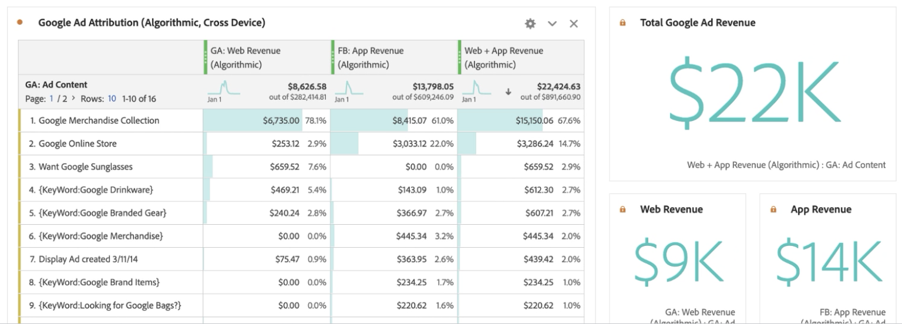

# Rapport sur les données Google Analytics dans Customer Journey Analytics

Maintenant que vous avez [ingéré les données Google Analytics dans Experience Platform et Customer Journey Analytics (CJA)](/help/use-cases/ga-to-cja.md), nous allons vous présenter plusieurs scénarios utiles pour le compte rendu des performances de ces données.

## Visualisation des données web et dʼapplication sous forme de jeux de données combinés

Ce diagramme de Venn montre le chevauchement des utilisateurs de votre site web (à partir de vos données Google Analytics) et de votre application mobile (à partir de vos données Firebase) et de votre centre dʼappel. Vous pouvez également consulter les produits les plus performants, pas seulement sur le web, mais également dans lʼapplication mobile. Vous pouvez également obtenir le chiffre dʼaffaires total des deux, à lʼaide dʼune mesure calculée. Remarquez que les principaux produits racontent une autre histoire lorsque vous regardez les chiffres dʼaffaires combinés. Sans les jeux de données combinés, vous nʼauriez jamais su que la « casquette en sergé » était si performante.

## Identifiez les raisons des appels et réduisez leur volume

Pour vérifier que vous avez reçu beaucoup dʼappels, vous pouvez établir une tendance du temps passé dans notre centre dʼappel au cours des deux derniers mois. Il est facile de voir la tendance à la hausse. Cette situation est préoccupante, car chaque minute passée par les employés de votre centre dʼappel au téléphone vous coûte de lʼargent. Cela peut avoir un impact sur vos résultats.

Examinons les principales raisons à lʼorigine de lʼaugmentation des appels vers le centre dʼappel. Remarquez que « Carte de crédit refusée », « Supprimer la carte de crédit » et « Produit endommagé » sont les principales raisons. Cela peut déjà laisser entrevoir des moyens dʼaméliorer lʼexpérience en ligne. Vous pouvez également établir des tendances pour ces raisons dʼappel et déterminer celles qui ont le plus contribué à la hausse générale. Il est intéressant de constater que les clients ayant un « Produit endommagé » ont passé plus de 3 minutes par appel.

Examinons de plus près quels produits sont à lʼorigine de la plupart des appels à votre centre dʼappel et combien de clients ont passé ces appels. Le graphique à bulles indique que 20 000 personnes ont appelé, passé plus de 4 heures 30 au téléphone et renvoyé 33 unités du produit « T-shirt à manches courtes pour hommes ».

Nous pouvons ventiler cette information et déterminer pourquoi ces personnes ont renvoyé le produit en faisant glisser la dimension « Raison de lʼappel ». Comme vous pouvez le constater, la raison pour laquelle ce produit reçoit autant dʼappels est due à « Produit abîmé ». Lʼétape suivante consisterait à contacter le service de contrôle de la qualité pour savoir pourquoi les clients ont reçu des T-shirts abîmés.

Examinons maintenant les pages du site web qui ont généré les appels entrants au centre dʼappel. Cela vous permet de savoir où se trouvent les expériences peu performantes sur le site web et dʼaider vos responsables de produits à résoudre ces problèmes.

Nous faisons cela des façons suivantes :

* Utilisation dʼune mesure calculée pour filtrer les données jusquʼaux seules sessions qui se sont terminées par un appel au centre dʼappel.
* Utilisation du modèle « participation » dans [Attribution IQ](https://experienceleague.adobe.com/docs/analytics-platform/using/cja-workspace/attribution/models.html?lang=fr#cja-workspace) de CJA.

Vous pouvez facilement identifier les pages qui participent le plus fréquemment à une session qui se termine par un appel. Vous pouvez constater que les pages « Panier » et « Informations sur le paiement » ont généré la plupart des appels. Comme vous avez également inclus les données des applications mobiles Firebase, vous pouvez même voir les erreurs de page et les blocages dʼapplication générant les appels. Il sʼagit dʼun point de données très important si vous souhaitez offrir des expériences web et des applications mobiles exceptionnelles.

Enfin, en utilisant la table de cohorte dans Analysis Workspace, il est facile de déterminer combien de temps il faut généralement aux utilisateurs pour appeler notre centre dʼappel après avoir consulté le site web. Vous pouvez voir ici que la durée moyenne est comprise entre 3 et 4 semaines.

## Utilisation de lʼattribution marketing avancée

CJA vous permet dʼutiliser des modèles dʼattribution sophistiqués sur vos données cross-canal. Dans lʼexemple suivant, vous pouvez comparer les applications de lʼattribution de chiffre dʼaffaires Dernière touche, Première touche, En U et Algorithmique à la dimension Google Analytics Groupes de canaux.

A lʼaide dʼune mesure calculée, vous pouvez appliquer cette attribution à vos chiffres dʼaffaires du web et des applications mobiles, et même supprimer les retours de produits. Ainsi, vous pouvez connaître le chiffre dʼaffaires net réel de chaque canal marketing.

Attribution IQ vous permet également de filtrer facilement vos données. Vous pouvez connaître lʼattribution par rapport à des ensembles spécifiques dʼutilisateurs, tels que ceux qui utilisent plusieurs appareils.

Enfin, vous pouvez également attribuer vos chiffres dʼaffaires du web et des applications à votre contenu Google Ads. Vous remarquerez que vous avez augmenté votre chiffre dʼaffaires grâce à lʼapplication mobile alimentée par Google Ads en ligne plutôt que grâce au web. En triant les annonces en fonction des chiffres dʼaffaires du web et des applications, vous obtenez une image très différente de ce quʼétaient vos annonces Google les plus performantes.

Sans CJA, vous nʼauriez pas pu savoir que vos annonces en ligne avaient un impact sur les produits achetés sur votre application mobile. Vous pouvez maintenant constater que le chiffre dʼaffaires des applications mobiles généré par Google Ads représente entre 14 000 et 5 000 dollars de plus, par rapport au web seul.

