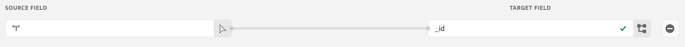

# Envoi de données Google Analytics dans Adobe Experience Platform

Ce cas d’utilisation se concentre sur la manière d’assimiler vos données Google Analytics en tant que jeu de données dans Adobe Experience Platform. Nous expliquons comment ingérer à la fois des données historiques et vivantes. Une fois cette opération terminée, vous pouvez combiner les deux jeux de données dans le Customer Journey Analytics pour obtenir une vue sur plusieurs périphériques du parcours de votre utilisateur.

Les jeux de données de l&#39;Experience Platform sont composés de deux éléments : un schéma et les enregistrements réels dans le jeu de données. Le schéma (nous l’appelons le modèle de données d’expérience ou XDM pour faire court) est semblable aux colonnes du jeu de données et est semblable au modèle ou aux règles qui décrivent les données elles-mêmes. Au sein de la plate-forme, Adobe fournit deux types de schémas :

* Schémas prêts à l’emploi auxquels vous pouvez associer automatiquement vos données Google Analytics (appelés schéma de Événement d’expérience)
* Schémas personnalisés que vous pouvez créer et associer facilement aux données Google Analytics

L’un des aspects les plus puissants du modèle de données d’Adobe est qu’il vous permet de normaliser toutes vos données d’interaction avec la clientèle en un seul schéma commun, ce qui facilite considérablement la mise en jonction des données dans CJA.

## Conditions préalables

Pour accomplir ces tâches, vous devez disposer des autorisations et des droits d’accès suivants :

* Un accès à Adobe Experience Platform
* Accès aux Google Analytics universels (version Google Analytics 360) ou aux Google Analytics 4 (version gratuite ou version Google Analytics 360)
* Accès au Customer Journey Analytics et à ses [autorisations d’administrateur](https://experienceleague.adobe.com/docs/analytics-platform/using/cja-overview/cja-overview.html?lang=fr-FR#admin-access-permissions).

La manière d&#39;importer les données Google Analytics dans Adobe Experience Platform dépend de la version de Google Analytics que vous utilisez :

| Si vous utilisez... | Vous avez aussi besoin de cette licence... | Et fais ça... |
| --- | --- | --- |
| **Analyses universelles** | Google Analytics 360 | Effectuez les étapes 1 à 3 des instructions ci-dessous. |
| **Google Analytics 4** | Version GA gratuite ou Google Analytics 360 | Exécutez les étapes 1 et 3 des instructions ci-dessous. Pas besoin de passer à l&#39;étape 2. |

## Envoi de données historiques (de renvoi)

### 1. Connectez vos données Google Analytics à BigQuery.

Pour plus d&#39;informations, consultez [ces instructions](https://support.google.com/analytics/answer/3416092?hl=en). Notez que ces instructions sont basées sur le Google Analytics universel.

### 2. Transformez les sessions de Google Analytics en événements dans BigQuery et exportez-les vers l’Enregistrement Google Cloud.

>[!IMPORTANT]
>
>Cette étape s’applique uniquement aux clients d’Universal Analytics.

Les données GA stockent chaque enregistrement dans leurs données sous la forme d’une session d’utilisateur plutôt que de événements individuels. Vous devez créer une requête SQL pour transformer les données Universal Analytics en un format compatible Experience Platform. Vous appliquez la fonction &quot;unnest&quot; au champ &quot;hits&quot; dans le schéma GA. Voici l&#39;exemple SQL que vous pouvez utiliser :

`SELECT
*,
timestamp_seconds(`` + hit.time) AS `` 
FROM
(
SELECT
fullVisitorId,
visitNumber,
visitId,
visitStartTime,
trafficSource,
socialEngagementType,
channelGrouping,
device,
geoNetwork,
hit 
FROM
`visitStartTimetimestampyour_bq_table_2021_04_*`,
UNNEST(hits) AS hit 
)`

Une fois la requête terminée, enregistrez les résultats complets dans un tableau BigQuery.

Reportez-vous à [ces instructions](https://support.google.com/analytics/answer/7029846?hl=en&amp;ref_topic=9359001#zippy=%2Cold-export-schema%2Cuse-this-script-to-migrate-existing-bigquery-datasets-from-the-old-export-schema-to-the-new-one%2Cscript-migration-scriptsql), qui incluent des instructions sur la requête SQL.

La vidéo suivante explique également l’étape suivante, qui consiste à exporter les événements Google Analytics vers l’Enregistrement Google Cloud au format JSON. Il vous suffit de cliquer sur **Exporter > Exporter vers GCS**. Une fois là, les données sont prêtes à être extraites à Adobe Experience Platform.

>[!VIDEO](https://video.tv.adobe.com/v/332634)

### 3. Importez les données de l’Enregistrement Google Cloud dans l’Experience Platform et mappez-les au schéma XDM.

Dans l’Experience Platform, sélectionnez **[!UICONTROL Sources]** et recherchez l’option **[!UICONTROL Enregistrement Google Cloud]**. A partir de là, il vous suffit de trouver le jeu de données que vous avez enregistré à partir de BigQuery.

N’oubliez pas ce qui suit :

* Veillez à sélectionner le format JSON.
* Vous pouvez sélectionner un jeu de données existant ou en créer un nouveau (recommandé).
* Veillez à sélectionner le même schéma pour les données Google Analytics historiques et les données Google Analytics en flux continu en direct, même si elles se trouvent dans des jeux de données distincts. Vous pouvez ensuite fusionner les jeux de données dans une connexion [CJA](/help/connections/combined-dataset.md).

Pour obtenir des instructions, vue cette vidéo :

>[!VIDEO](https://video.tv.adobe.com/v/332676)

Vous pouvez mapper les données du événement GA dans un jeu de données existant que vous avez créé précédemment, ou créer un nouveau jeu de données, en utilisant le schéma XDM de votre choix. Une fois que vous avez sélectionné le schéma, l’Experience Platform applique l’apprentissage automatique pour prémapper automatiquement chacun des champs des données Google Analytics à votre schéma [XDM](https://experienceleague.adobe.com/docs/experience-platform/xdm/home.html?lang=en#ui).

Les mappages sont très faciles à modifier et vous pouvez même créer des champs dérivés ou calculés à partir des données Google Analytics. Une fois que vous avez terminé de mapper les champs dans votre schéma XDM, vous pouvez planifier cette importation de manière récurrente et appliquer une validation d&#39;erreur pendant le processus d&#39;assimilation. Cela permet de s’assurer qu’il n’y a aucun problème avec les données que vous avez importées.

**Champ calculé &quot;Horodatage&quot;**

Pour le champ de schéma `timestamp` dans les données Google Analytics, vous devez créer un champ calculé spécial dans l’interface utilisateur du schéma Experience Platform. Cliquez sur **[!UICONTROL Ajouter le champ calculé]** et placez la chaîne `timestamp` dans une fonction `date` comme suit :

`date(timestamp, "yyyy-MM-dd HH:mm:ssZ")`

Vous devez ensuite enregistrer ce champ calculé dans la structure des données d’horodatage du schéma :

**Champ calculé &#39;_id&#39;**

Le champ de schéma `_id` doit comporter une valeur - CJA ne se soucie pas de la valeur. Vous pouvez simplement ajouter un &quot;1&quot; au champ :

## Envoi de données Google Analytics en flux continu en direct

Vous pouvez également capturer des événements de flux continu en direct depuis Google Tag Manager directement vers Adobe Experience Platform.

### 1. Ajouter des variables personnalisées

Après vous être connecté au compte Google Tag Manager, vous devez ajouter certaines variables constantes personnalisées liées à l’Adobe. Vous disposez probablement déjà de variables dans Google Tag Manager qui sont envoyées à Google Analytics, telles que l’adresse électronique du client, le nom du client, la langue et l’état de connexion du client. Vous devez définir 5 nouvelles variables personnalisées :

* ID d’organisation Adobe Experience Cloud
* Point de terminaison DCS Streaming
* ID de jeu de données Experience Platform
* Schéma de référence
* Horodatage de page

L’obtention de ces valeurs permet de s’assurer que toutes les données Google Analytics sont envoyées au jeu de données correct et qu’elles disposent du schéma approprié. Si vous ne connaissez pas votre organisation d’Experience Cloud ou l’une des autres variables que nous venons de mentionner, votre gestionnaire de compte d’Adobe peut vous aider à effectuer le suivi.

Une fois que vous avez défini ces variables personnalisées, nous pouvons configurer un déclencheur pour envoyer également à l&#39;Experience Platform toutes les données que vous envoyez déjà aux Google Analytics.

### 2. Configuration d’un déclencheur dans Google Tag Manager

Dans cet exemple, le déclencheur &quot;Création de compte&quot; a été défini, où `pageUrl equals account-creation` est défini. En ajoutant des informations à ce déclencheur, vous pouvez vous assurer que lorsque l’utilisateur s’authentifie et que la page de création de compte se charge, les données sont envoyées aux Google Analytics et aux AEP.

Vous pouvez également consulter [Data Ingestion et Google Tag Manager](https://experienceleague.adobe.com/docs/platform-learn/comprehensive-technical-tutorial/module9/data-ingestion-using-google-tag-manager-and-google-analytics.html?lang=en#module9).

Pour obtenir des instructions, vue cette vidéo :

>[!VIDEO](https://video.tv.adobe.com/v/332668)

## Créer une connexion dans CJA au jeu de données Google Analytics

Une fois que le Adobe Experience Platform a commencé à recevoir les données Google Analytics en direct et que vous avez renversé les données Google Analytics historiques de BigQuery, vous êtes prêt à sauter dans CJA et [créer votre première connexion](/help/connections/create-connection.md). Cette connexion rassemble les données GA avec toutes les autres données client à l’aide d’un &quot;ID client&quot; commun.

## Étapes suivantes

* Création d’une vue de données basée sur des données Google Analytics
Ensuite, vous [créez une vue de données](https://experienceleague.adobe.com/docs/analytics-platform/using/cja-dataviews/create-dataview.html?lang=en#cja-dataviews) dans CJA, en fonction de la connexion qui contient les données Google Analytics.

* Faites une analyse étonnante dans [Workspace](https://experienceleague.adobe.com/docs/analytics-platform/using/cja-workspace/home.html?lang=en#cja-workspace). Vérifiez plus tard si certains cas d&#39;utilisation de rapports ont été signalés.