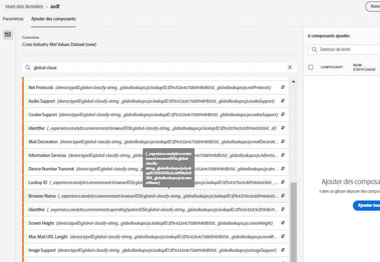
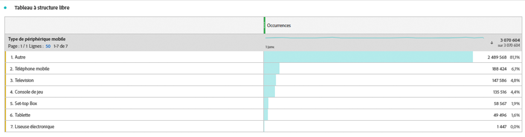

# Ajouter des recherches globales à vos jeux de données

Les recherches globales améliorent la capacité de Customer Journey Analytics à rendre compte de certaines dimensions ou attributs qui ne sont pas utiles en soi, mais qui le sont lorsqu’ils sont associés à d’autres données. Il s’agit par exemple des attributs des appareils mobiles et des attributs des dimensions du système d’exploitation et du navigateur, tels que les numéros de version des navigateurs. Une recherche globale est similaire à un ensemble de données de recherche. Les recherches globales s’appliquent à toutes les organisations Experience Cloud. Elles sont automatiquement appliquées à tous les jeux de données de événement qui contiennent certains champs de schéma XDM (voir ci-dessous pour les champs spécifiques). Il existe un jeu de données de recherche global pour chaque emplacement de schéma que l&#39;Adobe classe.

Dans Adobe Analytics traditionnel, ces dimensions s’affichent par elles-mêmes, alors que dans CJA, vous devez les inclure activement lorsque vous créez des vues de données. Dans le processus Connexions, vous sélectionnez un jeu de données marqué comme un jeu avec une clé pour la recherche globale. L’interface utilisateur des Vues de données sait automatiquement inclure toutes les dimensions de recherche globale disponibles pour le rapports. Les fichiers de recherche sont automatiquement tenus à jour et disponibles, dans toutes les régions et pour tous les comptes. Ils sont stockés dans des organisations spécifiques à une région associées au client.

## Utilisation des recherches globales avec des jeux de données d’Adobe Data Connector

Les jeux de données de recherche globale sont automatiquement appliqués au moment du compte-rendu. Si vous utilisez le connecteur de données Analytics et que vous importez une dimension pour laquelle l’Adobe fournit une recherche globale, nous appliquons automatiquement cette recherche globale. Si un jeu de données d’événement contient des champs XDM, nous pouvons lui appliquer des recherches globales.

## Champs de recherche globale disponibles

* `browser`
   * `browser`, `group_id`, `id`
* `browser_group`
   * `browser_group`, `id`
* `os`
   * `os`,  `group_id`,  `id`
* `os_group`
   * `os_group`,  `id`
* `mobile_audio_support - multi`
* `mobile_color_depth`
* `mobile_cookie_support`
* `mobile_device_name`
* `mobile_device_number_transmit`
* `mobile_device_type`
* `mobile_drm - multi`
* `mobile_image_support - multi`
* `mobile_information_services`
* `mobile_java_vm - multi`
* `mobile_mail_decoration`
* `mobile_manufacturer`
* `mobile_max_bookmark_url_length`
* `mobile_max_browser_url_length`
* `mobile_max_mail_url_length`
* `mobile_net_protocols - multi`
* `mobile_os`
* `mobile_push_to_talk`
* `mobile_screen_height`
* `mobile_screen_size`
* `mobile_screen_width`
* `mobile_video_support - multi`

## Compte-rendu sur les dimensions de recherche globale

Pour signaler les dimensions de recherche globale, vous devez les ajouter lorsque vous créez une vue de données dans Customer Journey Analytics :

Vous pouvez ensuite afficher les données de recherche dans Workspace :

