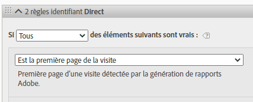
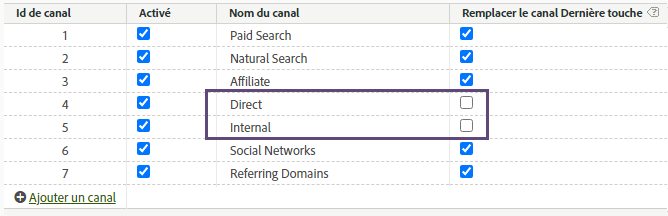
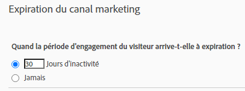

# Utilisation des dimensions de canal marketing dans Adobe Experience Platform

Si votre organisation utilise [Analytics Data Connector](https://experienceleague.adobe.com/docs/experience-platform/sources/connectors/adobe-applications/analytics.html?lang=fr) pour importer les données des suites de rapports dans CJA, vous pouvez configurer une connexion dans CJA pour obtenir un rapport sur les dimensions de canal marketing.

## Conditions préalables

* Les données des suites de rapports doivent déjà être importées dans Adobe Experience Platform à l’aide de [Analytics Data Connector](https://experienceleague.adobe.com/docs/experience-platform/sources/connectors/adobe-applications/analytics.html). Les autres sources de données ne sont pas prises en charge, car les canaux marketing dépendent des règles de traitement d’une suite de rapports Analytics.
* Les règles de traitement de canal marketing doivent déjà être configurées. Voir les [Règles de traitement pour les canaux marketing](https://experienceleague.adobe.com/docs/analytics/components/marketing-channels/c-rules.html?lang=fr) dans le guide des composants Analytics traditionnels.

## Éléments de schéma de canal marketing

Une fois Analytics Data Connector établi sur une suite de rapports souhaitée, un schéma XDM est créé pour vous. Ce schéma contient toutes les dimensions et mesures Analytics sous forme de données brutes. Ces données brutes ne contiennent ni attribution ni persistance. Au lieu de cela, chaque événement s’exécute à travers les règles de traitement de canal marketing et enregistre la première règle correspondante. Vous spécifiez l’attribution et la persistance lors de la création d’une vue de données dans CJA.

1. [Créez une connexion](/help/connections/create-connection.md) qui inclut un jeu de données basé sur Analytics Data Connector.
2. [Créez une vue de données](/help/data-views/create-dataview.md) qui inclut les dimensions suivantes :
   * **`channel.typeAtSource`** : équivalente à la dimension [Canal marketing](https://experienceleague.adobe.com/docs/analytics/components/dimensions/marketing-channel.html?lang=fr-FR).
   * **`channel._id`** : équivalente à la dimension [Détails du canal marketing](https://experienceleague.adobe.com/docs/analytics/components/dimensions/marketing-detail.html?lang=fr).
3. Attribuez à chaque dimension le modèle d’attribution et la persistance souhaités. Pour obtenir des dimensions First Touch et Last Touch, faites glisser plusieurs fois chaque dimension de canal marketing vers la zone de composants. Attribuez à chaque dimension le modèle d’attribution et la persistance souhaités. Adobe recommande également d’attribuer un nom d’affichage à chaque dimension afin d’en faciliter l’utilisation dans Espace de travail.
4. Créez la vue de données.

Vos dimensions de canal marketing sont désormais disponibles dans Analysis Workspace.

## Différences de traitement et d’architecture

>[!IMPORTANT]
>
>Il existe plusieurs différences fondamentales entre les données des suites de rapports et les données de Platform. Adobe recommande vivement d’adapter les règles de traitement de canal marketing de votre suite de rapports afin de faciliter la collecte de données dans Platform.

Les paramètres de canal marketing fonctionnent de façon différente sur les données de Platform et les données des suites de rapports. Tenez compte des différences suivantes lors de la configuration des canaux marketing pour CJA :

* **Est la première page de la visite** : ce critère de règle est commun à plusieurs définitions de canal marketing par défaut. Toute règle de traitement qui contient ce critère est ignorée dans Platform (les autres critères de ladite règle s’appliquent toujours). La détermination des sessions s’effectue au moment de la requête des données plutôt qu’au moment de leur collecte, ce qui empêche Platform d’utiliser ces critères de règle spécifiques. Adobe recommande de supprimer le critère « Est la première page de la visite » de chaque règle de traitement de canal marketing.

   

* **Remplacer le canal Last Touch** : ce paramètre du gestionnaire de canaux marketing empêche normalement certains canaux d’obtenir le crédit de canal Last Touch. Platform ignore ce paramètre, ce qui permet à de larges canaux comme « Direct » ou « Interne » d’attribuer des attributs à des mesures de manière potentiellement indésirable. Adobe recommande de supprimer les canaux pour lesquels l’option « Remplacer le canal Last Touch » est décochée.
   * Vous pouvez supprimer le canal marketing « Direct » dans le gestionnaire de canaux marketing, puis dépendre de l’élément de dimension « Aucune valeur » de CJA pour ce canal. Vous pouvez également renommer cet élément de dimension en « Direct » ou l’exclure entièrement lors de la configuration d’une vue de données.
   * Par ailleurs, vous pouvez créer une classification de canal marketing en classant chaque valeur comme elle-même, à l’exception des canaux que vous souhaitez exclure dans CJA. Vous pouvez ensuite utiliser cette dimension de classification à la place de `channel.typeAtSource` lors de la création d’une vue de données.

   

* **Expiration du canal marketing** : ce paramètre relatif à la période d’engagement détermine la période d’inactivité requise avant qu’un visiteur puisse obtenir un nouveau canal First Touch dans les données de la suite de rapports. Platform utilise ses propres paramètres d’attribution. Par conséquent, ce paramètre est totalement ignoré dans CJA.

   

## Comparaison entre les données CJA et celles traditionnellement utilisées dans Analytics

L’architecture d’Adobe Experience Platform étant différente d’une suite de rapports Analytics traditionnelle, les résultats peuvent ne pas correspondre. Toutefois, vous pouvez suivre les conseils ci-dessous pour faciliter cette comparaison :

* Vérifiez que les différences architecturales répertoriées ci-dessus n’affectent pas votre comparaison. Cette opération inclut la suppression des canaux qui ne chevauchent pas le canal Last Touch ainsi que celle des critères de règle qui sont le premier accès d’une visite (session).
* Vérifiez à nouveau que votre connexion utilise la même suite de rapports que celle traditionnellement utilisée dans Analytics. Si votre connexion CJA comporte plusieurs suites de rapports dotées de leurs propres règles de traitement de canal marketing, il ne sera pas facile de la comparer à celle traditionnellement utilisée dans Analytics. Créez une connexion distincte pour chaque suite de rapports afin de comparer les données.
* Assurez-vous de comparer les mêmes périodes et que le paramètre de fuseau horaire défini dans votre vue de données est identique à celui de la suite de rapports.
* Utilisez un modèle d’attribution personnalisé lors de l’affichage des données d’une suite de rapports. Par exemple, utilisez la dimension [Canal marketing](https://experienceleague.adobe.com/docs/analytics/components/dimensions/marketing-channel.html) avec des mesures qui utilisent un modèle d’attribution autre que celui par défaut. Adobe déconseille de comparer le [canal First Touch](https://experienceleague.adobe.com/docs/analytics/components/dimensions/first-touch-channel.html?lang=fr-FR) ou le [canal Last Touch](https://experienceleague.adobe.com/docs/analytics/components/dimensions/last-touch-channel.html?lang=fr-FR) aux dimensions par défaut, car ils dépendent de l’attribution collectée dans la suite de rapports. CJA ne dépend pas des données d’attribution d’une suite de rapports. Elles sont calculées lors de l’exécution d’un rapport CJA.
* Certaines mesures ne présentent pas de comparaison raisonnable en raison des différences architecturales entre les données de la suite de rapports et celles de Platform. Par exemple, les visites/sessions, les visiteurs/personnes et les occurrences/événements.
