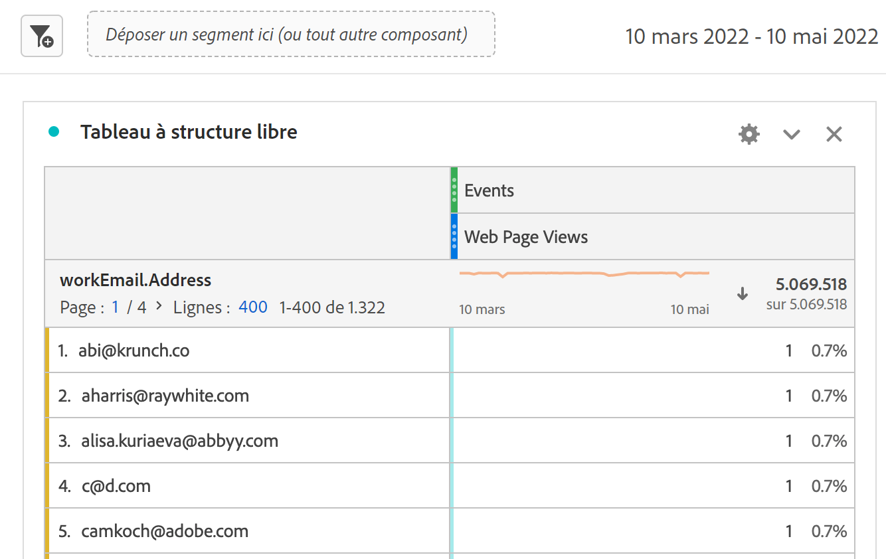

# Ingestion de données Marketo Engage dans AEP et création de rapports dans CJA

Vous pouvez tirer parti des nouveaux jeux de données de Marketo Engage disponibles dans Adobe Experience Platform (AEP) pour fournir des solutions d’analyse et de création de rapports utiles aux spécialistes du marketing B2B. Créez ensuite un rapport sur ces jeux de données en Customer Journey Analytics (CJA).

## Étape 1 : Mappage des champs de données source Marketo à leurs cibles XDM

Faites correspondre la variable [Personnes](https://experienceleague.adobe.com/docs/experience-platform/sources/connectors/adobe-applications/mapping/marketo.html?lang=en#persons) et [Activités](https://experienceleague.adobe.com/docs/experience-platform/sources/connectors/adobe-applications/mapping/marketo.html?lang=en#activities) à leurs champs cibles de schéma XDM respectifs.

## Étape 2 : Ingestion de données Marketo dans AEP

Utilisez la variable [Connecteur Marketo Engage](https://experienceleague.adobe.com/docs/experience-platform/sources/connectors/adobe-applications/marketo/marketo.html?lang=en) pour importer les données de Marketo vers Experience Platform et les tenir à jour à l’aide des applications connectées à Platform.

## Étape 3 : Configurer une connexion à ce jeu de données dans CJA

Pour générer des rapports sur des jeux de données Experience Platform, vous devez d’abord établir une connexion entre les jeux de données dans Experience Platform et CJA. Pour plus d’informations sous [Création d’une connexion](https://experienceleague.adobe.com/docs/analytics-platform/using/cja-connections/create-connection.html?lang=fr).

## Étape 4 : Créer une ou plusieurs vues de données

A [vue des données](/help/data-views/data-views.md) est un conteneur spécifique à Customer Journey Analytics qui vous permet de déterminer comment interpréter les données d’une connexion. Il spécifie toutes les dimensions et mesures disponibles dans Analysis Workspace, dans ce cas, les mesures et dimensions spécifiques à Marketo. Il spécifie également les colonnes à partir desquelles ces dimensions et mesures obtiennent leurs données. Les vues de données sont définies en vue de la création de comptes rendus des performances dans Analysis Workspace.

## Étape 5 : Rapport dans Analysis Workspace

Voici un exemple d’utilisation que vous pouvez explorer : Combien de visites de pages web par pistes avions-nous d’avril à juin 2020 ?

1. Ouvrir [Espace de travail Analytics](/help/analysis-workspace/home.md) et créez un projet.
Les clients disposant de la plateforme de données clients B2B/B2P peuvent réaliser une analyse de type B2C dans CJA. Les objets B2B ne sont pas encore disponibles.

1. Créez un [filter](/help/components/filters/create-filters.md) pour les pages vues web comme suit - Type d’événement = web.webpagedetails.pageViews :

   

1. Dans le tableau à structure libre, extrayez le filtre que vous avez créé - Pages vues web, puis insérez la période Mois. Vous obtenez ainsi les visites des pages Web par prospects chaque mois :

   

1. Vous pouvez également extraire les dimensions suivantes : Clé de personne ou adresse électronique de travail. Vous obtenez ainsi les visites des pages Web par chaque piste :

   
