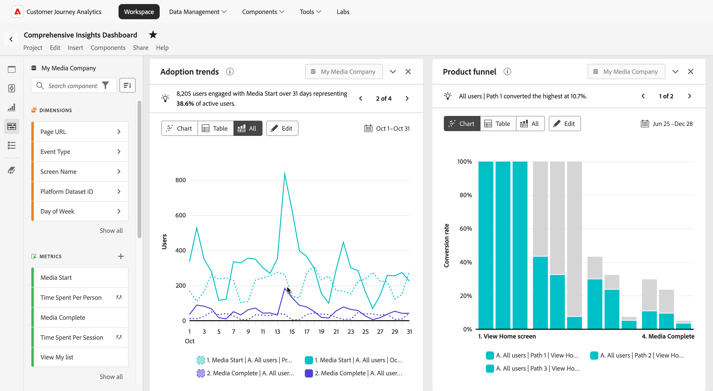

# Analyse de produit dans Customer Journey Analytics

L’analyse de produit est le processus de compréhension de la manière dont les utilisateurs interagissent avec votre produit à chaque étape de leur parcours. Elle implique l’analyse des données pour découvrir des informations sur le comportement des utilisateurs, les performances des produits et les opportunités de croissance. Une analyse efficace des produits aide les équipes à prendre des décisions éclairées pour améliorer les expériences utilisateur, stimuler l’engagement et atteindre les objectifs commerciaux.

Customer Journey Analytics fournit aux équipes les outils nécessaires pour analyser et optimiser les expériences produit avec les fonctionnalités suivantes :

* **Gérer les données de produit à grande échelle** : ingérez, transformez et gérez facilement les données de produit pour répondre aux besoins de votre entreprise, en garantissant des informations fiables.
* **Mesurer l’acquisition et l’activation** : suivez la manière dont les nouveaux utilisateurs découvrent votre produit et participent aux premiers événements porteurs de valeur.
* **Mesurer l’engagement et l’adoption** : comprenez comment les utilisateurs progressent dans la funnel du produit, identifiez les points de friction et suivez l’adoption des fonctionnalités clés.
* **Mesurer le taux de rétention et de perte de clientèle** : analysez le taux de rétention des utilisateurs au fil du temps, identifiez les indicateurs de perte de clientèle et élaborez des stratégies pour réduire le taux de chute et accroître la fidélité.
* **Informations sur les produits d’action** : transformez les informations basées sur les données en stratégies exploitables pour améliorer l’expérience utilisateur et stimuler la croissance durable des produits.
* **Partagez des informations avec votre organisation** : communiquez les résultats clés entre les équipes afin d’aligner les efforts, de favoriser la collaboration et de vous assurer que tout le monde travaille à l’atteinte des objectifs communs pour les produits et l’entreprise.

En tirant parti de ces fonctionnalités, Customer Journey Analytics vous permet de libérer tout le potentiel de votre produit et de créer une approche transparente et axée sur les données pour stimuler le succès des utilisateurs et des entreprises.

## Gestion des données de produit à grande échelle

Des données précises sur les produits sont la pierre angulaire d&#39;une analyse efficace des produits. L’ingestion de données fait référence au processus d’instrumentation et de collecte de données de produit, tandis que la gestion des données implique la transformation et la maintenance de ces données pour s’assurer qu’elles répondent à vos besoins en matière d’analyse.

Les fonctionnalités suivantes de Adobe Experience Platform et Customer Journey Analytics vous permettent d’ingérer et de gérer vos données de produit à grande échelle :

* Adobe Experience Platform
   * [Jeux de données](https://experienceleague.adobe.com/fr/docs/experience-platform/catalog/datasets/overview)
   * [Préparation des données](https://experienceleague.adobe.com/fr/docs/experience-platform/data-prep/home)
   * [Data Distiller](https://experienceleague.adobe.com/fr/docs/experience-platform/query/data-distiller/overview)
* Customer Journey Analytics
   * [Connexions](/help/connections/overview.md)
   * [Vues de données](/help/data-views/data-views.md), y compris [champs dérivés&#x200B;](/help/data-views/derived-fields/derived-fields.md)
   * [Segments](/help/components/segments/seg-overview.md)
   * [Mesures calculées](/help/components/calc-metrics/calc-metr-overview.md)
   * [Analyse guidée : Chronologie](/help/guided-analysis/types/timeline.md)

## Acquisition et activation des mesures

La croissance du produit repose sur des informations exploitables issues de la haute technologie funnel qui attirent de nouveaux utilisateurs, révèlent les chemins de conversion et éliminent les frictions le long du parcours.

* L’acquisition permet de suivre les nouveaux utilisateurs qui accèdent à votre produit, y compris la manière dont ils arrivent et les efforts les plus ou les moins efficaces.
* L’activation surveille les nouveaux utilisateurs qui interagissent avec votre premier événement de valeur, défini en fonction de vos objectifs spécifiques.

Les fonctionnalités suivantes de Customer Journey Analytics vous permettent de mesurer efficacement l’acquisition et l’activation :

* [Analyse guidée : Croissance active](/help/guided-analysis/types/active-growth.md)
* [Analyse guidée : Croissance nette](/help/guided-analysis/types/net-growth.md)
* [Analyse guidée : Tendances](/help/guided-analysis//types/trends.md)
* [Panneau Attribution](/help/analysis-workspace/c-panels/attribution.md)
* [Tableau à structure libre](/help/analysis-workspace/c-panels/freeform-panel.md) qui inclut la dimension de canal marketing (création à l’aide d’un [champ dérivé](/help/data-views/derived-fields/derived-fields.md))

## Mesurer l’engagement et l’adoption

L’acquisition de nouveaux utilisateurs étend la partie supérieure de votre funnel de produit. L’engagement se concentre sur l’orientation de ces utilisateurs et utilisatrices vers le bas du funnel et sur la suppression des obstacles à leur réussite. Leur succès stimule directement le succès de votre entreprise.

Les fonctionnalités suivantes de Customer Journey Analytics vous aident à suivre l’engagement et l’adoption des produits :

* [Analyse guidée : engagement](/help/guided-analysis/types/engagement.md)
* [Analyse guidée : Tendances](/help/guided-analysis/types/trends.md)
* [Analyse guidée : Fréquence](/help/guided-analysis/types/frequency.md)
* [Analyse guidée : Funnel](/help/guided-analysis/types/funnel.md)
* [Analyse guidée : Tendances de conversion](/help/guided-analysis/types/conversion-trends.md)
* [Analyse guidée : impact des versions](/help/guided-analysis/types/release-impact.md)
* [Analyse guidée : impact de la première utilisation](/help/guided-analysis/types/first-use-impact.md)
* [Analyse guidée : Chronologie](/help/guided-analysis/types/timeline.md)
* [Tableaux à structure libre](/help/analysis-workspace/c-panels/freeform-panel.md)
* [Flux](/help/analysis-workspace/visualizations/c-flow/flow.md)

## Mesurer la rétention et l’attrition

La rétention mesure le nombre d’utilisateurs qui continuent à utiliser le produit après l’acquisition et l’activation initiales. Les produits hautement performants maintiennent une base d’utilisateurs stable et fidèle en maximisant l’interaction avec les fonctionnalités qui sont le plus fortement corrélées à l’utilisation continue. Un utilisateur conservé revient au produit et interagit avec celui-ci au fil du temps, contrairement à un utilisateur résilié. Les équipes produit effectuent le suivi de la fidélisation pour identifier les fonctionnalités qui stimulent l’engagement continu et conçoivent des interventions qui orientent les utilisateurs résiliés vers le comportement de l’utilisateur retenu.

Les fonctionnalités suivantes de Customer Journey Analytics vous permettent de suivre efficacement la rétention et l’attrition :

* [Analyse guidée : Rétention](/help/guided-analysis/types/retention.md)
* [Analyse guidée : Croissance active](/help/guided-analysis/types/active-growth.md)
* [Analyse guidée : Croissance nette](/help/guided-analysis/types/net-growth.md)
* [Table de cohorte](/help/analysis-workspace/visualizations/cohort-table/cohort-analysis.md)

## Informations sur les produits exploitables

Les informations n’offrent de valeur que lorsqu’elles pilotent l’action. Convertissez les résultats d’analyse en actions qui améliorent l’expérience client et prennent en charge la croissance à long terme du produit.

Les fonctionnalités suivantes de CX Enterprise vous permettent d’agir efficacement sur les insights :

* [Création et publication d’audiences](/help/components/audiences/publish.md) pour activation à partir de Customer Journey Analytics
* Activer les audiences via les produits CX Enterprise :
   * [Exécutez des expériences](https://experienceleague.adobe.com/fr/docs/journey-optimizer/using/content-management/content-experiment/get-started-experiment) dans AJO et Adobe Target, et mesurez l’impact des variations dans Customer Journey Analytics à l’aide du [panneau Expérimentation](/help/analysis-workspace/c-panels/experimentation.md)
   * [Diffuser des engagements in-app](https://experienceleague.adobe.com/fr/docs/journey-optimizer/using/channels/in-app/get-started-in-app) aux utilisateurs dans AJO.
* [Activer des audiences](https://experienceleague.adobe.com/fr/docs/experience-platform/destinations/ui/activate/activation-overview) vers des destinations externes avec la plateforme de données clients en temps réel d’Adobe.

## Partager des informations avec l’organisation

Communiquez les résultats clés entre les équipes afin d’aligner les efforts, de favoriser la collaboration et de vous assurer que tout le monde travaille à l’atteinte des objectifs communs des produits et des entreprises.

Les fonctionnalités suivantes de Customer Journey Analytics vous aident à partager efficacement des informations :

* [Partage](/help/analysis-workspace/curate-share/share-projects.md) vues d’analyse guidée adaptées à des questions commerciales spécifiques, permettant aux consommateurs de se servir de leur prochaine question
* Combinez des analyses guidées, des panneaux et des visualisations dans un tableau de bord complet dans [&#128279;](/help/analysis-workspace/home.md)
* Créez une [carte de performance mobile](/help/mobile-app/home.md) avec des informations clés sur les produits pour les dirigeants et les autres consommateurs en déplacement
