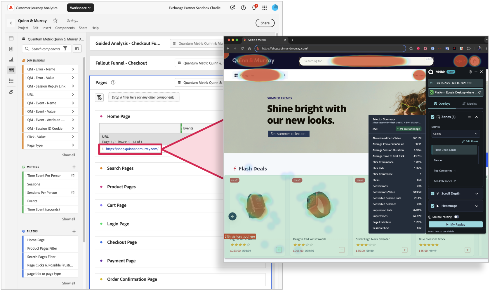

# Utiliser des cartes thermiques de mesure quantique avec Customer Journey Analytics

La liaison de la correspondance de chaleur de Quantum Metric aux données CJA permet de mieux comprendre l’engagement au niveau des pages et d’optimiser les pages en fonction du comportement des consommateurs. Workspace peut être utilisé pour comprendre les flux d’utilisateurs consommateurs et consommatrices et pour voir quels chemins les consommateurs et consommatrices suivent d’une page à l’autre. Vous pouvez ensuite cliquer sur les URL de page liées pour afficher une carte thermique de la manière dont les utilisateurs et utilisatrices interagissent avec le contenu. En associant Quantum Metric Heatmapping à CJA, vous pouvez désormais associer des interactions au niveau de la page à des résultats commerciaux, faisant passer votre analyse au niveau supérieur.

Le tableau renvoie toutes les sessions de ce segment. Vous pouvez cliquer sur l’une d’elles pour l’explorer davantage dans AEM.  Pour en savoir plus sur la relecture de session de Quantum Metric, consultez https://www.quantummetric.com/platform/session-replay

## Conditions préalables

Pour accéder aux fonctionnalités de carte thermique de Quantum Metric, vous devez disposer du package **UX Ops**.

## Étape 1 : Configurer les liens dans Analysis Workspace

1. Connectez-vous à [experience.adobe.com](https://experience.adobe.com).
1. Accédez à Customer Journey Analytics, puis sélectionnez **[!UICONTROL Workspace]** dans le menu supérieur.
1. Sélectionnez un projet existant ou créez-en un.
1. Créez un [tableau à structure libre](/help/analysis-workspace/visualizations/freeform-table/freeform-table.md).
1. Faites glisser la dimension URL de la page vers la zone de travail Workspace.
1. Cliquez avec le bouton droit sur l’en-tête de colonne de dimension, puis sélectionnez **[!UICONTROL Créer des liens hypertexte pour tous les éléments de dimension]**.
1. Sélectionnez **[!UICONTROL Créer une URL personnalisée]**.
1. Collez la structure d’URL suivante :

   ```
   $value?qm-visible=true
   ```

1. Cliquez sur **[!UICONTROL Créer]**.
1. Testez l’un des liens pour voir s’il s’ouvre dans l’URL avec l’extension Quantum Metric visible. Ces liens s’ouvrent dans un nouvel onglet afin que votre projet Workspace reste ouvert.



## Étape 2 : affichage des cartes thermiques en cliquant sur les liens dans Customer Journey Analytics

Une fois que vous avez trouvé une page que vous souhaitez explorer en matière de carte thermique, vous pouvez l’appliquer au panneau de votre choix. Le tableau renvoie une URL qui vous permet d’explorer les cartes thermiques, la profondeur de défilement et les zones clés d’interaction à l’aide de la mesure quantique. Voir [Présentation du produit Carte thermique Quantum Metric](https://www.quantummetric.com/platform/interaction-heatmaps) pour plus d’informations. Vous pouvez également contacter votre représentant du service clientèle de Quantum Metric ou soumettre une demande par le biais du portail [Quantum Metric Customer Request](https://community.quantummetric.com/s/public-support-page).
